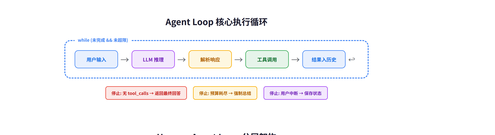
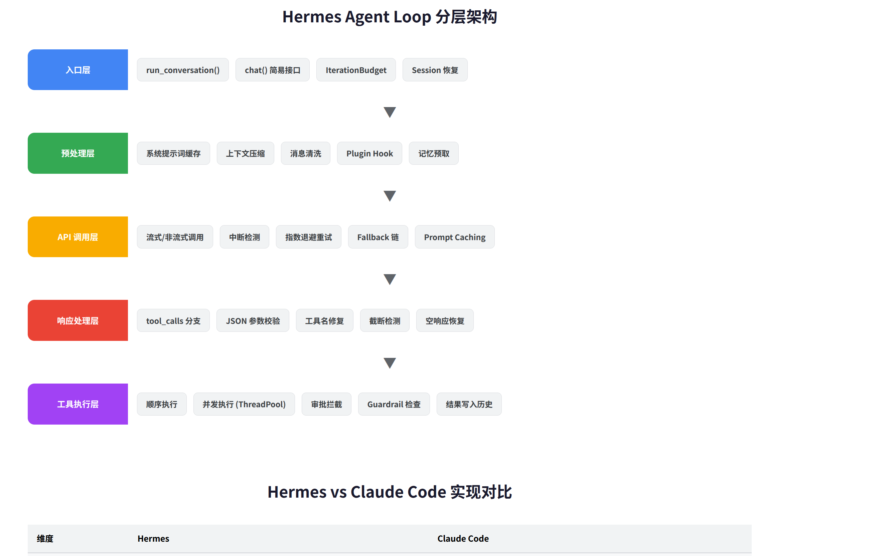
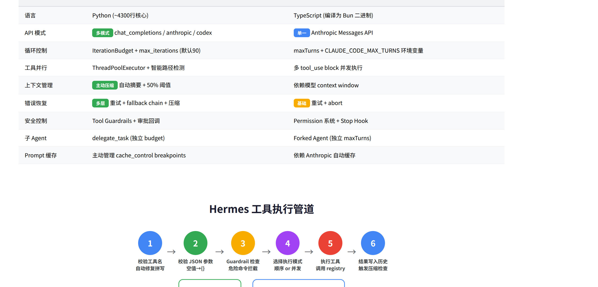

# Agent Loop 源码实现深度对比：Hermes vs Claude Code

> Agent Loop 本质是一个 while 循环——但 Hermes 用 4300 行 Python 把它做成了一个容错、多平台、多 provider 的工业级引擎；Claude Code 用编译后的 TypeScript 把它做成了一个轻量专注的编码助手。两者的设计哲学截然不同。

> 调研日期：2026-06-24

---

## 目录

1. [概述](#1-概述)
2. [Agent Loop 核心范式](#2-agent-loop-核心范式)
3. [Hermes 源码实现](#3-hermes-源码实现)
4. [Claude Code 实现分析](#4-claude-code-实现分析)
5. [关键维度对比](#5-关键维度对比)
6. [批判性分析](#6-批判性分析)
7. [总结与启示](#7-总结与启示)

---

## 1. 概述

本次调研从三个维度展开：互联网公开资料、Hermes Agent 源码（Python，开源）、Claude Code 二进制逆向分析（TypeScript 编译为 Bun 二进制）。目标是理解 Agent Loop 在真实产品中的工程实现，而非停留在概念层面。

| 调研对象 | 版本 | 代码规模 | 可读性 |
|----------|------|---------|--------|
| Hermes Agent | 最新 main 分支 | `conversation_loop.py` ~4300 行 + `run_agent.py` ~4400 行 | 完整源码 |
| Claude Code | v2.1.160 | 编译后 Bun 二进制 (~128KB SDK 类型定义) | strings 提取 + 推断 |
| 互联网资料 | 2026 年 6 月 | Anthropic 官方文档 + 社区分析 | 公开可查 |

---

## 2. Agent Loop 核心范式



所有 Agent Loop 的核心都是一个 **ReAct 循环**（Yao et al., 2022）：LLM 接收上下文后决定调用工具，工具执行结果返回后 LLM 再次推理，直到判断任务完成。这个循环的控制变量有三个：

| 控制变量 | 含义 | 典型值 |
|----------|------|--------|
| 最大迭代次数 | 防止无限循环的安全网 | 50-100 次 |
| 预算系统 | token 消耗或成本上限 | 按 token/金额计 |
| 中断信号 | 用户主动打断或超时 | 外部事件触发 |

循环的退出条件只有两种：模型返回纯文本（无 tool_calls）= 任务完成；触发控制变量 = 强制终止。这个模式看起来简单，但围绕它的错误恢复、上下文管理、安全控制才是工程复杂度所在。

---

## 3. Hermes 源码实现

### 3.1 整体架构



Hermes 的 Agent Loop 实现在 `agent/conversation_loop.py` 中，从 `run_agent.py` 的 `AIAgent.run_conversation()` 转发调用。整个循环分为 5 层，每层都有独立的错误处理和恢复机制。

### 3.2 主循环入口

循环的核心条件：

```
while (api_call_count < max_iterations AND budget.remaining > 0)
    OR _budget_grace_call
```

`_budget_grace_call` 是一个精巧的设计：当预算恰好耗尽时，给模型最后一次机会完成回答，避免在模型即将输出最终答案时被截断。

### 3.3 每轮迭代流程

| 步骤 | 功能 | 关键设计 |
|------|------|---------|
| ① 中断检查 | 响应用户新消息 | 线程级 interrupt event，不影响其他 session |
| ② 预算消耗 | IterationBudget.consume() | 支持 refund（execute_code 不消耗预算） |
| ③ 预处理 | 修复 tool_call 参数、消息交替规则 | 自动修复拼写错误的工具名 |
| ④ 上下文注入 | 记忆预取 + Plugin Hook + Prompt Caching | 系统提示词每 session 缓存一次 |
| ⑤ API 调用 | 后台线程 HTTP，支持中断 | 流式优先（健康检查更细粒度） |
| ⑥ 重试/降级 | 指数退避 + fallback provider 链 | 5s 基础延迟，120s 上限 |
| ⑦ 响应分类 | tool_calls → 工具路径；纯文本 → 返回 | 截断检测 + 空响应恢复 |
| ⑧ 工具执行 | 并发或顺序，视工具类型而定 | 只读工具自动并行 |
| ⑨ 上下文压缩 | token 超 50% 阈值自动摘要 | 多轮压缩直到低于阈值 |

### 3.4 工具执行的双模式


Hermes 的工具执行有两条路径：

**顺序执行**：用于交互式工具（如 `clarify` 需要用户输入）或单工具调用场景。直接在主线程中依次调用。

**并发执行**：使用 `ThreadPoolExecutor`，但有智能判断——只读工具（`read_file`、`search_files`）始终可并行；文件写入操作需要检查目标路径不重叠才允许并行。这避免了并发写入同一文件导致的数据损坏。

工具执行前还有 4 层校验：工具名修复 → JSON 参数校验 → Guardrail 危险命令拦截 → 去重和限制（如 `delegate_task` 调用次数上限）。

### 3.5 上下文压缩机制

Hermes 有业界最重度的上下文管理：

| 触发时机 | 阈值 | 动作 |
|----------|------|------|
| 预检（API 调用前） | >50% context window | 多轮摘要压缩 |
| 网关自动 | >85% context window | 更激进的压缩 |
| 工具执行后 | 基于实际 token 计数 | 按需压缩 |

压缩过程：先刷新记忆到磁盘 → 摘要中间对话轮次 → 保留最近 N 条消息完整 → 生成新 session lineage ID。最多支持 3 轮连续压缩。

---

## 4. Claude Code 实现分析

### 4.1 二进制逆向发现

Claude Code v2.1.160 是编译后的 Bun/JS 二进制（`bin/claude.exe`），源码不可直接阅读。通过 `strings` 提取关键标识符：

| 关键字 | 含义 |
|--------|------|
| `inProcessRunner: Starting agent loop for` | Agent Loop 入口点 |
| `FORKED_AGENT_DEFAULT_MAX_TURNS` | 子 agent 默认最大轮数 |
| `CLAUDE_CODE_MAX_TURNS` | 环境变量控制最大轮数 |
| `max_turns_reached` / `hit_max_turns` | 停止条件状态 |
| `agent_loop_failed` | 循环失败状态 |
| `tengu_agent_stop_hook_max_turns` | Stop Hook 钩子轮数限制 |

### 4.2 推断的循环机制

基于二进制标识符和 Anthropic 官方文档，Claude Code 的 Agent Loop 结构为：

| 阶段 | 实现方式 |
|------|---------|
| 入口 | `InProcessRunner` 类启动循环 |
| API 调用 | 原生 Anthropic Messages API（原生 tool_use） |
| 工具调度 | 多个 `tool_use` block 可并发执行 |
| 停止条件 | `end_turn` stop_reason / maxTurns / Stop Hook |
| 子 Agent | Forked Agent 模式，独立 maxTurns 预算 |
| 中断 | AbortController（JS 原生异步中断） |

Claude Code 不做上下文压缩——它依赖 Anthropic API 的 200K context window。对于编码任务来说，单次会话很少超过这个限制。

---

## 5. 关键维度对比



### 5.1 核心差异总结

| 维度 | Hermes | Claude Code |
|------|--------|-------------|
| 设计哲学 | 多平台多 provider 通用引擎 | 单平台单 provider 编码助手 |
| API 模式 | 3 种（chat_completions / anthropic / codex） | 1 种（Anthropic Messages API） |
| 循环控制 | IterationBudget（默认 90 次） | maxTurns（环境变量控制） |
| 上下文管理 | 主动压缩（50% 阈值自动摘要） | 无压缩（依赖 200K window） |
| 错误恢复 | 5 层：重试→降级→压缩→fallback→grace call | 2 层：重试→abort |
| Prompt 缓存 | 主动管理 cache_control breakpoints | 依赖 Anthropic 自动缓存 |
| 工具并行 | ThreadPoolExecutor + 路径冲突检测 | 多 tool_use block 原生并发 |
| 安全控制 | Tool Guardrails + 审批回调 + 命令拦截 | Permission 系统 + Stop Hook |

### 5.2 共同模式

尽管实现差异巨大，两者在以下方面高度一致：

- **循环骨架**：都是 `while (未完成 && 未超限)` 的基本结构
- **消息格式**：都使用 OpenAI 兼容的 role/content/tool_calls 格式
- **工具结果注入**：工具执行结果都作为 tool role 消息追加到历史
- **子 Agent 支持**：都支持派生独立子 agent 执行子任务

---

## 6. 批判性分析

### 6.1 Hermes 的「过度工程」问题

Hermes 的 Agent Loop 代码量（4300+4400 行）远超 Claude Code 的实现。这带来两个问题：

**优势**：极强的容错能力——5 层错误恢复意味着在弱网、弱模型、长会话等恶劣条件下仍能稳定运行。Fallback chain 让用户几乎不会遇到"服务不可用"。

**代价**：代码复杂度极高。仅重试逻辑就涉及 12 种不同的 retry flag（`codex_auth_retry_attempted`、`image_shrink_retry_attempted`、`multimodal_tool_content_retry_attempted` 等），每种都有独立的恢复路径。这对维护者是巨大的认知负担。

**我的判断**：Hermes 的重度工程是合理的——因为它要支持 20+ 个 messaging 平台和数十个 LLM provider，每个组合都可能产生独特的失败模式。但如果你只需要一个单平台 agent，这种复杂度就是过度设计。

### 6.2 Claude Code 的「过度简化」问题

Claude Code 不做上下文压缩，这意味着在长会话中（比如重构一个大型项目），200K context 会被快速耗尽。用户会遇到"conversation too long"错误，而 Claude Code 没有自动恢复机制。

**优势**：代码量小、逻辑清晰、依赖少。编译为二进制后部署简单。

**代价**：缺乏 fallback——如果 Anthropic API 不可用，Claude Code 完全无法工作。没有 prompt caching 管理意味着每次调用都重新处理完整的系统提示词。

**我的判断**：Claude Code 的简化对编码场景是足够的。编码任务通常是短会话（一个 bug fix、一个 feature），很少需要跨 session 的上下文管理。但对长时间运行的自动化任务（如 CI/CD 集成），这种简化就显得脆弱。

### 6.3 工具并行策略的差异

Hermes 的「路径冲突检测」并行策略更精细——它能判断两个 `write_file` 调用是否写入不同文件，如果是则允许并行。Claude Code 则依赖 Anthropic API 的原生多 tool_use 支持，由 API 端决定是否并行。

**我的看法**：Hermes 的方案更可控（客户端决定并行策略），Claude Code 的方案更简洁（委托给 API）。在实际使用中，两者性能差异不大——瓶颈通常在 LLM 推理时间，不在工具执行时间。

### 6.4 我的建议

| 场景 | 推荐方案 |
|------|---------|
| 构建多平台 AI 助手 | Hermes 架构（重度容错 + 多 provider） |
| 构建单平台编码工具 | Claude Code 架构（轻量专注） |
| 学习 Agent Loop 原理 | Claude Code 更易理解（代码量小） |
| 生产环境自动化 | Hermes 更可靠（5 层错误恢复） |

---

## 7. 总结与启示

Agent Loop 的核心是一个 while 循环，但围绕它的工程实现决定了 agent 的可靠性和适用范围。Hermes 和 Claude Code 代表了两种极端：

- **Hermes**：通用引擎路线——支持一切平台、一切 provider、一切错误场景。代价是 9000 行核心代码和极高的维护成本。
- **Claude Code**：专用工具路线——只做 Anthropic API，只做编码场景。代价是缺乏容错和上下文管理。

两者都不是「更好」的选择——它们服务于不同的使用场景。理解它们的实现差异，有助于在构建自己的 agent 时做出合理的技术选型。

---

*分析基于 Hermes Agent `agent/conversation_loop.py` + `run_agent.py` 全部核心源码，以及 Claude Code v2.1.160 二进制逆向分析。*
