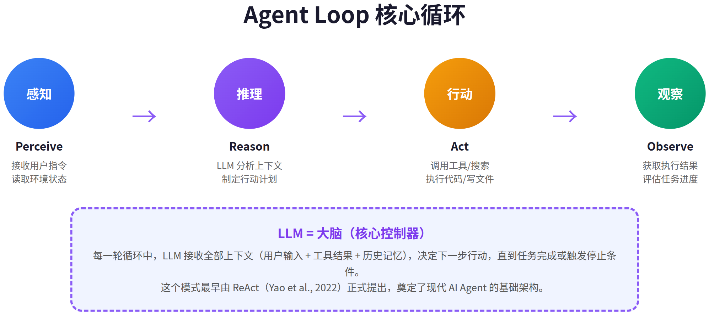
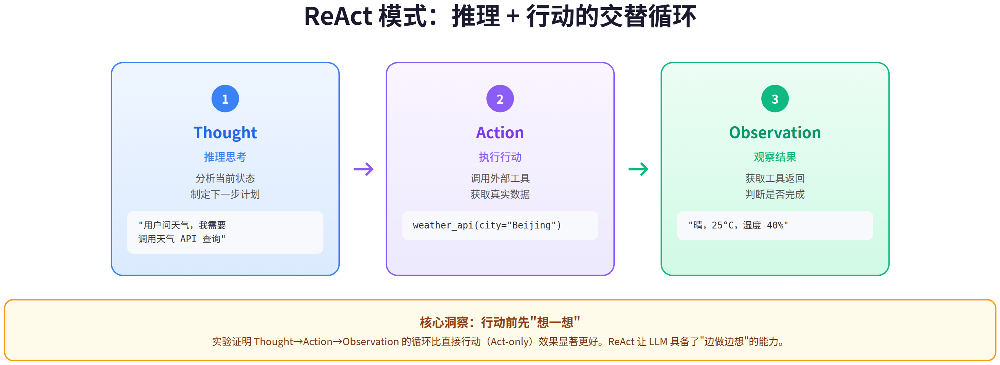
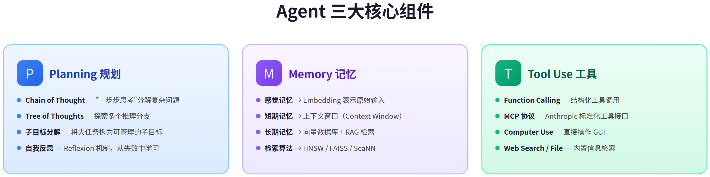
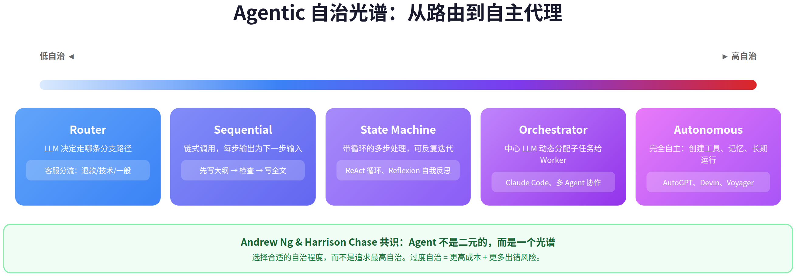
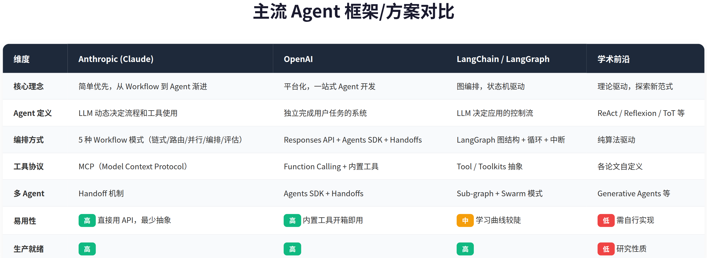

# Agent Loop 与 AI Agent 调研报告

> Agent Loop 的本质极其简单——一个 LLM 驱动的 while 循环（感知→推理→行动→观察）。但围绕这个循环，业界已发展出丰富的设计模式和三大核心组件，正在重塑软件开发的范式。

> 调研日期：2026-06-18

---

## 目录

1. [Agent Loop 核心机制](#1-agent-loop-核心机制)
2. [核心设计模式](#2-核心设计模式)
3. [三大核心组件](#3-三大核心组件)
4. [Agentic 自治光谱](#4-agentic-自治光谱)
5. [主流框架对比](#5-主流框架对比)
6. [2025-2026 趋势与批判性分析](#6-2025-2026-趋势与批判性分析)
7. [总结与启示](#7-总结与启示)

---

## 1. Agent Loop 核心机制

Agent Loop 是 AI Agent 的核心运行机制。每一轮循环中，LLM 作为"大脑"接收用户指令和环境反馈（工具返回结果、代码执行输出等），分析当前状态后决定下一步行动，执行动作后观察结果，再将结果作为下一轮循环的输入。这个过程不断重复，直到任务完成或触发停止条件。

这个模式最早由 **ReAct**（Yao et al., 2022）正式提出。ReAct 的核心洞察是：让 LLM 在行动前先"想一想"（Thought），比直接行动（Act-only）效果显著更好。这听起来很朴素，但它是现代所有 Agent 框架的理论基础——无论是 Claude Code、Devin 还是 AutoGPT，底层都是这个循环。

**我的看法**：Agent Loop 的概念确实优雅，但实际工程中最大的挑战不是循环本身，而是循环的**终止条件**。什么时候该停？怎么判断任务已完成？怎么防止 Agent 陷入死循环或"想太多"？这些问题比循环本身更难解决。Anthropic 建议设置最大迭代次数作为安全网，这是目前最务实的做法。

---

## 2. 核心设计模式

在 Agent Loop 的基础上，业界发展出了多种设计模式，各有适用场景。

### ReAct（推理 + 行动）

最经典的模式。每一步包含三个阶段：Thought（推理思考，分析当前状态并制定计划）、Action（执行行动，调用外部工具获取真实数据）、Observation（观察结果，获取工具返回并判断是否完成）。三者交替循环，形成"边做边想"的执行流。

### Plan-and-Execute

先让 LLM 生成完整的步骤列表，再逐步执行。适合复杂多步骤任务（如"做一个完整的调研报告"），但灵活性不如 ReAct——计划一旦制定，中途调整的成本较高。

### Reflexion（自我反思）

在 ReAct 基础上增加反思机制：执行失败后，Agent 分析失败原因，将反思结果存入记忆，用反思指导下一次尝试。最多存储 3 条反思记录作为上下文。这个模式特别适合需要试错的任务，但要注意：反思质量高度依赖 LLM 的自我认知能力，很多模型其实"不知道自己不知道什么"。

### Evaluator-Optimizer

两个 LLM 协作的循环模式：Generator 生成回答，Evaluator 评估质量并给出反馈，Generator 根据反馈改进，循环往复。适用于有明确评估标准的场景（如文学翻译、代码审查）。

| 模式 | 核心思路 | 适用场景 | 局限性 |
|------|---------|---------|--------|
| **ReAct** | 每步先想再做 | 通用 Agent、信息检索 | 可能"想太多"浪费 token |
| **Plan-and-Execute** | 先规划再执行 | 复杂多步任务 | 计划僵化，中途调整难 |
| **Reflexion** | 失败后反思改进 | 需要试错的任务 | 依赖 LLM 自我认知能力 |
| **Evaluator-Optimizer** | 双 LLM 生成+评估 | 有明确标准的任务 | 成本翻倍，评估质量难保证 |

**我的看法**：这四种模式不是互斥的，而是可以组合的。实际的生产级 Agent（如 Claude Code）往往是多种模式的混合：用 Plan-and-Execute 做大框架规划，用 ReAct 做具体执行，遇到失败时触发 Reflexion 机制。关键不是选哪种模式，而是根据任务复杂度动态切换。

---

## 3. 三大核心组件

参考 Lilian Weng（OpenAI）的经典框架，Agent 由三大组件构成：Planning（规划）、Memory（记忆）、Tool Use（工具使用）。

### 3.1 Planning（规划）

规划能力决定了 Agent 能否处理复杂任务。核心技术包括：Chain of Thought（"一步步思考"分解问题）、Tree of Thoughts（探索多个推理分支，用 BFS/DFS 搜索最优路径）、子目标分解（将大任务拆为可管理的子目标）、以及 Reflexion 的自我反思机制。

### 3.2 Memory（记忆）

记忆系统是 Agent 的"外脑"。类比人类记忆：感觉记忆对应 Embedding 表示（原始输入的向量化），短期记忆对应上下文窗口（Context Window，容量有限但即时可用），长期记忆对应向量数据库 + RAG 检索（容量近乎无限但需要检索）。向量检索算法方面，HNSW、FAISS、ScaNN 是主流选择，各有取舍。

### 3.3 Tool Use（工具使用）

工具使用让 Agent 从"只会说话"变成"能做事"。当前主流方案：Function Calling（OpenAI/Anthropic 原生支持，结构化工具调用）、MCP 协议（Anthropic 提出的标准化工具接口，正成为事实标准）、Computer Use（直接操作 GUI，OpenAI CUA 在 OSWorld 达到 38.1%）。

| 组件 | 核心技术 | 成熟度 | 主要挑战 |
|------|---------|--------|---------|
| **Planning** | CoT、ToT、子目标分解 | ★★★★☆ | 长程规划的可靠性 |
| **Memory** | 向量数据库、RAG、HNSW | ★★★★★ | 检索精度、上下文窗口限制 |
| **Tool Use** | Function Calling、MCP | ★★★★☆ | 工具描述的准确性、错误处理 |

**我的看法**：三个组件中，**Tool Use 是当前最大的瓶颈**。Anthropic 在构建 SWE-bench Agent 时发现，优化工具接口的投入比优化 prompt 更值得。一个好的工具描述应该像给初级开发者写文档——清晰、有示例、有边界说明。MCP 协议的出现是正确方向，但生态还在早期。

---

## 4. Agentic 自治光谱

LangChain 创始人 Harrison Chase 和 Andrew Ng 都强调：**Agent 不是二元的，而是一个光谱**。从最简单的 LLM 路由（Router）到完全自主的 Agent（Autonomous），中间有多个层级。

Router（LLM 决定走哪条分支）是最轻量的"agentic"行为，比如客服系统将退款/技术/一般问题分流到不同处理流程。Sequential（链式调用）是每步输出作为下一步输入，如先写大纲再写全文。State Machine（带循环的多步处理）就是 Agent Loop 的核心模式。Orchestrator（中心 LLM 动态分配子任务）是当前多 Agent 协作的主流架构。Autonomous（完全自主，能创建工具、长期运行）是最高级别，如 AutoGPT、Devin。

**我的看法**：这个光谱模型非常有指导意义。很多团队犯的错误是**一开始就追求高自治**，结果 Agent 不可控、成本高、效果差。正确的做法是从低自治开始（Router 或 Sequential），只在简单方案确实不够用时，才逐步升级复杂度。Anthropic 的建议我非常认同："从最简单的方案开始，只在必要时增加复杂度。" 过度自治 = 更高成本 + 更多出错风险，这是当前 Agent 领域最常见的陷阱。

---

## 5. 主流框架对比

当前 Agent 开发领域有三大阵营，各有侧重。

**Anthropic（Claude 团队）** 的设计哲学是"简单优先"。他们区分了 Workflow（预定义代码路径编排 LLM 和工具）和 Agent（LLM 动态决定流程和工具使用）两种系统，并提出了五种 Workflow 模式：Prompt Chaining（链式）、Routing（路由）、Parallelization（并行）、Orchestrator-Workers（编排）、Evaluator-Optimizer（评估优化）。Anthropic 还推出了 MCP 协议作为标准化工具接口。

**OpenAI** 走的是平台化路线。Responses API 是 Chat Completions + Assistants 的超集，内置 Web Search、File Search、Computer Use 三大工具。Agents SDK 是开源的多 Agent 编排框架，核心概念包括 Agents（可配置 LLM + 工具）、Handoffs（Agent 间控制转移）、Guardrails（安全检查）。值得注意的是，OpenAI 计划在 2026 年中废弃 Assistants API，全面转向 Responses API。

**LangChain / LangGraph** 是社区驱动的方案。LangGraph 用图结构编排 Agent，原生支持分支逻辑和循环，还支持中断和恢复（人机交互）。学习曲线较陡，但灵活性最高。

| 维度 | Anthropic | OpenAI | LangChain |
|------|----------|--------|-----------|
| **核心理念** | 简单优先，渐进式 | 平台化，一站式 | 图编排，状态机 |
| **工具协议** | MCP（标准化） | Function Calling + 内置工具 | Tool / Toolkits |
| **多 Agent** | Handoff 机制 | Agents SDK + Handoffs | Sub-graph + Swarm |
| **易用性** | 高（最少抽象） | 高（内置工具开箱即用） | 中（学习曲线陡） |
| **开源程度** | 部分（MCP 开源） | 部分（Agents SDK 开源） | 完全开源 |

**我的看法**：三个阵营的差异本质上是**抽象层次的选择**。Anthropic 选择最少抽象（直接用 API），OpenAI 选择最多内置功能（开箱即用），LangChain 选择最灵活的编排（图结构）。对于新手，我推荐从 Anthropic 的方式开始——直接调用 LLM API，几行代码就能实现基础 Agent。等需求变复杂了再考虑框架。过多的抽象层是调试的噩梦。

---

## 6. 2025-2026 趋势与批判性分析

### 6.1 编码 Agent：杀手级应用

编码 Agent 是当前 Agent 领域最有价值的应用场景。原因很直观：代码方案可通过自动化测试验证（Agent 有了可靠的反馈信号）、问题空间结构化且定义清晰、输出质量可客观衡量。代表产品包括 Claude Code、Devin、Cursor Agent、GitHub Copilot Workspace。

### 6.2 多 Agent 协作

从单 Agent 到多 Agent 的演进是 2025 年的主旋律。Orchestrator-Workers 模式成为主流：中心 LLM 动态分配任务给 Worker，Worker 完成后返回结果，中心 LLM 综合判断。Agent 间可以 Handoff（交接控制权），实现分工明确的协作：规划 Agent、执行 Agent、审核 Agent 各司其职。

### 6.3 工具标准化

MCP（Model Context Protocol）由 Anthropic 推出，正成为工具调用的事实标准。Function Calling 已成为所有主流 LLM 的标配。Computer Use 让 Agent 可以直接操作 GUI——OpenAI 的 CUA 模型在 OSWorld 达到 38.1%，WebVoyager 达到 87%。

### 6.4 安全与可控性

安全问题正在成为 Agent 部署的核心关切。当前主流做法包括：Guardrails（输入/输出验证）、Human-in-the-loop（关键节点需要人类确认）、Sandboxing（Agent 在沙箱环境中测试）、最大迭代限制（防止 Agent 无限循环）。Harvard/MIT 的研究发现，AI Agent 容易被"假装是主人"的攻击方式操纵，这是一个尚未解决的安全隐患。

| 趋势 | 成熟度 | 影响力 | 我的判断 |
|------|--------|--------|---------|
| **编码 Agent** | ★★★★☆ | 极高 | 2-3 年内成为开发者标配 |
| **多 Agent 协作** | ★★★☆☆ | 高 | 架构模式已清晰，工具链还在追赶 |
| **MCP 工具标准化** | ★★★☆☆ | 高 | 方向正确，但生态需要 1-2 年成熟 |
| **Computer Use** | ★★☆☆☆ | 中高 | 38.1% 成功率说明还有很长的路要走 |
| **安全可控** | ★★☆☆☆ | 极高 | 最被低估的领域，可能成为最大瓶颈 |

**我的看法**：当前 Agent 领域存在**炒作与现实的差距**。Computer Use 38.1% 的成功率意味着近 2/3 的任务会失败——这在生产环境是不可接受的。编码 Agent 是目前唯一真正"可用"的场景，因为有自动化测试作为可靠反馈。其他场景（如客服、数据分析）虽然被广泛宣传，但实际部署率远低于预期。我认为 2026-2027 年的关键突破点在于**提高 Agent 的可靠性**，而不是增加更多功能。

---

## 7. 总结与启示

### 核心结论

1. **Agent Loop 本质简单**：一个 LLM 驱动的 while 循环，但围绕它发展出了 ReAct、Reflexion、Evaluator-Optimizer 等丰富的设计模式
2. **Agentic 是光谱**：从 Router 到 Autonomous Agent，选择合适的自治程度比追求最高自治更重要
3. **工具设计比提示词更重要**：Anthropic 的实践证明，优化工具接口的投入回报高于优化 prompt
4. **可靠性是当前最大瓶颈**：Agent 的非确定性执行需要完整的追踪、调试和安全机制

### 实践建议

| 你的情况 | 建议方案 |
|---------|---------|
| 刚接触 Agent | 从 Anthropic 的方式开始，直接调用 LLM API + Function Calling |
| 需要复杂编排 | 用 LangGraph 或 OpenAI Agents SDK |
| 构建编码 Agent | 重点关注测试反馈循环和工具设计 |
| 生产环境部署 | 必须有 Guardrails、Human-in-the-loop、最大迭代限制 |

---

*调研基于以下核心资料：Lilian Weng《LLM Powered Autonomous Agents》、Anthropic《Building Effective Agents》、Harrison Chase《What is an AI Agent?》、OpenAI《New Tools for Building Agents》、ReAct/Reflexion/ToT 等学术论文。*
