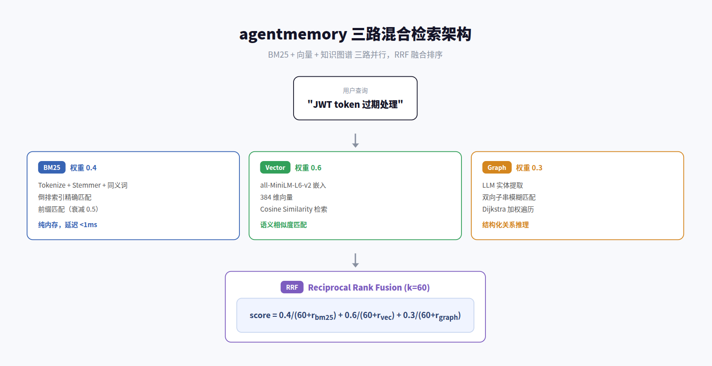
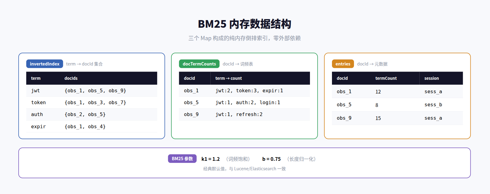
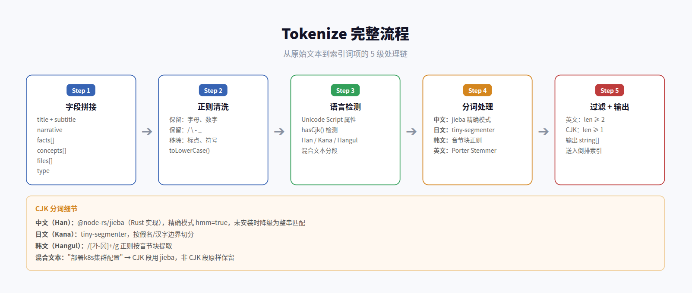
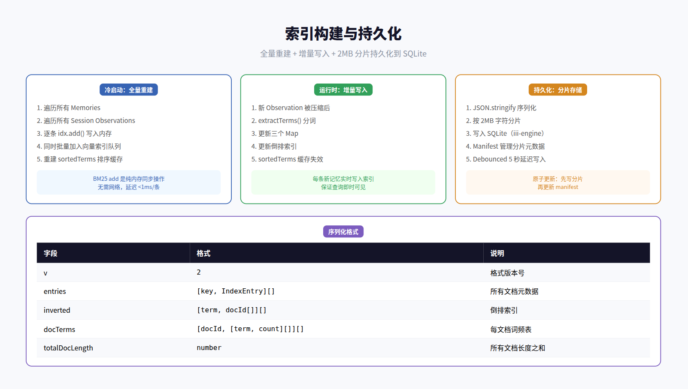
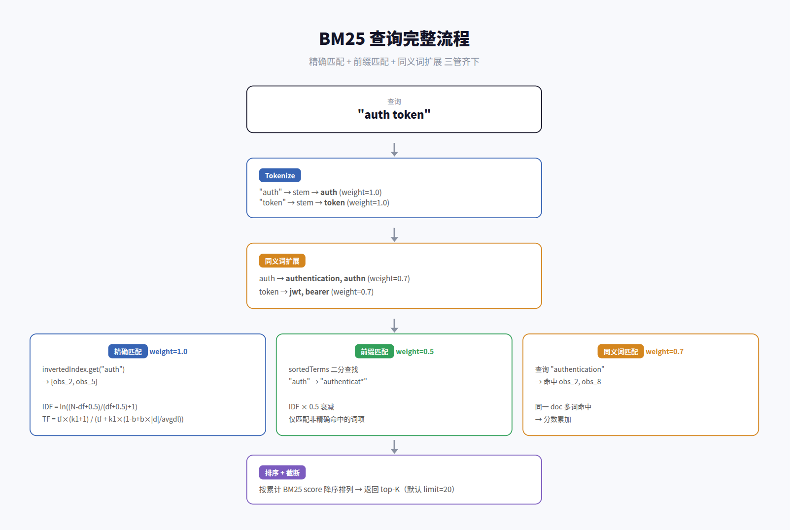
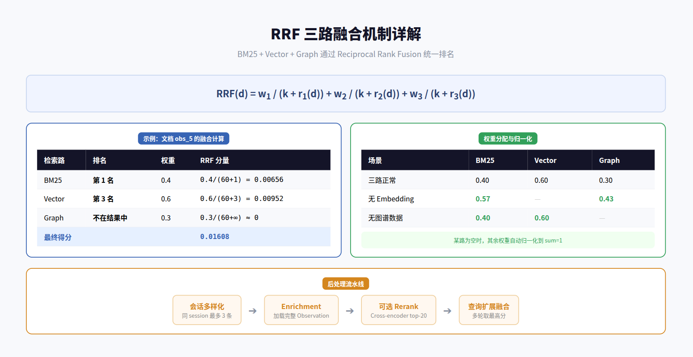

# agentmemory BM25 检索：从分词到融合的全流程深度解析

> **BM25 负责精确文本匹配，是三路混合检索中最轻量、最确定性的一路** — 纯内存倒排索引，零外部依赖，延迟 <1ms

---

## 目录

1. [概述](#1-概述)
2. [BM25 评分算法](#2-bm25-评分算法)
3. [Tokenize 流程](#3-tokenize-流程)
4. [索引构建与持久化](#4-索引构建与持久化)
5. [查询流程](#5-查询流程)
6. [RRF 三路融合与总结](#6-rrf-三路融合与总结)

---

## 1. 概述

agentmemory 的检索系统采用**三路并行**架构：BM25 负责关键词精确匹配，向量检索负责语义相似度，知识图谱负责实体关系推理。三路结果通过 RRF（Reciprocal Rank Fusion）融合为统一排名。

BM25 这一路的设计哲学是**极致轻量**：不依赖外部搜索引擎，全部在内存中的三个 Map 上操作。它的核心价值在于弥补向量检索对精确关键词的不足 — 当用户查询包含精确的函数名、错误码或技术术语时，BM25 的确定性匹配远比向量相似度可靠。

### BM25 在三路中的定位

| 维度 | BM25 | Vector | Graph |
|------|------|--------|-------|
| 匹配方式 | 关键词精确 + 前缀 | 语义相似度 | 实体关系遍历 |
| 默认权重 | 0.4 | 0.6 | 0.3 |
| 外部依赖 | 无（纯内存） | Embedding 模型 | iii-engine KV |
| 延迟 | <1ms | ~50ms（含 embed） | ~100ms（含遍历） |
| 核心优势 | 精确术语匹配 | 语义模糊匹配 | 结构化关系推理 |

---

## 2. BM25 评分算法

agentmemory 实现的是**经典 BM25**（Robertson-Sparck Jones 变体），参数选择与 Lucene/Elasticsearch 一致。

### 2.1 评分公式

BM25 对每个查询词 t，计算其在文档 d 中的相关性得分，然后累加：

**IDF（逆文档频率）：** 衡量词的稀有度。出现在越少文档中的词，区分度越高。

**TF（词频饱和）：** 经典 BM25 饱和函数，词频增长到一定程度后收益递减。k1=1.2 控制饱和速度，b=0.75 控制文档长度归一化程度。

**多词累加：** 一个查询命中多个词时，分数线性累加。比如查询 "auth token" 命中一篇文档，"auth" 得 2.3 分，"token" 得 1.8 分，最终 4.1 分。

### 2.2 参数与数据结构

| 参数 | 值 | 含义 |
|------|-----|------|
| k1 | 1.2 | 词频饱和参数，越大越信任高频词 |
| b | 0.75 | 长度归一化参数，1.0 = 完全归一化，0 = 不归一化 |
| RRF_K | 60 | RRF 融合常数，标准值 |

BM25 索引由三个内存 Map 组成：

- **invertedIndex** — 倒排索引，term → docId 集合，用于快速找到包含某词的所有文档
- **docTermCounts** — 每文档词频表，docId → {term → count}，用于计算 TF
- **entries** — 文档元数据，docId → {termCount, sessionId}，用于长度归一化

三个 Map 协同工作：查询时先从 invertedIndex 找到候选文档，再从 docTermCounts 取词频计算 TF，最后从 entries 取文档长度做归一化。

---

## 3. Tokenize 流程

Tokenize 是 BM25 的基础 — 它决定了"什么算一个词"。agentmemory 的 Tokenize 流程分为 5 级，对中英文采用不同策略。

### 3.1 索引字段

不是只索引正文，而是将 Observation 的 7 个字段拼接后一起分词：

| 字段 | 内容 | 示例 |
|------|------|------|
| title | 标题 | "JWT 认证过期处理" |
| subtitle | 副标题 | "Auth 模块重构" |
| narrative | 叙述 | "修复了 token 过期后..." |
| facts[] | 事实列表 | ["使用 RSA256 签名"] |
| concepts[] | 概念列表 | ["JWT", "Refresh Token"] |
| files[] | 文件列表 | ["AuthInterceptor.java"] |
| type | 类型 | "decision" |

### 3.2 英文处理：Porter Stemmer

英文词通过 Porter Stemmer 还原词干，将不同形态的词映射到同一 token。这样 "authenticating"、"authenticated"、"authentication" 都能匹配到 "auth" 查询。

### 3.3 中文处理：jieba 分词

中文（Han 字符）使用 @node-rs/jieba（Rust 实现的结巴分词），精确模式。日文使用 tiny-segmenter，韩文使用音节块正则。混合文本（如"部署k8s集群配置"）先按 Unicode Script 属性分段，CJK 段用对应分词器，非 CJK 段原样保留。

当 jieba 未安装时，降级为整串匹配 — 不崩溃，但中文检索精度下降。

### 3.4 同义词扩展

查询阶段自动注入编程领域同义词，这是 BM25 的独特增强。系统硬编码了 46 组同义词，涵盖常见编程缩写和别名：

| 同义词组 | 成员 |
|----------|------|
| 认证 | auth, authentication, authn |
| 数据库 | db, database, datastore |
| 容器编排 | k8s, kubernetes, kube |
| 类型系统 | ts, typescript |
| 数据库 | pg, postgres, postgresql |
| 接口 | api, endpoint, endpoints |

同义词在初始化时预先 stem 并构建双向映射，查询时自动注入，权重 0.7（低于原始词的 1.0）。

---

## 4. 索引构建与持久化

### 4.1 全量重建（冷启动）

当索引为空时（首次启动或数据丢失），触发全量重建：遍历所有 Memories 和 Session Observations，逐条调用 idx.add() 写入内存。BM25 的 add 是纯内存同步操作，无需网络，每条延迟 <1ms。

同时，每条记录也会批量加入向量索引的异步队列（embed 调用需要网络）。

### 4.2 增量写入（运行时）

每条新 Observation 被压缩后，立即调用 getSearchIndex().add() 写入索引。这保证了新记忆在下一次查询中即时可见 — 无需等待批量重建。

写入时 sortedTerms 排序缓存会失效，下次前缀查询时自动重建。

### 4.3 分片持久化

索引序列化为 JSON 后，按 2MB 字符分片存入 SQLite（通过 iii-engine 的 StateModule）。使用 debounced 写入（5 秒延迟），避免频繁 I/O。通过 manifest 文件管理分片元数据，支持原子更新 — 先写所有分片，再更新 manifest。

---

## 5. 查询流程

### 5.1 查询处理链路

查询经过 4 个阶段：

**阶段 1 — Tokenize：** 与索引构建相同的分词流程，提取原始词项。

**阶段 2 — 同义词扩展：** 对每个原始词查找同义词表，注入权重 0.7 的同义词。原始词权重 1.0。

**阶段 3 — 三管齐下匹配：**

| 匹配方式 | 权重 | 实现 | 说明 |
|----------|------|------|------|
| 精确匹配 | 1.0 | invertedIndex.get(term) | 直接查倒排索引 |
| 前缀匹配 | 0.5×IDF | sortedTerms 二分查找 | 所有以查询词为前缀的索引词 |
| 同义词匹配 | 0.7 | 同义词表查询 | 自动注入的同义词 |

**阶段 4 — 排序截断：** 按累计 BM25 score 降序排列，返回 top-K（默认 20）。

### 5.2 前缀匹配的独特设计

前缀匹配是 agentmemory BM25 的一个亮点 — 它弥补了精确匹配的不足。当用户输入 "auth" 时，不仅能匹配到 "auth" 本身，还能匹配到 "authenticat*" 等前缀词项，但 IDF 衰减 50%。

实现上，维护一个 sortedTerms 排序数组，用二分下界（lowerBound）定位前缀起点，O(log n) 时间复杂度。

### 5.3 同一文档的分数累加

当多个查询词命中同一篇文档时，分数线性累加。比如查询 "JWT auth" 中，"jwt" 得 2.3 分，"auth" 得 1.8 分，"authentication"（同义词）得 1.2 分，最终该文档得分 5.3 分。这种累加机制天然支持多关键词查询的相关性排序。

---

## 6. RRF 三路融合与总结

### 6.1 RRF 融合公式

三路检索各自返回排名后，通过 RRF 统一为一个分数。RRF 只关心排名，不关心原始分数 — 这避免了不同检索路的分数尺度不一致问题。

融合公式：score = Σ wᵢ / (k + rᵢ)，其中 k=60 是标准常数，rᵢ 是第 i 路的排名。

### 6.2 权重归一化

当某路无结果时（如没有 embedding provider 导致向量路为空），其余权重自动归一化到 sum=1。这保证了无论哪路可用，最终分数都在 [0, 1] 范围内。

### 6.3 后处理流水线

RRF 融合后，还有 4 步后处理：

| 步骤 | 作用 | 细节 |
|------|------|------|
| 会话多样化 | 避免单 session 垄断结果 | 同 session 最多 3 条，不足时 backfill |
| Enrichment | 加载完整内容 | 从 KV 获取完整 Observation，fallback 到 Memory |
| 可选 Rerank | 精排 | Cross-encoder 对 top-20 重排序（需 RERANK_ENABLED） |
| 查询扩展融合 | 多轮搜索取最高分 | 原始查询 + 改写 + 时间具体化，合并去重 |

### 6.4 总结

agentmemory 的 BM25 实现是一个**工程化但不复杂**的方案：

| 特性 | 评价 |
|------|------|
| 算法 | 经典 BM25，参数选标准值，不调参 |
| 前缀匹配 | 独特设计，弥补精确匹配不足 |
| 同义词 | 46 组编程领域硬编码，实用但需手动维护 |
| CJK 支持 | jieba + 降级策略，中文友好 |
| 持久化 | 2MB 分片 + debounced 写入，生产就绪 |
| 定位 | 三路中的一路，不是独立搜索引擎 |

它的核心价值在于：用最少的代码和零外部依赖，实现了生产级的 BM25 检索，并通过前缀匹配和同义词扩展弥补了传统 BM25 的短板。

---

*分析基于 agentmemory main 分支源码：`src/state/search-index.ts`、`src/state/hybrid-search.ts`、`src/state/index-persistence.ts`、`src/state/stemmer.ts`、`src/state/synonyms.ts`、`src/state/cjk-segmenter.ts`、`src/functions/search.ts`*

*报告生成时间：2026-06-23*
