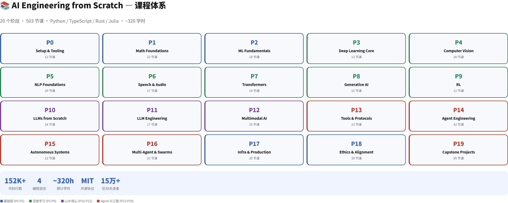
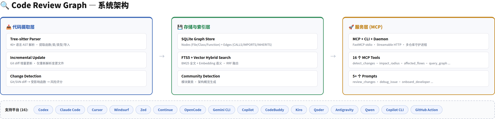
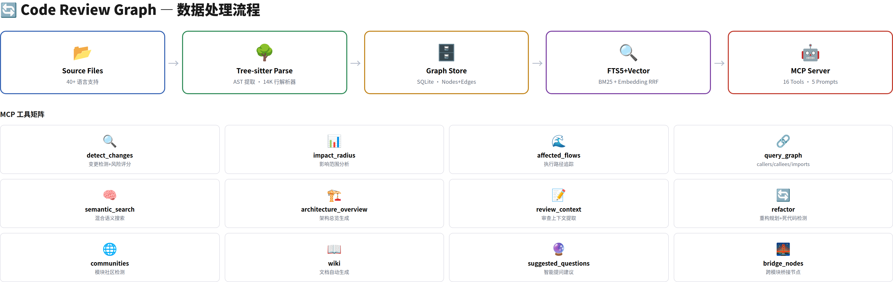
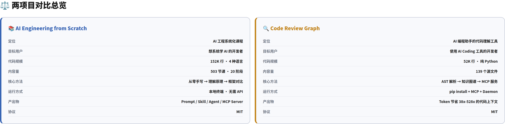

# AI 工程化工具调研：ai-engineering-from-scratch vs code-review-graph

> **核心发现**：一个是从零手写 AI 全栈的 503 节课系统课程，一个是让 AI 编程助手省 38-528 倍 Token 的代码知识图谱工具——两者解决的是 AI 工程化链条上完全不同的痛点，且恰好互补。

---

## 目录

1. [概述](#1-概述)
2. [AI Engineering from Scratch 深度分析](#2-ai-engineering-from-scratch-深度分析)
3. [Code Review Graph 深度分析](#3-code-review-graph-深度分析)
4. [对比分析](#4-对比分析)
5. [批判性分析](#5-批判性分析)
6. [总结与启示](#6-总结与启示)

---

## 1. 概述

本次调研覆盖两个 GitHub 开源项目，均采用 MIT 协议，均在 2026 年持续活跃更新。两者定位截然不同：一个是系统化 AI 学习课程，另一个是 AI 编程助手的效率工具。

**ai-engineering-from-scratch** 由 AgentMemory 作者 rohitg00 维护，是面向 AI 工程师的完整学习路线图。它遵循"Build It / Use It"哲学——每个算法先从原始数学推导并手写实现，再用 PyTorch 等框架跑一遍，确保框架不再是黑盒。近 30 天有 15 万+读者，已是 AI 教育领域的标杆项目。

**code-review-graph** 由 tirth8205 维护，定位是"停止烧 Token，开始聪明审查"。它用 Tree-sitter 解析代码结构，构建 SQLite 知识图谱，通过 MCP 协议为 Claude Code、Codex、Cursor 等 16 个 AI 编程平台提供精准的代码上下文——声称 Token 节省 38x 到 528x。

| 维度 | ai-engineering-from-scratch | code-review-graph |
|------|---------------------------|-------------------|
| 定位 | AI 工程系统化课程 | AI 编程助手的代码理解工具 |
| 代码规模 | 152K 行（Python/TS/RS/JL） | 52K 行（纯 Python） |
| 内容量 | 503 节课 · 20 个阶段 | 139 个源文件 · 16 个 MCP 工具 |
| 目标用户 | 想系统学 AI 的开发者 | 日常使用 AI Coding 工具的开发者 |
| 产出物 | Prompt/Skill/Agent/MCP Server | 精准代码上下文（38-528x Token 节省） |

---

## 2. AI Engineering from Scratch 深度分析

### 2.1 课程体系全景

课程按 20 个阶段递进，分为四大层次：

| 层次 | 阶段 | 课数 | 核心理念 |
|------|------|------|----------|
| 基础层 | P0-P2：Setup → Math → ML | 52 | 搭环境、补数学、写经典 ML 算法 |
| 深度学习 | P3-P9：DL Core → Vision → NLP → Speech → Transformers → GenAI → RL | 158 | 手写 CNN/RNN/GAN/Transformer，再用框架验证 |
| LLM 核心 | P10-P12：LLMs from Scratch → LLM Engineering → Multimodal | 66 | 从 tokenizer 到 RLHF 全流程手写 |
| Agent 与工程 | P13-P19：Tools → Agent Engineering → Autonomous → Multi-Agent → Infra → Ethics → Capstone | 255 | 工具调用、自主循环、多 Agent 协作、生产部署 |

### 2.2 设计哲学

该项目最突出的设计是 **"Build It / Use It" 二分法**。每节课分两步：

1. **Build It**：从数学公式出发，用最少的依赖手写实现（Python stdlib 优先，PyTorch 仅在"production library"环节才引入）
2. **Use It**：用 PyTorch/HuggingFace 等工业级库跑同样的操作，对比结果

这种设计的精妙之处在于——它不让你陷入"跟着教程抄代码"的陷阱。你知其然（框架怎么用），也知其所以然（底层在算什么）。每节课还产出可复用工件（Prompt、Skill、Agent、MCP Server），学完即可用于日常工作。

### 2.3 代码统计

项目总规模 152,446 行代码，按语言分布：

| 语言 | 代码行数 | 文件数 | 占比 | 用途 |
|------|---------|--------|------|------|
| Python | 89,594 | 599 | 70.1% | ML/DL/LLM 算法实现 |
| TypeScript | 10,079 | 129 | 6.6% | Agent 工具/协议/MCP |
| Julia | 4,457 | 20 | 2.9% | 数学/线性代数验证 |
| Rust | 1,784 | 10 | 1.2% | 高性能组件 |
| 其他（JSON/HTML/JS） | ~46,500 | 1,804 | 19.2% | 配置/UI/脚本 |

Python 占绝对主导（70%），这与 AI/ML 领域的技术栈一致。Markdown 文档线数达 74,240 行，占总体的 29%——说明这是一个文档驱动的项目，课程内容本身就是产品。

---

## 3. Code Review Graph 深度分析

### 3.1 架构全景

系统由三层组成：

| 层 | 核心模块 | 关键能力 |
|----|---------|---------|
| 摄取层 | parser.py (14,182 行) + incremental.py + changes.py | 40+ 语言 Tree-sitter AST 解析、Git SVN diff 增量更新、风险评分 |
| 存储层 | graph.py (1,633 行) + search.py + embeddings.py | SQLite Nodes+Edges 图谱、FTS5 BM25 全文索引、向量 Embedding、RRF 融合 |
| 服务层 | main.py (1,146 行) + daemon.py + tools/ | FastMCP stdio/HTTP、16 个 MCP 工具、多仓库守护进程、5 个预设 Prompt |

### 3.2 数据处理流程

代码经过 **AST 解析 → 图谱存储 → 混合索引 → MCP 服务** 四阶段处理：

1. **解析阶段**：Tree-sitter 对 40+ 语言做 AST 提取，生成 Node（File/Class/Function/Type/Test）和 Edge（CALLS/IMPORTS/INHERITS/CONTAINS/TESTED_BY）
2. **图谱阶段**：SQLite 存储带 `networkx` 的图结构，支持 BFS 影响半径查询（最大深度可配置，默认指数衰减权重）
3. **索引阶段**：FTS5（porter unicode61 tokenizer）做 BM25 全文搜索，可选 Embedding 模型做语义搜索，RRF 融合排序
4. **服务阶段**：FastMCP 通过 stdio 或 Streamable HTTP 暴露 16 个工具给 AI 编程助手

### 3.3 MCP 工具矩阵

项目提供了丰富的工具集，覆盖代码审查全流程：

| 类别 | 工具 | 功能 |
|------|------|------|
| 变更分析 | `detect_changes` · `impact_radius` · `affected_flows` | Git diff → 受影响函数 → 风险评分 → 执行路径追踪 |
| 图谱查询 | `query_graph` · `semantic_search` · `traverse_graph` | 调用链、语义搜索、图遍历 |
| 架构理解 | `architecture_overview` · `communities` · `bridge_nodes` · `hub_nodes` | 模块聚类、桥接节点、关键枢纽发现 |
| 代码审查 | `review_context` · `suggested_questions` · `knowledge_gaps` | 精准上下文提取、智能提问建议 |
| 维护辅助 | `refactor` · `wiki` · `find_large_functions` | 重构规划、文档生成、坏味道检测 |

### 3.4 平台覆盖

支持 **16 个 AI 编程平台**的自动安装和配置：Codex、Claude Code、Cursor、Windsurf、Zed、Continue、OpenCode、Antigravity、Gemini CLI、Qwen、Kiro、Qoder、GitHub Copilot（含 CLI）、CodeBuddy——覆盖了目前主流 AI Coding 生态的几乎所有入口。

---

## 4. 对比分析

### 4.1 解决的问题

| 维度 | ai-engineering-from-scratch | code-review-graph |
|------|---------------------------|-------------------|
| 痛点 | 开发者知道 AI 很重要但不知道怎么系统学 | AI 助手读代码时浪费大量 Token 在无关文件上 |
| 方案 | 20 阶段课程 → 构建完整 AI 知识体系 | 知识图谱 → 精准上下文 → Token 降本 |
| 即用性 | 需要投入 ~320 小时学习 | `pip install` 后即时生效 |
| 深度 | 从线性代数到多 Agent 集群全覆盖 | 专注代码理解和智能上下文的单一领域 |

### 4.2 技术成熟度

| 维度 | ai-engineering-from-scratch | code-review-graph |
|------|---------------------------|-------------------|
| 代码质量 | 严格 CI（`audit_lessons.py` + 测试 + 格式检查） | CI + 6 项 Benchmark 评估框架 |
| 社区活跃度 | 15 万+月读者、503 节课持续扩展 | PyPI 持续迭代（v2.3.7） |
| 文档 | 每节课有独立 `en.md`，AGENTS.md 详细规范 | 多语言 README + 独立文档目录 + 中/日/韩/印地语 |
| 可扩展性 | 新课程按模板提交 PR | 新语言解析器通过 Tree-sitter grammar 扩展 |

---

## 5. 批判性分析

### 5.1 ai-engineering-from-scratch：雄心勃勃但"完美主义陷阱"

**👍 我最欣赏的地方**：

"Build It / Use It"二分法是这个项目最珍贵的资产。我自己见过太多开发者用 PyTorch 搭了个 Transformer 就以为懂了 Attention——他们能用，但说不出 Q、K、V 矩阵相乘后为什么要除以 √d_k。这个课程逼你回到第一性原理，从数学层面理解每个操作的意义。这在 AI 教育中是稀缺的——大多数课程要么偏理论（只推公式不写代码），要么偏实践（只调 API 不讲原理）。

**🤔 我持保留意见的地方**：

503 节课、~320 学时是一个"超高门槛"。绝大多数在职开发者没有连续 320 小时的深度学习时间。这让我想起 SICP（计算机程序的构造和解释）——经典，但完成率极低。课程作者在 README 里说"Skip ahead if you already know the lower layers"，但实际体验中，前后依赖紧密（线性代数 → ML → DL → Transformers → Agent），跳过基础层可能导致后面看不懂。

另外，课程严重偏向 Python（70%），Rust 和 Julia 只有象征性的 1-2%。对于想在生产环境用 Rust 做推理引擎的团队来说，这部分几乎等于没有覆盖。

### 5.2 code-review-graph：务实但存在"生态锁定"风险

**👍 最值得称赞的地方**：

这个项目解决了一个极其真实且普遍的问题。任何用 AI Coding 工具超过一周的人都知道——AI 经常读一大堆无关文件，然后基于错误的上下文给出错误的建议。CRG 直接从代码结构中提取语义关系，而不是依赖 AI 自己去"理解"代码，这是正确的方向。16 平台覆盖也展示了对生态的尊重——不是选边站队，而是赋能所有工具。

parser.py 有 14,182 行是我见过最"厚重"的单文件之一。这既是工程壮举（40+ 语言解析在一个文件中），也是维护隐患——新增语言支持需要修改同一个巨型文件，review 难度极高。

**🤔 潜在风险**：

CRG 的价值完全建立在 **Tree-sitter 解析准确性** 的基础上。对 Python、TypeScript 等主流语言准确度很高，但对 ReScript、Spring XML、HCL 等小众语言的解析可能存在边界情况。我曾见过类似的工具在解析复杂 TypeScript decorator 或 Python metaclass 时产生错误节点——这些错误会直接传导到后续的图谱查询中。

另一个隐忧是 **MCP 协议本身还在快速演进**。CRG 深度绑定 FastMCP 库，一旦 MCP 协议 breaking change，整个服务层需要跟进。虽然目前 Anthropic 主导的 MCP 生态趋于稳定，但 2026 年的 Agent 协议格局远未定型（Google A2A 仍在竞争中）。

### 5.3 我的建议

- **如果你想系统学 AI**：ai-engineering-from-scratch 是目前最好的免费路线图之一。但别试图一次性学完——选你工作相关的 Phase（比如 Agent 工程师从 P14 开始，ML 工程师从 P2 开始），其他部分当参考手册查阅。
- **如果你日常用 AI 编程助手**：code-review-graph 值得一试。`pip install` + `code-review-graph install` 两条命令就能接入，成本极低，收益显著。特别推荐在大型单体仓库中使用——这种场景下 Token 浪费最严重。
- **如果你同时需要两者**：先用 CRG 提升日常编码效率，用省下的时间学 ai-engineering-from-scratch 的 Agent 工程部分（P13-P16）——这恰好是 CRG 覆盖不了的"AI 系统设计"能力。

---

## 6. 总结与启示

两个项目代表了 AI 工程化链条上的两个关键环节：

1. **ai-engineering-from-scratch** 解决的是"人如何学会构建 AI"——知识传递
2. **code-review-graph** 解决的是"AI 如何更好地理解人的代码"——效率提升

它们的互补性比竞争性更显著。一个有趣的组合场景：用 ai-engineering-from-scratch 的 P14（Agent Engineering）学到的 Agent 设计理念，去优化 code-review-graph 的 MCP Prompt 模板——让 AI 在代码审查时调用更精准的图谱查询工具。

对于本调研的发起者（NiPony/常规频道），建议优先评估 code-review-graph——它是一个低投入高回报的工具型项目，几分钟就能接入现有工作流。ai-engineering-from-scratch 则适合作为长期学习路线图，按需查阅而非从头到尾读完。

---

*分析基于 ai-engineering-from-scratch (503 节课全量源码) 和 code-review-graph (139 个 Python 源文件 v2.3.7) 的本地深度分析。关键源文件包括：parser.py (14,182 行)、graph.py (1,633 行)、main.py (1,146 行)、search.py (466 行)、changes.py (530 行)、incremental.py (1,325 行)、daemon.py (1,070 行)。*
