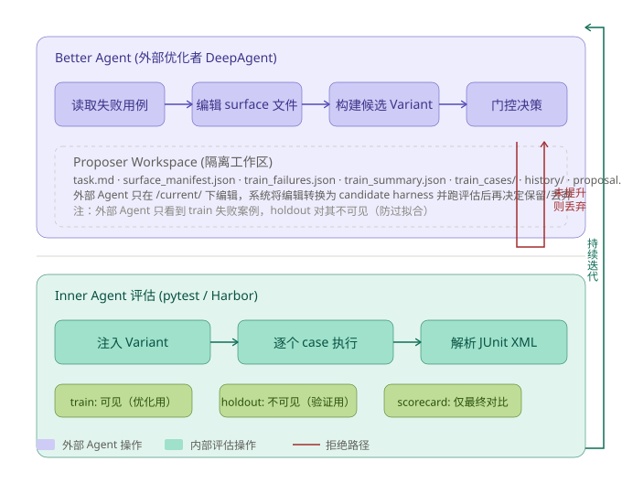
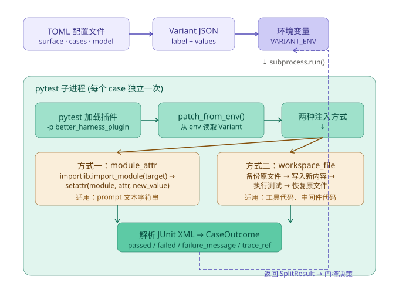

# better-harness：Agent 自我优化的元层次框架深度调研

> **核心发现：外部 DeepAgent 读取 eval 失败案例→编辑 harness 表面→门控决策，实现 Agent 自动优化 Agent。**
> 调研日期：2026-07-29 | 来源：GitHub 源码（langchain-ai/deepagents）| 深入程度：逐文件源码分析

## 一、概览

如果 AI 编码的时代，效率瓶颈之一不是模型能力，而是**人工调 prompt 的效率**——Hemes/CodeBuddy 等 Agent 项目的日常开发中，修 prompt → 跑 eval → 再修 prompt 的循环每天都在发生。LangChain 的 better-harness 试图回答一个更根本的问题：**能不能让一个 Agent 自己优化另一个 Agent？**

better-harness 是 LangChain AI 的 `deepagents` 仓库中的一个实验性示例项目。它构建了一个"Agent 优化 Agent"的闭环系统：外部 DeepAgent（优化者）读取内部 Agent（被优化的目标）的评估失败案例，自动编辑其 prompt、工具代码、中间件配置等 harness 组件，然后跑评估，只有通过数真的提升才保留改动。——Hemes/CodeBuddy 等 Agent 项目的日常开发中，修 prompt → 跑 eval → 再修 prompt 的循环每天都在发生。LangChain 的 better-harness 试图回答一个更根本的问题：**���不能让一个 Agent 自己优化另一个 Agent？**

better-harness 是 LangChain AI 的 `deepagents` 仓库中的一个实验性示例项目。它构建了一个"Agent 优化 Agent"的闭环系统：外部 DeepAgent（优化者）读取内部 Agent（被优化的目标）的评估失败案例，自动编辑其 prompt、工具代码、中间件配置等 harness 组件，然后跑评估，只有通过数真的提升才保留改动。

| 指标 | 数值 |
|------|------|
| ⭐ Stars | 属于 deepagents 仓库（整体约 8K+，截至 2026-07-29） |
| 📅 创建 | 2026 年（伴随 Deep Agents 框架发布） |
| 语言 | Python 3.12+ |
| 许可证 | MIT |
| 📦 依赖 | deepagents, pytest, tomli |
| 🏃 评测框架 | pytest / Harbor |
| 📄 代码量 | 5 个文件共 2396 行，其中核心优化循环逻辑约 700 行 |

项目灵感来自一篇 LangChain 博客文章 *Improving Deep Agents with Harness Engineering* 以及 Karpathy 的 `autoresearch`。但它比"让 LLM 看代码提建议"更进一步：它把整个优化过程变成了一个有门控、可复现的工程 pipeline。


> 上图展示了从外部 Agent 读取失败案例到门控决策的完整循环。注意 Proposer Workspace 的隔离设计——外部 Agent 的所有编辑都发生在临时目录，系统评估后才决定是否保留到正式 harness。
> 这种 "sandbox first, commit later"（先沙箱隔离编辑、确认通过后再提交）的模式是它最核心的安全机制。

## 二、核心架构：双 Agent 优化循环

better-harness 的设计哲学是**"用 Agent 优化 Agent，用评测数据驱动决策"**。它的核心循环是：

1. 对当前 harness 配置（prompt + tools + middleware）跑基线评估
2. 如果 train + holdout 都有失败案例 → 启动外部 DeepAgent
3. 外部 Agent 读取失败详情 → 编辑 harness 表面文件 → 生成候选配置
4. 对候选配置跑 train + holdout → 对比 combined pass count
5. 只有通过数严格大于当前值才保留，否则丢弃
6. 如果 train + holdout 已全部通过，或候选方案未产生任何改动，循环提前终止

这个循环的核心控制逻辑在 `better_harness/core.py` 的 `run_experiment()` 函数（第 864-1000 行）：

```python
# core.py: 第 935-943 行——门控决策
current_combined = current_train.passed + current_holdout.passed
candidate_combined = train.passed + holdout.passed
accepted = candidate_combined > current_combined
reason = (
    "improved combined train + holdout pass count"
    if accepted
    else "did not improve combined train + holdout pass count"
)
```

一个值得注意的细节：它用 `>` 而不是 `>=`。这意味着即使候选方案和当前方案打平，也不会被接受——必须严格提升。这个设计意在避免无意义修改导致的 API 费用浪费。

### 外部 Agent 的工作区

每次迭代，系统为外部 Agent 创建一个隔离的 Proposer Workspace（`agent.py` 第 51-105 行）。这个工作区包含：

| 文件 | 用途 |
|------|------|
| `task.md` | 任务说明：当前得分、可编辑表面、失败用例列表 |
| `surface_manifest.json` | surface 名称到文件路径的映射 |
| `current/` | 当前 harness 表面的实际值——Agent 在这里编辑 |
| `train_failures.json` | 失败用例的结构化 JSON |
| `train_summary.json` | train 评估的完整汇总数据 |
| `train_cases/` | 复制过来的 train 测试源文件 |
| `history/` | 之前迭代��决策历史 |
| `proposal.md` | Agent 的修改摘要输出 |

外部 Agent 的系统提示词（`agent.py` 第 21-38 行）包含一个关键约束：**"Prefer general harness fixes over case-specific hacks. Do not overfit to the visible examples."** 这是一个 prompt engineering 层面的"正则化"策略。

## 三、评测机制实现

better-harness 以 pytest 子进程隔离为基石，通过环境变量注入实现无侵入的 harness 替换，train/holdout/scorecard 三层分割保证统计严谨性。

### 3.1 整体评测流程

评测是 better-harness 的"燃料"。它使用 pytest 作为默认评测运行器，每个 eval case 独立跑一次 pytest 子进程：

```
for case in train_cases:
    subprocess: uv run pytest --junitxml=case_dir/junit.xml
        -p better_harness_plugin     ← 加载注入插件
        --model claude-sonnet-4-6
        tests/evals/test_tool_selection.py::test_case[model]
    → parse JUnit XML → CaseOutcome(passed=True/False)
```

选择"每个 case 独立跑一次"而不是"一次跑所有 case"的原因：每个 case 有独立的 JUnit XML、stdout/stderr，失败信息更精准。一个 case 的日志污染不会影响其他 case 的结果解析。

评测结果的数据模型（`core.py` 第 160-176 行）：

```python
@dataclass(frozen=True)
class CaseOutcome:
    case_id: str
    split: str       # train / holdout / scorecard
    stratum: str     # 任务类型标签
    status: str      # "passed" / "failed" / "skipped" / "missing"
    score: float     # 1.0 或 0.0
    duration_s: float
    failure_message: str | None = None
    artifacts_dir: str | None = None
    trace_ref: str | None = None   # LangSmith trace URL
```

### 3.2 Harness 注入机制

这是整个系统最关键的工程亮点。被测 Agent 的 harness 配置如何"无侵入"地替换？答案是通过**环境变量 + pytest 插件 + 两种注入方式**。


> 上图展示了从 TOML 配置到 Variant JSON 到环境变量到子进程注入的完整链路。
> 左侧的 `module_attr` 和右侧的 `workspace_file` 是两种并行注入方式，针对不同表面类型。

**注入链路**（`better_harness_plugin.py` 仅一行代码）：

```python
"""Pytest plugin entrypoint for better-harness."""

from better_harness import patch_from_env
patch_from_env()
```

这一行代码加载后，pytest 在启动时自动执行 `patching.py` 的 `patch_from_env()` 函数（第 51-57 行）：

```python
def patch_from_env() -> None:
    raw_path = os.environ.get(VARIANT_ENV)
    if not raw_path:
        return
    variant = Variant.load(Path(raw_path))
    patch_module_attrs(variant.attr_overrides())
```

**两种注入方式对比**：

| 方式 | 实现 | 适用场景 | 原理 |
|------|------|---------|------|
| `module_attr` | `importlib.import_module()` + `setattr()` | prompt 文本字符串、配置常量 | 内存级替换 Python 模块属性 |
| `workspace_file` | `workspace_override_context` 上��文管理器 | 工具代码、middleware 代码文件 | 文件系统级替换：备份→写入→执行→恢复 |

`workspace_file` 的上下文管理器实现（`patching.py` 第 71-91 行）特别简洁：

```python
@contextlib.contextmanager
def workspace_override_context(
    workspace_root: Path,
    overrides: dict[str, str],
) -> Iterator[None]:
    """Temporarily replace files in the target workspace."""
    backups: dict[Path, str | None] = {}
    try:
        for relative_path, value in overrides.items():
            target = workspace_root / relative_path
            backups[target] = target.read_text() if target.exists() else None
            target.parent.mkdir(parents=True, exist_ok=True)
            target.write_text(value)
        yield
    finally:
        for target, original in backups.items():
            if original is None:
                if target.exists():
                    target.unlink()
            else:
                target.write_text(original)
```

### 3.3 三种数据分割

better-harness 的评测数据分为三种 split，每种有不同的可见性和用途：

| Split | 外部 Agent 可见？ | 用途 | 配置要求 |
|-------|-----------------|------|---------|
| `train` | ✅ 可见 | 驱动优化决策 | 至少 1 个 case |
| `holdout` | ❌ 不可见 | 验证优化效果、防过拟合 | 至少 1 个 case |
| `scorecard` | ❌ 不可见 | 仅基线与最终版本对比 | 可选 |

一个关键的配置验证：**train 和 holdout 必须覆盖相同的 strata**（`core.py` 第 689-695 行）。例如，如果 train 中定义了 `tool_use` 和 `conversation` 两种任务类型，holdout 也必须同时包含这两类。这保证了优化不会在某些任务类型上过拟合而 holdout 完全测不到。

## 四、可编辑表面（Harness Surfaces）

better-harness 把 Agent 的可修改配置抽象为五种"表面"类型，每种对应不同的注入方式和编辑策略。

| 表面类型 | 代码中的 kind | target 示例 |
|---------|-------------|-------------|
| 系统提示词 | `module_attr` | `my_agent.graph:BASE_PROMPT` |
| 工具文件 | `workspace_file` | `libs/deepagents/custom_tools.py` |
| 技能文件 | `workspace_file` | `libs/deepagents/skills/reporting.md` |
| 中间件实现 | `workspace_file` | `libs/deepagents/custom_middleware.py` |
| 中间件注册 | `workspace_file` | `libs/deepagents/agent_setup.py` |

示例配置中特别标注：**middleware 通常需要两个表面**——一个是实现文件（middleware 逻辑），一个是注册文件（`create_deep_agent()` 的调用代码）。如果外部 Agent 改了 middleware 逻辑但没更新注册代码，注入就会失败或部分生效。

## 五、批判性分析

### 5.1 优势

1. **真正的闭环自动化**——从"读 eval 结果"到"改 harness"到"验证"完全无需人工介入。这与单纯的"让 LLM 写优化建议"有本质区别。

2. **严格的门控机制防止劣化**——`candidate_combined > current_combined` 而不是 `>=`，确保每次迭代要么提升要么回退，不会积累无意义修改。

3. **优秀的隔离与防过拟合设计**——外部 Agent 只能看到 train 的失败案例（holdout 和 scorecard 对其不可见）；每次编辑发生在临时 proposer workspace，评估后才决定是否保留。

4. **评测注入链路非常精巧**——环境变量 + pytest 插件 + `setattr` 内存替换 + 文件系统上下文管理器的组合，在不修改任何被测代码的前提下完成 harness 替换。

5. **完整的可追溯性**——每次迭代的 proposer workspace、决策记录、所有 split 的完整 outcome 都持久化保存（含 LangSmith trace），事后可完全复现优化过程。

### 5.2 不足与风险

1. **评测覆盖面决定优化上限**——如果 eval cases 不够全面（例如缺少边界条件），外部 Agent 可能优化出一个"高分但实际效果差"的 harness。这在当前条件下是一种"garbage-in, garbage-out"的风险。

2. **每个 case 独立跑一次 pytest 的开销**——假设 50 个 train case + 50 个 holdout case、每个 case 平均 30 秒，单次迭代约 50 分钟；3 次迭代约 2.5 小时（实际开销取决于 case 数量和模型延迟，此为假设场景）。这限制了它在大规模 eval 场景下的实用范围。

3. **外部 Agent 自身的推理成本**——外部 Agent 每次迭代实际是一个完整的 DeepAgent 调用（最多 11000 turns），这意味着每次迭代本身也消耗大量 LLM API 调用费用。

4. **只支持 Python / pytest / Harbor**——虽然 runners 的设计是可扩展的（`build_runner()` 工厂函数），但当前仅支持这三种。对使用 Jest、Go test 或其他语言的 Agent 项目无法直接使用。

5. **依赖 `deepagents` 框架**——外部 Agent 是 `deepagents.create_deep_agent()` 的实例。如果要在其他 Agent 框架（如 LangGraph、CrewAI）中运行，需要改造外部 Agent 的创建逻辑。

### 5.3 与类似方案的对比

| 维度 | better-harness | 人工调 prompt | RL-based 优化 | 静态 lint / 规则 |
|------|---------------|-------------|-------------|----------------|
| 优化目标 | prompt + tools + middleware | prompt | 策略参数 | 代码规范 |
| 反馈来源 | eval 通过率 | 人工判断 | reward 信号 | 规则匹配 |
| 自动化程度 | 全自动 | 手动 | 半自动 | 全自动 |
| 改动粒度 | 文本级（任意编辑） | 文本级 | 数值级 | 语法级 |
| 防过拟合 | holdout split | 无 | 验证集 | 无 |
| 适用阶段 | harness 调优 | 全阶段 | 训练阶段 | 开发阶段 |

我的判断：better-harness 展示了"**Agent 工程从手工艺到工业化**"转变的可行性——用结构化的 eval + 隔离的编辑环境 + 严格的门控，让 Agent 自己优化 Agent 成为可能。在当前阶段，它更像 CI/CD 早期的 Jenkins：流程定义清晰，但覆盖面和效率还需要大量工程打磨。然而它已经证明了一条可行的自动化路径。

## 六、对 Hermes / CodeBuddy 的启示

从 better-harness 的设计中，有几个可迁移到 Hermes/CodeBuddy 等 Agent 系统中的设计模式：

1. **eval 驱动的 prompt 迭代**——为 Agent 建立一组标准化的 eval cases（按 stratum 分层），每次修改 prompt 后自动运行全量 eval，用门控决定是否发布。

2. **Sandbox-first 编辑模式**——任何对 prompt / tools / middleware 的修改先在隔离工作区完成→跑 eval→通过才合并。与 Git 的 branch + PR 流程可完��结合。

3. **结构化失败反馈**——当前 Agent 看到"某 case 失败"时，信息往往是零散的。better-harness 的 `train_failures.json` 包含 `case_id + stratum + failure_message` 的结构化格式，是一个很好的参考。

4. **split 分层评测体系**——train（优化用）+ holdout（验证用）+ scorecard（最终对比用）的三层分割，比单一的"跑一遍测试"有更好的统计严谨性。

## 参考来源

- GitHub 仓库：https://github.com/langchain-ai/deepagents/tree/main/examples/better-harness
- Deep Agents 框架：https://github.com/langchain-ai/deepagents
- LangChain 博客：*Improving Deep Agents with Harness Engineering*（https://blog.langchain.com/improving-deep-agents-with-harness-engineering/）
- Meta-Harness 论文：arXiv:2603.28052
- Andrej Karpathy `autoresearch`：https://github.com/karpathy/autoresearch
- 源码分析覆盖文件：`core.py`（1132 行）、`agent.py`（647 行）、`patching.py`（111 行）、`runners.py`（500 行）、`better_harness_plugin.py`（6 行）
