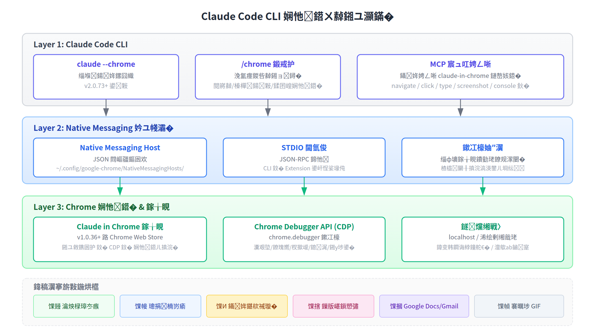

# Claude Code CLI 浏览器连接机制调研

> **调研日期：** 2026-07-01  
> **数据来源：** Anthropic 官方文档（docs.anthropic.com）、Claude in Chrome 支持文档（support.claude.com）、GitHub 社区项目  
> **核心结论：** Claude Code CLI 通过 **Chrome 原生扩展 + Native Messaging Host + Chrome Debugger API** 三层架构实现浏览器连接，与 Hermes 的 CDP 直连模式走的是完全不同的技术路线。

---

## 1. 概述

Claude Code 从 v2.0.73 开始支持浏览器集成（当前为 Beta 阶段）。它不是直接通过 CDP 端口连接浏览器，而是依靠一个独立的 Chrome 扩展（"Claude in Chrome"）作为中间代理。这种架构选择与 Hermes 的 `agent-browser:9222` CDP 直连模式形成鲜明对比。

| 维度 | Claude Code | Hermes |
|------|------------|--------|
| **连接方式** | Chrome 扩展 + Native Messaging | CDP 直连（端口 9222） |
| **浏览器要求** | Chrome / Edge（限官方浏览器） | 任何支持 CDP 的 Chromium |
| **核心权限机制** | chrome.debugger API | 直接 WebSocket CDP |
| **跨域支持** | 继承浏览器登录状态 | 需要额外 cookie 管理 |
| **付费要求** | **必须** Anthropic 付费计划 | 免费 |
| **扩展依赖** | **必须** 安装 Chrome 扩展 | 无 |
| **可见性** | 操作在真实浏览器窗口中可见 | 可无头运行 |

---

## 2. 架构原理



### 三层架构详解

| 层 | 组件 | 职责 |
|----|------|------|
| **Layer 1** | Claude Code CLI | 用户交互入口，`--chrome` 标志启用，`/chrome` 会话内管理 |
| **Layer 2** | Native Messaging Host | CLI 与 Chrome 扩展之间的 IPC 桥梁，基于 STDIO JSON-RPC |
| **Layer 3** | Claude in Chrome 扩展 | 接收指令 → 通过 `chrome.debugger` API 操控浏览器 |

### 连接流程图

```
用户输入 "打开 localhost:3000 测试登录表单"
  ↓
Claude Code CLI 调用 claude-in-chrome MCP 工具
  ↓
JSON-RPC 消息 → Native Messaging Host (STDIO)
  ↓
Chrome Extension 接收 → chrome.debugger.sendCommand()
  ↓
Chrome 执行 Page.navigate / Runtime.evaluate / Input.dispatchMouseEvent
  ↓
结果回传 → Extension → Native Messaging → CLI → Claude AI 分析
```

---

## 3. 前置条件

### 3.1 必须满足的条件

| 条件 | 要求 | 说明 |
|------|------|------|
| **浏览器** | Google Chrome 或 Microsoft Edge | **不支持** Chromium、Brave、Arc 等第三方浏览器（社区有 hack 方案） |
| **扩展版本** | Claude in Chrome ≥ v1.0.36 | Chrome Web Store 安装 |
| **CLI 版本** | Claude Code ≥ v2.0.73 | `claude --version` 检查 |
| **付费计划** | **Pro / Max / Team / Enterprise** | 直接 Anthropic 计划（API 用户不行） |
| **扩展权限** | 需授权 18 项权限 | sidePanel、debugger、scripting、tabs、nativeMessaging 等 |

### 3.2 扩展请求的关键权限

| 权限 | 用途 |
|------|------|
| `debugger` | 核心：通过 CDP 操控浏览器（导航/点击/输入/截图） |
| `scripting` | 读取网页文本内容 |
| `tabs` | 打开/关闭/切换标签页 |
| `nativeMessaging` | 与 Claude Code CLI 通信 |
| `tabGroups` | 将 Claude 操作的标签页分组标识 |
| `webNavigation` | 检测高风险网站 |
| `alarms` | 定时任务支持 |
| `notifications` | 任务完成/需要人工干预时通知 |

---

## 4. 使用方法

### 4.1 启用连接

```bash
# 方式一：命令行标志
claude --chrome

# 方式二：会话内命令
/chrome          # 检查状态/重连/管理权限/设置默认启用
```

### 4.2 可用浏览器工具（MCP）

启用后，Claude Code 自动注册 `claude-in-chrome` MCP 服务器，暴露出：navigate、click、type、screenshot、console、extract 等工具。Claude AI 会根据用户指令自动选择和调用它们。

### 4.3 常用场景命令示例

| 场景 | 用户指令 |
|------|---------|
| 实时调试 | "打开 dashboard 页面，检查 console 有无 JS 错误" |
| 设计验证 | "我刚改了登录表单，打开 localhost:3000 提交空表单，检查错误提示是否正确" |
| 自动化测试 | "打开 localhost:3000，依次点击导航栏的每个链接，确认没有 404" |
| 数据提取 | "打开产品列表页，提取每个商品的名称、价格、库存状态，保存为 CSV" |
| 表单填写 | "读取 contacts.csv，对每一行打开 CRM 页面填写联系人信息" |
| Google Docs | "基于最近 git commits 写项目进展汇报，写入 Google Doc 链接 abc123" |
| 录制 GIF | "录制从添加商品到购物车到确认页面的完整流程 GIF" |
| 多站点工作流 | "检查明天日历上的会议，对每个有外部参会者的会议查他们公司网站" |

---

## 5. 配置与权限管理

### 5.1 站点权限继承

浏览器工具的站点权限**直接继承 Chrome 扩展的站点权限**。在扩展设置中管理 Claude 可以浏览、点击、输入的网站白名单。

### 5.2 权限模式下的行为

| 权限模式 | 浏览器行为 |
|---------|-----------|
| **default** | 高风险操作（跨域导航、凭证相关）需用户确认 |
| **auto** | 高风险操作仍需确认，低风险自动执行 |
| **bypassPermissions** | 所有浏览器操作仍需经过扩展权限检查 |

> ⚠️ 关键区别：`--dangerously-skip-permissions` 跳过的是 Claude Code 的文件/命令权限，**不影响**浏览器操作的确认机制。高风险浏览器操作始终需要用户确认。

### 5.3 配置文件位置

启用 Chrome 集成后，Claude Code 创建 Native Messaging Host 配置：

| 浏览器 | 配置路径 |
|--------|---------|
| **Chrome (Linux)** | `~/.config/google-chrome/NativeMessagingHosts/com.anthropic.claude_code_browser_extension.json` |
| **Chrome (macOS)** | `~/Library/Application Support/Google/Chrome/NativeMessagingHosts/...` |
| **Edge (Linux)** | `~/.config/microsoft-edge/NativeMessagingHosts/...` |

---

## 6. 故障排除

### 6.1 常见错误速查表

| 错误信息 | 原因 | 解决方案 |
|---------|------|---------|
| "Browser extension is not connected" | Native Messaging 无法连接扩展 | 重启 Chrome + Claude Code → `/chrome` 重连 |
| "Extension not detected" | 扩展未安装或已禁用 | 在 `chrome://extensions` 中安装/启用 |
| "No tab available" | 尚无可用标签页 | 让 Claude 先创建新标签页 |
| "Receiving end does not exist" | 扩展 Service Worker 休眠 | `/chrome` → "Reconnect extension" |
| 连接在长时间会话后断开 | Service Worker 空闲超时 | `/chrome` 重连即可 |
| Windows EADDRINUSE | 命名管道冲突 | 关闭其他 Claude Code 会话 |

### 6.2 模态对话框阻塞

JavaScript 弹窗（alert/confirm/prompt）会阻塞浏览器事件，导致 Claude 指令无法执行。需**手动关闭弹窗**后告诉 Claude 继续。

### 6.3 Windows 特别说明

- Native Messaging Host 在启动时崩溃 → 重装 Claude Code 重新生成配置
- 命名管道冲突（EADDRINUSE） → 确保只有一个 Claude Code 实例使用 Chrome

---

## 7. 与 Hermes CDP 方案的对比分析

### 7.1 技术路线差异

Claude Code 选择了**扩展代理模式**，Hermes 选择了**CDP 直连模式**，两者有本质区别：

| 维度 | Claude Code 扩展代理 | Hermes CDP 直连 |
|------|--------------------|-----------------|
| **通信路径** | CLI → NMH → Extension → CDP → Browser | Agent → WebSocket CDP → Browser |
| **中间层** | 4 层 | 1 层 |
| **故障点** | Native Messaging Host + Service Worker + Extension | CDP 端口 |
| **登录态共享** | 原生（浏览器已登录） | 需要注入 cookie 或手动登录 |
| **浏览器限制** | 仅 Chrome/Edge | 任何 Chromium（包括无头） |
| **服务器运行** | 不支持（需要桌面 Chrome） | 支持（XVFB 等虚拟显示） |

### 7.2 各自优势

**Claude Code 方案的优势：**
- 🟢 **零配置登录态**：直接使用浏览器已有登录状态，访问 Gmail/Google Docs/Notion 等无需 API key
- 🟢 **高兼容性**：基于标准 CDP，理论上能与任何网页交互
- 🟢 **用户可见**：操作在真实浏览器窗口中进行，用户可监控
- 🟢 **CAPTCHA 处理**：遇到 CAPTCHA 暂停请求用户手动处理

**Hermes CDP 方案的优势：**
- 🟢 **无浏览器限制**：Chromium/Chrome/Brave/Arc/Edge 均可
- 🟢 **无付费要求**：完全免费
- 🟢 **无扩展依赖**：无需安装任何扩展
- 🟢 **无头运行**：可在服务器环境（XVFB）运行
- 🟢 **更少故障点**：直接 CDP 连接，不经过中间代理
- 🟢 **架构更简单**：一条 WebSocket 连接搞定所有操作

### 7.3 批判性分析

**Claude Code 的「扩展代理」设计——是优雅还是多余？**

从工程角度看，Claude Code 用四层中间层（CLI → NMH → Extension → CDP）做了一件 CDP 本来就能直接做的事。这引出了几个问题：

1. **为什么不用 CDP 直连？** 核心答案可能是**用户体验**：扩展代理可以让 Claude 共享用户的浏览器登录态，这对 Gmail/Google Docs/Notion 等场景是刚需。直接 CDP 连接也可以实现这一点（Hermes 正是这么做的，只是需要额外配置 cookie），但 Anthropic 选择了一条对终端用户更友好的路径。

2. **Native Messaging Host 是脆弱的环节吗？** 从故障排除文档看，Service Worker 空闲断开、Windows 命名管道冲突、NMH 启动崩溃都是已知问题。这些是中间层引入的额外风险。相比之下，CDP WebSocket 一旦建立就稳定得多。

3. **为什么限制 Chrome/Edge？** Native Messaging Host 是 Chrome Extension API 的一部分，只有 Google 官方浏览器支持。社区已有 hack 方案（如 `claude-chromium-native-messaging`，GitHub 74⭐）用于绕过限制。

**我的观点：** Claude Code 的方案在「开箱即用」上做了正确选择——用户不需要理解 CDP 端口、WebSocket 协议、XVFB 虚拟显示。但代价是引入了更多故障点、限制了浏览器选择，并且被锁在 Anthropic 付费生态内。对于需要服务器端运行的自动化场景，CDP 直连（Hermes 方案）显然是更合适的选择。

---

## 8. 总结

### 关键要点

1. Claude Code CLI 通过 **Claude in Chrome 扩展**（非开源）连接浏览器，不是直接 CDP
2. 连接桥梁是 **Native Messaging Host**（STDIO JSON-RPC），自动在 `~/.config/google-chrome/NativeMessagingHosts/` 创建配置
3. **必须安装 Chrome 扩展** 且需要 **Anthropic 付费计划**（Pro/Max/Team/Enterprise）
4. 浏览器操作通过 Chrome Debugger API（CDP）执行，但通信链路多了两层代理
5. 与 Hermes 的 CDP 直连方案各有优劣——**Claude Code 胜在开箱即用（登录态共享），Hermes 胜在灵活性和无额外依赖**
6. 浏览器的 `alert/confirm/prompt` 对话框会阻塞 Claude 的浏览器操作，需要手动处理

### 对 Hermes 的启示

Claude Code 的「浏览器扩展 + 登录态共享」模式值得关注。如果未来 Hermes 需要更无缝地访问用户已登录的网站（特别是在桌面环境下），可以考虑类似的扩展代理方案。但在服务器/自动化场景中，CDP 直连始终是更优解。

---

*数据来源：Anthropic 官方文档（docs.anthropic.com/code）、Claude in Chrome 支持文档（support.claude.com）、GitHub 社区项目。架构图基于官方文档描述绘制。*
