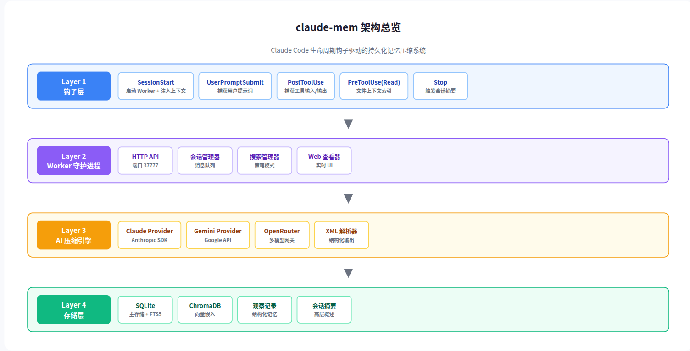
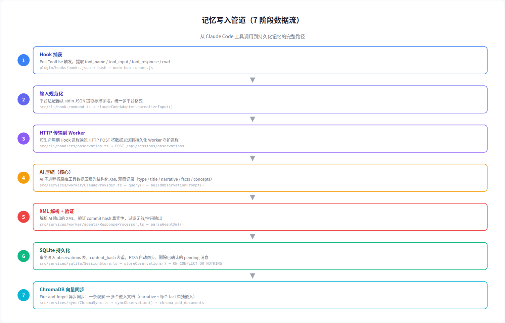
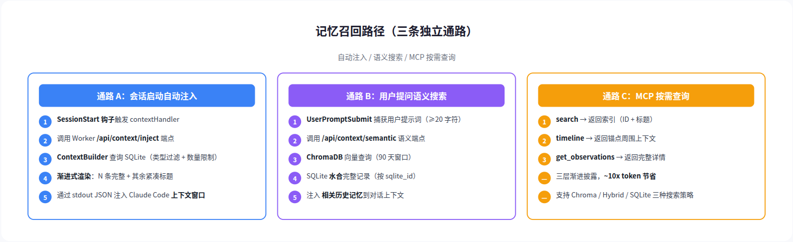
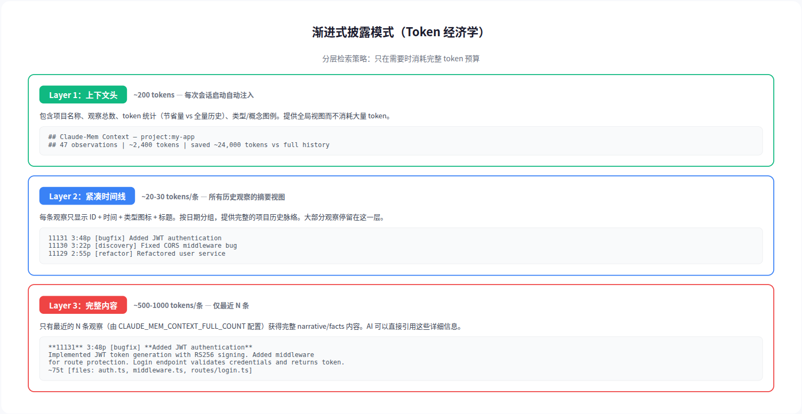
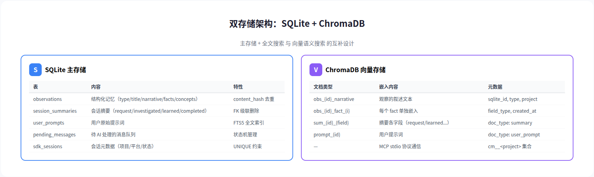

# claude-mem 源码深度分析：记忆写入与召回机制

> **核心发现：** claude-mem 通过"AI 压缩 + 渐进式披露"的组合，将原始工具调用数据转化为结构化记忆，以 ~10x 的 token 节省率注入未来会话——这是一个围绕 token 经济学精心设计的记忆系统。

---

## 目录

1. [概述](#1-概述)
2. [架构总览](#2-架构总览)
3. [记忆写入管道](#3-记忆写入管道)
4. [记忆召回路径](#4-记忆召回路径)
5. [渐进式披露机制](#5-渐进式披露机制)
6. [双存储架构](#6-双存储架构)
7. [隐私与透明度审计](#7-隐私与透明度审计)
8. [总结与启示](#8-总结与启示)

---

## 1. 概述

**项目信息**

| 项目 | 详情 |
|------|------|
| 仓库 | [thedotmack/claude-mem](https://github.com/thedotmack/claude-mem) |
| 版本 | v13.6.1（持续活跃更新） |
| Stars | 82.6k |
| 语言 | TypeScript / Node.js（ES modules） |
| 协议 | Apache-2.0（核心依赖 `claude-agent-sdk` 为 Anthropic 商业许可） |
| 作者 | Alex Newman (@thedotmack) |

claude-mem 是为 Claude Code 构建的持久化记忆压缩系统。与简单的键值存储不同，它使用 AI 将原始工具调用压缩为结构化的"观察记录"，并通过 ChromaDB 向量数据库实现语义检索。

**核心设计原则**

| 原则 | 含义 |
|------|------|
| AI 压缩优先 | 不存原始数据，用 AI 生成结构化观察记录 |
| 渐进式披露 | 分层检索，只在需要时消耗完整 token 预算 |
| 双存储互补 | SQLite 做主存储+全文搜索，ChromaDB 做语义搜索 |
| Fire-and-forget | SQLite 先写成功，向量同步异步不阻塞 |
| 一拆多嵌入 | 一条观察拆成多个嵌入文档，提高检索粒度 |

---

## 2. 架构总览

系统分为四层，自上而下依次为钩子层、Worker 守护进程、AI 压缩引擎和存储层。

### 分层说明

| 层 | 名称 | 核心组件 | 运行方式 |
|----|------|---------|---------|
| Layer 1 | 钩子层 | SessionStart / UserPromptSubmit / PostToolUse / Stop | 短生命周期 Node 进程 |
| Layer 2 | Worker 守护进程 | HTTP API + 会话管理器 + 搜索管理器 + Web UI | Bun 持久进程（端口 37777） |
| Layer 3 | AI 压缩引擎 | Claude / Gemini / OpenRouter Provider + XML 解析器 | AI SDK 子进程 |
| Layer 4 | 存储层 | SQLite（主存储+FTS5）+ ChromaDB（向量嵌入） | 本地持久化 |

### 核心设计洞察

claude-mem 的关键创新在于 Layer 3——它不是简单地存储工具调用的原始输入输出（这些数据量巨大且噪声多），而是启动一个 AI 子进程来"理解"这些数据，将其压缩为人类可读的结构化观察记录。每条记录包含类型（bugfix/discovery/decision/refactor）、标题、叙述文本、事实列表和概念标签。

这种设计的代价是每次工具调用都需要一次额外的 AI 推理，但收益是存储质量极高——未来会话注入的上下文都是经过 AI 理解和提炼的高信号信息，而非原始的工具噪声。

---

## 3. 记忆写入管道

写入链路经过 7 个阶段，从 Claude Code 的工具调用一直延伸到持久化存储。

### 阶段 1-2：钩子捕获与输入规范化

当 Claude Code 执行工具调用后，`PostToolUse` 钩子自动触发。钩子注册在 `plugin/hooks/hooks.json` 中，每个钩子执行一个 bash 命令启动短生命周期的 Node 进程。

平台适配器（`src/cli/adapters/claude-code.ts`）从 stdin 的 JSON 中提取标准化字段：会话 ID、工具名称、工具输入输出、工作目录等。

### 阶段 3：HTTP 传输到 Worker

短生命周期的 Hook 进程通过 HTTP POST 将数据发送到持久化的 Worker 守护进程。这是架构的关键分界线——钩子进程用完即弃，Worker 进程常驻后台管理状态。

| 钩子处理器 | HTTP 端点 | 用途 |
|-----------|----------|------|
| sessionInitHandler | POST /api/sessions/init | 初始化会话 |
| observationHandler | POST /api/sessions/observations | 提交工具观察 |
| summarizeHandler | POST /api/sessions/summarize | 触发会话摘要 |
| contextHandler | GET /api/context/inject | 注入历史上下文 |

### 阶段 4：AI 压缩（核心创新）

Worker 接收到原始工具数据后，将其放入 `SessionMessageBuffer` 内存队列。随后启动 AI 子进程（通过 `@anthropic-ai/claude-agent-sdk` 的 `query()` 方法），将批量工具调用发送给 AI 进行压缩。

AI 的输出是结构化 XML，包含以下字段：

| 字段 | 类型 | 含义 |
|------|------|------|
| type | enum | bugfix / discovery / decision / refactor / other |
| title | string | 一句话标题 |
| narrative | string | 2-3 句叙述文本 |
| facts | string[] | 关键事实列表 |
| concepts | string[] | 概念标签（如"authentication"、"cors"） |
| files_read | string[] | 涉及的读取文件 |
| files_modified | string[] | 涉及的修改文件 |

### 阶段 5-7：解析、持久化与向量同步

`ResponseProcessor` 解析 AI 返回的 XML，验证 commit hash 真实性（防止 AI 编造），然后通过事务写入 SQLite。写入使用 `ON CONFLICT(memory_session_id, content_hash) DO NOTHING` 实现内容级去重。

SQLite 写入成功后，ChromaDB 同步以 fire-and-forget 方式异步执行。一条观察被拆成多个嵌入文档——narrative 一个、每个 fact 各一个——以提高语义检索的粒度。

---

## 4. 记忆召回路径

系统提供三条独立的召回通路，覆盖从自动注入到按需查询的全场景。

### 通路 A：会话启动自动注入

这是最核心的召回路径。每次 Claude Code 启动新会话时，`SessionStart` 钩子触发 `contextHandler`，调用 Worker 的 `/api/context/inject` 端点。

`ContextBuilder` 从 SQLite 查询最近的观察记录（带类型和概念过滤），然后通过渐进式渲染生成上下文文本，最终通过 stdout JSON 注入 Claude Code 的上下文窗口。

### 通路 B：用户提问语义搜索

当 `CLAUDE_MEM_SEMANTIC_INJECT=true` 且用户提问超过 20 字符时，系统自动对用户提示词进行语义搜索。查询发送到 ChromaDB，返回与当前问题最相关的历史观察（默认 5 条，90 天时间窗口）。

搜索策略链采用降级模式：ChromaDB 可用时走语义搜索，不可用时降级到 SQLite FTS5 全文搜索，最终降级到 LIKE 模糊匹配。

### 通路 C：MCP 按需查询

MCP 服务器暴露三个工具，遵循三层渐进披露模式：

| 工具 | 返回内容 | Token 成本 |
|------|---------|-----------|
| search | ID + 标题 + 时间（索引层） | ~20-30/条 |
| timeline | 锚点周围的时间线上下文 | ~100-200 |
| get_observations | 完整 narrative/facts | ~500-1000/条 |

---

## 5. 渐进式披露机制

渐进式披露是 claude-mem 最巧妙的设计。它解决的核心问题是：历史记忆可能有数百条，但上下文窗口的 token 预算有限。

### 三层渲染策略

**Layer 1（上下文头）**：项目名称、观察总数、token 统计。成本约 200 tokens，每次会话注入一次。让 AI 知道"有多少历史记忆可用"而不消耗大量 token。

**Layer 2（紧凑时间线）**：每条观察只显示 ID + 时间 + 类型图标 + 标题。成本约 20-30 tokens/条。大部分历史观察停留在这一层，AI 可以浏览完整的历史脉络。

**Layer 3（完整内容）**：只有最近的 N 条观察（由 `CLAUDE_MEM_CONTEXT_FULL_COUNT` 配置）获得完整的 narrative/facts 内容。成本约 500-1000 tokens/条。

### Token 经济学

假设项目有 50 条历史观察：
- 全量注入：50 × 800 = **40,000 tokens**
- 渐进式披露：5 × 800 + 45 × 25 + 200（头）= **5,325 tokens**
- **节省率：约 87%**

---

## 6. 双存储架构

### SQLite 主存储

SQLite 是系统的"真相来源"，存储所有结构化数据。核心表包括 observations（结构化记忆）、session_summaries（会话摘要）、user_prompts（用户提示词）和 pending_messages（待处理队列）。

所有表都配有 FTS5 虚拟表实现全文搜索，并通过触发器自动同步。Schema 经过 34+ 版本迁移迭代，设计成熟。

### ChromaDB 向量存储

ChromaDB 通过 MCP stdio 协议作为子进程运行（`chroma-mcp` v0.2.6，默认本地 persistent 模式）。它的职责是提供语义搜索能力。

关键设计：一条观察记录被拆成多个嵌入文档。例如一条包含 3 个 facts 的观察会产生 5 个嵌入文档（1 narrative + 1 text + 3 facts）。这使得语义检索可以在 fact 级别匹配，而非只能匹配整条观察。

---

## 7. 隐私与透明度审计

基于源码审计，以下是关键隐私发现：

### 遥测系统（默认开启）

| 项目 | 详情 |
|------|------|
| 目的地 | `https://us.i.posthog.com`（PostHog US） |
| 默认状态 | **ON**（opt-out，非 opt-in） |
| 关闭方式 | `DO_NOT_TRACK=1` 或 `npx claude-mem telemetry disable` |
| 发送内容 | 系统信息、使用指标、AI 使用统计、Worker 健康数据 |
| 不发送 | 文件路径、项目名、提示词、观察内容 |
| IP 地理定位 | 开启（`disableGeoip: false`） |

### 文档与代码矛盾

`SECURITY.md` 第 157 行声称"Claude-mem does not collect telemetry"，但源码中有完整的 PostHog 遥测系统且默认开启。这是一个严重的文档诚信问题。

### 本地存储透明度

所有数据存储在 `~/.claude-mem/` 下，SQLite + ChromaDB 均为标准格式，可直接查询。没有云端同步机制，数据完全留在本地。

### 非开源依赖

核心依赖 `@anthropic-ai/claude-agent-sdk` 受 Anthropic 商业服务条款约束，不是开源许可。这是唯一的非开源组件。

---

## 8. 总结与启示

### 核心设计启示

**AI 压缩是值得的。** 虽然每次工具调用都增加一次 AI 推理成本，但换来的是极高的记忆质量。相比存储原始工具噪声，AI 压缩后的观察记录信噪比极高。

**渐进式披露是必须的。** 在 token 受限的场景下，"先给索引、再给上下文、最后给详情"的三层模式可以将 token 消耗降低 80% 以上。

**双存储互补是合理的。** SQLite 做精确查询和全文搜索，ChromaDB 做语义向量搜索，两者各司其职。fire-and-forget 的异步同步策略也避免了存储层成为性能瓶颈。

### 使用建议

如果考虑使用 claude-mem，务必：
1. 安装后立即运行 `npx claude-mem telemetry disable` 关闭遥测
2. 了解 `@anthropic-ai/claude-agent-sdk` 的商业许可条款
3. 定期检查 `~/.claude-mem/` 目录的磁盘占用

---

*分析基于 claude-mem v13.6.1 全部核心源码，包括 plugin/hooks/、src/cli/handlers/、src/services/worker/、src/services/sqlite/、src/services/sync/、src/services/context/ 等约 15 个关键文件。*
