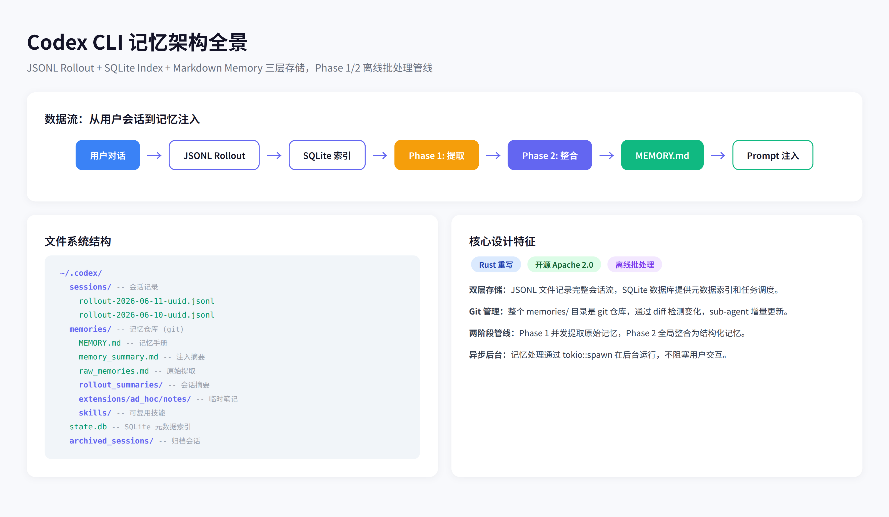
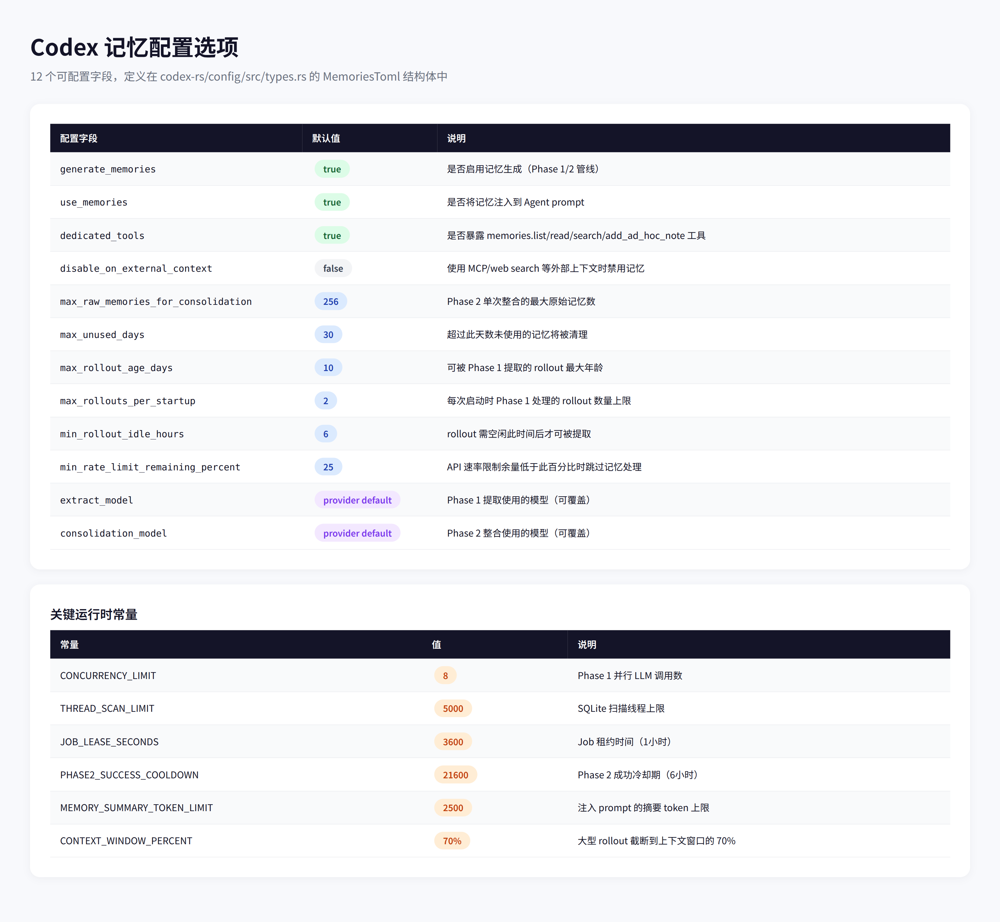
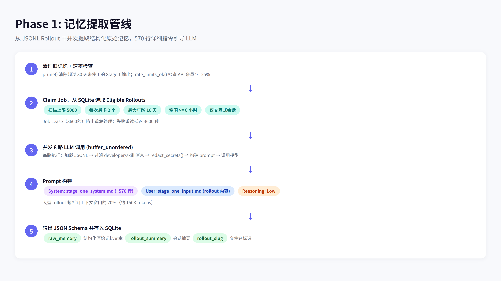
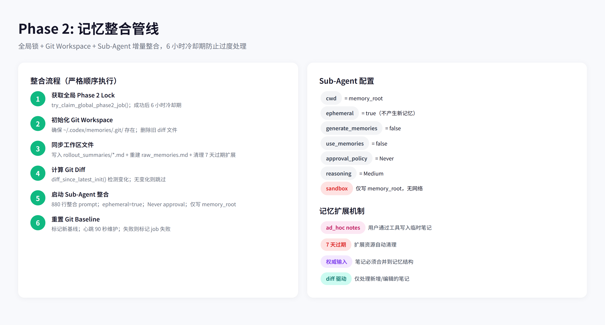
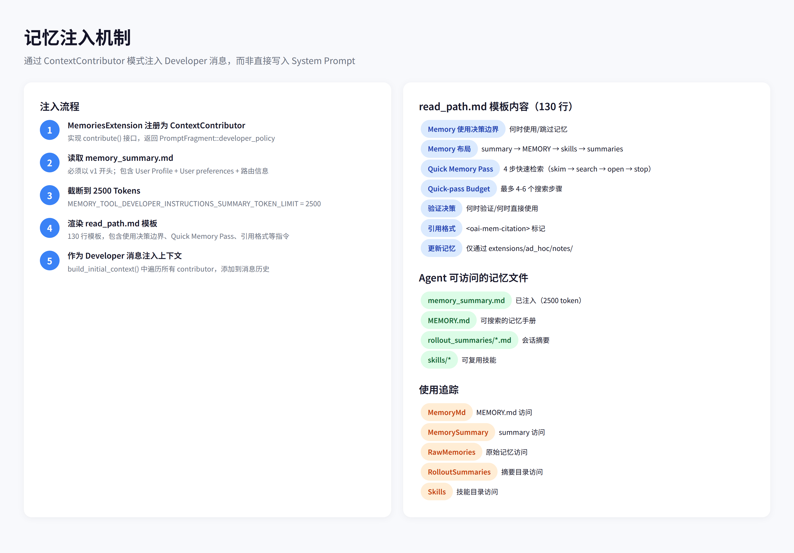
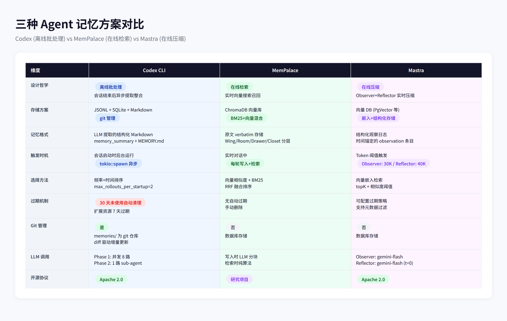

# OpenAI Codex CLI 记忆系统深度分析

## 1. Codex CLI 概述

**OpenAI Codex CLI** 是 OpenAI 开源的命令行 AI 编程助手，采用 Rust 重写，Apache 2.0 协议发布。与 Claude Code 类似，它是一个终端内的 Agent，能够读写文件、执行命令、与用户自然语言交互。

但 Codex CLI 的记忆系统与市面上其他方案截然不同——它采用**离线批处理**架构：不在对话中实时提取记忆，而是在会话结束后，通过两阶段异步管线（Phase 1 提取 + Phase 2 整合）将对话历史转化为结构化知识。

这种设计的核心优势是**零延迟**：记忆处理完全在后台进行，不会影响用户的交互体验。

---

## 2. 记忆架构全景

Codex 的记忆系统由三层存储和两阶段处理管线组成：

**三层存储结构：**

| 层级 | 存储 | 位置 | 作用 |
|------|------|------|------|
| 会话层 | JSONL 文件 | `~/.codex/sessions/` | 完整对话流记录 |
| 索引层 | SQLite 数据库 | `~/.codex/state.db` | 元数据索引 + 任务调度 |
| 记忆层 | Markdown 文件 | `~/.codex/memories/` | 结构化记忆（git 管理） |

**数据流：** 用户对话 → JSONL Rollout → SQLite 索引 → Phase 1 提取 → Phase 2 整合 → MEMORY.md → Prompt 注入

记忆目录 `~/.codex/memories/` 本身是一个 **git 仓库**，Phase 2 通过 git diff 检测变化，实现增量更新。这在所有 Agent 记忆方案中是独一无二的设计。

---

## 3. 记忆配置

Codex 提供了 12 个可配置字段，定义在 `codex-rs/config/src/types.rs` 的 `MemoriesToml` 结构体中：

**关键配置说明：**

- **generate_memories / use_memories**：分别控制记忆生成和记忆注入，可以独立开关
- **max_raw_memories_for_consolidation=256**：Phase 2 单次整合的原始记忆上限
- **max_unused_days=30**：超过 30 天未被引用的记忆自动清理
- **max_rollouts_per_startup=2**：每次启动只处理 2 个 rollout，避免资源争用
- **min_rollout_idle_hours=6**：rollout 需空闲 6 小时后才可被提取，确保会话已结束
- **extract_model / consolidation_model**：Phase 1 和 Phase 2 可使用不同模型

**运行时常量**（硬编码，不可配置）：

| 常量 | 值 | 说明 |
|------|-----|------|
| CONCURRENCY_LIMIT | 8 | Phase 1 并行 LLM 调用数 |
| THREAD_SCAN_LIMIT | 5000 | SQLite 扫描上限 |
| JOB_LEASE_SECONDS | 3600 | Job 租约时间（1小时） |
| PHASE2_SUCCESS_COOLDOWN | 21600 | Phase 2 冷却期（6小时） |
| MEMORY_SUMMARY_TOKEN_LIMIT | 2500 | 注入 prompt 的 token 上限 |
| CONTEXT_WINDOW_PERCENT | 70% | rollout 截断阈值 |

---

## 4. Phase 1: 提取

Phase 1 是记忆管线的第一阶段，从 JSONL Rollout 中提取结构化原始记忆。

**触发条件：** 每次新会话启动时，通过 `tokio::spawn` 在后台异步执行。跳过临时会话（ephemeral）、子 Agent 会话、以及未启用 MemoryTool 的情况。

**Step 1：清理 + 速率检查**

`prune()` 清除超过 30 天未使用的 Stage 1 输出（批量 200 条）。`rate_limits_ok()` 检查 API 余量是否 >= 25%，低于阈值则跳过整个管线。

**Step 2：Claim Job**

从 SQLite 中选取 eligible rollouts。筛选逻辑相当精细：扫描上限 5000 条，每次最多 claim 2 个，仅选择 10 天内、空闲 6 小时以上、来源为交互式的会话。每个 job 有 3600 秒的 lease，防止重复处理。

**Step 3：并发 8 路 LLM 调用**

使用 `futures::stream::buffer_unordered(8)` 实现并发。每路执行：加载 JSONL → 过滤 developer/skill 消息 → `redact_secrets()` 脱敏 → 构建 prompt → 调用模型。

**Step 4：Prompt 构建**

System prompt 使用 `stage_one_system.md`，长达 **570 行**详细指令，指导 LLM 如何从对话中提取有价值的记忆。User message 使用 `stage_one_input.md` 模板，包含 rollout 内容。大型 rollout 会被截断到上下文窗口的 70%。

**Step 5：输出**

要求 LLM 返回 JSON 格式：`{raw_memory, rollout_summary, rollout_slug}`，直接存入 SQLite 数据库。

---

## 5. Phase 2: 整合

Phase 2 是记忆管线的第二阶段，将 Phase 1 提取的原始记忆整合为结构化的长期记忆。

**全局锁机制：** `try_claim_global_phase2_job()` 确保同一时间只有一个 Phase 2 在运行。成功后有 **6 小时冷却期**，防止过于频繁的整合操作。

**Git Workspace 管理：**

整个 `~/.codex/memories/` 目录是一个 git 仓库。Phase 2 的流程是：

1. 确保 `.git/` 存在（首次初始化或重新初始化）
2. 同步 rollout_summaries/*.md + raw_memories.md 到工作区
3. 清理超过 7 天的扩展资源文件
4. 通过 `git diff` 计算工作区变化
5. 将 diff 写入 `phase2_workspace_diff.md`（最大 4MB）
6. 启动 sub-agent 进行整合
7. 完成后重置 git baseline

**Sub-Agent 配置：**

整合 agent 是一个高度受限的独立 agent：ephemeral=true（不产生新记忆）、Never approval（无需确认）、sandbox 仅允许写 memory_root、无网络访问。使用 `consolidation_model`，reasoning 设为 Medium。

整合 prompt 长达 **880 行**，基于 `templates/memories/consolidation.md`。Sub-agent 读取 diff + raw_memories + 现有 MEMORY.md，更新记忆手册、摘要文件和技能目录。

**记忆扩展机制：**

用户可以通过 dedicated tools 写入 ad-hoc notes，这些笔记存储在 `extensions/ad_hoc/notes/` 目录下。Phase 2 会将这些笔记作为权威输入合并到记忆结构中。扩展资源有 **7 天过期**机制，自动清理过期文件。

---

## 6. 记忆注入

Codex 的记忆**不直接注入到 System Prompt**，而是通过 `ContextContributor` 模式注入为 **Developer 消息**。

**注入流程：**

1. `MemoriesExtension` 实现 `ContextContributor` trait
2. 在 `build_initial_context()` 时（每轮对话开始前），遍历所有 contributor
3. 读取 `~/.codex/memories/memory_summary.md`
4. 截断到 **2500 tokens**
5. 渲染到 130 行的 `read_path.md` 模板中
6. 作为 `PromptFragment::developer_policy` 添加到 developer 消息

**read_path.md 模板** 包含丰富的指令：

- **Memory 使用决策边界**：何时使用/跳过记忆
- **Quick Memory Pass**：4 步快速检索流程（skim → search MEMORY.md → open summaries → stop）
- **Quick-pass Budget**：最多 4-6 个搜索步骤，避免过度检索
- **引用格式**：`<oai-mem-citation>` 标记，追踪记忆使用来源
- **更新记忆**：仅允许通过 `extensions/ad_hoc/notes/` 写入

**memory_summary.md 格式：**

必须以 `v1` 开头，包含 `## User Profile`（用户画像）、`## User preferences`（用户偏好）、以及项目/任务相关的路由信息。这是注入到 prompt 中的核心内容。

**使用追踪：**

当 agent 通过文件工具读取记忆文件时，`memories_usage_kinds_from_command()` 会自动分类追踪：MemoryMd、MemorySummary、RawMemories、RolloutSummaries、Skills 五种类型。

---

## 7. 上下文压缩

除了长期记忆，Codex 还有**上下文压缩（Compaction）**机制，用于处理单次会话中的上下文窗口溢出。

**触发方式：**

| 触发时机 | 说明 |
|----------|------|
| Pre-turn | 每轮开始前检查 token 使用量 |
| Mid-turn | 模型采样后仍超出限制时 |
| Manual | 用户通过 `/compact` 命令 |
| Model Switch | 切换到更小上下文窗口模型时 |

**两种 scope 模式：**

- **Total**：`active_context_tokens >= auto_compact_token_limit()`
- **BodyAfterPrefix**：扣除 prefill tokens 后的 body 超限

**压缩流程：**

1. 将 compact prompt 添加到历史
2. 调用 LLM 生成摘要（prompt 要求包含：当前进度、关键决策、上下文约束、剩余任务、关键数据）
3. 用 `SUMMARY_PREFIX + summary` 替换历史
4. 运行 pre/post compact hooks

**远程压缩：** 如果 provider 支持，Codex 会使用远程 API 进行压缩（`compact_remote.rs`），而非本地调用。

---

## 8. 会话管理

Codex 的会话管理采用 JSONL + SQLite 双层架构。

**JSONL Rollout 格式：**

每个会话对应一个 `rollout-<ISO8601>-<UUID>.jsonl` 文件，每行一个 JSON 对象：

| 类型 | 说明 |
|------|------|
| SessionMeta | 会话元数据（首个作为 canonical） |
| ResponseItem | 模型响应/用户消息/工具调用 |
| Compacted | Compaction 标记 |
| TurnContext | Turn 上下文边界 |
| EventMsg | 事件消息 |

**SessionMeta** 包含 thread_id（UUID）、model、cwd、source 等关键信息。

**会话恢复：**

`RolloutRecorder::resume(path)` 打开现有 JSONL 文件，逐行解析为 `Vec<RolloutItem>`，第一个 SessionMeta 作为 canonical thread_id，返回 items 重建会话状态。

**会话选择逻辑：**

按时间倒序扫描，`resume_candidate_matches_cwd()` 检查 cwd 是否匹配，选择最近的匹配会话。

**Thread Metadata 同步：**

记录 `memory_mode` 状态：`enabled`（正常）、`disabled`（禁用）、`polluted`（使用了 MCP/web search 等外部上下文）。当 `disable_on_external_context=true` 时，polluted 状态会禁用记忆注入。

**归档机制：**

完成的会话可移动到 `~/.codex/archived_sessions/` 目录，SQLite 索引保持同步。

---

## 9. 三种方案对比

将 Codex 与 MemPalace、Mastra 三种代表性记忆方案进行对比：

| 维度 | Codex CLI | MemPalace | Mastra |
|------|-----------|-----------|--------|
| **设计哲学** | 离线批处理 | 在线检索 | 在线压缩 |
| **存储方案** | JSONL + SQLite + Markdown (git) | ChromaDB 向量库 | 向量 DB (PgVector 等) |
| **记忆格式** | LLM 提取的结构化 Markdown | 原文 verbatim 存储 | 结构化观察日志 |
| **触发时机** | 会话启动时后台运行 | 实时对话中每轮写入+检索 | Token 阈值触发 (30K/40K) |
| **选择方法** | 频率+时间排序 | 向量相似度 + BM25 RRF | 向量嵌入 topK |
| **过期机制** | 30 天自动清理 + 7 天扩展过期 | 无自动过期 | 可配置过期策略 |
| **Git 管理** | 是（memories/ 为 git 仓库） | 否 | 否 |
| **LLM 调用** | Phase 1 并发 8 + Phase 2 sub-agent | 写入时 LLM 分块 | Observer + Reflector |
| **开源协议** | Apache 2.0 | 研究项目 | Apache 2.0 |

**核心差异：**

- **Codex** 是唯一采用离线批处理的方案，零延迟但有 6 小时整合间隔
- **MemPalace** 是唯一使用 verbatim 存储的方案，保留原始语义但存储开销大
- **Mastra** 是唯一使用双 Agent 压缩的方案，压缩比 5-40x 但可能丢失细节
- **Codex** 是唯一使用 git 管理记忆的方案，支持版本控制和 diff 驱动增量更新

---

## 10. 总结与启示

Codex CLI 的记忆系统展现了几个值得关注的设计决策：

**离线批处理 vs 在线处理：** Codex 选择在会话结束后异步处理记忆，代价是新会话无法立即获得上一次对话的记忆（需要等待 Phase 1/2 完成），但换来了零延迟的交互体验。这在高频使用的开发工具中是合理的取舍。

**Git 作为记忆版本控制：** 将整个记忆目录作为 git 仓库管理，通过 diff 驱动增量更新，这是一个优雅的设计。它天然支持版本回溯、冲突检测和增量同步。

**双阶段管线的解耦：** Phase 1（提取）和 Phase 2（整合）完全解耦，Phase 1 可以并发处理多个 rollout，Phase 2 通过全局锁保证一致性。这种设计使得系统可以优雅地处理积压的 rollout。

**570 + 880 行的 Prompt 工程：** Phase 1 的提取 prompt 长达 570 行，Phase 2 的整合 prompt 长达 880 行。这说明在没有向量检索的情况下，精心设计的 prompt 是引导 LLM 进行结构化记忆提取的关键。

**ContextContributor 模式：** 记忆不直接写入 System Prompt，而是通过可插拔的 ContextContributor 接口注入为 Developer 消息。这种设计保持了架构的灵活性，未来可以支持多种记忆源。

**与其他方案的互补性：** Codex 的离线批处理可以与 MemPalace 的在线检索或 Mastra 的实时压缩结合——例如，用在线方案提供即时记忆，用离线方案进行深度整合和知识沉淀。

---

*本报告基于 OpenAI Codex CLI 源码（Rust 重写版本）的深度分析，源码路径：codex-rs/memories/、codex-rs/config/、codex-rs/ext/memories/、codex-rs/core/src/compact.rs*
