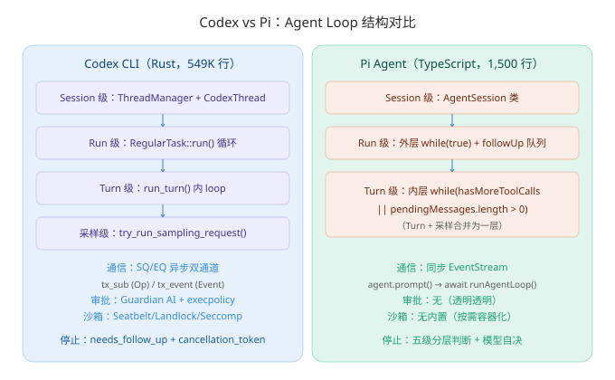

# Codex CLI vs Pi Agent：Agent Loop 实现对比分析

> **核心发现：Pi 用 1,500 行 TypeScript 实现了 LLM→工具的标准循环，Codex 用 549,000 行 Rust 实现了一个带队列对协议、Guardian AI 审批和 OS 级沙箱的企业级 Agent 运行时——两者在"循环结构"层有惊人的相似性，在"工程复杂度"层有数量级的差异。**
> 调研日期：2026-08-05 | 来源：codex-source 仓库源码（codex-rs/core/） + pi-source 仓库源码（packages/agent/src/）

## 一、概览

**情境**：Codex CLI 和 Pi 是 2025-2026 年两个最具代表性的开源 AI 编码代理。Codex 由 OpenAI 官方维护，拥有 71K+ Stars 和 549,000 行 Rust 代码；Pi 由 Mario Zechner 独立开发，拥有 83K+ Stars 和核心循环仅 793 行 TypeScript。两者的工程哲学和实现路径形成鲜明对比。**问题**：它们如何实现 agent 循环？核心机制上有何异同？各自的取舍是什么？**答案**：本文基于两个仓库的源码分析，从循环结构、消息管道、工具执行、停止识别、提示词组装、沙箱和审批七个维度进行对比。

### 关键指标对比

| 指标 | Codex CLI | Pi Agent |
|------|----------|----------|
| ⭐ Stars | 71,700+ | 83,400+ |
| 📝 语言 | Rust（94.7%） | TypeScript |
| 📦 代码规模 | 549,000 行 / 60+ crate | agent-loop.ts 793 行 / agent.ts 588 行 |
| 🔒 沙箱 | Seatbelt/Bubblewrap/Landlock/Seccomp | 无内置（按需容器化） |
| 🏗️ 架构 | 队列对协议 + 三层循环 | 双层 while 循环 |
| 🤖 审批 | Guardian AI + execpolicy | 透明透明，无权限弹窗 |
| 💬 通信模式 | 异步双通道（SQ/EQ） | 同步 EventStream |
| 📜 许可证 | Apache 2.0 | MIT |


> 上图对比了两者的循环层级和关键架构特征。Codex 多了一层 Task 级循环和采样级独立函数，因为其异步双通道通信需要将"请求提交"和"事件广播"解耦为两个独立的 tokio 通道。Pi 将 Turn 和采样合并为一层，因为其同步 EventStream 模式不需要跨线程的 TUI 渲染。

## 二、循环结构：三层 vs 双层

**本节结论**：Codex 比 Pi 多了一层——在 Run 级和 Turn 级之间加入了 Task 级的 RegularTask 循环。这一层的引入是为了处理 Codex 更复杂的"交互模式"（实时对话、子 agent、审查任务），而不仅仅是"用户输入→agent 响应"的标准流程。

### 2.1 层级对比

| 层级 | Codex CLI 实现 | Pi Agent 实现 |
|------|---------------|--------------|
| Session 级 | ThreadManager + CodexThread | AgentSession 类 |
| Run 级 | RegularTask::run() 循环（反复调用 run_turn） | 外层 while(true) + followUp 队列 |
| Turn 级 | run_turn() 内 loop（pending input 检查） | 内层 while(hasMoreToolCalls \|\| pendingMessages) |
| 采样级 | run_sampling_request() → try_run_sampling_request() | streamAssistantResponse() |

Codex 的 Task 层（`tasks/regular.rs`）对应 Pi 的外层循环，但多了一个关键差异：**Codex 的 Task 循环中可以切换不同类型的 Task**（RegularTask、CompactTask、ReviewTask），而 Pi 的外层循环只处理 follow-up 消息队列。

```rust
// Codex RegularTask (tasks/regular.rs)
impl SessionTask for RegularTask {
    async fn run(...) -> SessionTaskResult {
        loop {
            let last_agent_message = run_turn(sess, ctx, next_input, ...).await?;
            if !sess.input_queue.has_pending_input(...).await {
                return Ok(last_agent_message);
            }
            next_input = Vec::new();
        }
    }
}
```

对应 Pi 的外层循环（agent-loop.ts:262-268）：

```typescript
const followUpMessages = (await config.getFollowUpMessages?.()) || [];
if (followUpMessages.length > 0) {
    pendingMessages = followUpMessages;
    continue;
}
break;
```

### 2.2 Turn 内循环对比

在 Turn 级别，两者的结构几乎一致：

| 步骤 | Codex | Pi |
|------|-------|-----|
| 1. 注入 pending 输入 | `sess.input_queue.get_pending_input()` | `config.getSteeringMessages()` |
| 2. 构建 prompt | `build_prompt(input, router, turn_context, instructions)` | `convertToLlm(messages)` → `Context { systemPrompt, messages, tools }` |
| 3. 调用 LLM | `run_sampling_request()` → `try_run_sampling_request()` | `streamAssistantResponse()` |
| 4. 流式处理 | `stream.next()` → `OutputItemDelta`/`OutputItemDone` | `response` 事件迭代器 → `text_delta`/`toolcall_delta` |
| 5. 工具执行 | `handle_output_item_done()` → 触发 ToolCallRuntime | `executeToolCalls()` |
| 6. 追加结果 | `sess.record_conversation_items()` | `currentContext.messages.push(result)` |
| 7. 决定继续 | `needs_follow_up` 布尔值 | `hasMoreToolCalls` 布尔值 |

**我的判断**：两者的 Turn 级循环在逻辑上是同构的——都是"输入→LLM→工具→反馈→继续"的经典 ReAct 模式。差异在于实现复杂度：Codex 的 `run_turn()` 函数引用了 65 个不同的 module（turn.rs 第 1-80 行的 import 列表），而 Pi 的 `runLoop()` 只依赖本地的几个类型和工具函数。这不是好坏之分——Codex 需要处理 MCP 服务器连接、connector 选择、环境选择、pre/post hooks、并发上下文捕获等企业级需求；Pi 不需要。

## 三、通信模式：异步队列对 vs 同步 EventStream

**本节结论**：Codex 使用双通道异步架构（Submission Queue / Event Queue）实现客户端与 Agent 的解耦，Pi 使用同步的 EventStream 模式实现简单的生产者-消费者模型。这是两者架构上最深层的差异。

### 3.1 Codex 的队列对协议

Codex 的核心通信基于两个 `tokio` 异步通道（`protocol/src/protocol.rs`）：

```
客户端（TUI/AppServer）
   |
   | Submission { id, op: Op::UserInput { items } }
   v
tx_sub ──────────────────────────→ Session
                                       |
                                       | process Op
                                       | run_turn()
                                       |
tx_event ←────────────────────────── Session
   |
   v
客户端渲染 Event::ResponseText, Event::TokenCount, ...
```

- **Submission 通道**：客户端发送 `Op::UserInput`、`Op::Interrupt`、`Op::Shutdown` 等操作
- **Event 通道**：Session 广播 `Event::ResponseText`、`Event::TurnComplete`、`Event::Error` 等事件

关键设计：**TUI 永远不会被阻塞**。当模型推理时，TUI 可以继续渲染、处理键盘输入、显示流式 token。`run_turn()` 在 tokio 异步运行时中执行，不占用主线程。

### 3.2 Pi 的 EventStream 模式

Pi 使用同步的 `EventStream`（agent-loop.ts:145-150）：

```typescript
function createAgentStream(): EventStream<AgentEvent, AgentMessage[]> {
    return new EventStream<AgentEvent, AgentMessage[]>(
        (event) => event.type === "agent_end",       // 结束检测
        (event) => event.type === "agent_end" ? event.messages : [],
    );
}
```

Pi 的 `Agent` 类在 `runWithLifecycle()` 中创建 AbortController，整个 prompt 调用在单个 async 函数中完成（agent.ts:482-505）。没有分离的 TUI 线程，因为 Pi 的 TUI 是单线程差分渲染（`pi-tui`），不需要跨线程通信。

### 3.3 差异的影响

| 场景 | Codex 的表现 | Pi 的表现 |
|------|------------|----------|
| 模型推理期间用户输入 | 通过 SQ 队列异步注入，TUI 不阻塞 | 通过 steering queue 同步注入，需等待当前 turn 结束 |
| 多客户端连接 | 支持（AppServer 可同时服务 VS Code/Web/TUI） | 不支持（单进程 CLI） |
| 中断当前操作 | `Op::Interrupt` → cancellation_token 取消 | `agent.abort()` → AbortController.abort() |
| 事件广播 | 所有连接客户端同时接收 | 仅本进程内的 listener |

**我的判断**：Codex 的队列对协议是生产级多客户端架构的必要代价——它使同一个 Codex 核心能够同时驱动 TUI、VS Code 扩展、Web 界面和 CI/CD 脚本。Pi 的同步模式对单进程 CLI 已经足够，且代码量只有 Codex 的 1/10。如果你的 agent 只需要驱动一个终端界面，Pi 的模式更合适；如果需要支持多种客户端，Codex 的 SQ/EQ 模式值得参考。

## 四、工具执行与审批

**本节结论**：工具执行层面两者高度相似（都支持并行/串行+JSON Schema 验证），但 Codex 多了一层企业级的审批和沙箱系统——Guardian AI 自动审批低风险命令，OS 级沙箱限制文件系统和网络访问。Pi 将安全责任完全交给用户和容器化基础设施。

### 4.1 工具定义对比

| 维度 | Codex | Pi |
|------|-------|-----|
| 工具定义格式 | `ToolSpec` enum（Function/Namespace/WebSearch/ToolSearch/Freeform） | `ToolDefinition` interface（name/description/parameters/promptSnippet） |
| Schema 验证 | Rust 编译时类型安全 + JSON Schema | Typebox（TypeScript 运行时验证） |
| 并行执行 | 支持，通过 ToolCallRuntime + RwLock 管理 | 支持，通过 Promise.all() |
| 串行执行 | Shell 命令使用 shared lock 串行化 | 工具的 executionMode: "sequential" 声明 |
| MCP 集成 | 内置，作为一等公民 | 不内置（通过 bash + README 替代） |
| Web Search | 内置（Responses API 服务端工具） | 不内置 |
| 动态工具 | ToolSearch（模型可搜索工具、动态发现） | Extensions（jiti 热重载 TypeScript 文件） |

### 4.2 审批机制

Codex 的审批是一个完整的子系统，而 Pi 完全没有内置审批：

| 特性 | Codex | Pi |
|------|-------|-----|
| 审批模型 | Guardian AI（自动审批低风险命令）+ 用户手动审批 | 无（透明透明，以用户权限运行） |
| 审批粒度 | 每命令可配置（execpolicy、patchpolicy） | 无 |
| 审批流程 | Op::ExecApproval → Guardian 评估 → 用户决策 | 直接执行 |
| 安全保证 | OS 级沙箱（Seatbelt/Landlock/Seccomp） | 文档推荐容器化（用户自行实现） |

Codex 的审批流程是一个独立的 Op 类型：

```
工具调用 → Guardian AI 评估风险
  ↓
低风险 → 自动执行
  ↓
高风险 → Op::ExecApproval → Event::ExecApprovalRequest → 用户决策
  ↓
用户批准 → 执行
用户拒绝 → 返回拒绝结果
```

**我的看法**：Codex 的审批系统体现了"信任但验证"的工程哲学，适合企业环境中需要审计和安全合规的场景。Pi 的"诚实透明"策略——不假装自己是安全的，把选择权完全交给用户——更适合个人开发者或已经有容器化基础设施的团队。没有哪种策略绝对更好，取决于你的安全假设。

## 五、提示词组装与上下文管理

**本节结论**：Codex 使用 OpenAI Responses API 的 ResponseItem 格式（不需要手动转换消息类型），Pi 使用自定义 AgentMessage + convertToLlm 转换管道。Codex 的 compaction 是模型原生支持（GPT-5.2-Codex），Pi 的 compaction 是 LLM 生成摘要后以 user 角色注入。

### 5.1 提示词结构对比

| 维度 | Codex | Pi |
|------|-------|-----|
| 系统提示词 | `prompt.md` 文件（~400 行 Markdown）通过 `include_str!` 嵌入 | `buildSystemPrompt()` 运行时组装（~160 行 TypeScript） |
| 消息格式 | `ResponseItem[]`（OpenAI 原生格式，无需转换） | `AgentMessage[]` → `convertToLlm()` → `Message[]` |
| 工具定义 | `Vec<ToolSpec>`（模型可见工具规范） | `AgentContext.tools`（JSON Schema 数组） |
| 技能注入 | `build_skill_injections()` 在 turn 开始前注入 system prompt | `formatSkillsForPrompt()` 生成 `<available_skills>` XML 块 |
| 上下文文件 | AGENTS.md（自动发现） | 同 AGENTS.md（手动配置或自动发现） |

Codex 的提示词组装在 `turn.rs` 中完成，核心函数：

```rust
pub(crate) fn build_prompt(
    input: Vec<ResponseItem>,          // 对话历史 + 用户输入
    router: &ToolRouter,               // 工具定义
    turn_context: &TurnContext,        // Turn 配置
    base_instructions: BaseInstructions, // 系统提示词
) -> Prompt {
    Prompt {
        input,
        tools: router.model_visible_specs(),
        parallel_tool_calls: turn_context.model_info.supports_parallel_tool_calls,
        base_instructions,
        output_schema: ...,
        output_schema_strict: ...,
    }
}
```

Pi 的提示词组装在 agent-loop.ts 中：

```typescript
const llmMessages = await config.convertToLlm(messages);
const llmContext: Context = {
    systemPrompt: context.systemPrompt,
    messages: llmMessages,
    tools: context.tools,
};
```

关键差异：Codex 使用 OpenAI 原生 `ResponseItem[]` 格式，数据流中不需要"自定义消息→标准消息"的转换步骤。Pi 因为支持 15+ 供应商，必须通过 `convertToLlm()` 做一次转换。

### 5.2 上下文压缩

| 维度 | Codex | Pi |
|------|-------|-----|
| 触发条件 | 每 turn 前 pre-sampling compact + token 预算感知 | token 窗口溢出 + 可配置阈值 |
| 压缩方式 | GPT-5.2-Codex 原生 compaction（remote compact） | LLM 生成摘要文本 |
| 注入方式 | 替换历史，RemoteCompactTask 在后台运行 | `compactionSummary` 消息（user 角色 + XML）|
| 恢复能力 | 压缩失败自动回退到大窗口模型 | overflowRecoveryAttempted 单次重试 |

**我的判断**：Codex 的 compaction 得益于 OpenAI 生态的原生支持（GPT-5.2-Codex 在模型层面理解如何压缩对话），比 Pi 的"生成摘要文本然后伪装成 user 消息"更优雅。但 Pi 的做法是供应商中性的——任何支持 text completion 的模型都能用于 compaction，不需要原生 API 支持。

## 六、停止识别与错误处理

**本节结论**：Codex 的停止逻辑分散在多个层面（needs_follow_up 布尔值 + response Completed 事件 + pending_input 检查 + cancellation_token），Pi 的停止逻辑集中在五级判断中。Codex 有更完善的错误处理和重试机制（上下文窗口回退、速率限制退避），Pi 的错误处理更简单直接。

### 6.1 停止条件对比

| 停止条件 | Codex 实现 | Pi 实现 |
|---------|-----------|---------|
| 模型返回 done | `ResponseEvent::Completed` → `needs_follow_up = false` | `stopReason === "stop"` 且无 toolCall → `hasMoreToolCalls = false` |
| 有待执行工具 | `needs_follow_up = true`（tool call output 未处理完） | `toolCalls.length > 0` → `hasMoreToolCalls = true` |
| 用户中断 | `Op::Interrupt` / `cancellation_token.cancel()` | `AbortController.abort()` |
| 错误 | `ResponseStreamError` → 重试或 `TurnError` | `stopReason === "error"` → 立即退出 |
| Token 截断 | 响应被截断，工具调用标记为不完整 | `stopReason === "length"` → 工具调用全部失败不执行 |
| Pending 输入 | `input_queue.has_pending_input()` 返回 true → 继续循环 | `pendingMessages.length > 0` → 继续循环 |
| Hook 干预 | `run_turn_stop_hooks()` 返回 true | `shouldStopAfterTurn?()` 返回 true |

### 6.2 错误处理

Codex 有一个完整的重试系统（`responses_retry.rs`），处理以下场景：

- 上下文窗口溢出 → 自动 compact 后重试
- 速率限制（429）→ 指数退避重试
- 连接断开 → 重新建立连接
- Token 预算超限 → 切换到更大上下文窗口的模型

Pi 的错误处理相对简单——agent-loop.ts:196-200 检查 `stopReason === "error"` 后直接 exit，compaction 部分有一次 overflow recovery 重试。

## 七、批判性分析

### 7.1 Codex 的优势

1. **生产级工程**：549,000 行 Rust 代码不是冗余——它代表了企业级 Agent 需要的所有功能：OS 级沙箱、MCP 集成、多客户端通信、审批工作流、实时音频对话、子 agent 编排。Codex 是"如果你需要一切"的方案。

2. **Responses API 深度集成**：因为 Codex 由 OpenAI 维护，它可以利用 Responses API 的独家功能：原生 compaction、prompt caching、Web Search 服务端工具。这些功能对非 OpenAI 模型不可用——但如果你使用 GPT 系列模型，Codex 提供了最佳体验。

3. **异步架构的可扩展性**：SQ/EQ 双通道设计使 Codex 的同一个核心可以驱动 TUI、VS Code 扩展、Web 界面和 CI/CD 脚本——不需要为每个客户端重新实现 agent logic。

4. **Guardian AI 审批**：自动审批低风险命令的设计降低了用户的操作负担，同时保持了安全性。这在企业部署中是必需功能。

### 7.2 Codex 的不足

1. **供应商锁定**：Codex 深度绑定 OpenAI Responses API。如果你想使用 Claude、Gemini 或其他模型，Codex 不是合适的选择。**范围限定**：对于不需要多模型支持的开发者，这不是问题；对于需要模型灵活性的团队，这是一个显著限制。

2. **代码复杂度**：549,000 行的 Rust 代码库意味着学习成本极高。理解 `run_turn()` 需要追踪 65 个不同的 Rust module——这对于一个想定制 agent 行为的开发者来说是不小的负担。

3. **配置复杂度**：分层配置系统（用户/项目/MDM/云端）提供了灵活性，但也增加了配置错误的可能性。相比之下，Pi 的配置只需一个 `.pi/` 目录。

### 7.3 Pi 对 Codex 的独特优势

| 优势 | 说明 |
|------|------|
| 模型无关 | 15+ LLM 供应商，完全 BYOK，不被任何厂商锁定 |
| 源码可读性 | 793 行 agent-loop.ts 可在一小时内读完并理解全部逻辑 |
| 自扩展性 | jiti 热重载 TypeScript 扩展，agent 可自己写自己的工具 |
| npm 生态集成 | Skills/Extensions/Packages 全部通过 npm 分发 |

### 7.4 Codex 对 Pi 的独特优势

| 优势 | 说明 |
|------|------|
| CEO 级沙箱 | Landlock + Bubblewrap + Seccomp（Linux），安全边界清晰 |
| 多客户端支持 | 同一 agent 核心驱动 TUI/VS Code/Web/CI |
| 审批工作流 | Guardian AI 自动审批 + 用户手动确认 |
| 原生 Compaction | GPT-5.2-Codex 模型层面理解对话压缩 |
| 实时对话 | RealtimeConversation 模式支持语音交互 |

## 八、对 Agent 开发的启示

1. **循环结构是收敛的**：Codex 和 Pi 的 Turn 级循环几乎完全同构——"输入→LLM→工具→反馈→继续"。这说明 ReAct 模式是编码代理的"正确答案"，差异只在实现复杂度和附加功能层。

2. **通信模式的取舍取决于客户端需求**：如果你只需要驱动一个终端，Pi 的同步 EventStream 完全够用；如果你需要支持多种客户端，Codex 的 SQ/EQ 双通道架构是经过生产验证的选择。

3. **安全策略反映部署假设**：Codex 假设 agent 运行在不受信任的环境中，因此需要 OS 级沙箱和审批系统；Pi 假设 agent 运行在受控的开发环境中，安全由用户自己负责。你的 agent 的部署假设决定了你应该在安全层投入多少工程资源。

4. **供应商绑定 vs 模型灵活性**：Codex 通过绑定 OpenAI 获得了原生 compaction、prompt caching 等独家能力；Pi 通过保持供应商中立获得了 15+ 模型的灵活性和 BYOK 的自由。这是一个经典的权衡——你选择"深度集成一个生态"还是"广度覆盖多个生态"。

5. **工程复杂度与团队规模匹配**：Codex 的 60+ crate 架构需要一个团队来维护；Pi 的 4 包 monorepo 一个开发者就能驾驭。选择哪种架构取决于你的团队规模和长期维护能力——而不是哪个更"先进"。

## 参考来源

1. **Codex CLI 仓库**：https://github.com/openai/codex（分析版本：深度克隆于 2026-08-05）
2. **Pi 仓库**：https://github.com/earendil-works/pi（分析版本：v0.83.0）
3. **Codex turn.rs**：`codex-rs/core/src/session/turn.rs`（~2,500+ 行）
4. **Codex protocol.rs**：`codex-rs/protocol/src/protocol.rs`（Op/Event enum 定义）
5. **Codex prompt.md**：`codex-rs/models-manager/prompt.md`（系统提示词）
6. **Codex session.rs**：`codex-rs/core/src/session/session.rs`（Session 结构体）
7. **Codex regular.rs**：`codex-rs/core/src/tasks/regular.rs`（RegularTask 循环）
8. **Codex tool_spec.rs**：`codex-rs/tools/src/tool_spec.rs`（ToolSpec enum）
9. **Pi agent-loop.ts**：`packages/agent/src/agent-loop.ts`
10. **Pi agent.ts**：`packages/agent/src/agent.ts`
11. **Codex CLI Internals 系列**：https://codex.danielvaughan.com/2026/04/10/codex-cli-internals-queue-pair-guardian-sandbox
12. **Codex CLI 内部实现解析**：https://yage.ai/share/codex-cli-internals-survey-20260314.html

---

*报告生成日期：2026-08-05 | 调研工具：codex-source + pi-source 源码对比分析*
