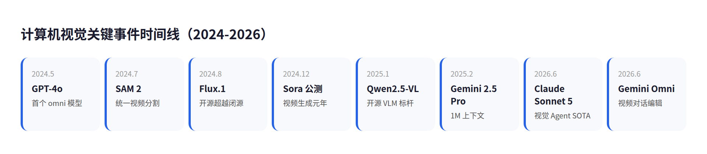
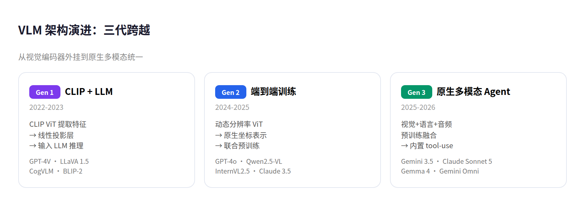
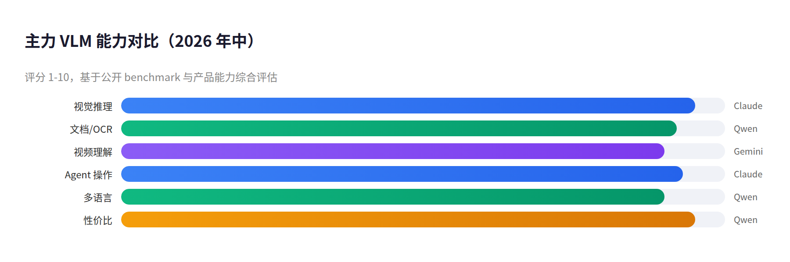
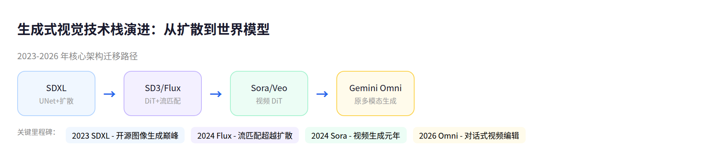
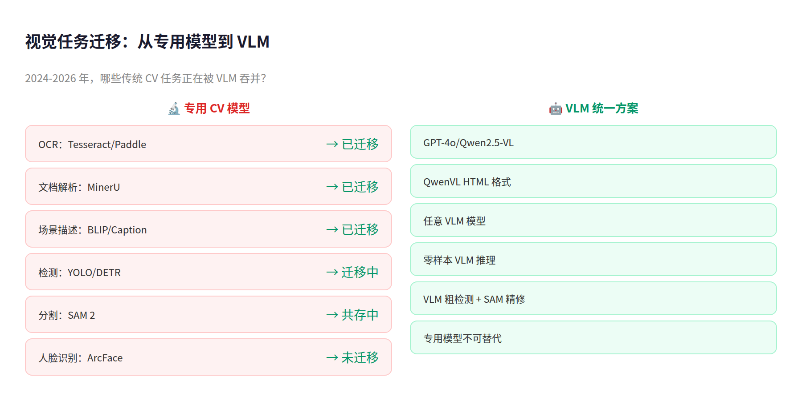
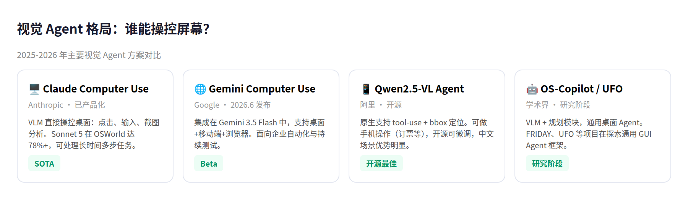
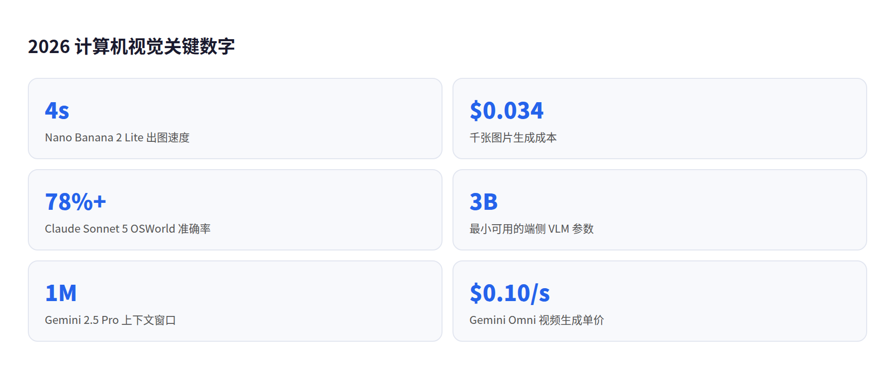

# 计算机视觉与大模型视觉：2024-2026 全景调研

> **核心发现**：LLM 正在吞噬计算机视觉。2024-2026 年，传统 CV 范式被多模态大模型（VLM）彻底重塑——检测、分割、OCR 等任务正从专用模型迁移到通用的视觉-语言框架中。与此同时，生成式视觉（Flux、Sora、Gemini Omni）从图片延伸到视频，具备了真正的世界建模能力。

---

## 目录

1. [概述：范式转移中的视觉 AI](#1-概述范式转移中的视觉-ai)
2. [大模型视觉：VLM 全面崛起](#2-大模型视觉vlm-全面崛起)
3. [生成式视觉：从图片到世界模型](#3-生成式视觉从图片到世界模型)
4. [传统 CV：被吞噬还是被增强？](#4-传统-cv被吞噬还是被增强)
5. [视觉 Agent 与具身智能](#5-视觉-agent-与具身智能)
6. [批判性分析](#6-批判性分析)
7. [总结与启示](#7-总结与启示)

---

## 1. 概述：范式转移中的视觉 AI

2026 年的计算机视觉已不再是 2022 年的那个领域。过去两年发生了两场静悄悄的革命：**多模态大模型（VLM）的全面成熟**和**生成式视觉的世界建模化**。

第一场革命来自 LLM。GPT-4o（2024.5）首次实现了文本、图像、音频的端到端统一处理；Gemini 从第一天就设计为原生多模态；Claude Sonnet 5（2026.6）在视觉推理和 Agent 任务上逼近 Opus 级别。这些模型的共同特征：**视觉不再是一个附加"编码器"，而是与语言推理深度耦合的核心能力**。

第二场革命来自扩散模型。Flux（2024.8）、Sora（2024.12）、Kling 2.0（2025）、Gemini Omni Flash（2026.6）让视频生成从玩具走向实用。它们不再是"图片的序列化拼接"，而是理解了物理规律（重力、光照、遮挡）的世界模型雏形。

与此同时，传统 CV 任务——检测、分割、跟踪——正在被 VLM 的"一句话搞定"范式挑战。SAM 2（2024.7）是传统路线的巅峰，但它诞生之时，也正是 VLM 开始吞噬这些任务之时。

### 关键时间线

| 时间 | 事件 | 影响 |
|------|------|------|
| 2024.5 | GPT-4o 发布 | 首个端到端 omni 模型 |
| 2024.7 | SAM 2 发布 | 视频分割统一模型 |
| 2024.8 | Flux.1 发布 | 开源图像生成超越 SD3 |
| 2024.12 | Sora 公开 | 视频生成正式产品化 |
| 2025.1 | Qwen2.5-VL 发布 | 开源 VLM 标杆，3B 可跑边缘 |
| 2025.2 | Gemini 2.5 Pro | 100 万 token 上下文 + 原生多模态 |
| 2025.6 | Claude 4 Sonnet | 视觉推理大幅提升 |
| 2026.6 | Claude Sonnet 5 | Agentic vision，逼近 Opus 性能 |
| 2026.6 | Gemini Omni Flash | 视频生成 + 对话式编辑，API 开放 |
| 2026.6 | Gemma 4 12B | 本地运行的开源视觉+语音模型 |

---

## 2. 大模型视觉：VLM 全面崛起

### 2.1 架构演进：从缝合到原生

VLM 的架构经历了三个清晰的代际：

| 代际 | 代表模型 | 架构 | 视觉编码方式 |
|------|---------|------|-------------|
| 1.0 | GPT-4V, LLaVA-1.5 | 视觉编码器 + LLM（独立训练，缝合） | CLIP ViT 提取特征 → 投影层 → LLM |
| 2.0 | GPT-4o, Qwen2.5-VL, InternVL2 | 端到端训练，动态分辨率 | 原生动态分辨率 ViT，无坐标归一化 |
| 3.0 | Gemini 3.5, Claude Sonnet 5 | 原生多模态 + Agent 原生 | 视觉与语言在预训练阶段融合，支持 tool-use |

**关键创新**：Qwen2.5-VL 的视觉编码器做了两件重要的事：
- **动态分辨率 + Window Attention**：只有 4 层全注意力，其余用窗口注意力（最大 8×8），大幅减少计算量
- **真实坐标表示**：检测框坐标直接使用图像实际尺寸，不做归一化，让模型真正"理解"尺度

这三代的演化方向非常清晰：**减少独立组件，增加端到端训练，让视觉成为语言推理的有机部分而非外挂**。

### 2.2 核心能力对比

| 维度 | GPT-4o | Claude Sonnet 5 | Gemini 2.5 Pro | Qwen2.5-VL 72B |
|------|--------|----------------|----------------|-----------------|
| 发布时间 | 2024.5 | 2026.6 | 2025.2 | 2025.1 |
| 上下文窗口 | 128K | 200K | 1M | 128K |
| 视频理解 | ✓ | ✓ | ✓ | ✓（时长达 1h+） |
| 多图推理 | ✓ | ✓ | ✓ | ✓ |
| OCR/文档 | 强 | 最强（图表推理突出） | 强 | 极强（QwenVL HTML 格式） |
| Agent 能力 | 中等 | 极强（OSWorld SOTA） | 中等 | 强（支持 tool-use） |
| 视觉定位 | 弱 | 中等 | 中等 | 强（bbox/point/JSON） |
| 价格（输入/1M） | $2.5 | $3 | $1.25 | 开源免费 |

我特别想强调 **Claude Sonnet 5 的视觉 Agent 能力**——它在 OSWorld 上达到了 78%+ 的准确率（经过方法学修正后），能够像人一样操作浏览器和桌面软件。这比单纯的"看图说话"进了一大步。

### 2.3 开源 VLM 生态

开源生态的进展非常快，尤其是在中国：

| 模型 | 参数 | 亮点 |
|------|------|------|
| Qwen2.5-VL | 3B/7B/32B/72B | 动态分辨率 ViT，原生视觉 Agent，文档解析 |
| InternVL2.5 | 1B-78B | 多尺度动态分辨率，首个 MMMU 破 70% 开源模型 |
| DeepSeek-VL2 | 3B/16B/27B | MoE 架构，动态分块视觉编码 |
| CogVLM2 | 19B (8B+11B) | Visual Expert 深度融合，DocVQA 92.3% 超 GPT-4V |
| LLaVA-NeXT | 7B/13B | 任意分辨率，学术标杆 |
| Gemma 4 12B | 12B | 本地运行，视觉+语音统一架构 |

**Qwen2.5-VL 3B 是一个标志性模型**：3B 参数即可在边缘设备上跑 VLM，性能超过上一代 7B。这意味着 VLM 正在从云端走向端侧。

### 2.4 2025 下半年重要更新

进入 2025 年下半年，开源 VLM 又经历了一次重大迭代：

| 模型 | 发布时间 | 参数量 | 核心创新 |
|------|---------|--------|---------|
| Qwen3-VL | 2025.9 | 2B-235B (Dense+MoE) | DeepStack 多层 ViT 融合、Interleaved-MRoPE 位置编码、3D Grounding、256K 原生上下文、32 语言 OCR |
| InternVL3.5 | 2025.8 | 1B-241B-A28B (MoE) | CascadeRL 两阶段 RL 训练、开源 SOTA、MoE 激活比极致优化 |

**Qwen3-VL** 的 DeepStack 架构将浅层 ViT 细节与深层语义信息同时注入 LLM，配合 256K 上下文窗口，使其在长视频理解和多页文档分析上大幅超越前代。其 MoE 变体（30B-A3B）仅激活 3B 参数即可达到接近 Qwen2.5-VL-72B 的性能，极致压缩了推理成本。

**InternVL3.5** 家族则以 241B-A28B 的规格登顶开源 VLM 排行榜。其 CascadeRL 训练策略——先离线 RL 后在线 RL——在数学推理（MathVista）和 Agent 任务上都实现了显著提升。值得注意的是，InternVL 系列的迭代速度是所有开源 VLM 中最快的：2024 年底 MMMU 破 70%，2025 年 4 月登顶，8 月再次刷新 SOTA。

---

## 3. 生成式视觉：从图片到世界模型

生成式视觉是过去两年变化最大的子领域。核心趋势是 **从扩散模型（Diffusion）到流匹配（Flow Matching），从图片到视频，从单帧到世界模型**。

### 3.1 图像生成的技术栈迁移

| 模型 | 发布时间 | 核心架构 | 特色 |
|------|---------|---------|------|
| SDXL | 2023.7 | UNet + 扩散 | 开源标杆 |
| SD3 | 2024.6 | MMDiT（DiT+双流） | 文本渲染大幅改进 |
| Flux.1 | 2024.8 | 流匹配 + DiT | 12B 参数，开源超越闭源 |
| Nano Banana 2 | 2026.6 | Gemini 3.1 Flash | 最快 4 秒出图，$0.034/千张 |

**Flux.1 的里程碑意义**：这是开源模型首次在图像质量上系统性超越 Midjourney 和 DALL-E。其背后的 **流匹配（Flow Matching）** 方法比传统扩散更稳定、收敛更快。Stable Diffusion 的 UNet 架构被 DiT（Diffusion Transformer）取代已成定局。

Google 的 **Nano Banana 系列** 也很值得关注：从 Nano Banana（v1）到 Nano Banana 2 Lite，延迟从数十秒压缩到 4 秒，成本降到 $0.034/千张——这意味着图像生成已经进入了"可大规模生产"的成本区间。

### 3.2 视频生成的爆发

视频生成是 2024-2026 年最火热的赛道：

| 模型 | 发布时间 | 核心能力 | 可用性 |
|------|---------|---------|--------|
| Sora | 2024.12 | 文生视频，最长 1 分钟 | OpenAI API |
| Kling 2.0 | 2025 | 文/图生视频，动作一致性 | 快手 API |
| Veo 3.1 | 2025 | 高质量长视频 | Google Vertex |
| HunyuanVideo | 2024.12 | 开源 13B，DiT 架构 | 开源 |
| Gemini Omni Flash | 2026.6 | 视频生成+对话式编辑，10 秒 | Google API，$0.10/秒 |

**Gemini Omni Flash 的"对话式编辑"** 是一个很有前瞻性的功能：你可以用自然语言迭代修改视频——"把背景换成海滩"、"让角色走慢一点"——就像在和视频编辑师对话。这背后是 Gemini 系列的原生多模态推理能力在起作用。

### 3.3 核心趋势：从生成到理解

我最关注的一个趋势是：**生成式模型正在获得"理解"能力**。Nano Banana 系列基于 Gemini 架构，它不是单纯的扩散模型——它理解 prompt 中的空间关系、物理约束和叙事逻辑。这标志着生成模型从"像素拼贴"阶段进入了"世界建模"阶段。

---

## 4. 传统 CV：被吞噬还是被增强？

### 4.1 检测与分割

| 任务 | 传统 SOTA | VLM 替代方案 | 谁赢了？ |
|------|----------|-------------|---------|
| 物体检测 | YOLOv11, DETR | GPT-4o / Qwen2.5-VL (零样本) | 专用模型精度更高，VLM 更灵活 |
| 实例分割 | SAM 2 | Qwen2.5-VL bbox 输出 | SAM 2 精细度更好 |
| OCR | PaddleOCR, Tesseract | GPT-4o, Qwen2.5-VL, GOT | VLM 已全面超越（多语言、多方向） |
| 文档解析 | MinerU, marker-pdf | Qwen2.5-VL HTML 格式 | VLM 在复杂版式上更强 |
| 人脸识别 | ArcFace | VLM 太少关注 | 专用模型仍是唯一选择 |

**SAM 2 是传统 CV 路线的巅峰也是终点**。它用一个统一模型处理图像和视频分割，支持点/框/掩码 prompt，推理速度快。但它的局限性也很明显：只能做分割，不能理解物体是什么、在做什么。而 Qwen2.5-VL 可以一句话输出 JSON 格式的检测框+标签。

### 4.2 OCR 已被 VLM 吞并

OCR 可能是第一个被 VLM 完全吞噬的传统 CV 子领域。Qwen2.5-VL 的 QwenVL HTML 格式可以从杂志、论文、网页截图甚至手机界面中提取带位置的结构化 HTML，这是传统 OCR 引擎做不到的。GOT（General OCR Theory）也展示了大模型在 OCR 上的统一化趋势。

### 4.3 我看到的模式

传统 CV 不会"死亡"，但它会经历一个角色转换：**从端到端解决方案变为 VLM 的子模块或训练数据来源**。就像 SAM 2 的 mask 可以作为 VLM 的训练素材，YOLO 的检测框可以作为 VLM 微调的 ground truth。

---

## 5. 视觉 Agent 与具身智能

### 5.1 视觉 Agent（GUI Agent）

这是 VLM 最激动人心的应用方向：让模型像人一样操作屏幕。

| 框架/模型 | 核心思路 | 状态 |
|----------|---------|------|
| Claude Computer Use | VLM 直接操控桌面 | 已产品化，Sonnet 5 领先 |
| Gemini 3.5 Flash Computer Use | 集成到模型本身 | 2026.6 发布 |
| Qwen2.5-VL Agent | 原生支持 tool-use + 定位 | 开源可用 |
| OS-Copilot / UFO | VLM + 规划模块 | 学术阶段 |

**Claude Sonnet 5 在 OSWorld 上的突破**是整个领域的里程碑。它不只是在静态图片上回答问题——它能真正操作 UI、点击按钮、填写表单、甚至处理"对象暂时从视野中消失"的情况。

### 5.2 具身智能与机器人

视觉能力是机器人"大脑"的核心输入：

| 模型 | 核心贡献 | 关键创新 |
|------|---------|---------|
| RT-2 (Google) | VLM 直接输出机器人动作 | 视觉-语言-动作统一 |
| Octo (Berkeley) | 开源通用机器人模型 | 多机器人平台统一 |
| π₀ (Physical Intelligence) | 具身基础模型 | 视觉-动作联合预训练 |
| OpenVLA | 开源 VLA（视觉-语言-动作） | 7B 参数，可微调 |

具身智能目前仍处于早期阶段——视觉感知做得很好了，但物理交互（抓取、移动、力控制）仍然是瓶颈。

---

## 6. 批判性分析

### 6.1 VLM 的「虚火」与「真实力」

我对 VLM 的评价是：**在理解性任务上真实可用，在精确性任务上仍有差距**。

VLM 在描述图片、回答文档问题、识别场景等方面确实远超传统 CV。但当任务需要像素级精度（医疗影像分割、工业缺陷检测）时，传统专用模型仍然有明显的优势。VLM 的检测框可能偏移几个像素，这在自动驾驶场景中是致命的——这也是为什么 Wayve 和特斯拉仍然依赖专用视觉模型做感知，VLM 只做规划。

### 6.2 开源 vs 闭源的「生态裂谷」

一个值得警惕的现象：**开源 VLM 在能力上追得很快，但在 Agent 和世界建模上差距仍在拉大**。

Qwen2.5-VL 72B 在文档理解、OCR、定位方面已经不输 GPT-4o，但 Claude Sonnet 5 的 Agent 能力（自主规划、多步推理、错误恢复）是开源模型短期内难以达到的。原因很简单：Agent 能力需要的不是更大的模型，而是海量的交互数据 + 强化学习 + 工具集成——这些都需要 API 级别的产品化投入。

### 6.3 「世界模型」是真实还是营销？

Sora、Gemini Omni、Veo 都被称为"世界模型"，但我认为**目前它们更接近"世界外观模型"而非"世界物理模型"**。

它们能生成看起来符合物理规律的视频（球落地会弹起、水会流动），但这些都是从训练数据中学到的视觉模式，而非真正的物理推理。证据是：当你要求生成违反直觉的场景时（比如把水杯倒过来水不流出来），模型可能会产生不一致的结果。真正的世界模型需要理解因果，而不仅仅是视觉一致性。

### 6.4 中国 CV 生态的特殊位置

中国的 CV 生态有一个独特的优势：**开源 VLM 的领先地位**。Qwen2.5-VL、InternVL、DeepSeek-VL 都是中国团队主导的开源项目，在全球范围内有广泛影响力。同时，快手的 Kling 和腾讯的 HunyuanVideo 在视频生成领域也形成了对 Sora 的竞争。

但一个短板是：**中国在 Agent 和具身智能方面的产品化落后于美国**。Claude Computer Use 和 Gemini Computer Use 已经融入 API，中国还没有对应的成熟产品。

---

## 7. 总结与启示

### 七个关键结论

| # | 结论 | 影响 |
|---|------|------|
| 1 | VLM 已从"实验品"变成"默认方案" | 新项目优先考虑 VLM 而非专用 CV 模型 |
| 2 | OCR 和文档解析已被 VLM 吞并 | 传统 OCR 引擎需求大幅下降 |
| 3 | 生成式视觉进入"世界建模"阶段 | 视频生成从玩具走向生产工具 |
| 4 | Agent（视觉操控）是下一个主战场 | Claude/Gemini 正在定义新的交互范式 |
| 5 | 开源 VLM（尤其是中国团队）追赶速度极快 | 中文场景已有成熟的本地化方案 |
| 6 | 端侧 VLM 从不可能变成现实 | Qwen2.5-VL 3B、Gemma 4 12B 可本地推理 |
| 7 | 传统 CV 不会死，但角色变为"VLM 的辅助" | 精细分割、人脸识别等领域仍有专用模型空间 |

### 对开发者的建议

- **如果你在做一个视觉类产品**，优先考虑 VLM API（GPT-4o/Gemini）或开源 VLM（Qwen2.5-VL），而非从头训练专用模型
- **如果你在做精确测量类任务**（工业检测、医疗影像），传统方法 + VLM 混合方案仍然最优——用专用模型做像素级分割，用 VLM 做场景理解
- **如果你在探索 Agent**，Claude Sonnet 5 + Computer Use 是目前最强的组合
- **如果你在中文场景**，Qwen2.5-VL + 国产视频生成模型（Kling/HunyuanVideo）已经构成了完整的工具链

---

*调研基于 OpenAI、Anthropic、Google、Meta、Qwen、DeepSeek 等官方博客及技术报告，arXiv 最新论文，以及 GitHub 开源仓库。调研时间：2026 年 7 月。*
