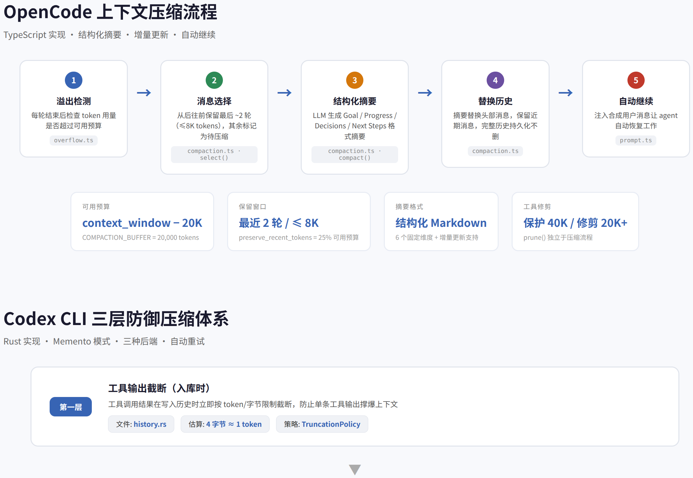
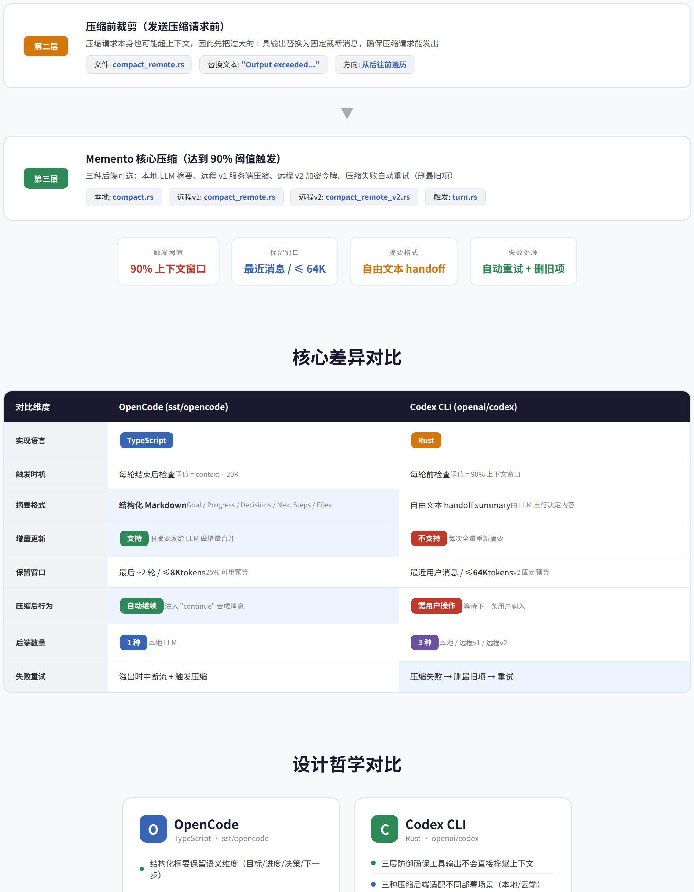
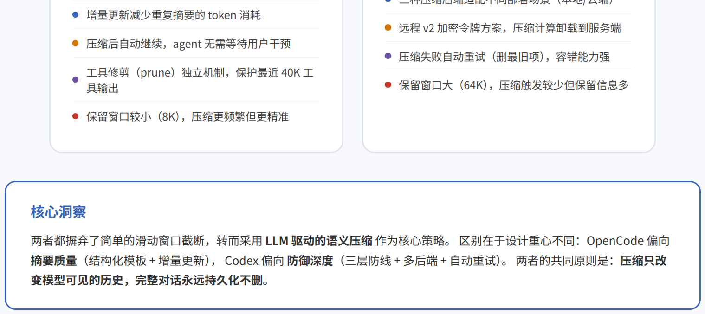
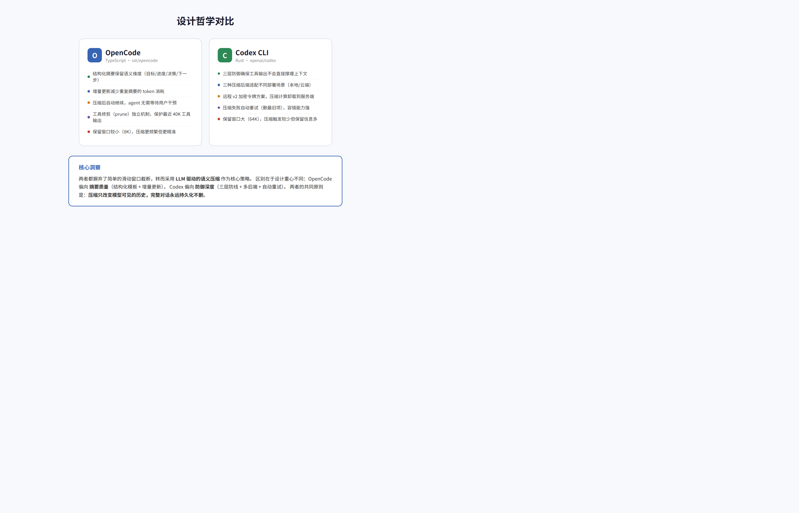

# OpenCode vs Codex CLI 上下文压缩机制深度对比

> 核心发现：两者都摒弃了简单的滑动窗口截断，转而采用 **LLM 驱动的语义压缩**。OpenCode 偏向摘要质量（结构化模板 + 增量更新），Codex 偏向防御深度（三层防线 + 多后端 + 自动重试）。

---

## 目录

1. [概述](#1-概述)
2. [OpenCode 的压缩架构](#2-opencode-的压缩架构)
3. [Codex CLI 的压缩架构](#3-codex-cli-的压缩架构)
4. [对比分析](#4-对比分析)
5. [总结与启示](#5-总结与启示)

---

## 1. 概述

编码 Agent（如 OpenCode、Codex CLI）在执行多轮工具调用时，对话历史会快速膨胀。一次文件读取可能返回数千行代码，一次搜索可能返回数十个文件的匹配结果。如果不加管理，几次交互就会触及模型的上下文窗口限制。

传统的做法是**滑动窗口截断**——保留最近 N 条消息，丢弃更早的内容。但这种方式丢失了所有历史上下文，Agent 会"忘记"之前做过什么、遇到过什么错误、做出过什么决策。对于需要长程推理的编码任务来说，这是致命的。

OpenCode 和 Codex CLI 都选择了更智能的路径：**用 LLM 对历史对话进行语义压缩**，生成结构化的摘要来替代冗长的原始对话。这样既释放了上下文空间，又保留了关键信息。

| 项目 | 仓库 | 语言 | 核心策略 |
|------|------|------|----------|
| OpenCode | [sst/opencode](https://github.com/sst/opencode) | TypeScript | 结构化摘要 + 增量更新 |
| Codex CLI | [openai/codex](https://github.com/openai/codex) | Rust | 三层防御 + Memento 压缩 |

---

## 2. OpenCode 的压缩架构

OpenCode 的压缩机制围绕一个清晰的五步流程展开：溢出检测 → 消息选择 → 结构化摘要 → 替换历史 → 自动继续。

### 触发机制

OpenCode 采用**响应式触发**——每轮助手回复结束后，检查 token 用量是否超过可用预算。可用预算的计算公式为：`可用预算 = 模型上下文窗口 − 20,000`。其中 20K 是 `COMPACTION_BUFFER`，预留了足够的空间给压缩请求本身和模型输出。

此外，OpenCode 还支持**运行时溢出检测**：如果 LLM 在流式输出过程中返回上下文溢出错误，处理器会立即中断流（通过 `Stream.takeUntil`），设置 `needsCompaction = true`，然后触发压缩流程。这意味着即使在极端情况下（比如突然插入大量工具输出），系统也能自愈。

### 结构化摘要模板

OpenCode 最大的特色是使用**固定格式的 Markdown 摘要模板**，包含六个语义维度：

| 维度 | 作用 | 保留的关键信息 |
|------|------|----------------|
| Goal | 当前任务目标 | 用户最初想做什么 |
| Constraints & Preferences | 约束和偏好 | 技术选型、编码风格等限制 |
| Progress | 进度（Done / In Progress / Blocked） | 哪些做完了、哪些在做、哪些卡住了 |
| Key Decisions | 关键决策 | 为什么选方案 A 而不是 B |
| Next Steps | 下一步 | 接下来要做什么 |
| Critical Context | 关键上下文 | 不可丢失的环境信息 |
| Relevant Files | 相关文件 | 涉及的文件路径 |

这种结构化格式比自由文本摘要**信息密度更高**——LLM 不会遗漏某个维度，读者也能快速定位需要的信息。

### 增量更新与自动继续

OpenCode 支持**增量摘要更新**：如果已有旧摘要，会将其作为 `<previous-summary>` 发给 LLM，让它在旧基础上合并新信息，而不是每次都从头摘要。这减少了重复摘要的 token 消耗。

压缩完成后，OpenCode 会自动注入一条合成用户消息："Continue if you have next steps, or stop and ask for clarification..."，让 Agent 自动恢复工作，无需用户手动干预。

---

## 3. Codex CLI 的压缩架构

Codex CLI 采用了**三层防御体系**，从工具输出入库到最终压缩，每层都有独立的保护机制。

### 第一层：工具输出截断（入库时）

当工具调用返回结果时，Codex 会在**写入历史之前**就进行截断。使用 `TruncationPolicy` 策略，根据 token 或字节限制对输出进行裁剪。token 估算采用字节启发式：`4 字节 ≈ 1 token`。这一层的目的是**防止单条工具输出撑爆上下文**——比如一次 `cat` 命令返回了整个 10MB 的日志文件。

### 第二层：压缩前裁剪

即使有了第一层保护，累积的历史仍然可能在压缩请求时超限。因此 Codex 在发送压缩请求之前，会先把过大的工具输出替换为固定截断消息："Output exceeded the available model context and was truncated"。这确保了压缩请求本身不会触发上下文溢出错误。

### 第三层：Memento 核心压缩

这是 Codex 的核心压缩策略，内部代号 **"Memento"**（致敬电影《记忆碎片》）。当 token 使用达到上下文窗口的 **90%** 时触发。

| 后端 | 实现 | 工作方式 |
|------|------|----------|
| 本地压缩 | `compact.rs` | 把完整历史 + 摘要提示词发给同一个 LLM，生成 handoff summary |
| 远程 v1 | `compact_remote.rs` | 调用 OpenAI 服务端 `/responses/compact` API |
| 远程 v2 | `compact_remote_v2.rs` | 发送历史到服务端，返回加密的 `Compaction` 令牌 |

远程 v2 的设计最为精巧：服务端返回一个不透明的加密令牌（`encrypted_content`），客户端不需要理解其内容，只需在后续请求中附带即可。这样**压缩计算完全卸载到服务端**，客户端不消耗额外的 LLM 调用。

压缩后的消息保留策略也值得关注：从最新消息往前遍历，保留最近的用户/开发者/系统消息，最多保留 **64K tokens**。如果某条消息放不下，可以截断其文本内容。

### 容错机制

Codex 的容错设计非常健壮：如果压缩请求本身触发了上下文超限错误，系统会自动移除最历史最旧的一项，然后重试。这个过程会循环直到压缩成功或历史为空。

---

## 4. 对比分析

### 关键差异

| 维度 | OpenCode | Codex CLI |
|------|----------|-----------|
| 触发时机 | 每轮结束后检查（阈值 = 上下文 − 20K） | 每轮前检查（阈值 = 90% 上下文窗口） |
| 摘要格式 | **结构化 Markdown**（6 个固定维度） | 自由文本 handoff summary |
| 增量更新 | ✅ 支持（旧摘要 + 新内容 → 更新摘要） | ❌ 每次全量重新摘要 |
| 保留窗口 | 最后 ~2 轮 / ≤ **8K** tokens | 最近用户消息 / ≤ **64K** tokens |
| 压缩后行为 | **自动继续**（注入合成消息） | 需要用户手动输入 |
| 后端数量 | 1 种（本地 LLM） | 3 种（本地 / 远程v1 / 远程v2） |
| 失败处理 | 溢出时中断流 + 触发压缩 | 压缩失败 → 删最旧项 → 自动重试 |

### 设计哲学差异

**OpenCode 的设计哲学是"精准压缩"**：通过结构化模板确保每个关键维度都被保留，通过增量更新减少重复计算，通过自动继续减少用户干预。较小的保留窗口（8K）意味着压缩更频繁，但每次压缩的精度更高。

**Codex CLI 的设计哲学是"纵深防御"**：三层防线确保工具输出不会在任何阶段撑爆上下文，三种后端适配不同的部署场景（本地开发、云端 API、企业内部），自动重试确保压缩不会因为偶发错误而失败。较大的保留窗口（64K）意味着压缩触发较少，但每次压缩的开销更大。

### 保留窗口的取舍

这是一个有趣的权衡。OpenCode 保留 8K tokens 的近期消息，Codex 保留 64K。这意味着：

- **OpenCode**：压缩更频繁（因为保留窗口小，更容易达到阈值），但每次压缩后上下文更"干净"，模型有更多的空间来处理新任务
- **Codex**：压缩较少（因为保留窗口大，64K 的近期消息本身就占了很多空间），但压缩后上下文仍然可能比较拥挤

从实际效果来看，OpenCode 的策略更适合**长对话**（多轮交互、大量工具调用），Codex 的策略更适合**短对话**（几次工具调用就能完成的任务）。

---

## 5. 总结与启示

### 共同原则

两者在以下方面达成了高度一致：

1. **LLM 驱动的语义压缩**是必须的，简单的截断或滑动窗口远远不够
2. **压缩只改变模型可见的历史**，完整的对话永远持久化不删除
3. **工具输出是上下文膨胀的主要来源**，需要专门的处理机制
4. **压缩应该尽量自动化**，减少用户的手动干预

### 对我们的启示

如果你正在构建类似的编码 Agent，可以考虑：

- **结构化摘要模板**（借鉴 OpenCode）比自由文本摘要更可靠，不会遗漏关键信息
- **增量更新**（借鉴 OpenCode）可以显著减少压缩的 token 消耗
- **三层防御**（借鉴 Codex）确保极端情况下也不会崩溃
- **保留窗口大小**需要根据使用场景调整：长对话用小窗口（8K），短对话用大窗口（64K）

---

*分析基于 [sst/opencode](https://github.com/sst/opencode) 和 [openai/codex](https://github.com/openai/codex) 的全部核心源码。*
