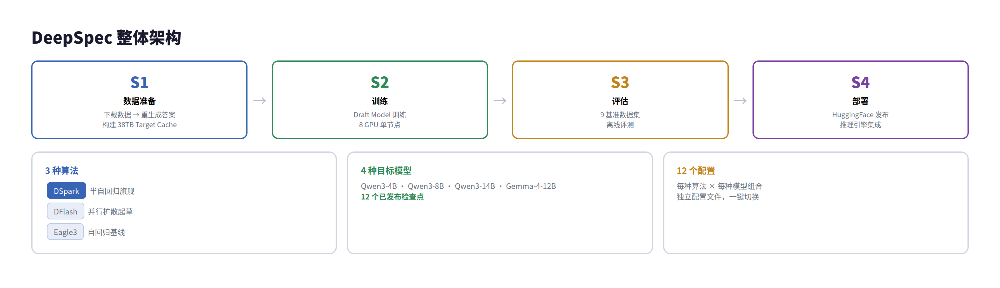
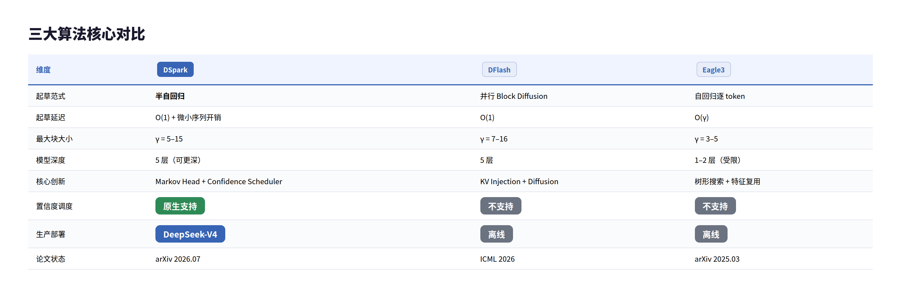
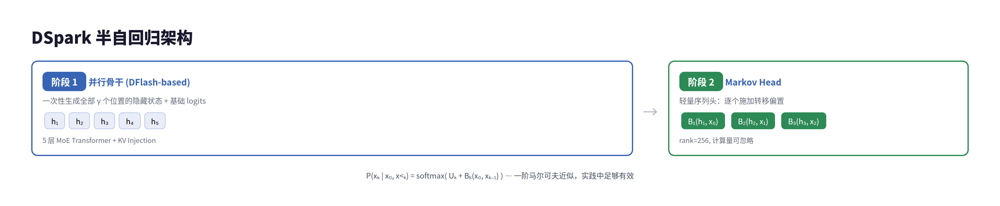
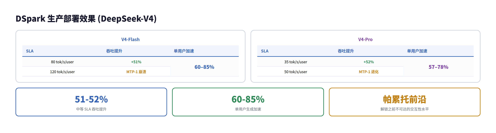
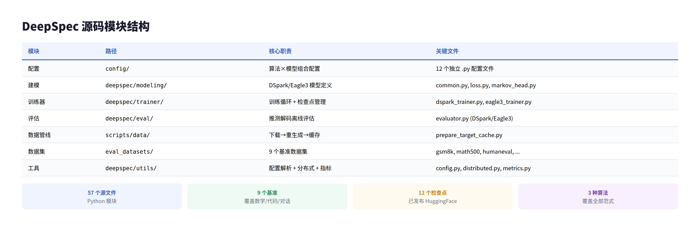
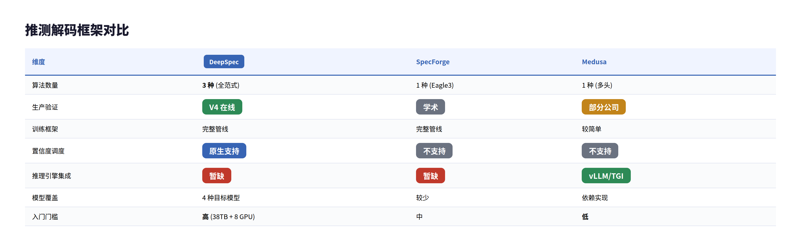

# DeepSpec 深度解析：DeepSeek 的推测解码开源利器

> 一句话总结：DeepSpec 是 DeepSeek 开源的全栈推测解码（Speculative Decoding）训练与评测框架，其旗舰算法 DSpark 已在 DeepSeek-V4 生产环境中实现 60%–85% 的生成加速，并将 speculative decoding 从学术实验推向了大规模在线服务。

---

## 目录

1. [概述](#1-概述)
2. [推测解码背景](#2-推测解码背景)
3. [三大算法详解](#3-三大算法详解)
4. [DSpark 深度剖析](#4-dspark-深度剖析)
5. [生产部署与效果](#5-生产部署与效果)
6. [开源生态与源码结构](#6-开源生态与源码结构)
7. [批判性分析](#7-批判性分析)
8. [总结与启示](#8-总结与启示)

---

## 1. 概述

DeepSpec 是 DeepSeek 联合**北京大学**于 2026 年 7 月开源的全栈推测解码代码库（GitHub：`deepseek-ai/DeepSpec`，⭐6,474，MIT License）。值得注意的是，DeepSeek 创始人**梁文锋**位列 DSpark 论文的 32 位作者之中——这在完成 500 亿元融资后亲自参与技术论文撰写，信号明确：推理效率已上升为 DeepSeek 的核心战略方向。DeepSpec 的核心目标是：**为社区提供一套标准化、可复现的推测解码 Draft Model 训练与评估工具链**。

推测解码（Speculative Decoding）是一种无损加速 LLM 推理的技术——用轻量级 Draft Model 快速生成候选 token，再用大模型并行验证，理论上可以在不改变输出分布的前提下实现 2-6 倍加速。但实际落地中，如何训练高质量的 Draft Model、如何在系统负载下做自适应调度，一直是工程难题。DeepSpec 正是为解决这些问题而生。

| 维度 | 详情 |
|------|------|
| 开源时间 | 2026 年 7 月 7 日（论文发布同日） |
| 仓库地址 | `github.com/deepseek-ai/DeepSpec` |
| 许可证 | MIT |
| 核心语言 | Python |
| 支持的算法 | DSpark、DFlash、Eagle3 |
| 支持的目标模型 | Qwen3-4B/8B/14B、Gemma-4-12B |
| 数据管线 | 下载 → 重生成 → Target Cache（~38TB for 4B） |
| 训练范式 | 单节点 8 GPU，zero-shard 策略 |
| 评估基准 | GSM8K, MATH500, AIME25, HumanEval, MBPP, LiveCodeBench, MT-Bench, Alpaca, Arena-Hard |



---

## 2. 推测解码背景

### 核心原理

LLM 生成 token 是串行的——每个新 token 需要一次完整的前向传播。推测解码的核心思路是 **"快模型猜 + 大模型验"**：

| 阶段 | 执行者 | 耗时特征 | 说明 |
|------|--------|---------|------|
| Draft（起草） | 轻量 Draft Model | 极快（单次前向或浅层自回归） | 生成 γ 个候选 token |
| Verify（验证） | 完整 Target Model | 较慢（但只做一次并行前向） | 并行验证全部候选 token |
| Accept（接受） | 拒绝采样算法 | 瞬时 | 接受最长匹配前缀 + 1 个 bonus token |

加速的根本逻辑是：验证阶段一次性处理 γ 个 token 的 KV cache，而传统自回归需要 γ 次前向。只要 Draft Model 的接受率足够高，整体延迟就大幅降低。


### Draft Model 的设计权衡

Draft Model 的设计存在一个经典的三元权衡：

| 维度 | 自回归 Drafter（如 Eagle3） | 并行 Drafter（如 DFlash） |
|------|--------------------------|--------------------------|
| 起草速度 | O(γ) 次前向，慢 | O(1) 次前向，极快 |
| 接受率 | 高（建模了 token 间依赖） | 低（独立预测导致 suffix decay） |
| 模型深度 | 受限（浅层，否则更慢） | 可以更深（固定前向成本） |
| 典型块大小 | 3-5 个 token | 7-16 个 token |

这就是 DeepSpec 试图解决的矛盾：**如何在保持并行起草速度优势的同时，提升接受率？**

---

## 3. 三大算法详解

DeepSpec 目前支持三种推测解码算法，覆盖了自回归、并行、半自回归三种范式：



### 3.1 Eagle3：自回归基线

Eagle3 使用目标模型的中间层隐藏状态作为特征，通过一个浅层自回归网络逐个生成候选 token。它的优势是每一轮可以生成多棵候选树（tree attention），通过多条路径增加命中概率。缺点是起草延迟随块大小线性增长，限制了块大小。

| 特性 | 说明 |
|------|------|
| 起草方式 | 逐 token 自回归 |
| 特征来源 | 目标模型中间层 KV 注入 |
| 树形搜索 | 支持（多候选路径并行验证） |
| 论文 | arxiv.org/abs/2503.01840 |
| 基础框架 | SpecForge（Apache-2.0） |

### 3.2 DFlash：并行起草 + 扩散建模

DFlash 是 ICML 2026 接收论文。它使用轻量级 Block Diffusion 模型替代自回归起草，一次性生成全部候选 token。核心创新是 KV 注入——从目标模型的多个中间层提取隐藏状态，拼接后注入 Draft Model 的每一层。

| 特性 | 说明 |
|------|------|
| 起草方式 | 单次前向并行生成 |
| 核心技术 | Block Diffusion + KV Injection |
| 速度优势 | 起草延迟几乎不随块大小增长 |
| 局限 | 接受率随位置快速衰减（suffix decay） |
| 论文 | arxiv.org/abs/2602.06036 |

### 3.3 DSpark：DeepSpec 的旗舰

DSpark 是 DeepSpec 的核心亮点，也是 DeepSeek 重点推出的算法。它设计了两个互补机制：

1. **半自回归架构**：保持并行骨干做主力计算，仅附加轻量级序列头（Markov Head）来建模 token 间依赖。既保持了 O(1) 起草速度，又大幅缓解了 suffix decay。

2. **置信度调度验证**：训练一个 Confidence Head 预测每个位置的接受概率，再由硬件感知调度器动态调整验证长度——高负载时只验证高置信度前缀，低负载时全量验证。

| 特性 | 说明 |
|------|------|
| 起草方式 | 并行骨干 + 序列头（半自回归） |
| 核心创新 | Markov Head / Confidence Head / Hardware-Aware Scheduler |
| 生产验证 | 已部署于 DeepSeek-V4（Flash + Pro） |
| 加速效果 | 60–85% per-user speedup vs MTP-1 |
| 论文 | arxiv.org/abs/2607.05147 |

---

## 4. DSpark 深度剖析

### 4.1 半自回归生成

DSpark 的架构分成两个阶段：

- **并行阶段**：基于 DFlash 的并行骨干，一次性计算全部 γ 个位置的隐藏状态 h₁,…,hᵧ 和基础 logits U₁,…,Uᵧ。
- **序列阶段**：轻量级 Markov Head 按位置依次施加转移偏置 B_k(x₀, x_{<k}, x_k)，将并行 logits 修正为条件分布。Markov Head 只需要一个低秩矩阵（rank=256），计算量极小。

最终每个位置的输出分布：

P(x_k | x₀, x_{<k}) = softmax( U_k + B_k(x₀, x_{<k}, ·) )

其中 B_k 是一个低秩双线性形式：B_k = h_kᵀ · W · e(x_{k-1})，仅依赖前一个 token 的嵌入。这种 "一阶马尔可夫" 近似在实践中效果出奇地好。



### 4.1.1 数学形式化与训练目标

论文将推测解码的加速问题形式化为一个清晰的优化框架。平均每个 token 的生成延迟为：

```
L = (T_draft + T_verify) / τ
```

其中 τ 是每轮平均接受的 token 数。**三个优化杠杆**：降低 T_draft（起草更快）、提高 τ（起草更好）、降低有效 T_verify（验证更聪明）。DSpark 同时动了后两个杠杆——半自回归提升 τ，置信度调度降低 T_verify。

**训练目标**由三项损失加权组合（α_ce=0.1, α_tv=0.9, α_conf=1.0）：

1. **交叉熵损失 L_ce**：训练 Drafter 预测正确 token
2. **分布匹配损失 L_tv**：最小化 Drafter 与 Target 分布之间的总变差距离。这是关键——因为每步接受概率等于 1 − ½∥p_d − p_t∥₁，直接最小化 L_tv 就等于最大化期望接受率
3. **置信度损失 L_conf**：二元交叉熵，训练 Confidence Head 预测软接受标签 c*_k = 1 − ½∥p_d_k − p_t_k∥₁

三项损失均采用**位置加权** w_k = exp(−(k−1)/γ)，优先处理块前部位置（对最终接受长度贡献更大）。Target Model 全程冻结，仅更新 Drafter 主干、序列头和置信度头。

### 4.2 置信度调度验证

DSpark 的另一半创新在系统层。固定长度验证在低负载时浪费少量算力还可以接受，但在高并发场景下，验证即将被拒绝的尾部 token 会挤占宝贵的 batch 容量。

DSpark 的解决方案：

1. **Confidence Head**：在 Draft Model 上附加一个轻量预测头 c_k = σ(wᵀ[h_k; W₁[x_{k-1}])，其中 h_k 是并行主干隐藏状态，W₁[x_{k-1}] 是前一个 token 的 Markov 嵌入。它输出的是**条件接受概率**——当前 token 及之前所有 token 都被接受时，当前 token 也被接受的概率。这个设计很聪明：不是独立预测每个 token 的质量，而是建模了前缀依赖。

2. **校准**：原始 Confidence Head 存在过自信问题（ECE 3-8%）。论文使用 Sequential Temperature Scaling（STS）做校准——因为每个 c_i 是条件概率，联合存活概率按链式法则分解为累积乘积 ∏_{i≤k} c_i。STS 从左到右逐位置校准这个累积乘积，每一步做简单的 1D grid search 找最优温度标量，保持已校准的前缀不变。这与标准温度缩放不同：它顺序地进行而非全局一步完成。最终将 ECE 降到 ~1%，同时保持置信度排序不变（温度缩放是保序变换）。

3. **硬件感知调度器**（Algorithm 1）：不是简单的阈值截断，而是形式化为**全局吞吐量最大化问题**。设当前 batch 有 R 个活跃请求，对每个请求 r 有置信度序列 c_{r,1}…c_{r,γ}，前缀存活概率 a_{r,j} = ∏_{i≤j} c_{r,i}。目标验证 batch size B = Σ_r (1 + ℓ_r)，期望接受 token 数 τ = Σ_r (1 + Σ_{j=1}^{ℓ_r} a_{r,j})，目标函数 Θ = τ · SPS(B)，其中 SPS(B) 是 GPU 的吞吐曲线（steps per second，启动时 profile 一次存储为轻量查询表）。

算法核心是贪心准入：将所有候选 token 按 a_{r,j} 全局降序排列，然后沿这个顺序逐一准入并更新 Θ。由于 a_{r,j} 单调非递增，贪心能得到最优解。调度器采用 early-stopping：一旦 Θ 不再增加立即停止——这不仅避免无效计算，还保证了推测解码的**非预期性**（non-anticipating property），确保严格无损。


### 4.3 关键实验发现

DSpark 论文中有几个反直觉的发现值得关注：

| 发现 | 详细 |
|------|------|
| 并行 Drafter 可以超越自回归 | 因为并行架构不受 O(γ) 延迟限制，可以用更深的网络（5+ 层 vs 1-2 层），在位置 1 的准确率显著高于自回归（0.88 vs 0.81 on Math），这个"先发优势"足以弥补后续的 suffix decay |
| 少量自回归效果显著 | 2 层 DSpark 就超过了 5 层纯并行 DFlash，说明一阶马尔可夫依赖已经捕获了大部分价值 |
| 序列头延迟可忽略 | 在 batch size 128 下，序列头的额外开销仅 0.2-1.3%，远小于接受率提升带来的收益 |
| 数学/代码 vs 对话差异巨大 | 数学题平均接受长度 5.63，对话仅 3.49。数据本身的可预测性决定了推测解码的天花板 |

### 4.3.1 位置级条件接受率：为什么并行能赢？

以上"并行超越自回归"的结论违反直觉——通常认为逐 token 自回归质量更高。论文通过**位置级条件接受率**（position-wise conditional acceptance）分析揭示了原因：

> 条件接受率：仅统计前缀已被全部接受的前提下，位置 k 的 token 也被接受的比率。这剥离了前缀错误的惩罚，只暴露每个位置的原始预测质量。

- **位置 1 的容量优势**：DFlash 在 Math 上起始于 0.88，Eagle3 仅 0.81（Chat 上差距更悬殊：0.72 vs 0.53）。原因很简单——并行 Drafter 可以用 5 层 Transformer，自回归只能 1-2 层（否则 O(γ) 延迟不可接受）。因为推测解码是严格的**前缀匹配存活过程**，第一个 token 被拒就意味着整块报废，所以位置 1 的优势具有最高的杠杆效应。
- **后缀衰减的真相**：位置 2-7，Eagle3 的条件接受率反而**上升**（Chat 上从 0.53→0.74），因为它锁定了语义路径后更确定。DFlash 则从 0.87 降到 0.78（Code），因为并行位置的独立预测导致"multi-modal collision"（如 "of course" + "no problem" → "of problem"）。
- **DSpark 缝合了两者的优点**：继承了并行的首 token 高容量（Math 0.93 起），同时通过 Markov Head 缓解了后缀衰减。

### 4.3.2 块长缩放：长块优势放大

另一个关键实验：固定 5 层 Drafter，变化 proposal length γ（4, 8, 12, 16）。结果：

| γ | Math 增益 (vs DFlash) | Code 增益 | Chat 增益 |
|---|----------------------|-----------|-----------|
| 7 | +16% | +15% | +18% |
| 15 | **+30%** | **+26%** | **+22%** |

**增益随块长增长而放大**——因为纯并行 DFlash 的后缀衰减在长块中更加严重，而 DSpark 的 Markov Head 有效遏制了这种衰减。这也验证了一个重要结论：并行架构的长块速度潜力此前一直被 suffix decay "封印"，半自回归设计将其彻底释放。

RNN Head 在 γ=15 时比 Markov Head 只有微弱额外增益，但实现更复杂，所以论文默认采用 Markov Head。

---

## 5. 生产部署与效果

DSpark 已经在 DeepSeek-V4 的生产环境中部署，替代了此前的 MTP-1（单 token 推测）基线。

### V4 生产版 DSpark 架构

| 配置项 | 值 |
|--------|-----|
| 并行主干 | 3 层 MoE（Dai et al., 2024） |
| 注意力 | mHC（multi-head Compressed Attention） + 128 滑动窗口 |
| 最大块大小 | γ = 5 |
| 序列头 | Markov Head |
| 置信度 | 端到端训练 + STS 后校准 |

**为什么 MTP-1 是基线而不是 MTP-3/5？** 论文给出了一个关键背景：此前在生产中确实尝试过静态多 token Drafter（如 MTP-3/5），但在高并发下验证开销过大，吞吐反而退化。因此 MTP-1 是实际生产中的最优静态配置——DSpark 正是要打破这个限制，通过动态调度安全解锁更大块长的潜力。

### 训练优化

生产规模训练中，DeepSeek 内部框架 HAI-LLM 做了两个关键优化：

| 优化 | 方法 | 收益 |
|------|------|------|
| 隐藏状态通信 | 只传输 LM Head 前的隐藏状态（d 维），目标端本地做投影 | 通信量从 O(V) 降至 O(d)，V≈10⁵ |
| 锚点序列打包 | 从长序列中采样固定数量锚点，用 token 级注意力索引管理 | 解耦 Draft Model 计算与上下文长度 |

### 异步调度器：生产环境的"理论 vs 现实"

Algorithm 1 的贪心调度在数学上优雅，但直接部署面临两个基础设施冲突：

1. **SPS(B) 非平滑**：真实硬件容量曲线是锯齿状的阶梯函数，而非论文假设的平滑单峰曲线。early-stopping break 会在硬件悬崖处陷入局部最优。
2. **与 CUDA Graph / ZOS 冲突**：Zero-Overhead Scheduling 要求当前 step 完成前就知道下一 step 的 batch size。同步调度会阻塞 GPU 流水线。

**解决方案：两步异步近似**。调度器不再基于当前 step 的置信度实时决策，而是使用两步前的历史预测来估算验证容量 K。当前 step 的候选 token 仍按最新的置信度排序，但截断长度由两步前的预测决定。这带来两个好处：

- **完全隐藏调度延迟**：ZOS 无缝集成
- **解除 early-stopping**：可以运行无约束的全局搜索（因为历史预测已形成因果屏障，不违反非预期性约束）

此外，为支持可变长度验证前缀，DeepSeek-V4 在稀疏注意力实现中引入了**标记张量**（marker tensor）来传递序列内依赖关系，只修改了 index-attention 和 compress 两个 kernel——其余推理栈保持不变。

### 实时流量效果

在 V4-Flash 引擎上：

| SLA 等级 | DSpark vs MTP-1 |
|----------|-----------------|
| 80 tok/s/user | 吞吐提升 51% |
| 120 tok/s/user | DSpark 仍能维持可用容量，MTP-1 接近崩溃 |
| 同等吞吐 | 单用户加速 60–85% |

在 V4-Pro 引擎上：

| SLA 等级 | DSpark vs MTP-1 |
|----------|-----------------|
| 35 tok/s/user | 吞吐提升 52% |
| 50 tok/s/user | DSpark 维持吞吐，MTP-1 退化严重 |
| 同等吞吐 | 单用户加速 57–78% |

关键结论：**DSpark 不仅仅是在现有工作点上跑得更快，而是扩展了服务系统的帕累托前沿**——它使 DeepSeek 能够在更严格的交互性 SLA 下维持可用的吞吐量。



---

## 6. 开源生态与源码结构

### 仓库结构

DeepSpec 的目录结构清晰，按功能分为四大模块：

| 模块 | 路径 | 职责 |
|------|------|------|
| 配置 | `config/` | 每种算法 × 每种目标模型的独立配置（12 个配置文件） |
| 建模 | `deepspec/modeling/` | DSpark/Eagle3 的模型定义、损失函数、Markov Head、Confidence Head |
| 训练器 | `deepspec/trainer/` | 训练循环、检查点管理、分布式策略 |
| 评估 | `deepspec/eval/` + `eval_datasets/` | 9 个基准数据集 + 评估脚本 |
| 数据管线 | `scripts/data/` | 下载、重生成答案、构建 Target Cache |
| 工具 | `deepspec/utils/` | 配置解析、分布式工具、指标计算、采样 |

### 已发布检查点

所有检查点均托管在 HuggingFace `deepseek-ai` 组织下，完整覆盖：

| 算法 | Qwen3-4B | Qwen3-8B | Qwen3-14B | Gemma-4-12B |
|------|----------|----------|-----------|-------------|
| Eagle3 | ✅ | ✅ | ✅ | ✅ |
| DFlash | ✅ | ✅ | ✅ | ✅ |
| DSpark | ✅ | ✅ | ✅ | ✅ |



### 数据管线

DeepSpec 提供了完整的数据准备管线，但有一个重要的**存储警告**——Qwen3-4B 的默认 Target Cache 约 38TB。这意味着对大多数个人开发者而言，最简单的入门方式不是从头训练，而是直接使用已发布的检查点，或者基于小规模数据进行微调。

---

## 7. 批判性分析



### 7.1 DSpark 的真正贡献是什么？

表面上 DSpark 是一个"半自回归 + 置信度调度"的新算法，但仔细读论文后我认为它的真正贡献在于**工程系统化**而非单纯算法创新。

Markov Head 本质上是给并行 Drafter 加了一阶转移概率修正——这不算全新 idea（NAT 领域早有类似尝试）。Confidence Head 加动态调度在推荐系统和数据库查询优化中也是成熟模式。DSpark 的价值在于：

1. **把这些已知技巧系统性地整合到一起**，并证明在 300B+ 参数模型的生产流量中确实能工作；
2. **解决了工程上的"最后一公里"问题**——异步调度器如何兼容 CUDA Graph、ZOS、可变长度验证等基础设施约束；
3. **提供了可复现的开源训练框架**，让社区可以在自己的模型上尝试这些技术。

### 7.2 "少量自回归就够了"的局限性

DSpark 论文中一个有趣的结论是 2 层 DSpark 就超过 5 层纯并行 DFlash。但这有一个隐含前提：**Draft Model 和目标 Model 是同家族的**（都在 Qwen3 架构上训练）。

如果目标模型改成了完全不同架构的模型（如 Gemma、Llama），"一阶马尔可夫近似"是否仍然有效？我的判断是：对英文模型可能还行，但对中文或代码这类对长程依赖要求更高的场景，可能需要更复杂的序列头（如论文中提到的 RNN Head）。

### 7.3 生态门槛

DeepSpec 的设计目标很明确——让社区能够在任何目标模型上训练自己的 Draft Model。但实际操作中有几个陡峭的门槛：

| 门槛 | 影响 |
|------|------|
| 38TB Target Cache | 普通开发者不可能从头训练，只能微调或使用预训练检查点 |
| 8 GPU 假设 | 虽然可以调整，但默认配置均针对单节点 8 卡，4 卡以下可能需要大量调参 |
| SGLang 依赖 | 数据准备需要部署一个推理引擎来重生成答案 |
| 推测解码推理引擎 | DeepSpec 只提供训练和离线评估，不包含推理引擎集成代码 |

这意味着 DeepSpec 目前更适合**有 GPU 集群的机构用户**或**已有推理引擎集成能力的团队**，而非个人开发者。

### 7.4 对比同类项目

| 维度 | DeepSpec | SpecForge | Medusa |
|------|----------|-----------|--------|
| 算法范围 | 3 种（自回归 + 并行 + 半自回归） | 1 种（Eagle3 为主） | 1 种（多头预测） |
| 生产验证 | ✅ DeepSeek-V4 在线 | ❌ 学术为主 | ✅ 部分公司使用 |
| 训练框架 | 完整管线 | 完整管线 | 较简单 |
| 模型支持 | 4 种目标模型 | 较少 | 依赖实现 |
| 置信度调度 | ✅ 核心特性 | ❌ | ❌ |
| 推理引擎集成 | ❌（仅训练） | ❌ | ✅（vLLM, TGI） |

DeepSpec 在算法多样性和生产验证上有明显优势，但在推理引擎集成上还不及 Medusa 等早期项目。这可能是 DeepSeek 下一步开源的补齐方向。

### 7.5 论文自述局限

论文 Section 5 末尾列出了 DSpark 的一个核心局限：**前缀调度器虽然最小化了验证端的浪费，但 Drafter 端仍要为每个请求生成完整的 γ-token 块**。对可预测性极低的复杂查询（如开放式闲聊中接受率很低的长尾 case），这份草稿算力无法回收——"花了大价钱写草稿，最后只用了一小段"。论文提出的未来方向是**难度感知的早退出机制**（difficulty-aware early exiting），让 Drafter 自身判断"这题我不行"，跳过完整块生成。

### 7.6 我的看法

DeepSpec 是推测解码领域**目前最"工业化"的开源方案**。它不像早期工作那样只发论文和 checkpoint，而是把完整的训练流程、3 种算法实现、9 个评估基准都打包在一个仓库里。论文中近 30 位作者、生产流量验证、异步调度器的工程设计，都表明这不是实验室 toy project。

不过，如果你是一个个人开发者想在本地 GPU 上加速自己的模型，DeepSpec 可能有点"重量级"。你更需要的是一个简单的推理引擎插件。但如果你是一个推理引擎维护者或 LLM 服务提供商——DeepSpec 是你应该认真研究的基础设施。

---

## 8. 总结与启示


| 要点 | 启示 |
|------|------|
| 推测解码已进入工业时代 | DSpark 在 300B+ 模型上的生产部署证明：推测解码不是学术玩具，而是可落地的加速手段 |
| "并行 + 一点自回归"是最佳实践 | 纯并行有 suffix decay，纯自回归太慢，半自回归平衡了两者 |
| 系统调度比算法更关键 | Confidence Head + 硬件感知调度带来的收益不亚于架构改进 |
| 开源 ≠ 开箱即用 | 38TB 数据和 8 GPU 的门槛意味着 DeepSpec 更多是一个"参考实现"而非"一键加速"工具 |
| 生态还需补全 | 推理引擎端（vLLM/SGLang 插件）的集成是下一步社区工作的关键 |

DeepSpec 给我们的最大启示是：**AI 基础设施的竞争已经从"谁的模型更大"转向"谁能用更少的算力跑得更快"**。推测解码、量化、KV cache 压缩、MoE——这些"效率工程"正在成为新的技术高地。

---

*分析基于 DeepSpec 官方仓库 README、DSpark 论文（arXiv:2607.05147）、DFlash 论文（arXiv:2602.06036）以及源码结构。所有算法效果数据均来自 DSpark 论文 Table 1 及 Figure 7-8。*
