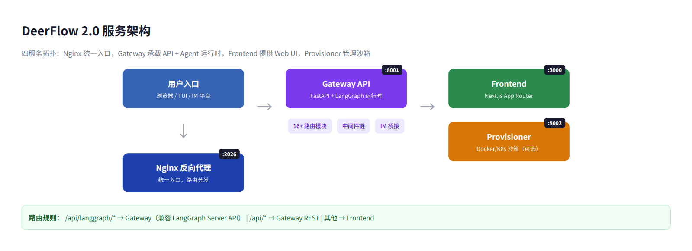
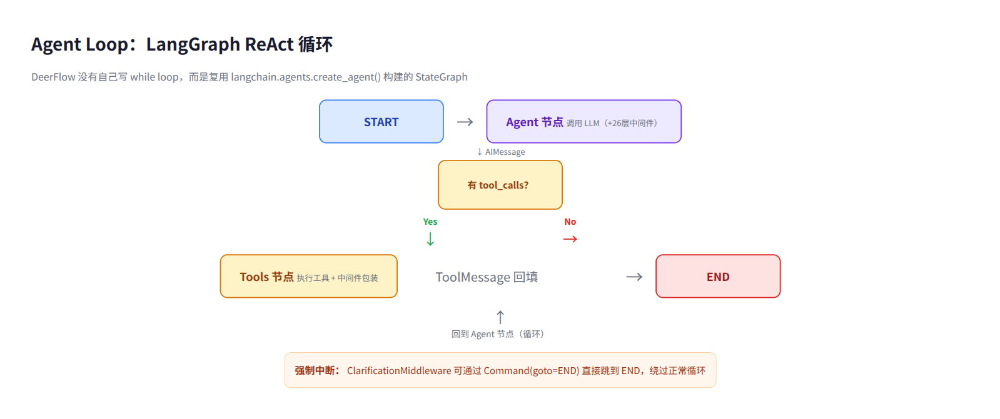
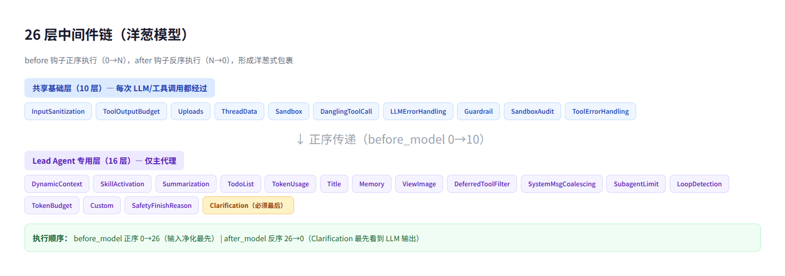
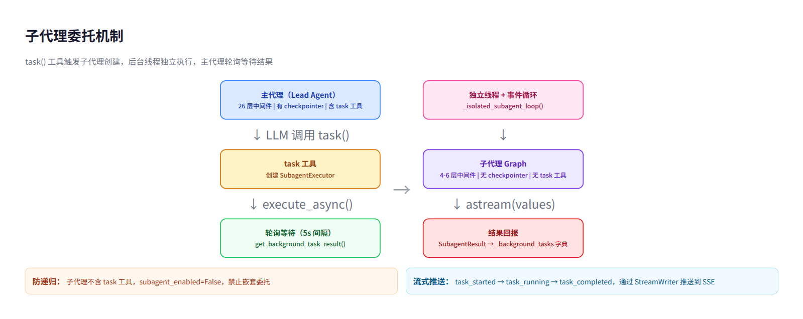
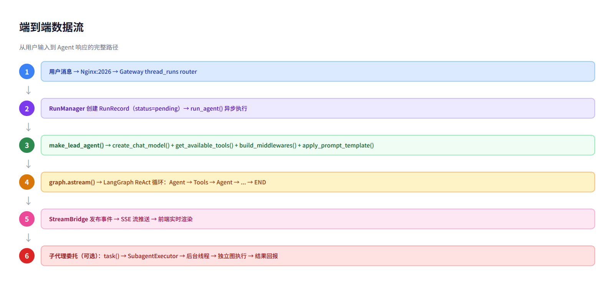
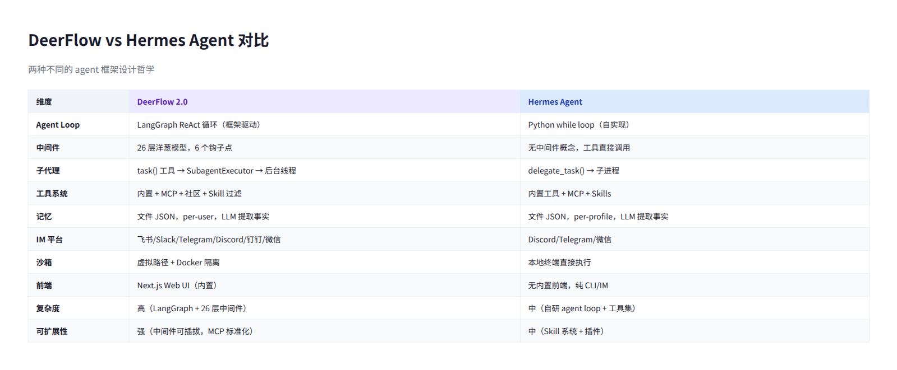

# DeerFlow 2.0 深度技术分析：Agent Loop 与 Agentic 工作流

> **核心发现：** DeerFlow 的 agent loop 完全复用 LangGraph 内置 ReAct 循环，自己不写 while loop；其真正贡献在 loop 之外——26 层中间件链控制循环中每一步的行为，task() 工具实现子代理嵌套委托。

---

## 目录

1. [概述](#1-概述)
2. [服务架构](#2-服务架构)
3. [Agent Loop：LangGraph ReAct 循环](#3-agent-looplanggraph-react-循环)
4. [26 层中间件链：洋葱模型](#4-26-层中间件链洋葱模型)
5. [工具系统与调用流程](#5-工具系统与调用流程)
6. [子代理委托机制](#6-子代理委托机制)
7. [流式处理与数据流](#7-流式处理与数据流)
8. [与 Hermes Agent 的对比](#8-与-hermes-agent-的对比)
9. [批判性分析](#9-批判性分析)
10. [总结与启示](#10-总结与启示)

---

## 1. 概述

DeerFlow（**D**eep **E**xploration and **E**fficient **R**esearch **Flow**）是字节跳动开源的 LangGraph-based AI 超级代理系统。v2.0 是完全重写，与 v1 无代码关系。2026 年 2 月登顶 GitHub Trending #1，目前 74.7k star。

其核心价值主张：将子代理编排、持久记忆、沙箱执行、可扩展 Skill 系统统一在一个 "super agent harness" 中，支持多入口（Web UI、TUI、IM 平台）访问同一代理能力。

| 属性 | 值 |
|------|-----|
| 仓库 | github.com/bytedance/deer-flow |
| 语言 | Python（后端）+ TypeScript（前端） |
| 框架 | LangGraph + FastAPI + Next.js |
| Star | 74.7k |
| 本周新增 | +3,242 |
| 许可证 | MIT |

---

## 2. 服务架构

DeerFlow 采用四服务拓扑，`make dev` 一条命令启动全部：

| 服务 | 端口 | 技术栈 | 职责 |
|------|------|--------|------|
| **Nginx** | 2026 | Nginx | 统一反向代理入口，路由分发 |
| **Gateway API** | 8001 | FastAPI + LangGraph | REST API + 内嵌 Agent 运行时 |
| **Frontend** | 3000 | Next.js App Router | Web 聊天界面 |
| **Provisioner** | 8002 | Python | Docker/K8s 沙箱管理（可选） |

**路由规则**：Nginx 是唯一公共入口。`/api/langgraph/*` 重写到 Gateway 的 `/api/*`（兼容 LangGraph Server API 协议），其他 `/api/*` 直达 Gateway REST 路由，非 API 路径指向 Frontend。

Gateway 是核心——它既是 REST API 服务器，又内嵌了 LangGraph 代理运行时。16+ 路由模块覆盖 models、mcp、skills、memory、uploads、threads、thread_runs、artifacts、feedback、suggestions、agents、channels、auth 等。

---

## 3. Agent Loop：LangGraph ReAct 循环

### 3.1 核心结论

**DeerFlow 没有自己写 agent loop。** 它复用 `langchain.agents.create_agent()` 构建的 StateGraph，内部实现标准 ReAct 循环。

### 3.2 调用链

Agent 创建的完整路径：`make_lead_agent(config)` → `_make_lead_agent()` → 依次调用 `create_chat_model()`（创建 LLM）、`get_available_tools()`（加载三类工具）、`build_middlewares()`（组装 26 层中间件）、`apply_prompt_template()`（生成系统提示词）→ 最终调用 `create_agent(model, tools, middleware, prompt, state_schema)` 构建 LangGraph StateGraph。

这个 StateGraph 的结构是标准的 ReAct 模式：`START` → `agent_node`（调用 LLM）→ 条件边检查 `tool_calls` → 有则路由到 `tool_node`（执行工具）→ 回到 `agent_node`（循环）→ 无则路由到 `END`（结束）。

### 3.3 终止条件

条件边 `should_continue` 的判断逻辑：检查 `state["messages"][-1]` 是否为 `AIMessage` 且 `tool_calls` 非空。非空继续循环，为空结束。

中间件可以**强制中断循环**。`ClarificationMiddleware` 在拦截到 `ask_clarification` 工具调用时，返回 `Command(goto=END)` 直接跳到 END 节点，绕过正常循环。子代理通过 `recursion_limit` 控制最大循环轮数（默认 150 轮）。

### 3.4 状态模式（ThreadState）

`ThreadState` 继承自 `langchain.agents.AgentState`，扩展了 `sandbox`（沙箱状态）、`thread_data`、`artifacts`（去重合并）、`todos`（保留最后非 None 值）、`viewed_images`、`promoted`（延迟工具提升）等字段。每个扩展字段都有自定义 reducer，控制状态合并语义。

---

## 4. 26 层中间件链：洋葱模型

这是 DeerFlow 最精妙的设计。中间件链有 6 个钩子点，形成洋葱式包裹：

| 钩子 | 执行时机 | 执行顺序 | 次数 |
|------|---------|---------|------|
| `before_agent` | graph 首次调用 | 正序 0→N | 仅一次 |
| `before_model` | 每次 LLM 调用前 | 正序 0→N | 每轮循环 |
| `wrap_model_call` | 包装 LLM 调用 | 正序 0→N | 每轮循环 |
| `after_model` | 每次 LLM 调用后 | **反序** N→0 | 每轮循环 |
| `wrap_tool_call` | 包装工具调用 | 反序 N→0 | 每个工具 |
| `after_agent` | graph 结束时 | 反序 N→0 | 仅一次 |

**关键设计**：`after_model` 反序执行意味着列表最后的 middleware 最先看到 LLM 输出。`ClarificationMiddleware` 排在末尾，所以它第一个拦截 tool_calls，可以决定是否中断循环。

26 层分为两组：

- **共享基础层（10 层）**：InputSanitization → ToolOutputBudget → Uploads → ThreadData → Sandbox → DanglingToolCall → LLMErrorHandling → Guardrail → SandboxAudit → ToolErrorHandling
- **Lead Agent 专用层（16 层）**：DynamicContext → SkillActivation → Summarization → TodoList → TokenUsage → Title → Memory → ViewImage → DeferredToolFilter → SystemMessageCoalescing → SubagentLimit → LoopDetection → TokenBudget → Custom → SafetyFinishReason → Clarification

子代理只使用基础层（4-6 个），不含 Clarification、Memory、Skill 等高级中间件。

---

## 5. 工具系统与调用流程

### 5.1 工具来源

工具通过 `get_available_tools()` 从三个来源组装：

| 来源 | 示例 | 加载方式 |
|------|------|---------|
| **内置工具** | present_files、ask_clarification、task、view_image | 直接导入 |
| **MCP 工具** | 用户配置的 MCP 服务器 | 从 extensions_config.json 懒加载，mtime 缓存失效 |
| **社区工具** | tavily 搜索、jina_ai、firecrawl、image_search | 反射加载（`resolve_variable(cfg.use)`） |

Skill 系统通过 `filter_tools_by_skill_allowed_tools()` 按白名单过滤可用工具。

### 5.2 调用流程

LLM 返回 `AIMessage(tool_calls=[...])` 后，LangGraph 的 `tool_node` 提取每个 `tool_call`，按 `name` 找到对应 `BaseTool`，通过 `wrap_tool_call` 中间件链（反序 N→0）包装执行。`ToolErrorHandlingMiddleware` 捕获工具异常，将其转换为错误格式的 `ToolMessage` 回填到 `state["messages"]`。Agent 节点再次被调用，LLM 看到工具结果后决定下一步。

---

## 6. 子代理委托机制

当 LLM 调用 `task()` 工具时，触发子代理创建流程：

1. `task_tool()` 获取子代理配置，调用 `get_available_tools(subagent_enabled=False)`（子代理不能再委托）
2. 创建 `SubagentExecutor`，在后台线程的独立事件循环中调用 `execute_async()`
3. 子代理通过 `create_agent()` 构建独立的 LangGraph StateGraph
4. 主代理的 `task_tool` 每 5 秒轮询一次结果状态
5. 子代理完成后，通过 `get_stream_writer()` 推送 SSE 事件：`task_started` → `task_running` → `task_completed`

**主代理 vs 子代理的关键区别：**

| 维度 | 主代理 | 子代理 |
|------|--------|--------|
| checkpointer | 有（持久化） | `False`（一次性） |
| 中间件 | 26 层（完整链） | 4-6 层（精简链） |
| task 工具 | 有 | **没有**（防递归嵌套） |
| system prompt | 模板生成 | 配置直接注入 |

内置两种子代理类型：`general-purpose`（全部工具除 task，150 轮上限）和 `bash`（命令专家）。

---

## 7. 流式处理与数据流

DeerFlow 使用三种 LangGraph stream mode 并行：

| Mode | 发射时机 | 用途 |
|------|---------|------|
| `values` | 每个节点完成后 | 完整 state 快照 |
| `messages` | LLM 每 yield 一个 token | 流式文字输出 |
| `custom` | `StreamWriter.write()` 调用 | 子代理状态等自定义事件 |

流式链路：`agent.astream()` → `serialize()` 将 LangChain 对象转 JSON → `StreamBridge.publish()` 入队 → SSE consumer 订阅 → 格式化为 SSE wire frame 推送到前端。

子代理使用 `stream_mode="values"`，每次迭代获得完整 state 快照，从中提取 `AIMessage` 用于实时更新。子代理的进度通过 `StreamWriter` 推送到父代理的 SSE 流。

---

## 8. 与 Hermes Agent 的对比

两个框架代表了不同的 agent 设计哲学：

| 维度 | DeerFlow 2.0 | Hermes Agent |
|------|-------------|-------------|
| Agent Loop | LangGraph ReAct（框架驱动） | Python while loop（自实现） |
| 中间件 | 26 层洋葱模型，6 个钩子点 | 无中间件概念 |
| 子代理 | task() → SubagentExecutor → 后台线程 | delegate_task() → 子进程 |
| 工具系统 | 内置 + MCP + 社区 + Skill 过滤 | 内置工具 + MCP + Skills |
| 记忆 | 文件 JSON，per-user，LLM 提取事实 | 文件 JSON，per-profile，LLM 提取事实 |
| IM 平台 | 飞书/Slack/Telegram/Discord/钉钉/微信 | Discord/Telegram/微信 |
| 沙箱 | 虚拟路径 + Docker 隔离 | 本地终端直接执行 |
| 前端 | Next.js Web UI（内置） | 无内置前端 |
| 复杂度 | 高 | 中 |

---

## 9. 批判性分析

### 9.1 DeerFlow 做对了什么

**Harness/App 分层是最大的工程亮点。** `deerflow-harness` 作为可发布的框架包，与应用层 `app/` 严格隔离。CI 通过 `test_harness_boundary.py` 强制执行依赖方向——app 可以 import harness，反过来不行。这种纪律在开源项目中非常罕见。

**中间件链的洋葱模型设计精巧。** 6 个钩子点、正序/反序执行、条件加载——这让每个中间件只关心自己的职责，不需要了解全局。`ClarificationMiddleware` 排在最后却最先拦截 LLM 输出，这个设计很聪明。

**虚拟路径沙箱统一了本地和 Docker 模式。** Agent 看到的路径是固定的（`/mnt/user-data/...`），物理路径根据运行模式不同而变化。这降低了开发和部署的认知负担。

### 9.2 DeerFlow 的问题

**中间件链的顺序依赖是把双刃剑。** 26 层中间件的顺序是硬编码的，新增一个中间件需要理解完整的顺序语义。如果插错位置，可能引发难以调试的 bug。相比之下，Hermes Agent 的工具直接调用模式虽然粗糙，但没有"顺序陷阱"。

**对 LangGraph 的深度绑定限制了灵活性。** DeerFlow 使用 `create_agent()` 封装而非显式 `StateGraph`，这意味着它无法使用 LangGraph 的高级特性（条件边、子图、并行节点）。如果未来需要实现更复杂的 agent 拓扑（如多 agent 协作、DAG 工作流），当前架构会成为瓶颈。

**记忆系统相对简单。** 文件 JSON 存储，无向量检索，事实提取完全依赖 LLM 质量。对比 MemPalace 等专用记忆系统，DeerFlow 的记忆更像是"附带功能"而非核心能力。

**配置系统碎片化。** `config.yaml` + `extensions_config.json` + 环境变量 + 各子配置类，四层配置叠加。虽然支持热重载是个加分项，但学习曲线陡峭，新用户很难快速上手。

### 9.3 我的建议

如果你需要一个**开箱即用、支持多 IM 平台的 agent 系统**，DeerFlow 是目前最好的开源选择。它的 Web UI、IM 桥接、Skill 系统都已成熟，`make dev` 一条命令就能跑起来。

如果你需要**深度定制 agent 行为**（自定义循环逻辑、复杂工具编排），DeerFlow 的 26 层中间件链可能过于沉重。此时自研 agent loop（如 Hermes 的方式）反而更灵活。

对于**小团队或个人项目**，建议直接用 DeerFlow 的 harness 包（`deerflow-harness`），只引入框架层，不用整个 monorepo。这比从零搭建 agent 系统高效得多。

---

## 10. 总结与启示

DeerFlow 2.0 的核心启示：

1. **Agent loop 不需要自己写。** LangGraph 的 ReAct 循环已经足够成熟，DeerFlow 证明了"复用框架 + 中间件增强"是可行的架构模式。
2. **中间件是 agent 系统的"操作系统"。** 输入净化、工具过滤、循环检测、安全中断——这些横切关注点通过中间件链实现，比硬编码在 agent loop 中优雅得多。
3. **子代理的关键是隔离。** 独立线程、独立事件循环、精简中间件、禁止递归——这些隔离措施保证了子代理的稳定性和可控性。
4. **多入口是 agent 系统的标配。** Web UI、CLI、IM 平台共享同一代理运行时，这种"一次开发，多端部署"的模式正在成为行业标准。

---

*分析基于 DeerFlow 2.0 全部核心源码，包括 `backend/packages/harness/deerflow/agent/`（图定义、状态、工具）、`backend/packages/harness/deerflow/middleware/`（26 层中间件）、`backend/packages/harness/deerflow/subagents/`（子代理执行器）、`backend/packages/harness/deerflow/runtime/`（运行时、流式处理）、`backend/app/`（Gateway 路由、IM 桥接）。*

*报告日期：2026-06-26*
