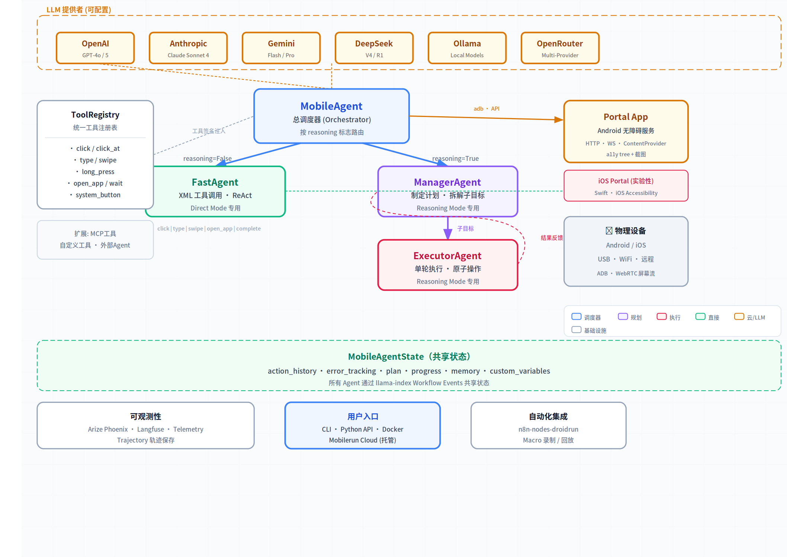

# DroidRun/MobileRun 深度调研报告

> **调研日期**: 2026-06-30  
> **来源**: 源码分析 (droidrun/mobilerun, droidrun/mobilerun-portal) + 官方文档 (docs.mobilerun.ai)  
> **版本**: v0.6.8 (MIT License)

---

## 1. 项目概览

MobileRun（原名 DroidRun）是一个让 LLM Agent 控制 Android/iOS 设备的开源框架。用户只需用自然语言描述目标（如「打开设置并开启暗色模式」），Agent 就能自动完成点击、滑动、输入等操作。

项目在 GitHub 上获得了 **8,668 ⭐**，是目前最热门的移动端 AI Agent 框架。PyPI 上 `droidrun` 包已重命名为 `mobilerun`（旧包作为兼容 shim 保留），但 GitHub 组织名仍为 `droidrun`。核心作者 Niels Schmidt（niels@droidrun.ai），配套有商业云服务 Mobilerun Cloud。

| 维度 | 数据 |
|------|------|
| 主仓库 | droidrun/mobilerun (8,668 ⭐) |
| Android 伴侣应用 | droidrun/mobilerun-portal (331 ⭐) |
| 代码规模 | 127 个 .py 文件，约 23,700 行 |
| 许可证 | MIT |
| Python 版本 | ≥3.11, <3.14 |
| 包管理 | uv (推荐) / pip |
| 同类竞品对比 | AutoGLM-Mobile (84.5%), LX-GUIAgent (80.2%), K²-Agent (79.3%) |



## 2. 架构设计

MobileRun 采用**多 Agent 协作架构**，基于 `llama-index-workflows` 实现。核心设计思路是「不是一个大 Agent 做所有事，而是不同专长的 Agent 各司其职」。

架构分为两种执行模式：
- **Direct Mode** (`reasoning=False`)：FastAgent 直接执行，适合简单任务
- **Reasoning Mode** (`reasoning=True`)：Manager→Executor 两阶段协作，适合复杂多步任务

所有 Agent 共享 `MobileAgentState`（行动历史、错误跟踪、内存、进度），通过 llama-index Workflow 的事件系统传递消息。这种设计的好处是职责清晰、易于调试，但事件传递链路较长时可能有性能损耗。

| Agent | 职责 | 适用模式 | 关键文件 |
|-------|------|---------|---------|
| MobileAgent | 总调度器，按模式路由 | 两种 | `agent/droid/droid_agent.py` (1,105 行) |
| FastAgent | XML 工具调用，ReAct 循环 | Direct | `agent/fast_agent/fast_agent.py` (573 行) |
| ManagerAgent | 制定计划、拆解子目标 | Reasoning | `agent/manager/manager_agent.py` (575 行) |
| ExecutorAgent | 单轮执行具体操作 | Reasoning | `agent/executor/executor_agent.py` (289 行) |

## 3. 核心工具系统

手机操作工具通过 `ToolRegistry` 统一注册，工具描述以 XML schema 注入 LLM prompt。FastAgent 采用 XML 格式的工具调用协议：LLM 输出 `<function_calls>` 块 → Agent 解析 → 执行 → 将 `<function_results>` 反馈给 LLM 作为下轮用户消息。

可用工具清单：

| 工具 | 功能 | 依赖 |
|------|------|------|
| `click(index)` | 点击 UI 元素（按索引） | a11y tree |
| `click_at(x, y)` | 坐标点击 | 截图 |
| `click_area(x1, y1, x2, y2)` | 区域点击 | 截图 |
| `long_press(index)` / `long_press_at(x, y)` | 长按 | - |
| `type(text, index)` | 输入文本 | a11y tree |
| `type_secret(secret_id, index)` | 输入凭据（密钥安全注入） | cred manager |
| `swipe(coordinate, coordinate2)` | 滑动 | - |
| `system_button(button)` | 系统按键 | - |
| `wait(duration)` | 等待 | - |
| `open_app(text)` | 打开应用 | - |
| `remember(information)` | 记忆信息 | - |
| `complete(success, reason)` | 完成任务 | - |

**我的评价**：工具设计务实且完整，涵盖了移动自动化的核心操作。`type_secret` 通过凭据管理器注入密钥而不是把密钥暴露给 LLM，这个安全设计很用心。不过缺少截图对比（前后对比验证）、OCR 识别等高级工具，这些可能需要自定义工具扩展。

## 4. AndroidWorld Benchmark 分析

MobileRun 在 [AndroidWorld](https://github.com/google-research/android_world) 基准测试上取得了 **91.4%** 的成功率（106/116 任务），领先第二名 AutoGLM-Mobile 约 7 个百分点。

核心方法选择：
- 使用 **Accessibility Tree**（~2KB）代替截图（~1MB）作为主要输入 → 500× 负载减少
- 截图仅在 a11y tree 不完整时作为降级方案
- Manager-Executor 架构处理长链路任务

| 指标 | 数值 | 对比 |
|------|------|------|
| 成功率 | 91.4% | 业界最高 |
| 架构 | Manager→Executor | 反馈闭环 |
| 主要输入 | Accessibility Tree | 500× 小于截图 |
| 评估框架 | android_world (Google Research) | 开源可复现 |

**批判性分析**：91.4% 的成绩确实出色，但有几个需要理性看待的点：(1) a11y tree 依赖应用本身的无障碍实现质量——很多国产应用的无障碍支持很差，实际体验可能下降；(2) benchmark 涵盖的是标准 Android 系统应用和常见第三方应用，不包含中国特色的超级 App（微信、支付宝等）；(3) 公开的 benchmark 成绩与自己实际场景的效果之间可能存在显著差距，建议在自己的目标 App 上做 PoC 验证。

## 5. 平台支持与设备连接

### Android
通过 **Portal App**（Android 无障碍服务）实现设备控制。Portal 提供三个本地接口：
- HTTP Socket Server (默认 8080)
- WebSocket Server (默认 8081)
- ContentProvider (ADB 命令)

安装流程：`mobilerun setup` → 自动安装 Portal APK → 启用无障碍服务 → 验证连接 → 就绪。

### iOS
通过 iOS Portal 流程支持，使用 `mobilerun run "..." --ios` 命令。iOS 支持相对较新，功能可能不如 Android 完善（源码中 iOS 相关文件较少）。

### 视觉远程模式
支持通过 `--control-backend visual_remote` 连接远程设备，通过 WebSocket 接收截图并使用坐标工具控制。

| 平台 | 控制方式 | 成熟度 | 备注 |
|------|---------|--------|------|
| Android | Portal App (a11y service) | 成熟 | 主平台，功能完整 |
| iOS | iOS Portal 流程 | 实验性 | 功能逐步完善中 |
| 远程设备 | Visual Remote (WebSocket) | 可用 | 基于截图的远程控制 |

## 6. 扩展能力

MobileRun 提供了丰富的扩展机制，这是它相比竞品的一大优势：

### 6.1 MCP 集成
内置 MCP 客户端，可将外部 MCP 服务器的工具注入 Agent 的工具注册表。配置方式：
```yaml
mcp:
  enabled: true
  servers:
    my_server:
      command: "python"
      args: ["-m", "my_mcp_server"]
```

### 6.2 自定义工具 (Custom Tools)
通过 Python API 注册自定义工具函数，扩展 Agent 的能力边界。

### 6.3 外部 Agent (External Agents)
允许编写完全独立的 Agent 模块，接收原始 ADB 连接，使用自己的 LLM 客户端和提示词。要求零依赖 mobilerun 内部模块，仅通过 `AdbDevice` 接口交互。

### 6.4 Macro 录制与回放
支持录制操作序列并回放，可用于回归测试和重复流程自动化。

### 6.5 结构化输出
支持 Pydantic 模型作为输出模式，Agent 执行任务后自动提取结构化数据（如从 Gmail 中提取发票号码和金额）。

| 扩展方式 | 使用场景 | 复杂度 |
|----------|---------|--------|
| MCP 工具 | 接入外部 API/服务 | 低 |
| 自定义工具 | 团队特定业务逻辑 | 中 |
| 外部 Agent | 替换核心 Agent 逻辑 | 高 |
| Macro | 录制操作序列 | 低 |
| 结构化输出 | 数据提取 | 低 |

## 7. 与 Hermes/OpenClaw 生态的关系

DroidRun 已经通过社区项目与 Hermes/OpenClaw 生态建立了连接：

- **hanxi/droidrun-agent** (8 ⭐)：将 droidrun 封装为 OpenClaw Skill + MCP Server，无需 ROOT 和 ADB 即可让 AI 控制安卓手机
- **rejigtian/droidrun-gui** (6 ⭐)：基于 droidrun 的 Web GUI 可视化工具，支持智谱 AI 模型，可远程控制手机

这意味着 Hermes 用户可以通过安装 OpenClaw skill 来集成 DroidRun 的手机控制能力，而不需要从零搭建。

## 8. 商业生态

MobileRun Cloud 提供托管的设备基础设施：
- **Personal Device**：用户自己的硬件接入云端
- **Cloud Phone (Hosted)**：即时可用的云端托管手机
- **Physical Phone (Hosted)**：真实物理设备（更高设备真实性）
- 提供 Dashboard、REST API、Python/TypeScript SDK
- 按信用点（credits）计费

GitHub 组织下还有其他项目：`n8n-nodes-droidrun`（n8n 自动化集成）、`droidrun-examples`等。

## 9. 批判性总结

### 优势
1. **AndroidWorld SOTA**：91.4% 是目前公开报告的最高成绩
2. **架构清晰**：Manager-Executor 分离 + FastAgent 直接模式，适配不同复杂度场景
3. **扩展性出色**：MCP、自定义工具、外部 Agent、Macro 四种扩展路径
4. **开源 + 商业双轨**：自建用框架，规模化用云服务
5. **社区活跃**：8.6k stars、Product Hunt 热门、Discord 社区

### 潜在问题
1. **a11y tree 依赖**：对无障碍支持差的应用（含大量国产 App）可能效果打折
2. **iOS 支持不成熟**：目前仍处于早期阶段
3. **Python only（框架侧）**：相比 Cloud 的多语言 SDK，框架侧仅 Python
4. **llama-index 耦合**：重度依赖 llama-index 生态，如果 llama-index 出现 Breaking Change 会有连锁影响
5. **Benchmark 迁移风险**：91.4% 是基于标准 Android 应用，转移到中国超级 App 生态的实际效果未知

### 对 Hermes 生态的建议
- **短期**：通过 `hanxi/droidrun-agent` 作为 OpenClaw Skill 快速接入，做 PoC 验证
- **中期**：如果方向验证可行，基于 mobilerun Framework 自建更深度集成的 Hermes 原生能力
- **长期关注**：iOS 支持的成熟度、a11y tree 在中国 App 生态的实际表现

---

> **附录**：完整源码已 clone 至 `~/.hermes/repos/mobilerun/`（主框架）和 `~/.hermes/repos/mobilerun-portal/`（Portal App），可进行更深入的代码级分析。
