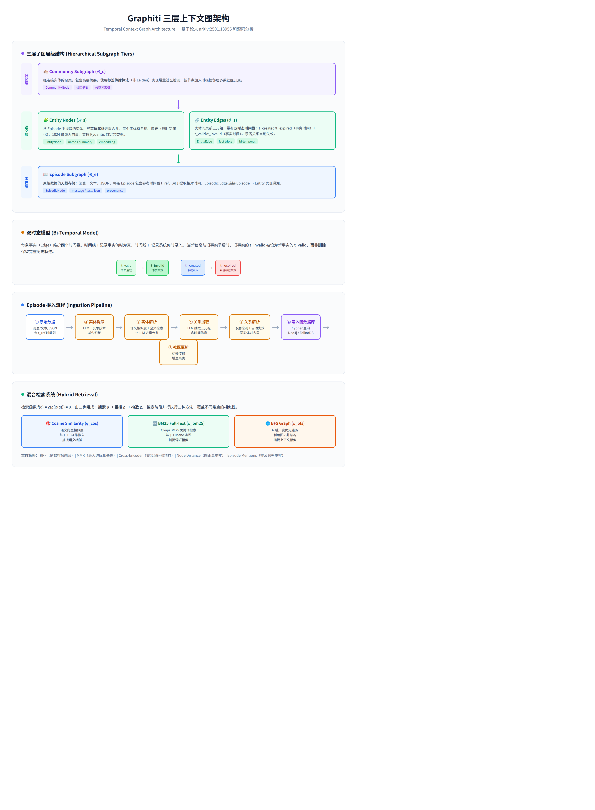
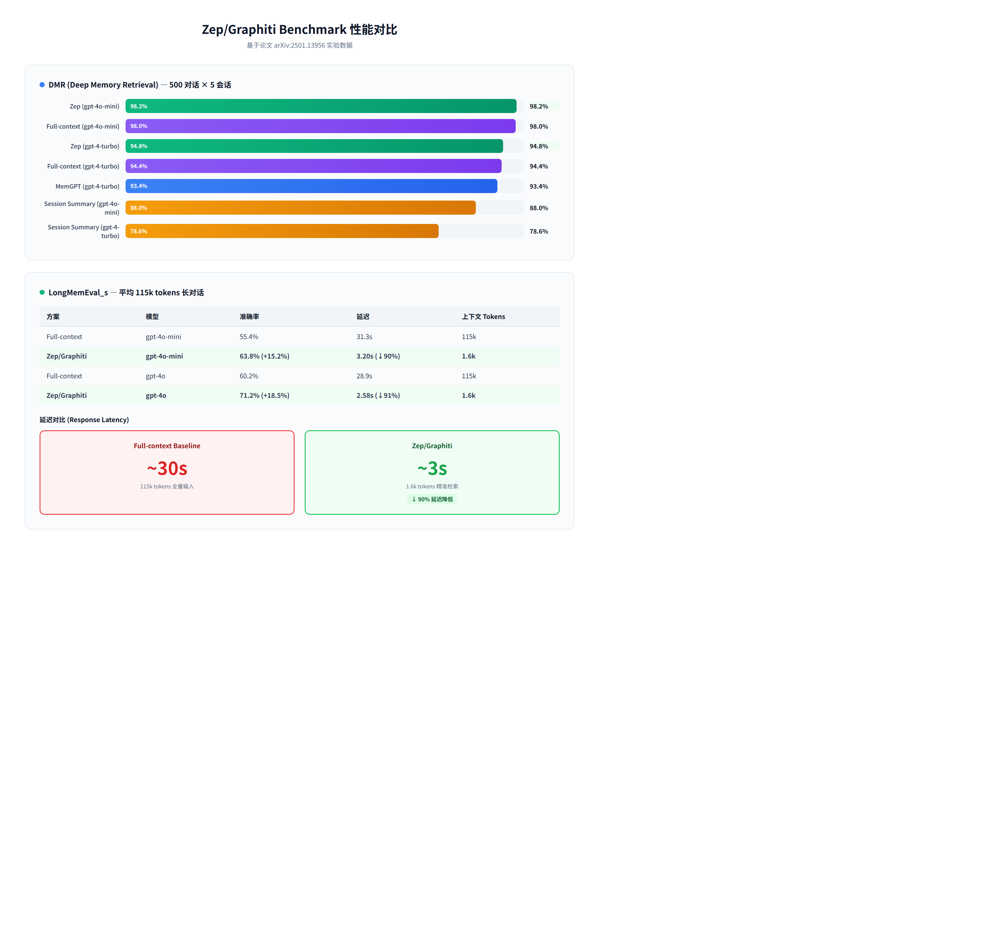

# Zep/Graphiti：LLM 构建时间知识图谱技术深度调研

> **作者：** Hermes Agent | **日期：** 2026-06-12  
> **论文：** [Zep: A Temporal Knowledge Graph Architecture for Agent Memory](https://arxiv.org/abs/2501.13956)  
> **仓库：** [getzep/graphiti](https://github.com/getzep/graphiti) ⭐ 27.3k Stars  
> **版本：** v0.17+ | **许可：** Apache 2.0

---

## 一、项目概述

Graphiti 是由 Zep AI 开源的**时间上下文图（Temporal Context Graph）**构建框架，专门为 AI Agent 的长期记忆系统设计。与传统 RAG 方法不同，Graphiti 能够实时增量地将非结构化对话数据和结构化业务数据融合到一个可查询的知识图谱中，并完整追踪事实随时间的变化。

Zep 是基于 Graphiti 的企业级托管服务，而 Graphiti 本身是完全开源的核心引擎。论文声称在 DMR 基准测试中达到 94.8% 准确率（超越 MemGPT 的 93.4%），在更具挑战性的 LongMemEval 基准上准确率提升高达 18.5%，同时响应延迟降低 90%。

| 属性 | 详情 |
|------|------|
| 核心定位 | AI Agent 的时序知识图谱记忆引擎 |
| 图数据库支持 | Neo4j（推荐）、FalkorDB、Amazon Neptune |
| LLM 支持 | OpenAI（默认）、Anthropic、Gemini、Groq、任意 OpenAI 兼容 API |
| 嵌入模型 | BGE-m3（论文实验）/ OpenAI text-embedding-3-small（默认） |
| 关键依赖 | Python 3.10+、Neo4j 5.26+、支持 Structured Output 的 LLM |
| 集成方式 | Python SDK、MCP Server、REST API（FastAPI）、Docker Compose |

---

## 二、核心架构：三层子图

Graphiti 的知识图谱 𝒢 = (𝒩, ℰ, ϕ) 由三个层级化的子图构成，这借鉴了人类记忆的心理学模型——区分**情景记忆**（Episodic Memory，具体事件）和**语义记忆**（Semantic Memory，概念关联）。



### 2.1 事件子图 (𝒢_e)

事件子图是整个系统的数据基础层。每个 **EpisodicNode** 存储一条原始数据（消息、文本或 JSON），采用**无损存储**策略——原始数据永远不会被修改或删除。这与传统 RAG 的"切片后丢弃原文"形成鲜明对比。

每条事件携带一个参考时间戳 `t_ref`，用于后续提取相对时间表达（如"两周前"、"下周四"）。事件通过 **EpisodicEdge** 连接到从中提取的语义实体，形成完整的**溯源链**：任何派生出的事实都可以追溯到产生它的原始数据。

### 2.2 语义子图 (𝒢_s)

语义子图是知识图谱的核心，包含**实体节点**和**实体边**。

**EntityNode**（实体节点）代表从事件中提取的人、产品、政策、概念等。每个实体有：
- `name`：实体名称（1024 维嵌入向量用于相似度检索）
- `summary`：实体摘要（随时间演化，新信息到来时更新）
- `group_id`：分区标识（支持多租户）
- 支持 Pydantic 模型定义的自定义实体类型（预设本体 vs 学习型本体）

**EntityEdge**（实体边）是实体间的关系三元组，这是 Graphiti 最核心的创新所在。每条边维护**四个时间戳**，构成双时态模型。

### 2.3 社区子图 (𝒢_c)

社区子图借鉴了 GraphRAG 的思路，通过**标签传播算法**（而非 Leiden 算法）将强连接的实体聚类为社区。选择标签传播的原因是其天然支持**增量扩展**——新节点加入时，只需调查邻居节点的社区归属并按多数投票分配，无需全图重算。

社区节点包含通过迭代 map-reduce 方式生成的摘要，社区名称由关键词和相关主题组成，同样进行嵌入以支持相似度搜索。

---

## 三、双时态模型：Graphiti 的核心创新

传统知识图谱在信息变更时通常直接覆盖旧数据，丢失了历史轨迹。Graphiti 引入了**双时态模型（Bi-Temporal Model）**，维护两条独立的时间线：

| 时间线 | 符号 | 含义 | 示例 |
|--------|------|------|------|
| 事实时间线 T | `t_valid` / `t_invalid` | 事实**何时为真** | "张三住在北京（2024.01 - 2025.06）" |
| 事务时间线 T' | `t_created` / `t_expired` | 系统**何时录入/标记失效** | 系统于 2025.07.01 收到搬家消息 |

当新信息与旧事实矛盾时，系统并非删除旧边，而是：
1. 设置旧边的 `t_invalid` = 新边的 `t_valid`
2. 设置旧边的 `t_expired` = 当前时间
3. 插入新边

这使得系统可以回答"现在什么是真的"和"某个时间点什么是真的"两种查询。例如：

> 用户在 3 月说"我喜欢 Adidas 鞋"，6 月说"我现在更喜欢 Nike"  
> → 边1: `(用户, 喜欢, Adidas)` valid=[3月] invalid=[6月]  
> → 边2: `(用户, 喜欢, Nike)` valid=[6月] invalid=[∞]

---

## 四、Episode 摄入流程

每条新数据（Episode）进入系统时，经历以下 7 步处理：

| 步骤 | 操作 | 技术手段 | 是否调用 LLM |
|------|------|---------|-------------|
| ① 原始数据输入 | 接收消息/文本/JSON，附带 t_ref | — | 否 |
| ② 实体提取 | 从当前消息 + 前 4 条消息中提取实体 | LLM + 反思技术减少幻觉 | ✅ |
| ③ 实体解析 | 与图中已有实体去重合并 | 1024 维嵌入余弦相似度 + BM25 全文检索 → LLM 判断 | ✅ |
| ④ 关系提取 | 抽取实体间的三元组关系 | LLM 结构化输出 | ✅ |
| ⑤ 关系解析 | 检测矛盾关系，自动失效旧边 | 仅在同实体对之间搜索 → LLM 判断 | ✅ |
| ⑥ 写入图数据库 | 执行预定义 Cypher 查询 | Neo4j / FalkorDB | 否 |
| ⑦ 社区更新 | 标签传播增量聚类 | 邻居多数投票 + LLM 摘要 | ✅（可选） |

关键设计决策：使用**预定义 Cypher 查询**而非 LLM 生成的数据库查询，确保一致的 schema 格式并减少幻觉风险。实体解析时，搜索空间被约束到"已有图中的相似实体"，关系解析时进一步约束到"同一实体对之间的已有边"，大幅降低计算复杂度。

并发控制通过 `SEMAPHORE_LIMIT` 环境变量管理，默认值 10，防止 LLM API 429 限流。

---

## 五、混合检索系统

Graphiti 的检索函数 `f(α) = χ(ρ(φ(α))) = β` 分三步将查询 α 转化为上下文 β：

### 5.1 搜索阶段 (φ)

并行执行三种搜索方法，覆盖不同维度的相似性：

| 搜索方法 | 实现 | 搜索维度 | 适用场景 |
|---------|------|---------|---------|
| Cosine Similarity (φ_cos) | 1024 维嵌入向量 + Neo4j 向量索引 | 语义相似 | "用户喜欢什么运动鞋？" |
| BM25 Full-Text (φ_bm25) | Okapi BM25 + Lucene 全文索引 | 词汇相似 | "Adidas" 精确关键词匹配 |
| BFS Graph (φ_bfs) | N 跳广度优先遍历 | 上下文相似 | 从最近提及的实体出发探索关联 |

搜索对象包括三类：语义边（搜索 `fact` 字段）、实体节点（搜索 `name` 字段）、社区节点（搜索 `name` 关键词字段）。

### 5.2 重排阶段 (ρ)

| 重排策略 | 原理 | 成本 |
|---------|------|------|
| RRF（倒数排名融合） | 融合多路搜索的排名 | 低 |
| MMR（最大边际相关性） | 平衡相关性与多样性 | 低 |
| Episode Mentions | 按对话中提及频率排序 | 低 |
| Node Distance | 基于图中距离质心节点的跳数 | 低 |
| Cross-Encoder | LLM 交叉注意力精排 | 高 |

### 5.3 构造阶段 (χ)

将排序后的节点和边格式化为 LLM 可理解的上下文字符串，包含事实及其有效时间范围、实体名称和摘要。

---

## 六、源码结构分析

Graphiti 的 Python 代码组织清晰，核心模块职责如下：

| 模块路径 | 职责 | 关键类/函数 |
|---------|------|------------|
| `graphiti_core/graphiti.py` | 主 API 入口 | `Graphiti` 类、`add_episode()` |
| `graphiti_core/nodes.py` | 节点定义 | `EntityNode`、`EpisodicNode`、`CommunityNode`、`SagaNode` |
| `graphiti_core/edges.py` | 边定义 | `EntityEdge`（含双时态字段）、`EpisodicEdge`、`CommunityEdge` |
| `graphiti_core/search/` | 混合检索 | `search()`、`SearchConfig`、预设 recipes |
| `graphiti_core/prompts/` | LLM 提示模板 | 实体提取、关系提取、去重、摘要等 12 个模板 |
| `graphiti_core/utils/maintenance/` | 图维护操作 | 边操作、节点操作、社区操作 |
| `graphiti_core/driver/` | 图数据库驱动 | `Neo4jDriver`、`FalkorDriver` |
| `graphiti_core/llm_client/` | LLM 客户端 | OpenAI、Anthropic、Gemini、Groq 适配器 |
| `graphiti_core/embedder/` | 嵌入客户端 | 默认 OpenAI，可替换 |
| `mcp_server/` | MCP 服务器 | 支持 Claude、Cursor 等 MCP 客户端 |
| `server/` | REST API | FastAPI 服务 |

LLM 提示模板（`prompts/` 目录）包含：`extract_nodes`、`extract_edges`、`dedupe_nodes`、`dedupe_edges`、`summarize_nodes`、`summarize_sagas`、`eval` 等，是系统的核心知识工程资产。

---

## 七、实验结果

### 7.1 DMR 基准测试

DMR（Deep Memory Retrieval）包含 500 组多会话对话，每组 5 个会话、每会话最多 12 条消息。论文指出该基准规模较小（60 条消息/组，可完全放入上下文窗口），因此各方案差异不大。

| 方案 | 模型 | 准确率 |
|------|------|--------|
| 递归摘要 | gpt-4-turbo | 35.3% |
| 会话摘要 | gpt-4-turbo | 78.6% |
| MemGPT | gpt-4-turbo | 93.4% |
| 全量上下文 | gpt-4-turbo | 94.4% |
| **Zep/Graphiti** | **gpt-4-turbo** | **94.8%** |
| 会话摘要 | gpt-4o-mini | 88.0% |
| 全量上下文 | gpt-4o-mini | 98.0% |
| **Zep/Graphiti** | **gpt-4o-mini** | **98.2%** |

### 7.2 LongMemEval 基准测试

LongMemEval_s 数据集更具挑战性，对话平均 **115,000 tokens**，包含 6 种问题类型，更能代表真实企业场景。



| 方案 | 模型 | 准确率 | 延迟 | 上下文 Tokens |
|------|------|--------|------|-------------|
| 全量上下文 | gpt-4o-mini | 55.4% | 31.3s | 115k |
| **Zep/Graphiti** | **gpt-4o-mini** | **63.8%** (+15.2%) | **3.20s** (↓90%) | **1.6k** |
| 全量上下文 | gpt-4o | 60.2% | 28.9s | 115k |
| **Zep/Graphiti** | **gpt-4o** | **71.2%** (+18.5%) | **2.58s** (↓91%) | **1.6k** |

分问题类型表现（gpt-4o）：

| 问题类型 | 全量上下文 | Zep | 变化 |
|---------|----------|-----|------|
| 单会话-偏好 | 20.0% | 56.7% | **+184%** |
| 时间推理 | 45.1% | 62.4% | **+38.4%** |
| 多会话 | 44.3% | 57.9% | **+30.7%** |
| 知识更新 | 78.2% | 83.3% | +6.5% |
| 单会话-用户 | 81.4% | 92.9% | +14.1% |
| 单会话-助手 | 94.6% | 80.4% | **-17.7%** |

Zep 在复杂问题类型（偏好、时间推理、多会话）上表现突出，但在单会话-助手类型上有下降，论文承认需要进一步研究。

---

## 八、与竞品对比

| 维度 | 传统 RAG | Microsoft GraphRAG | MemGPT | **Graphiti** |
|------|---------|-------------------|--------|-------------|
| 数据处理 | 批量静态 | 批量社区摘要 | 归档历史 | **实时增量** |
| 时间感知 | 无 | 基础时间戳 | 无 | **双时态追踪** |
| 检索方式 | 向量相似度 | LLM 递归摘要 | 向量 + 对话搜索 | **混合三路检索** |
| 查询延迟 | 毫秒 | 秒~数十秒 | 秒 | **亚秒** |
| 矛盾处理 | 无 | LLM 判断 | 无 | **自动事实失效** |
| 溯源能力 | 弱 | 中 | 强（归档） | **强（Episode 链）** |
| 自定义本体 | 无 | 无 | 无 | **Pydantic 模型** |
| 适合场景 | 静态文档 | 文档摘要 | 对话记忆 | **动态 Agent 上下文** |

---

## 九、适用场景与局限性

### 适用场景

- **AI Agent 长期记忆**：跨会话追踪用户偏好、历史交互
- **CRM / 客户画像**：客户信息随时间演化，需要时间旅行查询
- **企业知识管理**：政策、产品信息变更的历史追踪
- **多源数据融合**：对话 + 业务数据 + 外部信息的实时整合

### 当前局限性

| 局限 | 详情 |
|------|------|
| LLM 成本 | 每条 Episode 摄入需 3-5 次 LLM 调用（提取、解析、摘要），成本随数据量线性增长 |
| 运维复杂度 | 依赖图数据库（Neo4j/FalkorDB），需要额外的基础设施 |
| 模型要求 | 最佳效果需支持 Structured Output 的 LLM，小模型可能输出格式错误 |
| 社区检测 | 相比 GraphRAG 的层级社区，标签传播的聚类质量可能较低 |
| 助手类问题 | 论文显示在 single-session-assistant 类型上性能下降 |
| 实体解析精度 | 高度依赖嵌入质量，歧义实体可能错误合并 |

---

## 十、快速上手

```bash
pip install graphiti-core
# FalkorDB 轻量版（Docker）
docker run -p 6379:6379 -p 3000:3000 -it --rm falkordb/falkordb:latest
```

```python
from graphiti_core import Graphiti
from graphiti_core.nodes import EpisodeType
from datetime import datetime

graphiti = Graphiti("bolt://localhost:7687", "neo4j", "password")
await graphiti.build_indices_and_constraints()

await graphiti.add_episode(
    name="msg-1",
    episode_body="Kendra loves Adidas shoes",
    source=EpisodeType.message,
    source_description="user chat",
    reference_time=datetime.now(),
)

results = await graphiti.search(query="What shoes does Kendra like?")
```

MCP Server 可直接接入 Claude Desktop 和 Cursor，为 MCP 客户端提供带时间感知的图记忆能力。

---

## 十一、总结

Graphiti 是目前 **Agent 记忆 + 时序知识图谱** 领域最活跃的开源项目。其核心创新在于：

1. **双时态事实模型**：不删除旧信息，保留完整历史轨迹，支持时间旅行查询
2. **增量式图构建**：新数据实时融入，社区通过标签传播增量更新，无需批量重建
3. **混合检索 + 多策略重排**：语义 + 关键词 + 图遍历三路并行，配合 RRF/MMR/CrossEncoder 重排，亚秒级延迟
4. **Episode 溯源链**：每个派生事实都可追溯到原始数据，实现完整的信息谱系
5. **灵活的本体系统**：支持 Pydantic 模型定义的预设本体和从数据中学习的本体

论文实验表明，在长对话场景（115k tokens）下，Graphiti 相比全量上下文方案在准确率上提升 15-19%，同时将延迟和 token 消耗降低 90% 以上。对于需要构建动态、时序感知的 AI Agent 记忆系统的团队，Graphiti 是目前最值得考虑的开源方案。

---

*本报告基于论文 arXiv:2501.13956、GitHub 源码（getzep/graphiti v0.17+）及官方文档综合分析。*
