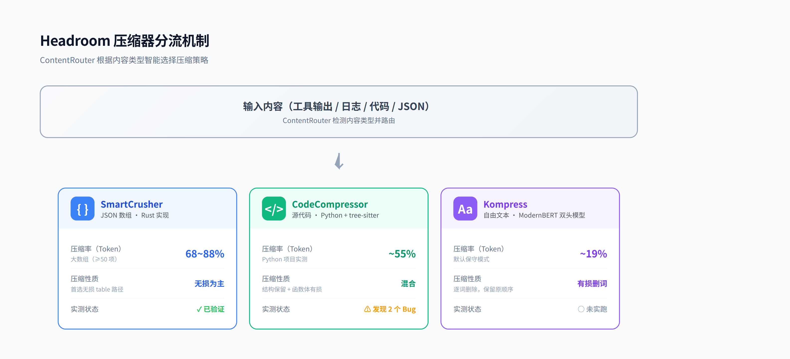
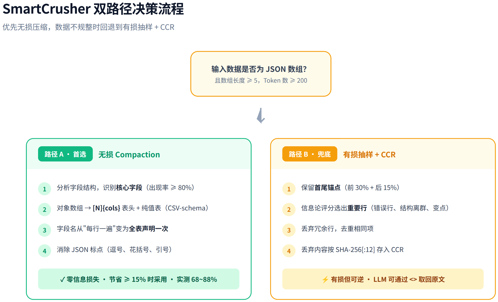
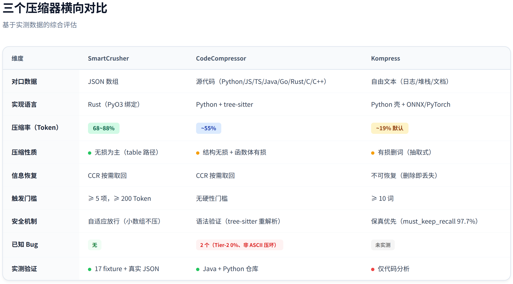
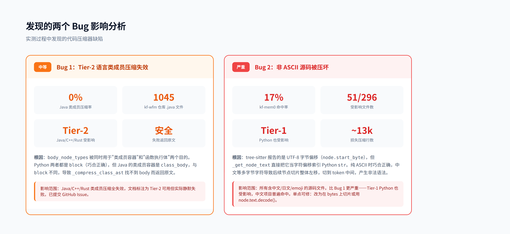

# Headroom 压缩器实践与探索报告

> 基于实测数据的压缩器深度验证，发现 2 个真实 Bug，验证三个压缩器的实际压缩效果与边界条件。

---

## 目录

1. [概述](#1-概述)
2. [三个压缩器的实现原理](#2-三个压缩器的实现原理)
3. [环境搭建](#3-环境搭建)
4. [实测结果](#4-实测结果)
5. [发现的两个 Bug](#5-发现的两个-bug)
6. [工具回显压缩能力](#6-工具回显压缩能力)
7. [批判性分析](#7-批判性分析)
8. [方法论结论](#8-方法论结论)
9. [报告局限性](#9-报告局限性)

---

## 1. 概述

**研究对象**：[chopratejas/headroom](https://github.com/chopratejas/headroom) @ commit `da1a3973`（v0.27.0 之后 35 个提交）

**研究目标**：通过实际搭建环境、编译 Rust 扩展、运行测试，验证三个核心压缩器的真实压缩效果，而非仅依赖官方文档或源码阅读。

**核心发现**：

| 压缩器 | 对口数据 | 实测压缩率（Token） | 性质 | 已知 Bug |
|--------|---------|-------------------|------|---------|
| SmartCrusher | JSON 数组 | **68~88%** | 无损为主 | 无 |
| CodeCompressor | 代码 | **~55%** | 结构无损 + 函数体有损 | 2 个（Tier-2 0%、非 ASCII 压坏） |
| Kompress | 自由文本 | **~19% 默认** | 有损删词 | 未实测 |

---

## 2. 三个压缩器的实现原理

Headroom 按内容类型分流到三个专用压缩器，判断依据完全不同：

| 压缩器 | 对口数据 | 判断依据 | 实现位置 |
|--------|---------|---------|---------|
| SmartCrusher | JSON 数组 | 数据结构规律 | Rust：`crates/headroom-core/src/transforms/smart_crusher/` |
| CodeCompressor | 源代码 | AST 语法规则 | Python：`headroom/transforms/code_compressor.py` |
| Kompress | 自由文本 | 训练的神经网络 | Python 壳 + HF 模型 `chopratejas/kompress-v2-base` |

### 2.1 SmartCrusher（JSON 数组）

Python 层只是 PyO3 shim，真正算法在 Rust（约 11.7k 行，26 个文件）。两条路径，按优先级：

**路径 A — 无损 Compaction（首选）**

把对象数组转成 `[N]{cols}` 表头 + 纯值表（CSV-schema 风格）。省 token 的本质是**字段名从"每行一遍"变成全表声明一次**，并消除 JSON 标点。**这一步零信息损失**，只有省下 ≥15%（`lossless_min_savings_ratio`）才采用。

**路径 B — 有损抽样 + CCR（兜底）**

数据不规整时，保留"重要行"（首尾锚点、错误行、结构离群、数值异常、变点、查询相关、去重），丢弃冗余行；丢掉的整段原文按 SHA-256[:12] 哈希存本地，prompt 里留 `<<ccr:HASH N_rows_offloaded>>` 指针，LLM 可按需取回。

**防过度压缩的闸门**：少于 5 条不分析；高唯一性 + 有 ID + 无信号 → 直接 Skip（不瞎压独特实体）。

### 2.2 CodeCompressor（源代码）

用 tree-sitter 解析 AST，然后：

- **永远保留**：import、函数/方法签名、类型注解、装饰器、类结构、顶层常量
- **压缩函数体**：按符号重要性（被引用数、fan-out、是否 public、与上下文相关性）给每个函数分配可保留行数预算，超出的语句替换成 `# [N lines omitted; calls: ...]`

**不丢信息的保证**：

1. **语法永远有效**：压完用 tree-sitter 重新解析，发现 ERROR/MISSING 节点直接返回原文
2. **按语句边界截断**，不切到表达式中间
3. **过度压缩保护**：压缩比过低视为数据丢失，返回原文
4. 完整原文进 CCR，可取回

**语言分级**：Python/JS/TS 为 Tier-1 全功能；Go/Rust/Java/C/C++/Perl 为 Tier-2。

### 2.3 Kompress（自由文本）

针对没有结构可利用的文本（日志、堆栈、文档）。是一个**双头 ModernBERT 神经网络**：

- **Head 1（token 分类头）**：`Linear(768→2)`，逐 token 输出"留/删"二分类
- **Head 2（span 重要性 CNN）**：1D 卷积输出每个位置的区段重要性分

**协作机制**（降低误删）：token 头明确说留则留；token 头犹豫（概率 0.3~0.5）时，看所在区段是否重要，重要则"救回"保留。

**本质是抽取式删词，不是摘要**。保留的是**原词、原顺序**，模型没有解码器、生不出新字。

**部署**：PyTorch（`[ml]`）或 ONNX（`[proxy]`，纯 CPU，不需 torch）。**完全本地运行**——模型本地优先加载，命中缓存则零网络；推理走 `CPUExecutionProvider`，文本不离开本机。

---

## 3. 环境搭建

CodeCompressor 和 SmartCrusher 在初始环境都跑不起来，逐一解决：

| 步骤 | 问题 | 解决方案 |
|------|------|---------|
| 1 | CodeCompressor 缺 tree-sitter | 建隔离 venv `.venv-headroom-test`，装 `tree_sitter` + `tree_sitter_language_pack` |
| 2 | 整包依赖过重 | 用 stub 模块隔离，只加载目标压缩器的真实算法 |
| 3 | SmartCrusher 需编译 Rust 扩展 | 装 rustup + cargo 工具链，用 maturin 编译 `crates/headroom-py` 出 `_core.abi3.so` |

**产出脚本**（统一口径，行/token/字符三量）：

| 文件 | 用途 |
|------|------|
| `compress_codetest.py` | CodeCompressor 单文件/目录测试 |
| `compress_survey.py` | 全仓库代码压缩普查（分类统计） |
| `compress_granularity.py` | 整文件 vs 逐函数 A/B 对比 |
| `compress_json.py` | SmartCrusher JSON 压缩测试 |

---

## 4. 实测结果

### 4.1 代码压缩（CodeCompressor）

**测试 1：Java 仓库 `kf-wfm`（1045 个 .java）→ 全部 0%**

6 个文件（88~1330 行）压缩率全是 0.0%。诊断为 headroom 的真实 bug（详见第 5 节），非环境问题。失败安全机制正常工作（返回原文，从不输出坏代码）。

**测试 2：Python 仓库 `kf-mem0`（315 个项目本体 .py）→ 整体有效**

| 类别 | 文件数 | 占比 |
|------|-------|------|
| 正常压缩（单文件中位 50%） | 223 | 75% |
| 被 unicode bug 卡住 | 51 | 17% |
| 真无需压缩（passthrough） | 22 | 7% |
| 太小跳过 | 19 | — |

**223 个正常压缩文件的实际压缩率**：

| 单位 | 原始 → 压缩 | 压缩率 |
|------|------------|--------|
| 行数 | 46,587 → 19,454 | **58.2%** |
| Token（chars/4 估算） | 439,991 → 198,296 | 54.9% |
| 字符 | 1,760,322 → 793,520 | 54.9% |

> **重要**：行数压缩率（58.2%）高于 token（54.9%）。原因：压缩器删的是短行（`x=1`、`return foo`），留的是长行（import、多行签名、类型注解）。评估"省多少 LLM 成本"应看 token。

**测试 3：粒度对比（整文件 vs 逐函数）**

结论：**逐函数单独压不会更省**。表面上逐函数偶尔行数更少，但那是因为它丢掉了模块级 import/常量/类属性（丢信息），且失去全局预算分配和跨函数调用信息。CodeCompressor 的"整文件输入 + 内部函数级处理 + 全局预算"已是更优解。

### 4.2 JSON 压缩（SmartCrusher）

**测试 1：17 个录制 fixture** → 总计行数 81.7%、token 73.0%，多数走无损 table 路径。

**测试 2：`kf-mem0` 真实评测结果 JSON（同构对象数组）**

| 文件 | 数组长度 | 策略 | Token 压缩率 |
|------|---------|------|-------------|
| smoke20_results | 20 | table（无损） | **85%** |
| limit50_results | 50 | table（无损） | **88%** |
| limit10_results | 10 | adaptive 放行 | 5% |
| smoke5_postfix | 5 大对象 | adaptive 放行 | 12% |

> **重要**：JSON 压缩必须看 token，不能看行数。SmartCrusher 把多行数组压成一行，行数永远显示 ≈100%，失真。小数组（≤10）被自适应阈值判定"不值得压"而放行——保守的安全设计。

**测试 3：headroom 自带 demo 样例**

三个样例（全唯一 60 行 / 高冗余 120 行 / 规整 40 行）转成 JSON 数组后，**全部走无损 table 路径，压缩率 68~73%**。即使"全唯一"数据，只要是 JSON 数组格式，光去掉重复字段名就能无损压 73%。

### 4.3 文本压缩（Kompress）

未实跑（需下模型），基于代码仓库数据判断：

- **默认压缩率约 19%**：模型注释实测（n=500）`keep_rate ≈ 0.81`，即保留约 81% 的词、删约 19%
- **优先保真**：`must_keep_recall ≈ 0.977`，宁可少删也要保留 97.7% 的"必须保留"内容
- **可调更激进**：设 `target_ratio`（如 0.3 → 压 70%），但代价是 recall 下降、误删关键词风险升高

是三个压缩器里最保守的——因为逐词删能安全删掉的本就有限。

### 4.4 横向对比

| 维度 | SmartCrusher | CodeCompressor | Kompress |
|------|--------------|----------------|----------|
| 对口数据 | JSON 数组 | 源代码 | 自由文本 |
| 实现语言 | Rust（PyO3） | Python + tree-sitter | Python + ONNX |
| 压缩率（Token） | **68~88%** | **~55%** | **~19% 默认** |
| 压缩性质 | 无损为主 | 结构无损 + 函数体有损 | 有损删词 |
| 信息恢复 | CCR 按需取回 | CCR 按需取回 | 不可恢复 |
| 已知 Bug | 无 | 2 个 | 未实测 |
| 实测验证 | ✓ 17 fixture + 真实 JSON | ✓ Java + Python 仓库 | ○ 仅代码分析 |

---

## 5. 发现的两个 Bug

### Bug 1 — Tier-2 语言永远不压缩类成员（0%）

**现象**：Java 仓库 `kf-wfm` 的 1045 个 .java 文件，压缩率全部为 0%。

**根因**：`_LANG_CONFIGS[*].body_node_types` 被同时用于两个目的——定位"类的成员容器"和定位"函数的执行体"。Python 两者都是 `block`（巧合正确）；Java/C++/Rust 的类成员容器是 `class_body`/`field_declaration_list`/`declaration_list`，与 `block` 不同，导致 `_compress_class_ast` 找不到 body 而返回原文。

**影响范围**：
- Java/C++/Rust 类成员压缩全失效
- 文档把 Java/C/C++ 列为 Tier-2 可用功能，与实际行为矛盾
- 无正确性风险（失败安全返回原文），但功能静默失效
- 已查重确认为 net-new，**已手动提交 GitHub Issue**

### Bug 2 — 非 ASCII 源码被压坏（0%，Tier-1 Python）

**现象**：中文项目 `kf-mem0` 中 **51/296 文件（17%）** 压缩率为 0%，白白损失约 13,167 行压缩空间。

**根因**：tree-sitter 报告的是 **UTF-8 字节偏移**（`node.start_byte`），但 `_get_node_text` 等直接把它当**字符偏移**索引进 Python `str`（`code[node.start_byte:node.end_byte]`）。纯 ASCII 时字节 = 字符，巧合正确；一旦文件中有中文/emoji 等多字节字符，后续节点切片整体左移，切到 token 中间（`import os` → `port os`，`def second():` 整行丢失），产生非法语法，被 `_verify_syntax` 兜底丢弃 → 用户看到 0%。

**影响范围**：
- **比 Bug 1 更严重**：Tier-1 Python 也受影响，不是 Tier-2 的问题
- 典型中文项目（含 docstring、注释）大概率命中此 bug，纯英文项目无影响
- 单点可修：改为在 bytes 上切片，或用 `node.text.decode()`

---

## 6. 工具回显压缩能力

这是 headroom 的核心目标场景。代码显示是**按形态和来源工具分流**，非无脑全压：

**压得好（70~92%）**：结构化回显——API/DB 的 JSON 数组（SmartCrusher 85~88%）、grep 搜索结果、构建/测试日志。

**默认不压（安全保护）**：`DEFAULT_EXCLUDE_TOOLS` 排除 `Read/Glob/Grep/Write/Edit`——Read 内容要给 Edit 精确匹配，压了破坏编辑工作流；`Bash` 故意不排除，其输出是理想压缩目标。

**基本不压**：工具调用本身（name + arguments）。`content_router` 只读取 tool_calls 建立 id→工具名映射（判断回显要不要排除），不压 arguments——arguments 短且改动会改变工具执行。

> **一句话**：JSON/搜索/日志类回显高效压缩（70~92%），纯文本回显约 19%，文件编辑类工具回显默认保护，调用指令本身放过。

---

## 7. 批判性分析

### 7.1 SmartCrusher 的设计亮点

SmartCrusher 是三个压缩器中设计最精良的。无损 table 路径的思路非常聪明——JSON 数组的本质冗余是"字段名重复"，而不是"数据重复"。即使数据全部唯一，光去掉重复字段名就能无损压 73%，这个洞察很有价值。

自适应放行机制也值得称赞：小数组（≤10）不压，避免了"压了反而更大"的尴尬。这种"知道自己什么时候不该做"的设计，比盲目追求压缩率更成熟。

### 7.2 CodeCompressor 的"过度保守"问题

CodeCompressor 的失败安全机制虽然保证了正确性，但也导致了 Bug 的静默失效。用户看到 0% 压缩率时，无法区分"这个文件真的无需压缩"还是"压缩器出了 bug"。

建议：在压缩率 0% 时，返回一个 metadata 字段说明原因（`passthrough` / `syntax_error_fallback` / `too_small`），让用户能诊断问题。

### 7.3 Kompress 的"保守到无用"困境

19% 的默认压缩率在实际 agent 场景中可能不够用。一个 10,000 token 的日志输出，压缩后还有 8,100 token，节省有限。

但这是有原因的：逐词删除能安全删掉的本就有限。如果把 `target_ratio` 调到 0.3（压 70%），recall 会下降，误删关键词的风险升高。这是一个**压缩率 vs 保真度**的根本权衡，没有完美解。

### 7.4 我的建议

1. **JSON 场景**：SmartCrusher 值得直接集成，无损压缩的收益已经很可观
2. **代码场景**：等 Bug 2 修复后再考虑，目前对中文项目不友好
3. **文本场景**：Kompress 的收益有限，除非你的 agent 经常处理大量日志/堆栈，否则集成成本可能不值得
4. **整体**：Headroom 的"压缩路由器"设计思路比具体实现更有价值——根据内容类型选择策略，比一刀切的截断/摘要更精细

---

## 8. 方法论结论

1. **压缩率不能孤立看**：有损压缩可以无限提高压缩率，代价是丢信息。必须和保真度配对评估。
2. **指标选择依内容而定**：代码按行处理，行数指标有意义；JSON 是结构化数据，必须看 token（行数会失真到 ≈100%）。
3. **0% 不等于"无需压缩"**：要区分三种 0%——真 passthrough（无可压）、语法兜底退回（Bug）、自适应放行（数据太小）。本研究正是靠这个区分发现了 Bug 2。
4. **数据要对口**：三个压缩器吃三种形态，喂错数据测了等于没测（Java 代码喂 SmartCrusher 会直接放行）。
5. **失败安全是真的**：三个压缩器一致——任何异常（语法坏、压过头、模型没加载）都返回原文，绝不输出会误导模型的坏数据。这也是为什么所有 bug 都表现为"0% 压缩"而非"代码损坏"。
6. **CCR 是"可逆"而非"无损"**：除 SmartCrusher 的 compaction 路径是真无损，其余的"不丢信息"实为"传输时有损 + 通过本地缓存按需取回"，依赖 store 配置、TTL 未过期、LLM 主动检索。

---

## 9. 报告局限性

本报告的覆盖范围和局限性：

| 维度 | 已覆盖 | 未覆盖 |
|------|--------|--------|
| 压缩器 | SmartCrusher、CodeCompressor | Kompress（需下模型）、SearchCompressor、LogCompressor、DiffCompressor、HTMLExtractor |
| 测试语言 | Python、Java | Go、Rust、C/C++、JS/TS |
| 测试规模 | 2 个仓库（kf-wfm、kf-mem0）+ 17 fixture | 更多真实项目 |
| 测试环境 | macOS arm64、Python 3.14 | Linux、Windows |

**后续可补充**：

1. Kompress 实测（下载模型后运行）
2. SearchCompressor / LogCompressor / DiffCompressor 的实测
3. 更多语言的 CodeCompressor 测试
4. 工具回显场景的端到端测试（集成到 agent 后的实际压缩率）

---

*研究周期：2026-06-23 ~ 2026-06-25。实测环境：macOS arm64，Python 3.14（隔离 venv），自建 Rust 工具链编译 `headroom._core`。*
