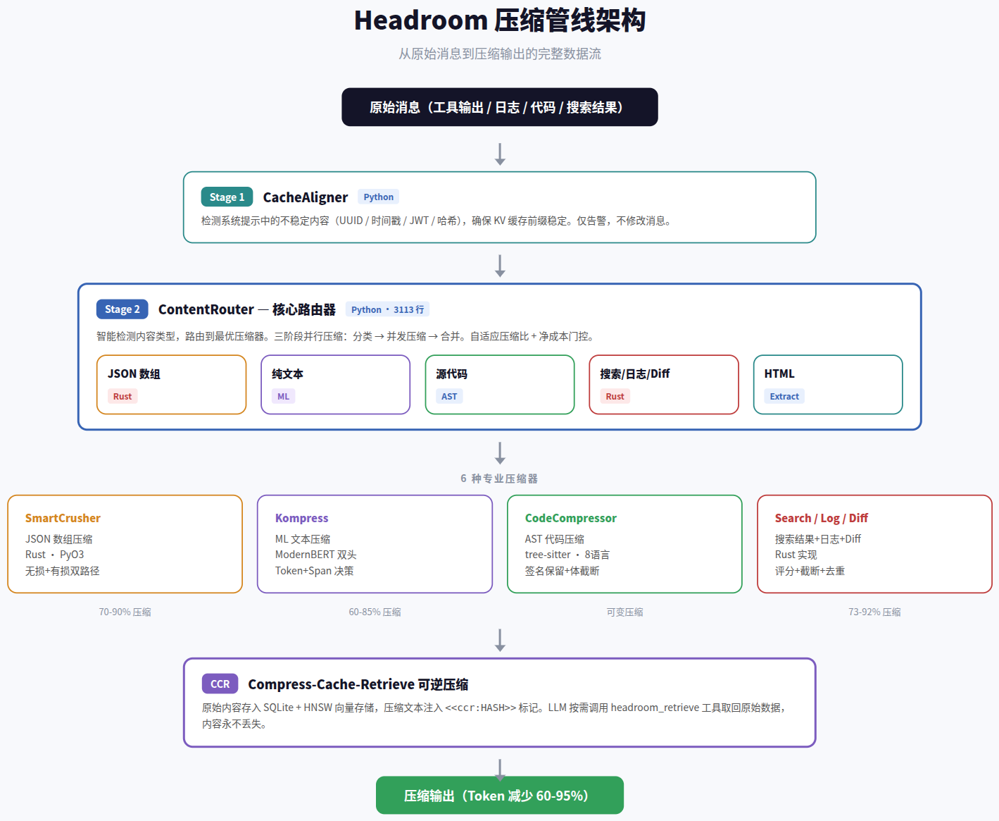
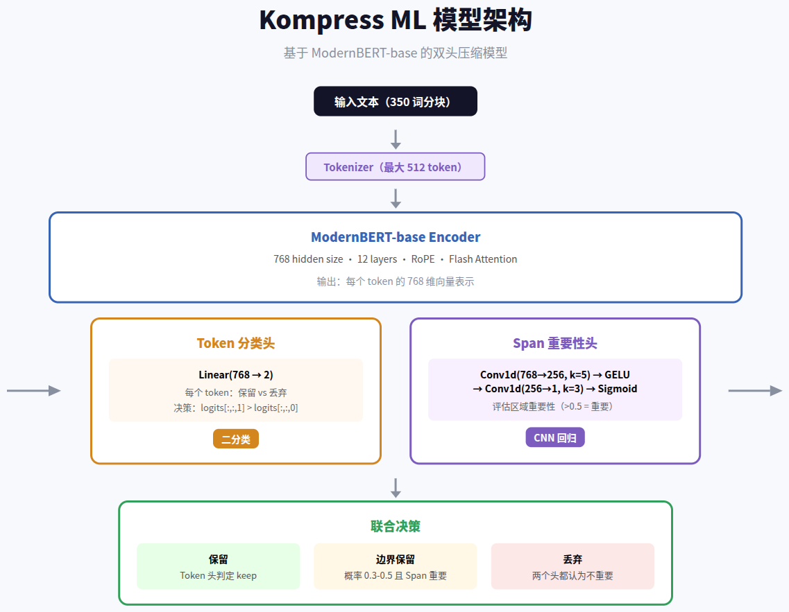
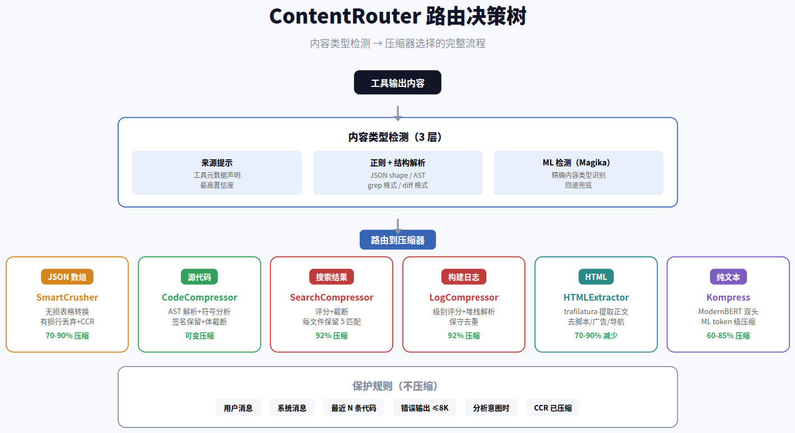
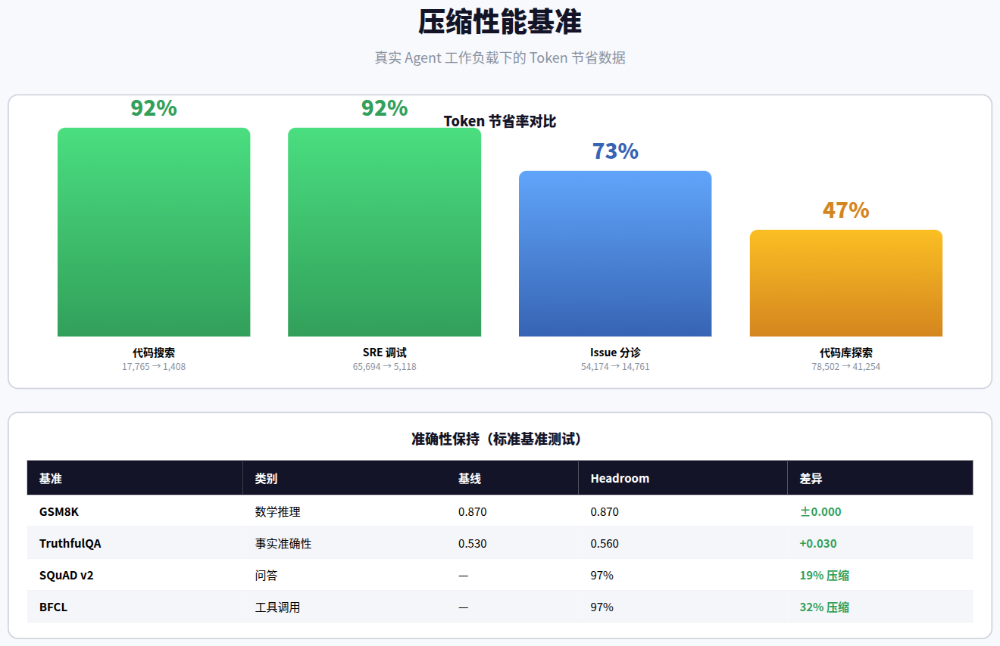

# Headroom：AI Agent 上下文压缩机制深度分析

> 一个面向 AI Agent 的智能上下文压缩层，通过 6 种专业压缩器 + ML 模型，实现 60-95% 的 Token 节省，同时保持回答质量不变。

---

## 目录

1. [概述](#1-概述)
2. [架构总览](#2-架构总览)
3. [压缩管线详解](#3-压缩管线详解)
4. [ML 模型：Kompress](#4-ml-模型kompress)
5. [路由与保护机制](#5-路由与保护机制)
6. [性能评估](#6-性能评估)
7. [设计评价与启示](#7-设计评价与启示)

---

## 1. 概述

**Headroom** 是一个开源的 AI Agent 上下文压缩层（Apache 2.0），由 chopratejas 团队开发。它在工具输出、日志、RAG 结果、文件内容和对话历史发送给 LLM 之前，对其进行智能压缩，从而大幅减少 Token 消耗。

项目以四种形态发布：Python 包、TypeScript 包、OpenAI/Anthropic 兼容 HTTP 代理、MCP 服务器。所有形态共享同一套压缩管线。

### 核心设计原则

| 原则 | 含义 |
|------|------|
| 本地优先 | 所有数据处理在用户本地完成，数据不离开本机 |
| 可逆压缩（CCR） | 原始内容被缓存，LLM 可按需检索原始数据 |
| 智能路由 | 根据内容类型自动选择最优压缩策略 |
| 混合语言架构 | Python 编排层 + Rust 核心计算层 |
| 净成本门控 | 只有净收益为正时才执行压缩 |

> **关键发现**：Headroom 不是通用压缩器，而是一个「压缩路由器」——它根据内容类型（JSON / 代码 / 日志 / 搜索结果 / HTML / 纯文本）自动选择最合适的压缩算法，这是它与传统上下文压缩方案的本质区别。

---

## 2. 架构总览

### 管线阶段

| 阶段 | 组件 | 语言 | 职责 |
|------|------|------|------|
| Stage 1 | CacheAligner | Python | 检测系统提示中的不稳定内容（UUID / 时间戳 / JWT），确保 KV 缓存前缀稳定 |
| Stage 2 | ContentRouter | Python (3113 行) | 核心路由器，智能检测内容类型并调度压缩器 |
| Stage 3 | 6 种压缩器 | Rust / Python / ML | 针对不同内容类型的专业化压缩 |
| Stage 4 | CCR 存储 | SQLite + HNSW | 可逆压缩，原始内容可按需检索 |

### 技术架构特点

**混合语言架构**是 Headroom 的核心技术决策。Python 负责编排层（管线管理、路由决策、扩展接口），Rust 负责核心计算（SmartCrusher、SearchCompressor、LogCompressor、DiffCompressor），通过 PyO3 绑定桥接。这种架构兼顾了 Python 的灵活性和 Rust 的性能。

**CCR（Compress-Cache-Retrieve）** 是另一个关键创新。当压缩器丢弃内容时，原始数据被存入本地 SQLite + HNSW 向量存储，压缩文本中注入 `<<ccr:HASH>>` 标记。LLM 如需更多信息，可调用 `headroom_retrieve` 工具取回原始数据。这解决了"压缩太狠导致 LLM 缺少关键信息"的痛点。

---

## 3. 压缩管线详解

### 3.1 CacheAligner（缓存对齐检测器）

CacheAligner 是管线的第一个组件，但它**仅检测不修改**消息内容。它的职责是发现系统提示中的不稳定内容，发出警告日志。

**检测对象与方法**：

| 类型 | 检测方式 | 优先级 |
|------|----------|--------|
| UUID | 标准库 `uuid.UUID` 解析验证 | 最高 |
| JWT | 三段 base64url 结构检查 | 高 |
| ISO 8601 时间戳 | `datetime.fromisoformat` 验证 | 中 |
| 十六进制哈希 | 长度（32/40/64）+ 字母表检查 | 低 |

**对齐评分**：100 - (发现数 × 10)，clamp [0, 100]。评分越高，KV 缓存命中率越稳定。

### 3.2 SmartCrusher（JSON 智能粉碎器）

SmartCrusher 处理工具返回的 JSON 数组数据，是压缩率最高的压缩器之一（70-90%）。核心计算已迁移到 Rust，Python 层为 thin shim。

**无损压缩路径（Compaction）**：分析 JSON 数组中每个对象的字段结构，识别「核心字段」（出现在 ≥80% 行中的字段），将数组转换为表格/CSV 格式，去掉重复的字段名。对异构数组（核心字段占比 <60%），尝试按判别字段分桶（2-8 桶），嵌套对象最多展平 6 个内部键。

**有损压缩路径（Row Drop）**：保留头部 30% + 尾部 15% 的项，用信息论评分（AnchorSelector）选择重要项，保留变化点，去重相同项。被丢弃的行注入 CCR 哨兵标记，LLM 可按需检索。

**关键配置**：

| 参数 | 默认值 | 说明 |
|------|--------|------|
| `min_items_to_analyze` | 5 | 最少分析项数 |
| `min_tokens_to_crush` | 200 | 最少 Token 数触发 |
| `first_fraction` | 0.3 | 保留前 30% |
| `last_fraction` | 0.15 | 保留后 15% |
| `compaction_core_field_fraction` | 0.8 | 核心字段比例阈值 |

### 3.3 CodeCompressor（AST 代码压缩器）

CodeCompressor 是基于 AST 的代码感知压缩器，使用 tree-sitter 解析源码，保证输出始终语法合法。这是唯一采用纯 Python 实现的主要压缩器。

**压缩流程**：

1. **语言检测**：正则预过滤 → tree-sitter 选错误最少的语言 → 回退正则评分。支持 Python / JS / TS / Go / Rust / Java / C / C++
2. **符号重要性分析**：收集所有定义、引用计数、调用关系，计算信号 = 引用数 + 公开性 + 扇出 + 语言约定 + 上下文匹配，Min-Max 归一化到 0-1
3. **函数体预算分配**：总目标行数 = 总行数 × `target_compression_rate`(0.2)，按 `score × body_size` 权重分配给各函数
4. **AST 级压缩**：保留 import、函数签名、类型注解、装饰器，对函数体按语句截断直到预算耗尽
5. **语法验证**：压缩后用 tree-sitter 验证，无效则返回原始代码

**数据驱动的语言配置**（`LangConfig`）：每种语言通过数据声明其 AST 节点类型和语法约定，压缩器通用化地使用这些配置表驱动提取和压缩，避免每种语言重复实现。

### 3.4 SearchCompressor（搜索结果压缩器）

处理 grep/ripgrep 搜索输出，Rust 实现。

**压缩策略**：解析 `file:line:content` 格式 → 上下文关键词匹配评分 (+0.3/词)、错误模式提升 (+0.5) → 按文件总分排序 → 每文件保留 top-N（首/末始终保留）→ 格式化输出。

**关键参数**：每文件最多 5 匹配，全局最多 30 匹配，最多 15 个文件。

### 3.5 LogCompressor（日志压缩器）

处理测试/构建日志，Rust 实现。支持 pytest / npm / cargo / make / jest 等格式。

**行级别评分**：

| 级别 | 分数 | 说明 |
|------|------|------|
| ERROR / FAIL | 1.0 | 最高优先级 |
| WARN | 0.5 | 次高 |
| 堆栈跟踪 | +0.3 | 附加分 |
| 摘要行 | +0.4 | 附加分 |
| INFO | 0.1 | 低优先级 |
| DEBUG | 0.05 | 最低 |

**去重策略**：保守策略——只规范化尾部变量区域（数字/十六进制/路径），保留消息前缀。最多 10 个错误，3 个堆栈跟踪，5 个警告，总行数上限 100。

### 3.6 DiffCompressor（Git Diff 压缩器）

处理 unified diff 格式，Rust 实现。限制上下文行数（默认 2 行），每文件最多 10 个 hunk，最多 20 个文件，新增/删除行始终保留。

### 3.7 HTMLExtractor（HTML 内容提取器）

基于 trafilatura 库的 HTML 正文提取器（非压缩），移除脚本、样式、导航、广告等结构性噪声。典型减少 70-90%，零内容损失。输出格式支持 Markdown 和纯文本。

---

## 4. ML 模型：Kompress

Kompress 是 Headroom 的核心 ML 压缩模型，基于 ModernBERT 架构，托管在 HuggingFace（`chopratejas/kompress-v2-base`）。它是唯一处理通用纯文本的压缩器。

### 模型架构

Kompress 采用**双头设计**：

- **Token 分类头**：`Linear(768→2)`，对每个 Token 做二分类（保留/丢弃），决策 = `logits[:,:,1] > logits[:,:,0]`
- **Span 重要性头**：`Conv1d(768→256, k=5) → GELU → Conv1d(256→1, k=3) → Sigmoid`，通过 1D CNN 评估 Token 所在区域的重要性

**联合决策逻辑**：
- Token 头判定保留 → 保留
- Token 头概率在 0.3-0.5 边界区 + Span 头认为重要 → 保留
- 两个头都认为不重要 → 丢弃

### 推理后端

| 后端 | 模型大小 | 精度 | 适用场景 |
|------|----------|------|----------|
| ONNX int8 量化 | 261MB | f1=0.9130 | CPU / CoreML（默认） |
| ONNX fp32 | 601MB | f1=0.9128 | int8 不支持时回退 |
| PyTorch | ~600MB | fp32 | CUDA / MPS |

INT8 量化版与 fp32 版本的一致性达 99.6%，内存节省 2.2 倍。

### 压缩流程

1. 词数 < 10 → 直接 passthrough
2. 按 350 词分块（`chunk_words`），每块最大 512 Token
3. 模型推理：Token 头 + Span 头联合决策
4. Token→word 归约：每个词取其 subtoken 最高分
5. 压缩率 < 0.8 时存储原始内容到 CCR

---

## 5. 路由与保护机制

### ContentRouter：核心路由器

ContentRouter 是整个压缩系统的大脑（3113 行），负责智能内容类型检测和压缩策略选择。

**三阶段并行压缩**：

| 阶段 | 模式 | 操作 |
|------|------|------|
| Pass 1 | 顺序 | 分类每条消息：冻结/保护/缓存命中/小内容 → 跳过；需压缩 → 收集 |
| Pass 2 | 并行 | 所有 cache-miss 在 ThreadPoolExecutor 中并发压缩 |
| Pass 3 | 顺序 | 结果合并回消息顺序，更新缓存 |

**自适应压缩比**：根据上下文压力（`tokens_before / model_limit`）线性插值宽松阈值（0.85）和激进阈值（0.65）。上下文越紧张，压缩越激进。

**净成本门控**：计算 `gain = ΔT × (w + r(R-1)) - S × p_alive`，只有净收益为正时才执行压缩。避免压缩后 Token 反而增加的尴尬情况。

### 保护规则

以下内容永远不会被压缩：

| 保护对象 | 原因 |
|----------|------|
| 用户消息 | 用户输入应原样保留 |
| 系统/开发者消息 | 系统提示不应被修改 |
| 最近 N 条代码 | 近期上下文对理解当前任务至关重要 |
| 错误输出（≤8000 字符） | 错误信息是调试的关键线索 |
| 分析意图时的代码 | 用户要求分析/审查代码时不压缩 |
| CCR 已压缩内容 | 避免重复压缩导致信息丢失 |

---

## 6. 性能评估

### Token 节省数据

| 工作负载 | 压缩前 | 压缩后 | 节省率 |
|---------|--------|--------|--------|
| 代码搜索（100 结果） | 17,765 | 1,408 | **92%** |
| SRE 事故调试 | 65,694 | 5,118 | **92%** |
| GitHub Issue 分诊 | 54,174 | 14,761 | **73%** |
| 代码库探索 | 78,502 | 41,254 | **47%** |

### 准确性保持

| 基准 | 类别 | 基线 | Headroom | 差异 |
|------|------|------|----------|------|
| GSM8K | 数学推理 | 0.870 | 0.870 | ±0.000 |
| TruthfulQA | 事实准确性 | 0.530 | 0.560 | +0.030 |
| SQuAD v2 | 问答 | — | 97% | 19% 压缩 |
| BFCL | 工具调用 | — | 97% | 32% 压缩 |

> **核心发现**：Headroom 在 GSM8K 数学基准上实现了零质量损失，在 TruthfulQA 上甚至有微小提升（+0.03）。这说明智能压缩不会损害 LLM 的推理能力，反而可能通过去除噪声提升事实准确性。

---

## 7. 设计评价与启示

### 优势

**智能路由是最大亮点**。Headroom 不是一刀切的压缩器，而是根据内容类型（JSON / 代码 / 日志 / 搜索结果 / HTML / 纯文本）自动选择最合适的压缩算法。这种「压缩路由器」的设计思路值得所有上下文管理系统借鉴。

**CCR 可逆架构解决了核心矛盾**。压缩率和信息完整性是天然矛盾的，CCR 通过「先压缩，按需恢复」的懒加载模式巧妙地化解了这个矛盾。LLM 不需要在一开始就获取所有信息，而是在需要时才检索原始数据。

**Rust + Python 混合架构务实高效**。计算密集的 JSON 解析、日志解析、Diff 解析用 Rust 实现，保证性能；编排逻辑和 ML 推理用 Python 实现，保证灵活性。PyO3 桥接层干净透明。

### 不足与风险

**ML 模型的泛化性存疑**。Kompress 基于 ModernBERT 训练，其压缩质量高度依赖训练数据的覆盖面。对于非英文文本、小众编程语言、特殊格式的日志，效果可能大打折扣。项目未公开训练数据和评测细节，难以评估其泛化边界。

**管线延迟开销**。ML 推理 + AST 解析 + JSON 结构分析，整个管线的延迟在实时对话场景下需要仔细评估。特别是 Kompress 的 ONNX 推理在 CPU 上可能成为瓶颈。

**CCR 存储膨胀**。所有被压缩的内容都缓存到本地 SQLite，长时间运行的 Agent 可能面临存储膨胀问题。项目未提及 CCR 的过期清理策略。

### 对 Hermes Agent 的启示

Headroom 的设计思路对 Agent 上下文管理有直接参考价值：

1. **内容感知压缩**：根据内容类型选择压缩策略，比统一的截断/摘要更精细
2. **可逆压缩**：CCR 的懒加载模式值得在 Agent 记忆系统中借鉴
3. **净成本门控**：不盲目压缩，计算实际收益后才执行，避免无效操作
4. **保护机制**：近期上下文、错误信息、分析意图等关键内容不应被压缩

---

*分析基于 Headroom 全部核心源码：smart_crusher.py (1029行)、code_compressor.py (2036行)、kompress_compressor.py (1310行)、content_router.py (3113行)、search_compressor.py (379行)、log_compressor.py (520行)、diff_compressor.py (175行)、html_extractor.py (233行)、cache_aligner.py (388行)。*
