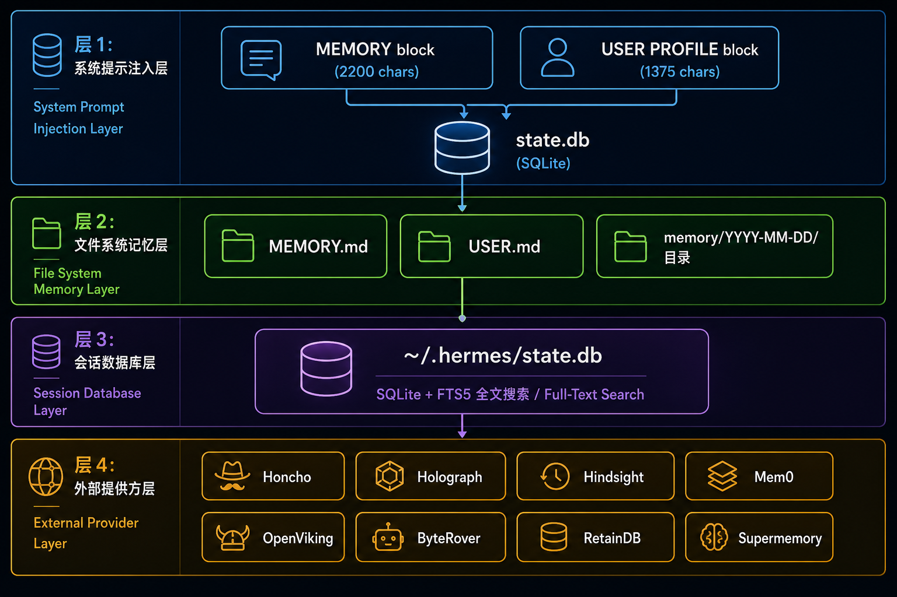
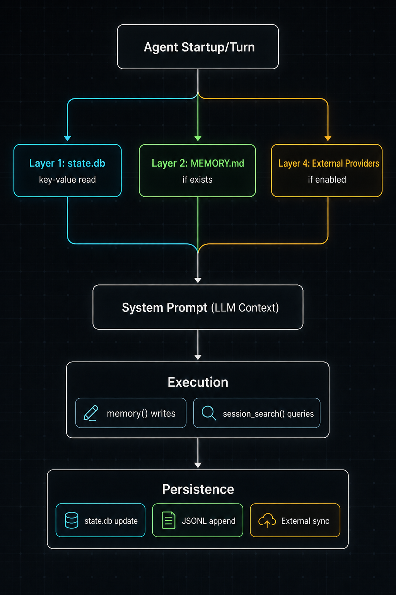

# Hermes Agent 记忆架构技术报告

> 版本：1.0 | 日期：2026-06-01 | 基于 Hermes Agent v2.x

---

## 1. 概述

Hermes Agent 的记忆系统采用**四层分层架构**，从内核到外延逐层扩展。核心设计原则为：

- **分层解耦**：每一层独立运作，上层损坏不影响下层
- **渐进增强**：内置层始终可用，外部插件按需激活
- **双写冗余**：关键记忆同时存在于数据库和文件系统

当前部署实例（`~/.hermes/`）处于基础模式：内置层完全运作，外部提供者已安装但未激活。

---

## 2. 架构总览



---

## 3. 分层详解

### 3.1 Layer 1: System Prompt 注入层

**定位：** 记忆系统的核心，始终激活，不可关闭。

**存储后端：**
- 数据持久化于 `~/.hermes/state.db`（SQLite），非文件系统
- 与 Layer 3 共享同一数据库，但逻辑隔离

**数据模型：**

| 区块 | 键 | 容量上限 | 内容语义 |
|------|-----|---------|---------|
| MEMORY | `memory` | 2,200 字符 | 环境事实、工具用法、经验教训、项目约定 |
| USER PROFILE | `user` | 1,375 字符 | 用户名、偏好、时区、项目上下文、通信风格 |

**注入时机：**
- 每个对话轮次开始时，从 state.db 读取最新值
- 直接注入到 LLM system prompt 的固定位置
- 注入内容位于 system prompt 末尾，优先级最高

**管理接口（`memory()` 工具）：**
```
memory(action="add",     target="memory"|"user")  → 追加条目
memory(action="replace", target="memory"|"user")  → 原子替换
memory(action="remove",  target="memory"|"user")  → 删除条目
```

**设计约束：**
- 容量硬限制由 system prompt 模板控制，超出部分截断
- 内容格式为自由文本，无结构化 schema
- 更新即时生效于下一轮次，无需重启

---

### 3.2 Layer 2: 文件系统记忆层

**定位：** 可选的、人类可读的冗余层。遵循 `AGENTS.md` 工作流约定。

**文件结构：**

| 文件 | 路径 | 用途 | 持久化方式 |
|------|------|------|-----------|
| MEMORY.md | `$WORKSPACE/MEMORY.md` | 长期策展记忆 | 手动或 Agent 写入 |
| USER.md | `$WORKSPACE/USER.md` | 用户画像 | 手动维护 |
| 日志 | `$WORKSPACE/memory/YYYY-MM-DD.md` | 每日操作日志 | 每日创建 |

**与 Layer 1 的关系：**
- Layer 1（state.db 键值对）是**实际生效**的记忆源
- Layer 2（文件）是**可选的可读备份**，也可作为 state.db 的替代加载源
- 主会话（直接对话）同时加载 Layer 1 + Layer 2；群聊/Discord 仅加载 Layer 1
- 当 MEMORY.md 不存在时，系统回退到仅使用 state.db 中的 MEMORY 区块

**安全隔离：**
- `MEMORY.md` 仅在主会话（direct chat）加载，不在群聊、Discord 等共享上下文中加载
- 这是 AGENTS.md 明确规定的安全策略，防止个人信息泄露到多人环境

---

### 3.3 Layer 3: 会话数据库层

**定位：** 全量历史记录的搜索引擎，支持跨会话语义检索。

**技术规格：**

| 属性 | 值 |
|------|-----|
| 数据库 | SQLite |
| 搜索引擎 | FTS5（全文搜索） |
| 数据粒度 | 每条消息独立行，含 role、content、timestamp、session_id |
| 当前规模 | ~70 MB，数百个会话 |

**检索接口（`session_search()` 工具）：**

```
模式 1 - 发现（Discovery）:
  session_search(query="关键词", limit=3)
  → 返回匹配会话的摘要（bookend_start + 命中上下文 + bookend_end）

模式 2 - 滚动（Scroll）:
  session_search(session_id="...", around_message_id=12345, window=10)
  → 返回指定消息周围的上下文窗口

模式 3 - 浏览（Browse）:
  session_search()
  → 返回最近会话的时间线概览
```

**FTS5 查询语法：**
- AND 为默认操作符（多词查询要求全部匹配）
- 支持 OR（`alpha OR beta`）、NOT（`python NOT java`）
- 支持短语（`"docker networking"`）和前缀通配（`deploy*`）
- 角色过滤：`role_filter="user,assistant"` 排除工具输出噪声

**数据保留：**
- 会话文件同时存储为 `~/.hermes/sessions/*.jsonl`
- state.db 为主索引，JSONL 为冗余备份
- 无自动过期策略，依赖用户手动清理（`hermes sessions prune`）

---

### 3.4 Layer 4: 外部提供者层

**定位：** 高级记忆能力的插件市场。8 个提供者可选，同时仅激活 1 个。与内置层（Layer 1-3）**并行工作**，非替代关系。

**激活流程：**
```bash
hermes memory setup              # 交互式选择 + 自动配置
hermes config set memory.provider holographic  # 或手动指定
hermes memory off                # 回退到 built-in only
```

**通用行为（启用后自动生效）：**
1. 提供者上下文注入 system prompt（与 Layer 1 并存）
2. 每轮前预取相关记忆（非阻塞后台操作）
3. 每轮后同步对话内容
4. 会话结束时自动提取记忆
5. `memory()` 工具的写入双写到外部提供者
6. 提供者专属工具注册到工具集

**提供者横向对比：**

| 提供者 | 部署模式 | 检索方式 | 核心能力 | 外部依赖 |
|--------|---------|---------|---------|---------|
| **Holographic** | 本地 SQLite | FTS5 + HRR 代数 | 信任评分、矛盾检测、实体查询 | 无（NumPy 可选） |
| **Honcho** | 云端 / 自托管 | 语义搜索 + 辩证推理 | 多 Pass LLM 自我审计、用户建模 | API key / 自托管实例 |
| **Hindsight** | 云端 / 本地 | 多策略检索 + 知识图谱 | 实体解析、跨记忆合成（reflect） | API key 或本地 LLM |
| **Mem0** | 云端 | 语义搜索 + 重排序 | 全自动事实提取、去重 | API key |
| **OpenViking** | 自托管 | 层级检索（L0→L1→L2） | 6 类自动分类、文件系统导航 | 自托管服务器 |
| **ByteRover** | 本地 | 知识树 + LLM 驱动 | CLI 驱动、自动预压缩提取 | CLI 安装 |
| **RetainDB** | 云端 | 向量 + BM25 + 重排序 | 7 种记忆类型、增量压缩 | $20/月订阅 |
| **Supermemory** | 云端 | 语义搜索 + 会话图谱 | 上下文围栏防递归污染 | API key |

**`memory` 配置项（config.yaml）：**
```yaml
memory:
  memory_enabled: true       # 是否启用 MEMORY 区块注入
  user_profile_enabled: true # 是否启用 USER PROFILE 区块注入
  provider: ""               # 外部提供者名称（空 = built-in only）
```

---

## 4. 当前部署状态

基于 `hermes memory status` 输出（2026-06-01）：

```
Memory status
────────────────────────────────────────
  Built-in:  always active
  Provider:  (none — built-in only)

  Installed plugins:
    • byterover     (requires API key)
    • hindsight     (API key / local)
    • holographic   (local)
    • honcho        (API key / local)
    • mem0          (API key / local)
    • openviking    (API key / local)
    • retaindb      (API key / local)
    • supermemory   (requires API key)
```

| 层级 | 状态 | 数据规模 |
|------|------|---------|
| Layer 1 (System Prompt) | ✅ 激活 | MEMORY: 2,193/2,200 字符，USER: 1,222/1,375 字符 |
| Layer 2 (文件系统) | ❌ 未初始化 | MEMORY.md、USER.md、memory/ 目录均未创建 |
| Layer 3 (会话数据库) | ✅ 激活 | state.db ~70 MB，sessions/ 350+ 个 JSONL 文件 |
| Layer 4 (外部提供者) | ⚪ 已安装未启用 | 8 个插件就绪，0 个激活 |

---

## 5. 数据流总结



---

## 6. 与 Oh My Pi (OMP) 的关键架构差异

| 维度 | Hermes Agent | Oh My Pi (mnemopi) |
|------|-------------|-------------------|
| 记忆存储介质 | state.db SQLite 键值对 | 本地 SQLite 数据库 |
| 核心数据结构 | 自由文本块（2.2K 字符） | 结构化记忆条目 + 嵌入向量 |
| 提取策略 | 手动（memory 工具）/ 可选自动 | 全自动两阶段 LLM 管道 |
| 生成输出 | 原始文本 | MEMORY.md + memory_summary.md + skills/ |
| 扩展模式 | 8 个可插拔提供者 | 单体内置，可外接嵌入 API |
| 项目隔离 | 无（全局记忆） | 原生 per-project / per-project-tagged / global |
| 自动技能生成 | 无 | 会话 → 技能 Playbook 自动提取 |
| 启动配置 | `hermes memory setup` 交互式 | `memory.backend: local` 一行配置 |
| 注入控制 | 固定上限（2.2K / 1.4K） | 可配置 `summaryInjectionTokenLimit: 5000` |
| 时效性控制 | 无内置机制 | maxRolloutAgeDays + minRolloutIdleHours |

---

## 7. 推荐激活方案

### 场景 A：零配置本地增强
```bash
hermes config set memory.provider holographic
```
- ✅ 纯本地，零外部依赖
- ✅ 获得信任评分 + 代数查询（probe/reason/contradict）
- ✅ `fact_store` 和 `fact_feedback` 工具可用

### 场景 B：全自动云端记忆
```bash
hermes config set memory.provider mem0
echo "MEM0_API_KEY=xxx" >> ~/.hermes/.env
```
- ✅ 完全自动提取，无需手动维护
- ✅ 语义搜索 + 自动去重

### 场景 C：深度用户建模
```bash
hermes config set memory.provider honcho
# 然后按向导配置 honcho.json
```
- ✅ 多 Pass 辩证推理，深度理解用户
- ✅ 跨 Profile 共享用户画像

---

*报告完毕。*
