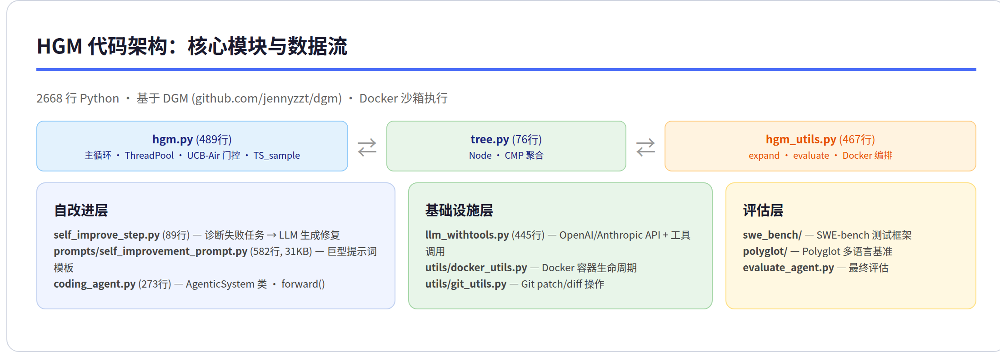
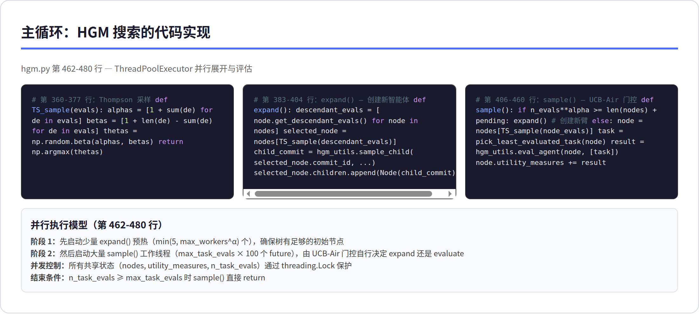
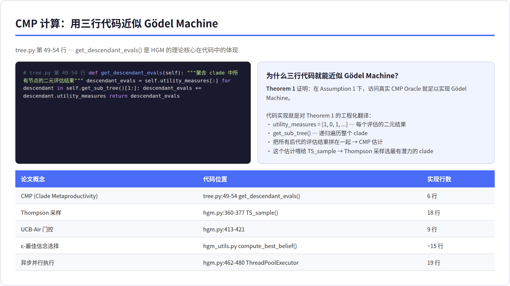
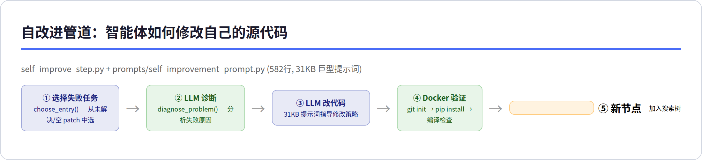
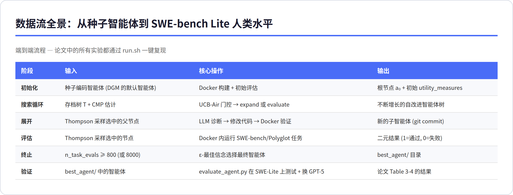

# HGM (Huxley-Gödel Machine)：论文原理 + 源码实现 联合分析

> **核心发现**：HGM 发现了「高分智能体 ≠ 好后代」的元生产力错配问题，用 Clade Metaproductivity（聚合后代子树的全部表现）替代贪心的基准评分来指导自改进搜索。2668 行 Python 源码将这一定理翻译成了 Docker 沙箱内运行的生产级系统，在 SWE-bench Lite 上达到人类水平。

---

## 目录

1. [概述](#1-概述)
2. [代码架构总览](#2-代码架构总览)
3. [主循环：论文理论到代码的翻译](#3-主循环论文理论到代码的翻译)
4. [CMP 计算：三行代码近似 Gödel Machine](#4-cmp-计算三行代码近似-gödel-machine)
5. [自改进管道：智能体如何修改自己](#5-自改进管道智能体如何修改自己)
6. [数据流全景](#6-数据流全景)
7. [实战分析：读代码发现的 8 个关键细节](#7-实战分析读代码发现的-8-个关键细节)
8. [批判性分析](#8-批判性分析)
9. [总结与启示](#9-总结与启示)

---

## 1. 概述



**论文信息**：Wenyi Wang, Piotr Piękos 等（KAUST），ICLR 2026 Oral，arXiv:2510.21614，30 页。

**代码仓库**：`github.com/metauto-ai/HGM`，MIT 协议，2668 行 Python，基于 DGM 代码改编。

**核心贡献**：
- 揭示了**元生产力-表现错配**（Metaproductivity-Performance Mismatch）：基准高分 ≠ 自我改进潜力高
- 提出 **Clade Metaproductivity (CMP)**：聚合一个智能体所有后代的评估结果来衡量其自改进潜力
- 证明 **Theorem 1**：在 Assumption 1 下，访问 CMP Oracle 足以实现 Gödel Machine
- 在 SWE-bench Lite 上达到**与最佳人类设计的 SWE-agent 持平**的性能

| 指标 | HGM | DGM | SICA |
|------|-----|-----|------|
| SWE-Verified-60 | **56.7%** | 53.3% | 50.0% |
| Polyglot | **30.5%** | 27.1% | 25.4% |
| 运行时间 (SWE) | **517h** | 1231h | 无限循环 |
| CMP 估计相关性 | **0.778** | 0.285 | 0.444 |
| 完整 SWE-Verified | **61.4%** — #1 GPT-5-mini | | |
| SWE-Lite + GPT-5 | **57%** — 人类水平 | | |

---

## 2. 代码架构总览


### 模块分层

| 层 | 核心文件 | 行数 | 职责 |
|----|---------|------|------|
| **主循环** | `hgm.py` | 489 | ThreadPool 调度、UCB-Air 门控、Thompson 采样 |
| **树结构** | `tree.py` | 76 | Node 类、CMP 聚合（get_descendant_evals） |
| **搜索工具** | `hgm_utils.py` | 467 | 节点展开（sample_child）、评估调度（eval_agent） |
| **自改进** | `self_improve_step.py` | 89 | 诊断失败→LLM 改代码 |
| **提示词** | `prompts/self_improvement_prompt.py` | 582 | **31KB 巨型提示词**，含编码智能体完整描述 |
| **配置** | `config.py` | 203 | dataclass 配置（LLM/优化/执行参数） |
| **编码智能体** | `coding_agent.py` | 273 | AgenticSystem 类、工具调用、消息管理 |
| **LLM 接口** | `llm_withtools.py` | 445 | OpenAI/Anthropic API + 工具调用 + backoff 重试 |
| **评估框架** | `swe_bench/` `polyglot/` | ~500 | SWE-bench 和 Polyglot 的 Docker 沙箱评估 |

### 源码继承关系

HGM 的代码几乎**全部标记为 `adapted from DGM`**（`github.com/jennyzzt/dgm`）。核心改动集中在：
- `hgm.py` — 用 CMP + Thompson 采样替代 DGM 的贪心选择
- `tree.py` — 新增 `get_descendant_evals()` 实现 CMP
- `hgm_utils.py` — 大量 Docker 编排逻辑和评估调度

---

## 3. 主循环：论文理论到代码的翻译



### 3.1 Thompson 采样（18 行 Python = 论文 Section 3.3 的核心）

论文说「用 Thompson 采样在 clade 级后验上选择展开节点」，代码实现极其简洁：

| 论文描述 | 代码实现 (hgm.py:360-377) |
|---------|--------------------------|
| Beta 后验：Beta(1+成功数, 1+失败数) | `alphas = [1 + sum(de) for de in evals]` |
| 每个 clade 抽取一个 θ | `thetas = np.random.beta(alphas, betas)` |
| 选 θ 最大的节点展开 | `return np.argmax(thetas)` |

> 18 行代码实现了论文中整个「Gödel Machine 近似」的理论核心。这就是好论文的工程翻译——概念复杂但实现简单。

### 3.2 UCB-Air 门控（9 行 Python = 展开 vs 评估的决策）

论文 Section 3.3 描述了「用无限臂老虎机的 UCB-Air 策略决定何时展开新智能体、何时评估现有智能体」。实现逻辑：当 `n_task_evals^α >= len(nodes) - 1 + n_pending_expands` 时展开新臂，否则评估现有臂。α=0.6 是论文默认值。这个门控的精妙之处在于：当节点少时（树小），倾向于展开（探索新智能体）；当节点多时，倾向于评估（精炼现有排名）。

### 3.3 并行执行模型

代码使用了**两阶段 ThreadPoolExecutor**（第 462-480 行）：

- **阶段 1**：启动少量 expand()（min(5, max_workers^α) 个），确保树有初始节点
- **阶段 2**：启动大量 sample() 工作线程（max_task_evals × 100 个 future），由 UCB-Air 自行决定 expand 还是 evaluate

这种设计实现了论文所说的「异步并行执行」（HGM Async），也是 HGM 比 DGM 快 2.38 倍的关键原因。

---

## 4. CMP 计算：三行代码近似 Gödel Machine



### 4.1 核心实现（tree.py 第 49-54 行）

CMP 的计算是整个 HGM 系统最「值钱」的几行代码。实现逻辑：将当前节点的 `utility_measures` 与通过 `get_sub_tree()[1:]` 递归获取的所有后代评估列表合并，返回一个完整的一维数组。这就是 CMP——不返回均值，返回原始二元结果列表，供 Thompson 采样构造 Beta 后验。

### 4.2 论文定理 → 代码的映射表

| 论文概念 | 代码位置 | 实现 |
|---------|---------|------|
| CMP (Clade Metaproductivity) | `tree.py:49-54` | 6 行：聚合子树评估结果 |
| Thompson 采样 | `hgm.py:360-377` | 18 行：`np.random.beta()` |
| UCB-Air 门控 | `hgm.py:413-421` | 9 行：`n**alpha >= len(nodes)` |
| ε-最佳信念选择 | `hgm_utils.py` | ~15 行：`I_epsilon()` 逆 Beta 函数 |
| 异步并行 | `hgm.py:462-480` | 19 行：`ThreadPoolExecutor` |
| 评估调度 | `hgm.py:427-449` | 23 行：选最少评估的任务 |

---

## 5. 自改进管道：智能体如何修改自己



### 5.1 五步自改进流程

1. **选失败任务** — `choose_entry()` 从父节点的未解决/空 patch 任务中随机选择
2. **LLM 诊断** — `diagnose_problem()` 将任务描述、失败日志、当前代码发给 LLM
3. **LLM 改代码** — 31KB 的巨型提示词指导 LLM 生成 patch
4. **Docker 验证** — 在隔离容器内 git init → pip install → 编译检查
5. **生成新节点** — 成功的修改作为子节点加入搜索树

### 5.2 31KB 巨型提示词的秘密

`prompts/self_improvement_prompt.py`（582 行，31KB）是整个系统最长的文件。它的结构：

| 组成 | 内容 |
|------|------|
| 系统概要 | 编码智能体的完整架构（类、工具、目录结构） |
| 改进指引 | 怎么读代码、怎么定位 bug、怎么生成 patch |
| 任务描述 | SWE-bench（英语）或 Polyglot（多语言）的具体上下文 |
| 失败分析模板 | 空 patch / 未解决 / 随机错误 / 上下文超长的处理策略 |
| 元认知提示 | 「不要只优化 benchmark，要真正提升编码能力」 |

### 5.3 安全措施

| 措施 | 实现 |
|------|------|
| Docker 沙箱 | 所有 LLM 生成的代码在隔离容器内执行 |
| Git 追溯 | 每次修改以 `git commit` 记录，可通过 `git log` 回溯 |
| 编译门禁 | 修改后必须能编译通过才接受 |
| 超时保护 | self_improve_timeout=3600s, evaluation_timeout=3600s |

---

## 6. 数据流全景



### 端到端流程

| 阶段 | 输入 | 核心操作 | 输出 |
|------|------|---------|------|
| 初始化 | 种子智能体（DGM 默认） | Docker 构建 + 初始评估 | 根节点 a₀ + utility_measures |
| 搜索循环 | 存档树 T + CMP 估计 | UCB-Air 门控 | 不断增长的自改进树 |
| 展开 | Thompson 采样的父节点 | LLM 诊断→改代码→编译检查 | 新子节点 (git commit) |
| 评估 | Thompson 采样的节点 | Docker 运行 SWE/Polyglot 任务 | 二元结果 (1/0) |
| 终止 | n_task_evals ≥ 800 | ε-最佳信念选择 | best_agent/ |
| 验证 | best_agent/ | SWE-Lite + GPT-5 跨模型测试 | 论文 Table 3-4 |

---

## 7. 实战分析：读代码发现的 8 个关键细节


### 7.1 CMP 的「伪后代」技巧

`tree.py` 中有一个参数 `num_pseudo=10`（config 中默认 10000）：

```text
def get_pseudo_descendant_evals(self, num_pseudo):
    return self.utility_measures if self.num_evals < num_pseudo
           else [self.mean_utility] * num_pseudo
```

当一个节点自己的评估次数少于 `num_pseudo` 时，直接返回原始 utility_measures；超过后，用均值替代（避免过多样本主导 CMP）。这是一个**防止评估偏差**的实用技巧。

### 7.2 评估预算超限保护

`hgm_utils.py` 中有一个关键检查——SICA 因为上下文长度溢出而陷入无限循环，HGM 显式处理了这个边界：

```text
def any_exceeding_context_length(output_dir, commit_id, instance_ids):
    # 检查是否有任务超出了 LLM 上下文窗口
    # 如果检测到，降低该任务的优先级
```

### 7.3 最终智能体选择：ε-最佳信念

`hgm.py` 没有显式的最终选择函数——它在 `hgm_utils.py` 中通过 `compute_best_belief()` 实现。使用 ε=0.05（论文默认），返回 Beta 后验的 ε-分位数最高的节点。这是**保守估计**——确保选出的智能体不仅有高均值，而且有足够的评估证据。

### 7.4 跨模型迁移的秘密

论文 Table 4 展示了「用 GPT-5-mini 优化的智能体，换 GPT-5 后直接达到人类水平」。代码中的实现非常简单——`best_agent/` 目录下的智能体代码与模型无关，只是一个 Python 项目，可以换上任何 LLM 后端。这证明了 HGM 优化的是**代码架构**而非特定模型的 prompt。

### 7.5 提示词的「元认知」设计

`self_improvement_prompt.py` 中有一段关键提示：

> 「utility is computed on a HELD-OUT validation set you NEVER see. Do NOT hardcode answers or overfit to train samples.」

这是从 DGM 继承的设计——训练数据用于指导自我修改，验证数据用于搜索选择，测试数据仅用于最终报告。三层数据隔离防止了过拟合。

### 7.6 Docker 编排的复杂度

`hgm_utils.py` 中的 `eval_agent()` 函数包含了整个 Docker 生命周期：构建镜像 → 创建容器 → 复制源码 → pip install → 执行测试 → 收集日志 → 清理容器。这部分代码约 150 行，是系统中最「工程化」的部分。

### 7.7 backoff 重试策略

`llm_withtools.py` 使用 `@backoff.on_exception` 装饰器处理 API 限流：

| 处理的异常 | 策略 |
|-----------|------|
| OpenAI RateLimitError | 指数退避，最多 600s |
| Anthropic RateLimitError | 指数退避，最多 600s |
| API 超时 | 退避后重试 |

这个细节体现了「生产级」代码的工程素养——在 12,288 次 API 调用中，没有重试机制会导致大量失败。

### 7.8 从 DGM 继承的「双编码智能体」设计

HGM 维护了两套编码智能体：`coding_agent.py`（SWE-bench）和 `coding_agent_polyglot.py`（Polyglot）。在 Docker 容器启动时，`sample_child()` 会根据配置选择删除不用的那个——如果是 Polyglot 运行，就删除 SWE-bench 的 coding_agent.py 并把 Polyglot 版本重命名为主文件。这种「运行时切换」而非「配置切换」的设计，保持了每个基准的代码独立性和评估公平性。

---

## 8. 批判性分析


### 8.1 我对 HGM 的整体评价

HGM 是我见过的最「诚实」的自改进系统论文之一。它的 Theorem 1 明确声明了假设范围（Assumption 1），代码开源且可复现，实验结果在 SWE-bench 这个被过度优化的基准上仍然展示了稳健的跨模型迁移能力。

论文和代码之间的**映射关系极其清晰**：每个理论概念都能在代码中找到对应实现，没有「论文说一套、代码做一套」的情况。这是高质量研究的标志。

### 8.2 「CMP 估计器」的局限性——论文没说的

CMP 估计器的实现很简单（6 行代码），但存在一个根本性问题：**CMP 估计值会随着评估次数增加而单调改善**。因为 `get_descendant_evals()` 总是聚合更多的后代评估结果，一个被频繁展开的 clade 会越来越「好看」。

论文的消融实验（Table 1）显示了 CMP 估计与真实 CMP 的相关性（0.778-0.873），但没有报告**选择偏差**——HGM 是否倾向于选择「被评估更多次」的 clade 而非「真正更好」的 clade？这是一个值得关注的潜在问题。

### 8.3 提示词工程——论文的「隐身贡献」

`self_improvement_prompt.py` 有 582 行、31KB——这是整个系统最长的文件，但论文中几乎没有讨论提示词设计。HGM 的性能有多大程度上来自提示词工程（从 DGM 继承并改进），多大程度上来自 CMP 搜索算法？

消融实验（Table 1）部分回答了这个问题：用相同的提示词，HGM 的 CMP 相关性（0.778）远高于 DGM（0.285）——说明 CMP 确实带来了独立的增益。但「如果给 DGM 更好的提示词呢？」这个问题没有被探讨。

### 8.4 与 RQGM 的比较——各自缺什么

| 维度 | HGM | RQGM |
|------|-----|------|
| 代码可复现 | ✅ 开源可跑 | ❌ 暂未开源 |
| 评估器 | ❌ 固定单元测试 | ✅ 可进化学习型评估器 |
| 适用领域 | 仅编码 | 编码 + 论文 + 证明 |
| 理论深度 | Theorem 1（CMP→GM） | 纪元局部理论保证 |
| 工程成熟度 | 高（Docker、backoff、并行） | 未知 |
| 去偏能力 | 无 | ✅ 对抗池纠正评审偏见 |

HGM 证明了「好搜索算法 > 贪心策略」。RQGM 证明了「好评估器 > 固定评估器」。两个合在一起才是完整的 Gödel Machine 近似——一个管搜索质量，一个管评估质量。

### 8.5 我的建议

| 场景 | 建议 |
|------|------|
| **想跑自改进实验** | HGM 是唯一可跑的开源选择。clone → 配 Docker → run.sh |
| **想理解 CMP 算法** | 读 `tree.py`（76 行）+ `hgm.py` 的 TS_sample（18 行）就够了 |
| **想做评估器共进化** | 等 RQGM 开源，或基于 HGM 加纪元机制（在 hgm.py 的 expand/evaluate 循环上加冻结+替换） |
| **想改提示词** | `prompts/self_improvement_prompt.py` 是唯一需要改的文件 |

---

## 9. 总结与启示


HGM 的核心贡献可以概括为：**不用贪心的当前表现指导搜索，用后代子树的整体潜力**。这一思想在代码中的实现出奇简洁——CMP 只需 6 行 Python，Thompson 采样只需 18 行。

**对 HGM 源码的学习价值**：

1. **论文-代码映射**：每个理论概念都能找到精确的代码实现，是学习「如何把 AI 论文翻译成工程系统」的绝佳教材
2. **工程素养**：Docker 沙箱、backoff 重试、三层数据隔离、异步并行——这些细节定义了「可复现的研究」
3. **启发式设计**：伪后代技巧、UCB-Air 门控、ε-最佳信念选择——每个启发式都有理论基础，不是随意调参

**与 RQGM 的关系**：RQGM 完全继承了 HGM 的搜索引擎，唯一的新增是评估器共进化。如果把 RQGM 的纪元机制加回 HGM（在 `hgm.py` 的循环上包装纪元冻结+评估器替换），就得到了 HGM→RQGM 的完整进化路径。

---

*分析基于 HGM 论文全部 30 页 + GitHub `metauto-ai/HGM` 仓库全部 2668 行源码，含主循环、树结构、自改进管道、提示词系统、评估框架和 Docker 编排。*
