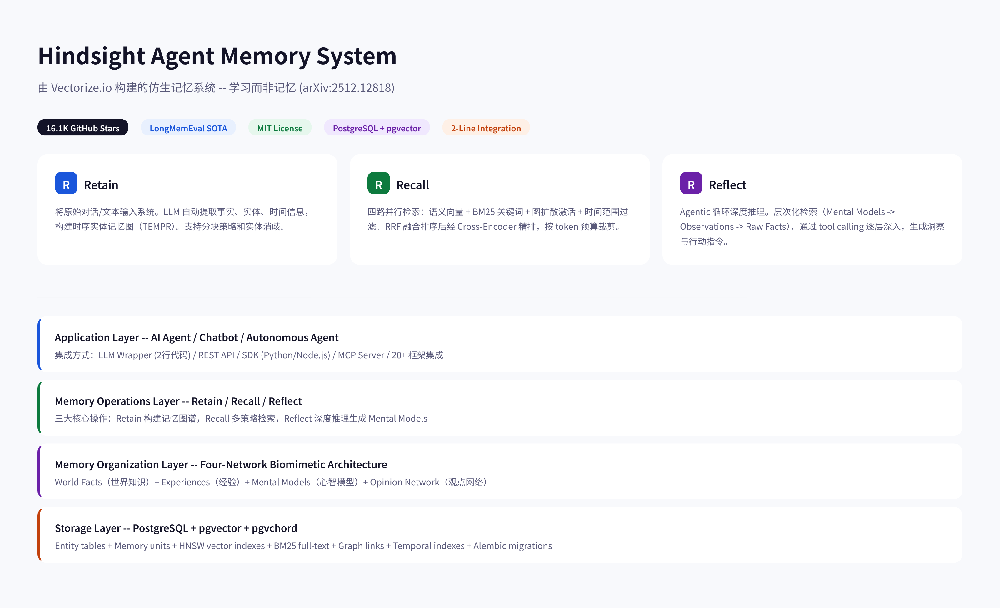
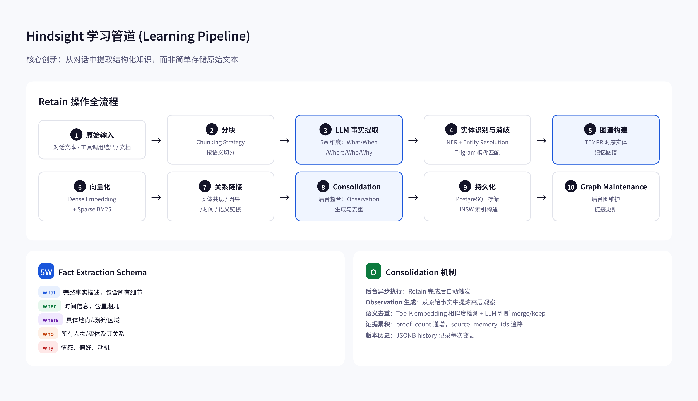
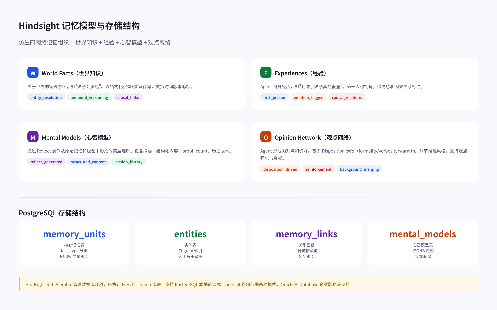
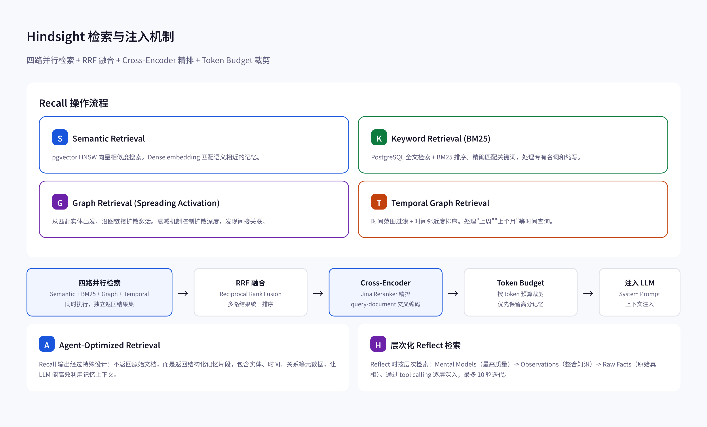
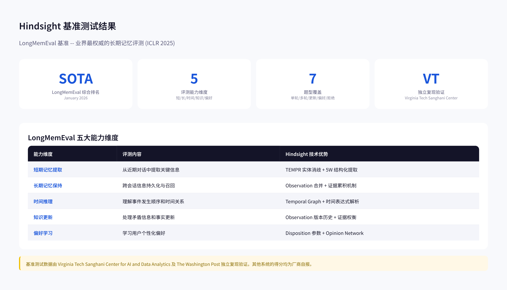
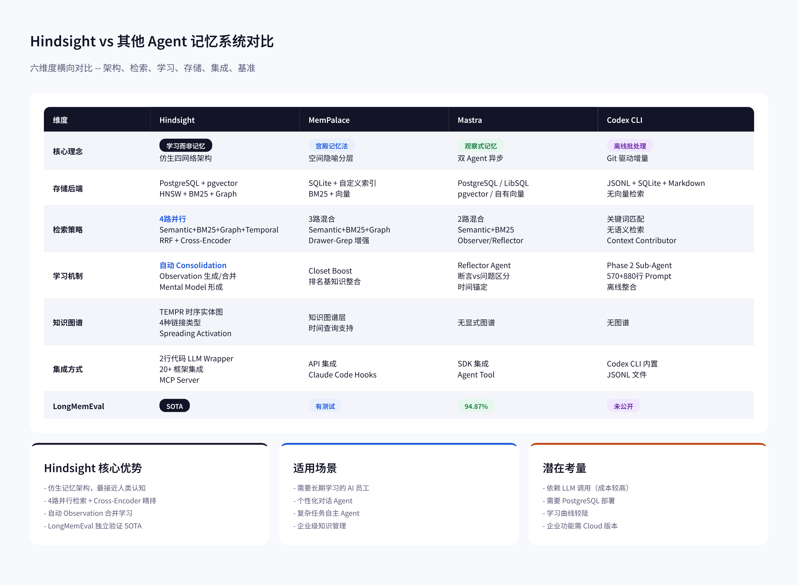

# Hindsight 记忆系统深度分析：仿生四网络架构、TEMPR 时序实体图与 LongMemEval SOTA 源码解析

> **版本基准**: GitHub `vectorize-io/hindsight` (2026-06-11, MIT License, 16.1K Stars)
> **论文**: arXiv:2512.12818 "Hindsight is 20/20: Building Agent Memory that Retains, Recalls, and Reflects"
> **分析范围**: 核心引擎 (`hindsight-api-slim/hindsight_api/engine/`)、Retain 管线、Consolidation 机制、Reflect Agent、LLM Wrapper、PostgreSQL 存储层
> **报告日期**: 2026-06-11

---

## 目录

1. [Hindsight 概述](#1-hindsight-概述)
2. [核心理念："学习而非记忆"](#2-核心理念学习而非记忆)
3. [记忆架构](#3-记忆架构)
4. [学习管道](#4-学习管道)
5. [记忆模型与存储](#5-记忆模型与存储)
6. [检索与注入](#6-检索与注入)
7. [基准测试结果](#7-基准测试结果)
8. [与其他系统对比](#8-与其他系统对比)
9. [总结与启示](#9-总结与启示)

---

## 1. Hindsight 概述

Hindsight 是由 Vectorize.io 构建的 Agent 记忆系统，核心定位是"让 Agent 学习而非仅仅记住"。与传统将对话历史存入向量数据库的 RAG 方案不同，Hindsight 采用仿生数据结构组织记忆，模拟人类认知中的世界知识、个人经验、心智模型和观点网络四个层次。

论文标题 "Hindsight is 20/20" 取自英文谚语，意为"事后诸葛亮"——强调系统能够从过去经历中提取洞察，而非简单回放。系统提供三个核心操作：Retain（记忆写入）、Recall（记忆检索）、Reflect（深度反思），构成完整的记忆生命周期。

Hindsight 在 LongMemEval 基准测试中达到 SOTA 水平，该结果由 Virginia Tech Sanghani Center for AI and Data Analytics 及 The Washington Post 独立复现验证。系统已在多家 Fortune 500 企业生产环境部署。

技术栈方面，Hindsight 使用 Python 实现，存储层基于 PostgreSQL + pgvector（支持 HNSW 向量索引）+ pgvchord，通过 Alembic 管理 60+ 次 schema 迁移。支持 Docker 一键部署，也支持嵌入式 pg0 数据库模式。

集成方式上，Hindsight 声称可通过 2 行代码的 LLM Wrapper 快速接入现有 Agent，同时提供 Python/Node.js SDK、REST API、MCP Server 等多种接入方式，已集成 20+ 主流 Agent 框架包括 LangGraph、CrewAI、AutoGen、OpenAI Agents、Claude Agent SDK 等。

---

## 2. 核心理念："学习而非记忆"

Hindsight 论文的核心论点是：现有 Agent 记忆系统本质上是"回忆"（Recall），而非"学习"（Learn）。传统 RAG 方案将原始文本切块存入向量库，检索时返回相似文本片段——这相当于翻阅笔记本，而非形成理解。

Hindsight 的"学习"体现在三个层次：

**结构化知识提取**：Retain 操作不直接存储原始文本，而是通过 LLM 提取五维结构化事实（What/When/Where/Who/Why），构建时序实体记忆图（TEMPR）。这类似于人类阅读后记住"要点"而非逐字背诵。

**自动知识整合**：Consolidation 引擎在后台自动运行，将零散事实整合为高层 Observation（观察）。当新证据出现时，系统会更新已有 Observation 的 proof_count 和历史版本，而非创建重复条目。这类似于人类通过反复接触同一主题形成更深入的理解。

**心智模型形成**：Reflect 操作通过 Agentic 循环进行深度推理，从原始记忆和经验中提炼 Mental Model（心智模型）。这些模型是对世界的高层理解，可以指导 Agent 的后续行为。

与 RAG 的对比：RAG 是"检索-增强-生成"的单向管道，每次查询独立；Hindsight 是"输入-学习-检索-反思"的闭环，记忆会随时间演化。与知识图谱的对比：传统 KG 需要预定义 schema 和手动维护；Hindsight 的图谱通过 LLM 自动构建和更新，支持时间维度。

这种"学习"范式的关键优势是记忆质量随时间提升而非退化。随着更多对话输入，Observation 的证据累积使系统对世界的理解越来越准确，而非像 RAG 那样被越来越多的噪声淹没。

---

## 3. 记忆架构

Hindsight 的记忆架构灵感来自认知科学中的多重记忆系统理论，将 Agent 记忆组织为四个相互关联的网络：

**World Facts（世界知识）**：关于世界的客观事实，如"水在100摄氏度沸腾"。这些是 Agent 的基础知识，不依赖特定经历。在源码中以 `fact_type='world'` 存储于 `memory_units` 表。

**Experiences（经验）**：Agent 自身的经历，如"用户上次问天气时希望得到简洁回答"。带有第一人称视角和情感标签。以 `fact_type='experience'` 存储。

**Mental Models（心智模型）**：通过 Reflect 操作从原始记忆和经验中形成的高层理解。存储在 `mental_models` 表中，包含结构化内容（JSONB）、版本历史、source_memory_ids 追踪。Mental Model 与 Observation 的区别在于：Observation 是自底向上自动从原始事实生成的，Mental Model 是通过 Reflect 的 Agentic 循环自顶向下形成的。

**Opinion Network（观点网络）**：Agent 形成的观点和偏好，受 Disposition 参数（formality/verbosity/warmth 三个维度）调节。支持观点强化（reinforcement）和后台合并（background merging）。

物理存储层基于 PostgreSQL，核心表包括：`memory_units`（记忆单元，含 HNSW 向量索引）、`entities`（实体表，含 Trigram 模糊匹配索引）、`memory_links`（关系图谱，4种链接类型，GIN 索引）、`mental_models`（心智模型）、`chunks`（原始文本分块）、`documents`（文档元数据）。

记忆在写入时经历完整的提取管线：原始文本 -> 分块 -> LLM 事实提取 -> 实体识别与消歧 -> 向量化 -> 关系链接 -> 持久化。检索时采用四路并行策略（语义+BM25+图+时间），经 RRF 融合和 Cross-Encoder 精排后返回。

---

## 4. 学习管道

Hindsight 的学习管道是其核心创新，从源码角度可分为以下阶段：

**Retain 阶段**由 `engine/retain/orchestrator.py` 编排，依次调用：

分块（Chunking）：输入文本按语义切分为适配 LLM 上下文窗口的片段。`chunk_storage.py` 负责分块存储和去重（基于 content_hash）。

事实提取（Fact Extraction）：`fact_extraction.py` 是核心文件（2631行），使用 LLM 从每个分块中提取结构化事实。提取使用 Pydantic 模型强制输出格式，每个事实包含五维字段（what/when/where/who/why）和分类（world/experience/opinion）。系统还会推断时间信息——当 LLM 未提供 `occurred_start` 时，通过正则匹配"last night""yesterday"等相对时间表达式进行回退推断。

实体识别与消歧（Entity Resolution）：`entity_processing.py` 和 `entity_resolver.py` 处理实体提取和消歧。使用 PostgreSQL 的 pg_trgm 扩展进行大小写不敏感的模糊匹配，避免"Google"和"google"被识别为不同实体。实体链接通过 `link_creation.py` 创建，支持 4 种链接类型。

向量化（Embedding）：`embedding_processing.py` 和 `embedding_utils.py` 处理 Dense Embedding 生成和存储。使用 pgvector 的 HNSW 索引进行高效 ANN 搜索。

**Consolidation 阶段**是后台自动运行的学习引擎，由 `engine/consolidation/consolidator.py` 实现（2262行）。其核心机制是：

从新保留的原始事实中，通过 LLM 生成高层 Observation。当系统发现新事实与已有 Observation 相关时，判断是合并（merge）还是创建新条目。去重通过 Top-K embedding 相似度检测 + LLM 判断实现。每个 Observation 维护 proof_count（支持证据数量）和 source_memory_ids（来源记忆 UUID 数组），以及 JSONB 格式的 history 字段记录变更历史。

**Reflect 阶段**由 `engine/reflect/agent.py` 实现（1332行），采用 Agentic 循环设计。Agent 配备三个工具：search_mental_models（搜索已有心智模型，最高质量）、search_observations（搜索整合知识）、recall（搜索原始事实作为 ground truth）。Agent 通过 tool calling 逐层深入检索，最多 10 轮迭代，最终生成新的 Mental Model 或直接回答查询。

---

## 5. 记忆模型与存储

Hindsight 的物理存储完全基于 PostgreSQL，不依赖外部向量数据库。这种设计选择的优势是事务一致性（ACID）和运维简化。

**memory_units 表**是核心存储，每条记录代表一个提取的事实或 Observation。关键字段包括：content（事实文本）、fact_type（world/experience/observation）、embedding（Dense 向量，pgvector HNSW 索引）、occurred_start/occurred_end（时间范围）、event_date（事件日期，用于时间过滤）、proof_count（Observation 的证据计数）、source_memory_ids（来源记忆 ID 数组，GIN 索引）、history（JSONB 变更历史）、text_signals（BM25 全文检索信号）。

**entities 表**存储所有识别的实体，使用 pg_trgm 扩展的 Trigram 索引实现大小写不敏感的模糊匹配。实体之间的关系通过 **memory_links 表**建模，支持 4 种链接类型：实体共现（co-occurrence）、因果关系（causal）、时间邻近（temporal）、语义相似（semantic）。

**mental_models 表**存储通过 Reflect 生成的心智模型，包含 summary（摘要）、structured_content（JSONB 结构化内容）、max_tokens（token 限制）、source_memory_ids（来源记忆追踪）。支持版本追踪，每次 Reflect 更新都会记录历史。

**chunks 表**存储原始文本分块，与 memory_units 通过外键关联。documents 表存储文档级元数据，支持文件解析（LLaMA Parse、MarkItDown 等）。

数据库迁移通过 Alembic 管理，已执行 60+ 次 schema 演进，包括添加 GIN 索引、per-bank HNSW 索引、Trigram 索引、JSONB 历史字段等。支持 PostgreSQL 本地嵌入式模式（pg0，无需单独部署数据库）和外部 PostgreSQL 部署，企业版还支持 Oracle AI Database。

---

## 6. 检索与注入

Hindsight 的检索设计是其另一核心创新，采用四路并行检索 + 多阶段精排的架构。

**四路并行检索**同时执行：

语义检索（Semantic Retrieval）：使用 pgvector 的 HNSW 索引进行向量相似度搜索，匹配语义相近的记忆。这是处理同义词和隐含语义的主要手段。

关键词检索（BM25）：使用 PostgreSQL 的全文检索功能 + BM25 排序算法。处理专有名词、缩写、代码标识符等精确匹配场景。BM25 语言可通过配置切换。

图检索（Spreading Activation）：从匹配的实体节点出发，沿 memory_links 图链接进行扩散激活。使用衰减机制控制扩散深度，能够发现间接关联的记忆。例如查询"Alice 的工作"可能通过"Alice -> Google -> Mountain View"链接链找到相关信息。

时间图检索（Temporal Graph）：处理时间范围查询，如"上周发生了什么"。利用 occurred_start/occurred_end 和 event_date 字段进行时间过滤和邻近度排序。

**RRF 融合**：四路检索结果通过 Reciprocal Rank Fusion 算法统一排序。RRF 的公式为 score = 1/(k+rank)，其中 k 为常数（通常60）。这种方法不需要归一化不同检索策略的分数，天然适合多路融合。

**Cross-Encoder 精排**：RRF 融合后的候选集通过 Cross-Encoder 模型（使用 Jina Reranker）进行精排。Cross-Encoder 将 query 和 document 拼接后编码，能捕获更细粒度的语义匹配关系，但计算成本较高，因此只对 RRF 候选集进行而非全库。

**Token Budget 裁剪**：精排后的结果按 token 预算裁剪，优先保留高分记忆。预算可通过配置调整，默认值在 `config.py` 中定义。

**Agent-Optimized 输出**：Recall 的最终输出经过特殊设计，不返回原始文档，而是返回结构化记忆片段，包含实体、时间、关系等元数据，让 LLM 能高效利用记忆上下文。

**Reflect 的层次化检索**：Reflect 操作采用不同的检索策略——先搜索 Mental Models（最高质量整合知识），再搜索 Observations（自动整合知识），最后通过 Recall 获取原始事实作为 ground truth。这种层次化设计确保 Agent 首先利用已有的高层理解，仅在需要时深入原始数据。

---

## 7. 基准测试结果

Hindsight 在 LongMemEval 基准测试中达到 SOTA 水平。LongMemEval 是 ICLR 2025 发布的长期记忆评测基准，被广泛认为是评估 Agent 记忆系统最权威的测试。

LongMemEval 评测五大能力维度：

**短期记忆提取**：从近期对话中提取关键信息。Hindsight 的 TEMPR 实体消歧和 5W 结构化提取机制在此维度表现优异，因为提取的事实已经过 LLM 结构化处理，而非原始文本。

**长期记忆保持**：跨会话信息持久化与召回。Hindsight 的 Observation 合并机制确保信息不会随时间退化——proof_count 累积使高频出现的事实获得更高权重。

**时间推理**：理解事件发生顺序和时间关系。Hindsight 的 Temporal Graph 和时间表达式解析（如"last night" -> -1天偏移）是专门为此设计的。

**知识更新**：处理矛盾信息和事实更新。Observation 的版本历史和证据权衡机制使系统能够识别和处理过时信息。

**偏好学习**：学习用户个性化偏好。Disposition 参数（formality/verbosity/warmth）和 Opinion Network 提供了结构化的偏好建模能力。

基准测试数据由 Virginia Tech Sanghani Center for AI and Data Analytics 及 The Washington Post 独立复现验证，这在 Agent 记忆系统领域是罕见的第三方验证。其他系统的得分均为厂商自报。

Hindsight 还在 LoCoMo 基准上进行了测试，并提供了 OBS（Observation）和 Consolidation 的内部基准测试工具（`benchmarks/` 目录），用于持续监控系统性能。

---

## 8. 与其他系统对比

与 MemPalace 对比：MemPalace 采用"宫殿记忆法"空间隐喻，将记忆组织为 Wing/Room/Drawer/Closet 分层结构。检索使用 3 路混合（Semantic+BM25+Graph）加 Drawer-Grep 增强。Hindsight 的 TEMPR 图谱更灵活，支持 4 种链接类型和 Spreading Activation，且 Consolidation 机制提供了自动知识整合能力。

与 Mastra 对比：Mastra 采用 Observer/Reflector 双 Agent 异步架构，Observer 实时提取断言和问题，Reflector 定期整合。检索使用 2 路混合（Semantic+BM25）。Hindsight 的优势在于 4 路并行检索和 Cross-Encoder 精排，以及自动 Consolidation 机制。

与 Codex CLI 对比：Codex CLI 采用离线批处理方式，Phase 1 并发 8 路提取（570行 prompt），Phase 2 Sub-Agent 整合（880行 prompt）。存储使用 JSONL + SQLite + Markdown，无向量检索。Hindsight 的优势是实时学习和语义检索能力。

集成便捷性方面，Hindsight 的 2 行代码 LLM Wrapper 是最大亮点——只需替换现有 LLM 客户端即可自动获得记忆能力。MemPalace 和 Mastra 需要更多集成工作，Codex CLI 仅限 Codex 生态。

从架构复杂度看，Hindsight 是最复杂的系统（memory_engine.py 12301行，fact_extraction.py 2631行，consolidator.py 2262行），但也提供了最完整的功能。Mastra 次之（双 Agent 架构），MemPalace 和 Codex CLI 相对简单。

---

## 9. 总结与启示

Hindsight 的核心贡献是提出了"学习而非记忆"的 Agent 记忆范式，并通过 TEMPR 时序实体图谱、四路并行检索、Consolidation 自动整合、Reflect Agentic 反思四个技术创新实现了这一理念。

TEMPR 图谱将记忆从扁平的向量空间提升为结构化的时序实体网络，支持实体消歧、因果链接、时间推理等高级能力。四路并行检索 + RRF + Cross-Encoder 的多阶段精排架构在检索精度上显著优于单一向量搜索。Consolidation 引擎的自动知识整合使记忆质量随时间提升而非退化。

从工程角度看，Hindsight 的全 PostgreSQL 架构（pgvector + pg_trgm + BM25）避免了引入外部向量数据库的复杂性，事务一致性也更好。Alembic 的 60+ 次迁移记录展示了活跃的 schema 演进。20+ 框架集成体现了良好的生态设计。

潜在局限包括：对 LLM 调用的强依赖（每次 Retain 都需要 LLM 提取事实，成本较高）；PostgreSQL 部署的运维门槛；Consolidation 的后台处理可能引入延迟；企业功能需要 Cloud 版本。

对 Agent 记忆系统设计的启示：记忆不应只是"存储+检索"，而应包含"提取+整合+反思"的完整学习循环；结构化知识提取（而非原始文本存储）是提升记忆质量的关键；时序信息和实体关系是构建高质量记忆图谱的基础；多路检索融合是提升召回率的有效手段。
