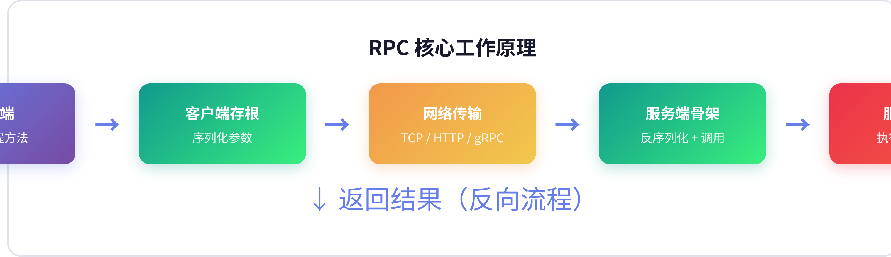
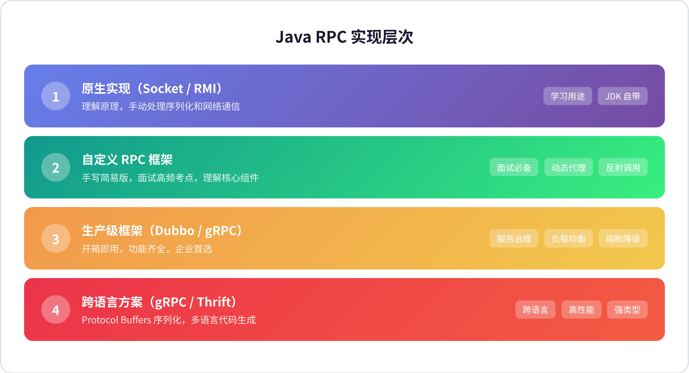
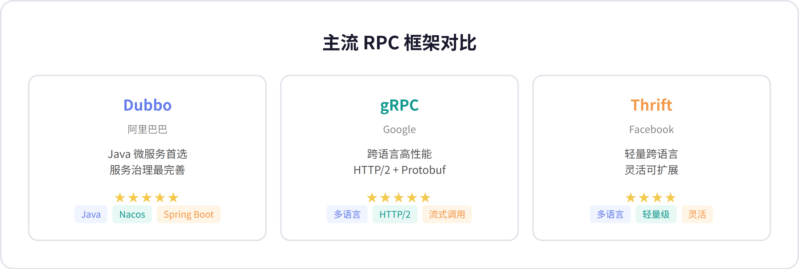

# Java RPC 技术调研报告

> RPC 让远程调用看起来像本地调用一样简单——Java 生态中有 Socket、RMI、Dubbo、gRPC 等多种实现方式。

---

## 目录

1. [什么是 RPC](#1-什么是-rpc)
2. [核心工作原理](#2-核心工作原理)
3. [Java 实现层次](#3-java-实现层次)
4. [原生实现：Socket 与 RMI](#4-原生实现socket-与-rmi)
5. [手写简易 RPC 框架](#5-手写简易-rpc-框架)
6. [生产级框架对比](#6-生产级框架对比)
7. [选型建议与总结](#7-选型建议与总结)

---

## 1. 什么是 RPC

### 定义

RPC（Remote Procedure Call，远程过程调用）是一种分布式计算技术，允许程序调用远程服务器上的函数，就像调用本地函数一样。开发者无需关心底层网络通信、序列化、错误处理等细节。

### 直观类比

想象你在家想吃火锅：

- **没有 RPC：** 你得自己出门 → 找餐厅 → 点菜 → 等待 → 取餐 → 回家
- **有 RPC：** 你打个电话说「来一份麻辣锅底」，服务员帮你搞定一切，你只管等上桌

### RPC vs REST API

| 维度 | RPC | REST API |
|------|-----|----------|
| **风格** | 动作导向（`getUser`, `createOrder`） | 资源导向（`GET /users/1`） |
| **性能** | 高（二进制协议如 Protobuf） | 较低（JSON 文本） |
| **易用性** | 需要客户端 SDK | 直接 HTTP 调用 |
| **典型协议** | gRPC, Dubbo, Thrift | HTTP/1.1 + JSON |
| **适用场景** | 内部微服务、高性能需求 | 外部 API、浏览器调用 |

---

## 2. 核心工作原理

### 四步流程

RPC 的核心原理可以分为四个步骤：

| 步骤 | 组件 | 作用 | 关键技术 |
|------|------|------|---------|
| ① | 客户端 | 发起方法调用 | 动态代理 |
| ② | 客户端存根 | 序列化参数、发送请求 | JSON/Protobuf |
| ③ | 网络传输 | 跨网络传输数据 | TCP/HTTP/gRPC |
| ④ | 服务端骨架 | 反序列化、反射调用 | 反射机制 |

### 核心设计洞察

RPC 框架的核心设计思想是**透明代理**——客户端调用的是接口，但实际执行发生在远程服务器。这通过 Java 的动态代理（`java.lang.reflect.Proxy`）实现：客户端持有的是一个代理对象，它拦截方法调用并转换为网络请求。

序列化是另一个关键环节。文本协议（JSON）人类可读但性能较低；二进制协议（Protobuf、Hessian）性能更高但调试困难。生产环境通常选择二进制协议以获得更好的吞吐量。

---

## 3. Java 实现层次

### 四个层次

| 层次 | 方案 | 特点 | 适用场景 |
|------|------|------|---------|
| 第1层 | Socket / RMI | 手动处理一切，JDK 自带 | 学习原理 |
| 第2层 | 自定义 RPC 框架 | 手写动态代理 + 反射调用 | 面试高频 |
| 第3层 | Dubbo / Motan | 服务治理完善，开箱即用 | 生产环境 |
| 第4层 | gRPC / Thrift | 跨语言，Protobuf 序列化 | 多语言架构 |

### 学习路径建议

初学者应该从第1层开始，理解 Socket 通信和 RMI 的局限性，然后手写一个简易 RPC 框架（第2层），掌握动态代理和反射调用的核心原理。最后直接学习 Dubbo 或 gRPC 等生产级框架，理解服务治理、负载均衡、熔断降级等高级特性。

---

## 4. 原生实现：Socket 与 RMI

### Socket 实现

最原始的 RPC 实现方式，手动处理序列化、网络传输和异常处理。客户端和服务端通过 `ObjectInputStream` / `ObjectOutputStream` 交换 Java 对象。

**优点：** 代码简单，易于理解原理。

**缺点：** 手动处理序列化、网络异常、连接管理，代码冗长且容易出错。

### RMI（Java 远程方法调用）

Java 自带的 RPC 方案，基于接口代理。需要定义继承 `Remote` 的接口，实现类继承 `UnicastRemoteObject`，通过 `LocateRegistry` 注册和发现服务。

**核心限制：**

| 限制 | 说明 |
|------|------|
| 仅支持 Java | 无法与其他语言互操作 |
| 性能较差 | Java 原生序列化效率低 |
| 无服务治理 | 不支持负载均衡、熔断等 |
| 粘性连接 | 客户端与服务端直接绑定 |

---

## 5. 手写简易 RPC 框架

### 核心组件

一个迷你 RPC 框架包含三个核心组件：

| 组件 | 职责 | 关键技术 |
|------|------|---------|
| 客户端代理 | 拦截方法调用，转换为网络请求 | `java.lang.reflect.Proxy` |
| 服务端处理器 | 接收请求，反射调用目标方法 | 反射 + Netty |
| 服务注册中心 | 管理服务地址映射 | ZooKeeper / Nacos |

### 关键实现要点

**动态代理：** 客户端使用 `Proxy.newProxyInstance()` 创建接口的代理对象。当调用接口方法时，`InvocationHandler.invoke()` 被触发，将方法名、参数类型、参数值封装为请求对象发送到服务端。

**反射调用：** 服务端接收到请求后，通过 `Class.forName()` 加载服务实现类，使用 `Method.invoke()` 执行目标方法，将返回值序列化后发回客户端。

**序列化选择：** 简单场景用 JSON（Jackson），高性能场景用 Protobuf 或 Hessian。

---

## 6. 生产级框架对比

### 详细对比

| 维度 | Dubbo | gRPC | Thrift | Motan |
|------|-------|------|--------|-------|
| **出品方** | 阿里巴巴 | Google | Facebook | 新浪微博 |
| **协议** | TCP + Hessian2 | HTTP/2 + Protobuf | 自定义 TCP | TCP + Hessian2 |
| **语言支持** | Java 为主 | 多语言 | 多语言 | Java 为主 |
| **服务治理** | 完整（负载均衡、熔断、降级） | 需扩展 | 基础 | 较完整 |
| **注册中心** | Nacos / ZooKeeper / Consul | 无内置 | 无内置 | ZooKeeper |
| **学习曲线** | 中等 | 中等 | 较低 | 低 |
| **社区活跃度** | ★★★★★ | ★★★★★ | ★★★★ | ★★★ |

### Dubbo 核心优势

Dubbo 是 Java 微服务的首选 RPC 框架，主要优势：

- **完整的服务治理：** 内置负载均衡（随机、轮询、最少活跃调用）、集群容错（失败自动切换、快速失败）、服务降级
- **多协议支持：** Dubbo 协议、REST、gRPC、HTTP 等
- **与 Spring Boot 深度集成：** 注解驱动，开箱即用
- **监控完善：** 内置 Admin 控制台，实时查看调用链路

### gRPC 核心优势

gRPC 是跨语言高性能 RPC 的首选：

- **Protocol Buffers：** 二进制序列化，体积小、速度快
- **HTTP/2：** 多路复用、头部压缩、服务端推送
- **流式调用：** 支持单向流、双向流，适合实时通信
- **代码生成：** `.proto` 文件自动生成多语言客户端

---

## 7. 选型建议与总结

### 选型决策树

| 场景 | 推荐方案 | 理由 |
|------|---------|------|
| 纯 Java 微服务 | **Dubbo** | 生态成熟，中文文档全，服务治理完善 |
| 跨语言调用 | **gRPC** | Go/Python/C++ 都支持，高性能 |
| 学习原理 | 手写简易 RPC | 理解动态代理、反射、序列化 |
| 老系统维护 | RMI | 但建议尽快迁移到 Dubbo |
| 轻量级需求 | Motan | 学习成本低，快速上手 |

### 核心结论

1. **RPC 的本质是代理模式**——客户端代理拦截调用，转换为网络请求，服务端骨架接收并反射执行
2. **Java 生态中 Dubbo 是事实标准**——阿里巴巴背书，社区活跃，功能最完善
3. **跨语言场景首选 gRPC**——Google 出品，Protobuf + HTTP/2，性能优异
4. **理解原理比记忆 API 更重要**——手写一个简易 RPC 框架是最好的学习方式

### 技术选型建议

对于新项目，建议优先考虑 Dubbo 3.x（Triple 协议兼容 gRPC），既能享受 Dubbo 的服务治理能力，又能与 gRPC 生态互通。如果团队有跨语言需求，直接选择 gRPC + Nacos 作为注册中心。

---

*报告基于 Java RPC 技术生态调研，涵盖原生实现到生产级框架的完整技术栈。*

*生成日期：2026-06-22*
