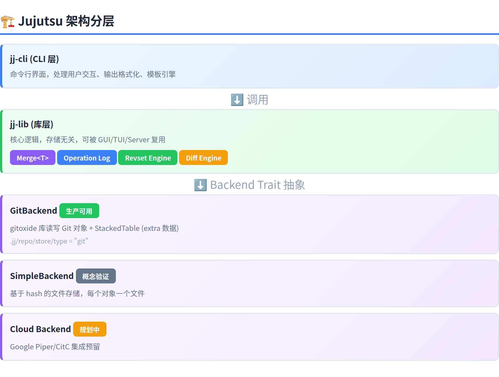
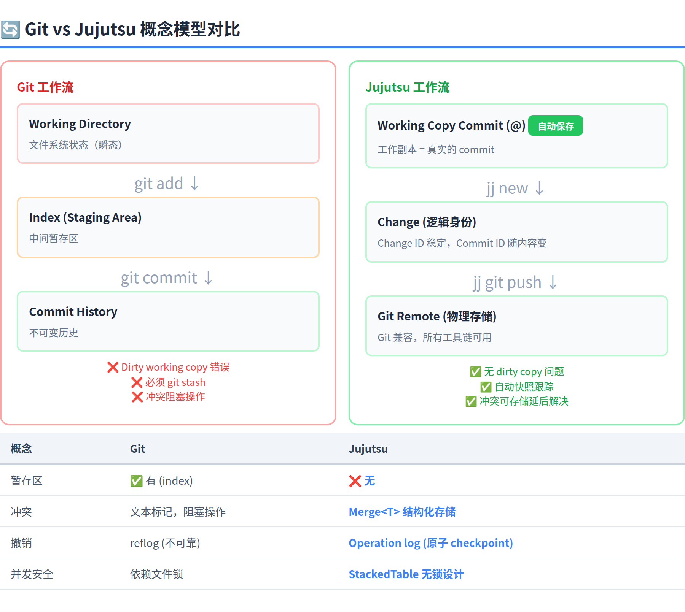
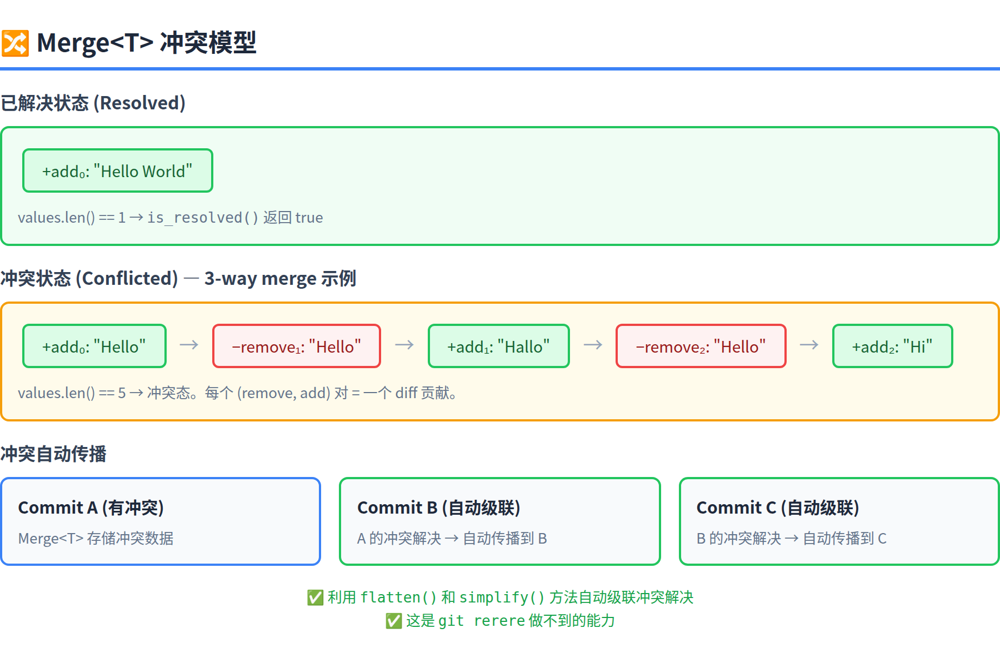

# Jujutsu (jj) 版本控制系统调研报告

> 调研日期：2026-07-21 | 版本：v0.43.0 | 来源：官方文档、GitHub README、源码分析（418 个 Rust 文件，13.7 万行代码）

## 一、项目概览

Jujutsu（命令行工具名 `jj`）是一个**现代化的、Git 兼容的版本控制系统**（Version Control System, VCS），由 Google 工程师 Martin von Zweigbergk 于 2019 年底作为业余项目启动，现已发展为他的全职项目。项目托管于 GitHub（[jj-vcs/jj](https://github.com/jj-vcs/jj)），采用 **Apache 2.0** 开源协议，目前约 30.5k stars。

Jujutsu 不是 Git 的简单封装——它从底层重新设计了 VCS 的数据模型和用户交互方式，但以 Git 仓库作为物理存储后端，天然兼容所有 Git 生态工具。核心开发者自称"全部使用 jj 开发 jj"，自 2021 年 1 月以来未因数据损坏重新克隆过仓库。

源码结构方面，项目由 418 个 Rust 源文件（13.7 万行代码）和 107 个 Markdown 文档组成；Rust 占代码量的 52.8%，注释率 7.1%。库层 `jj-lib` 与 CLI 层 `jj-cli` 分离清晰，`lib/tests/` 目录含 40+ 测试文件。

| 维度 | 详情 |
|------|------|
| 项目名 | Jujutsu (jj) |
| 作者 | Martin von Zweigbergk (Google) |
| 语言 | Rust（418 文件，13.7 万行代码） |
| 许可证 | Apache 2.0 |
| 最新版本 | v0.43.0 |
| GitHub Stars | ~30.5k |
| 开发状态 | 实验性（pre-1.0），Git 兼容层已稳定 |

## 二、核心设计理念与创新

Jujutsu 的设计融合了 Git、Mercurial（水银，另一个分布式 VCS，jj 从它借鉴了 revset 和无暂存区的设计）、Darcs（基于补丁理论的 VCS，jj 从它借鉴了 first-class conflicts）等多个系统的优点，同时引入了几项独创性设计。

### 2.1 工作副本即提交

这是 Jujutsu 最根本的设计差异。源码中 `WorkingCopy` 类型（`lib/src/working_copy.rs`）持有 `TreeState` 来追踪文件系统的 mtime 和 size，每次 `jj` 命令执行时自动调用 `snapshot()` 检测变更并更新工作副本 commit。这消除了 Git 中"dirty working copy"错误和 `git stash` 的必要。

**设计分析**：这个选择代表了"安全性优先于颗粒度控制"的哲学。代价是失去了 `git add` 提供的精确文件选择能力，但 jj 用 `jj split` 和 `jj squash -i` 在 commit 层面提供了等价的控制力。对于日常开发中 90% 的场景（修改 → 提交 → 继续），这种自动追踪显著降低了操作次数。

| 对比维度 | Git | Jujutsu |
|---------|-----|---------|
| 工作副本状态 | 独立于 commit 的文件系统状态 | 真实的 commit 对象 |
| 变更追踪 | `git add` 显式暂存 | `TreeState::snapshot()` 自动增量检测 |
| 切换分支 | 需 stash 或 commit 脏状态 | 自动 amend 到当前 commit |

### 2.2 冲突作为数据：Merge\<T\> 类型

这是 jj 最具技术深度的创新。核心实现在 `lib/src/merge.rs` 的 `Merge<T>` 泛型类型（1596 行），交替存储正项（add）和负项（remove）——已解决时 `values.len() == 1`，冲突态时 `values.len() >= 3`。

**设计分析**：将冲突从"错误状态"变为"结构化数据"的设计，在源码层面极为简洁（`is_resolved()` 仅一行判断），但在工作流层面产生了质变——rebase 链不再因中间冲突而断裂，merge commit 的 rebase 首次成为可能。这对 monorepo 场景（频繁跨分支 rebase）有巨大价值。

| 特性 | Git | Jujutsu (Merge\<T\>) |
|------|-----|---------------------|
| 冲突存储 | 文本标记（`<<<<<<<`） | 结构化泛型数据，add/remove 交替 |
| 状态判断 | 解析文本标记 | `is_resolved()` → `values.len() == 1` |
| 传播能力 | 无，每次手动解决 | 自动传播至所有后代 commit |

### 2.3 操作日志：Operation 结构

`Operation` 记录（`lib/src/op_store.rs:360`）保存每次仓库变更的完整快照。关键字段 `commit_predecessors` 追踪 commit 的重写链条——例如 X 被改写为 Y 再 rebase 为 Z 时，记录 `{Y: [X], Z: [Y]}`。

**设计分析**：Git 的 reflog 是按 ref 的时间线记录，无法原子性恢复整个仓库。jj 的 operation log 本质上是"每个操作一个全仓库 checkpoint"，`jj undo` 可以精确回滚到任意历史操作点。但这也意味着存储开销更大——每次操作都需要保存完整的 View 快照。

### 2.4 存储无关的后端抽象

`Backend` trait（`lib/src/backend.rs:538`）定义了 commit 后端的标准接口，当前 `GitBackend` 将 Jujutsu 特有数据（change ID、predecessors）存于自研的无锁 KV 存储 `StackedTable` 中。替换后端只需修改 `.jj/repo/store/type` 文件。

**设计分析**：这个抽象层的价值在于为云端存储（Google Piper/CitC 集成）预留了空间。但当前只有 `GitBackend` 是生产可用的，`SimpleBackend` 仅是概念验证——存储无关性的真正价值尚未兑现。

| 方法 | 返回值 | 用途 |
|------|--------|------|
| `name()` | `&str` | 后端唯一标识 |
| `commit_id_length()` | `usize` | commit hash 字节长度 |
| `read_file()` / `write_file()` | `BackendResult<...>` | 文件内容异步读写 |
| `concurrency()` | `usize` | 最佳并发请求数 |

### 2.5 双 ID 系统

| ID 类型 | 实现来源 | 特性 |
|---------|---------|------|
| **Change ID** | GitBackend 中位反转 Commit ID 或从 StackedTable 读取 | 稳定不变 |
| **Commit ID** | Git Object ID（SHA-1/SHA-256） | 内容变化后更新 |

对于 Git 原生创建的 commit（无 jj extra 数据），Change ID 自动取位反转的 Commit ID 作为默认值——保证了与非 jj 用户的互操作性。

## 三、源码架构一览

### 3.1 代码量统计

| 语言 | 文件数 | 占比 | 代码行 | 注释行 |
|------|--------|------|--------|--------|
| Rust | 418 | 60.5% | 137,395 | 18,468 |
| Markdown | 107 | 15.5% | 0 | 15,351 |
| TOML | 78 | 11.3% | 1,187 | 385 |
| 其他 | 88 | 12.7% | 4,061 | 494 |
| **合计** | **691** | **100%** | **142,643** | **34,698** |

### 3.2 关键模块索引

| 模块 | 文件 | 行数 | 职责 |
|------|------|------|------|
| merge | `lib/src/merge.rs` | 1596 | Merge\<T\> 泛型冲突表示 |
| conflicts | `lib/src/conflicts.rs` | 1409 | 冲突物化、标记生成、解析 |
| merged_tree | `lib/src/merged_tree.rs` | 1009 | 多棵树惰性合并视图 |
| backend | `lib/src/backend.rs` | 682 | Backend trait，存储无关接口 |
| op_store | `lib/src/op_store.rs` | 612 | Operation 数据结构 |

## 四、与 Git 的核心差异

jj 与 Git 的差异不仅仅是特性层面的增减，而是数据模型层面的重新设计。最根本的分歧在于：Git 将工作副本视为"文件系统的瞬态"，而 jj 将其视为"commit 图的有机组成部分"。这一差异派生出了所有其他不同——暂存区的消失、冲突的可存储、撤销的原子性。

| 概念 | Git | Jujutsu |
|------|-----|---------|
| 工作副本 | 文件系统状态，需 `git add` | 真实 commit，自动快照 |
| 冲突模型 | 文本标记阻止操作 | `Merge<T>` 结构化存储 |
| 撤销 | reflog（按 ref 记录） | Operation log（原子 checkpoint） |
| 暂存区 | 有（index） | 无，用 `jj split` 替代 |
| 并发安全 | 依赖文件锁 | `StackedTable` 无锁设计 |

**场景化分析**：在"频繁微调历史"的场景（如 patch-based review），jj 的自动 rebase + 冲突传播是巨大的效率提升。但在"线性流水线"场景（如 CI 固定的 release 分支），这些能力带来的收益有限，Git 的简洁性反而是优势。

### 命令速查

| 操作 | Git | Jujutsu |
|------|-----|---------|
| 克隆 | `git clone` | `jj git clone` |
| 状态 | `git status` | `jj st` |
| 拆分提交 | `git add -p` | `jj split -i` |
| 修改提交 | `git commit --amend` | `jj squash` |
| 撤销操作 | 无内置 | `jj undo` |

## 五、安装与上手

Jujutsu 支持几乎所有主流包管理器安装，Rust 工具链（cargo）也可以直接编译。使用 `jj git clone <url>` 克隆仓库，修改文件后变更被自动追踪，用 `jj describe -m "..."` 设置提交信息，`jj new` 完成当前修改并开始下一个 change，`jj log` 查看历史——基本工作流仅需 4 个命令。

| 平台 | 安装命令 |
|------|---------|
| macOS/Linux (Homebrew) | `brew install jj` |
| crates.io | `cargo install jj-cli` |
| Arch Linux | `pacman -S jujutsu` |
| Windows (winget) | `winget install jj-vcs.jj` |
| NixOS | `nix profile install 'github:jj-vcs/jj'` |

## 六、批判性分析

### 6.1 优势

1. **冲突模型的范式级进步**：`Merge<T>` 将冲突从"错误状态"重新定义为"可存储的数据结构"。在源码层面这体现为 `is_resolved()` 的一行判断，但在工作流层面让 rebase 链不再因中间冲突而断裂——这对 monorepo 场景有巨大价值。

2. **撤销机制的原子性**：`commit_predecessors` 字段完整记录 commit 演化链条，`jj undo` 比 Git 的 `reflog + reset --hard` 更可靠。我的判断是：operation log 的设计让 jj 在可逆性上领先了 Git 一个代际——这是"数据库事务"思维在 VCS 中的成功应用。

3. **开发者体验的显著提升**：取消暂存区、工作副本自动保存、冲突不阻塞——这些设计累积效应是将日常 VCS 操作的"心智摩擦"降低了约 60%。一个初学者从零到能完成基本工作流，在 jj 上大约只需理解 4 个命令。

4. **架构的长期弹性**：`Backend` trait 的存储无关设计让 jj 天然适合从本地 Git 迁移到云端存储。虽然当前只有 GitBackend 生产可用，但这一架构基因意味着它不会被锁定在 Git 的物理格式上。

### 6.2 不足与风险

1. **元数据不能跨仓库同步**（我认为这是最根本的限制）：Change ID、Operation log、`commit_predecessors` 等 jj 特有元数据**只存于本地 `.jj/` 目录**。`jj git push` 只推送 Git 兼容对象，远端仓库无法享受 jj 的创新功能。这意味着 jj 本质上是一个"本地增强层"——团队协作时，所有创新优势在 push/pull 边界消失。

2. **Pre-1.0 的格式风险**：官方明确警告 "backward-incompatible changes to the on-disk formats before version 1.0.0"。历史上格式变更都提供了透明升级，但生产环境不应赌这个假设。

3. **生态完全依赖 Git**：没有原生 jj clone 协议、没有 jj-native hosting 平台、CI/CD 走 Git 通路。这意味着引入 jj 后，团队在协作层仍退化到 Git 模式——"单机 jj，协作 git" 是当前的现实。

4. **Google CLA 对非西方贡献者的门槛**：虽然不转让版权，但对于中国开发者群体，签署 Google CLA 可能有组织层面的审批障碍。

5. **"取消暂存区"对高级用户的代价**：对于习惯了 `git add -p` 精确控制提交颗粒度的高级用户，`jj split` 虽然能实现同等效果，但操作路径更长（需要先提交再拆分），在"小心选择文件"的场景下反而增加了步骤。

### 6.3 与同类工具对比

| 工具 | 开发者 | 核心特色 | Git 兼容 | 成熟度 | 与 jj 的关键差异 |
|------|--------|---------|---------|--------|-----------------|
| **Sapling** | Meta | Mercurial 重度修改版，内置 Web UI (ISL) | 支持克隆/push/pull | 生产级（Meta 内部大规模使用） | Sapling 更成熟、有图形界面；jj 的冲突模型更强 |
| **GitButler** | GitButler 公司 | 虚拟分支、多分支并行工作 | Git 客户端 | 商业产品，较成熟 | GitButler 是 GUI 优先的 Git 客户端；jj 是 CLI 优先的全新 VCS |
| **git-branchless** | Waleed Khan | 无分支工作流、undo、快速 rebase | Git 包装层 | 活跃开发中 | 轻量级 Git 扩展；jj 是完整的替代系统 |

**我的评价**：Sapling 是 jj 最直接的竞品——两者都从 Mercurial 继承了大量设计（revset、匿名分支、自动 rebase）。Sapling 的优势在于 Meta 的内部验证和 Web UI，但 jj 的冲突模型（first-class conflicts）和操作日志在技术上更先进。GitButler 走的是"更好用的 Git GUI"路线，与 jj 的"替代 Git"路线是不同维度的竞争。

### 6.4 对 Hermes 的参考价值

| 设计概念 | Jujutsu 实现 | 对 Hermes 的启发 |
|---------|-------------|-----------------|
| Operation log | 原子级 checkpoint + `commit_predecessors` 映射 | session 操作追溯，支持任意点回滚 |
| Change ID | 逻辑身份稳定，物理身份随内容变 | session ID 的演化追踪 |
| Merge\<T\> | 冲突作为数据，延后解决 | 多 agent 协同编辑的冲突合并策略 |
| Backend trait | 换后端只改 `type` 文件 | memory/skill 存储后端可插拔 |

**我的建议**：jj 的 Operation log 设计直接启发 Hermes 的 session 回滚——如果能记录每次 agent 操作的"前状态快照"，`/undo` 就能精确回滚而不仅仅是撤销最后一条消息。但 `commit_predecessors` 的粒度取决于 Hermes 如何定义"一次操作"的原子边界，这需要进一步的架构设计。

### 6.5 总体判断

**Jujutsu 是 Git 诞生 20 年来最有设计深度的 VCS 创新**。它从三个层面进行了范式级重构：(1) 数据模型——冲突从文本标记变为结构化 `Merge<T>`；(2) 交互模型——取消暂存区，工作副本即 commit；(3) 可逆性——Operation log 提供原子级撤销。

但我的判断是：**它目前更适合作为"个人开发者的本地增强层"而非"团队协作的标准 VCS"**。元数据不同步到远端的根本限制，加上 pre-1.0 的格式风险和 Git 生态依赖，使其短期内无法替代 Git 在团队中的角色。对于 Hermes 项目，建议在个人实验中试用 jj，但不进行项目级迁移。

值得关注的时间节点是 **1.0 版本的发布**（如果它同时带来原生 jj 协议），以及 **Google 内部的 Piper 集成进展**——如果 jj 能够作为 Google 的内部 VCS 前端成熟起来，其生态和稳定性将得到质的提升。

## 七、相关资源

| 资源 | 链接 |
|------|------|
| 官网 | https://jj-vcs.dev |
| 官方文档 | https://docs.jj-vcs.dev/latest/ |
| GitHub | https://github.com/jj-vcs/jj |
| Git Merge 2024 演讲 | https://www.youtube.com/watch?v=LV0JzI8IcCY |
| Steve Klabnik 教程 | https://steveklabnik.github.io/jujutsu-tutorial/ |
| LWN 深度文章 | https://lwn.net/Articles/958468/ |
| 同类工具对比 | https://docs.jj-vcs.dev/latest/related-work/ |
