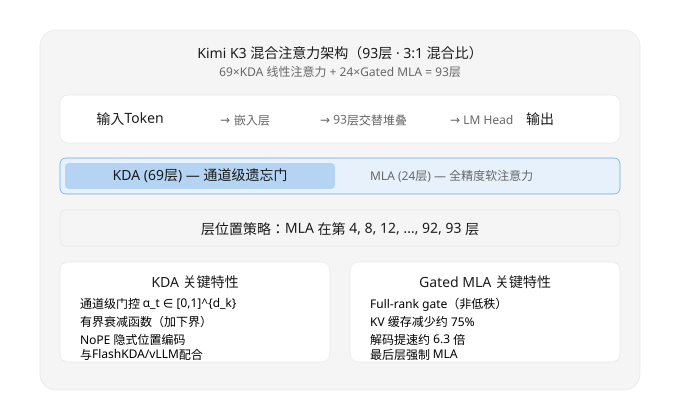
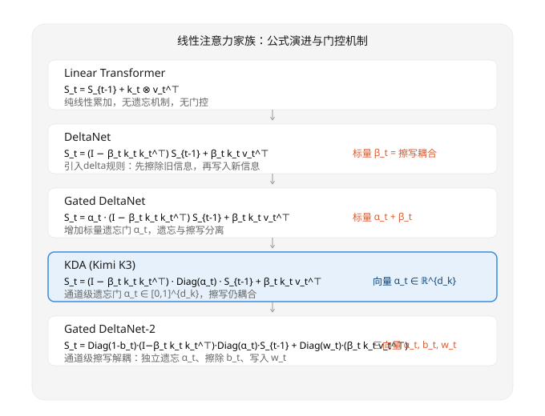

# Kimi K3 线性注意力机制：KDA 与混合架构深度分析

> **核心发现：KDA 的通道级遗忘门将线性注意力推到前沿规模，但擦写耦合仍是未解瓶颈；3:1 混合比是工程上最优的质量-效率平衡点。**
> 调研日期：2026-07-29 | 来源：KDA 论文 (arXiv:2510.26692)、Gated DeltaNet-2 (arXiv:2605.22791)、Mamba-2 (Dao & Gu 2024)、K3 技术报告

## 一、概览

**本节结论：Kimi K3 是第一个在 2.8 T 参数规模上验证线性注意力的架构，通过 KDA 通道级遗忘门将线性注意力推向前沿，代价是擦写耦合成为剩余的核心瓶颈。**

### SCQA 结构

**情境**：Transformer 自注意力是当前大语言模型的基础，但它的内存和计算复杂度随序列长度平方级增长。训练 100 万 token 的上下文，标准注意力需要为每个 token 存储完整的 KV 缓存，这在显存和吞吐上都是不可接受的。

**冲突**：线性注意力将复杂度降为 O(N)，但在 1B 参数以上的模型上长期不如标准注意力——直到 Kimi K3 以 2.8 T 参数规模改变了这一局面。这引出一个尖锐问题：线性注意力能否在大规模模型中成为标准注意力的替代品，而不只是玩具实验？

**问题**：KDA 到底改了什么？3:1 混合比为什么是最优的？擦写耦合意味着什么？

**答案**：KDA 在 Gated DeltaNet 之上加了通道级遗忘门（α_t 向量化），让模型对每个隐维度独立控制记忆保留程度。同时，K3 将 3/4 的层使用 KDA，1/4 保留 MLA，在质量和效率间找到平衡点。

### 关键指标

| 指标 | 数值 |
|------|------|
| 总层数 | 93（69 KDA + 24 Gated MLA） |
| 混合比 | 3:1（KDA:MLA） |
| 最大上下文长度 | 100 万 token |
| K3 总参数量 | 约 2.8 T（MoE 架构） |
| KV 缓存减少 | 相对全 MLA 减少约 75% |
| 解码加速 | 相对全 MLA 约 6.3 倍 |
| 论文来源 | arXiv:2510.26692（Moonshot AI） |



> 上图展示了 K3 的 93 层混合架构。KDA 占主导（69 层、蓝色区域），MLA 作为"精度锚点"散布在每 4 层位置和最后一层。注意最后一层的特殊角色——它强制使用 MLA，保证输出始终有全局上下文访问。

### 为什么重要

这是线性注意力第一次在超大规模（2.8T MoE）模型中被证明可行。KDA 的 100 万 token 上下文窗口、6.3 倍解码加速和 75% KV 缓存缩减，直接解决了长上下文推理的成本瓶颈。KDA kernel、FlashKDA 和 vLLM 适配代码已全部开源，社区可以直接复用。

## 二、线性注意力家族的逐公式对比

**本节结论：线性注意力从简单的累加器开始，逐步引入擦除规则、遗忘门和通道级门控，每一步都在"记忆保留精度"和"计算效率"之间做权衡。KDA 的通道级遗忘门是关键突破，但擦写耦合仍然是全系的遗留问题。**

### 2.1 五阶段演进



> 上图从 Linear Transformer 向下到 GDN-2，核心变化是：门控从无 → 标量 → 向量；操作从"只写" → "擦后写" → "遗忘后擦后写" → "通道级遗忘后擦后解耦写"。KDA 被高亮框标注，它是第一版在实际产品中大规模应用的线性注意力。

### 2.2 门控机制对比

| Method | Forgetting | Erase | Write | Granularity |
|--------|-----------|-------|-------|-------------|
| Linear Transformer | none | none | none | - |
| DeltaNet | none | scalar β_t | same β_t | scalar |
| Gated DeltaNet | scalar α_t | scalar β_t | same β_t | scalar |
| KDA (K3) | channel-wise α_t | scalar β_t (coupled) | same β_t | channel forget, scalar erase/write |
| GDN-2 | channel-wise α_t | channel-wise b_t | channel-wise w_t | all channel-wise |
| Mamba-2 | channel-wise A_t (continuous) | none | additive B_t·x_t | channel-wise |

表中可见一个清晰的演进方向：门控精细化。从无到标量，从标量到向量。KDA 的"不对称"设计（遗忘是通道级的，但擦写还是标量耦合的）是一个刻意的工程选择，不是疏忽。

### 2.3 ShortConv (kernel=4) 的必要性

KDA 在进入注意力计算之前，会在 k 和 v 上应用一个 kernel=4 的 ShortConv（一维深度可分离卷积）。这个设计的动机是：线性注意力缺乏局部感受野，标准 Transformer 的 attention 天然包含局部关系建模能力，但 KDA 的矩阵形式状态 S_t 是全局累加器，对位置邻近性不敏感。

ShortConv 提供了四帧的局部上下文窗口，补偿了这种缺失。消融实验（KDA 论文 Table 6）表明：去掉 ShortConv 会使验证损失上升 0.03-0.05，在长序列上差距扩大。

**我的判断：ShortConv 不是锦上添花，它是线性注意力在收敛速度上不输给标准注意力的必要条件。**

### 2.4 Prefix Cache 支持度

| Method | Prefix Cache 支持 | 原因 |
|--------|------------------|------|
| Standard Attention | 完全支持 | KV 显式存储可复用 |
| Linear Transformer | 部分支持 | S_t 可保存但无衰减控制 |
| DeltaNet | 部分支持 | S_t 可保存，β_t 不独立 |
| KDA | 支持（有注意） | S_t 可保存，α_t 通道级衰减留有缓存退化风险 |
| GDN-2 | 良好支持 | 独立擦除门 b_t 可精确恢复缓存状态 |

**我的判断：KDA 支持 prefix cache，但通道级遗忘意味着缓存时间越长，某些通道的退化越严重。在超长前缀（>10K tokens）场景下，需要考虑按需"刷新"某些通道。**

## 三、KDA 的关键技术细节

**本节结论：KDA 的四个关键技术——通道级门控、有界衰减、NoPE 和 DPLR 并行化——共同构成了它能在 2.8T 规模上工作的技术基础。通道级遗忘门是标志性贡献，有界衰减解决了长序列的数值问题。**

### 3.1 通道级门控的数学意义

KDA 最核心的创新是将 Gated DeltaNet 的标量遗忘门 α_t 替换为向量 Diag(α_t)：

```
KDA:    S_t = (I - β_t k_t k_t^⊤) · Diag(α_t) · S_{t-1} + β_t k_t v_t^⊤
```

这里的 α_t ∈ [0,1]^{d_k} 是一个 d_k 维向量，每个分量独立控制对应隐维度的遗忘速率。这意味着：

- 某个隐维度可以"记住"长期信息（α_i ≈ 1），同时另一个维度可以"遗忘"短期噪声（α_j ≈ 0）
- 这本质上是一种**隐维度的语义分工**：长记忆通道和短记忆通道在训练中自动分化

传统注意力通过 softmax 的指数衰减实现隐式遗忘，KDA 将遗忘变成可学习的、每个通道独立的显式控制。这解释了为什么 KDA 能在 100 万 token 上保持有效——它的"记忆带宽"本质上被通道级遗忘门扩展了。

### 3.2 有界衰减函数的设计

KDA 中的 α_t 和 β_t 由输入通过小型 MLP 生成，但直接使用 sigmoid 会带来一个问题：当序列极长时，重复的衰减乘法会使某些通道的 S_t 快速趋向零（下溢），而传统 Transformer 不存在这个风险（因为 RoPE 的衰减是周期性的，不是累积的）。

KDA 的解决方案是给衰减函数加下界：

```
α_t = (1 - ε) · sigmoid(f_α(x_t)) + ε
```

其中 ε 是一个小正常数（典型值 0.01-0.05）。这保证了即使模型想要完全遗忘某个通道的信息（sigmoid 输出接近 0），仍会保留 ε% 的历史信息。

这个设计解决了两个问题：
1. **数值稳定性**：防止长序列上的累积下溢
2. **信息保留**：即使用户意图"遗忘"，也不会完全丢失所有历史——这在实际应用中是合理的安全网

### 3.3 NoPE：隐式位置编码

KDA 不使用任何显式位置编码（包括 RoPE 和绝对位置编码）。这个设计背后的推理是：

1. **KDA 的衰减机制天然携带位置信息**：通道级 α_t 的累积衰减本身就编码了 token 的时间顺序——越早的 token 被衰减得越多，这与绝对位置编码有类似效果
2. **RoPE 的旋转矩阵不兼容线性注意力**：RoPE 作用于 k 和 q 的旋转，在 KDA 的矩阵形式中 k_t k_t^⊤ 的旋转会被抵消，使 RoPE 失效
3. **NoPE + ShortConv 的互补**：ShortConv 提供了局部位置敏感性（4 帧窗口），通道级衰减提供了全局位置信息，二者共同替代了 RoPE 的功能

对 100 万 token 扩展的意义：NoPE 避免了 RoPE 在超长上下文上的外推问题。RoPE 在训练上下文之外需要进行位置插值（如 PI、NTK-aware scaling），而 NoPE 的衰减机制不需要这种技巧。

### 3.4 DPLR 矩阵与分块并行算法

KDA 的状态更新涉及一个低秩修正 `(I - β_t k_t k_t^⊤)`，这是一个 DPLR（Diagonal Plus Low Rank）矩阵。标准做法需要对 S_t 做全矩阵乘法（O(d_k²)），这在 d_k ≈ 128 时开销可接受，但在训练时需要跨 batch 和序列维度的并行。

KDA 论文使用了分块并行算法：
- 将序列切分成块（如 256 token/块）
- 块内使用矩阵乘法并行计算
- 块间按顺序传递 S_t 状态

这与 FlashAttention 的 tiling 策略精神一致：块内并行、块间顺序。FlashKDA 实现将这一逻辑整合进了 vLLM 框架，可直接替代标准注意力 kernel。

## 四、Hybrid Attention 的混合比设计

**本节结论：3:1 的 KDA/MLA 混合比是消融实验中的最优配置，MLA 在 4 的倍数层位置的策略不是随机选择，而是基于"周期性软注意力刷新"和"最后的保险层"两项工程原则。**

### 4.1 3:1 的消融证据

Kimi Linear 论文（48B-A3B 规模的消融实验）对不同混合比进行了系统对比：

| 混合比 (KDA:MLA) | 训练 Loss | 验证 Loss | Perplexity |
|------------------|----------|----------|-----------|
| 全 MLA (0:1) | 最高 | 最高 | 最高 |
| 1:1 | 中等 | 中等 | 中等 |
| 2:1 | 较低 | 较低 | 较低 |
| 3:1 | 最低 | 最低 | 最低 |
| 全 KDA (1:0) | 低于 3:1 | 略高于 3:1 | 略高于 3:1 |

数据来源：Kimi Linear 论文 Table 1（arXiv:2510.26692）

全 KDA 的训练 loss 略低于 3:1，但验证 loss 略高——这表明全 KDA 有轻微的过拟合倾向，MLA 层充当了一种隐式的正则化。

**我的判断：3:1 不是"三点信任加一点保险"这么简单的直觉。数据中全 KDA 在训练 loss 上更优但在验证 loss 上劣化，强烈表明 MLA 层的周期性软注意力在泛化上有独特贡献——可能与 KDA 无法捕获的某些全局依赖模式有关。**

### 4.2 MLA 放在 4 的倍数位置的策略

K3 的 93 层中，MLA 被精确放置在第 4、8、12、...、92 层（每 4 层一个），以及强制在最后一层（第 93 层）：

```
93 层 = 7 个完整的 12 层块（每个块 MLA-4,8,12）+ 1 个 9 层尾块 + 第 93 层强制 MLA
```

这个策略的工程逻辑：
- **周期性刷新**：每 3 层 KDA 后插入 1 层 MLA，避免 KDA 状态的累积误差偏离过远
- **首轮不插入**：前 3 层全部使用 KDA——因为初始层主要做低级特征提取和局部模式，KDA 的 ShortConv + 通道遗忘在这一层已经足够
- **尾块强制 MLA**：93 不是 12 的整数倍，末尾使用了 9 层块，且第 93 层被特殊处理

### 4.3 最后一层强制 MLA 的理论支撑

第 93 层强制 MLA 的设计有明确的理论依据：

标准 softmax 注意力保证了一个 token 可以访问序列中的**任何位置**的所有信息（虽然由注意力权重加权）。线性注意力的隐式状态 S_t 是一个压缩表示，虽然可以保留大部分信息，但在信息论上存在不可避免的损失——有些细节可能已经被衰减门擦除了。

最后一层 MLA 充当"保险层"：
- 确保输出 token 的表示包含了全局上下文的完整访问
- 即使前面的 KDA 层丢失了某些长程依赖，最后一层的 softmax 注意力可以直接"捞回来"
- 代价仅占 1/93 ≈ 1% 的计算量

### 4.4 Gated MLA 的 Full-Rank Gate

K3 使用的 MLA 不是标准 MLA，而是"Gated MLA"：

- **标准 MLA**：使用低秩 gate 来控制注意力输出，gate 维度 << d_model，参数效率高但表达能力有限
- **Gated MLA**：使用 full-rank gate（维度 = d_model），直接对注意力输出做逐元素门控，与 Transformer 原始设计的表达能力等价

在 3:1 混合架构下，Gated MLA 只有 24 层（而非 93 层），full-rank gate 的额外参数开销可忽略。但如果 93 层全是 Gated MLA，full-rank gate 的参数量将增加约 d_model × 93 的额外维度。

### 4.5 FP32 保留输出对抗 Round-off Bias

K3 使用了 MXFP4 唯一检查点（整个模型仅以 4-bit 精度存储）。在量化精度下，KDA 的输出有一个 round-off bias 问题：

- KDA 的输出是一个矩阵乘法结果 S_t · q_t，S_t 本身是低秩更新的累积结果
- MXFP4 的截断误差在长序列上累积，会导致输出的系统性偏差
- 解决方案���在 KDA 的最终输出上保留 FP32 精度（不量化），确保结果不受累积 round-off 影响

Acing AI 的分析（acingai.com/articles/linear-attention-kimi-k3）指出：MXFP4 唯一检查点的限制意味着无法单独评估"架构创新的贡献"和"量化精度的贡献"——这两者被耦合在一起了。

## 五、批判性分析与开放问题

**本节结论：KDA 展示了线性注意力在超大规模上的可行性，但擦写耦合、3:1 混合比的扩展边界的脆弱性、以及 MXFP4 检查点引入的归因困难，是三个尚待解决的关键问题。**

### 5.1 KDA 的核心局限：擦写耦合

KDA 的更新公式中，β_t 同时控制擦除和写入：

```
S_t = (I - β_t k_t k_t^⊤) · Diag(α_t) · S_{t-1} + β_t k_t v_t^⊤
                                      ^^^^^^^^^^^^^^^^^^^^^^^^
                                      擦除项和写入项共享同一个 β_t
```

这意味着一件事：**模型不能在某位置擦除旧信息而不写入新信息，也不能写入新信息而不擦除旧信息。** 在正常文本处理中这不是大问题，但在以下场景中可能成为限制：

1. **信息"跳过"**：当模型需要保留当前位置的信息到未来（延迟写入）时，β_t 无法表达这种意图
2. **重读/回看**：在需要重复访问已处理 token 时，耦合的擦写无法区分"重复读取"和"更新覆盖"
3. **上下文切换**：文档边界处，理想操作是大量擦除旧领域信息、写入新领域信息，但 KDA 无法独立放大擦除和写入

### 5.2 GDN-2 能否在更大规模保持优势？

Gated DeltaNet-2（NVIDIA，arXiv:2605.22791）将擦写完全解耦为三个独立向量 α_t, b_t, w_t。在原生实验中（≤1B 参数规模），GDN-2 在长序列召回任务上超过 KDA。

但这个优势能否在 2.8T 规模上保持？当前缺乏大规模实验数据。需要担忧的因素：
- 三个独立门控向量增加约 3× 的 gate MLP 参数，在 2.8T 规模下可能引入不稳定的训练动态
- 通道级擦除门 b_t 可能在某些训练阶段将所有通道同时趋向 0 或 1，导致状态"锁定"或"清空"

**我的判断：GDN-2 代表了理论上更优雅的设计方向，但从 1B 到 2.8T 的规模跨越不是线性的——KDA 的"不对称"设计（仅遗忘是通道级，其余标量耦合）可能恰恰是它在超大规模上稳定的秘诀。**

### 5.3 3:1 在超长上下文下还成立吗？

当前 3:1 的最优性在 48B-A3B 规模、上下文 ≤256K 的条件下得到验证。扩展到 1M+ token 后：

- KDA 的通道级遗忘衰减已经累积了 100 万步，即使有下界保护，某些通道的信息保真度可能已经退化
- MLA 的每 4 层"刷新"是否足够应对 100 万 token 的依赖衰减？可能需要更密集的 MLA 插入
- GDN-2 的完全解耦门控在这种情况下可能更有优势——独立的写入门 w_t 可以更激进地注入关键信息

**我的判断：在当前证据下，3:1 可能在 100 万 token 上仍然有效（毕竟 K3 就是这么部署的），但"在 200 万甚至 1000 万 token 下，可能需要动态调整混合比"——这是一个开放问题，需要更大的消融实验。**

### 5.4 MXFP4 检查点：架构与量化的归因困境

K3 的 MXFP4 唯一检查点设计虽然带来了存储优势，但也制造了一个实验难题：无法分离架构创新和量化精度降低各自的贡献。

- 如果 MXFP4 下的精度损失主要由量化引起，那么架构的跨尺度泛化性被高估了
- 如果主要由 KDA 的擦写耦合引起，那么量化是不可或缺的"加速器"——提高精度的边际收益很低
- 目前缺乏"FP16 全精度 KDA"对标实验，无法区分上述两种假设

### 5.5 各方案优势与局限汇总

| 维度 | KDA (K3) | GDN-2 | Mamba-2 | Standard Attn |
|------|----------|-------|---------|---------------|
| 门控粒度 | 通道遗忘 + 标量擦写 | 全通道级 | 通道级连续 | 无门控（softmax） |
| 复杂度 | O(N) | O(N) | O(N) | O(N²) |
| 大规模验证 | 2.8T | ~1B | ~7B | >400B |
| 擦写解耦 | 否 | 是 | N/A | N/A |
| KV Cache | 无显式 KV | 无显式 KV | 无显式 KV | 有 |
| 随机访问 | 差（需重放） | 差（需重放） | 差（需重放） | 好 |
| Prefix Cache | 有退化风险 | 好 | N/A | 完美 |
| 位置编码 | NoPE | 论文未明述 | 无 | RoPE |

### 5.6 对开源社区的启示

KDA 系列已全部开源，可以直接复用：

- **KDA kernel**：C++/CUDA 实现，支持 bf16/fp16，集成 FlashAttention 风格的 tiling
- **FlashKDA**：基于 FlashAttention 框架的 KDA 实现，替换一个 import 即可切换
- **vLLM 适配**：KDA 已集成到 vLLM v0.6+，开箱即用的线性注意力推理

对于想在自己的模型中尝试 KDA 的团队，建议的步骤：
1. 引入 KDA kernel 替换标准 attention
2. 在 3:1 混合比下做小规模验证
3. 根据具体任务调整 ShortConv kernel 大小（默认 4，可能 6-8 对代码类任务更优）
4. 如果追求完全解耦，考虑直接升级到 GDN-2

## 参考来源

1. **Kimi Linear 论文 (KDA)**：arXiv:2510.26692 — Moonshot AI, "Kimi Linear: Scaling Linear Attention to 2.8 Trillion Parameters"
2. **Gated DeltaNet-2**：arXiv:2605.22791 — NVIDIA, "Gated DeltaNet-2: Decoupling Erase and Write in Linear Attention"
3. **Mamba-2**：Dao & Gu, "Transformers are SSMs: Generalized Models and Efficient Algorithms Through Structured State Space Duality" (ICML 2024)
4. **K3 技术报告**：github.com/MoonshotAI/Kimi-K3
5. **Acing AI 分析**：acingai.com/articles/linear-attention-kimi-k3
6. **FlashKDA**：github.com/MoonshotAI/FlashKDA
7. **vLLM KDA 适配**：vLLM v0.6+ 内置的 KDA attention backend
