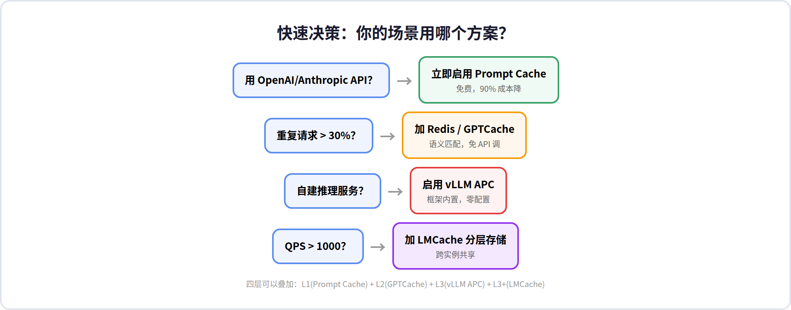
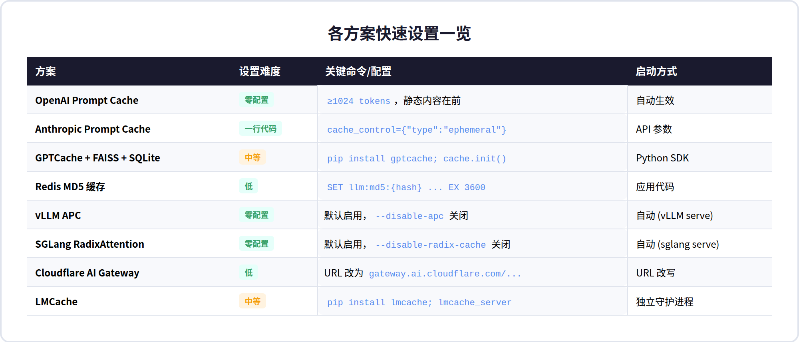
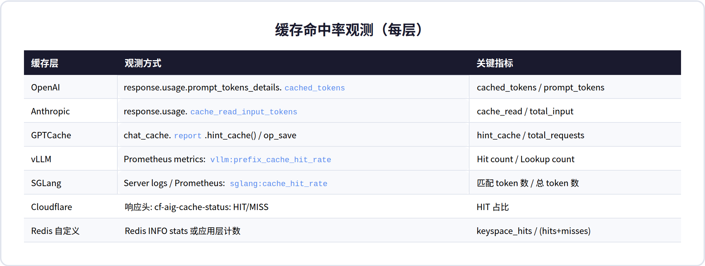

# AI 大模型缓存实战实现指南

> **本文解决的核心问题**：每个缓存方案具体怎么配？怎么接入？怎么验证命中？怎么观测效果？——不讨论原理，只讲操作。

---

## 目录

1. [快速选择：你的场景用什么？](#1-快速选择你的场景用什么)
2. [方案 A：OpenAI / Anthropic Prompt Cache（零成本起步）](#2-方案-aopenai--anthropic-prompt-cache零成本起步)
3. [方案 B：Redis 精确缓存（最简单可靠）](#3-方案-bredis-精确缓存最简单可靠)
4. [方案 C：GPTCache 语义缓存（相似问题命中）](#4-方案-cgptcache-语义缓存相似问题命中)
5. [方案 D：vLLM / SGLang KV Cache（推理加速）](#5-方案-dvllm--sglang-kv-cache推理加速)
6. [方案 E：Cloudflare AI Gateway（边缘透明代理）](#6-方案-ecloudflare-ai-gateway边缘透明代理)
7. [端到端召回流程](#7-端到端召回流程)
8. [命中率观测与调优](#8-命中率观测与调优)

---

## 1. 快速选择：你的场景用什么？



| 你的情况 | 推荐方案 | 接入时间 | 预期节省 |
|---------|---------|---------|---------|
| 调用 OpenAI/Anthropic API | Prompt Cache | 0 天 | 90% 输入成本 |
| 自建 vLLM/SGLang 推理 | APC / RadixAttention | 0 天 (默认启用) | TTFT 降低 50-80% |
| 有确定性重复请求 (temp=0) | Redis MD5 | 1 小时 | 100% API 调用 |
| 有语义相似的重复请求 | GPTCache | 1 天 | 70-90% API 调用 |
| 多模型/多供应商 | Cloudflare AI Gateway | 10 分钟 | 精确命中 100% |
| 高并发、多轮 Agent | LMCache | 1 天 | 吞吐提升 3-10× |

---

## 2. 方案 A：OpenAI / Anthropic Prompt Cache（零成本起步）

### 2.1 OpenAI：完全自动，零配置

OpenAI 的 Prompt Caching 对开发者透明——只要 prompt ≥ 1024 tokens，自动生效。

**唯一需要做的事：把静态内容放前面。**

❌ 不好的写法（动态内容混在最前面）：

```
messages = [
    {"role": "user", "content": user_question},       # 动态——每次不同
    {"role": "system", "content": long_system_prompt}, # 静态——但放后面了！
]
```

✅ 好的写法（静态内容在前，动态在后）：

```
messages = [
    {"role": "system", "content": long_system_prompt},  # 静态——放最前面
    {"role": "user", "content": user_question},          # 动态——放最后
]
```

**验证命中**：检查返回的 `usage` 字段：

```
# 响应中检查缓存命中情况
"usage": {
    "prompt_tokens": 2006,
    "prompt_tokens_details": {
        "cached_tokens": 1920    # ← 1920/2006 = 95.7% 命中！
    }
}
```

### 2.2 Anthropic：一行参数即可

Anthropic 支持自动缓存（推荐新手）和显式缓存（推荐精细控制）：

```python
# 自动缓存（最简单）
response = client.messages.create(
    model="claude-sonnet-4-5",
    max_tokens=1024,
    cache_control={"type": "ephemeral"},  # ← 就这一行
    system="You are an expert programmer...",
    messages=[{"role": "user", "content": "Write a sorting function"}]
)
# 验证命中
print(response.usage.cache_read_input_tokens)  # > 0 表示命中
```

**显式断点（精细控制）**：在需要缓存的末尾块加 `cache_control`：

```python
messages = [
    {
        "role": "user",
        "content": [
            {"type": "text", "text": "long book content here..."},
            {"type": "text", "text": "Question: summarize this book"},
            {"type": "text", "text": "Additional context...",
             "cache_control": {"type": "ephemeral"}}  # ← 缓存到此处
        ]
    }
]
```

**TTL 控制**：默认 5 分钟（免费刷新），可选 1 小时（写入价 2×，命中价不变）。

### 2.3 召回流程总结

```
请求 → Prefix 哈希匹配 → HIT: 跳过 Prefill (90% 成本降)
                        → MISS: 正常推理 + 写入缓存
```

---

## 3. 方案 B：Redis 精确缓存（最简单可靠）

**适用**：温度=0 的确定性调用，需要完全一致的 prompt 才命中。

### 3.1 最小实现

```python
import hashlib, json, redis

r = redis.Redis(host='localhost', port=6379, decode_responses=True)

def cached_llm_call(model: str, messages: list, temperature: float = 0):
    # 1. 生成缓存 Key
    payload = json.dumps({"model": model, "messages": messages, "temperature": temperature}, 
                         sort_keys=True)
    cache_key = f"llm:cache:v1:{model}:{hashlib.sha256(payload.encode()).hexdigest()[:16]}"
    
    # 2. 查缓存
    cached = r.get(cache_key)
    if cached:
        return {"hit": True, "response": json.loads(cached)}
    
    # 3. Miss → 调用 LLM
    response = call_llm_api(model, messages, temperature)
    
    # 4. 写入缓存 (TTL 1h)
    r.setex(cache_key, 3600, json.dumps(response))
    return {"hit": False, "response": response}
```

### 3.2 Key 设计说明

| 组成部分 | 示例 | 为什么需要 |
|---------|------|-----------|
| namespace | `llm:cache:v1` | 区分不同版本的缓存方案 |
| model | `gpt-4o` | 不同模型答案不同 |
| hash(payload) | `sha256(...)[:16]` | 确保相同输入→相同 Key |

**重要**：`json.dumps(sort_keys=True)` 确保 JSON key 排序一致——`{"a":1,"b":2}` 和 `{"b":2,"a":1}` 必须产生相同的哈希。

### 3.3 命中验证

```python
# 查看 Redis 命中统计
info = r.info("stats")
hit_rate = info["keyspace_hits"] / (info["keyspace_hits"] + info["keyspace_misses"])
print(f"Redis 命中率: {hit_rate:.1%}")
```



---

## 4. 方案 C：GPTCache 语义缓存（相似问题命中）

**适用**：FAQ、客服等场景，用户问法不同但意图相同。

### 4.1 快速开始（5 分钟）

```bash
pip install gptcache
```

```python
import time
from gptcache import cache
from gptcache.adapter import openai as cached_openai

# 初始化缓存（使用默认的 SQLite + FAISS）
cache.init()
cache.set_openai_key()

# 使用方式：把 import openai 换成 cached_openai 即可
question = "what's github"
for _ in range(2):
    start = time.time()
    response = cached_openai.ChatCompletion.create(
        model='gpt-3.5-turbo',
        messages=[{'role': 'user', 'content': question}],
    )
    print(f"耗时: {time.time() - start:.2f}s")
    # 第一次: ~2.0s（调用 API），第二次: ~0.01s（缓存命中）
```

### 4.2 生产级配置（语义匹配 + 自定义阈值）

```python
from gptcache import cache, Config
from gptcache.embedding import Onnx
from gptcache.manager import CacheBase, VectorBase, get_data_manager
from gptcache.similarity_evaluation.distance import SearchDistanceEvaluation

# Embedding 模型（本地 ONNX，不依赖外部 API）
onnx = Onnx()

# 存储：SQLite 标量库 + FAISS 向量库
data_manager = get_data_manager(
    CacheBase("sqlite"),
    VectorBase("faiss", dimension=onnx.dimension)
)

# 配置
cache.init(
    embedding_func=onnx.to_embeddings,      # 文本→向量
    data_manager=data_manager,               # 存储后端
    similarity_evaluation=SearchDistanceEvaluation(),  # 余弦距离评估
    config=Config(similarity_threshold=0.85),  # 相似度阈值（0-1）
)
```

### 4.3 Redis 作为存储后端（分布式场景）

```python
from gptcache.manager import CacheBase, VectorBase, get_data_manager

data_manager = get_data_manager(
    CacheBase("redis",
        redis_host="redis-cluster.example.com",
        redis_port=6379,
        global_key_prefix="myapp_gptcache",
    ),
    VectorBase("milvus",  # 或 FAISS——注意 FAISS 不原生支持分布式
        host="milvus.example.com",
        port="19530",
        dimension=768,
    )
)
```

### 4.4 召回流程与关键参数

```
用户问题 → Embedding (ONNX, ~5ms)
         → FAISS 向量搜索 (返回 top-k candidate)
         → 逐个计算 Cosine Distance
         → distance ≥ threshold(0.85)? 
              → ✅ HIT: 返回缓存答案
              → ❌ MISS: 调用 LLM → 写入缓存
```

**调参指南**：

| 参数 | 默认值 | 调高效果 | 调低效果 |
|------|-------|---------|---------|
| `similarity_threshold` | 0.8 | 更保守，假阳性少但命中率低 | 更激进，命中率高但可能答非所问 |
| `top_k` | 5 | 更多候选，召回高但计算慢 | 更快但可能漏掉相似项 |
| `temperature` | 0.0 | 设为 2.0 完全跳过缓存 | 设为 0.0 总是查缓存 |

---

## 5. 方案 D：vLLM / SGLang KV Cache（推理加速）

**适用**：自建推理服务，将 Prefill 计算结果缓存在 GPU 显存中复用。

### 5.1 vLLM APC：默认启用，零配置

```bash
# APC 默认启用，启动服务就行
vllm serve meta-llama/Llama-3.1-8B-Instruct \
    --max-model-len 8192 \
    --gpu-memory-utilization 0.9
    # APC 自动生效，无需任何参数

# 如需关闭：
# vllm serve ... --disable-automatic-prefix-caching
```

**命中验证**：vLLM 暴露 Prometheus 指标：

```
vllm:prefix_cache_hits_total       # 缓存命中次数
vllm:prefix_cache_lookups_total    # 缓存查找次数
vllm:prefix_cache_hit_rate         # 命中率 = hits / lookups
```

**配置优化**：

```bash
vllm serve model-name \
    --block-size 16 \              # Block 大小（默认 16 tokens）
    --enable-prefix-caching \      # 显式启用（其实默认已启用）
    --max-num-seqs 256             # 并发数越大，共享前缀命中率越高
```

### 5.2 SGLang RadixAttention：默认启用

```bash
# RadixAttention 默认启用
python -m sglang.launch_server \
    --model-path meta-llama/Llama-3.1-8B-Instruct \
    --host 0.0.0.0 --port 30000

# 关闭缓存：
# --disable-radix-cache
```

**SGLang 的独特优势**：基数树支持复杂分支（Tree-of-Thought、多轮并行采样），这些场景下命中率远超哈希链方案。

### 5.3 vLLM vs SGLang 设置对比

| 参数 | vLLM | SGLang |
|------|------|--------|
| 启用缓存 | 默认开启 | 默认开启 |
| 关闭缓存 | `--disable-automatic-prefix-caching` | `--disable-radix-cache` |
| Block/Page 大小 | `--block-size 16` | `--page-size 16` |
| GPU 内存限制 | `--gpu-memory-utilization 0.9` | `--mem-fraction-static 0.85` |
| 跨请求共享 | ✅ (哈希链) | ✅ (基数树) |
| 复杂分支支持 | ❌ (仅线性前缀) | ✅ (树形结构) |

---

## 6. 方案 E：Cloudflare AI Gateway（边缘透明代理）

**适用**：想把缓存逻辑从应用代码中剥离，在 CDN 层统一处理。

### 6.1 接入（改一行 URL）

**改造前**（直连 OpenAI）：
```
POST https://api.openai.com/v1/chat/completions
```

**改造后**（通过 Cloudflare AI Gateway）：
```
POST https://gateway.ai.cloudflare.com/v1/{account_id}/{gateway_id}/openai/chat/completions
```

就这样——应用代码不需要任何 SDK 改动。

### 6.2 配置缓存

**Dashboard 方式**：Cloudflare Dashboard → AI → AI Gateway → Settings → Enable "Cache Responses"

**API 方式**（per-request TTL 控制）：

```bash
curl -X POST "https://gateway.ai.cloudflare.com/v1/{account}/{gateway}/openai/chat/completions" \
  -H "Authorization: Bearer $CF_TOKEN" \
  -H "Content-Type: application/json" \
  -H "cf-aig-cache-ttl: 3600" \      # ← TTL 设为 1 小时
  -d '{"model": "gpt-4o", "messages": [...]}'
```

### 6.3 Cache Key 逻辑

默认 key = `SHA-256(provider + endpoint + model + auth_header + request_body)`

五个维度任意一个不同 = 独立缓存条目。可以自定义：

```bash
# 自定义 cache key（例如按用户分组）
-H "cf-aig-cache-key: user-group-123"
```

### 6.4 命中验证

检查响应头：
```
cf-aig-cache-status: HIT     # ← 命中！
cf-aig-cache-status: MISS    # ← 未命中
```

---

## 7. 端到端召回流程


多层串联时的完整召回流程：

```
1. 用户请求到达
       ↓
2. [L1 边缘层] Cloudflare 查 SHA-256 缓存
       ├─ HIT → 直接返回（最快，0ms）
       └─ MISS ↓
3. [L2 语义层] GPTCache 查 Embedding 相似度
       ├─ HIT → 返回 + 回填 L1
       └─ MISS ↓
4. [L3 KV 层] vLLM 查 BlockHash
       ├─ HIT → 跳过 Prefill → Decode → 返回 + 回填 L2
       └─ MISS ↓
5. [LLM] 完整 Prefill + Decode
       → 返回 + 回填 L1、L2、L3
```

**回填策略**：每当低层命中，结果会同时写回更高层。例如 L3 命中后，把答案也写入 L2 (GPTCache) 和 L1 (边缘)——下次相同语义的请求在更高层即可命中。

---

## 8. 命中率观测与调优



### 8.1 各层观测方式速查

| 缓存层 | 观测方法 | 正常命中率 |
|--------|---------|-----------|
| OpenAI | `response.usage.prompt_tokens_details.cached_tokens` | 60-90% |
| Anthropic | `response.usage.cache_read_input_tokens` | 60-90% |
| GPTCache | `chat_cache.report.hint_cache()` | 30-70% (取决于阈值) |
| vLLM APC | Prometheus `vllm:prefix_cache_hit_rate` | 40-80% |
| Cloudflare | `cf-aig-cache-status` 响应头 | 精确匹配场景 50-70% |
| Redis | `INFO stats` → keyspace_hits / (hits+misses) | 80-95% |

### 8.2 命中率低时的排查清单

1. **Prompt 结构**：静态内容是否在最前面？（检查实际发送的 prompt）
2. **Cache Key 稳定**：`json.dumps` 用了 `sort_keys=True`？时间戳/随机数是否包含在 key 里？
3. **TTL 太短**：缓存是否在命中前就过期了？尝试调大 TTL
4. **并发不够**：vLLM APC 需要足够的并发请求才能体现共享效果——单用户测试几乎看不到命中
5. **阈值太严**：GPTCache 的 `similarity_threshold` 太高导致语义相近的也被拒绝
6. **模型升级**：Key 中是否包含了 model 名称？（OpenAI 的 `gpt-4o-2024-08-06` vs `gpt-4o-2024-11-20` 是不同的 key！）

### 8.3 成本节省计算公式

```
总节省 = L1节省委 × L1命中率 + L2节省委 × (1-L1命中率) × L2命中率 + L3节省委 × (1-L1命中率) × (1-L2命中率) × L3命中率
```

示例（典型三层组合）：
```
L1 (Cloudflare): 节省 100%, 命中率 20% → 贡献 20%
L2 (GPTCache):   节省 100%, 命中率 40% → 贡献 (1-0.2)×0.4×1.0 = 32%
L3 (vLLM APC):   节省 70%, 命中率 50%  → 贡献 (1-0.2)×(1-0.4)×0.5×0.7 = 16.8%
总节省 = 20% + 32% + 16.8% = 68.8%
```

---

*本指南覆盖了从零成本（Prompt Cache）到超大规模（分布式 KV）的完整实操方案。建议从 L1 层起步，按需逐层叠加。*
