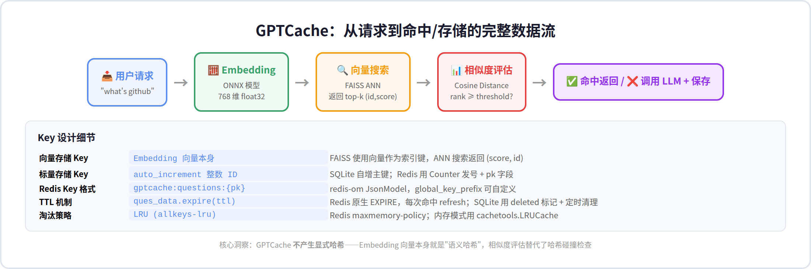
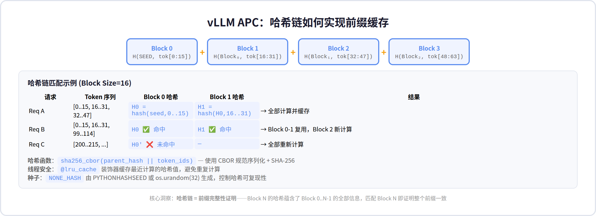
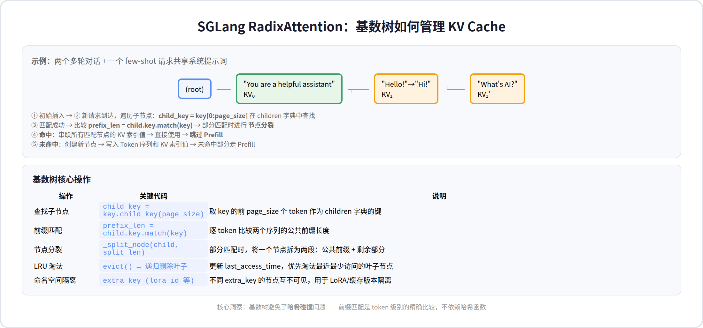
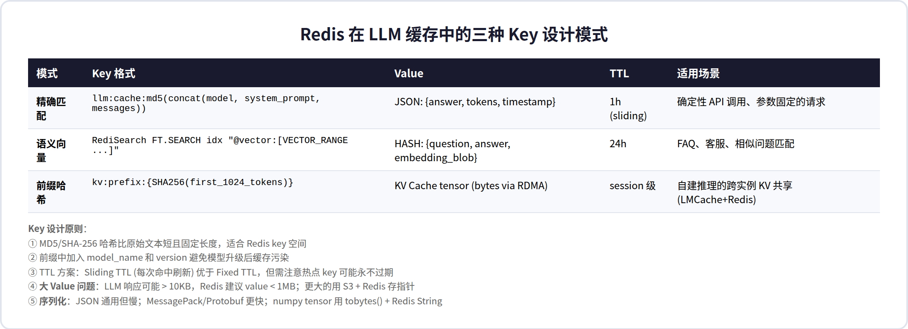
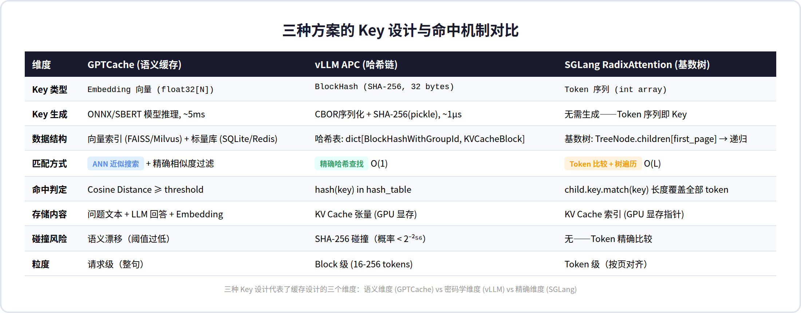

# AI 大模型服务缓存：Key 创建与命中机制深度解析

> **核心发现**：三种主流方案采用了三种截然不同的 Key 设计哲学——GPTCache 用 Embedding 向量作为"语义哈希"（无显式哈希），vLLM 用 SHA-256 哈希链做前缀完整性证明，SGLang 用基数树的 Token 精确匹配完全避免哈希。理解它们的 Key 生成、存储和命中流程，是把缓存策略从"能用"做到"好用"的关键。

---

## 目录

1. [概述](#1-概述)
2. [GPTCache：Embedding 即 Key](#2-gptcacheembedding-即-key)
3. [vLLM APC：哈希链的前缀证明](#3-vllm-apc哈希链的前缀证明)
4. [SGLang RadixAttention：基数树的精确匹配](#4-sglang-radixattention基数树的精确匹配)
5. [Redis 中的 LLM 缓存 Key 设计](#5-redis-中的-llm-缓存-key-设计)
6. [三种 Key 方案的对比分析](#6-三种-key-方案的对比分析)
7. [批判性分析与工程建议](#7-批判性分析与工程建议)

---

## 1. 概述

上一份报告从架构层面梳理了 AI 大模型服务的三层缓存体系。但缓存系统的真正灵魂在于**如何创建 Key**——什么数据参与哈希？什么粒度？什么数据结构存储？什么条件下判定命中？这些问题直接决定了缓存的效率、准确性和可运维性。

这篇补充报告深入源码级别，逐方案分析 Key 的创建与命中流程，并提炼出可复用的设计模式。

本次分析的源码范围：

| 项目 | 分析的关键文件 |
|------|--------------|
| GPTCache | `adapter/adapter.py`, `manager/data_manager.py`, `manager/scalar_data/redis_storage.py`, `embedding/onnx.py` |
| vLLM | `v1/core/kv_cache_utils.py`, `utils/hashing.py` |
| SGLang | `mem_cache/radix_cache.py` |

---

## 2. GPTCache：Embedding 即 Key

### 整体数据流



GPTCache 的架构中**没有传统意义上的哈希操作**。它的 Key 就是文本经过 Embedding 模型后的浮点向量本身，命中判定依赖向量相似度搜索。

### Key 创建：文本 → Embedding 向量

当请求到达时，`adapter.py` 的 `adapt()` 函数依次调用：

1. **`pre_embedding_func`**：从原始请求（`**kwargs`）中提取待缓存的文本。对于 OpenAI 适配器，这一步提取 `messages` 中的用户问题文本。

2. **`embedding_func`**：将文本转为向量。默认使用 `Onnx("GPTCache/paraphrase-albert-onnx")`——一个基于 ALBERT 的 ONNX 模型，输出 768 维 float32 向量。整个转换约 5ms。

```python
# Key = embedding 向量，本质上是一个 768 维 float32 数组
embedding_data = embedding_func(pre_embedding_data)  # → np.ndarray(768,)
```

### 存储：双存储架构

GPTCache 的生产级 `SSDataManager` 将数据分成两个独立的存储系统：

| 存储层 | 引擎 | Key | Value | 用途 |
|--------|------|-----|-------|------|
| 向量存储 | FAISS / Milvus / Chroma | Embedding 向量 | `(score, scalar_id)` | ANN 近似最近邻搜索 |
| 标量存储 | SQLite / Redis | `scalar_id` (自增整数) | `CacheData` (问题、回答、embedding、时间戳) | 数据查询和淘汰管理 |

以 Redis 标量存储为例，Key 结构为：

```
{global_key_prefix}:questions:{auto_increment_pk}
```

例如 `gptcache:questions:42`，Value 是一个 JSON 文档，包含：

```json
{
  "pk": "42",
  "question": "what's github",
  "create_on": "2026-07-09T10:00:00",
  "last_access": "2026-07-09T10:05:00",
  "deleted": 0,
  "answers": [{"answer": "GitHub is a platform...", "answer_type": 0}],
  "embedding": "<float32 bytes encoded as latin-1>"
}
```

### 命中判定：两级过滤

缓存命中不是简单的"找到最近向量就返回"，而是经过**两级过滤**：

**第一级：向量 ANN 搜索**

`SSDataManager.search()` 调用向量存储的 `search(embedding_data, top_k=-1)`，返回最相似的若干 `(score, id)` 对。

**第二级：精确相似度评估**

对每个候选结果，从标量存储中取回完整数据，调用 `similarity_evaluation.evaluation()` 计算精确相似度（如 Cosine Distance），只有 `rank ≥ threshold` 才纳入命中候选。

```python
# 阈值计算公式
rank_threshold = (max_rank - min_rank) * similarity_threshold * cache_factor
if rank >= rank_threshold:
    cache_answers.append((rank, cached_answer))
```

### 缓存写入（Miss 后）

当缓存未命中时，调用 LLM 获取答案后，`data_manager.save()` 执行两步写入：

1. **标量存储**：`s.batch_insert(cache_datas)` → SQLite INSERT / Redis JSON 写入，返回自增 ID
2. **向量存储**：`v.mul_add([VectorData(id, embedding)])` → FAISS 索引更新，将向量与 ID 关联

### 关键设计洞察

GPTCache 的 Key 设计回避了传统缓存中"如何生成哈希"的问题——Embedding 向量既是索引键，也是相似度计算的基础。但也因此引入了 Embedding 模型的推理开销（每次查询都需要跑一遍 ONNX 模型）和语义漂移的风险（"意思相近"≠"答案可复用"）。

---

## 3. vLLM APC：哈希链的前缀证明

### 整体架构



vLLM 的自动前缀缓存（APC）不是整句级别的缓存，而是以 **Token Block**（默认 16 tokens）为粒度。每个 Block 的哈希不仅依赖自己的 Token，还通过**哈希链**依赖所有前缀 Block 的哈希，从而实现了前缀完整性证明。

### Key 创建：哈希链 = SHA-256(父哈希, 当前 Tokens)

核心函数 `hash_block_tokens()` 在 `kv_cache_utils.py` 中实现：

```
BlockHash₀ = hash_fn(NONE_HASH, tokens[0:16])
BlockHash₁ = hash_fn(BlockHash₀, tokens[16:32])
BlockHash₂ = hash_fn(BlockHash₁, tokens[32:48])
...
```

具体过程：
1. 第一个 Block 用 `NONE_HASH`（由 `PYTHONHASHSEED` 或 `os.urandom(32)` 生成）作为父哈希
2. 将 `(parent_block_hash, curr_block_token_ids)` 用 CBOR 规范序列化
3. 调用 `hashlib.sha256()` 或 `xxhash.xxh3_128_digest()` 生成 32 字节摘要
4. 外部使用时打包为 `BlockHashWithGroupId`：`BlockHash(32B) + group_id(4B)` = 36 字节

```python
# 核心哈希逻辑（简化）
def hash_block_tokens(hash_function, parent_block_hash, curr_block_token_ids):
    return BlockHash(hash_function(cbor2.dumps(
        (parent_block_hash or NONE_HASH, curr_block_token_ids), canonical=True
    )))
```

### 存储：BlockHash → KV Cache 指针

vLLM 在 GPU 显存中维护一个哈希表：

```
dict[BlockHashWithGroupId, KVCacheBlock]
```

每个 `KVCacheBlock` 记录：
- `block_hash`: 该 Block 的哈希值
- `block_id`: 在 GPU 显存中的物理位置
- `ref_cnt`: 引用计数（多少个请求正在使用）

### 命中判定：O(1) 哈希查找

当新请求到达时：
1. 将其 Token 序列按 Block Size 分块
2. 逐个 Block 计算哈希链
3. 每个 `BlockHashWithGroupId` 执行 `hash_table.get(key)` 
4. 命中的 Block → 直接复用 GPU 上的 KV Cache
5. 第一个未命中的 Block → 从该位置开始 Prefill 计算，后续 Block 的哈希全部重新生成和存储

### 关键设计洞察

**哈希链 = 前缀完整性证明**。因为每个 Block 的哈希嵌入了父 Block 的哈希，所以 Block₂ 命中意味着 Block₀ 和 Block₁ 也必然一致。这个设计巧妙地用一个哈希值同时完成了"前缀匹配"和"完整性验证"。

`@lru_cache` 装饰器缓存最近计算的哈希值——在实际使用中，同一个 system prompt 的 Block₀ 被数百个请求重复计算，LRU 缓存避免了重复的哈希开销。

---

## 4. SGLang RadixAttention：基数树的精确匹配

### 整体架构



SGLang 完全避开了哈希，使用**基数树（Radix Tree）**直接以 Token 序列为 Key。这是一种前缀树（Trie）的变体——边可以携带多个 Token 而非单个，从而大幅压缩树的深度。

### Key 创建：Token 序列即 Key

`RadixKey` 类直接包装一个 `array[int]`（Token ID 序列），**没有任何哈希步骤**：

```python
class RadixKey:
    token_ids: array[int]   # 原始 Token ID，如 [101, 2023, 2003, ...]
    extra_key: str | None   # 命名空间隔离（lora_id, cache_salt 等）
    is_bigram: bool         # bigram 模式标记
    limit: int | None       # 截断长度
```

### 存储：TreeNode 递归结构

每个 `TreeNode` 包含：
- `key: RadixKey` — 该节点对应的 Token 序列
- `value: torch.Tensor` — KV Cache 在 GPU 上的索引
- `children: dict` — 子节点字典，键为 `child_key`（key 的前 `page_size` 个 token）
- `parent: TreeNode` — 父节点指针
- `last_access_time / hit_count / priority` — 淘汰策略元数据

### 命中判定：前缀匹配遍历

`match_prefix()` 的核心逻辑是 `_match_prefix_helper()`：

```
1. 取 key 的前 page_size 个 token 作为 child_key
2. 在 node.children 中查找 child_key
3. 找到 → 比较 prefix_len = child.key.match(key)（逐 token 比较）
   a. 完全匹配 → 收集 child.value，继续向下匹配剩余 key
   b. 部分匹配 → 调用 _split_node() 拆分节点，返回已匹配部分
4. 找不到 → 返回已收集的 value（即为最长公共前缀的 KV Cache）
```

**节点分裂**是关键操作：当新请求的 Token 序列与已有节点的前缀部分重叠但不完全相同时，将一个节点拆成两段——公共前缀段 + 各自剩余段。这保证了树结构始终精确反映实际的 KV Cache 共享关系。

### 淘汰策略

SGLang 采用**递归叶子淘汰**：

1. 维护每个节点的 `last_access_time`
2. `evict()` 从根开始递归，收集所有叶子节点
3. 按 LRU 排序，优先淘汰最近最少访问的叶子
4. 淘汰后若非叶子节点变为无子节点的叶子，也一并回收

### 关键设计洞察

基数树完全避免了哈希碰撞问题——每次匹配都是 Token 级别的精确比较。代价是树遍历的复杂度为 O(树深度)，而非哈希表的 O(1)。但实际场景中共享前缀通常是连续的（system prompt 在最前面），树深度远小于总 Token 数，性能差距可忽略。

---

## 5. Redis 中的 LLM 缓存 Key 设计



Redis 不是 LLM 专用的缓存方案，但它是构建自定义缓存层时最常用的基础设施。以下是三种经过生产验证的 Key 设计模式。

### 模式 1：精确匹配（MD5/SHA-256）

```
Key:   llm:cache:v1:{model}:{md5(concat(system_prompt, messages_json))}
Value: JSON {answer: "...", input_tokens: 1024, output_tokens: 312, ts: "..."}
TTL:   3600 (1h, sliding refresh on hit)
```

**适用场景**：参数固定、温度=0 的确定性 API 调用。MD5 确保相同输入 → 相同 key。

**注意**：必须在 key 中加入 `model` 和 `version` 前缀，否则模型升级后旧缓存仍会命中，返回过时答案。

### 模式 2：语义向量（RediSearch）

```
Key:   RediSearch 索引: FT.CREATE idx SCHEMA embedding VECTOR FLAT 6 ...
查询: FT.SEARCH idx "@embedding:[VECTOR_RANGE 0.85 $vec]" LIMIT 5
Value: HASH {q: "...", a: "...", embedding: <blob>}
TTL:   86400 (24h)
```

**适用场景**：FAQ / 客服场景，需要"意思相近"的模糊匹配。注意：RediSearch 的向量索引在数据量 > 100 万时需要调整 HNSW 参数。

### 模式 3：前缀哈希（跨实例 KV 共享）

```
Key:   kv:prefix:{model}:{sha256(first_N_tokens_bytes)}
Value: KV Cache Tensor (bytes)
TTL:   session 级
```

**适用场景**：自建推理集群的跨实例 KV Cache 共享（如 LMCache + Redis 后端）。Value 通常可达 MB 级别，需要注意 Redis 的 `proto-max-bulk-len` 限制。

### 通用原则

| 原则 | 说明 | 反例 |
|------|------|------|
| Key 前缀含版本号 | `v2:gpt-4o:md5(...)` 而非 `md5(...)` | 模型升级后缓存污染 |
| 序列化选型 | Protobuf > MessagePack > JSON | 大 Value 用 JSON（CPU 开销大） |
| TTL 分级 | 热点数据 sliding TTL，冷数据 fixed TTL | 所有 key 统一 TTL |
| 大 Value 外置 | Value > 1MB 时 Redis 存 S3 URL | 直接把 MB 级 tensor 塞 Redis |

---

## 6. 三种 Key 方案的对比分析



### 按设计哲学分类

| 哲学 | 代表方案 | Key = ? | 核心操作 | 时间复杂度 |
|------|---------|--------|---------|-----------|
| **语义哈希** | GPTCache | Embedding 向量 | ANN 搜索 + 精确相似度过滤 | O(log N) |
| **密码学哈希链** | vLLM APC | SHA-256(父哈希, tokens) | 哈希表 O(1) 查找 | O(blocks) |
| **精确前缀匹配** | SGLang RadixAttention | Token 序列 | 基数树遍历 | O(树深度) |

### 各方案的适用边界

| 场景 | 推荐方案 | 理由 |
|------|---------|------|
| 语义相似但表述不同的重复问题 | GPTCache | 只有 Embedding 能捕获语义相似性 |
| 长 system prompt + 多轮对话 | vLLM APC | 哈希链天然适合前缀共享，O(1) 查找 |
| 复杂推理链（Tree-of-Thought、多分支） | SGLang RadixAttention | 基数树支持分支和部分匹配，哈希链只支持线性前缀 |
| 跨实例、持久化 KV 共享 | Redis + LMCache | 引擎无关，支持分布式和持久化 |
| 确定性 API 调用缓存 | Redis MD5 | 最简单、最可靠 |

---

## 7. 批判性分析与工程建议

### GPTCache 的"免费午餐"陷阱

GPTCache 论文宣扬"10 倍成本节省"，但实际落地中 Embedding 模型推理本身就是开销。一个 768 维的 ONNX 模型每次推理约 5ms，如果你的 LLM API 延迟是 500ms，这 5ms 确实可以忽略。但如果你的 LLM 延迟只有 50ms（如本地部署的小模型），Embedding 开销就占了 10%。

**我的建议**：在引入语义缓存前，先统计请求的实际重复率。如果 > 70% 的请求是完全相同的（精确匹配即可），用 Redis MD5 就够了，不需要 Embedding。

### vLLM 哈希链的"不可调试性"

SHA-256 哈希链虽然安全高效，但调试起来极其痛苦。当用户问"为什么这个请求没有命中缓存？"，你无法从 BlockHash 反推出是哪个 Token 导致了不匹配。相比之下，SGLang 的基数树可以通过遍历树节点直观看到"这个 Token 位置开始分叉了"。

**我的建议**：生产环境中为 vLLM 开启 KV events 日志，记录每次哈希计算的前后文，方便排查缓存未命中的原因。

### SGLang 基数树的"内存膨胀"

基数树的节点开销可能很大——每个节点存储 `key`（Token 数组）、`value`（Tensor）、`children`（dict）、元数据。在极高并发场景（10000+ QPS），树节点数量可能达到百万级，CPU 内存开销值得关注。SGLang 团队对此的回应是将树结构存在 CPU 侧，GPU 侧只存 KV 张量——但 CPU 侧的 Python 对象开销确实不容忽视。

### 工程落地建议：Key 设计的 checklist

1. **Key 必须包含命名空间**：model_name + version + cache_salt，防止跨模型/跨版本污染
2. **序列化要确定性**：相同输入必须产生相同 Key——JSON keys 排序、CBOR canonical mode
3. **TTL 要分级**：热点 key 用 sliding TTL，冷 key 用 fixed TTL + LRU 淘汰
4. **大 Value 要外置**：> 1MB 的缓存值应该存指针（S3 URL / 本地路径）而非直接放缓存
5. **命中率要可观测**：每个缓存层暴露 `hits / misses / hit_rate` 指标，否则无法调优
6. **缓存预热要考虑**：系统重启后第一批请求全部 miss 会导致雪崩——应该支持从持久化存储预加载热点 KV Cache
7. **哈希种子要可配置**：vLLM 的 `PYTHONHASHSEED` 决定了跨进程缓存是否可共享——如果你需要多进程共享 KV Cache，必须固定种子

---

## 8. 补充：边缘网关缓存与新兴项目

### Cloudflare AI Gateway：边缘层精确匹配

Cloudflare AI Gateway 在 CDN 边缘节点拦截 LLM API 请求，用 **SHA-256 哈希做精确匹配缓存**。这是最"透明"的缓存方案——只需一行 URL 改写即可接入。

**Key 生成逻辑**：

```
cache_key = SHA-256(provider + endpoint + model + auth_header + request_body)
```

五个维度全部参与哈希，任何一个维度不同都会产生独立的缓存条目。可以通过 `cf-aig-cache-key` 自定义 Header 覆盖默认 key，实现更灵活的缓存分组。

**命中机制**：

- 请求到达 Cloudflare 边缘节点 → 计算 cache_key → 查 CDN 缓存
- 响应头 `cf-aig-cache-status: HIT` 或 `MISS`
- 支持 per-request TTL 控制：`cf-aig-cache-ttl: 3600`（秒），最小 60s，最大 1 个月
- 可通过 `cf-aig-skip-cache: true` 跳过缓存

**适用场景**：温度=0 的确定性调用、内容生成（非对话）、公共查询。支持 20+ AI 厂商（OpenAI、Anthropic、Google、Replicate 等）。

### Kong AI Gateway：企业级语义缓存

Kong AI Gateway 走的是"语义缓存"路线——不是精确匹配整个 request body，而是对用户提示词做语义相似度匹配，相似的 prompt 也能命中缓存。这更接近 GPTCache 的思路，但集成在 API 网关层面。

Kong 还提供 LLM + MCP + A2A 的全栈治理能力，适合金融、制造等强合规场景。

### 值得关注的新兴项目

除了主流方案，以下两个开源项目提供了差异化的设计思路：

**ModelCache（蚂蚁开源，942⭐）**

- 多租户架构，一个缓存实例服务多个业务线
- Redis Search 做向量检索加速，延迟控制在 10ms 以内
- 适合企业内部 AI 中台场景

**PromptCache（Go 实现，236⭐）**

- 独树一帜的三级验证策略：
  1. 高相似度 → 直接返回缓存
  2. 灰色区间 → 调用小验证模型确认答案是否适用
  3. 低相似度 → 直接调用 LLM
- 零代码侵入的 drop-in 代理模式——应用不改代码，把 LLM 请求指向 PromptCache 代理即可
- Go 语言实现，部署轻量

### 网关缓存 vs 应用层缓存 vs 推理层缓存

| 维度 | 网关层 (Cloudflare/Kong) | 应用层 (GPTCache/Redis) | 推理层 (vLLM/SGLang) |
|------|------------------------|------------------------|---------------------|
| 部署位置 | CDN 边缘 / API Gateway | 应用服务器 | GPU 集群内部 |
| 缓存什么 | 完整 LLM 响应 | LLM 响应 (文本) | KV Cache 张量 |
| 节省什么 | API 调用成本 + 网络延迟 | API 调用成本 | GPU 计算时间 |
| 匹配粒度 | 请求级 (整个 body) | 请求级 (句子) | Block 级 (16 tokens) |
| 零代码接入 | ✅ (URL 改写) | ❌ (需集成 SDK) | ✅ (框架内置) |
| 跨模型通用 | ✅ | ✅ | ❌ (引擎绑定) |

---

*本补充报告基于 GPTCache v0.1.x、vLLM v0.24.0、SGLang main 分支的源码分析，以及 Cloudflare AI Gateway 官方文档。数据截至 2026 年 7 月。*
