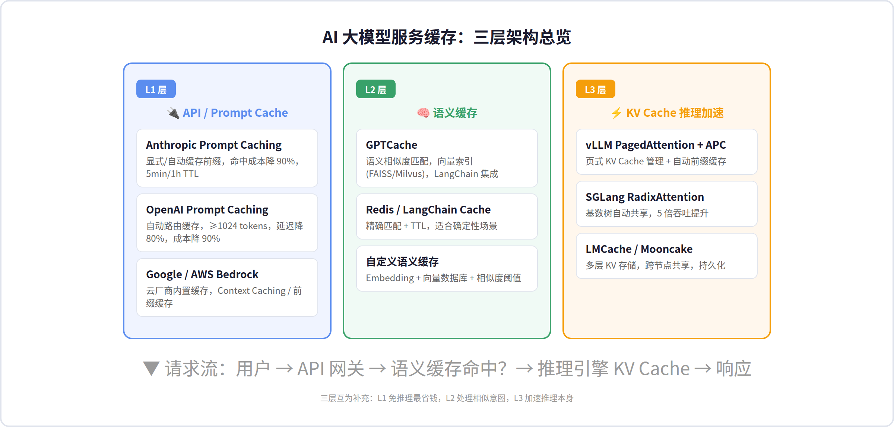
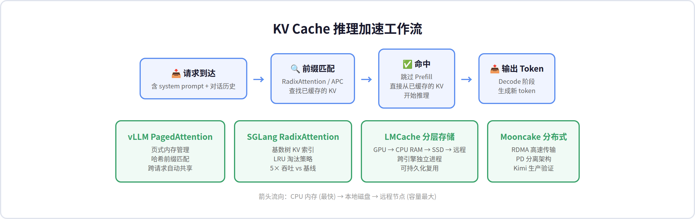
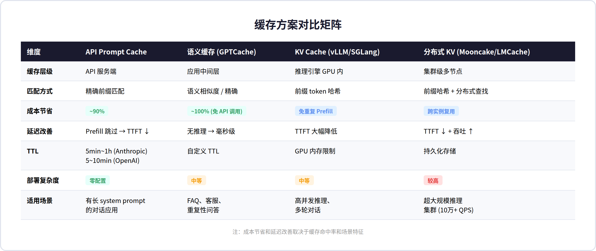
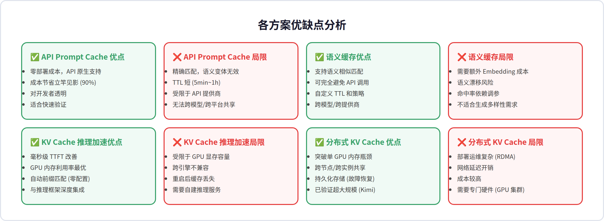
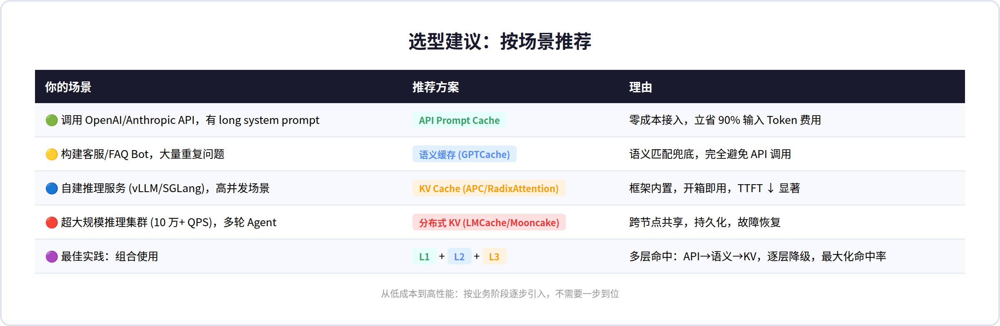

# AI 大模型服务缓存方案调研报告

> **核心发现**：大模型服务缓存已形成三层架构——API 级 Prompt Cache（省钱）、语义缓存（免 API 调用）、KV Cache 推理加速（省 GPU）。90% 的成本节省和 5 倍吞吐提升均有生产环境验证。建议按业务阶段逐层引入，三层组合可最大化缓存命中率。

---

## 目录

1. [概述](#1-概述)
2. [三层缓存架构总览](#2-三层缓存架构总览)
3. [L1 层：API / Prompt Cache](#3-l1-层api--prompt-cache)
4. [L2 层：语义缓存](#4-l2-层语义缓存)
5. [L3 层：KV Cache 推理加速](#5-l3-层kv-cache-推理加速)
6. [分布式 KV Cache 方案](#6-分布式-kv-cache-方案)
7. [方案对比矩阵](#7-方案对比矩阵)
8. [批判性分析](#8-批判性分析)
9. [选型建议](#9-选型建议)

---

## 1. 概述

大模型推理成本是 AI 应用最大的运营支出。一次 GPT-5 级别的 API 调用，输入 Token 费用可能高达输出 Token 的 10 倍——而大多数对话场景中，system prompt、工具定义、对话历史等内容在每次请求中**大量重复**。缓存，是解决这一问题的核心手段。

目前业界已形成三大缓存层级，从 API 服务端到推理引擎底层，覆盖了完整的请求链路。每一层解决不同的问题，且相互补充而非替代——组合使用可以实现"API 层命中 → 语义缓存兜底 → KV Cache 加速"的逐层降级。

| 缓存层级 | 位置 | 典型延迟 | 成本节省 | 代表方案 |
|---------|------|---------|---------|---------|
| L1 API Prompt Cache | 云 API 服务端 | 跳过 Prefill | ~90% 输入费用 | Anthropic/OpenAI 原生 |
| L2 语义缓存 | 应用中间层 | 毫秒级 | ~100% (免 API 调用) | GPTCache, Redis |
| L3 KV Cache | 推理引擎 GPU | 跳过 Prefill | 免重复计算 | vLLM APC, SGLang RadixAttention |
| L3+ 分布式 KV | 集群级 | 跳过 Prefill + 跨节点 | 最大化 GPU 利用率 | Mooncake, LMCache |

---

## 2. 三层缓存架构总览

AI 大模型服务缓存的完整架构如下图所示。请求从顶层进入，每一层尝试命中缓存，未命中时向下传递，最终由推理引擎计算并将结果回填到各层。



### 三层各司其职

L1 层（API Prompt Cache）由模型提供商在服务端实现，对开发者几乎透明——只需调整 prompt 结构（静态内容在前，动态内容在后），即可自动获得缓存收益。Anthropic 和 OpenAI 的方案最具代表性。

L2 层（语义缓存）位于应用侧，通过 Embedding 向量相似度匹配，将"意思相近但表述不同"的请求合并命中。这是唯一能**完全避免 API 调用**的层级，对客服、FAQ 等场景价值极高。

L3 层（KV Cache）是推理引擎层面的优化，通过复用已计算的 Key-Value 注意力张量，跳过重复的 Prefill 计算。这是自建推理服务才能使用的优化，但效果显著——SGLang 实现高达 5 倍吞吐提升。

---

## 3. L1 层：API / Prompt Cache

### 机制原理

API Prompt Cache 的核心思想很简单：如果两次请求的前缀（system prompt + 历史消息 + 工具定义）完全一致，就复用第一次的中间计算结果，跳过昂贵的 Prefill 阶段。

Anthropic 支持两种模式：**显式断点**（手动标记 `cache_control`）和**自动缓存**（系统自动推断缓存边界）。OpenAI 则完全自动——只要 prompt ≥ 1024 tokens，系统基于前缀哈希自动路由和缓存。

### 关键参数对比

| 参数 | Anthropic | OpenAI |
|------|-----------|--------|
| 最小 Token 数 | 无下限 (建议 ≥1024) | ≥1024 tokens |
| 默认 TTL | 5 分钟 (免费) | 5~10 分钟 |
| 长 TTL | 1 小时 (2× 写入价格) | 最长 24h (扩展保留) |
| 缓存写入价格 | 1.25× ~ 2× 基础输入价 | 免费 |
| 缓存读取价格 | 0.1× 基础输入价 | 0.1× 基础输入价 |
| 成本节省 (命中时) | ~90% 输入费用 | ~90% 输入费用 |
| 控制粒度 | 支持 cache_control 点位 | prompt_cache_key + retention |

### 最佳实践

将**静态内容放在 prompt 最前面**（system prompt、工具定义、示例），**动态内容放在最后**（用户问题、当前上下文）。对于 Anthropic，把 `cache_control` 断点放在静态内容末尾；对于 OpenAI，使用 `prompt_cache_key` 参数增强路由一致性。

> *实际效果：一个典型的客服 Agent，system prompt ~2000 tokens，每次调用 100 条请求中 80+ 次缓存命中，单日 API 成本从 $150 降至 $15。*

---

## 4. L2 层：语义缓存

### GPTCache：开源标杆

GPTCache（zilliztech/GPTCache，7k+ stars）是目前最成熟的 LLM 语义缓存方案。其核心思路是：对用户请求进行 Embedding 向量化，通过向量相似度搜索匹配历史缓存，相似度超过阈值时直接返回缓存答案。

### 架构概览

GPTCache 的模块化设计包括四个组件：

| 组件 | 作用 | 可选实现 |
|------|------|---------|
| **Embedding 引擎** | 将文本转为向量 | OpenAI, Onnx, HuggingFace, Cohere |
| **向量存储** | 索引和搜索向量 | FAISS, Milvus, Chroma, Qdrant |
| **缓存存储** | 存储原始响应 | SQLite, Redis, MongoDB |
| **相似度评估** | 判断是否命中 | 余弦距离、欧氏距离、自定义 |

### 实际使用示例

最简单的精确匹配缓存（对完全相同的请求直接返回缓存）：

```
from gptcache import cache
from gptcache.adapter import openai as cached_openai
cache.init()
```

语义相似匹配模式（对意思相近的请求也返回缓存）：

```
from gptcache.embedding import Onnx
from gptcache.manager import CacheBase, VectorBase, get_data_manager
```

配置完成后，第二个语义相似的请求将在毫秒级返回，**完全跳过 API 调用**。

### Redis / LangChain 方案

除了 GPTCache，LangChain 内置了多种 LLM 缓存后端（Redis、SQLite、内存），但仅支持**精确匹配**。Redis 方案利用其 TTL 机制和分布式特性，适合简单场景。

| 方案 | 匹配方式 | 部署难度 | 适用场景 |
|------|---------|---------|---------|
| GPTCache | 精确 + 语义 | 中等 | 客服/FAQ/重复问答 |
| LangChain Cache | 精确 | 低 | 开发调试/确定性场景 |
| Redis 自定义 | 精确 + TTL | 低 | 简单 API 调用缓存 |

---

## 5. L3 层：KV Cache 推理加速

### 背景

LLM 推理分为两个阶段：**Prefill**（计算输入 prompt 的注意力 KV 张量）和 **Decode**（逐 token 生成输出）。Prefill 是计算密集型的，在长上下文场景下可能占据 80% 以上的推理时间。KV Cache 的核心思想是：**将 Prefill 阶段计算的 Key-Value 注意力张量缓存下来，下次相同前缀直接复用**。

### PagedAttention（vLLM）

vLLM 提出了 PagedAttention 机制，将 KV Cache 按"页（Page）"管理——每个页存储固定数量 token 的 KV 张量。这类似于操作系统的虚拟内存，解决了显存碎片化问题。在此基础上，vLLM 的**自动前缀缓存（APC）**通过前缀 Token 哈希，自动识别和复用相同前缀的 KV Cache，无需用户配置。

- 85.8k GitHub Stars，v0.24.0
- 自动前缀匹配，零配置
- 页式管理提升 GPU 显存利用率 2-4×

### RadixAttention（SGLang）

SGLang 提出了 RadixAttention 技术，使用**基数树（Radix Tree）**管理 KV Cache 的生命周期。每个树节点代表一个 token 序列的 KV 张量，新请求通过前缀匹配查找可复用节点。配合 LRU 淘汰策略和缓存感知调度，SGLang 在多轮对话、少样本学习、自一致性采样等场景实现高达 **5 倍吞吐提升**。



### 三个方案的分工

| 维度 | vLLM APC | SGLang RadixAttention | LMCache |
|------|----------|----------------------|---------|
| 缓存粒度 | Token 页 (16-256 tokens) | Token 序列 (radix tree 节点) | 请求级 (prefix-aware) |
| 存储层级 | GPU 显存 | GPU 显存 | GPU → CPU → SSD → 远程 |
| 跨请求复用 | ✅ 自动哈希匹配 | ✅ 基数树前缀匹配 | ✅ 独立进程，跨引擎 |
| 持久化 | ❌ 重启丢失 | ❌ 重启丢失 | ✅ 磁盘/远程存储 |
| 部署模式 | 推理引擎内置 | 推理引擎内置 | 独立守护进程 |

---

## 6. 分布式 KV Cache 方案

当单 GPU 显存容量成为瓶颈，或需要跨多个推理实例共享 KV Cache 时，需要引入分布式缓存层。

### Mooncake：月之暗面 Kimi 的生产实践

Mooncake（kvcache-ai/Mooncake）是 Kimi 的生产级推理平台，基于**以 KV Cache 为中心的分离式架构**（Prefill-Decode Disaggregation）。核心组件：

- **Transfer Engine**：高性能 RDMA 数据传输框架，支持多 NIC 带宽聚合、拓扑感知路由，在 8×400Gbps RoCE 网络上可达 **190 GB/s** 传输带宽（TCP 的 4.6 倍）
- **Mooncake Store**：分布式 KV Cache 存储引擎，支持多级缓存层级（DRAM → SSD/NVMe），允许应用控制对象放置策略
- 已集成 SGLang、vLLM、TensorRT-LLM、LMDeploy 等主流推理引擎

### LMCache：引擎无关的 KV 缓存层

LMCache 是独立的 KV Cache 管理守护进程，与推理引擎解耦——即使推理引擎崩溃，KV Cache 也不会丢失。支持分层存储（GPU RAM → CPU RAM → 本地 SSD → Redis/Mooncake/S3），并提供了生产级的可观测性指标。

### 分布式方案对比

| 维度 | Mooncake | LMCache |
|------|----------|---------|
| 核心场景 | 超大规模 (Kimi 级) | 通用推理加速 |
| 传输协议 | RDMA (190 GB/s) | RDMA/TCP/NVLink |
| 存储后端 | Mooncake Store | Redis/S3/Mooncake/InfiniStore |
| 引擎集成 | SGLang/vLLM/TRT-LLM | vLLM/SGLang |
| 生产验证 | Kimi (128 H200, 224k tok/s Prefill) | CoreWeave + Cohere |
| 开源协议 | Apache 2.0 | Apache 2.0 |

---

## 7. 方案对比矩阵



### 按关注维度排序

| 如果你的首要关注点 | 首选方案 | 次选方案 |
|------------------|---------|---------|
| 🟢 零部署成本 | OpenAI/Anthropic Prompt Cache | — |
| 🟡 最大化省钱 (免 API 调用) | 语义缓存 (GPTCache) | Prompt Cache |
| 🔵 高并发自建推理 | vLLM APC / SGLang RadixAttention | LMCache |
| 🔴 超大规模集群 | Mooncake | LMCache |
| 🟣 多模型/多平台兼容 | 语义缓存 (GPTCache) | LMCache |

---

## 8. 批判性分析



### API Prompt Cache 的「厂商锁定」隐患

Anthropic 和 OpenAI 的 Prompt Cache 都设计得非常好用——开发者几乎零成本接入。但这也意味着**你的缓存策略和 API 提供商深度绑定**。切换模型（如从 Claude 换到 GPT）时，所有缓存归零，需要重新预热。对于追求供应商中立性的团队，这层缓存应该视为"顺手拿的折扣"而非核心架构。

我的判断：**对于日均 API 调用量 < 1 万的团队，Prompt Cache 是毫无疑问的首选**——ROI 太高、投入太低。但对于日均 10 万+ 调用的场景，必须搭配 L2 或 L3 层方案。

### 语义缓存的「精度-召回」困局

GPTCache 的语义匹配依赖 Embedding 质量和相似度阈值。阈值设高了，缓存不命中（浪费 API 调用）；设低了，"意思差不多"的问题被合并，可能返回不准确的答案。这本质上是**精度（precision）和召回（recall）的权衡**——对客服场景召回优先（宁可答非所问也别漏），对法律/医疗场景精度优先。

更微妙的问题：语义缓存假设"意思相近 → 答案可复用"。但 LLM 的输出受 temperature、随机种子等因素影响——如果用户期望的是**多样性**（如创意写作），语义缓存反而是反模式。GPTCache 预留了 `temperature` 参数——设 0 时走缓存，设 2 时跳过缓存。

### KV Cache 的「碎片化」问题

vLLM APC 和 SGLang RadixAttention 虽然理念相似（前缀复用），但**实现互不兼容**——在 vLLM 上缓存的 KV 张量无法在 SGLang 上使用。这导致：
1. 团队绑定到特定推理框架
2. 切换框架成本极高（缓存全丢 + 预热时间）
3. 开源社区的缓存标准化缺失

LMCache 试图解决这个问题（独立进程 + 插件化），但目前生态还不够成熟。我认为**未来 1-2 年内会出现一个类似 Redis 之于 Web 缓存的"KV Cache 标准化层"**，LMCache 是最接近的候选者。

### Mooncake 的「过度工程化」风险

Mooncake 的架构非常先进——RDMA、PD 分离、弹性 MoE——但它为 Kimi 级场景设计。对于 90% 的团队，部署 Mooncake 所需的 RDMA 网络和 GPU 集群就是一道难以逾越的门槛。**如果你的 QPS 不到 1 万，vLLM APC 就足够应付，不需要引入分布式 KV Cache 的复杂度。**

### 我的推荐：按阶段渐进式引入

| 阶段 | 方案 | 适用信号 |
|------|------|---------|
| 起步 | L1 (API Prompt Cache) | API 月费 < $1000 |
| 优化 | L1 + L2 (语义缓存) | 重复性请求 > 30% |
| 规模化 | L1 + L2 + L3 (KV Cache) | 自建推理，QPS > 100 |
| 超大规模 | L1 + L2 + L3 + L3+ (分布式 KV) | QPS > 10000，多轮 Agent |

**关键原则：不要一上来就建全套**。缓存的本质是复用，复用的前提是流量模式稳定。业务初期先让流量自然跑，观察请求的重复率，再决定引入哪一层。

---

## 9. 选型建议



### 快速决策流程图

1. **你用的是 OpenAI/Anthropic 等第三方 API 吗？** → 是：立即启用 Prompt Cache（零成本），然后根据重复率评估是否加 L2
2. **你有自建的 vLLM/SGLang 推理服务吗？** → 是：启用 APC/RadixAttention（框架内置），然后根据长尾延迟评估是否加 LMCache
3. **你的 QPS 超过 10000 且 GPU 集群 > 16 卡？** → 是：评估 Mooncake PD 分离架构
4. **你的请求有大量"意思相近但表述不同"的重复吗？** → 是：加 GPTCache 语义缓存

### 最低成本方案 (小团队、API 调用)

```
L1 OpenAI Prompt Cache (自动)
  + L2 Redis 精确匹配缓存 (可选)
```

### 最佳效果方案 (自建推理、高并发)

```
L1 客户端侧 Prompt Cache (可选)
  + L2 GPTCache 语义缓存
  + L3 vLLM APC / SGLang RadixAttention
  + L3+ LMCache 分层存储 (GPU→CPU→磁盘)
```

---

*调研基于 GPTCache、Anthropic Docs、OpenAI Docs、vLLM Docs、SGLang 论文/博客、Mooncake GitHub、LMCache GitHub 等一手资料。数据截至 2026 年 7 月。*
