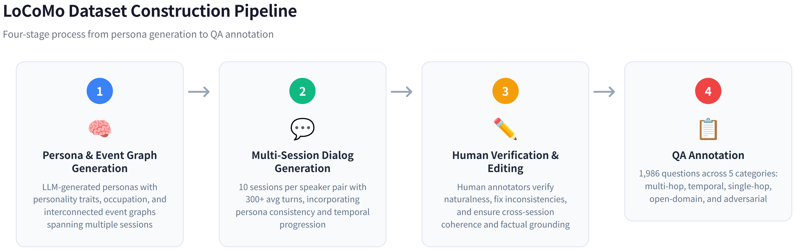
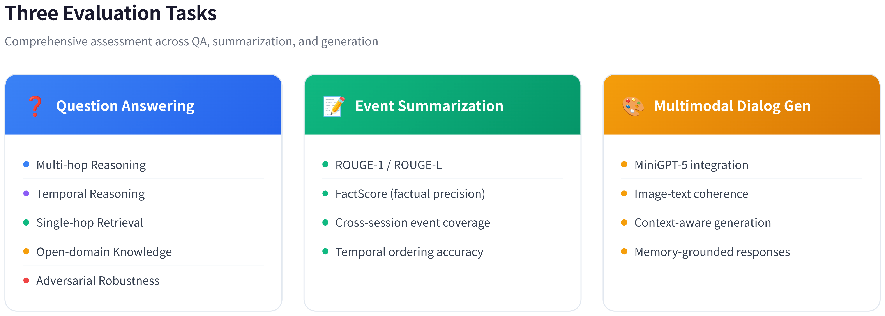
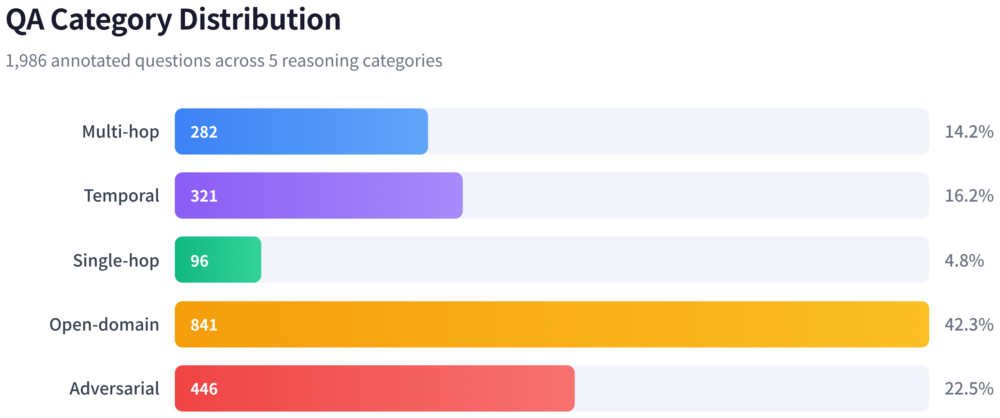
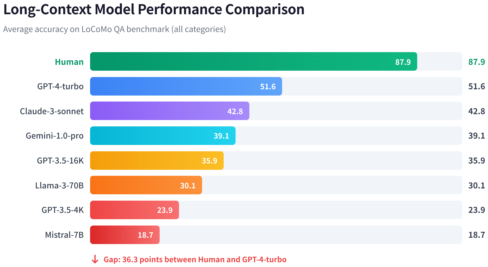
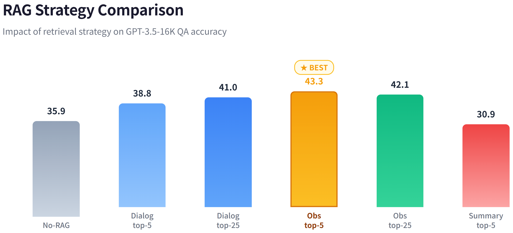
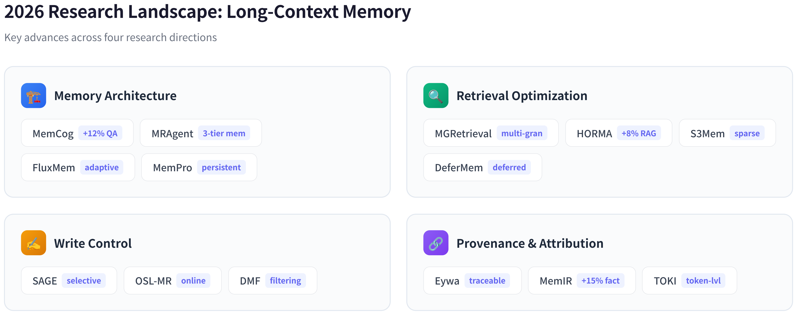

# LoCoMo: 超长期对话记忆评估基准

> **核心发现**：即使最强的 GPT-4-turbo 在 LoCoMo 上也仅得 51.6 分，远低于人类的 87.9 分——LLM 的长期对话记忆仍是未解难题。

---

## 目录

1. [概述](#1-概述)
2. [数据集构造](#2-数据集构造)
3. [评估任务](#3-评估任务)
4. [实验结果](#4-实验结果)
5. [评估框架源码分析](#5-评估框架源码分析)
6. [2026 年研究前沿](#6-2026-年研究前沿)
7. [局限性与未来方向](#7-局限性与未来方向)
8. [引用](#8-引用)

---

## 1. 概述

现有的长期对话研究主要聚焦于不超过 5 个会话的场景。然而真实世界中，人与人之间的对话往往跨越数周甚至数月，涉及数十个会话。随着长上下文 LLM 和 RAG 技术的发展，亟需一个能够评估模型在**超长期对话**中记忆能力的基准。

LoCoMo（**Lo**ng-term **Co**versational **Mo**emory）由 Snap Research & UNC Chapel Hill 提出，发表于 **ACL 2024**。数据集包含 10 段超长对话，每段平均 588 轮、27 个会话，共计 1,986 个 QA 对。论文配套完整的评估代码，支持 GPT、Claude、Gemini、HuggingFace 开源模型等多种后端。

| 维度 | 详情 |
|------|------|
| 论文 | *Evaluating Very Long-Term Conversational Memory of LLM Agents* |
| 作者 | Adyasha Maharana, Dong-Ho Lee, Sergey Tulyakov 等 |
| 机构 | Snap Research + UNC Chapel Hill |
| 会议 | ACL 2024 |
| arXiv | [2402.17753](https://arxiv.org/abs/2402.17753) |
| 代码 | [snap-research/locomo](https://github.com/snap-research/locomo) |

---

## 2. 数据集构造

### 2.1 生成管线

LoCoMo 采用**机器-人工协作**的四阶段生成管线。首先为两个 LLM Agent 分配独特人格（姓名、年龄、职业、兴趣）并生成时间事件图；然后两个 Agent 带着记忆模块和反思模块交替生成多会话对话，支持图文混合交互；接着人工标注者编辑约 15% 的对话轮次以消除长程不一致；最后人工标注 QA 对覆盖 5 种推理类别。



| 阶段 | 核心操作 | 人工参与度 |
|------|---------|-----------|
| 人格与事件图 | LLM 生成人格 + 因果事件图 | 低 |
| 对话生成 | 双 Agent 记忆驱动对话，支持图片分享 | 低 |
| 人工验证 | 编辑 15% 轮次，替换 19% 图片 | 高 |
| QA 标注 | 5 类推理问答对标注 | 高 |

### 2.2 数据集统计

| 指标 | 数值 |
|------|------|
| 对话总数 | 10 段（原始 50 段的精选子集） |
| 平均会话数/对话 | 27.2（最多 35 个） |
| 平均轮次/对话 | 588 |
| 总 QA 对 | 1,986 |
| 平均 tokens/对话 | ~9K |

### 2.3 数据格式

每条数据包含 6 个顶层字段。`conversation` 下按 `session_N` 组织对话轮次，每轮有 `speaker`、`dia_id`（格式 `D{会话}:{轮次}`）、`text`；`observation` 和 `session_summary` 由 GPT-3.5 自动生成；`event_summary` 为人工标注；`qa` 包含问题、答案、证据对话 ID 和类别标签。

---

## 3. 评估任务

LoCoMo 包含三个评估任务，其中 QA 任务是核心。



### 3.1 问答任务（Question Answering）

QA 任务覆盖 **5 种推理类别**，从单跳事实回忆到需要识别"无法回答"的对抗性问题。

| 类别 | ID | 说明 | 数量 | 占比 |
|------|----|------|------|------|
| Multi-hop | 1 | 综合多个会话信息 | 282 | 14.2% |
| Temporal | 2 | 时间推理 | 321 | 16.2% |
| Single-hop | 3 | 单会话事实 | 96 | 4.8% |
| Open-domain | 4 | 结合外部知识 | 841 | 42.3% |
| Adversarial | 5 | 识别无法回答的问题 | 446 | 22.5% |



**评估指标**：主要使用 **F1 Score**（归一化后 token 级别）。不同类别的计算策略不同：Multi-hop 将答案按逗号分割后取平均 F1；Temporal/Single-hop/Open-domain 使用 Porter Stemmer 词干提取后计算 F1；Adversarial 检查输出是否包含"no information available"或"not mentioned"。

### 3.2 事件摘要任务

为每个说话者在每个会话中生成关键事件摘要。评估使用 ROUGE-1/2/L 和 FactScore。论文识别了 LLM 的 5 类典型错误：信息缺失、幻觉、对话线索误解、说话者归因错误、显著性错误。

### 3.3 多模态对话生成

基于 MiniGPT-5，在给定对话历史的情况下生成包含图片的回复。评估使用 BLEU-1/2、ROUGE-L 和 MM-Relevance。

---

## 4. 实验结果

### 4.1 长上下文模型



| 模型 | 上下文 | Single | Multi | Temporal | Open | Adversarial | **Overall** |
|------|--------|--------|-------|----------|------|-------------|-------------|
| **Human** | - | 95.1 | 85.8 | 92.6 | 75.4 | 89.4 | **87.9** |
| GPT-4-turbo | 128K | 72.3 | 51.5 | 51.4 | 38.5 | 15.7 | 51.6 |
| Claude-3-sonnet | 200K | 70.7 | 38.1 | 26.9 | 52.2 | 2.5 | 42.8 |
| Gemini-1.0-pro | 32K | 62.4 | 35.3 | 34.2 | 19.0 | 5.2 | 39.1 |
| GPT-3.5-turbo | 16K | 52.6 | 36.7 | 24.3 | 24.0 | 14.8 | 35.9 |
| Llama-3-70B | 4K | 17.0 | 17.0 | 12.0 | 13.0 | 80.0 | 30.1 |

**关键发现**：最强模型 GPT-4-turbo（51.6）仍落后人类 36.3 分。长上下文模型在 Adversarial 上表现极差（GPT-4-turbo 仅 15.7%），说明**越强的模型越容易被干扰信息误导**。Llama-3-70B 短上下文反而在 Adversarial 上达 80.0%——因为看不到干扰信息。

### 4.2 RAG 方法

基于 GPT-3.5-turbo（16K），比较三种检索数据库和不同 top-k：



| 检索单元 | top-k | Temporal | Adversarial | **Overall** |
|---------|-------|----------|-------------|-------------|
| 无 (全量) | - | 24.3 | 14.8 | 35.9 |
| Dialog | 25 | 37.2 | 12.8 | 41.0 |
| **Observation** | **5** | **40.7** | **32.5** | **43.3** |
| Summary | 10 | 37.5 | 24.0 | 32.0 |

**关键发现**：**Observation top-5** 是最优策略（43.3）。RAG 在 Temporal 上提升显著（24.3→40.7），但在 Open-domain 上可能降低性能——不恰当的检索上下文会干扰模型。

### 4.3 事件摘要

| 模型 | 上下文 | ROUGE-L | FactScore F1 |
|------|--------|---------|-------------|
| GPT-4-turbo | 128K | 21.6 | 48.9 |
| Gemini-1.0-pro | 1M | 21.1 | 44.2 |
| Claude-3-sonnet | 200K | 21.3 | 43.1 |
| Llama-3-70B | 4K | 19.2 | 37.8 |

---

## 5. 评估框架源码分析

### 5.1 代码结构

仓库分为三层：`data/` 存数据集，`task_eval/` 存评估逻辑（按模型分为 gpt/claude/gemini/hf 四个 utils），`scripts/` 存运行脚本。评估入口为 `evaluate_qa.py`，核心指标计算在 `evaluation.py`。

| 文件 | 职责 |
|------|------|
| `evaluate_qa.py` | QA 评估主入口，调度模型调用 + 指标计算 |
| `evaluation.py` | F1/EM/ROUGE/BERTScore 指标计算 |
| `evaluation_stats.py` | 按类别和记忆距离聚合统计 |
| `gpt_utils.py` | GPT 调用 + 上下文截断 + RAG 构建 |
| `rag_utils.py` | 向量检索（DPR/Contriever/DRAGON/OpenAI） |

### 5.2 评估流程

评估流程分三步：构建对话上下文（从最新会话反向遍历直到 token 预算耗尽）→ 针对不同 QA 类别构造 prompt（Temporal 追加日期提示、Adversarial 随机化选项）→ 调用 LLM 并计算 F1。

关键设计：上下文截断采用**反向遍历**策略，模型优先看到最近的对话，早期会话可能被完全截断——模拟现实中"短期记忆优先"。

### 5.3 RAG 检索流程

RAG 支持三种数据库模式（Dialog/Observation/Summary）和四种检索器（DPR/Contriever/DRAGON/OpenAI Embedding）。流程为：计算问题 embedding → dot product 相似度排序 → 取 top-k 拼接时间戳作为 LLM 输入。

---

## 6. 2026 年研究前沿

LoCoMo 已成为 LLM Agent 长期记忆的**事实标准基准**。2026 年 5-6 月涌现 20+ 篇基于 LoCoMo 的研究，形成四个主要方向：



### 6.1 记忆架构创新

| 方法 | 核心思想 | 亮点 |
|------|---------|------|
| MemCog | Memory-as-Cognition：记忆访问融入推理 | LoCoMo 92.98（SOTA） |
| MRAgent (ICML 2026) | Cue-Tag-Content 关联图 + 主动重建 | 比基线 +23% |
| FluxMem | 连接演化：反馈驱动图拓扑精炼 | 三个基准 SOTA |
| MemPro | 记忆系统作为可演化程序 | 持续迭代改进 |

### 6.2 检索优化

| 方法 | 核心思想 | 亮点 |
|------|---------|------|
| MGRetrieval | 基于历史语义结构构建检索路径 | F1 +8.91% |
| HORMA | 分层组织 + RL 导航最小充分上下文 | token 仅 22% |
| S3Mem | 结构化时空场景-事件路由 | 15.8x 更少 tokens |
| DeferMem | 查询时证据蒸馏（RL） | 最高准确率 + 最快 |

### 6.3 写入控制

| 方法 | 核心思想 | 亮点 |
|------|---------|------|
| SAGE | vMF 新颖性门控 | 成本降 3.4x |
| OSL-MR | 约束优化保留策略 | 优于所有启发式 |
| DMF | 确定性记忆工厂 | token 减少 5-242x |

### 6.4 溯源与可信度

| 方法 | 核心思想 | 亮点 |
|------|---------|------|
| Eywa | 溯源锚定：先证据后信念 | 90.19% accuracy |
| MemIR | 类型化中间表示 | 分离证据/线索/声明 |
| TOKI | 双时态算子代数 | 排除三种写时异常 |

### 6.5 衍生基准

- **LoCoMo-Plus**：扩展到认知记忆，评估隐式约束下的语义断连
- **Causal-LoCoMo**：因果标注版本，评估记忆选择的因果有用性

---

## 7. 局限性与未来方向

| 局限 | 说明 |
|------|------|
| 数据集规模 | 仅 10 段对话，统计效力有限 |
| 语言 | 仅支持英语 |
| 评估指标 | F1 对长答案不够鲁棒 |
| 闭源依赖 | 生成管线依赖 GPT-3.5/4 |
| 多模态 | 图片可被 caption 替代而信息损失不大 |

未来方向包括：更大规模基准、认知记忆评估（隐式理解 + 主动触发）、动态环境中的记忆演化、端到端全链路评估、以及在保持准确率的同时降低 token 消耗。

---

## 8. 引用

```bibtex
@article{maharana2024evaluating,
  title={Evaluating very long-term conversational memory of llm agents},
  author={Maharana, Adyasha and Lee, Dong-Ho and others},
  journal={arXiv preprint arXiv:2402.17753},
  year={2024}
}
```

---

*分析基于 [snap-research/locomo](https://github.com/snap-research/locomo) 全部核心源码（evaluation.py, evaluate_qa.py, gpt_utils.py, rag_utils.py, evaluation_stats.py）及论文原文。*
