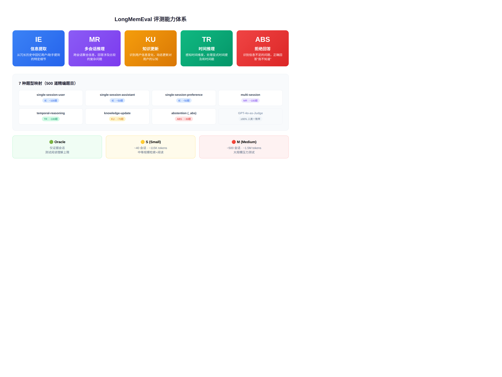
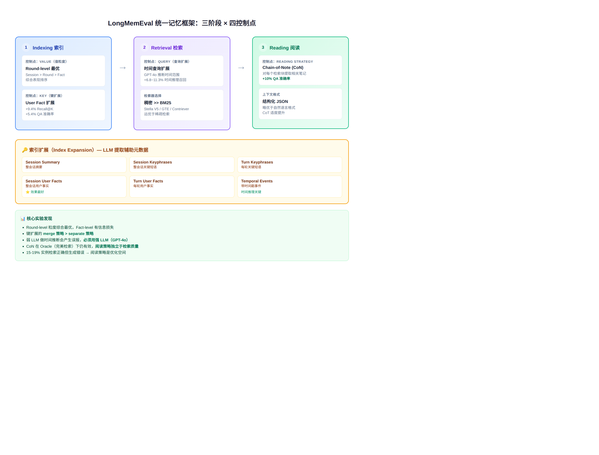

# LongMemEval 技术报告：评测、架构与自定义记忆系统接入指南

> 技术调研报告 | 2026-06-09 | 基于 arXiv:2410.10813 (ICLR 2025) + 源码深度分析

---

## 1. 概述

LongMemEval 是目前最全面的 LLM 长期记忆评测基准，由 UCLA、Tencent AI Lab 和 UC San Diego 联合提出。它针对**对话助手在长时间交互中的记忆能力**进行系统性评测，覆盖 5 大核心能力、7 种题型、500 道精编题目。

**核心定位：** 不只是"能不能记住"，而是"能不能正确地记、合理地忘、聪明地推理"。

**论文信息：**
- 作者：Di Wu, Hongwei Wang, Wenhao Yu, Yuwei Zhang, Kai-Wei Chang, Dong Yu
- 会议：ICLR 2025
- arXiv: [2410.10813](https://arxiv.org/abs/2410.10813)
- 代码: [github.com/xiaowu0162/LongMemEval](https://github.com/xiaowu0162/LongMemEval)
- 数据: [huggingface.co/datasets/xiaowu0162/longmemeval-cleaned](https://huggingface.co/datasets/xiaowu0162/longmemeval-cleaned)

---

## 2. 评测体系：5 大能力 × 7 种题型



### 2.1 能力定义

| 能力 | 缩写 | 定义 |
|------|------|------|
| **信息提取** | IE | 从冗长交互历史中回忆特定信息，包括用户或助手在单次会话中提到的细节 |
| **多会话推理** | MR | 综合多个历史会话的信息，回答涉及聚合和比较的复杂问题 |
| **知识更新** | KU | 识别用户个人信息的变化，动态更新对用户的认知 |
| **时间推理** | TR | 感知用户信息的时间维度，包括显式时间提及和交互中的时间戳元数据 |
| **拒绝回答** | ABS | 识别寻求未知信息的问题，正确回答"我不知道" |

### 2.2 题型映射

| 题型 | 对应能力 | 题目数 | 评分特点 |
|------|---------|--------|---------|
| `single-session-user` | IE | ~100 | 二值判断：回答是否包含正确答案 |
| `single-session-assistant` | IE | ~50 | 同上，但证据在助手回复中 |
| `single-session-preference` | IE | ~50 | 使用评分标准(rubric)，不要求完全匹配 |
| `multi-session` | MR | ~100 | 需跨会话聚合信息 |
| `temporal-reasoning` | TR | ~100 | **允许日期/周/月的 ±1 偏差** |
| `knowledge-update` | KU | ~70 | 只要包含**更新后的答案**即正确，不惩罚旧信息 |
| `*` (含 `_abs` 后缀) | ABS | ~30 | 判断模型是否正确识别"信息不足" |

### 2.3 三个难度级别

| 级别 | 规模 | Token 量 | 用途 |
|------|------|----------|------|
| **Oracle** | 仅证据会话 | 极少 | 测试阅读理解的上限 |
| **S (Small)** | ~40 会话 | ~115K tokens | 中等规模，测试检索+阅读 |
| **M (Medium)** | ~500 会话 | ~1.5M tokens | 大规模，压力测试 |

---

## 3. 数据构建：属性控制的 Needle-in-a-Haystack

### 3.1 属性本体 (Ontology)

论文设计了 **164 个用户属性**，分为 5 大类：

| 类别 | 示例属性 |
|------|---------|
| 生活方式 (Lifestyle) | 饮食偏好、运动习惯、作息时间 |
| 所属物品 (Belongings) | 车辆型号、宠物名字、电子设备 |
| 生活事件 (Life Events) | 旅行经历、工作变动、毕业院校 |
| 情境上下文 (Situations) | 当前住址、近期计划、健康状况 |
| 人口统计 (Demographics) | 年龄、职业、家庭结构 |

### 3.2 五阶段构建流程

```
阶段 1: 属性选择 → LLM 生成题目种子 + 证据陈述
    ↓
阶段 2: 属性控制生成 → 确保答案明确、难度可控
    ↓
阶段 3: 证据会话模拟 → Llama 3 70B 自对话（最多 10 轮）
        关键：用户 LLM 被指示"间接提及"证据信息
    ↓
阶段 4: 人工校验 → 专家审核 ~70% 的会话
        检查：(a) 证据完整 (b) 无信息泄露 (c) 口语化 (d) 自然结尾
    ↓
阶段 5: 时间戳分配 → 根据题目类型约束时间顺序
```

### 3.3 Needle-in-a-Haystack 编排

历史记录的组装采用**三源混合策略**：

| 来源 | 占比 | 作用 |
|------|------|------|
| ShareGPT 真实对话 | 25% | 提供多样化的话题和格式 |
| UltraChat 真实对话 | 25% | 补充不同风格的对话 |
| 模拟会话 | 50% | 主题/格式与证据会话相似但无冲突信息 |

证据会话在历史中的位置根据题型决定：
- **单跳题：** 随机位置
- **知识更新题：** 旧信息在前、新信息在后
- **时间推理题：** 按时间顺序排列，证据在特定时间窗口内

---

## 4. 系统架构：统一三阶段记忆框架

论文将任何记忆系统分解为三个阶段，每个阶段有可调的控制点：



### 4.1 Indexing（索引阶段）

**控制点：Value（值）**

| 粒度 | 描述 | 优劣 |
|------|------|------|
| Session-level | 整个会话作为一个文档 | 简单，但噪声多 |
| Round-level | 每轮 Q&A 作为一个文档 | 平衡精度和上下文 |
| Fact-level | 提取事实作为文档 | 精炼，但有信息损失 |

**实验结论：Round-level > Session-level > Fact-level（综合表现）**

**控制点：Key（键扩展）**

通过 LLM 从原始内容中提取辅助元数据，增强检索：

| 扩展类型 | 描述 | 提取粒度 |
|----------|------|---------|
| Session Summary | 会话摘要 | 整个会话 |
| Session Keyphrases | 关键短语 | 整个会话 |
| Turn Keyphrases | 关键短语 | 每轮对话 |
| Session User Facts | 用户事实 | 整个会话 |
| Turn User Facts | 用户事实 | 每轮对话 |
| Temporal Events | 带时间戳的事件 | 整个会话 |

**关键发现：用户事实扩展 (User Fact) 带来 +9.4% Recall@K 提升和 +5.4% QA 准确率提升。**

扩展内容的合并策略：

| 策略 | 操作 | 效果 |
|------|------|------|
| `separate` | 作为独立文档追加到索引 | 保留原始粒度 |
| `merge` | 预置到原文档前面 | 增强单文档表达 |
| `replace` | 完全替换原文档 | 最激进的信息压缩 |
| `split-*` | 先拆分再执行上述操作 | 细粒度扩展 |

**实验结论：`merge` 策略 > `separate` 策略（键合并优于排名合并）**

### 4.2 Retrieval（检索阶段）

**控制点：Query（查询扩展）**

| 方法 | 描述 | 效果 |
|------|------|------|
| 原始查询 | 直接用问题检索 | 基线 |
| 时间查询扩展 | LLM 推断问题涉及的时间范围 | +6.8~11.3% 时间推理召回 |
| 时间剪枝 | 将时间范围内的会话优先排序 | 进一步提升 |

**重要发现：** 弱 LLM（如 Llama 3.1 8B）做时间范围推断会产生大量误报，反而降低效果。必须使用强 LLM（如 GPT-4o）。

**检索器对比：**

| 检索器 | 类型 | 模型 | 特点 |
|--------|------|------|------|
| BM25 | 稀疏 | — | Whitespace 分词，基线 |
| Contriever | 稠密 | facebook/contriever | Mean pooling + 点积相似度 |
| Stella V5 | 稠密 | dunzhang/stella_en_1.5B_v5 | Mean pooling → 线性投影(1024d) → L2 归一化 |
| GTE | 稠密 | Alibaba-NLP/gte-Qwen2-7B-instruct | **Last-token pooling**，指令前缀，8192 max length |

**实验结论：稠密检索 >> BM25 稀疏检索**

### 4.3 Reading（阅读阶段）

**控制点：Reading Strategy（阅读策略）**

| 策略 | 描述 | 效果 |
|------|------|------|
| 直接阅读 | 将检索到的块直接拼入 prompt | 基线 |
| Chain-of-Note (CoN) | 对每个检索块调用 LLM 提取相关笔记 | **+10% QA 准确率** |
| Chain-of-Thought (CoT) | "Answer step by step" | 适度提升 |

**CoN 是论文的核心贡献之一：** 即使在完美检索（Oracle）条件下，CoN 仍然能带来显著提升，说明**阅读策略独立于检索质量**。

**上下文格式：**

```
### Session N:
Session Date: 2023/06/15 (Thu) 10:00
Session Content:
{"role": "user", "content": "..."}
{"role": "assistant", "content": "..."}
```

支持 JSON 和自然语言两种内容格式。实验表明结构化 JSON 格式略优。

---

## 5. 评测流程与代码解析

### 5.1 端到端评测 Pipeline

```
┌─────────────────────────────────────────────────────────┐
│                    LongMemEval Pipeline                  │
│                                                         │
│  ┌──────────┐    ┌───────────┐    ┌──────────────────┐  │
│  │  Data     │───▶│ Retrieval │───▶│   Generation     │  │
│  │  (JSON)   │    │  Engine   │    │   (LLM Answer)   │  │
│  └──────────┘    └───────────┘    └──────────────────┘  │
│       │                                    │             │
│       │          ┌───────────────┐         │             │
│       └─────────▶│  Index        │◀────────┘             │
│                  │  Expansion    │                       │
│                  └───────────────┘                       │
│                                      ┌──────────────┐   │
│                                      │  evaluate_qa  │   │
│                                      │  (LLM Judge)  │   │
│                                      └──────────────┘   │
│                                              │           │
│                                      ┌──────────────┐   │
│                                      │ print_metrics │   │
│                                      └──────────────┘   │
└─────────────────────────────────────────────────────────┘
```

### 5.2 关键代码文件

| 文件 | 功能 | 关键逻辑 |
|------|------|---------|
| `run_retrieval.py` | 检索引擎 | BM25 / Contriever / Stella / GTE，支持 session 和 turn 粒度 |
| `run_generation.py` | 答案生成 | RAG 模式 / 全量上下文模式，支持 CoN、CoT、扩展合并 |
| `evaluate_qa.py` | LLM-as-Judge | GPT-4o 做裁判，按题型使用不同评分 prompt，temperature=0，max_tokens=10 |
| `print_qa_metrics.py` | 指标聚合 | 分题型准确率 + 任务平均 + 总体平均 + 拒绝回答准确率 |
| `eval_utils.py` | 检索指标 | Recall@K、NDCG@K，支持 turn→session 级别转换 |

### 5.3 LLM-as-Judge 评分细节

`evaluate_qa.py` 的 `get_anscheck_prompt` 函数为每种题型定制评分标准：

**标准题型（single-session-user/assistant, multi-session）：**
```
判断标准：response 是否包含正确答案？
- 等价表述或完整中间步骤 → yes
- 只包含部分信息 → no
```

**时间推理题型（temporal-reasoning）：**
```
同上，但允许日期/周/月的 ±1 偏差
例：答案 18 天，模型回答 19 天 → 仍然正确
```

**知识更新题型（knowledge-update）：**
```
只要 response 包含更新后的答案即正确
即使同时包含旧信息也不扣分
```

**偏好题型（single-session-preference）：**
```
使用 rubric（评分标准）而非精确答案
正确回忆并利用用户个人信息即算正确
```

**拒绝回答题型（abstention，question_id 含 _abs）：**
```
判断模型是否正确识别问题不可回答
- 信息不完整 → 应拒绝
- 信息中不包含所问内容 → 应拒绝
```

评分参数：`temperature=0, max_tokens=10`，判断 `'yes' in response.lower()`

### 5.4 检索指标

| 指标 | 定义 | 粒度 |
|------|------|------|
| `recall_any@K` | Top-K 中是否包含**任一**正确文档 | session / turn |
| `recall_all@K` | Top-K 中是否包含**所有**正确文档 | session / turn |
| `ndcg_any@K` | 标准 NDCG，二值相关性 | session / turn |

评测在 K={1, 3, 5, 10, 30, 50} 上计算。Turn 级别指标通过去除 ID 后缀 `_N` 转换为 session 级别。

---

## 6. 实验结果与关键发现

### 6.1 商用系统表现

在简化设置（3-6 个会话）下：

| 系统 | IE | MR | KU | TR |
|------|----|----|----|----|
| ChatGPT (GPT-4o-mini) | 100% | 64.7% | 66.7% | 65.2% |
| ChatGPT (GPT-4o) | 68.8% | 44.1% | 83.3% | 43.5% |
| Coze (GPT-3.5-turbo) | 62.5% | 11.8% | 37.5% | 4.3% |
| Coze (GPT-4o) | 81.3% | 14.7% | 20.8% | 39.1% |

**关键发现：商用系统即使在最简单的设置下也只有 30-70% 的准确率。**

### 6.2 长上下文 LLM 的"Lost-in-the-Middle"

在 LongMemEval S（~115K tokens）上，长上下文 LLM 相比 Oracle 检索有 **30-60% 的性能下降**，证实了"中间信息丢失"问题的严重性。

### 6.3 优化效果汇总

| 优化 | 效果 |
|------|------|
| 用户事实键扩展 | +9.4% Recall@K, +5.4% QA 准确率 |
| 时间查询扩展（GPT-4o） | +6.8~11.3% 时间推理召回 |
| Chain-of-Note 阅读策略 | +10% QA 准确率 |
| 稠密检索 vs BM25 | 显著优于稀疏检索 |
| Round-level 粒度 | 综合最优（优于 Session 和 Fact） |

### 6.4 错误分析

- **15-19% 的题目**检索正确但生成错误（占所有错误的 40-50%）
- **~90% 的正确回答**依赖于正确检索 → 说明基准质量高（检索是瓶颈）

---

## 7. 接入自定义记忆系统

### 7.1 核心接口

你只需要实现两个接口：

```python
def ingest(session_id: str, date: str, messages: list[dict]):
    """
    将一个会话写入记忆系统
    
    参数：
      - session_id: 会话标识，如 "answer_session_1"
      - date: 时间戳，如 "2023/06/15 (Thu) 10:00"
      - messages: [{"role": "user", "content": "..."}, ...]
    
    你的系统负责：存储、索引、去重、合并
    """

def retrieve_and_answer(question: str, question_date: str) -> str:
    """
    从记忆中检索并回答问题
    
    参数：
      - question: 用户问题
      - question_date: 提问时间
    
    返回：回答字符串
    """
```

### 7.2 完整评测脚本

```python
import json

# ====== 加载 LongMemEval 数据 ======
data = json.load(open("data/longmemeval_oracle.json"))

# ====== 你的记忆系统（替换为实际实现）======
class MyMemorySystem:
    def __init__(self):
        self.memories = []
    
    def reset(self):
        """每个评测实例之间需要重置"""
        self.memories = []
    
    def ingest(self, session_id, date, messages):
        for msg in messages:
            self.memories.append({
                "session_id": session_id,
                "date": date,
                "role": msg["role"],
                "content": msg["content"]
            })
    
    def retrieve_and_answer(self, question, question_date):
        # 你的检索 + 生成逻辑
        context = "\n".join(
            f"{m['role']}: {m['content']}" for m in self.memories
        )
        # 调用你的 LLM 生成回答
        return generate_answer(question, context, question_date)

# ====== 评测循环 ======
mem = MyMemorySystem()
results = []

for instance in data:
    mem.reset()
    
    # 1. 写入所有历史会话
    for sid, date, session in zip(
        instance["haystack_session_ids"],
        instance["haystack_dates"],
        instance["haystack_sessions"]
    ):
        mem.ingest(sid, date, session)
    
    # 2. 查询并获取回答
    answer = mem.retrieve_and_answer(
        instance["question"],
        instance["question_date"]
    )
    
    results.append({
        "question_id": instance["question_id"],
        "hypothesis": answer
    })

# 3. 保存结果
with open("my_output.jsonl", "w") as f:
    for r in results:
        f.write(json.dumps(r, ensure_ascii=False) + "\n")
```

### 7.3 运行评测

```bash
# 安装依赖
pip install openai

# 下载数据
python -c "
from huggingface_hub import hf_hub_download
for f in ['longmemeval_oracle.json', 'longmemeval_s_cleaned.json']:
    hf_hub_download(repo_id='xiaowu0162/longmemeval-cleaned', filename=f, local_dir='data')
"

# 运行评测（需要 OpenAI API Key）
export OPENAI_API_KEY=***
python src/evaluation/evaluate_qa.py gpt-4o my_output.jsonl data/longmemeval_oracle.json

# 查看细分指标
python src/evaluation/print_qa_metrics.py my_output.jsonl.eval-results-gpt-4o
```

### 7.4 推荐评测路径

```
阶段 1: Oracle 基线
  └─ 用全量上下文跑 oracle 数据 → 验证流程 + 建立阅读理解上限

阶段 2: 你的系统（小规模）
  └─ 用你的记忆系统跑 oracle 数据 → 对比全量上下文

阶段 3: 你的系统（大规模）
  └─ 用你的记忆系统跑 s_cleaned 数据 → 测试检索能力

阶段 4: 优化迭代
  └─ 调整检索策略 → 重新跑 s_cleaned → 对比前后指标
```

---

## 8. 与其他 Benchmark 的对比

| 维度 | LongMemEval | LoCoMo | PersonaMem | HaluMem | MemBench |
|------|-------------|--------|------------|---------|----------|
| 题目数 | 500 | ~300 对话 | 180+ 用户 | 15K 记忆点 | — |
| 信息提取 | ✅ | ✅ | | | ✅ |
| 多跳推理 | ✅ | ✅ | | | |
| 跨会话推理 | ✅ | ✅ | ✅ | ✅ | ✅ |
| 时间推理 | ✅ | ✅ | ✅ | | |
| 知识更新 | ✅ | | | ✅ | |
| 拒绝回答 | ✅ | | | | |
| 个性化 | ✅ | | ✅ | | |
| 幻觉检测 | | | | ✅ | |
| 可扩展历史长度 | ✅ | | | | ✅ |
| 开源评测工具 | ✅ | ✅ | ✅ | | ✅ |
| 发表会议 | ICLR 2025 | ACL 2024 | arXiv 2025 | arXiv 2025 | arXiv 2025 |

**LongMemEval 的独特优势：**
1. 唯一覆盖**拒绝回答**能力的基准
2. 历史长度**可自由扩展**（Oracle → S → M → 自定义）
3. **属性控制**的题目生成，保证答案明确性
4. **GPT-4o-as-judge** 与人类标注者 ≥90% 一致

---

## 9. 总结

### 核心价值

LongMemEval 提供了一个**标准化、可扩展、多维度**的记忆系统评测框架。它不仅测量"记住了没有"，还测量"推理对不对"、"时间感准不准"、"该忘的忘没忘"。

### 对自定义记忆系统开发者的意义

1. **不需要从零构建评测体系** — 提供 `ingest` + `retrieve_and_answer` 两个接口即可接入
2. **可以纵向对比** — 每次迭代跑一次，看分题型准确率变化
3. **可以横向对比** — 与 LongMemEval 论文中的基线和 SOTA 系统对比
4. **工程指标独立** — 延迟、Token 消耗等需要自己额外测量

### 建议

| 优先级 | 事项 |
|--------|------|
| P0 | 跑 Oracle 基线，验证你的系统在理想检索下的阅读能力 |
| P1 | 跑 S 数据，测试检索+阅读的综合能力 |
| P2 | 实现用户事实提取扩展，预期 +5% 准确率 |
| P3 | 实现时间查询扩展，预期 +7% 时间推理召回 |
| P4 | 尝试 Chain-of-Note 阅读策略，预期 +10% 准确率 |

---

## 参考资料

- [LongMemEval 论文 (arXiv:2410.10813)](https://arxiv.org/abs/2410.10813)
- [LongMemEval GitHub](https://github.com/xiaowu0162/LongMemEval)
- [LongMemEval HuggingFace 数据集](https://huggingface.co/datasets/xiaowu0162/longmemeval-cleaned)
- [LoCoMo (ACL 2024)](https://arxiv.org/abs/2402.17753)
- [PersonaMem](https://arxiv.org/abs/2504.14225)
- [HaluMem](https://arxiv.org/abs/2511.03506)
- [Supermemory MemoryBench](https://github.com/supermemoryai/memorybench)
