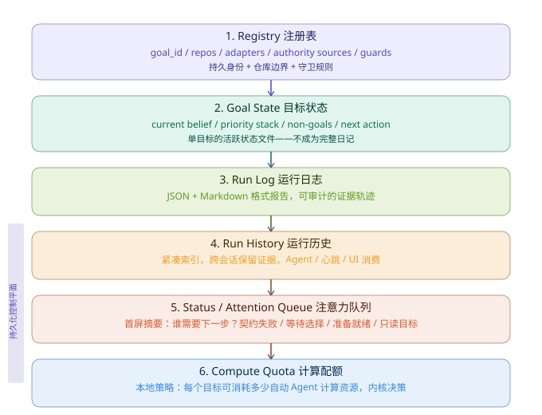
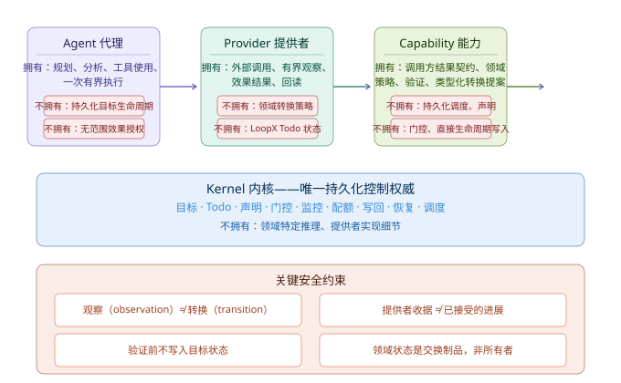
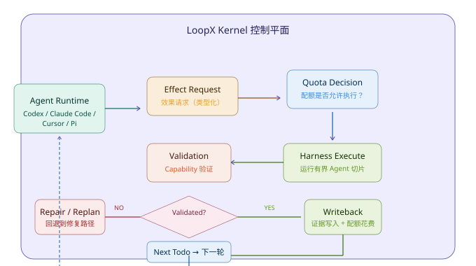

# LoopX 深度调研：面向长程 AI Agent 的轻量级控制平面

> **核心发现：LoopX 不是 Agent 框架，而是跨会话的目标生命周期控制平面——用效果解释器+四角色分离管理数字员工。**
> 调研日期：2026-08-10 | 来源：GitHub (huangruiteng/loopx) 源码与架构文档

## 一、概览

LoopX 是一个轻量级、提供者中立的 Python 控制平面（Control Plane），专门为长时间运行的 AI Agent 团队设计。它将跨多轮、跨 Agent 的目标状态、检查点、待办事项、证据记录和配额管理抽象为独立于任何特定 Agent 运行时的持久层。

| 指标 | 数值 |
|------|------|
| Stars | 3,810 |
| Forks | 312 |
| 语言 | Python (3.11+) |
| 许可证 | MIT |
| 总提交 | 4,243 Commits |
| 创建时间 | 2026-05-31 |
| 最新版本 | v0.4.4 (2026-08-10) |
| Open Issues | 18 |
| 项目定位 | 控制平面 (Control Plane) |
| 支持平台 | macOS / Linux |


> 上图展示 LoopX 的六层持久化控制平面。自顶向下依次是：注册表（持久身份）、目标状态（当前信念）、运行日志（可审计证据）、运行历史（紧凑索引）、注意力队列（首屏摘要）、计算配额（消耗控制）。核心洞察：**观察不是转换**——只有经过 Capability 验证和 Kernel 提交的结果，才计入目标进展。

**为什么重要？** 当前 Agent 工具（Claude Code、Codex CLI、Cursor 等）擅长单次会话内的任务执行，但在跨越数天、数周的目标管理上近乎空白。你无法在 Claude Code 里设一个“帮我跟踪这个 bug 跨 5 天、3 个 Agent 的修复进度”。LoopX 填补的正是这个控制层的空白——它不写代码，但它管理“谁在什么时候做什么、做到什么程度了、下一步该谁上”。在 72 天内从 0 冲到 3,810 Stars，说明这个需求被市场严重低估了。

---

## 二、核心架构：控制平面而非 Agent 框架

**本节结论：** LoopX 用“效果解释器”架构和四角色运行时分离，实现了与 LangGraph/CrewAI/AutoGPT 在抽象层次上的根本性差异——它不是编排 Agent 的框架，而是治理 Agent 生命周期的控制平面。

### 2.1 控制平面的定位

LoopX 的架构文档开篇即划清边界：

> “The core repository intentionally avoids domain logic. A data experiment goal, a note-maintenance goal, and a harness self-improvement goal should share the same runtime and contract, but use different adapters.”

核心仓库刻意避免领域逻辑，所有目标类型共享同一运行时契约，由不同适配器完成领域特定转换。这与 LangGraph 将图状态机绑定到具体工作流的做法完全相反。

### 2.2 效果解释器：函数式控制循环

LoopX 将整个 Agent 控制循环建模为效果解释器（Effect Interpreter）：

```
model → effect request → harness interprets effect → observation → model
```

| 角色 | 含义 | LoopX 对应组件 |
|------|------|----------------|
| 读取模型 (A) | 注册表 + 目标状态 + 运行历史 | Registry + Goal State + Run History |
| 投影 (F[B]) | 状态、注意力队列、紧凑运行摘要 | Status / Attention Queue |
| 决策 (A → F[QuotaDecision]) | 配额、交互契约、能力门控 | Quota + Gates + Capability gates |
| 数据编码处理器 | CLI 动作、调度器确认、写回 | `next_effect`，`quota spend-slot` |

Agent 不直接调用工具，而是产出**效果请求**（Effect Request），由内核解释后决定是否执行、如何执行。这从根本上解决了 AutoGPT 等框架中 Agent 自由执行多步骤的安全问题。

**我的判断：** 这个设计是函数式编程中“纯解释器”思维在 Agent 控制中的成功应用——将副作用延迟和隔离到内核层，让 Agent 代码保持纯函数式的声明性。代价是增加了架构复杂度，但换来了可审计、可中止、可回滚的确定性保障。

### 2.3 四角色运行时分离

LoopX 最核心的架构决策是严格分离四个运行时责任：


> 上图展示 Agent、Provider、Capability、Kernel 四层运行时责任方的拥有项和不拥有项。底部四条关键约束构成了 LoopX 的安全模型基础。

**请求与结果路径：**
```
Agent → Capability → Provider → external system
external observation → Provider → Capability
typed transition proposal → LoopX Kernel → next todo/gate/monitor/turn
```

### 2.4 Turn 决策词汇

LoopX 使用严格类型化的 Turn 决策，而非自然语言的模糊表述：

| 路由类型 (执行前) | 含义 |
|-----------|------|
| `ready_for_host` | 准备就绪，可执行 |
| `repair_required` | 需要修复 |
| `replan_required` | 需要重新规划 |
| `user_action_required` | 需要用户操作 |
| `blocked` | 被阻塞 |
| `contract_error` | 契约错误 |

| 结果类型 (执行后) | 含义 |
|-----------|------|
| `validated_progress` | 已验证的进展 |
| `validated_completion` | 已验证的完成 |
| `host_failure` | 主机执行失败 |
| `validation_failed` | 验证失败 |
| `writeback_failed` | 写回失败 |

`validated_progress` 和 `validated_completion` 被明确区分——进展不等于完成。这与大多数 Agent 框架的二元成功/失败模型形成了鲜明对比。

---

## 三、关键概念与核心 CLI 循环

**本节结论：** LoopX 的核心概念（Goal、Todo、Quota、Evidence、Handoff）共同构成了一个“数字员工管理”的最小完备操作集，其 CLI 循环实现了从调度到消耗的完整控制流。

### 3.1 核心概念

| 概念 | 定义 | 设计约束 |
|------|------|----------|
| **Goal 目标** | `goal_id` 是稳定边界，一个目标 = 注册表条目 + 活跃状态文件 + 配额通道 + 运行历史流 + 状态投影 | 可跨年持久，但每次 Agent 轮次必须通过当前权威、边界、配额、验证和写回 |
| **Todo 待办** | `todo_id` 寻址的结构化工作项，投影为 Agent 或用户的工作项 | LoopX 中没有独立的 Issue 对象——Todo 就是工作项 |
| **Quota 配额** | 本地策略，决定每个目标可消耗多少自动 Agent 计算资源 | 内核决策，`quota should-run` / `interaction_contract` / `protocol_action_packet` 是心跳调度器输出 |
| **Evidence 证据** | 运行历史中的紧凑证据轨迹，跨会话保留 | 写回证据仅对已接受的任务结果有效，收据必须经过能力验证和内核提交 |
| **Handoff 交接** | 门控交接包，从一个 Agent 切片传递给下一个 | 与权威注册表、当前信念待办、验证表面映射并列，是 LoopX 吸收的现场测试项目控制机制 |
| **Gates 门控** | 将人类判断附加到具体转换 | 与配额、奖励一起构成控制机制 |

### 3.2 核心 CLI 循环

```bash
loopx quota should-run      # 注册的 Agent 现在应该行动吗？
loopx todo claim            # 谁拥有这个切片？
loopx todo update           # 发生了什么变化？
loopx refresh-state         # 下一个轮次应该看到什么？
loopx quota spend-slot      # 核算一个已完成、已验证的切片
```

### 3.3 完整控制流程


> 上图展示 LoopX 效果解释器的完整决策循环。Agent 产出效果请求后，依次经过配额检查、执行、验证、写回四个阶段。验证失败时回退到修复路径。完成后返回 Agent 并携带 Todo、证据和交接包。

---

## 四、Agent 宿主生态与多宿主支持

**本节结论：** LoopX 已适配 7 种 Agent 宿主，采用适配器模式实现跨运行时的一致性控制，同时保持提供者中立的架构。

### 4.1 支持的宿主

| 宿主 | 集成方式 | 状态 |
|------|----------|------|
| **Codex App** | 心跳自动化，基于 `quota should-run.scheduler_hint` | 稳定 |
| **Codex CLI** | `/skills` 中的 `$loopx <任务>` | 稳定 |
| **Claude Code** | `/loopx <任务>` + `/loop` 适配器 | 稳定 |
| **OpenCode** | 静态命令 facade + 可选 `--with-goal-bridge` | 稳定 |
| **Pi** | `/loopx <任务>` 一等公民路径 (v0.4.2) | 稳定 |
| **TraeX** | 一等公民 host，可选调度器提示 (v0.4.2) | 实验 |
| **Cursor / Shell** | 手动连接或由 runner 调用 | 基本 |

### 4.2 安装与上手

```bash
curl -fsSL https://huangruiteng.github.io/loopx/install.sh | bash
export PATH="$HOME/.local/bin:$PATH"
loopx doctor
cd /path/to/your-project
loopx connect
loopx status
```

---

## 五、竞品对比：LoopX vs Agent 框架

**本节结论：** LoopX 与 LangGraph、CrewAI、AutoGPT 不是竞品关系，而是互补关系——LoopX 是消费会话运行时摘要并产出目标级控制投影的上层控制平面。

| 维度 | LoopX | LangGraph | CrewAI | AutoGPT |
|------|-------|-----------|--------|---------|
| **抽象层次** | 目标控制平面 | 图状态机编排 | 角色扮演编排 | 自主代理循环 |
| **状态持久化** | 跨会话的终身目标状态 | 会话内图状态 | 任务级状态 | 会话级记忆 |
| **权限模型** | 四角色分离 (Agent/Provider/Capability/Kernel) | 节点内工具调用 | 代理工具访问 | 直接工具调用 |
| **配额控制** | 内核级配额决策 + 心跳调度 | 无内置配额 | 无内置配额 | 步骤数量限制 |
| **验证层** | 独立的 Capability 验证+写回 | 条件边 | 任务完成检查 | 自评估 |
| **多 Agent** | 对等身份、软声明/硬租约 | 图节点并行 | 角色协作 | 单代理为主 |
| **目标生命周期** | 年跨度，跨执行器 | 图执行周期 | 任务周期 | 会话周期 |
| **效果模型** | 效果解释器 (效果请求+内核决策) | 图执行 (直接调用) | 工具代理 (委派) | 自主循环 (连续调用) |
| **语言** | Python | Python | Python | Python |
| **安装复杂度** | curl 一键安装 | pip install | pip install | pip/git clone |

**我的看法：** LoopX 和 LangGraph 等框架实际处于不同层次，可以组合使用。比如用 LangGraph 编排单次 Agent 会话的具体工作流，用 LoopX 管理跨多次会话的持久化目标状态。这种"控制平面 + 执行框架"的组合模式，可能是企业级 Agent 应用落地的可行路径之一——但还需在真实项目中验证。

**一个尚待解决的问题是：** LoopX 当前仅支持本地单机运行（本地文件系统存储状态），对于需要跨机器、跨团队共享目标的场景，还需等待其服务器/守护进程路线图的落地。

---

## 六、批判性分析

### 6.1 优势

1. **抽象层次清晰。** 严格区分控制平面和执行运行时，不做 Agent 框架该做的事，专注持久化目标生命周期。在当前"万物皆 Agent 框架"的市场中，这种克制设计具有参考价值。

2. **函数式安全模型。** 效果解释器架构确保 Agent 的每个行为都经过配额检查、执行、验证、写回四阶段。Agent 不能绕过内核直接生效，这为长期自动化提供了安全基础。

3. **多宿主中立设计。** 不绑定任何特定 Agent 运行时，通过适配器模式支持 Codex、Claude Code、Cursor、Pi 等 7 种宿主，避免了供应商锁定。

4. **类型化决策系统。** `LoopXTurnRoute` 和 `LoopXTurnResultKind` 两大类型系统替代了模糊的自然语言状态描述，使跨 Agent 的状态机转换可审计、可测试。

5. **社区活跃度高。** 72 天 3,810 Stars、4,243 提交、10+ 外部贡献者，从 v0.2 到 v0.4.4 高速迭代，版本稳定性承诺（no persisted-state migration）降低了采用风险。

### 6.2 不足与风险

1. **本地单机限制。** 当前仅支持本地文件系统存储，无分布式状态共享。对于团队协作场景（多个开发者共用同一目标空间），尚不可用。这限制了其在企业环境中的实用性。

2. **早期版本的不确定性。** v0.4.x 仍处于早期可用阶段，部分宿主集成（Pi、TraeX）标记为实验性，Planner-Worker 多 Agent 架构仍在实验中。在生产环境中采用需评估风险。

3. **学习曲线较陡。** 效果解释器、四角色分离、Turn 决策词汇、配额系统等概念对初次接触的开发者有较高认知负担。需要理解“控制平面”这个抽象层次本身。

4. **缺乏可视化界面。** 当前的 `loopx status` CLI 输出是文本格式，虽然有代理原生看板（Agent-Native Kanban）的概念设计，但尚未提供完整的 Web UI。在管理多个长期目标时，纯 CLI 的可读性有限。

5. **模型依赖未被显式管理。** LoopX 依赖 Agent 宿主调用 LLM，但自身不管理模型授权、成本追踪、速率限制等。在多宿主多目标的场景下，这可能成为管理盲区。

### 6.3 适用场景判断

| 场景 | 适合？ | 原因 |
|------|--------|------|
| 单人多天跨会话的编码/研究/实验目标 | ✅ 高度适合 | LoopX 的设计原点 |
| 多人协作的多 Agent 工程目标 | ⚠️ 部分适合 | 服务器版未发布，需共享文件系统 |
| 短期（<1h）单次会话任务 | ❌ 不适合 | 用 Agent 框架更简单 |
| 生产级自动化部署/运维 | ❌ 不适合 | 项目明确声明“不是生产自动化控制器” |
| 学术研究（可复现实验） | ✅ 适合 | 证据记录和 run history 天然支持可复现性 |

---

## 七、对 Hermes/CodeBuddy 的启示

**本节结论：** LoopX 的四角色分离、效果解释器和配额系统，为 WorkBuddy/CodeBuddy 在长程 Agent 治理方面的设计提供了三条可迁移的参考。

### 7.1 可迁移设计参考

1. **效果解释器模式。** CodeBuddy 当前是 Agent 直接执行工具调用，可借鉴 LoopX 的效果解释器——Agent 产出“效果提案”，由 CodeBuddy 内核（权限系统/沙箱/配额层）解释执行。这比当前的“权限审批 + 直接执行”更结构化，特别适合高风险操作（删除文件、执行 Shell 命令、外部 API 调用）。

2. **Todo 作为一等公民。** LoopX 没有独立的 Issue 系统，Todo 就是工作项。CodeBuddy 可以考虑将当前的自动化任务（Automation）与 Todo 统一为持久化工作项，支持跨会话的声明、认领、验证和交接。

3. **配额系统启发。** LoopX 的 `quota should-run` → `todo claim` → `todo update` → `quota spend-slot` 循环，可以映射到 CodeBuddy 的自动化执行模型——在定时任务触发后，先检查配额是否允许执行，再认领工作项，完成后核算配额消耗。

### 7.2 差异化机会

LoopX 当前不做 Agent 执行（不写代码、不调工具），这正是 CodeBuddy 的互补方向——可以将 CodeBuddy 定位为 LoopX 的一个 Agent 宿主（通过适配器），让 LoopX 管理目标，CodeBuddy 负责执行。

### 7.3 风险提示

LoopX 的设计理念与 CodeBuddy 的“一体式助手”定位有根本性哲学差异——LoopX 倾向于显式控制（配额、门控、验证），而 CodeBuddy 倾向于无缝自动。引入控制平面层时需要在“控制精度”和“用户体验流畅度”之间做取舍。

---

## 八、参考来源

| 来源 | 链接 |
|------|------|
| GitHub 仓库 | https://github.com/huangruiteng/loopx |
| 架构文档 | https://github.com/huangruiteng/loopx/blob/main/docs/architecture.md |
| 中文 README | https://github.com/huangruiteng/loopx/blob/main/README.zh-CN.md |
| 状态交互模型 | https://github.com/huangruiteng/loopx/blob/main/docs/state-interaction-model.md |
| 配额分配文档 | https://github.com/huangruiteng/loopx/blob/main/docs/quota-allocation.md |
| 用户手册（飞书） | https://my.feishu.cn/wiki/CaL5wMk9ui17ngkWzeUcMlAYnZg |
| 官方站点 | https://huangruiteng.github.io/loopx/ |
| 控制平面课程（9 讲） | https://github.com/huangruiteng/loopx/blob/main/docs/development/control-plane-course/README.md |
| Releases | https://github.com/huangruiteng/loopx/releases |
| Discord 社区 | https://discord.gg/XmGgQyCFZd |
| 微信联系（维护者） | `huangrt00`（备注 LoopX） |
| 合作伙伴 OpenViking | https://github.com/volcengine/OpenViking |
| 合作伙伴 NoKV | https://github.com/NoKV-Lab/NoKV |

---

> *报告生成时间: 2026-08-10 · 调研工具: GitHub API + WebFetch 深度抓取 · 插图: 3 张 SVG 架构图*
