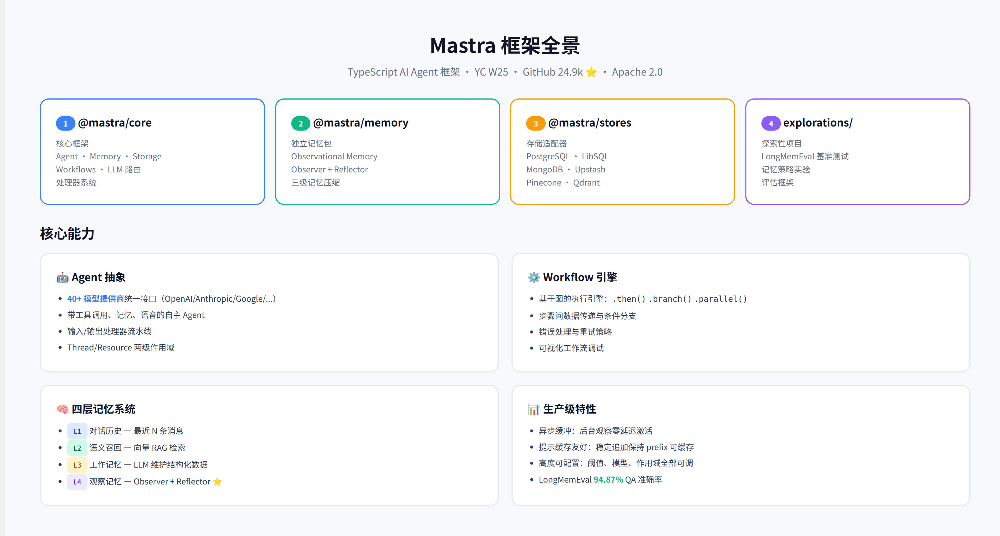
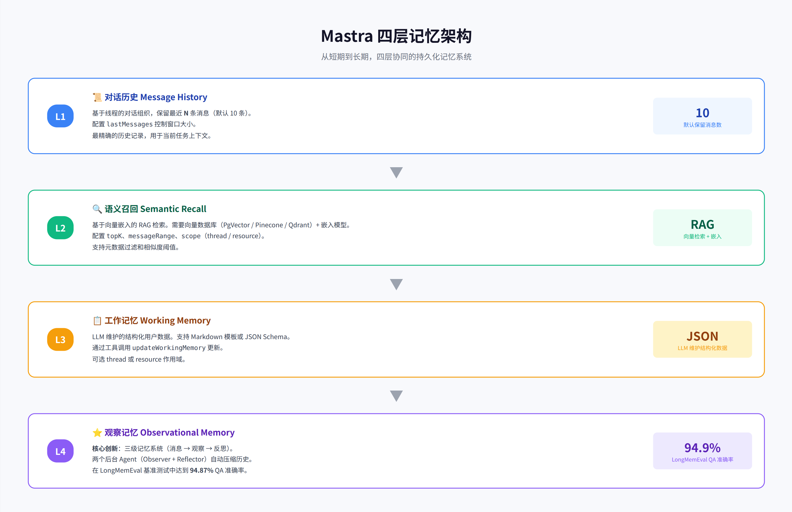
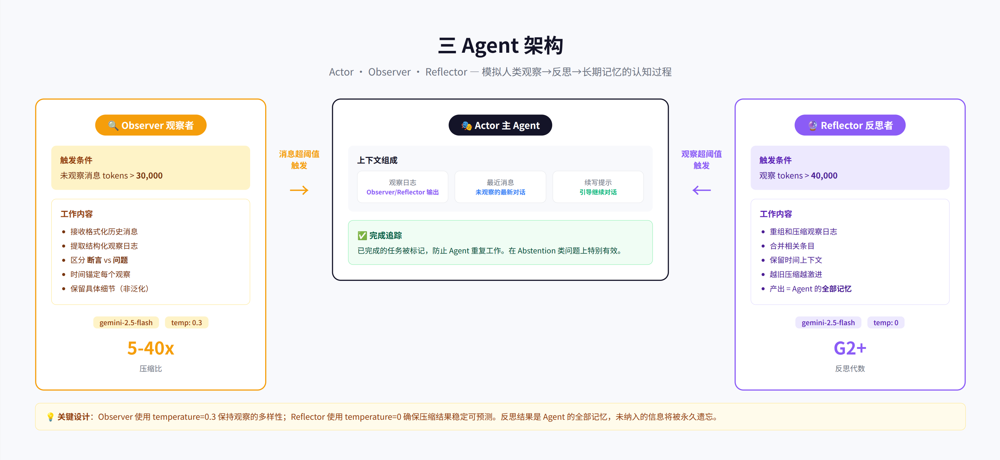
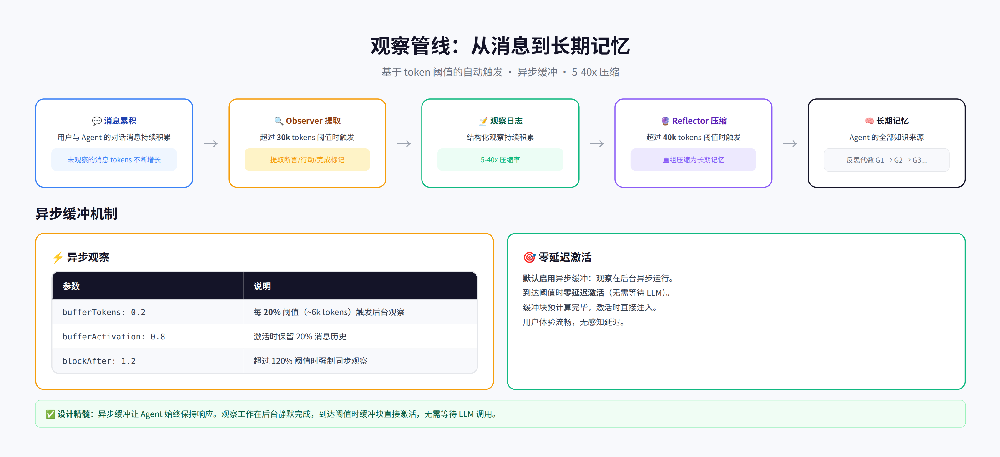
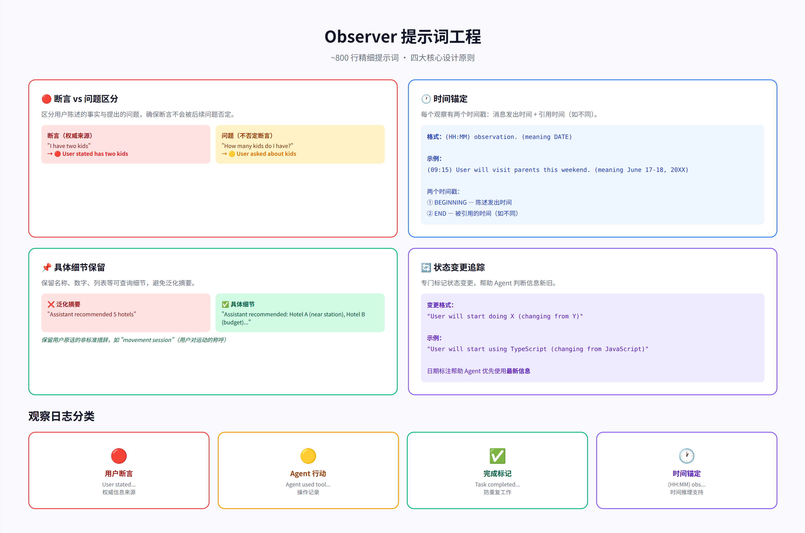
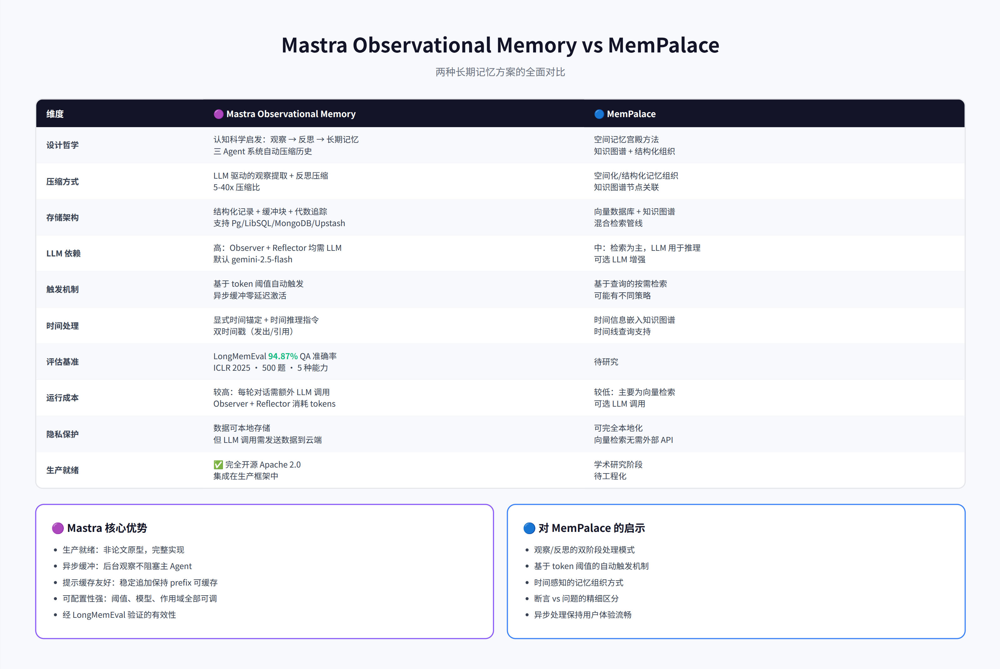

# Mastra Observational Memory 深度分析

## 1. Mastra 框架全景

**Mastra** 是由 Gatsby 团队创建的 TypeScript AI Agent 框架，GitHub 星标 24.9k，Y Combinator W25 孵化项目，Apache 2.0 开源。

Mastra 采用模块化架构，四个核心包各司其职：

| 包名 | 职责 | 关键组件 |
|------|------|----------|
| `@mastra/core` | 核心框架 | Agent、Memory、Storage、Workflows、LLM 路由 |
| `@mastra/memory` | 独立记忆包 | Observational Memory、Observer + Reflector |
| `@mastra/stores` | 存储适配器 | PostgreSQL、LibSQL、MongoDB、Upstash |
| `explorations/` | 探索性项目 | LongMemEval 基准测试、记忆策略实验 |

核心能力包括：40+ 模型提供商统一接口、带工具调用和记忆的自主 Agent、基于图的工作流引擎、以及**四层记忆系统**——这是本文的重点。

---

## 2. 四层记忆架构

Mastra 的记忆系统是**四层架构**，从短期到长期逐层递进：

| 层级 | 名称 | 机制 | 作用 |
|------|------|------|------|
| L1 | 对话历史 | 保留最近 N 条消息（默认 10） | 精确的近期上下文 |
| L2 | 语义召回 | 向量嵌入 RAG 检索 | 跨会话语义搜索 |
| L3 | 工作记忆 | LLM 维护的结构化数据 | 持久化用户画像 |
| L4 | ⭐ 观察记忆 | Observer + Reflector 自动压缩 | 长期记忆（本文重点） |

**L1 对话历史**基于线程组织，配置 `lastMessages` 控制窗口大小。最精确但容量有限。

**L2 语义召回**需要向量数据库（PgVector / Pinecone / Qdrant）+ 嵌入模型。配置 `topK`、`messageRange`、`scope`（thread / resource），支持元数据过滤和相似度阈值。

**L3 工作记忆**是 LLM 维护的结构化用户数据，支持 Markdown 模板或 JSON Schema，通过工具调用 `updateWorkingMemory` 更新。

**L4 观察记忆**是 Mastra 的核心创新——三级记忆系统（消息 → 观察 → 反思），两个后台 Agent 自动压缩历史，在 LongMemEval 上达到 **94.87%** QA 准确率。

---

## 3. 三 Agent 架构

Observational Memory 的核心是三个 Agent 协同工作：

### Actor（主 Agent）

Actor 是用户直接交互的 Agent，它的上下文由三部分组成：
- **观察日志**：Observer / Reflector 输出的压缩记忆
- **最近消息**：未被观察的最新对话
- **续写提示**：引导 Agent 继续对话

### Observer（观察者）

- **触发条件**：未观察的消息 tokens 超过 **30,000**
- **模型**：gemini-2.5-flash，temperature=0.3
- **工作**：从消息中提取结构化观察日志
- **压缩比**：5-40x

### Reflector（反思者）

- **触发条件**：观察 tokens 超过 **40,000**
- **模型**：gemini-2.5-flash，temperature=0
- **工作**：重组和压缩观察日志
- **关键**：反思结果是 Agent 的**全部记忆**，未纳入的信息将被永久遗忘

> 💡 Observer 使用 temperature=0.3 保持观察多样性；Reflector 使用 temperature=0 确保压缩结果稳定可预测。

---

## 4. 观察管线详解

从原始消息到长期记忆，经历以下管线：

### 4.1 Observation（观察）阶段

1. 消息持续累积，未观察的 token 数不断增长
2. 达到 **30k token 阈值**时，Observer Agent 被触发
3. Observer 接收格式化历史消息，输出结构化观察
4. 压缩比通常 **5-40x**

### 4.2 Reflection（反思）阶段

1. 观察日志持续累积
2. 达到 **40k token 阈值**时，Reflector Agent 被触发
3. Reflector 重组和压缩观察，合并相关条目
4. 越旧的观察压缩越激进，近期保留更多细节

### 4.3 异步缓冲机制

异步缓冲是 Mastra 的生产级设计精髓：

| 参数 | 值 | 含义 |
|------|-----|------|
| `bufferTokens` | 0.2 | 每 20% 阈值（~6k tokens）触发后台观察 |
| `bufferActivation` | 0.8 | 激活时保留 20% 消息历史 |
| `blockAfter` | 1.2 | 超过 120% 阈值时强制同步观察 |

**工作原理**：观察在后台异步运行，缓冲块预计算完毕。到达阈值时**零延迟激活**（无需等待 LLM），用户体验完全无感知。

> ✅ 设计精髓：异步缓冲让 Agent 始终保持响应。观察工作在后台静默完成，到达阈值时缓冲块直接注入。

---

## 5. Observer 提示词工程

Observer 的系统提示词约 800 行，包含四大核心设计原则：

### 5.1 断言 vs 问题区分

这是最关键的设计——区分用户陈述的事实与提出的问题：

- 🔴 **断言**（权威来源）：`"I have two kids"` → `User stated has two kids`
- 🟡 **问题**（不否定断言）：`"How many kids?"` → `User asked about kids`

确保用户陈述的事实不会被后续问题否定。

### 5.2 时间锚定

每个观察有两个时间戳：
- **BEGINNING**：陈述发出时间（来自消息时间戳）
- **END**：被引用的时间（如不同）

格式：`(HH:MM) observation. (meaning DATE)`

示例：`(09:15) User will visit parents this weekend. (meaning June 17-18, 20XX)`

### 5.3 具体细节保留

保留名称、数字、列表等可查询细节，**避免泛化摘要**：

- ❌ 泛化：`"Assistant recommended 5 hotels"`
- ✅ 具体：`"Assistant recommended: Hotel A (near station), Hotel B (budget)..."`

保留用户原话的非标准措辞，如 `"movement session"`（用户对运动的称呼）。

### 5.4 状态变更追踪

专门标记状态变更，帮助 Agent 判断信息新旧：

`"User will start doing X (changing from Y)"`

日期标注帮助 Agent 优先使用**最新信息**。

### 观察日志分类

| 标记 | 类别 | 含义 |
|------|------|------|
| 🔴 | 用户断言 | `User stated...` — 权威信息来源 |
| 🟡 | Agent 行动 | `Agent used tool...` — 操作记录 |
| ✅ | 完成标记 | `Task completed...` — 防止重复工作 |
| 🕐 | 时间锚定 | `(HH:MM) obs...` — 时间推理支持 |

---

## 6. LongMemEval 基准测试

### 6.1 什么是 LongMemEval

LongMemEval 是 ICLR 2025 论文提出的基准测试，评估聊天助手的长期记忆能力：

- **500 个精心策划的问题**
- **5 种核心能力**：信息提取、多会话推理、知识更新、时间推理、抑制回答
- **三个数据集变体**：Small（~115k tokens）、Medium（~1.5M tokens）、Oracle（仅证据会话）

### 6.2 Mastra 为何能达到 94.87%

| 因素 | 说明 |
|------|------|
| 精细化观察提取 | 区分断言/问题，时间锚定，具体细节保留 |
| 三级记忆层次 | 消息→观察→反思，逐层压缩 |
| 知识更新处理 | 专门标记状态变更，优先使用最新信息 |
| 完成追踪 | ✅ 标记防止重复，在 Abstention 类问题上特别有效 |
| 评估方法 | 官方评估提示词，GPT-4o 判断，不同问题类型不同容差 |

### 6.3 LongMemEval 配置

在 LongMemEval 测试中，Mastra 使用纯 Observational Memory 配置：
- `lastMessages: 0` — 不使用最近消息（OM 管理所有历史）
- `semanticRecall: false` — 不使用语义召回
- `workingMemory: { enabled: false }` — 不使用工作记忆
- Observer/Reflector 模型：gemini-2.5-flash

这证明 Observational Memory 本身足以支撑高质量的长期记忆。

---

## 7. 与 MemPalace 的对比

| 维度 | Mastra Observational Memory | MemPalace |
|------|---------------------------|-----------|
| **设计哲学** | 认知科学启发：观察→反思→长期记忆 | 空间记忆宫殿方法 |
| **压缩方式** | LLM 驱动的观察提取 + 反思压缩（5-40x） | 空间化/结构化记忆组织 |
| **存储架构** | 结构化记录 + 缓冲块 + 代数追踪 | 向量数据库 + 知识图谱 |
| **LLM 依赖** | 高：Observer + Reflector 均需 LLM | 中：检索为主，LLM 可选 |
| **触发机制** | 基于 token 阈值自动触发，异步缓冲 | 基于查询的按需检索 |
| **时间处理** | 显式时间锚定 + 双时间戳 | 时间信息嵌入知识图谱 |
| **评估基准** | LongMemEval **94.87%** QA 准确率 | 待研究 |
| **运行成本** | 较高：每轮需额外 LLM 调用 | 较低：主要为向量检索 |
| **隐私保护** | 可本地存储，但 LLM 调用需云端 | 可完全本地化 |
| **生产就绪** | ✅ Apache 2.0，完整生产框架 | 学术研究阶段 |

### Mastra 的独特优势

1. **生产就绪**：不是论文原型，而是集成在生产框架中的完整实现
2. **异步缓冲**：后台观察不阻塞主 Agent，用户体验流畅
3. **提示缓存友好**：观察日志稳定追加，保持 prompt prefix 可缓存
4. **可配置性强**：阈值、模型、作用域、缓冲策略全部可调
5. **经验证有效**：LongMemEval 94.87% 准确率

### 对 MemPalace 的启示

- 观察/反思的双阶段处理模式
- 基于 token 阈值的自动触发机制
- 时间感知的记忆组织方式
- 断言 vs 问题的精细区分
- 异步处理保持用户体验流畅

---

## 8. 关键配置参考

Observational Memory 的默认配置：

| 配置项 | 默认值 | 说明 |
|--------|--------|------|
| `observation.model` | gemini-2.5-flash | Observer 使用的模型 |
| `observation.messageTokens` | 30,000 | 触发观察的 token 阈值 |
| `observation.temperature` | 0.3 | Observer 温度 |
| `observation.bufferTokens` | 0.2 | 异步缓冲触发比例 |
| `observation.bufferActivation` | 0.8 | 激活时保留比例 |
| `reflection.model` | gemini-2.5-flash | Reflector 使用的模型 |
| `reflection.observationTokens` | 40,000 | 触发反思的 token 阈值 |
| `reflection.temperature` | 0 | Reflector 温度（确定性） |
| `reflection.bufferActivation` | 0.5 | 反思异步触发比例 |

### 数据模型关键字段

| 字段 | 类型 | 说明 |
|------|------|------|
| `activeObservations` | string | 当前活跃的观察 |
| `bufferedObservationChunks` | Chunk[] | 待激活的缓冲块 |
| `bufferedReflection` | string | 待激活的反射 |
| `generationCount` | number | 反思代数（G1、G2、G3...） |
| `totalTokensObserved` | number | 已观察的总 tokens |
| `isReflecting` / `isObserving` | boolean | 当前处理状态标志 |

---

## 9. 总结

Mastra 的 Observational Memory 是目前开源社区中最完整的长期记忆实现之一：

1. **认知启发的三 Agent 架构**：模拟人类的观察→反思→长期记忆过程
2. **生产级异步缓冲**：后台观察零延迟激活，不阻塞用户体验
3. **精细化的提示词工程**：区分断言/问题、时间锚定、具体细节保留
4. **在 LongMemEval 上验证**：94.87% 的 QA 准确率证明了其有效性

---

*分析基于 Mastra 仓库 `packages/memory/src/processors/observational-memory/` 目录下的源代码和文档。LongMemEval 基准测试代码位于 `explorations/longmemeval/` 目录。*
