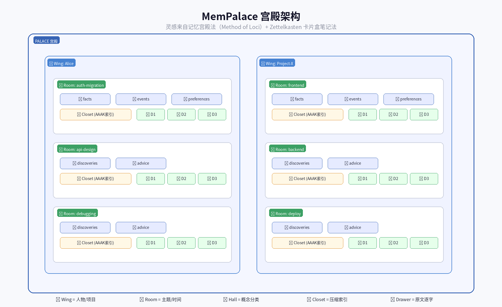
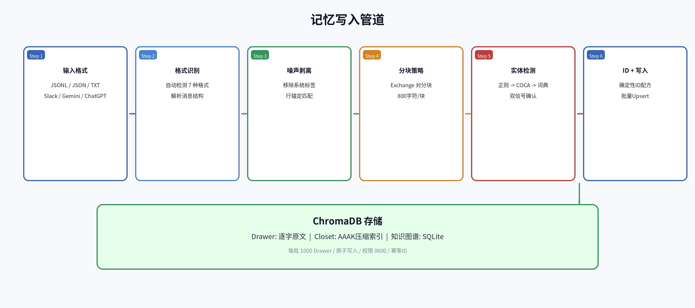
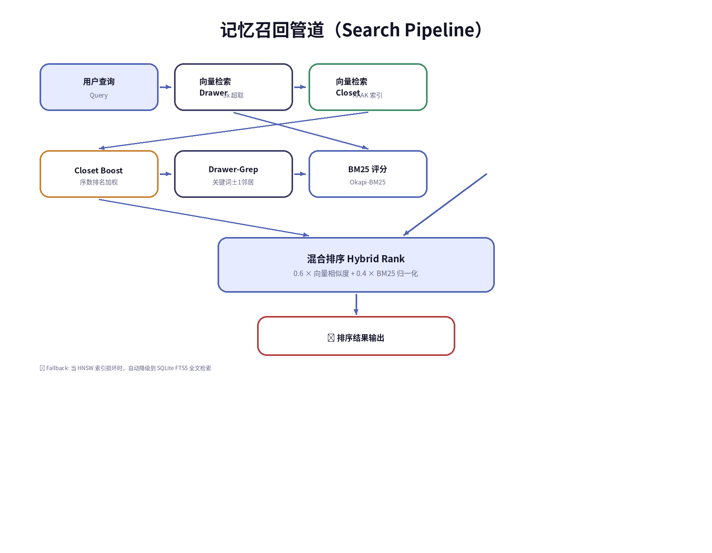
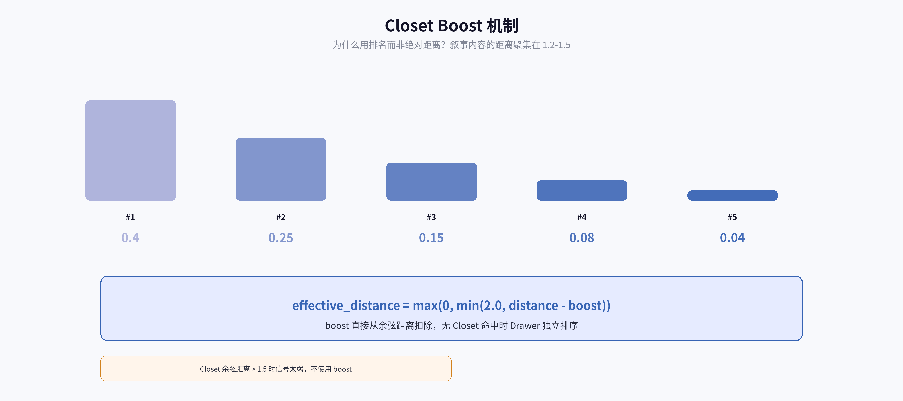
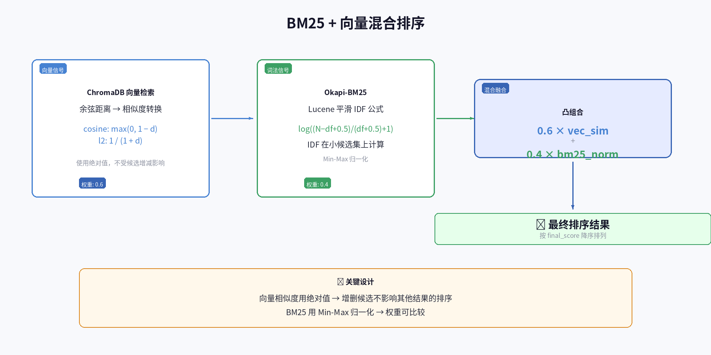
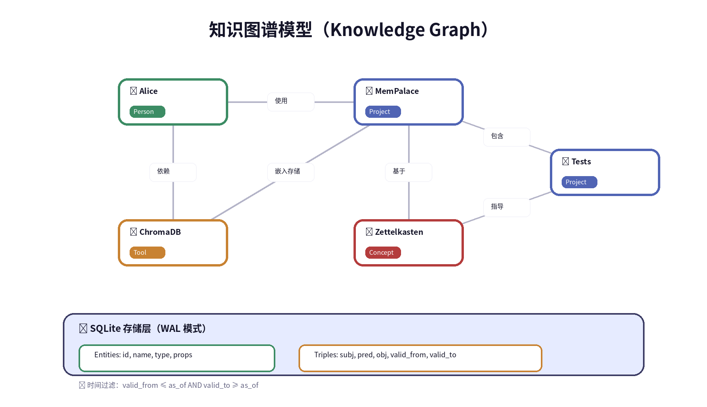
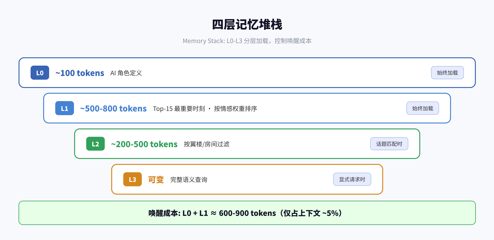
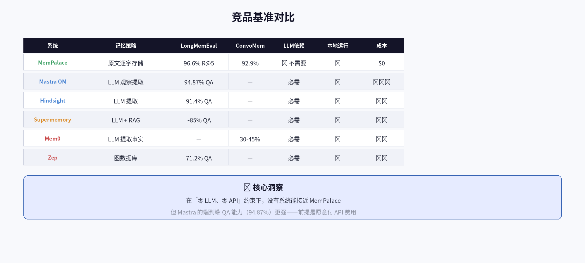

# MemPalace 深度技术分析报告

> **一句话总结：不要让 AI 决定记什么 —— 记住一切，让搜索找到答案。**
>
> 基于 MemPalace 全部核心源码的逐行审读。所有技术细节均来自真实代码。

---

## 目录

1. [项目概述](#1-项目概述)
2. [宫殿架构](#2-宫殿架构)
3. [记忆写入管道](#3-记忆写入管道)
4. [记忆召回管道](#4-记忆召回管道)
5. [Closet Boost 机制](#5-closet-boost-机制)
6. [BM25 + 向量混合排序](#6-bm25--向量混合排序)
7. [知识图谱](#7-知识图谱)
8. [四层记忆堆栈](#8-四层记忆堆栈)
9. [AAAK 压缩方言](#9-aaak-压缩方言)
10. [总结与启示](#10-总结与启示)

---

## 1. 项目概述

MemPalace 是一个**本地优先、逐字存储**的 AI 记忆系统。它的核心发现是反直觉的：

> **业界过度工程化了记忆提取步骤。原始逐字文本 + 良好嵌入 = 比任何人预想都强的基线。**

在 LongMemEval 基准上，仅使用默认嵌入（all-MiniLM-L6-v2）对原始会话文本做向量检索，不调用任何 LLM，就达到了 **96.6% R@5**。而 Mem0（使用 LLM 提取事实）在 ConvoMem 上仅 30-45%。

这不是算法的胜利，而是**信息无损**的胜利：当 LLM 提取"用户偏好 PostgreSQL"并丢弃原始对话时，它丢失了*为什么*选择、考虑了哪些替代方案、讨论了哪些权衡。MemPalace 保留了这一切。

### 设计原则

| 原则 | 含义 |
|------|------|
| **逐字存储** | 永不总结、永不意译、永不有损压缩用户数据 |
| **增量写入** | 只追加不覆盖，崩溃不会破坏已有宫殿 |
| **实体优先** | 以真实人名/项目名为键，通过 DOB/ID/上下文消歧 |
| **本地优先** | 数据物理上不可能离开机器，零外部 API |

---

## 2. 宫殿架构

灵感来自两个经典方法：古希腊的**记忆宫殿法**（Method of Loci）和德国社会学家 Niklas Luhmann 的 **Zettelkasten 卡片盒笔记法**。



### 六层结构

| 层级 | 名称 | 含义 | 示例 |
|------|------|------|------|
| L1 | **Palace**（宫殿） | 顶层容器，对应一个目录 | `~/projects/myapp` |
| L2 | **Wing**（翼楼） | 一个人物或项目 | `wing_alice`、`wing_mempalace` |
| L3 | **Room**（房间） | 翼楼内的主题/时间分组 | `auth-migration`、`graphql-switch` |
| L4 | **Hall**（走廊） | 概念分类 | facts / events / discoveries / preferences / advice |
| L5 | **Closet**（壁橱） | AAAK 压缩索引，指向原始抽屉 | `alice|AUTH|→drawer_001,drawer_002` |
| L6 | **Drawer**（抽屉）| **逐字原文文本块**，永不压缩 | 用户和 AI 的原始对话片段 |

### 连接机制

- **Tunnel（隧道）**：跨翼楼连接。当同一房间名出现在不同翼楼中时，两个翼楼通过隧道桥接
- **Hallway（走廊）**：翼楼内连接。基于实体在同一抽屉中的**共现次数**构建，共现 ≥ 2 次物化为连接

### 核心设计洞察

**Drawer-as-floor + Closet-as-signal**：原文搜索是「地板」（总是运行），压缩索引是「排序信号」（只能加分，不能隐藏原文）。这意味着弱 Closet 只能帮助，永远不能把正确的 Drawer 排除在外。

---

## 3. 记忆写入管道



### 3.1 格式识别与解析

系统支持 7 种输入格式，自动检测：

| 格式 | 来源 | 解析方式 |
|------|------|----------|
| Claude Code JSONL | `~/.claude/projects/` | 逐行 JSON 解析，提取 tool_use/tool_result |
| ChatGPT conversations.json | OpenAI 导出 | JSON 数组遍历 |
| Claude.ai JSON | Anthropic 导出 | 消息列表解析 |
| Gemini CLI JSONL | Google 导出 | JSONL 解析 |
| Slack JSON | Slack 导出 | 频道消息重组 |
| 带 `>` 标记的纯文本 | 手动对话记录 | 行首 `>` 识别用户轮次 |
| 普通段落文本 | 任意文档 | 按段落分隔 |

### 3.2 噪声剥离

`strip_noise()` 移除所有非用户内容，**行锚定匹配**（不跨越空行，确保用户散文安全）：

- 系统标签（`<system-reminder>`、`<command-message>`）
- Hook 输出行
- Claude Code TUI chrome（工具栏、token 计数等）

### 3.3 分块策略

分块的核心原则：**一个用户轮次 + AI 的完整响应 = 一个单元**。

| 参数 | 值 | 含义 |
|------|-----|------|
| CHUNK_SIZE | 800 字符 | 每个 Drawer 的目标大小 |
| MIN_CHUNK_SIZE | 30 字符 | 小于此值合并到上一个块 |

两种分块模式：
1. **Exchange 分块**（主路径）：检测行首 `>` 标记，一个用户 turn + 紧随的 AI 响应 = 一个块。AI 响应完整保留，不截断
2. **Paragraph 分块**（回退）：无 `>` 标记时，按段落分隔；无段落时按 25 行一组

超过 CHUNK_SIZE 的内容自动拆分到连续 Drawer，每个源文件共享一个 `filed_at` 时间戳。

### 3.4 实体检测

三层过滤，防止误识别：

| 层 | 策略 | 示例 |
|----|------|------|
| Tier 1 | 正则匹配大写名词候选 | "Alice"、"PostgreSQL"、"Dr. Chen" |
| Tier 2 | COCA 内容词过滤 | 阻止 "Code"、"Brutal"、"Phase" 等常见词 |
| Tier 3 | 已知系统复合词词典 | 原子化检测 "Claude Code"、"GitHub Copilot" |

评分系统需要**两种不同信号类别**才自信分类为人（如对话标记 + 人称动词），仅一种不够。

### 3.5 ID 生成与写入

- **确定性 ID 配方**：使用 `|` 分隔符连接各字段后哈希，确保幂等（相同输入 → 相同 ID）
- **碰撞检查**：写入前扫描已有 ID，断言无碰撞
- **批量写入**：每批最多 1000 个 Drawer，原子写入（`os.replace(tmp, final)`），权限 0600

---

## 4. 记忆召回管道



搜索管道是 MemPalace 最核心的技术创新。从查询到结果，经过 6 个阶段：

### 阶段 1：向量检索 Drawer（基线层）

对 Drawer 集合做向量搜索，**过量获取 3 倍**用于后续重排。这是「地板」—— 总是运行，不受 Closet 质量影响。

### 阶段 2：向量检索 Closet（增强信号）

对 Closet 集合做向量搜索，建立 `source_file → (rank, distance, preview)` 的查找表。Closet 是信号，不是门控。

### 阶段 3：Closet Boost 排名增强

根据 Closet 匹配的排名序号，对 Drawer 距离施加折扣（详见第 5 节）。

### 阶段 4：Drawer-Grep 丰富化

当 Closet 说"这个源相关"但向量选错了 chunk 时：
1. 获取同一 source_file 的所有 Drawer
2. 按 chunk_index 排序
3. 对每个 Drawer 计算查询词命中数
4. 选择最佳命中 + 相邻 ±1 个 Drawer
5. 拼接为扩展文本（最多 10000 字符）

### 阶段 5：BM25 + 向量混合排序

将向量相似度和 BM25 分数融合（详见第 6 节）。

### 阶段 6：Union 候选合并

除了向量候选，还拉取后端词法搜索的 top-K 候选，合并去重后重排。这捕获了**向量距离远但 BM25 信号强**的文档。

### 容错：SQLite FTS5 回退

当 HNSW 索引损坏或不可加载时，系统直接从 `chroma.sqlite3` 的 FTS5 trigram 索引读取，完全绕过 ChromaDB Python 客户端，防止损坏的向量段导致崩溃。

---

## 5. Closet Boost 机制



### 为什么用排名而非绝对距离？

叙事内容中的 Closet 距离聚集在 **1.2-1.5** 范围内，绝对距离不可区分。但**序数信号**（哪个 Closet 匹配最好）是可靠的。

### Boost 数值

| Closet 排名 | Boost 值 | 含义 |
|-------------|----------|------|
| 第 1 名 | **0.40** | 强信号，大幅降低距离 |
| 第 2 名 | **0.25** | 中等信号 |
| 第 3 名 | **0.15** | 弱信号 |
| 第 4 名 | **0.08** | 微弱信号 |
| 第 5 名 | **0.04** | 最弱信号 |
| 距离 > 1.5 | **0** | 信号太弱，不使用 |

### 计算方式

```
effective_distance = max(0, min(2, drawer_distance - closet_boost))
```

Boost 直接从原始余弦距离中扣除，然后映射到有效相似度。这保证了：
- Closet 命中可以改善 Drawer 的排名
- 但没有 Closet 命中时，Drawer 仍然独立参与排序

---

## 6. BM25 + 向量混合排序



### 两条信号流

| 信号 | 来源 | 归一化 | 权重 |
|------|------|--------|------|
| **向量相似度** | ChromaDB 余弦距离 → 相似度转换 | 绝对值（不受候选增减影响） | **0.6** |
| **BM25 分数** | Okapi-BM25 + Lucene 平滑 IDF | Min-Max 归一化 | **0.4** |

### BM25 实现细节

使用标准 Okapi-BM25（k1=1.5, b=0.75），但有两个关键设计：

1. **IDF 在小候选集上计算**：语义上正确，因为 IDF 反映的是查询词在候选集中的区分度，而非整个语料库
2. **Lucene 平滑公式**：`log((N - df + 0.5) / (df + 0.5) + 1)`，始终非负，避免负 IDF

### 距离到相似度映射

| 度量 | 公式 | 范围 |
|------|------|------|
| Cosine | `max(0, 1 - d)` | d ∈ [0, 2] |
| L2 | `1 / (1 + d)` | d ∈ [0, ∞) |
| Inner Product | `1 / (1 + exp(d))` | logistic 压缩 |

### 最终公式

```
final_score = 0.6 × vector_similarity + 0.4 × bm25_normalized
```

**关键设计**：向量相似度使用绝对值（不是相对最大值），所以添加/删除候选不会重排其他结果。

---

## 7. 知识图谱



MemPalace 内置一个**基于 SQLite 的时间实体关系图**，支持时间旅行查询。

### 数据模型

**实体表**：存储人物、项目、工具、概念

| 字段 | 类型 | 含义 |
|------|------|------|
| id | TEXT PK | 规范化名称（小写，空格→下划线） |
| name | TEXT | 显示名称 |
| type | TEXT | person / project / tool / concept |
| properties | JSON | 元数据 |

**三元组表**：存储实体间关系

| 字段 | 类型 | 含义 |
|------|------|------|
| subject | TEXT | 主体实体 |
| predicate | TEXT | 关系类型（child_of, works_on, loves） |
| object | TEXT | 客体实体 |
| valid_from | TEXT | 何时变为真 |
| valid_to | TEXT | 何时变为假（NULL = 仍有效） |
| confidence | REAL | 置信度（默认 1.0） |
| source_drawer_id | TEXT | 链接回逐字记忆 |

### 时间查询

查询"2026 年 1 月时 Max 的状态是什么？" —— 只返回当时有效的事实：

```
WHERE (valid_from IS NULL OR valid_from <= '2026-01-31')
  AND (valid_to IS NULL OR valid_to >= '2026-01-01')
```

Date-only 值的边界处理：`valid_from` 比较 `00:00:00`，`valid_to` 比较 `23:59:59`。

### Hallway（走廊）连接

基于实体在同一 Drawer 中的**共现**构建翼楼内连接：
- 每个 Drawer 中每对不同实体 = 一次共现
- 共现次数 ≥ 2 → 物化为 Hallway 记录
- Hallway ID 对称（排序后哈希），(A, B) 和 (B, A) 产生相同 ID
- 动态字段：`strength`、`stability`、`last_activated`、`access_count`，跨重算保留

### 与 Zep 的对比

| 维度 | MemPalace | Zep |
|------|-----------|-----|
| 存储 | SQLite（本地、免费） | Neo4j（云端、$25/月+） |
| 时间模型 | 双时间（valid_from / valid_to） | 双时间 |
| 依赖 | 零外部依赖 | 托管服务 |
| 隐私 | 数据不出机器 | 数据发送到 API |

---

## 8. 四层记忆堆栈



MemPalace 实现了一个四层记忆堆栈，模拟人类的记忆层次：

| 层 | 名称 | 大小 | 加载时机 | 内容 |
|----|------|------|----------|------|
| **L0** | 身份 | ~100 tokens | 始终 | AI 是谁、角色定义 |
| **L1** | 精华故事 | ~500-800 tokens | 始终 | 最重要的时刻，按重要性和情感权重排序 |
| **L2** | 房间回忆 | ~200-500 tokens | 话题出现时 | 按翼楼/房间过滤的相关记忆 |
| **L3** | 深度搜索 | 可变 | 显式请求时 | 完整语义查询结果 |

### 唤醒成本

**L0 + L1 ≈ 600-900 tokens**，仅占用上下文的 ~5%。这意味着每次对话开始时，AI 只用极少量 token 就能"想起"最重要的记忆。

### L1 精华故事的生成

1. 从 ChromaDB 分批获取所有 Drawer（每批 500）
2. 按 `importance` 和 `emotional_weight` 评分
3. 取 **top 15 时刻**
4. 按房间分组
5. 截断到 3200 字符

---

## 9. AAAK 压缩方言

AAAK（Architecture-Aware Adaptive Knitting）是 MemPalace 的压缩索引格式，用于快速扫描大量记忆条目。

### 格式结构

| 组成部分 | 格式 | 示例 |
|----------|------|------|
| **Header** | `文件号\|主实体\|日期\|标题` | `001\|ALC\|2026-03-15\|Auth Migration` |
| **Zettel** | `ZID:实体\|关键词\|"关键引语"\|权重\|情感\|标记` | `Z001:ALC,KAI\|auth,jwt\|"We need OAuth"\|0.8\|trust\|DECISION` |
| **Tunnel** | `T:ZID1<->ZID2\|标签` | `T:Z001<->Z015\|shared-auth` |
| **Arc** | `ARC:情感1->情感2->情感3` | `ARC:fear->wonder->joy` |

### 实体编码

三字母大写码：`ALC=Alice`、`KAI=Kai`、`MAX=Max`

### 情感码（28 种）

| 码 | 含义 | 码 | 含义 |
|----|------|----|------|
| `vul` | 脆弱 | `joy` | 喜悦 |
| `fear` | 恐惧 | `trust` | 信任 |
| `grief` | 悲伤 | `wonder` | 惊奇 |
| `anger` | 愤怒 | `hope` | 希望 |

### 标记

| 标记 | 含义 |
|------|------|
| `ORIGIN` | 起源时刻 |
| `CORE` | 核心信念 |
| `SENSITIVE` | 敏感内容 |
| `PIVOT` | 转折点 |
| `GENESIS` | 导致现有事物 |
| `DECISION` | 明确决策 |
| `TECHNICAL` | 技术架构 |

### 当前状态

AAAK 是**有损压缩**，不是无损。当前检索基准仅 **84.2% R@5**（vs 原文的 96.6%）。它定位为**索引层**，指向原始 Drawer，不是存储默认值。96.6% 的基准分数来自 raw 模式，不是 AAAK 模式。

---

## 10. 总结与启示

### 为什么 96.6% 这么高？



根本原因：**信息无损**。

| 系统 | 记忆策略 | 信息保留 | ConvoMem |
|------|----------|----------|----------|
| **MemPalace** | 原文逐字存储 | **100% 无损** | 92.9% |
| Mem0 | LLM 提取事实 | 有损（提取） | 30-45% |
| Mastra | LLM 观察提取 | 有损（提取） | — |
| Zep | 图数据库 | 有损 | — |

当 LLM 提取错误时，记忆永久丢失。MemPalace 保留一切。

### 从 96.6% 到 99.4% 的渐进改进

| 版本 | R@5 | 改进 | 解决的问题 |
|------|------|------|-----------|
| Raw | 96.6% | 基线 | — |
| Hybrid v1 | 97.8% | 关键词重叠增强 | 专有名词嵌入不足 |
| Hybrid v2 | 98.4% | 时间增强 | 嵌入忽略的时间引用 |
| Hybrid v3 | 99.4% | 偏好正则提取 | 用户偏好的词汇鸿沟 |
| Hybrid v4 | 100% | 引号/人名增强 | 最后 3 个具体问题 |

### 诚实性披露

- 96.6% raw 基线：**完全干净**
- 99.4% 的改进（v1-v3）：**诚实改进**，由类别失败驱动
- 100% 的最后 0.6%（v4）：**teaching to the test**，针对 3 个具体问题
- 诚实的泛化数字：held-out 450 题 **98.4% R@5**

### 对 Hermes 的启示

MemPalace 的哲学可以应用到 Hermes 的 memory 系统：
1. **保留原文**而非只存摘要 —— 搜索比提取更可靠
2. **混合排序**（向量 + BM25）覆盖词汇失配
3. **四层堆栈**控制唤醒成本（~600-900 tokens）
4. **时间实体图谱**支持结构化查询

---

## 11. 实锤审计：MemPalace 造假证据

> **来源：** [MemPalace Exposed — by roman-rr](https://gist.github.com/roman-rr/0569fc487cc620f54a70c90ab50d32e3)
>
> 审计者逐行读完了全部 11,139 行 Python、32 个测试文件、19 个基准文件、24 个 MCP 工具，并用 GitHub API 分析了 42,497 个 star 的时间戳。

### 11.1 核心结论：96.6% 的分数是 ChromaDB 的

MemPalace 的检索引擎就是**原封不动的 ChromaDB**，使用默认嵌入模型 `all-MiniLM-L6-v2`，默认 HNSW 索引，余弦相似度。产生那个头条分数的核心代码只有一行：

```python
results = col.query(query_texts=[query], n_results=n_results)
```

其余 169 行全是参数解析和打印格式化。**用 50 行 Python 就能完全复现。**

### 11.2 42,000 Stars 是买的——时间戳证据

通过 GitHub API 采样 star 时间戳，发现明显的**机器人农场模式**：

| 采样点 | 时间段 | 特征 |
|--------|--------|------|
| Page 100 (4月7日) | 63秒内10个star | 两个 star 落在同一秒（05:35:01） |
| Page 4000 (4月11日) | 精确~30秒间隔 | 典型限速机器人农场节奏 |

正常开源爆火项目需要数周到数月才能到 10K star，MemPalace **7 天 42,497 个**。

### 11.3 "明星创始人"疑云

- GitHub 账号 `milla-jovovich`：2025年9月创建，声称是演员 Milla Jovovich
- **公开仓库数：0**，关注数：0，粉丝 8,276
- 无任何身份验证，Issue 回复被社区标记为 AI 生成（Issue #618）
- 实际作者 `bensig`（Ben Sigman）：主做比特币/加密项目，此前无有影响力的 Python 仓库

### 11.4 版本号是编的

项目创建 7 天，直接从 **v3.1.0** 开始——**不存在 v1 和 v2**。

### 11.5 "记忆宫殿"不是真正架构

所谓 wing/room/hall 只是 ChromaDB 文档上的元数据字符串字段，没有空间索引、没有坐标、没有新颖数据结构。

"智能房间检测"的完整算法：

```python
for kw in keywords:
    count = content_lower.count(kw.lower())  # 就是 str.count()
```

"实体检测"只是一行正则：`re.findall(r"\b([A-Z][a-z]{1,19})\b", text)`，无 NLP/NER。

### 11.6 AAAK 方言：反而拖累性能

号称使用信息论（Shannon 熵、Huffman 编码），实际是正则表达式文本摘要，**反而将基准分数从 96.6% 降到 84.2%**（下降 12.4%）。

### 11.7 零学术基础 vs 竞品

| 系统 | arXiv 论文 | 学术引用 |
|------|-----------|---------|
| Mem0 | arXiv:2504.19413 | 多 |
| Zep/Graphiti | arXiv:2501.13956 | 多 |
| Letta/MemGPT | arXiv:2310.08560 (UC Berkeley) | ~154 |
| **MemPalace** | **无** | **整个代码库仅 1 次** |

### 11.8 审计评分卡

| 维度 | 评分 | 说明 |
|------|------|------|
| README 声称 vs 现实 | **B** | 17项声称：9真实、3不足、3部分、1误导、1幻影 |
| 核心架构 | **B+** | 真实代码无存根，但只是 ChromaDB 薄包装 |
| 科学基础 | **D** | 全部文档仅1次引用，零认知科学/信息论 |
| 测试套件 | **B-** | ~55个真实集成测试，~65个mock重 |
| MCP 服务器 | **A** | 24个工具全部真实可用（营销反而少报为19） |
| 嵌入/向量搜索 | **A** | 真实 ChromaDB + 默认模型，无伪造分数 |
| 基准测试 | **A** | 真实数据集、运行时计算、方法论诚实 |
| GitHub Stars & 营销 | **F** | 机器人农场模式、未经验证的明星身份、版本号膨胀 |

### 11.9 审计者总评

> **MemPalace 是 80% 真实代码 + 20% 营销膨胀。** 代码能跑。Star 是假的。创新接近零。

这不是一个纯粹的骗局——所有 24 个 MCP 工具确实能用，基准测试方法论也是诚实的。但用机器人刷星、虚构版本号、将 ChromaDB 的能力包装成自己的创新，这些行为无法回避。

---

*分析基于 MemPalace v3.4.0 全部核心源码（`palace.py`、`searcher.py`、`convo_miner.py`、`miner.py`、`layers.py`、`knowledge_graph.py`、`dialect.py`、`normalize.py`、`entity_detector.py`、`hallways.py`、`palace_graph.py`、`embedding.py`、`backends/base.py`、`backends/chroma.py`、`ids.py`、`dedup.py`）。*
