# 从零实现最小编码 Agent：minimal-pi 的设计与实测

> **核心发现：457 行 Python 复现 Pi 骨架——单循环+四工具+JSONL 持久化+同终端继承，暗号实测跑通**
> 调研日期：2026-08-20 | 来源：自研实现 minimal_pi.py（真实 LLM 实测）+ earendil-works/pi 源码对照

## 一、概览

**一句话定位**：minimal-pi 是一个用 Python 从零实现的"最小编码 Agent"。它包含单循环（agent loop）、四工具（read/write/edit/bash）、LLM 接入与会话持久化，457 行代码全部走标准库（零第三方依赖），真实 DeepSeek API 端到端跑通。

**情境**：hello-wrold 已有三篇 Pi 源码分析（pi-agent-report / pi-agent-loop-report / pi-self-extension-report），把 Pi 的架构拆到了行号级。但"纸上拆解"和"亲手实现"是两回事——前者验证理解，后者暴露真实工程坑。

**冲突**：Pi 的 monorepo 有 10 个子包，仅 `packages/*/src` 的 TypeScript 就有约 12 万行（2026-08-19 快照统计），而它的核心循环 `runLoop` 只有约 120 行。中间的巨大落差是"生产化增量"（事件流、队列、钩子、沙箱），还是"必要复杂度"（协议、容错、上下文管理）？不亲手写一遍，无法回答。

**问题**：一个真正"能干活"（真实 LLM 驱动、多轮工具调用、重启后还有记忆）的最小编码 Agent，到底需要多少行？砍到什么程度会散架？

**答案**：457 行。核心循环约 30 行，四工具实现约 35 行，JSON Schema 定义约 70 行，剩下的是协议正确性（四段消息、tool_call_id 配对）、容错（错误回灌、坏 JSON）、防护（MAX_TURNS、历史裁剪）与持久化——每一项都由代码审查或真实运行确认必要，不是装饰。

### 关键指标

| 指标 | 数值 |
|------|------|
| 代码量 | `minimal_pi.py` 457 行（核心循环约 30 行） |
| 依赖 | 零（Python 标准库：urllib/glob/subprocess） |
| 工具 | read / write / edit / bash（JSON Schema 定义参数） |
| 会话 | JSONL 追加写盘，system/user/assistant/tool 全量消息 |
| 提交 | 6 个（实现→verbose→chat→继承；其中含一次独立代码审查修复） |
| 实测 | DeepSeek deepseek-chat：多轮工具闭环、跨进程 continue、chat 多轮 |
| 托管 | coding.jd.com/huguangyao.1/pi（main+master） |

### 架构全景



> 上图先看中间的 run_loop 主循环——这是全部逻辑的锚点，左右分别是它依赖的两件套：call_llm（模型接入，对应 Pi 的 StreamFn）与 TOOLS 注册表（四工具，对应 Pi 的 harness/tools）。底部会话层是后期补上的"记忆"：每条消息即时落盘，同终端自动继承。

## 二、核心骨架：单循环 + 四工具

> 本节结论预览：把 Pi 的双循环砍掉 follow-up 队列后，外层退化为一次性，最小实现单 `while` 即可；四工具用"schema + execute 双份定义"的注册表模式组织。

### 2.1 为什么是单循环

Pi 的 `runLoop`（agent-loop.ts L155-275）是双层 while：内层跑"LLM↔工具"往返，外层轮询 follow-up 队列（用户排队消息）。minimal-pi 砍掉队列后，外层循环只剩"检查一次就退出"，等价于没有——所以核心就是内层：

```python
while True:
    msg = call_llm(messages, api_key)                     # 1. 请求 LLM
    if not msg.get("tool_calls"): return msg["content"]   # 2. 无工具调用 → 完成
    for call in msg["tool_calls"]:
        output = execute_tool_call(call)                  # 3. 执行工具
        messages.append({"role": "tool", "tool_call_id": call["id"], "content": output})  # 4. 回灌
```

> 以上为简化示意（省略了历史裁剪、MAX_TURNS 防护与缺 id 容错，真实代码见 3.2/3.3 节）。

四条消息协议是 OpenAI 兼容 API 的硬约束：system/user 开头，assistant 消息原样回灌（含 tool_calls），tool 消息的 `tool_call_id` 必须等于上一条 assistant 消息里的 `call["id"]`——这条写错，API 直接 400。

### 2.2 工具注册表：schema 与 execute 双份

每个工具双份定义：schema 给 LLM（描述参数长什么样），execute 给进程（实际干活的函数）：

```python
TOOLS = {
    "read": {
        "schema": {"type": "function", "function": {
            "name": "read",
            "description": "Read a file from disk and return its content.",
            "parameters": {"type": "object",
                           "properties": {"path": {"type": "string"}},
                           "required": ["path"]}}},
        "execute": tool_read,   # def tool_read(path) -> str
    },
    ...
}
```

**我的判断**：双份定义是"手写 schema 易漂移"问题的朴素解法——Pi 用 TypeBox 从单一来源生成，minimal-pi 直接手写（片段省略了 `description` 字段）。对 4 个工具手写可接受，工具一多就该换成 schema 生成器了，这是从"够用"到"可维护"的转折点。

### 2.3 模型接入：call_llm ≈ Pi 的 StreamFn

模型接入就是一个函数：urllib 发 POST 到 OpenAI 兼容端点，返回 `choices[0].message`。Pi 的 `StreamFn` 是流式版（text_delta/toolcall_delta 分段推送），minimal-pi 用非流式最简形态——**流式只影响打字机效果和提前中断，不影响功能**。DeepSeek/OpenAI/Anthropic(兼容层) 通用，换模型只改 baseUrl + model 名。

## 三、工程细节：协议、容错与防护

> 本节结论预览：代码审查和真实运行共同确认了五类"非装饰性"工程细节——错误回灌、参数容错、结果截断、退出码、轮次上限（下文按 3.1 错误回灌 / 3.2 审查与防护 / 3.3 上下文管理展开），每一类都是"不写会出问题"的。

### 3.1 错误回灌：让 LLM 自愈，而不是崩溃

工具执行的所有失败——文件不存在、命令超时、坏 JSON 参数、未知工具名、tool_call 缺 id——统一返回 `Error: ...` 文本回灌给 LLM，由模型自己换方案重试：

```
[tool] ▶ read({"path": "/nonexistent.txt"})
[tool] ◀ Error: [Errno 2] No such file or directory: ...
```



> 上图是工具执行的四步管线。关键在两条红色分支——未知工具和坏 JSON 参数都走"Error 回灌"而非抛异常。这是 agent 与普通程序的分水岭：普通程序以失败终止，agent 把失败继续抛给模型协商，由模型换方案重试。

### 3.2 代码审查发现的坑（真实教训）

实现后做了独立代码审查，修掉了 3 个严重 + 8 个一般问题，其中最有价值的三条：

| 问题 | 修复 |
|------|------|
| 无限循环无上限（LLM 反复调工具可死循环） | `MAX_TURNS=30`，超限返回 guard 消息 |
| 坏会话文件导致 `load_session` 整体崩溃 | 坏行跳过 + stderr 告警 |
| bash 输出可能把 API key 回灌给 LLM（prompt 注入链） | 回灌前正则过滤疑似密钥行 + README 声明安全边界 |
| assistant 消息全字段回灌（推理模型的 reasoning_content 会触发 400） | 白名单只回灌 role/content/tool_calls |

**我的判断**：这四条没有一条是"优化"，全是"不修就可能出问题"——尤其密钥过滤那条，攻击链是假设场景但链条完整："模型被 prompt 注入 → 执行 `cat ~/.env` → 输出含 key → 回灌给 LLM → 被诱导回显"。最小实现不代表可以裸奔，安全边界至少要文档化。

### 3.3 上下文管理的最小形态

长会话会撑爆 context window（API 400），且每次请求 payload 越来越大。minimal-pi 用 11 行的 `_trim_history` 解决：保留首条 system + 最近 40 条（取偶数保配对），只裁剪发给 LLM 的请求，会话文件仍完整记录。这是 Pi compaction（压缩摘要）的极简替代——**裁剪是线性退化，压缩是对数进化**，超过一定会话长度就该上真压缩了。

## 四、会话持久化与同终端继承

> 本节结论预览：JSONL 追加写盘实现"重启不失忆"；`TERM_SESSION_ID` 命名空间实现"同终端自动继承、跨终端隔离"，这是把上下文从内存变量升级为磁盘资产的完整落地。

### 4.1 JSONL：append 即幂等

每个会话一个文件，每行一个消息 JSON，`system` 也落盘（continue 时 agent 不失身份）。`-c` 继续最近会话、`-r` 列出历史按编号恢复、`--new` 显式开新会话。实测：第一段"记住暗号：苹果 42"，进程退出后第二段 `-c` 问"暗号是什么"，答出"苹果 42"。

### 4.2 同终端自动继承

默认行为改为"继承"后引入一个权衡：**默认继承会让不相关任务串味**（上次任务上下文污染下次）。解法是按终端隔离——用 macOS Terminal 的 `TERM_SESSION_ID` 做命名空间：



> 上图左右对比：同一标签页内连续运行自动续聊（Run 1→2→3 共享上下文），不同标签页各自独立（命名空间不同，互不干扰）。无该变量的终端回退 "default" 全局续聊，可用 `MCPI_TERM_ID` 自定义。`--new` 随时退出继承。

### 4.3 实测数据

| 验证项 | 结果 |
|--------|------|
| 多轮工具闭环（write→bash→回答） | 通过（3 轮，真实 DeepSeek） |
| 跨进程 continue（记住暗号→重启→答出） | 通过（"苹果 42"、"蓝色 99"） |
| chat 多轮对话（`--chat`） | 通过（"绿色 7"） |
| 同终端自动继承（不加 `-c`） | 通过（自动载入最近会话） |
| 跨终端隔离（不同 TERM_SESSION_ID） | 通过（mock + 真实验证） |

## 五、批判性分析

> 本节结论预览：minimal-pi 证明了"能干活的最小编码 agent"约 457 行即可，代价是砍掉了事件流、并行、沙箱等生产化能力；核心风险是无沙箱的 bash 工具与默认继承的串味权衡。

### 5.1 与 Pi 的对照：砍了什么，留下了什么

| 维度 | Pi（约 12 万行 src / 10 子包） | minimal-pi（457 行） |
|------|:---:|:---:|
| 循环 | 双循环（内层 turn + 外层 follow-up 队列） | 单循环（外层退化为一次性） |
| 消息系统 | 7 种 AgentMessage → 3 种 LLM Message 转换管道 | 原生 dict 直通 |
| 工具执行 | 并行（Promise.all）+ terminate 批量规则 | 串行 |
| 事件流 | emit（agent_start/turn_end/message_update…） | 直接 print（分层日志） |
| 上下文 | compaction 摘要压缩 | 滑动窗口裁剪（最近 40 条） |
| 会话 | session-backends + JSONL + 分支 + 压缩 | JSONL + 终端命名空间继承 |
| 沙箱 | Gondolin / Docker / OpenShell | 无（README 声明边界） |
| 扩展 | extensions + skills + addedToolNames 运行时注入 | 无（只读四工具） |

**我的判断**：被砍掉的部分分成两类——**结构性可砍**（事件流可退化为 print，并行可退化为串行，消息类型系统可退化为 dict）与**必要性保留**（四段消息协议、错误回灌、上下文上限、持久化）。结论是 Pi 的"极简哲学"成立：核心约 30 行，其余约 12 万行是生产化增量——两者差距约 260 倍，这个数字本身就是答案。

### 5.2 不足与风险

1. **无沙箱的 bash 工具 = 任意代码执行**。与 Pi 同哲学（无内置权限系统），但 Pi 有 Gondolin/Docker/OpenShell 兜底，minimal-pi 没有——仅限可信环境/学习用途。已做的缓解：密钥行过滤、会话文件不入 git。
2. **默认继承有串味风险**。同终端连续跑不相关任务，后者带着前者上下文（实测"蓝色 99"会跟着后续对话）。`--new` 是逃生门，但需要用户记得用。
3. **无流式 = 长任务无感知**。LLM 响应期间终端静默，无法显示 thinking 过程，也无法提前中断。
4. **单线程串行工具**。并发工具调用场景（如并行读多个文件）退化为串行，长任务耗时线性增长。
5. **裁剪而非压缩**。会话超过 40 条后早期信息被丢弃（不是摘要），长程任务可能"失忆"。

### 5.3 与同类"最小 agent"定位对比

| 维度 | minimal-pi | Pi | Claude Code |
|------|:---:|:---:|:---:|
| 定位 | 学习/验证最小骨架 | 生产级编码 agent | 生产级编码 agent |
| 行数 | 457 | ~15K | 闭源 |
| 工具 | 4 | 4 内置 + 扩展 | 多 + 插件 |
| 多轮 | chat + 跨进程继承 | TUI 交互 + session | TUI 交互 |
| 安全 | 文档化边界 | 沙箱三件套 | Permission 系统 |
| 可学性 | 一文件读完 | 十包逐层拆 | 黑盒 |

## 六、对 Hermes 的启示

1. **"能干活"的最小闭环比想象中小**：核心 30 行 + 四工具 35 行就能驱动真实 LLM 完成多步任务——Hermes 拆能力时不必被框架体积吓到（Pi 的 src 有 12 万行，但骨架只有几百行），最小验证闭环应该按这个量级设计。
2. **协议正确性是第一个坎**：tool_call_id 配对、assistant 消息回灌、字段白名单，这些"API 硬约束"是新手实现 agent 时大多数报错的根源——值得沉淀成一份"消息协议检查清单"。
3. **错误回灌是 agent 的灵魂**：普通程序 try/except 后崩溃，agent try/except 后把错误"说给模型听"。这个思维差异值得写进 Hermes 的设计原则。
4. **会话持久化从 JSONL 起步**：append 幂等、坏行容错、system 落盘——这三条是任何会话系统的地基，Pi 的 branch/compaction 都是在此之上的增量。
5. **安全边界前置而非后补**：bash 工具 + prompt 注入 = 密钥泄露链，最小实现也得至少"过滤敏感输出 + 文档化边界 + 会话不入 git"三件套。

## 参考来源

- minimal-pi 源码：https://coding.jd.com/huguangyao.1/pi（main，457 行 minimal_pi.py + README）
- Pi 源码对照：https://github.com/earendil-works/pi（agent-loop.ts / harness/tools / session-backends）
- hello-wrold 既往报告：pi-agent-report（2026-08-04）、pi-agent-loop-report（2026-08-05）、pi-self-extension-report（2026-08-19）
- 实测环境：macOS arm64 + Python 3.13（标准库）+ DeepSeek deepseek-chat（真实 API，2026-08-20）
- 安全参考：Pi README 容器化章节（Gondolin / Docker / OpenShell）
