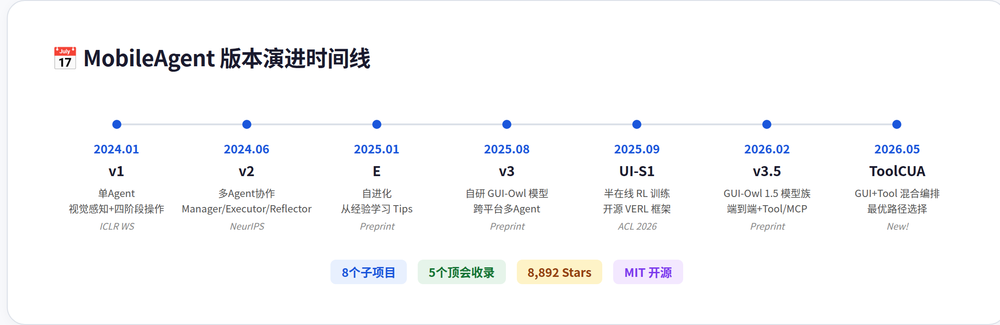
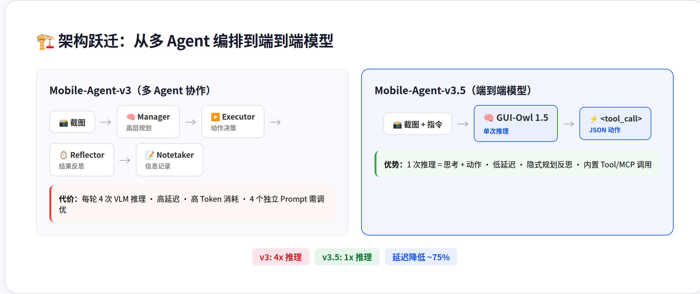
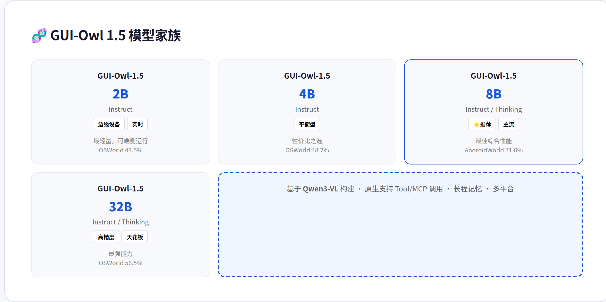
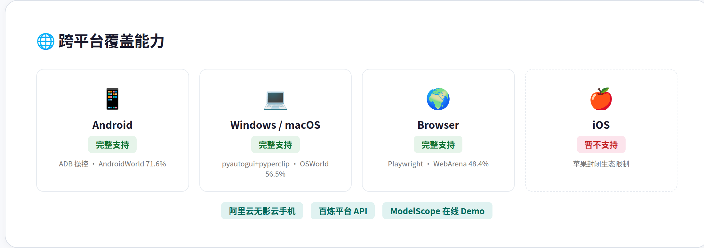
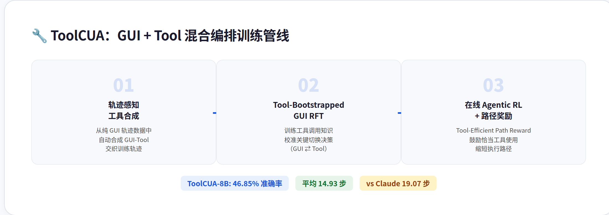
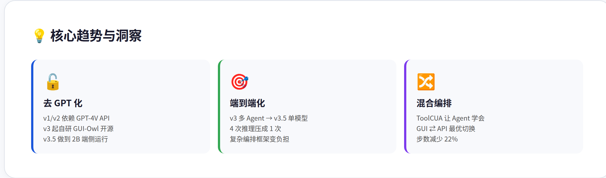
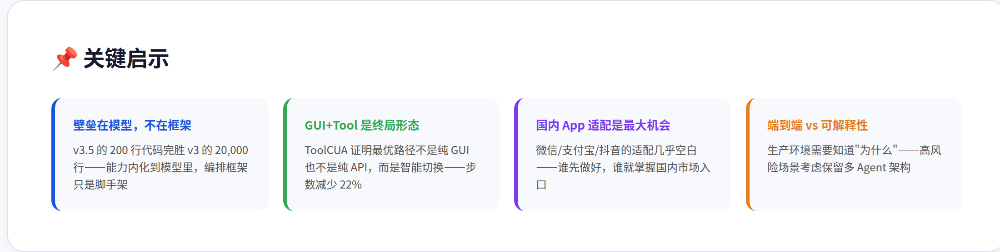

# MobileAgent 项目深度调研报告

> **核心发现**：阿里通义实验室的 GUI Agent 家族（8,892 Stars）正在完成从"调 GPT-4V API 的薄封装"到"自研开源视觉模型+全栈训练基础设施"的范式跃迁，v3.5 端到端架构将 4 次 VLM 推理压成 1 次，2B 模型即可端侧运行。

---

## 目录

1. [概述](#1-概述)
2. [版本演进](#2-版本演进)
3. [架构分析：从编排到模型](#3-架构分析从编排到模型)
4. [模型能力：GUI-Owl 1.5](#4-模型能力gui-owl-15)
5. [最新进展：ToolCUA](#5-最新进展toolcua)
6. [批判性分析](#6-批判性分析)
7. [总结与启示](#7-总结与启示)

---

## 1. 概述

MobileAgent 是阿里巴巴通义实验室自 2024 年 1 月起持续开发的 GUI Agent 开源项目，覆盖手机、桌面、浏览器全平台。项目已从最初的学术原型成长为包含 8 个子项目、5 篇顶会论文的完整生态，累计 **8,892 Stars、894 Forks**。

与 Claude Computer Use、OpenAI Operator 等闭源方案相比，MobileAgent 的核心差异化策略是 **「模型+框架+训练+评测」四位一体全栈开源**：既提供端到端的 GUI-Owl 视觉语言模型（从 2B 到 235B），也提供多 Agent 协作框架，还开源了 UI-S1 的强化学习训练基础设施和多项评测基准。

| 维度的指标 | 数值 |
|-----------|------|
| GitHub Stars | 8,892 |
| 子项目数 | 8（v1/v2/v3/v3.5/E/PC-Agent/UI-S1/Critic-R1） |
| 顶会收录 | NeurIPS×2, ICLR×2, ACL 2026 |
| 模型参数范围 | 2B ~ 235B |
| 支持平台 | Android / Windows / macOS / Browser |
| 商用渠道 | 阿里云百炼 API / 无影云手机 / ModelScope |

---

## 2. 版本演进

MobileAgent 的演进路径清晰反映了一个核心趋势：**从专用到通用，从多 Agent 编排到端到端模型，从依赖外部 API 到全栈自研**。

### 2.1 三个阶段

| 阶段 | 代表版本 | 核心特征 | 模型来源 |
|------|---------|---------|---------|
| **学术探索期** (2024) | v1, v2 | 验证"AI 看屏幕操作手机"的可行性 | GPT-4V API |
| **自研突破期** (2025) | v3, E, PC-Agent | 自研 GUI-Owl 模型，跨平台多 Agent 框架 | 自研开源 |
| **工程成熟期** (2026) | v3.5, ToolCUA | 端到端推理，2B 可端侧部署，Tool/MCP 混合编排 | 自研全系开源 |

从 v1 到 v3.5 最值得关注的变化是 **"去 GPT 化"**。v1/v2 时代必须依赖 GPT-4V 的视觉能力，无法控制模型行为，也无法优化延迟。v3 开始自研 GUI-Owl 并在 AndroidWorld 上超越 GPT-4V 方案，v3.5 更进一步做到了 **2B 小模型即可在边缘设备运行**。我认为这是整个项目最聪明的战略选择——GUI Agent 的真正壁垒不在编排层（大家都能写 Manager-Executor 循环），而在能精准理解 UI 截图并输出像素级操作的视觉模型。

### 2.2 GUI-Critic-R1 与 UI-S1 的定位

除了主线版本，两个子项目提供了重要的基础设施支撑。GUI-Critic-R1（NeurIPS 2025）专注**操作前的错误诊断**——在执行动作前先判断是否会出错，这比操作后反思更高效。UI-S1（ACL 2026）则开源了完整的 **半在线强化学习训练框架**（基于 VERL），让社区可以自己训练 GUI Agent 模型。这两个项目虽然 Stars 不如主线，但学术价值和生态意义很高。

---

## 3. 架构分析：从编排到模型

v3 到 v3.5 的架构变化是整个项目最有意思的设计决策。v3 采用经典的**多 Agent 协作**模式：Manager 规划 → Executor 执行 → ActionReflector 反思 → Notetaker 记录。每轮交互需要 4 次 VLM 推理，延迟高、Token 消耗大、4 个独立 Prompt 都需要精心调优。

v3.5 做了一个大胆的简化：**把所有能力压进单个模型的一次推理**。GUI-Owl 1.5 直接输出 `<tool_call>` JSON 格式的动作，思考链内化在模型推理过程中，无需外部编排。

### 3.1 为什么端到端更好？

| 维度 | v3 多 Agent | v3.5 端到端 |
|------|------------|------------|
| 每轮 VLM 调用 | 4 次 | 1 次 |
| 延迟 | ~12-20 秒/步 | ~3-6 秒/步 |
| 上下文窗口 | 分散在 4 个 Agent | 统一在单模型内 |
| 隐式规划 | 需显式 Prompt 传递 | 模型内部推理完成 |
| Tool/MCP 调用 | 不支持 | 原生支持 |
| 维护成本 | 4 套 Prompt 模板 | 1 套推理代码 |

值得注意的设计细节：v3 的 **连续错误触发重规划** 机制（`error_flag_plan`）——当连续 2 次动作失败时，Manager 会被注入失败历史强制重新规划。这个设计在 v3.5 中不需要了，因为 GUI-Owl 1.5 的 Thinking 变体内化了反思能力。

### 3.2 代码规模对比

v3 的 `mobile_agent_e.py` 定义 Manager/Executor/Reflector/Notetaker 四个 Agent 的 Prompt 模板，加上 AndroidWorld 评测适配器，总代码量约 **20,000 行**。v3.5 的 `run_gui_owl_1_5_for_mobile.py` 只有 **~200 行**：初始化 ADB 连接、截图、调 GUI-Owl API、解析 `<tool_call>` JSON、执行动作——简洁到令人惊讶。

这个数据本身就在说：**当模型足够强时，框架应该消失**。

---

## 4. 模型能力：GUI-Owl 1.5

GUI-Owl 1.5 是 v3.5 的核心，基于 Qwen3-VL 构建了从 2B 到 235B 的完整模型族：

### 4.1 基准性能

模型在 20+ GUI 基准上达到开源 SOTA，关键指标：

| 基准 | 最佳模型 | 得分 | 对比 |
|------|---------|------|------|
| OSWorld（桌面综合） | 32B-Instruct | 56.5% | 超过 GPT-4o |
| AndroidWorld（手机综合） | 8B-Thinking | 71.6% | 开源第一 |
| WebArena（浏览器） | 32B-Thinking | 48.4% | 开源第一 |
| OSWorld-MCP（Tool调用） | 32B-Instruct | 47.6% | 开源第一 |
| ScreenSpot-Pro（定位） | - | 80.3% | 开源 SOTA |

### 4.2 三大技术创新

**Hybrid Data Flywheel**（混合数据飞轮）：结合模拟环境和云端沙箱，自动生成 UI 理解+轨迹数据，减少人工标注依赖。这是规模化训练的关键——GUI Agent 的轨迹数据标注成本极高，自动化 pipeline 是唯一的经济可行路径。

**Unified Agent Capability Enhancement**（统一能力增强）：用统一的思考合成管线同时训练 Tool/MCP 调用、记忆、多 Agent 适配能力，避免各能力之间的遗忘冲突。

**MRPO**（Multi-platform Environment RL）：解决跨平台训练中的冲突问题——在桌面学到的操作方式可能和手机相反，MRPO 通过多平台联合优化缓解了这个矛盾。

---

## 5. 最新进展：ToolCUA

ToolCUA（2026.05 发布，54 Stars）提出了一个直击要害的问题：**GUI Agent 什么时候该"点屏幕"，什么时候该"调 API"？**

### 5.1 路径选择困惑

论文诊断发现了一个「路径选择困惑」（Path Selection Confusion）现象：给了 Agent 两种能力（GUI 点击 + API 调用），但简单模型倾向于只点屏幕不调工具，强模型可能过度依赖工具调用反而降低成功率。瓶颈不是工具不可用，而是 Agent 不知道什么时候该切换。

### 5.2 三阶段训练管线

ToolCUA 的三阶段训练针对性地解决了这个问题：首先从纯 GUI 轨迹合成 GUI-Tool 交织数据（解决数据稀缺），然后用工具引导的 RFT 训练切换决策（解决切换时机），最后用 RL + 路径效率奖励做全局优化（解决过度使用问题）。

结果令人印象深刻：**ToolCUA-8B 达到 46.85% 准确率的同时，平均只用 14.93 步**，比 Claude-4-5-Sonnet（48.35%, 19.07 步）少了 22% 的步数。这意味着 ToolCUA 学会了"用合适的工具做合适的事"。

> **我的判断**：ToolCUA 是 MobileAgent 系列最重要的下一步方向。纯 GUI 操作的效率天花板很低——有些操作用 API 比点屏幕快 10 倍。但最大的工程风险在于**合成轨迹数据的质量**——如果合成时把 Tool 调用放在了不合理的时机，模型学到的就是错误模式。目前论文还没开源数据 pipeline，这是评估其可复现性的关键。

---

## 6. 批判性分析

### 6.1 「全栈开源」的诚意与局限

MobileAgent 标榜"全栈开源"，但实际上有几个灰色地带：v3.5 的评测代码尚未开源（README 中标记 `[ ] Open source evaluation code on benchmarks`），部分大模型权重发布有延迟，iOS 支持受限于平台生态至今缺失。此外，在线 Demo 强依赖阿里云百炼/ModelScope，自部署的门槛不低——需要 GPU 跑 GUI-Owl 模型 + Android 设备/模拟器。

**我的看法**：这更像是开源社区的「惯性问题」而非故意保留。学术团队发布论文时往往优先丢模型和核心代码，评测脚本和配套工具链是第二批。考虑到他们过去两年 5 篇顶会的发布节奏，这个 incomplete 状态是可以理解的。但对于想实际使用的开发者来说，要做好"部分功能得自己补"的准备。

### 6.2 端到端的隐忧

v3.5 把多 Agent 协作压进单模型推理，确实简洁高效，但失去了**可解释性和可控性**。在 v3 中，你可以看到 Manager 的规划、Reflector 的反思——每一步的决策链路是透明的。v3.5 中所有推理都在模型黑盒内完成，出了问题很难定位是规划错误还是执行错误。

**我认为这是 Agent 设计的普遍权衡**：多 Agent 框架的优势在于可调试、可插拔、可针对性优化；端到端模型的优势在于低延迟、低成本。对于生产环境，如果错误成本高（比如支付、安全相关操作），v3 的多 Agent 架构可能更合适——至少能看到"为什么做了这个决策"。

### 6.3 中国 App 生态的鸿沟

MobileAgent 的主要测试场景是英文 App——Google 全家桶、Chrome、WPS 等国际应用。对微信、支付宝、抖音、小红书等国内超级 App 的适配非常有限。v3 中提供了 `custom_tips_example_for_cn_apps.txt` 来引导 Agent 操作中文 App，但这只是 Prompt 层面的工作，没有针对性的模型微调。

**这对国内用户来说是个很大的落差**——MobileAgent 在 AndroidWorld 上能做到 71.6%，但换个微信场景可能直接失灵。阿里作为国内公司，这个方向的投入似乎不足，可能是因为商业化重心在海外市场（OSWorld、WebArena 都是英文基准）。

### 6.4 与 Hermes 的关系

MobileAgent 和 Hermes 在能力上互补而非竞争。MobileAgent 擅长"看屏幕并操作"（视觉+像素级交互），Hermes 擅长"思考并编排"（逻辑推理+工具链调度）。理想的集成方向是「MobileAgent 当手，Hermes 当脑」——但现实障碍是 MobileAgent 的部署成本（GPU + Android 设备）让这种集成的 ROI 存疑。

**我的建议**：暂时不追求深度集成。如果未来有低成本的 MobileAgent API（类似百炼的按调用付费），可以作为 Hermes 的一个可选工具接入。目前的优先级应该是关注它的方法论——InfoPool 共享状态设计、连续错误触发重规划、相对坐标系统——这些对 Hermes 自己的 Agent 编排也有参考价值。

---

## 7. 总结与启示

MobileAgent 是至今最完整的开源 GUI Agent 生态。它用两年时间完成了从「学术 Demo」到「可商用开源项目」的蜕变，现在拥有从 2B 端侧模型到 235B 云端巨兽的完整产品矩阵，在 20+ 基准上达到开源 SOTA。

**核心启示**：

1. **GUI Agent 的壁垒在视觉模型，不在编排框架**——v3.5 的 200 行代码胜过 v3 的 20,000 行，因为能力内化到了模型里
2. **端到端是方向，但可解释性不能丢**——生产环境需要知道 Agent "为什么做了这个决策"
3. **GUI + Tool 混合编排是终局形态**——ToolCUA 证明了最优路径不是纯 GUI 也不是纯 API，而是智能切换
4. **国内 App 适配是最大工程机会**——谁先把微信/支付宝/抖音的 MobileAgent 适配做好，谁就掌握了国内市场的入口

**下一步建议关注**：ToolCUA 的数据 pipeline 开源进度（决定可复现性）、GUI-Owl 模型的量化/蒸馏效果（决定端侧部署可行性）、以及是否有面向中国 App 的专项优化版本。

---

*报告基于 GitHub [X-PLUG/MobileAgent](https://github.com/X-PLUG/MobileAgent) main 分支源码、arxiv 论文（2602.16855 / 2508.15144 / 2605.12481）分析。2026-06-30*
