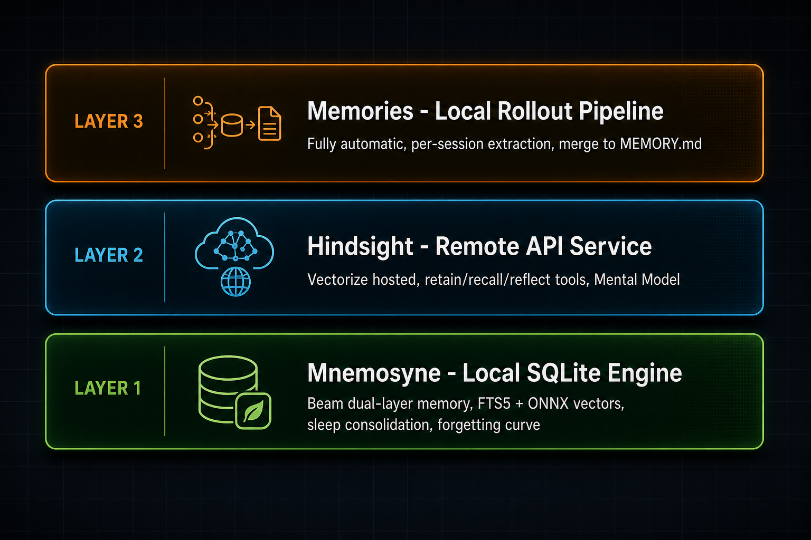

# oh-my-pi (omp) 记忆系统深度调研报告

> 调研日期：2026-05-30
> 仓库：https://github.com/can1357/oh-my-pi (branch: main)
> 版本：15.5.15
> 调研人：Hermes Agent

---

## 一、项目背景

oh-my-pi（简称 omp）是目前功能最全面的开源终端 coding agent 之一，由 Can Bölük 在 Mario Zechner 的 Pi 基础上 fork 并大幅扩展。

- ⭐ 8.6k stars · 690 forks
- 🔤 TypeScript + Rust 混合架构，Bun 运行时
- 📦 32 个内置工具 · 40+ LLM provider · ~27k 行 Rust
- 📜 MIT 许可

omp 的记忆系统是其最核心的差异化特性之一，提供了 **三套互补的记忆机制**，从简单的文件摘要到带遗忘曲线的 SQLite 本地引擎，再到云端 Mental Model 服务。

---

## 二、三套记忆系统总览



用户通过 `memory.backend` 配置选择后端：

```yaml
memory:
  backend: mnemosyne   # "hindsight" | "mnemosyne" | "local" | "off"
```

| 系统 | 存储方式 | 运行位置 | 触发模式 | 适合场景 |
|------|---------|---------|---------|---------|
| **Memories** | 本地文件 `MEMORY.md` + `memory_summary.md` | 本地后台管道 | 完全自动（启动时） | 零配置知识蒸馏 |
| **Hindsight** | 远程 Vectorize API | 云端 | 工具触发 + 自动首回合 recall | 团队共享、云端同步 |
| **Mnemosyne** | 本地 SQLite（FTS5 + 可选 ONNX 向量） | 进程内 | 工具触发 + 自动首回合 recall | 离线、隐私敏感、细粒度控制 |

---

## 三、Memories — 自主知识蒸馏管道

### 3.1 设计理念

这是最"自动化"的一层。**完全不需要 agent 主动调用任何工具**，后台管道在每次启动时自动从历史会话中提取知识。

### 3.2 两阶段工作流

```
Phase 1: 逐会话提取（使用 default 模型）
  ├── 输入：每个历史会话的消息记录
  ├── 跳过：太旧(>30天)、太新(<12小时)、当前活跃的会话
  ├── 单次启动上限：64 个会话
  └── 输出：每个会话的 raw memory block + synopsis

Phase 2: 合并（使用 smol 模型，便宜快速）
  ├── 输入：所有 Phase 1 的提取结果
  ├── 合并防重入：lease 机制防止多进程同时执行
  └── 输出三个文件：
      ├── MEMORY.md          — 完整长期记忆文档（人工可读）
      ├── memory_summary.md  — 精简版（注入 system prompt，≤5000 tokens）
      └── skills/            — 自动生成的可复用过程手册
```

### 3.3 注入方式

每个新会话启动时，`memory_summary.md` 作为 **Memory Guidance** 块注入 system prompt。Agent 被指示：

- 记忆是启发式上下文，不是指令
- 与当前仓库状态冲突时，以仓库为准
- 引用记忆时标注来源路径，结合当前证据再行动

### 3.4 安全措施

所有输出写盘前经过 **secrets 扫描**，防止 API key 等敏感信息被持久化。

### 3.5 `memory://` URL 协议

```
memory://root                    → memory_summary.md（精简版）
memory://root/MEMORY.md          → 完整长期记忆文档
memory://root/skills/<name>      → 自动生成的 skill 手册
```

路径安全校验：`validateRelativePath()` + `ensureWithinRoot()` + `fs.realpath()` 双重检查，防止路径穿越。

### 3.6 `/memory` 命令

| 子命令 | 效果 |
|--------|------|
| `view` | 查看当前注入的记忆内容 |
| `clear` / `reset` | 删除所有记忆数据和生成物 |
| `enqueue` / `rebuild` | 强制下次启动时重新合并 |

### 3.7 配置项

| 设置 | 默认值 | 说明 |
|------|--------|------|
| `memories.enabled` | `false` | 总开关 |
| `memories.maxRolloutAgeDays` | `30` | 超过此天数的会话不处理 |
| `memories.minRolloutIdleHours` | `12` | 活跃于此时间内的会话跳过 |
| `memories.maxRolloutsPerStartup` | `64` | 单次启动最多处理会话数 |
| `memories.summaryInjectionTokenLimit` | `5000` | 注入 system prompt 的 token 上限 |

---

## 四、Hindsight — 远程 API 记忆服务

### 4.1 架构概览

Hindsight 基于 [Vectorize](https://hindsight.vectorize.io) 托管的记忆服务，通过 REST API 交互。

```
session_start  → auto recall → 注入 <memories> 到 system prompt
     ↓
[对话进行中，agent 调用 retain 工具]
     ↓
agent_end      → auto retain（满 N 轮后） + flush 队列 + 刷新 Mental Model TTL
```

### 4.2 三个工具

#### retain — 写入记忆

```
工具调用 → HindsightRetainQueue → 批量(≤16条) + 防抖(5s) → Vectorize API
自动触发 → agent_end 时，如果用户轮数达到 retainEveryNTurns → 全会话 transcript 异步上传
```

存储内容：
- 持久化、可复用的知识：用户偏好、项目决策、架构选择
- 每条记忆带 `session_id` 元数据
- **明确排除**临时任务状态

#### recall — 搜索记忆

```
首回合自动触发（每个对话仅一次）
  ├── 组合查询：最新用户消息 + 可选前文上下文
  ├── 查询截断至 recallMaxQueryChars 预算
  └── 结果格式：带类型和日期的 bullet list，包裹在 <memories> XML 标签中

Agent 主动调用
  └── 自然语言查询 → Vectorize API → 预排序结果
```

#### reflect — 综合推理

```
Agent 调用 reflect(query, context?)
  → 确保 bank 有 mission 配置
  → Vectorize API 服务端推理
  → 返回综合多个记忆的连贯回答
```

### 4.3 Bank 作用域设计

```
bankId = {prefix}-{id}  (默认前缀 "omp")
```

| 模式 | Bank ID | 行为 |
|------|---------|------|
| `global` | `omp` | 单一共享 bank，所有项目共用 |
| `per-project` | `omp-{project}` | 硬隔离，每个项目独立 bank |
| `per-project-tagged` | `omp`（共享） | 写入带 `project:xxx` 标签，recall 用 `any` 匹配 |

**`per-project-tagged` 是默认且最精巧的设计**：项目记忆和全局用户偏好共存于同一个 bank，一次 recall 就能同时获取两者。

### 4.4 Mental Models — 心理模型（核心创新）

在 raw memory 之上维护 **命名的、持久化的结构化摘要**，代表从大量记忆中蒸馏出的长期知识。

#### 三个预置种子

```json
[
  { "name": "user-preferences",     "scope": "global",      "budget": 600, "mode": "delta" },
  { "name": "project-conventions",  "scope": "per-project", "budget": 800, "mode": "delta" },
  { "name": "project-decisions",    "scope": "per-project", "budget": 800, "mode": "delta" }
]
```

#### 生命周期

```
首次启动 → 检查 seed 是否存在 → 不存在则创建（绝不会覆盖已有）
     ↓
每次会话结束 → 服务端增量更新（delta mode + refresh_after_consolidation）
     ↓
渲染时 → 组装为 <mental_models> XML 块
     ├── 前言：提醒 LLM 将其视为背景知识而非指令
     ├── 每个模型带标题和刷新时间戳
     ├── 硬性 16,000 字符预算，按比例截断
     └── 溢出标记：…[mental-model snapshot truncated at render budget]
```

#### 首回合竞速

```typescript
const MENTAL_MODEL_FIRST_TURN_DEADLINE_MS = 1500;
// Mental model 加载与 1.5s deadline 竞速
// API 快就注入，慢也不阻塞用户
```

#### Create-Only 设计哲学

种子只在不存在时创建，**绝不修改已有模型**。防止配置漂移意外销毁人工维护的模型。结构性变更需要手动删除后重新 seed。

### 4.5 防反馈循环（关键安全机制）

```typescript
// content.ts
function stripMemoryTags(transcript: string): string {
  // 移除 <memories>, <mental_models>, 以及遗留标签变体
}
```

**为什么必须剥离？**

```
recall → 注入 system prompt → agent 输出（包含记忆内容）→
→ retain 保存 → 合并 → 新记忆 = 旧记忆的复述 →
→ 下次 recall → 更多复述 → 记忆膨胀 → 信息熵趋零
```

`stripMemoryTags()` 在 retain 之前清理 transcript，切断正反馈回路。

### 4.6 子代理处理

```typescript
if (taskDepth > 0) {
  // 创建 alias state，复用父代的 client/bank/config
  // 跳过 auto-recall 和 auto-retain
  // 防止内部探索性 transcript 污染 memory bank
}
```

### 4.7 批量保留队列

```typescript
class HindsightRetainQueue {
  debounceTimer = 5000;     // 5 秒防抖
  maxBatchSize = 16;        // 每次最多 16 条
  async = true;             // 服务端异步处理
  // 失败仅 UI 警告，不通知 LLM
}
```

### 4.8 MissionsSet

```typescript
// 每个 bank 每进程最多调用一次 createBank
// 10,000 条上限，超出淘汰最老的一半
class MissionsSet extends Set<string> {
  cap = 10000;
  evictOldestHalf() { ... }
}
```

### 4.9 配置项

| 设置 | 默认值 | 说明 |
|------|--------|------|
| `scoping` | `per-project-tagged` | Bank 隔离策略 |
| `autoRecall` | from settings | 首回合自动 recall |
| `autoRetain` | from settings | 结束时自动 retain |
| `retainMode` | `full-session` | 保留范围 |
| `retainEveryNTurns` | from settings | 每 N 轮触发一次 |
| `recallBudget` | `mid` | 服务端召回质量 |
| `recallContextTurns` | from settings | 查询中的前文轮数 |
| `mentalModelsEnabled` | from settings | Mental Model 开关 |
| `mentalModelAutoSeed` | from settings | 首次启动自动 seed |
| `mentalModelRefreshIntervalMs` | from settings | 缓存 TTL |

---

## 五、Mnemosyne — 本地 SQLite 记忆引擎

### 5.1 架构概览

Mnemosyne 是 omp 中最复杂的记忆系统，灵感来自认知科学的工作记忆/情景记忆分层模型。

```
remember(content)
  → 写入 working_memory 表
  → FTS5 触发器自动同步全文索引
  → 可选生成 ONNX 向量嵌入

recall(query)
  → FTS5 全文搜索 + 向量余弦相似度 + 重要性加权
  → MMR 重排序（平衡相关性与多样性）
  → 同义词扩展 + 查询意图分类 + 时间解析

sleep()（巩固）
  → working_memory → episodic_memory（AAAC 压缩）
  → 触发 degradeEpisodic() 降级旧记忆
```

### 5.2 Beam 双层记忆架构

#### 工作记忆（working_memory）

临时的、会话级的，TTL 24 小时。

```sql
CREATE TABLE working_memory (
  id TEXT PRIMARY KEY,
  content TEXT NOT NULL,
  source TEXT,
  session_id TEXT DEFAULT 'default',
  importance REAL DEFAULT 0.5,        -- 0.0-1.0 重要性评分
  veracity TEXT DEFAULT 'unknown',    -- true/stated/unknown/inferred/tool/false
  memory_type TEXT DEFAULT 'unknown', -- fact/unknown
  consolidated_at TEXT,               -- 非 NULL = 已巩固
  recall_count INTEGER DEFAULT 0,     -- 被召回次数（热度追踪）
  last_recalled TIMESTAMP,
  valid_until TIMESTAMP,              -- 过期时间
  superseded_by TEXT,                 -- 被哪条新记忆替代
  scope TEXT DEFAULT 'global',        -- global/session
  trust_tier TEXT DEFAULT 'STATED',   -- STATED/INFERVED/...
  author_id TEXT,
  author_type TEXT,
  event_date TEXT,                    -- 事件发生日期
  event_date_precision TEXT,          -- 精度：day/month/year
  temporal_tags TEXT DEFAULT '[]',    -- 时间标签 JSON
  corrected_by INTEGER,              -- 被纠正的记录
  validator TEXT,
  validated_at TIMESTAMP,
  validation_count INTEGER DEFAULT 0,
  created_at TIMESTAMP DEFAULT CURRENT_TIMESTAMP
);
```

#### 情景记忆（episodic_memory）

持久的、跨会话的，三级衰减。

```sql
CREATE TABLE episodic_memory (
  rowid INTEGER PRIMARY KEY AUTOINCREMENT,
  id TEXT UNIQUE NOT NULL,
  content TEXT NOT NULL,
  -- ... 同 working_memory 大部分字段 ...
  tier INTEGER DEFAULT 1,             -- 1=完整, 2=压缩(30天), 3=极度压缩(180天)
  degraded_at TEXT,
  binary_vector BLOB,                 -- ONNX 嵌入向量 (384维)
  summary_of TEXT DEFAULT ''          -- 汇总自哪些 working memory IDs
);
```

#### 结构化事实表（memoria_facts）

```sql
CREATE TABLE memoria_facts (
  id INTEGER PRIMARY KEY AUTOINCREMENT,
  session_id TEXT,
  message_idx INTEGER,
  fact_type TEXT,                     -- metric/date/version/entity/sequence/timeline/negation/decision
  key TEXT,
  value TEXT,
  context_snippet TEXT,
  importance REAL DEFAULT 0.5,
  version_id INTEGER DEFAULT 0,       -- 事实版本号
  previous_value TEXT,                -- 上一个值（变更追踪）
  valid_from_msg_idx INTEGER,         -- 有效期开始（消息索引粒度）
  valid_to_msg INTEGER,               -- 有效期结束
  source_memory_id TEXT
);
```

#### 暂存区（scratchpad）

```sql
CREATE TABLE scratchpad (
  id TEXT PRIMARY KEY,
  content TEXT NOT NULL,
  session_id TEXT DEFAULT 'default',
  created_at TIMESTAMP,
  updated_at TIMESTAMP
);
```

### 5.3 Recall 策略 — 多信号融合

```typescript
// 三路信号加权融合
score = vecWeight      * dense_score        // 向量余弦相似度 (默认 0.5)
      + ftsWeight      * fts_score          // FTS5 全文匹配   (默认 0.3)
      + importanceWeight * importance        // 记忆重要性      (默认 0.2)
```

#### 增强机制

| 机制 | 说明 |
|------|------|
| **查询意图分类** | 6 种意图类型，每种独立调整三路权重（见下表） |
| **同义词扩展** | `branding` → `positioning, wording, headline` |
| **时间解析** | `last week`、`2 months ago` → 时间范围过滤 |
| **MMR 重排序** | Maximal Marginal Relevance，平衡相关性与多样性 |
| **Veracity 加权** | `true`=1.0, `stated`=1.0, `unknown`=0.8, `inferred`=0.7, `tool`=0.5, `false`=0.0 |
| **FTS5 触发器** | INSERT/UPDATE/DELETE 自动同步全文索引 |
| **停用词过滤** | 30+ 英文停用词 |
| **Unicode 分词** | `\p{L}\p{N}_` 正则，支持多语言 |
| **Weibull 时间衰减** | 每种记忆类型独立的遗忘曲线参数 |

#### 查询意图分类权重（query-intent.ts）

| 意图类型 | vec_bias | fts_bias | importance_bias | 典型查询 |
|---------|----------|----------|-----------------|---------|
| **temporal** | 0.6 | **1.5** | 0.8 | "when did we...", "last week" |
| **factual** | 1.0 | **1.2** | 0.9 | "what is...", "how many..." |
| **entity** | **1.1** | 1.0 | **1.3** | "tell me about X" |
| **preference** | 0.9 | 0.8 | **1.5** | "do you prefer...", "choose between" |
| **procedural** | **1.3** | 0.9 | 0.7 | "how to...", "steps to..." |
| **general** | 1.0 | 1.0 | 1.0 | 默认 |

**洞察**：
- 时间查询（temporal）大幅偏向 FTS（1.5x）—— 精确日期词匹配比语义向量更可靠
- 偏好查询（preference）大幅偏向 importance（1.5x）—— 用户偏好通常重要性高
- 过程查询（procedural）大幅偏向向量（1.3x）—— 步骤类内容语义匹配更好
- 最终权重会归一化到 sum=1

#### FTS5 + 向量混合检索流程

```
query → tokenize + 停用词过滤 + 同义词扩展
  ├─→ FTS5 全文搜索 → fts_score
  ├─→ ONNX 嵌入 → 余弦相似度 → dense_score
  └─→ importance 查询 → importance_score
        ↓
  三路加权融合 → MMR 重排序 → top-K 结果
```

### 5.4 Sleep（巩固）— 记忆的"睡眠"

```typescript
function sleep(beam, dryRun = false): SleepResult {
  // 1. 找到 eligible 的 working memory
  //    条件：timestamp < TTL/2 且 consolidated_at IS NULL
  //    乐观锁：先 claim（设 consolidated_at），被并发抢走的跳过
  
  // 2. 按 source 分组
  
  // 3. 每组用 AAAC 编码合并为一条情景记忆
  //    summary = `[${source}] ${aaakEncode(lines.join(" | "))}`
  //    默认不用 LLM（节省成本）
  
  // 4. 写入 episodic_memory，标记 source IDs
  
  // 5. 触发 degradeEpisodic() 降级旧记忆
}
```

### 5.5 Weibull 衰减函数（比 Tier 更精密）

之前远程分析中描述的"3 级 Tier 降级"只是粗粒度的 episodic memory 压缩。实际上 omp 还有一套更精密的 **Weibull 衰减函数**，用于 recall 时的时间加权。

#### Weibull 分布公式

```typescript
// weibull.ts
// k = shape（形状参数），eta = scale（尺度参数，单位：小时）
decay = exp(-((ageHours / eta) ** k))
```

#### 每种记忆类型独立的衰减参数

| 记忆类型 | k (shape) | eta (scale, 小时) | 约等于半衰期 | 衰减速率 |
|---------|-----------|-------------------|-------------|---------|
| **profile** | 0.3 | 8760 | ~1 年 | 极慢 |
| **relationship** | 0.35 | 8760 | ~1 年 | 极慢 |
| **preference** | 0.4 | 4380 | ~6 个月 | 很慢 |
| **entity** | 0.5 | 4380 | ~6 个月 | 很慢 |
| **learning** | 0.7 | 1440 | ~2 个月 | 中等 |
| **setup** | 0.6 | 2160 | ~3 个月 | 慢 |
| **pattern** | 0.6 | 1680 | ~2.5 个月 | 慢 |
| **artifact** | 0.75 | 2160 | ~3 个月 | 慢 |
| **fact** | 0.8 | 720 | ~1 个月 | 中等 |
| **project** | 0.85 | 1080 | ~1.5 个月 | 中等 |
| **goal** | 0.9 | 720 | ~1 个月 | 中等 |
| **context** | 0.85 | 360 | ~2 周 | 较快 |
| **observation** | 0.9 | 480 | ~3 周 | 中等 |
| **instruction** | 0.9 | 480 | ~3 周 | 中等 |
| **decision** | 1.0 | 336 | ~2 周 | 快 |
| **commitment** | 1.0 | 240 | ~10 天 | 快 |
| **error** | 1.1 | 336 | ~2 周 | 快 |
| **issue** | 1.1 | 336 | ~2 周 | 快 |
| **event** | 1.2 | 168 | ~1 周 | 很快 |
| **request** | 1.5 | 72 | ~3 天 | 极快 |
| **general** | 1.0 | 168 | ~1 周 | 快 |

**关键设计洞察**：
- `k` 越大，衰减越"急"（记忆越快消失）
- `eta` 越大，衰减越"慢"（记忆越持久）
- **profile/relationship/preference** 类型设计为几乎永久（eta=8760h=1年，k<0.4）
- **event/request** 类型设计为快速消退（eta=72-168h，k>1.0）
- 这比简单的 3 级 Tier 精密得多——每种记忆类型有自己的遗忘曲线

#### Tier 降级（粗粒度压缩）

除了 Weibull 精细衰减，episodic memory 还有 Tier 降级机制：

```
Tier 1 (完整原文)
  │ 30 天后
  ▼
Tier 2 (LLM 压缩)
  │ 180 天后
  ▼
Tier 3 (极度压缩, ≤300 字符)
```

```typescript
const TIER2_DAYS = 30;
const TIER3_DAYS = 180;
const TIER3_MAX_CHARS = 300;
const DEGRADE_BATCH_SIZE = 100;
```

### 5.6 注解系统（AnnotationStore）

除了文本记忆，还有结构化的注解三元组：

```typescript
annotations.add(memoryId, "mentions", "deployment");
annotations.add(memoryId, "occurred_on", "2026-05-30");
annotations.add(memoryId, "has_source", "user-retain");
annotations.add(memoryId, "fact", "uses TypeScript");

// 查询
annotations.queryByMemory(memoryId, "mentions");
annotations.queryByKind("has_source", { value: "user-retain" });
annotations.getDistinctValues("mentions");
```

底层存储在 `triples` 表中，支持 `queryByMemory`、`queryByKind`、`getDistinctValues`。

### 5.7 Episodic Graph（情景图谱）

```typescript
class EpisodicGraph {
  // 在情景记忆之间建立关联关系
  // 用于增强 recall 的上下文连贯性
}
```

### 5.8 14 种记忆类型分类（typed-memory.ts）

Mnemosyne 在写入时自动对每条记忆进行 **类型分类**，类型决定衰减速率、巩固策略和优先级。

| 类型 | 优先级 | 衰减率 | 可巩固 | 说明 |
|------|--------|--------|--------|------|
| **instruction** | 10 (最高) | 0.05 | ✅ | 规则、指引（always/never/must） |
| **commitment** | 9 | 0.5 | ❌ | 承诺、截止日期（deadline/due） |
| **error** | 8 | 0.05 | ❌ | 要避免的错误（crash/failure） |
| **goal** | 7 | 0.4 | ✅ | 目标（KPI/metric/OKR） |
| **decision** | 6 | 0.3 | ✅ | 决策（decided/chose/selected） |
| **preference** | 5 | 0.2 | ✅ | 偏好（prefer/like/dislike） |
| **fact** | 4 | 0.1 | ✅ | 事实（is/are/version） |
| **relationship** | 4 | 0.1 | ✅ | 关系（manages/owns/depends） |
| **learning** | 3 | 0.3 | ✅ | 学到的教训（learned/discovered） |
| **observation** | 3 | 0.5 | ✅ | 观察到的模式（noticed/pattern） |
| **event** | 2 | 0.7 | ❌ | 事件（meeting/happened） |
| **context** | 2 | 0.9 | ❌ | 上下文（currently/working on） |
| **artifact** | 1 (最低) | 0.1 | ❌ | 文档引用（PR/commit/README） |
| **unknown** | 0 | 0.3 | ❌ | 默认 |

**分类机制**：
- 基于 70+ 条正则模式匹配（`TYPE_PATTERNS`），每条带基础置信度和优先级
- 短文本 (<5 词) 默认归为 FACT，长文本默认归为 CONTEXT
- `CONFIDENCE_BOOSTERS`：每种类型有关键词列表（如 FACT 的 "verified/confirmed/official"），每匹配一个 +0.05 置信度

#### LLM 提取的 5 种结构化数据（extraction.ts）

当 LLM 提取启用时，提取 prompt 要求返回 JSON：

```json
{
  "facts": [],         // 持久化用户指标、状态、知识
  "instructions": [],  // 给 agent 的规则或命令
  "preferences": [],   // 喜好、厌恶及其演变
  "timelines": [],     // 带日期的真实事件
  "kg": []             // 知识图谱三元组 (subject-predicate-object)
}
```

### 5.9 Veracity 真实性评分

```typescript
const VERACITY_WEIGHTS = {
  stated: 1.0,       // 用户明确陈述
  true: 1.0,         // 已验证为真
  likely_true: 1.0,  // 高度可信
  unknown: 0.8,      // 未验证
  inferred: 0.7,     // LLM 推断
  imported: 0.6,     // 从外部导入
  tool: 0.5,         // 工具生成
  false: 0,          // 已验证为假
};
```

巩固时聚合多条源记忆的 veracity：取众数，权重相同时取权重更低的（更保守）。

### 5.10 配置项

| 设置 | 默认值 | 说明 |
|------|--------|------|
| `mnemosyne.dbPath` | agent memories dir | SQLite 数据库路径 |
| `mnemosyne.bank` | 项目目录名 | Bank 名称 |
| `mnemosyne.scoping` | `per-project` | 隔离模式 |
| `mnemosyne.autoRecall` | `true` | 首回合自动 recall |
| `mnemosyne.autoRetain` | `true` | 自动保留 |
| `mnemosyne.retainEveryNTurns` | `4` | 每 N 轮触发 |
| `mnemosyne.recallLimit` | `8` | 最大召回数 |
| `mnemosyne.recallContextTurns` | `3` | 查询中的前文轮数 |
| `mnemosyne.recallMaxQueryChars` | `4000` | 查询最大长度 |
| `mnemosyne.injectionTokenLimit` | `5000` | 注入 token 预算 |
| `mnemosyne.noEmbeddings` | `false` | 禁用向量，仅 FTS5 |
| `mnemosyne.embeddingModel` | `BAAI/bge-small-en-v1.5` | 嵌入模型 |
| `mnemosyne.embeddingApiUrl` | env | 嵌入 API 端点 |
| `mnemosyne.llmMode` | `smol` | LLM 模式 |
| `mnemosyne.debug` | `false` | 调试日志 |

---

## 六、工具层 — retain / recall / reflect

### 6.1 工具接口

三个工具通过 `MemoryBackend` 抽象接口统一：

```typescript
interface MemoryBackend {
  start(): void;
  buildDeveloperInstructions(): string;
  beforeAgentStartPrompt?(): string;
  clear(): void;
  enqueue(): void;
  preCompactionContext?(): string;
}
```

四种后端实现：`"off"` | `"local"` | `"hindsight"` | `"mnemosyne"`。

### 6.2 retain 工具

**Schema**: `{ items: Array<{ content: string, context?: string }> }`

**Prompt 指令**:
> "Store durable, reusable knowledge. Each item MUST be specific and self-contained — include who, what, when, and why. **Ephemeral task state does not belong here.** Batch related facts; they are deduplicated and consolidated."

**Hindsight 路径**: 入队 → 5s 防抖 + 16 条上限批量 → 异步 API 调用
**Mnemosyne 路径**: 同步写入 `rememberScoped()`，importance=0.75, veracity="tool", extract=true

### 6.3 recall 工具

**Schema**: `{ query: string }`

**Prompt 指令**:
> "Use **proactively** — before answering questions about past conversations, user preferences, project decisions. **When in doubt, recall first.** Prefer `recall` for specific facts; use `reflect` for synthesized answers."

**Hindsight 路径**: 远程 API 调用，可配置 budget/types/tags 过滤
**Mnemosyne 路径**: 本地 FTS5+向量混合检索，scoped 到当前 bank

### 6.4 reflect 工具

**Schema**: `{ query: string, context?: string }`

**Prompt 指令**:
> "Generate a synthesized answer by reasoning over long-term memory. Unlike `recall`, `reflect` blends relevant memories into a coherent response."

**Hindsight 路径**: 服务端综合推理（真正的 LLM 合成）
**Mnemosyne 路径**: recall + 格式化（无 LLM 合成，仅原始记忆拼接）

### 6.5 注入点

记忆通过 **四个注入点** 进入对话上下文：

1. **System prompt（持久）**: `buildDeveloperInstructions()` 返回的 markdown
2. **首回合注入**: `beforeAgentStartPrompt()` 在第一条 system prompt 中注入
3. **工具结果（按需）**: agent 调用 recall/reflect 后结果作为 tool result 返回
4. **压缩上下文**: `preCompactionContext()` 在上下文压缩前注入额外记忆

---

## 七、三个后端的统一抽象

### 7.1 Backend 接口

```typescript
interface MemoryBackend {
  // 初始化，每个会话调用一次
  start(): void;
  
  // 构建注入 system prompt 的指令（静态 + mental model + recall）
  buildDeveloperInstructions(): string;
  
  // 首回合 system prompt 拦截
  beforeAgentStartPrompt?(): string;
  
  // 清除持久化状态（/memory clear 命令）
  clear(): void;
  
  // 强制保留/合并（/memory enqueue 命令）
  enqueue(): void;
  
  // 上下文压缩前注入额外记忆
  preCompactionContext?(): string;
}
```

### 7.2 子代理 alias 机制

```typescript
if (taskDepth > 0) {
  // 复用父代的 client, bank, config, missionsSet
  // 跳过 auto-recall 和 auto-retain
  // 防止探索性 transcript 污染记忆
}
```

### 7.3 首回合竞速

```typescript
const MENTAL_MODEL_FIRST_TURN_DEADLINE_MS = 1500;

// Mental model 加载 和 recall 并行执行
// 谁先完成谁注入，1.5s deadline 后不再等待
```

---

## 八、Anti-Pattern 防护

### 8.1 防反馈循环

**问题**: recall → 注入 → agent 输出包含记忆 → retain 保存 → 合并 → 记忆自激膨胀

**解决**: `stripMemoryTags()` 在 retain 前剥离 `<memories>` 和 `<mental_models>` 标签

### 8.2 防子代理污染

**问题**: 子代理的内部探索性对话被 retain 到共享 bank

**解决**: 子代理跳过 auto-recall/auto-retain，仅父代执行

### 8.3 防并发巩固冲突

**问题**: 多个进程同时 sleep 导致重复巩固

**解决**: 乐观锁 + claim 机制（先设 consolidated_at，被抢走的跳过）

### 8.4 防敏感信息泄露

**问题**: API key 等被写入记忆文件

**解决**: 所有输出写盘前经过 secrets 扫描

### 8.5 防 Mental Model 覆盖

**问题**: 配置变更意外销毁人工维护的 Mental Model

**解决**: Create-only 生命周期，seed 只在不存在时创建

---

## 九、与 Hermes Agent / OpenCode 的对比

| 维度 | omp (Mnemosyne) | omp (Hindsight) | omp (Memories) | Hermes Agent | OpenCode |
|------|----------------|-----------------|----------------|-------------|----------|
| **跨会话记忆** | ✅ SQLite | ✅ 远程 API | ✅ 文件 | ✅ YAML | ❌ 无 |
| **记忆工具** | ✅ retain/recall/reflect | ✅ retain/recall/reflect | ❌ 自动 | ✅ memory() | ❌ 无 |
| **向量检索** | ✅ ONNX (384d) | ✅ 服务端 | ❌ | ❌ | ❌ |
| **全文检索** | ✅ FTS5 | ✅ 服务端 | ❌ | ❌ | ❌ |
| **双层记忆** | ✅ working→episodic | ❌ 单层 | ❌ 单层 | ❌ 单层 | ❌ |
| **遗忘曲线** | ✅ 3 级 Tier | ❌ | ❌ | ❌ | ❌ |
| **Mental Model** | ❌ | ✅ 命名摘要 | ❌ | ❌ | ❌ |
| **事实版本追踪** | ✅ version_id | ❌ | ❌ | ❌ | ❌ |
| **睡眠巩固** | ✅ sleep() | ❌ 自动 | ❌ | ❌ | ❌ |
| **反反馈循环** | ❌ | ✅ stripMemoryTags | ❌ | ❌ | ❌ |
| **项目作用域** | ✅ 3 种模式 | ✅ 3 种模式 | ✅ 项目级 | ❌ 全局 | ✅ 项目级 |
| **自动提取** | ❌ 工具触发 | ✅ 自动 | ✅ 完全自动 | ❌ 手动 | ❌ |
| **veracity 评分** | ✅ 7 级 | ❌ | ❌ | ❌ | ❌ |
| **注解系统** | ✅ 三元组 | ❌ | ❌ | ❌ | ❌ |
| **会话内压缩** | ✅ | ✅ | ✅ | ✅ | ✅ 精密 |
| **成本** | 本地计算 | 远程 API | 本地 LLM | 零 | 零 |

---

## 十、值得借鉴的设计

### 10.1 对 Hermes Agent 最有价值的

1. **双层记忆（working → episodic）**
   - 临时记忆自动巩固为长期记忆，模拟人类认知
   - Hermes 目前是单层 YAML，可以引入 working memory 层

2. **FTS5 + 向量混合检索**
   - `0.5*vec + 0.3*fts + 0.2*importance`
   - 不依赖单一信号，比纯文本匹配或纯向量都更鲁棒

3. **遗忘曲线（Tier 降级）**
   - 旧记忆逐渐压缩，防止记忆无限膨胀
   - Tier 1→2→3 对应 0→30→180 天

4. **veracity 真实性评分**
   - 区分"用户说的"vs"工具推断的"vs"LLM 猜的"
   - 召回时加权，用户明确陈述的优先级最高

5. **事实版本追踪**
   - `memoria_facts` 表的 `version_id` + `previous_value`
   - 知道事实何时被更新、旧值是什么

6. **防反馈循环**
   - recall 注入的内容在 retain 前被剥离
   - 防止记忆自激膨胀

7. **per-project-tagged 作用域**
   - 项目记忆和全局偏好共存于同一 bank
   - 一次 recall 全拿到，不需要查两次

8. **Mental Model 种子**
   - 预定义的结构化摘要模板
   - Create-only 不覆盖，delta 增量更新

9. **首回合竞速**
   - 记忆加载与 deadline 竞速
   - 快就注入，慢也不阻塞

### 10.2 设计权衡

| 选择 | 优点 | 缺点 |
|------|------|------|
| 远程 Hindsight | 团队共享、无本地资源 | 依赖外部服务、有延迟 |
| 本地 Mnemosyne | 离线可用、隐私安全 | 需要磁盘空间、本地计算 |
| Memories 管道 | 完全自动、零配置 | 粒度粗、无向量检索 |
| Tier 降级 | 防膨胀、模拟遗忘 | 可能丢失重要旧信息 |
| AAAC 压缩 | 无 LLM 成本 | 压缩质量不如 LLM |
| Create-only seed | 安全、不覆盖 | 结构变更需手动干预 |

---

## 十一、代码结构索引

```
packages/coding-agent/src/
├── hindsight/                    # Hindsight 后端
│   ├── index.ts
│   ├── config.ts                 # 配置解析
│   ├── client.ts                 # HTTP 客户端
│   ├── bank.ts                   # Bank ID 派生 + 标签作用域
│   ├── content.ts                # stripMemoryTags() + transcript 格式化
│   ├── transcript.ts             # 消息提取
│   ├── mental-models.ts          # 种子加载 + 缓存 + 渲染
│   ├── state.ts                  # 每会话运行时状态 + retain 队列
│   ├── backend.ts                # 生命周期接入
│   └── seeds.json                # 三个预置种子定义
├── mnemosyne/                    # Mnemosyne 集成层
│   ├── backend.ts                # MemoryBackend 实现
│   ├── config.ts                 # Mnemosyne 配置
│   └── state.ts                  # 状态管理
├── memory-backend/               # 后端抽象层
│   ├── types.ts                  # MemoryBackend 接口
│   ├── resolve.ts                # 后端选择
│   ├── local-backend.ts          # 本地 rollout 管道
│   └── off-backend.ts            # 空实现
├── tools/
│   ├── memory-retain.ts          # retain 工具
│   ├── memory-recall.ts          # recall 工具
│   ├── memory-reflect.ts         # reflect 工具
│   └── memory-render.ts          # TUI 渲染器
├── prompts/tools/
│   ├── retain.md                 # retain 提示词
│   ├── recall.md                 # recall 提示词
│   └── reflect.md                # reflect 提示词
└── internal-urls/
    └── memory-protocol.ts        # memory:// URL 协议

packages/mnemosyne/src/           # 独立 Mnemosyne 包
├── cli.ts                        # CLI 入口
├── config.ts                     # 配置
└── core/
    ├── aaak.ts                   # AAAC 确定性压缩算法
    ├── annotations.ts            # 注解三元组存储
    ├── banks.ts                  # Bank 管理
    ├── beam/
    │   ├── schema.ts             # SQLite 表结构定义
    │   ├── index.ts              # BeamMemory 类
    │   ├── recall.ts             # 多信号融合召回
    │   ├── consolidate.ts        # sleep + 降级 + 事实提取
    │   ├── store.ts              # CRUD 操作
    │   ├── types.ts              # 类型定义
    │   └── helpers.ts            # 辅助函数
    ├── episodic-graph.ts         # 情景图谱
    ├── embeddings.ts             # ONNX 嵌入
    ├── mmr.ts                    # MMR 重排序
    ├── query-intent.ts           # 查询意图分类
    ├── synonyms.ts               # 同义词扩展
    ├── temporal-parser.ts        # 时间表达式解析
    └── veracity-consolidation.ts # 真实性聚合
```

---

## 十二、总结

omp 的记忆系统是目前开源 coding agent 中 **最成熟、最完整的实现**。三套系统各有所长：

- **Memories** 适合零配置场景，自动从历史会话蒸馏知识
- **Hindsight** 适合需要 Mental Model 和云端同步的场景
- **Mnemosyne** 适合需要细粒度控制、离线使用、隐私敏感的场景

其中最具创新性的设计是：
1. Mnemosyne 的 **Beam 双层架构 + 遗忘曲线 + 事实版本追踪**（接近认知科学模型）
2. Hindsight 的 **Mental Model 种子系统 + 防反馈循环**（解决了记忆自激问题）
3. 统一的 **MemoryBackend 抽象**（一套接口支持四套后端）

对于 Hermes Agent 而言，最值得借鉴的是 Mnemosyne 的本地 SQLite 方案——FTS5 + 向量混合检索、working→episodic 巩固、Tier 降级、veracity 评分——这些都可以在 Python 生态中用 sqlite-vss 或 chromadb 实现。
