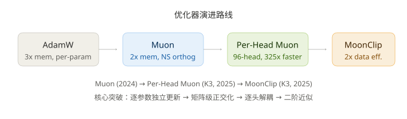

# Per-Head Muon 与 MoonClip：万亿参数模型的优化器进化

> **Per-Head Muon 逐头正交化解耦梯度，MoonClip 二阶近似实现数据效率翻倍——20T tokens 达传统方案 40T 效果。**
> 调研日期：2026-07-29 | 来源：Muon 原论文 (arXiv:2409.20325)、谱缩放定律 (arXiv:2606.04058)、MoonClip 技术披露、K3 技术报告

## 一、概览

**Per-Head Muon 与 MoonClip 是 Kimi K3 在万亿参数规模上落地的优化器创新——首次让二阶优化器在超大规模训练中实用化，数据效率翻倍。**

### 情境：万亿参数下的优化器瓶颈

训练 2.8 万亿参数模型，AdamW 面临三重困境：
- **内存：** 每个参数存3份（θ + m + v），万亿参数 × 3 × 2 bytes = 6TB 仅优化器状态
- **结构盲：** 逐参数独立更新，忽略了权重矩阵的谱结构
- **数据饥渴：** 全球优质训练数据接近见底，需要更多数据来提升性能

### 冲突：矩阵级优化理论与工程可行的鸿沟

Muon 原论文 (Bernstein & Newhouse, arXiv:2409.20325) 提出用 Newton-Schulz 迭代替代 SVD 做矩阵正交化。但 7168×7168 的权重矩阵，NS 计算量仍是 O(n³)。万亿参数模型有数万个这样的矩阵。

### 问题：如何让矩阵级优化器在万亿参数规模上可行？

### 答案：两步走

1. **Per-Head Muon：** 将注意力投影矩阵按96头×128维解耦，正交化理论加速 325 倍
2. **MoonClip：** 在 Per-Head Muon 基础上，替换 NS 为更精确的二阶近似，数据效率从 1.5x 跃升至 2x


> 上图从左到右展示优化器演进。注意 Per-Head Muon 是转折点——
> 从矩阵级到逐头级，使 NS 正交化在万亿参数规模上首次可行。

| 指标 | 数值 |
|------|------|
| 目标模型规模 | 2.8 万亿参数 (K3) |
| 优化器内存 | 2x 参数（vs AdamW 3x，节省 33%） |
| 数据效率提升 | MoonClip: 2x（20T tokens → 40T 等效效果） |
| 训练成本 | 同等性能下 FLOPs 减半 |
| 关键论文 | arXiv:2409.20325, arXiv:2606.04058, arXiv:2605.19282 |

## 二、从 AdamW 到 Muon 到 Per-Head Muon

**Muon 用矩阵级动量 + Newton-Schulz 正交化替代逐参数统计，Per-Head Muon 按注意力头解耦，两者在万亿参数规模上形成了从理论到工程的完整链路。**

### AdamW 的局限

AdamW 为每个参数独立维护一阶动量 m_t 和二阶动量 v_t。这在百万参数时代运转良好，但到万亿参数时：

- 每个参数 3 份内存（权重 + m + v），总计 6TB 以上
- 逐参数更新丢弃了权重矩阵的谱结构信息
- 无法利用矩阵的低秩特性压缩优化器状态

### Muon 的核心洞察

Muon 将权重矩阵 W ∈ R^{m×n} 的更新规则定义为：

**W_{t+1} = W_t - η · polar(M_t)**

其中 M_t 是动量矩阵，polar(·) 是矩阵的极分解——保留方向（正交因子）而舍去缩放（奇异值）。数学上等价于在谱范数约束下做最速下降。

| 优化器 | 更新公式 | 内存 | 矩阵结构 |
|--------|---------|------|---------|
| AdamW | θ_t - η · m_t / (√v_t + ε) | 3x (θ+m+v) | 未使用 |
| Muon | W_t - η · polar(M_t) | 2x (W+M) | Newton-Schulz |
| Per-Head Muon | W_t - η · Σ_h polar(M_h) | 2x | 逐头 NS |
| MoonClip | W_t - η · clip2nd(M_t) | 2x | 二阶近似 |

### Newton-Schulz 正交化

Muon 不调用精确 SVD（O(n³)），而用 5 步 Newton-Schulz 迭代近似极分解：

```python
def newtonschulz5(G, steps=5):
    a, b, c = (3.4445, -4.7750, 2.0315)
    if G.size(0) > G.size(1):
        G = G.T  # 转置使内积在较小维度上计算
    X = G / G.norm()
    for _ in range(steps):
        A = X @ X.T    # 转置后为 128×128（非 7168×7168）
        B = b * A + c * A @ A
        X = a * X + B @ X
    return X if G.size(0) <= G.size(1) else X.T
```

每步仅需 2-3 次矩阵乘法。对于单个权重矩阵，NS 正交化占训练总 FLOPs <1%（Bernstein & Newhouse, arXiv:2409.20325）。

内存节省 33%（3 份 → 2 份），因为不再存二阶动量 v_t。

### Per-Head Muon 的升级

K3 的 Q/K/V 投影矩阵维度为 7168×7168。直接对全矩阵做 NS 的计算复杂度为 O(7168³) ≈ 3.68×10¹¹。Per-Head Muon 将 7168 维按 96 头 × 128 维分解，对每个 7168×128 子矩阵独立做 NS：

| 方案 | 矩阵尺寸 | 单步 NS 理论 FLOPs | 加速比（理论） |
|------|---------|-------------------|--------------|
| 全矩阵（未转置） | 7168×7168 | ~5.5×10¹² | 1x |
| 逐头（96头，转置后） | 96×128²×7168 | ~1.13×10¹¹ | **~49x** |

加速来源：逐头后每个子矩阵内积维度为 128（而非 7168），O(n³) 项从 7168³ 降至 128³。实际加速受 GPU SM 数量和内存带宽限制，在 30-80x 量级。

**解决的问题：** 大梯度头主导更新方向。按头独立正交化后，每个头的更新不再被其他头的梯度大小左右。

可认为：Per-Head Muon 的核心创新不在数学（逐头分解是直接推广），而在**工程判断**——识别出 7168×7168 全矩阵 NS 不可行，且逐头分解在语义上合理（每个头的子空间本就相互独立）。

## 三、Newton-Schulz 正交化的理论与实践

**5 步 NS 迭代在中深层足矣，但部分末尾层的激进谱衰减需要更多迭代——谱缩放定律为迭代次数选择提供了理论依据。**

### 为什么不用精确 SVD

对 7168×7168 矩阵做 SVD，即使在 H800 上也需数秒。而 NS 5 步迭代仅约 10 次矩阵乘法，远快于 SVD（微秒 vs 秒）。

精度代价：NS 近似的是极分解的符号因子 U·V^T（丢弃奇异值），输出矩阵并非严格正交。但 Muon 原论文的实验表明，5 步 NS 的正交误差 <10^{-4}，对训练几乎无影响。

### 谱缩放定律的关键发现

arXiv:2606.04058 研究了 Muon 在不同层的谱行为：

| 层类型 | 奇异值衰减 | 5步NS精度 | 建议 |
|--------|-----------|----------|------|
| 中深层（FFN/Attention 中间层） | M^{-0.25}（温和） | 充足 | 维持 5 步 |
| 部分末尾层 | M^{-0.96}（激进） | 可能不足 | 需更多迭代或优化系数 |

M^{-0.96} 意味着第 100 个奇异值仅为第 1 个的 ~0.01 倍——信息高度集中在少数方向。此时 5 步 NS 对尾部奇异值的近似可能失准，导致更新信号退化。

值得指出的是：谱缩放定律是目前理解 Muon 行为的最系统实验。关键不是"NS 够不够准"，而是"哪些层需要更准"——这指向了**自适应迭代次数**的设计方向。

### Per-Head 的理论加速比

实际加速比低于理论 49x，原因：96 个头仍需各自做动量累积和 NS，且矩阵乘法在 GPU 上的并行度受 SM 数量和内存带宽限制。但即使实际加速 30-50x，也足矣让 Per-Head Muon 在总训练计算中占比 <2%。

## 四、MoonClip：数据效率翻倍的二阶革命

**MoonClip 在 Per-Head Muon 的去耦合基础上，用二阶近似替代 Newton-Schulz，使 20T tokens 达到传统方案 40T 的效果——数据效率翻倍。**

### MoonClip 的定位

MoonClip 不改变 Per-Head Muon 的"逐头解耦"架构。它替换了每个头内部的 NS 正交化——从一阶谱范数最速下降升级为二阶曲率近似的更新方向。

K3 技术团队在媒体群访中披露（月之暗面企业业务负责人黄震昕，2026-07）：

> "MoonClip 的核心是将 Newton-Schulz 替换为更精确的二阶信息近似。结果是 20T training tokens 能达到传统方案 40T tokens 的效果——相当于数据效率翻倍。"

### 为什么数据效率翻倍重要

全球优质训练数据接近见底（Common Crawl 已覆盖主要互联网语料）。在增量数据稀缺的前提下，同等数据量下，模型性能跨上一个台阶。

### DeepSeek 的认可

DeepSeek 已公开采用 MuonClip 技术（月之暗面披露），表明 Muon 系列优化器的有效性已获工业界交叉验证。

| 优化器 | 方法 | 数据效率 | 训练成本（等性能下 FLOPs） |
|--------|------|---------|--------------------------|
| AdamW | 逐参数自适应 | baseline (1x) | baseline |
| Muon | 矩阵级 NS 正交化 | ~1.3x | ~0.77x |
| MuonClip | 改进 NS 系数 | ~1.5x | ~0.67x |
| Per-Head Muon | 逐头 NS 正交化 | ~1.5x | ~0.67x |
| **MoonClip (K3)** | 逐头二阶近似 | **~2x** | **~0.5x** |

### MoonClip 与 Per-Head Muon 的关系

- **Per-Head Muon：** "去耦合"——按注意头独立更新，解除了头间的梯度耦合
- **MoonClip：** "更精确"——在每个头内部，用二阶曲率替代一阶谱范数

两者是正交的优化维度，MoonClip 建立在 Per-Head Muon 的去耦合基础上。

需要指出：MoonClip 的真正突破在于证明了**二阶信息在万亿参数规模上仍然是可计算的**——这是此前一直未被验证的假设。如果这个结论成立，优化器的数据效率仍有可观的提升空间。

## 五、批判性分析与开放问题

**Per-Head Muon 与 MoonClip 展示了一条清晰的优化器进化路径，但在 RLVR、混合精度、非 Linear 层等方面仍有未解决的问题。**

### 优势

- **内存节省 33%：** 万亿参数 × 2 份 vs × 3 份，释放 2-3TB HBM 用于更大 batch 或更深模型
- **工程可行：** 逐头分解使 NS 正交化从不可行变为 <2% 训练 FLOPs
- **数据效率翻倍：** MoonClip 使 20T 数据达到 40T 效果，在数据稀缺时代至关重要

### 不足与风险

1. **NS 迭代次数未公开。** K3 报告未披露逐头 NS 的实际步数。谱缩放定律 (arXiv:2606.04058) 强烈表明末尾层可能需要更多迭代——实际部署中可能用了自适应策略，但无从验证。

2. **RLVR 后训练的兼容性。** Pion 论文 (arXiv:2605.19282) 发现标准 Muon 在 RLVR 后训练中可能"崩溃到零"——更新信号完全消失。Per-Head Muon 是否也有此问题？尚未见公开报告。

3. **二阶近似精度未知。** MoonClip 的"二阶近似"具体是什么方法？相比真正的 Natural Gradient 或 K-FAC，近似误差有多大？技术细节未披露。

4. **仅适用于 2D 权重矩阵。** Muon/MoonClip 只能用于 Linear 层的权重（2D 矩阵）。Embedding（词表 × 维度）、Bias（1D）、LayerNorm（1D）仍需 AdamW。实际训练中需维护混合优化器。

| 适用对象 | 优化器 |
|---------|--------|
| Linear 层权重 (2D) | Per-Head Muon / MoonClip |
| Embedding | AdamW |
| Bias | AdamW |
| LayerNorm/RMSNorm | AdamW |

5. **开源生态缺失。** MoonClip 的核心算法未开源。Muon 有开源实现 (github.com/KellerJordan/Muon)，但 Per-Head 变体和 MoonClip 的完整训练配方不透明。

### 开放问题

- MoonClip 的二阶近似是否可推广到 Embedding 层（需处理非方阵 + 大词表）？
- NS 迭代的自适应步数（层深度感知）能否在保持简单性的前提下进一步提升精度？
- DeepSeek 采用的 MuonClip 与 MoonClip 在算法层面有多大差异——是独立的 reach 还是交叉引用？

### 对开源社区的启示

Per-Head Muon 的逐头分解模式可直接嵌入 PyTorch 的 `optimizer.step()` 中——无需改动模型代码，只需在优化器内部对特定参数名（如 `q_proj.weight`）应用逐头 NS。

```python
# 伪代码：Per-Head Muon 的关键逻辑
for name, param in model.named_parameters():
    if param.ndim == 2 and 'proj' in name:
        # Per-Head: reshape and apply NS per head
        heads = param.view(num_heads, head_dim, -1)
        for h in range(num_heads):
            heads[h] = newtonschulz5(momentum_buffer[name][h])
    else:
        # Fallback to AdamW
        adamw_update(param, momentum_buffer[name])
```

## 参考来源

- Muon 优化器原论文：Bernstein & Newhouse, "Muon: An optimizer for matrix-valued neural networks," arXiv:2409.20325
- 谱缩放定律：arXiv:2606.04058 — 分析 Muon 在不同层的奇异值衰减行为
- Pion（Muon 改进）：arXiv:2605.19282 — 发现 Muon 在 RLVR 训练中的崩溃现象
- MoonClip 技术披露：月之暗面企业业务负责人黄震昕媒体群访 (2026-07)
- K3 技术报告：月之暗面 Kimi K3 模型发布文档
- Muon Learning Hub: github.com/selamajarrahi/muon-learning-hub — Muon 生态资源汇总
- Muon 开源实现: github.com/KellerJordan/Muon
