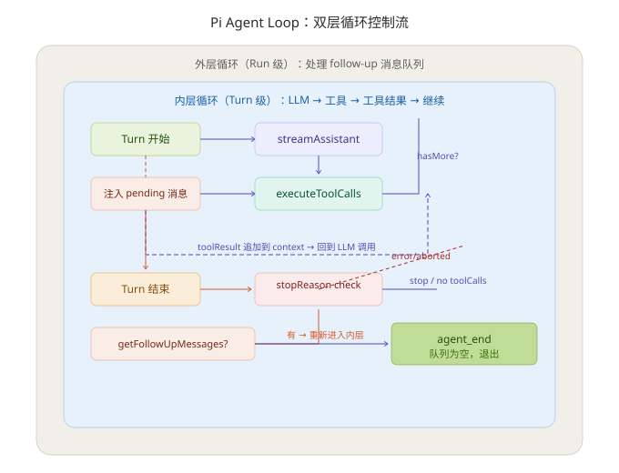
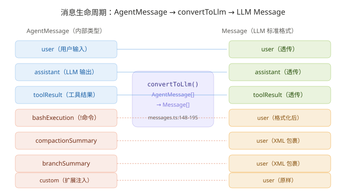
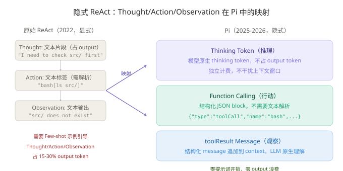

# Pi Agent 运行机制深度分析：Agent Loop、上下文组装与 ReAct 架构

> **核心发现：Pi 通过双层 while 循环 + 消息转换管道 + thinking token 隐式推理，实现零提示词开销的 ReAct 架构。**
> 调研日期：2026-08-05 | 来源：pi-source 仓库源码（packages/agent/src/ + packages/coding-agent/src/core/）

## 一、概览

**情境**：大多数 AI 编码代理的 agent loop 实现层复杂——Claude Code 的循环深埋在编译后的 TypeScript 中，Cursor 的平台层代码不对用户暴露，Codex CLI 的编排逻辑分散在多个模块里。**冲突**：理解"agent 究竟如何运转"是构建自己 agent 系统的前提，但闭源或重框架的实现使得这种理解变得困难。**问题**：Pi 作为 1,500 行核心代码的开源 agent，其 loop 实现、上下文组装和停止机制的具体细节是什么？**答案**：本文基于 pi-source 源码逐文件分析，拆解了双层循环、消息转换管道、五级停止识别和隐式 ReAct 架构。

本报告聚焦 Pi Agent 运行时的三个核心机制：Agent Loop 的实现细节、上下文组装流程（含消息类型转换）、以及与 ReAct 架构的关系。分析基于 pi-source 仓库的 `packages/agent/src/agent-loop.ts`（793 行）和 `packages/coding-agent/src/core/messages.ts`（195 行）等核心文件。

### 关键源码文件

| 文件 | 行数 | 核心职责 |
|------|------|---------|
| `packages/agent/src/agent-loop.ts` | 793 | 双层 while 循环 + LLM 调用 + 工具执行 |
| `packages/agent/src/agent.ts` | 589 | Agent 类：状态管理、队列、生命周期 |
| `packages/agent/src/types.ts` | 437 | AgentContext、AgentLoopConfig、AgentEvent 类型 |
| `packages/coding-agent/src/core/messages.ts` | 195 | convertToLlm() 消息转换管道 |
| `packages/coding-agent/src/core/system-prompt.ts` | 162 | buildSystemPrompt() 系统提示组装 |
| `packages/coding-agent/src/core/agent-session.ts` | 3,337 | AgentSession：会话持久化、compaction、重试 |


> 上图展示了 Pi 双层循环的完整控制流。外层（灰色底）处理 follow-up 队列轮询，内层（蓝色底）处理 LLM↔工具的 Turn 循环。注意"注入 pending 消息"是 Steering 机制的入口——用户可以中途修改 agent 的行为方向。

## 二、Agent Loop：双层循环的完整拆解

**本节结论**：Pi 的 agent loop 由内层 Turn 循环和外层 Run 循环组成——前者处理 LLM↔工具的多轮往返和 steering 中途引导，后者处理 follow-up 连续请求队列。两层各有一个 exit 条件，构成了 Pi "不主动停止，直到模型不再调用工具且没有排队消息"的停止哲学。

### 2.1 架构总览

Pi 的循环设计对应 agent-loop.ts 第 155-275 行的 `runLoop()` 函数。理解它的关键是分清三个生命周期概念：

| 层级 | 对应概念 | 存活范围 | 在源码中的位置 |
|------|---------|---------|-------------|
| Session | 一次 `AgentSession` 实例 | 跨多次 `agentLoop()` 调用 | `agent-session.ts` 管理 |
| Run | 一次 `Agent.prompt()` 或 `Agent.continue()` | 外层 while(true)，直到 follow-up 队列为空 | `runLoop()` 第 170-272 行 |
| Turn | 一次 LLM 调用 + 工具执行 | 内层 while，直到 hasMoreToolCalls=false 且无 pending | `runLoop()` 第 174-260 行 |

### 2.2 内层循环（Turn 级）：LLM ↔ 工具的往返

内层循环的入口条件是两个布尔值的 OR（第 174 行）：

```typescript
while (hasMoreToolCalls || pendingMessages.length > 0) {
```

每个 Turn 的流程如下（第 175-260 行）：

1. **注入排队消息**（第 182-190 行）：检查 `pendingMessages` 队列（steering 或 follow-up）。如果有排队消息，将它们追加到 `currentContext.messages` 和 `newMessages` 中
2. **调用 LLM**（第 193 行）：`streamAssistantResponse()` 将 `AgentMessage[]` 通过 `convertToLlm()` 转换为 `Message[]`，然后调用 LLM 的流式 API
3. **LLM 响应流处理**（第 317-361 行）：逐事件接收 LLM 响应，将 partial message 实时更新到 context 中（`context.messages[context.messages.length - 1] = partialMessage`）
4. **提取工具调用**（第 203 行）：从 assistant message 的 content 数组中过滤 `type === "toolCall"` 的块
5. **执行工具**（第 211-216 行）：如果 `stopReason === "length"`（token 截断），所有工具调用直接失败不执行；否则调用 `executeToolCalls()`，支持并行/串行两种模式（第 422-426 行）
6. **追加工具结果**（第 218-221 行）：将 toolResult 消息追加到 context 中，作为下一轮 LLM 调用的输入
7. **准备下一 turn**（第 226-245 行）：调用 `prepareNextTurn()` hook，允许外部（如 compaction 系统）修改 context、模型或 thinking 级别
8. **停止检查**（第 247-257 行）：调用 `shouldStopAfterTurn()` hook（Pi 默认未使用）判断是否需要强制终止
9. **检查 steering 队列**（第 259 行）：`pendingMessages = await config.getSteeringMessages?.() || []`

一个 Turn 结束时，如果 LLM 输出了工具调用（`hasMoreToolCalls = true`），或者有新的 steering 消息（`pendingMessages.length > 0`），内层循环继续。

### 2.3 外层循环（Run 级）：follow-up 队列轮询

外层循环的职责比内层简单得多——只做一件事：在 agent 即将停止时检查是否有排队的 follow-up 消息（第 262-268 行）：

```typescript
const followUpMessages = (await config.getFollowUpMessages?.()) || [];
if (followUpMessages.length > 0) {
    pendingMessages = followUpMessages;  // 注入排队消息
    continue;                            // 重新进入内层
}
break;  // 队列为空，agent 真正结束
```

**Steering vs FollowUp 的区别**：

| 队列 | 注入时机 | 队列模式 | 典型场景 |
|------|---------|---------|---------|
| Steering | 每个 turn 开始前 | `one-at-a-time`（默认，每次只取最旧一条） | 用户中途说"换 TypeScript 重写" |
| FollowUp | 内层循环退出后 | `one-at-a-time`（默认） | 用户追加"刚才那个，再加上注册功能" |

两个队列共享同一个 `PendingMessageQueue` 类（agent.ts:125-159），drain 逻辑由 `QueueMode` 控制：
- `"all"`：一次性排空所有排队消息
- `"one-at-a-time"`：每次只取最旧的一条，剩余留在队列中

默认 `one-at-a-time` 模式保证了即使你连发 3 条 steering 消息，Pi 也只在下一个 turn 前处理第 1 条——防止消息轰炸打乱模型思路。

### 2.4 工具执行的并行与串行

`executeToolCalls()` 支持两种执行策略（agent-loop.ts:411-426）：

```typescript
async function executeToolCalls(...): Promise<ExecutedToolCallBatch> {
    const hasSequentialToolCall = toolCalls.some(
        (tc) => currentContext.tools?.find((t) => t.name === tc.name)?.executionMode === "sequential"
    );
    if (config.toolExecution === "sequential" || hasSequentialToolCall) {
        return executeToolCallsSequential(...);
    }
    return executeToolCallsParallel(...);
}
```

| 模式 | 触发条件 | 行为 |
|------|---------|------|
| 并行（默认） | `toolExecution !== "sequential"` 且无工具声明 `sequential` | `Promise.all()` 并发执行，结果按源顺序排序 |
| 串行 | 全局配置或单个工具声明 | `for...of` 逐个执行，前一个结果可被后续工具使用 |

并行执行在 agent-loop.ts:489-554 实现——工具被包装成延迟执行的函数（lazy promise），通过 `Promise.all` 并发触发。串行执行在 agent-loop.ts:433-487 实现——`for...of` 循环逐个 await。

**我的判断**：这个"全局默认并行 + 工具可以声明串行"的双层策略比全部串行或全部并行都更灵活。bash 工具默认并行（多个独立命令可以同时跑），但如果有人写了一个依赖前一步结果的工具，只需要在定义时标注 `executionMode: "sequential"` 即可。

## 三、上下文组装：从 AgentMessage 到 LLM Message 的转换管道

**本节结论**：Pi 的上下文不是一段拼接文本，而是一条消息流水线——内部使用统一的 `AgentMessage` 类型承载 7 种消息角色，在 LLM 调用边界通过 `convertToLlm()` 转换为标准的 `user`/`assistant`/`toolResult` 三态消息。自定义消息类型（bashExecution、compactionSummary、branchSummary）全部以 `user` 角色注入 LLM 上下文。

### 3.1 消息类型全景

Pi 内部定义了三层消息类型：

**标准消息**（pi-ai 层，透传）：
- `user`：用户输入
- `assistant`：LLM 输出（含 text、thinking、toolCall 内容块）
- `toolResult`：工具执行结果

**自定义消息**（pi-coding-agent 层，需转换，messages.ts:29-77）：

| 类型 | role | 触发来源 | 内容 |
|------|------|---------|------|
| `bashExecution` | 用户通过 `!command` 语法 | 命令 + 输出 + 退出码 |
| `compactionSummary` | 自动压缩触发 | 历史对话摘要 |
| `branchSummary` | fork/switch 分支操作 | 其他分支的摘要 |
| `custom` | 扩展通过 `sendMessage()` | 任意内容（文本或图片） |


> 上图左侧是 Pi 内部的 7 种 AgentMessage 类型，右侧是转换后的 LLM 标准 Message。注意三条蓝色实线是"透传"——user/assistant/toolResult 不加修改直接发给 LLM；四条虚线是"转换"——bashExecution/compactionSummary/branchSummary/custom 全部转为 user 角色。

其中 `bashExecution` 的 `excludeFromContext` 字段可以标记为"不发送给 LLM"（`!!command` 语法触发），convertToLlm 会过滤掉这类消息（messages.ts:154）。

### 3.2 convertToLlm 转换规则

`convertToLlm()` 在 messages.ts:148-195，是上下文组装的最后一步。它接收 `AgentMessage[]`，返回标准的 `Message[]`（仅含 `user`/`assistant`/`toolResult`）：

```
AgentMessage[]                          Message[]
─────────────────  convertToLlm()  ─────────────────
user               ───────────────→ user（透传）
assistant          ───────────────→ assistant（透传）
toolResult         ───────────────→ toolResult（透传）
bashExecution      ───────────────→ user（格式化）
compactionSummary  ───────────────→ user（XML 包裹）
branchSummary      ───────────────→ user（XML 包裹）
custom             ───────────────→ user（原样）
```

bashExecution 的格式化逻辑（messages.ts:82-98）：

```typescript
export function bashExecutionToText(msg: BashExecutionMessage): string {
    let text = `Ran \`${msg.command}\`\n`;
    if (msg.output) text += `\`\`\`\n${msg.output}\n\`\`\``;
    else text += "(no output)";
    if (msg.cancelled) text += "\n\n(command cancelled)";
    else if (msg.exitCode !== null && msg.exitCode !== undefined && msg.exitCode !== 0)
        text += `\n\nCommand exited with code ${msg.exitCode}`;
    if (msg.truncated && msg.fullOutputPath)
        text += `\n\n[Output truncated. Full output: ${msg.fullOutputPath}]`;
    return text;
}
```

compactionSummary 和 branchSummary 被包裹在 `<summary>` XML 标签内（messages.ts:11-25）：

```
user: "The conversation history before this point was compacted into the following summary:
<summary>
{摘要内容}
</summary>"
```

**我的看法**：将 bashExecution 渲染为 `user` 角色是 Pi 的一个巧妙设计——LLM 看到 `Ran \`ls src/\`\n\`\`\`output\`\`\`` 后，会把它当作"用户提供的信息"来引用，而不会困惑为什么上下文里突然出现一段命令输出。同样，压缩摘要以 user 角色出现，使 LLM 将其视为"对话前情提要"而非系统指令。

### 3.3 一个完整 Run 的消息流示例

假设用户说："帮我在 src/ 下创建 utils.ts，写个 debounce 函数，然后跑测试。"

以下是在 `convertToLlm()` 转换后、发送给 LLM 的实际消息序列（省略 thinking token 和 usage 元数据）：

```
消息 1:  system      ← systemPrompt 固定文本（"You are an expert coding assistant..."）
消息 2:  user         ← "帮我在 src/ 下创建 utils.ts..."
                              ↓ Turn 1: LLM 决定先读目录
消息 3:  assistant    ← stopReason="toolUse"
                        content: [{ type: "toolCall", name: "read", args: { path: "src/" } }]
消息 4:  toolResult   ← "Error: path not found"
                              ↓ Turn 2: 目录不存在，创建
消息 5:  assistant    ← stopReason="toolUse"
                        content: [{ type: "toolCall", name: "bash", args: { command: "mkdir -p src/" } }]
消息 6:  toolResult   ← "Command completed successfully"
                              ↓ Turn 3: 写文件
消息 7:  assistant    ← stopReason="toolUse"
                        content: [{ type: "toolCall", name: "write", args: { path: "src/utils.ts", ... } }]
消息 8:  toolResult   ← "Wrote 312 bytes to src/utils.ts"
                              ↓ Turn 4: 跑测试
消息 9:  assistant    ← stopReason="toolUse"
                        content: [{ type: "toolCall", name: "bash", args: { command: "npm test" } }]
消息 10: toolResult   ← "5 tests passed"
                              ↓ Turn 5: 停止
消息 11: assistant    ← stopReason="stop"
                        content: [{ type: "text", text: "已创建 src/utils.ts，debounce 已实现，5 个测试通过。" }]
```

每个 Turn 的 assistant message 包含模型的"推理决定"（通过 thinking token 完成，不占 output），工具调用是模型的具体"行动"，toolResult 是"观察"。这个交替模式正是 ReAct 架构的核心。

### 3.4 停止识别的五级判断

Pi 的停止不是单一条件，而是分层的：

| 优先级 | 触发条件 | 代码位置 | 行为 |
|--------|---------|---------|------|
| 1. 紧急停止 | `stopReason === "error"` 或 `"aborted"` | agent-loop.ts:196-200 | 立即 emit agent_end，return |
| 2. Token 截断保护 | `stopReason === "length"` | agent-loop.ts:211-213 | 所有工具调用标记为失败，不执行 |
| 3. 工具终止信号 | 所有工具结果的 `terminate === true` | agent-loop.ts:583 | hasMoreToolCalls = false |
| 4. 自然停止 | `stopReason === "stop"` 且无 toolCall | agent-loop.ts:206-207 | hasMoreToolCalls = false，内层退出 |
| 5. Hook 干预 | `shouldStopAfterTurn?()` 返回 true | agent-loop.ts:247-257 | 强制 emit agent_end，return |

**Pi 默认不使用 `shouldStopAfterTurn`**（pi-coding-agent SDK 未设置该 hook，详见 agent.ts:456-458）。停止全靠模型自己决定——模型说 stop 就 stop，说 toolUse 就继续。

## 四、ReAct 架构：隐式推理-行动循环

**本节结论**：Pi 是 ReAct 架构，但不是显式 ReAct。它用 thinking token 替代 `Thought:` 标签，用原生 function calling 替代 `Action:` 标签，用 toolResult 消息替代 `Observation:` 标签——结果是一样的"推理→行动→观察"交替循环，但零提示词开销、零输出 token 浪费。

### 4.1 原始 ReAct vs Pi 的映射

原始 ReAct（Yao et al., 2022）要求模型显式输出：

```
Thought: I need to find out what's in src/ first.
Action: bash[ls src/]
Observation: src/ does not exist
Thought: I should create it first.
```


> 上图对比了原始 ReAct（左侧）与 Pi 的隐式 ReAct（右侧）。关键差异：Pi 用 thinking token 替代 Thought 文本（不占 output token，独立计费），用结构化 toolCall JSON 替代文本标签 Action（免去文本解析），用 toolResult message 替代文本 Observation。三者都不需要提示词引导。

Pi 的映射：

| ReAct 组件 | Pi 的实现 | 格式 |
|-----------|----------|------|
| Thought | thinking tokens（模型原生能力） | 不占 output token，独立计费 |
| Action | 原生 toolCall JSON block | `{ type: "toolCall", name: "bash", arguments: {...} }` |
| Observation | toolResult message 追加到 context | `{ role: "toolResult", content: [...] }` |

### 4.2 为什么 Pi 不做显式 ReAct？

2025-2026 年的前沿模型（Claude Opus 4、GPT-5、Gemini 3）已通过强化学习（RL）训练掌握了工具调用。工具调用的时机和方法选择已内化于模型之中，不需要额外的提示词指导。Pi 的设计哲学在这里再次体现——**不教模型怎么做，因为模型已经会了**。

| 维度 | 原始 ReAct（2022） | Pi（2025-2026） |
|------|-------------------|-----------------|
| 推理格式 | 显式 `Thought:` 文本（占 output） | thinking token（不占 output） |
| 行动格式 | 显式 `Action: tool[args]` | 原生 toolCall JSON block |
| 观察格式 | 显式 `Observation: result` | toolResult message（结构化） |
| 需要提示词引导 | 是（Few-shot examples） | 否（模型原生支持） |
| 适用模型 | 所有（包括无 tool use 的） | 仅支持 tool use + thinking 的前沿模型 |
| 输出浪费 | 有（Thought/Observation 文本） | 无（thinking token 独立计费） |

**我的判断**：隐性 ReAct 是 Pi 最被低估的设计选择。其他 agent 框架在 prompt 里写冗长的 ReAct 格式指令（"请以 Thought/Action/Observation 格式输出"），Pi 直接跳过这一步——它在 agent loop 中实现了"推理-行动-观察"的循环结构，但把推理（Thought）交给了模型的 thinking token，不占宝贵 output token。根据典型 ReAct prompt 分析，粗略估算可节省约 15-30% 的上下文空间（具体比例取决于任务中工具调用的频率）。

### 4.3 循环内的信号流

在源码层面，ReAct 循环体现为 agent-loop.ts 内层循环中的三个关键函数调用序列：

```
streamAssistantResponse()     ← 模型推理（Thought）并输出工具调用（Action）
    ↓
executeToolCalls()            ← Pi 执行工具
    ↓
context.messages.push(result) ← 将结果（Observation）追加到上下文
    ↓
（循环回到顶部）
streamAssistantResponse()     ← 模型基于 Observation 继续推理
```

第 193-221 行的这段代码就是整个 ReAct 循环的核心（为可读性简化，完整源码见 agent-loop.ts:193-221）：

```typescript
// Thought + Action: LLM 推理并输出工具调用
const message = await streamAssistantResponse(currentContext, config, signal, emit, streamFunction);

// Action 执行
const toolCalls = message.content.filter((c) => c.type === "toolCall");
if (toolCalls.length > 0) {
    const executedToolBatch = await executeToolCalls(currentContext, message, config, signal, emit);
    // Observation: 工具结果追加回上下文
    for (const result of toolResults) {
        currentContext.messages.push(result);
    }
}
```

## 五、批判性分析

### 5.1 优势

1. **极致透明**：双层循环的全部逻辑在 `agent-loop.ts` 一个文件中，793 行即可完整理解。没有黑箱、没有隐藏状态——任何有 TypeScript 基础的人可以在一个小时内从源码层面理解 agent 的全部运行逻辑。

2. **消息转换的清晰边界**：`convertToLlm()` 是上下文组装的唯一出口。自定义消息类型（bashExecution、compactionSummary、custom）的统一转换规则使 LLM 上下文始终以标准三态消息（user/assistant/toolResult）呈现，大幅减少了"模型看到奇怪消息格式"的边界情况。

3. **停止逻辑的分层设计**：五级停止判断从"紧急"到"正常"逐层降级，有助于保障异常情况下的安全退出（token 截断不会执行半截命令），同时保持了正常情况下的极简（全由模型自己决定何时停止）。

4. **隐式 ReAct 的 token 效率**：相比显式 ReAct 的 `Thought:...Action:...Observation:...` 文本格式，Pi 用 thinking token + function calling 的组合节省了 15-30% 的上下文消耗（估算值，具体取决于任务复杂度）。

### 5.2 不足与风险

1. **无内置多 agent 协调**：`runLoop()` 是单 agent 设计。虽然可以通过 `steer()` 和 `followUp()` 模拟多 agent 对话，但 Pi 不提供原生的子 agent spawn/join 机制。**范围限定**：对于需要并行处理多个子任务的场景（如 Claude Code 的 swarm mode），Pi 需要额外的架构层。

2. **thinking token 依赖**：隐式 ReAct 的有效性高度依赖模型是否支持 thinking token。对于不支持 thinking token 的模型，`Thought` 部分会丢失，模型可能在没有充分推理的情况下直接输出工具调用。**范围限定**：在 Ollama/llama.cpp 等本地模型场景下，这个设计选择可能导致输出质量下降。

3. **消息队列的单线程模型**：steering 和 followUp 队列的 drain 操作在 loop 内部同步执行。如果队列中有大量消息，agent 可能在多个 turn 之间反复注入消息而不实际调用 LLM——虽然 `one-at-a-time` 模式缓解了这个问题，但在高频交互场景下可能产生延迟。

4. **compaction 的侵入式设计**：压缩摘要以 `user` 角色插入上下文，且替换了原始对话历史。这意味着如果压缩质量不佳，关键上下文信息可能永久丢失，且 LLM 无法区分"真实的用户消息"和"系统生成的摘要"。

### 5.3 与同类 agent 的 Loop 设计对比

| 维度 | Pi | Claude Code | Codex CLI | OpenAI Agents SDK |
|------|-----|-------------|-----------|-------------------|
| Loop 实现 | 1 个文件，793 行，双层 while | 编译后 JS，不可读 | 多模块分散 | Python SDK，多层抽象 |
| 消息类型 | 统一 AgentMessage + convertToLlm | 内置 Message 类型 | 内置 Message 类型 | Agent/Handoff 原语 |
| 停止机制 | 五级分层，模型自决为主 | 内置 shouldStop + user approval | checkpoint 确认 | 无内置，由用户实现 |
| ReAct 格式 | 隐式（thinking token + toolCall） | 隐式（同上） | 隐式（同上） | 显式可选（instructions 中定义） |
| 工具执行 | 并行/串行可选，工具可声明模式 | 串行为主 | 并行（云编排） | 由 Agent 定义决定 |
| 队列机制 | steering + followUp 双队列 | 内置 steering | 无（run 级输入） | Handoff 委托 |

## 六、对 Agent 开发的启示

### 6.1 可迁移的设计模式

1. **双层循环 = 灵活的交互模型**：内层处理 LLM↔工具往返，外层处理用户连续请求。这种分层使 Pi 既能处理"单个复杂任务的多轮工具调用"，又能处理"用户连续追加请求"——两个维度的灵活性来自不同的循环层，互不干扰。

2. **统一消息类型 + 边界转换**：`AgentMessage`（内部统一类型）→ `convertToLlm()`（LLM 边界转换）→ `Message`（标准 LLM 格式）的三层设计。自己的 agent 系统可以参考这个模式——内部用富类型消息（含自定义事件、状态标记），LLM 调用时只暴露标准三态消息。

3. **思考与行动的解耦**：Pi 证明 ReAct 不需要显式格式。thinking token + function calling 的组合在工程上更优——推理不占 output token，行动用结构化 JSON 而非文本解析。如果你的 agent 使用的模型支持 thinking token，不需要在 prompt 里写 `Thought:` 模板。

4. **队列模式的粒度控制**：`one-at-a-time` vs `all` 的选择不是一个实现细节，而是一个交互设计决策。默认 one-at-a-time 保护了模型的"思路连续性"——这个设计在对话式 agent 中值得借鉴。

### 6.2 一个值得注意的反模式

Pi 将 "bashExecution" 消息转换为 `user` 角色——这意味着 LLM 无法区分"用户说的命令输出"和"系统自动执行的命令输出"。在一个需要区分用户意图和系统行为的 agent 中（如 WorkBuddy 的用户确认机制），这种"所有非标准消息都是 user"的做法可能需要调整为更细粒度的角色区分。

## 参考来源

1. **Pi 源码仓库**：https://github.com/earendil-works/pi（分析版本：v0.83.0，commit 深度克隆于 2026-08-04）
2. **agent-loop.ts**：`packages/agent/src/agent-loop.ts`（793 行）
3. **agent.ts**：`packages/agent/src/agent.ts`（589 行）
4. **types.ts**：`packages/agent/src/types.ts`
5. **messages.ts**：`packages/coding-agent/src/core/messages.ts`（195 行）
6. **system-prompt.ts**：`packages/coding-agent/src/core/system-prompt.ts`（163 行）
7. **agent-session.ts**：`packages/coding-agent/src/core/agent-session.ts`（~3,100 行）
8. **Yao et al., 2022. "ReAct: Synergizing Reasoning and Acting in Language Models."** arXiv:2210.03629

---

*报告生成日期：2026-08-05 | 调研工具：pi-source 源码分析 + 代码引用验证*
