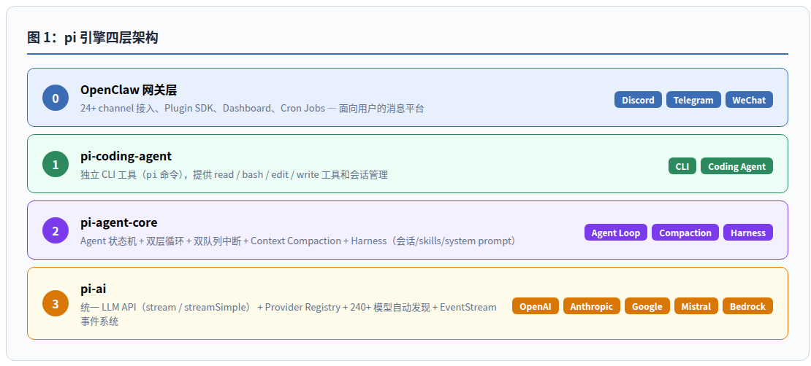
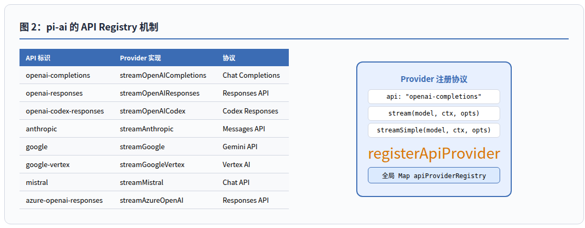
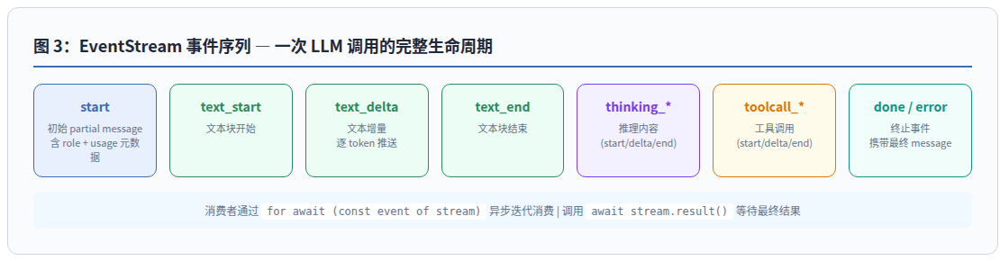
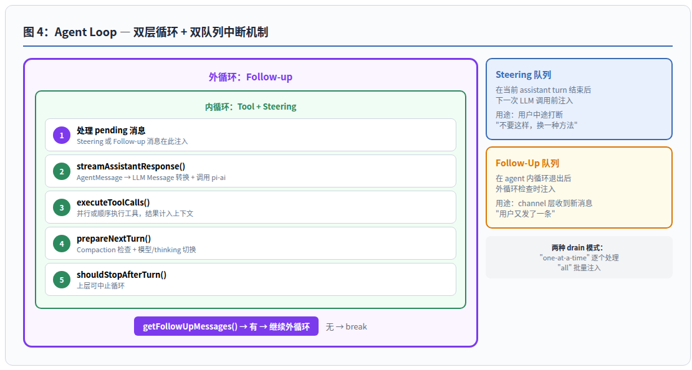
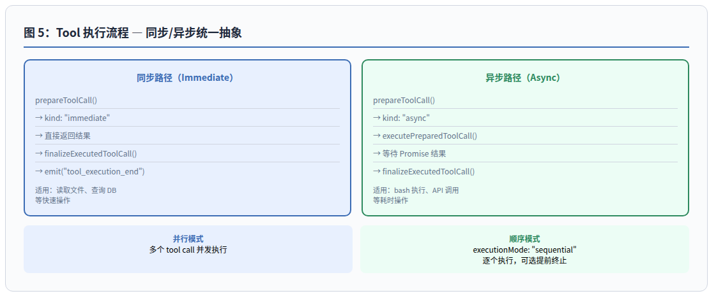
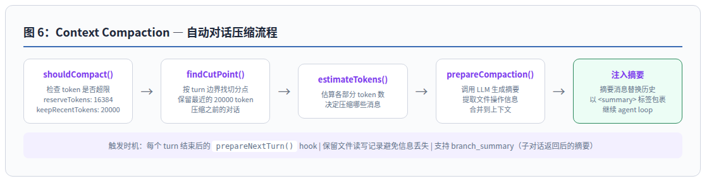

# pi 引擎深度分析：OpenClaw 的 AI Agent 运行时

> pi 引擎是一个 provider-agnostic 的 LLM 调用层 + 双层循环 agent 运行时 + 双队列中断机制 + 自动 context compaction——全部暴露为可扩展 hook 体系。

---

## 目录

1. [概述](#1-概述)
2. [架构总览](#2-架构总览)
3. [pi-ai：统一 LLM API 层](#3-pi-ai统一-llm-api-层)
4. [Agent Loop 实现](#4-agent-loop-实现)
5. [Context Compaction](#5-context-compaction)
6. [批判性分析](#6-批判性分析)
7. [总结](#7-总结)

---

## 1. 概述

pi 引擎是 OpenClaw（375k+ ⭐ 多 channel AI 网关）的核心发动机——由 `@earendil-works/pi-*` 四个 npm 包组成的一套通用 AI Agent 运行时。源码托管于 [`earendil-works/pi-mono`](https://github.com/earendil-works/pi-mono)，作者 Mario Zechner，MIT 协议，当前版本 v0.75.5。

pi 引擎解决的核心问题是：**如何在不需要为每个 LLM provider 写适配代码的前提下，构建一个可中断、可压缩、可扩展的 agent 运行时**。它的答案是一个全局 API Registry + 双层循环 + 双队列架构。

### 关键数据

| 指标 | 数值 |
|------|------|
| 运行时依赖数 | 50 个 production deps |
| 内置 provider 数 | 24 个（Anthropic / OpenAI / Google / DeepSeek / Mistral / …） |
| 内置模型数 | 240+ |
| Agent Loop 层数 | 双层（内：tool + steering，外：follow-up） |
| 消息队列数 | 2 个（steeringQueue + followUpQueue） |
| Thinking 级别 | 7 级（off / minimal / low / medium / high / xhigh / max） |

---

## 2. 架构总览

### 分层说明

| 层 | 名称 | 核心职责 |
|----|------|----------|
| 0 | OpenClaw 网关 | 24+ channel 接入、Plugin SDK、Dashboard、Cron |
| 1 | pi-coding-agent | 独立 CLI `pi`，提供 read/bash/edit/write 工具 |
| 2 | pi-agent-core | Agent 状态机、双层循环、compaction、harness |
| 3 | pi-ai | 统一 LLM API、provider registry、240+ 模型目录、EventStream |

### 核心设计洞察

pi 引擎采用**严格分层**：pi-ai 只关心"如何调用任何 LLM"，pi-agent-core 只关心"如何运行 agent loop"，两者通过 `stream(model, context, options)` 一个函数接口解耦。上层 OpenClaw 通过 `convertToLlm`、`transformContext`、`getSteeringMessages` 等一系列 hook 函数注入 channel 逻辑，而完全不感知底层的 provider 实现。

这种"依赖倒置"设计让 OpenClaw 可以同时接入 Discord、Telegram、WeChat 等 24+ 个 channel，而每个 channel 的实现只需要提供一组 hook 回调——不需要理解 LLM 调用细节。

---

## 3. pi-ai：统一 LLM API 层

### API Registry：一个全局 Map，八种协议

pi-ai 的核心是一个**全局 provider 注册表**：

- 每个 provider 声明自己的 `api` 标识（如 `"openai-completions"`）和两个函数 `stream(model, ctx, opts)` / `streamSimple(model, ctx, opts)`
- 调用者只需传 `model` 对象（其中包含 `model.api` 字段），运行时自动路由到正确 provider
- 已注册 8 种 API 协议：OpenAI Completions、OpenAI Responses、Codex Responses、Anthropic Messages、Google Gemini、Vertex AI、Mistral Chat、Azure OpenAI

**新增一个 provider 只需实现两个函数并注册，上层代码零改动。**

### EventStream：异步迭代器模式

LLM 响应的流式数据通过 `EventStream<T>` 传递——一个基于 **async iterator** 的 push/pull 队列：

- Provider 通过 `push(event)` 推入事件（文本增量、thinking、tool call 等）
- 消费者通过 `for await (const event of stream)` 拉取
- 背压友好——消费者慢时事件自动缓冲在队列中

事件序列贯穿 `start → text_delta → thinking_delta → toolcall_delta → done` 的完整生命周期（见下图）。

### 模型自动发现

`models.generated.js` 在构建时通过脚本 `scripts/generate-models.ts` 自动生成，包含 240+ 模型的元数据——ID、API 类型、context window、cost per token、reasoning 支持、thinking 级别映射等。开发者无需手动维护模型列表。

---

## 4. Agent Loop 实现

### 双层循环

Agent loop 的核心是 `runLoop()` 函数中的**双层循环**结构：

| 循环 | 退出条件 | 职责 |
|------|----------|------|
| **内循环** | `!hasMoreToolCalls` 且 `pendingMessages` 为空 | 处理 LLM 响应 → 执行 tool → 继续或停止 |
| **外循环** | `getFollowUpMessages()` 返回空 | agent 本应结束后检查是否有新消息注入 |

每轮内循环经过 5 个阶段：
1. **注入 pending 消息** —— steeringQueue 或 followUpQueue 中的消息在此进入上下文
2. **streamAssistantResponse()** —— `AgentMessage[]` → LLM `Message[]` 转换（唯一转换点），然后调用 `pi-ai` 的 `streamSimple()`
3. **executeToolCalls()** —— 并行或顺序执行工具，结果计入 `currentContext.messages[]`
4. **prepareNextTurn()** —— compaction 检查触发点、模型/thinking 级别切换
5. **shouldStopAfterTurn()** —— 上层 hook 可手动中止循环

### 双队列中断机制

Agent 类维护两个独立的消息队列，实现灵活的打断/继续语义：

| 队列 | 注入时机 | 典型场景 |
|------|----------|----------|
| `steeringQueue` | 当前 assistant turn 结束后 | 用户中途输入"不要这样，换种方法" |
| `followUpQueue` | 内循环退出后 | channel 层收到新消息"用户又发了一条" |

两者都支持 `"one-at-a-time"`（逐条处理）和 `"all"`（批量注入）两种 drain 模式。这构成了**真正的多轮对话中断语义**——不是简单的 abort/re-run，而是当前 turn 结束后无缝插入新指令，保留已有上下文。

### Agent 状态机

`Agent` 类是循环的无状态函数上的有状态包装。关键设计：

- `MutableAgentState` 使用 getter/setter 模式，`set` 时自动 copy 数组（防止意外共享引用）
- `runWithLifecycle()` 为每次 run 创建独立的 `AbortController`，确保 `abort()` 只影响当前 run
- `subscribe(listener)` 支持外部订阅全部生命周期事件（`turn_start`、`message_update`、`tool_execution_*` 等）
- `waitForIdle()` 返回 Promise，在所有 event listener 回调完成后 resolve

---

## 5. Context Compaction

pi-agent-core 的 compaction 系统是**一等公民**——不是事后补救，而是深度集成到 agent loop 的 `prepareNextTurn()` hook 中。

### 默认策略

| 参数 | 值 | 含义 |
|------|-----|------|
| `reserveTokens` | 16384 | 为 LLM 响应保留的 token |
| `keepRecentTokens` | 20000 | 保留最近对话的 token |
| `enabled` | true | 默认开启 |

### 压缩流程

1. **shouldCompact()** —— 检查 token 是否超限（默认：使用量 + reserveTokens > contextWindow）
2. **findCutPoint()** —— 按 turn 边界找切分点，保留最近 20000 token
3. **estimateTokens()** —— 估算各部分 token 数
4. **prepareCompaction()** —— 调用 LLM 生成摘要消息，同时保留文件操作信息（读写文件列表不丢失）
5. **注入摘要** —— 以 `
` 标签包裹，替换被压缩的历史消息

这套设计的关键创新在于**不丢失文件上下文**：压缩历史对话时，compaction 模块会扫描所有消息中的 `readFiles` / `modifiedFiles` 信息，将其保留在摘要中，确保 agent 在压缩后仍记得"我们改过哪些文件"。

---

## 6. 批判性分析

### 6.1 设计上的亮点

**API Registry 的解耦效果确实出色。** 与 Hermes 的 provider 实现（每种 provider 需要在多个地方修改代码）相比，pi 的"注册两个函数"模式极其简洁。新增 provider 不需要改动 agent loop、channel 层或 compaction 模块。这是教科书级的依赖倒置。

**双层循环 + 双队列解决了"真正的多轮中断"。** 传统 agent（包括 Claude Code 的 /stop）是粗暴的 abort——丢掉当前上下文、从头开始。pi 的 steering queue 让中断变成"当前 turn 结束后插入新指令"，这是一个语义上更优雅、实际体验更好的设计。

**Compaction 的文件上下文保留是一个被低估的设计。** 几乎所有 agent 的压缩方案都会丢失"我们改过哪些文件"的信息——因为那是 tool output，而压缩通常是按对话轮次进行的。pi 单独提取并保留文件操作信息的设计，大大减少了压缩导致 agent "失忆"的风险。

### 6.2 值得商榷的取舍

**TypeScript 全栈 vs Python 生态。** pi 引擎 100% TypeScript，这意味着与 Python ML 生态（transformers、PyTorch、datasets）天然隔离。对于需要本地推理、RAG、embedding 的场景，只能在 Node.js 生态中寻找替代方案（如 `node-llama-cpp`、`sqlite-vec`），质量参差不齐。我个人认为这是个务实的选择——pi 的定位是"LLM API 调用者"而非"ML 运行时"，但对于想一站式解决 AI agent 的用户来说，Python 生态的缺失是个真实痛点。

**EventStream 的 push/pull 混合模型有一定学习成本。** 对于需要消费原始 SSE 流的场景（比如 OpenClaw 的 streaming.mode: "progress"），开发者需要理解 EventStream 的内部队列机制。相比之下，Python 的 `async for chunk in response` 模式更直观。好在 pi 的 `result()` Promise 提供了简化路径。

**compaction 基于 token 估算而非精确计数。** `estimateTokens()` 用的是启发式方法（字符数 ÷ 4），在生产中可能偏小 10-20%，导致提前触发压缩或压缩不够彻底。这并非 design flaw——精确的 token 计数需要完整的 tokenizer，而 pi 选择不绑定任何特定 tokenizer——但在长对话场景下值得注意。

### 6.3 我的建议

对于**想基于 pi 引擎构建自己的 agent 框架的团队**，我建议：

- **直接使用 pi-agent-core，而不是从 pi-ai 开始。** pi-agent-core 提供的 Agent 状态机、compaction、双队列机制是真正的价值所在。如果只用 pi-ai 的 `stream()`，等于买椟还珠。
- **认真设计 hook 函数。** `convertToLlm`、`transformContext`、`beforeToolCall`、`afterToolCall`、`prepareNextTurn`、`shouldStopAfterTurn`——这些 hook 是 pi 引擎的灵魂。它们不只是一个 callback 列表，而是一个精心设计的扩展点体系。每个 hook 的职责边界清晰，但组合起来可以实现极其复杂的 agent 行为。
- **注意 compaction 的 token 估算偏差。** 如果你的场景涉及极长对话（>50 轮），建议为 compaction 保留更保守的 `reserveTokens`（如 24576），或者实现自己的精确 token 计数 hook。

---

## 7. 总结

pi 引擎是一个设计精巧、职责分明的 AI Agent 引擎。它的核心竞争力不在于"支持多少 provider"（那只是 pi-ai 的活），而在于：

1. **Agent Loop 的双层中断语义**——让 agent 可以"被打断但不丢失上下文"
2. **Hook 体系的扩展性**——channel 层和 agent 核心完全解耦
3. **Compaction 的文件上下文保留**——压缩对话但不丢失关键状态

这三点组合在一起，使得 pi 引擎成为目前开源 agent 生态中**最接近"生产可用 runtime"的方案之一**，而不仅仅是又一个"用 OpenAI SDK 封装的 agent demo"。

---

*分析基于 `@earendil-works/pi-ai` v0.75.5 / `@earendil-works/pi-agent-core` v0.75.5 全部核心源码（agent-loop.js、agent.js、harness/agent-harness.js、compaction/compaction.js、stream.js、api-registry.js、models.js、event-stream.js、providers/openai-completions.js 等 30+ 个核心文件）。*
