# Pi Agent 自我进化机制深度剖析：addedToolNames 运行时注入与自举闭环

> **核心发现：Pi 的自我进化＝写扩展/技能→热重载→addedToolNames 运行时注入 LLM，且不破坏 prompt 缓存前缀**
> 调研日期：2026-08-19 | 来源：earendil-works/pi GitHub 源码（2026-08-19 clone）+ 官方二进制 v0.84.2 本地实测

## 一、概览

**一句话定位**：Pi（earendil-works/pi）是 TypeScript 编写的可自我扩展编码智能体。作者是 Mario Zechner（libGDX 作者，X 账号 @badlogicgames）。

**情境**：主流编码 agent 的能力扩展依赖启动时加载插件，或会话内手动装包。新工具要么重启才生效，要么加载后立刻改变全部工具上下文。两种方式都谈不上"进化"。

**冲突**：Pi 声称自己是"self-extensible"——agent 在会话中写完新工具的代码，**下一轮对话就能直接用上新工具**，且不需要重启进程。

**问题**：这种"自己给自己造工具"的能力，工程上到底怎么落地？

**答案**：三层机制 + 一个自举闭环——扩展系统（代码层）、SKILL.md 技能（文档层）、`addedToolNames` 运行时注入（连接层）。其中运行时注入是独门技术：它让"迟到的工具"在 transcript（会话记录）的正确位置被 LLM 感知，同时**不破坏 prompt cache 前缀**。

### 关键指标

| 指标 | 数值 |
|------|------|
| ⭐ Stars | 93,553（2026-08-19 GitHub API 实时） |
| 🍴 Forks | 11,577（同 GitHub API，2026-08-19） |
| 📅 创建 | 2025-08-09（GitHub 仓库页） |
| 语言 | TypeScript（npm workspaces monorepo） |
| 许可证 | MIT |
| 最新版本 | v0.84.2（2026-08-14） |
| 提交数 | 5,728（Web 端统计，2026-08） |
| 子包数 | 10（agent / ai / coding-agent / tui / telemetry / server / client / protocol / session-backends / evals） |

### 架构全景



> 上图是 Pi 自我进化的完整闭环。先看第 2 步"两种能力载体"——代码走扩展（`.ts` 文件注册工具），流程知识走 SKILL.md；再看第 3→4 步的接力，`/reload` 热重载后，新能力通过 addedToolNames 注入 LLM，agent 本轮写工具、下一轮就用，能力增长后又写更复杂的工具，形成自举循环。

**为什么重要**：这不是"加个插件"的工程便利，而是把 agent 从"使用固定工具集"变成"自己扩展工具集"。hello-wrold 仓库已有的 pi-agent-report（2026-08-04）覆盖了扩展系统的概述，本篇聚焦其**运行时注入链路**（addedToolNames + deferred tool loading）与**加载管线的代码级实现**，并基于最新源码（v0.84.2 同期）给出实测验证。

## 二、扩展系统：agent 的"造工具"机制

> 本节结论预览：扩展是一个导出工厂函数的 `.ts` 文件，通过 `api.registerTool()` 等注册型 API 声明能力；加载管线由 jiti 动态执行，编译版二进制用 virtualModules 内嵌依赖，`/reload` 触发全量重扫。

### 2.1 扩展契约：factory(api)

一个扩展就是一个文件，默认导出一个工厂函数（`packages/coding-agent/src/core/extensions/loader.ts` L463-471）：

```ts
const module = await jiti.import(extensionPath, { default: true });
const factory = module as ExtensionFactory;
...
await factory(api);   // L516：执行工厂，注册型 API 写进扩展对象
```

`api`（createExtensionAPI，L252-434）提供两类方法：

| 类别 | API | 能力 |
|------|-----|------|
| 注册型 | `registerTool()` (L267) | 注册新工具（TypeBox schema 定义参数） |
| 注册型 | `registerCommand()` (L276) | 新增 `/斜杠命令` |
| 注册型 | `registerProvider()` (L406) | 注册新的 LLM 提供商 |
| 注册型 | `registerShortcut()` / `registerFlag()` | 快捷键 / 命令行 flag |
| 动作型 | `setActiveTools()` (L381) | 运行时修改激活工具集 |
| 动作型 | `setModel()` / `setThinkingLevel()` (L391/L401) | 动态换模型、调思考强度 |

注册型 API 以写扩展对象为主（registerTool 同时触发 `runtime.refreshTools()` 刷新工具集，L273），动作型 API 委托共享 runtime——这个分离让扩展在"声明能力"和"操作运行态"之间有了清晰边界。

### 2.2 加载管线：发现 → jiti → 注册



> 上图是扩展从文件到 LLM 工具集的六步管线。关键在第 3 步 jiti——它让扩展可以用 TS 语法直接写，运行时即时编译；编译后的官方二进制通过 virtualModules（L50-74）把 `@earendil-works/*` 全家桶 + typebox 内嵌，扩展 import 这些包不依赖外部 node_modules。

发现规则（`discoverAndLoadExtensions`，L697-745）按优先级取三个位置：**项目 `.pi/extensions/` → 全局 agent 目录 `extensions/` → 显式配置路径**。目录内发现（L660-692）支持直接 `.ts/.js` 文件、带 `index.ts` 的子目录、带 `package.json` 中 `pi.extensions` 字段的复杂包，不递归超过一层。

### 2.3 热重载与缓存失效

`/reload` 命令（interactive-mode.ts L3020）和扩展内 `ctx.reload()`（runner.ts L785）都触发会话重载：`clearExtensionCache()`（L158-162）清空模块缓存，`discoverAndLoadExtensions` 全量重扫。扩展里捕获的旧 `ctx` 会被标记 stale（loader.ts L209-216），防止重载后误用。

**我的判断**：这套"文件即能力、写文件即进化"的模型，显著降低了 agent 的自举门槛——agent 不需要任何特殊 API 来"安装能力"，它只需要用已有的 write/bash 工具写一个 TS 文件。

## 三、addedToolNames：运行时工具注入链路

> 本节结论预览：扩展工具执行后，wrapper 对比激活工具集差异，把新增工具名写进结果；agent-loop 将其持久化到 ToolResultMessage；OpenAI/Anthropic 适配器用 native deferred tool loading 在正确位置激活新工具——新增工具不进入已缓存 prompt 前缀，缓存命中率不受影响。

这是 Pi 区别于 Claude Code/Codex CLI 静态插件加载的核心技术，跨三个包、四个环节：



> 上图是新增工具的完整传递链。注意第 ③ 步是胜负手：`addedToolNames` 不只是"通知"——它在 ai 层被翻译成各家 provider 的 native deferred tool loading 语义，让新工具在 transcript 中**对应的时间点**才可见。

### 3.1 三层传递

**第一层 · 工具执行包装**（`core/extensions/wrapper.ts` L22-34）：每个扩展工具执行后，对比执行前后的激活工具集：

```ts
const activeBefore = runner.getActiveTools();
const result = await execute(toolCallId, params, signal, onUpdate);
const activeAfter = runner.getActiveTools();
...
const addedToolNames = activeAfter.filter((name) => !beforeNames.has(name));
return { ...result, addedToolNames: [...new Set([...(result.addedToolNames ?? []), ...addedToolNames])] };
```

**第二层 · 消息持久化**（`agent/src/agent-loop.ts` L796）：`createToolResultMessage` 把 `addedToolNames` 写进 `ToolResultMessage`，随会话 transcript 持久化——标记"从这个位置起，这些工具可用"。

**第三层 · provider 适配器消费**：
- OpenAI：`packages/ai/src/api/openai-responses-shared.ts` L315
- Anthropic：`packages/ai/src/api/anthropic-messages.ts` L1150
- 通用：`packages/ai/src/utils/deferred-tools.ts` L25

### 3.2 缓存感知设计：为什么这比"全量注入"强

ai 包 CHANGELOG #6474 的原话值得引用：

> "Added cache-friendly dynamic tool loading. `ToolResultMessage.addedToolNames` marks where tools from `Context.tools` became available; Anthropic and OpenAI Responses use native deferred loading so late tools stay out of the cached prefix, while other providers continue using `Context.tools` normally."

翻译成白话：如果新工具一注册就塞进全局工具定义，LLM 请求的工具列表从头就变了，**prompt cache 前缀整体失效**——一次进化毁掉整个会话的缓存命中。Pi 的方案是让新工具在"它真正出现的 transcript 位置之后"才注入，之前的请求保持原样，缓存照常命中。

**我的判断**：这是一个"缓存感知"的工程决策，也是 Pi 与玩具级 agent 的分水岭——它把"动态能力"和"成本控制"两个矛盾目标同时满足了。对依赖 Anthropic prompt caching 或 OpenAI 自动缓存的重度用户，这会显著影响长会话的 token 账单。

### 3.3 范围限定

该优化依赖 Anthropic/OpenAI 的 deferred tool loading 特性；对不支持该特性的 provider，CHANGELOG 明确说明回退到 `Context.tools` 全量注入——此时动态工具仍可用，但失去缓存保护（上下文膨胀风险回升）。

## 四、Skills 文档层与进化闭环

> 本节结论预览：SKILL.md 是"渐进式信息披露"的文档技能——description 供模型自动匹配，调用时以 `<skill>` 块注入 prompt；它与扩展构成双载体，支撑同一自举闭环。

### 4.1 SKILL.md 机制

`agent/src/harness/skills.ts` 递归扫描技能目录，加载带 frontmatter 的 `SKILL.md`（name / description / disable-model-invocation，L244-299），遵守 `.gitignore`。调用时包装成结构化块注入（L38-41）：

```ts
const skillBlock = `<skill name="${skill.name}" location="${skill.filePath}">\nReferences are relative to ${dirnameEnvPath(skill.filePath)}.\n\n${skill.content}\n</skill>`;
```

触发方式两种：模型凭 description 自动匹配调用；或 `/skill:name` 手动调用。`disable-model-invocation: true` 的 skill 只能手动触发——适合敏感操作类技能。

### 4.2 双载体支撑的进化闭环

- **扩展**（代码）：agent 用 write/bash 写 `extensions/foo.ts`，`registerTool()` 注册可执行工具——处理"能做什么"
- **技能**（文档）：agent 写 `SKILL.md`，注入操作流程——处理"怎么做"

闭环本身：写能力 → `/reload` → 注入（扩展走 addedToolNames，技能走 `<skill>` 块）→ 变强 → 写更复杂的能力。两种载体可组合：技能描述"调用某个扩展工具完成流程"，扩展提供工具能力。

### 4.3 本地实测（v0.84.2）

| 验证项 | 结果 |
|--------|------|
| 官方 darwin-arm64 二进制下载 + SHA256 校验 | 通过（30MB，v0.84.2） |
| `pi --version` | 0.84.2 |
| `pi list` / `pi auth` / `pi --help` | 正常 |
| `~/.pi/agent/` 下 extensions/、skills/ 目录 | 就位 |
| LLM 调用（--provider deepseek） | 401：环境变量 DEEPSEEK_API_KEY 为占位符，未配置有效 key |

**实测结论**：二进制安装、CLI、扩展发现链路全部可用；LLM 对话链路强依赖第三方 API key，未配 key 时无法跑通（属预期，非缺陷）。自定义 provider（如 Kimi/Moonshot OpenAI 兼容接口）可通过 `~/.pi/agent/models.json` 配置。

## 五、批判性分析

> 本节结论预览：Pi 的自我进化在"运行时注入 + 缓存保护"上领先，但扩展等于任意代码执行、无内置权限系统、部分 API 仍在演进，安全与稳定性依赖外部沙箱与维护节奏。

### 5.1 优势

1. **运行时注入不重启**：addedToolNames + deferred tool loading，agent 本轮获得新工具、下一轮即可调用
2. **缓存感知**：迟到的工具不污染 prompt 缓存前缀，长会话 token 成本可控
3. **极简核心 + 可插拔钩子**：核心 `runLoop` 约 120 行（agent-loop.ts L155-277），扩展点（transformContext / prepareNextTurn / beforeToolCall 等）全部可注入
4. **双载体覆盖两类能力**：代码工具（扩展）与流程知识（技能）各司其职
5. **供应链意识**：shrinkwrap 锁传递依赖 + CI 定时 npm audit

### 5.2 不足与风险

1. **扩展 = 任意代码执行，无内置权限系统**。README 与 docs/security.md 明确"不内置权限系统"，默认以启动用户权限运行。安全完全依赖 Gondolin 微虚拟机 / Docker / OpenShell 沙箱。在当前实现下，扩展加载也没有签名校验——供应链上的恶意扩展可拿到宿主全部权限。
2. **API 仍在演进**：`agent/src/harness/agent-harness.ts` 中 AgentHarness 类的 lane / compact / resume 等方法仍为 `unavailable()` 占位（"not implemented yet"），生产路径实际用的是 `agentLoop`/`agentLoopContinue`——升级大版本可能破坏扩展 API。
3. **缓存保护有 provider 依赖**：仅 Anthropic/OpenAI Responses 支持 native deferred loading；其他 provider 回退全量注入，动态工具在长上下文下放大 token 消耗。
4. **jiti 动态加载 TS 的信任链**：扩展可 import 内嵌的 `@earendil-works/*` 全系模块，恶意扩展的破坏面比纯数据格式（如仅 SKILL.md）大得多。
5. **强依赖第三方 LLM API**：无 key 即无法运行（实测 401）；provider 目录刷新、deferred loading 特性都依赖上游 API 演进。

### 5.3 与同类 agent 扩展机制对比

| 维度 | Pi Agent | Claude Code | Codex CLI |
|------|----------|-------------|-----------|
| 扩展载体 | TS 扩展文件 + SKILL.md | CLAUDE.md + skills + 插件市场 | AGENTS.md + 有限 npm 插件 |
| 加载时机 | 运行时热重载（/reload） | 启动/会话加载，技能按需注入 | 启动加载 |
| 动态注入 | addedToolNames + deferred loading（不毁缓存） | 静态注册 | 静态注册 |
| 权限模型 | 无内置，依赖沙箱 + beforeToolCall 钩子 | Permission 系统（allow/deny/ask） | Approval / Guardian AI |
| 能力分发 | npm 包 / 本地目录 | 插件市场 / npm | npm |
| 进化闭环 | 完整（写→reload→注入→用） | 半闭环（写 skill 需新会话生效） | 无（重启生效） |

> 后两列基于官方文档与公开资料整理，未做实测。

## 六、对 Hermes 的启示

> 本节结论预览：Pi 的五个工程决策可直接迁移到 Hermes——缓存感知注入、文件即能力、双载体分工、安全边界前置、核心精简。

1. **把"能力注入"做成缓存感知的**：若 Hermes 要做运行时工具注入，直接照搬 addedToolNames 模式——工具结果携带新增能力标记、随消息持久化、在 provider 层翻译成 deferred loading，保证新能力激活不毁缓存前缀。
2. **"文件即能力"的低门槛自举**：扩展/技能放固定目录、写文件 + reload 即生效，无需安装流程——Hermes 的知识库/技能体系可借鉴"目录扫描 + frontmatter + 热重载"三件套。
3. **双载体分工**：可执行能力走代码注册（registerTool），流程知识走文档（SKILL.md），二者组合使用（技能描述调工具）比单一载体灵活。
4. **扩展安全边界前置**：开放扩展能力必须同时提供沙箱（Pi 用 Gondolin/Docker/OpenShell）或权限钩子（beforeToolCall/afterToolCall）——"能扩展"与"能守住"是一体两面。
5. **极简核心 + 钩子生态**：agent loop 核心保持精简，把 transformContext（上下文剪枝）、prepareNextTurn（动态换模型/思考强度）做成可注入钩子——复杂能力由外部扩展承担，核心不膨胀。

## 参考来源

- Pi 源码仓库：https://github.com/earendil-works/pi （2026-08-19 clone，v0.84.2）
  - `packages/coding-agent/src/core/extensions/loader.ts`（扩展加载管线）
  - `packages/coding-agent/src/core/extensions/wrapper.ts`（addedToolNames 生成）
  - `packages/agent/src/agent-loop.ts`（工具结果持久化，L796）
  - `packages/agent/src/harness/skills.ts`（SKILL.md 加载与注入）
  - `packages/ai/src/api/openai-responses-shared.ts` L315 / `anthropic-messages.ts` L1150 / `utils/deferred-tools.ts`
  - `packages/ai/CHANGELOG.md` #6474（cache-friendly dynamic tool loading）
- 官方文档：https://pi.dev ；docs/：models.md（自定义 provider）、extensions.md、skills.md
- 本地实测：官方 darwin-arm64 二进制 v0.84.2（SHA256 校验通过），`pi --version` / `pi list` / `pi auth` 验证
- hello-wrold 既往报告：pi-agent-report（2026-08-04）、pi-agent-loop-report（2026-08-05）
