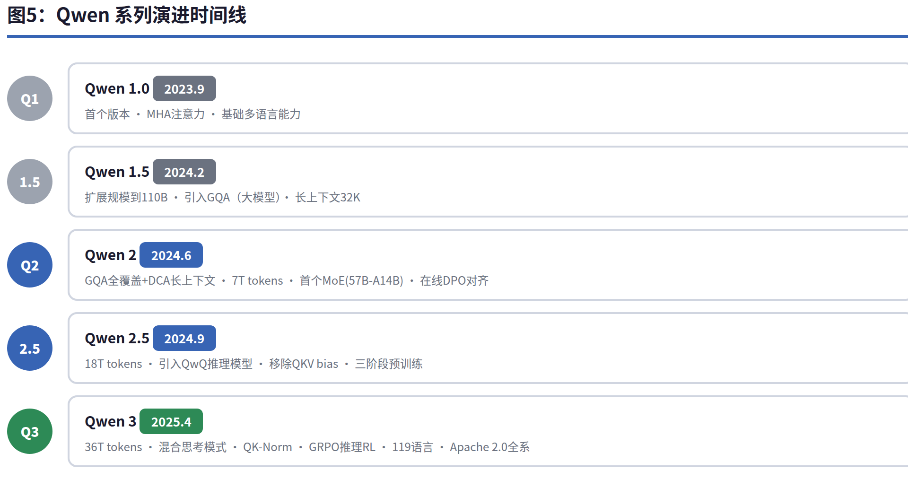
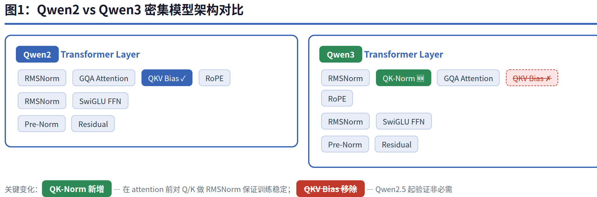
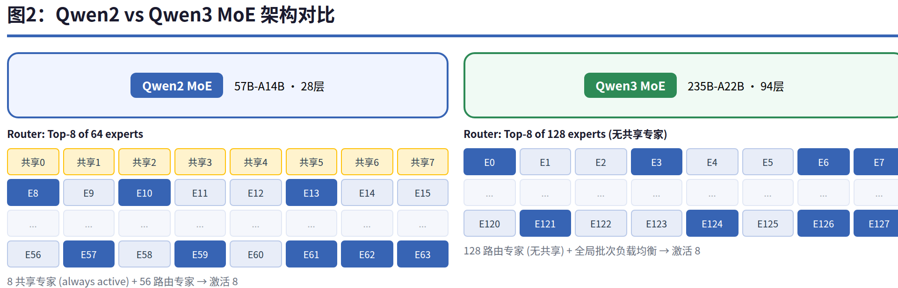
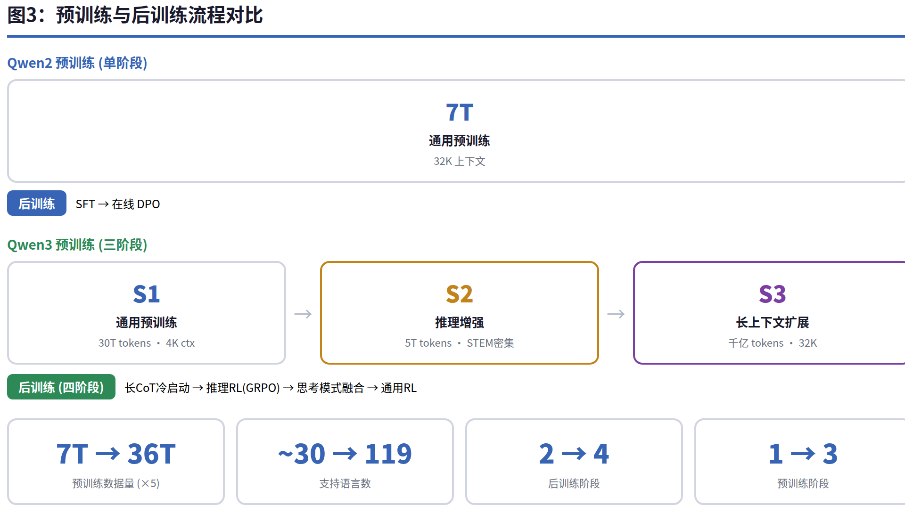
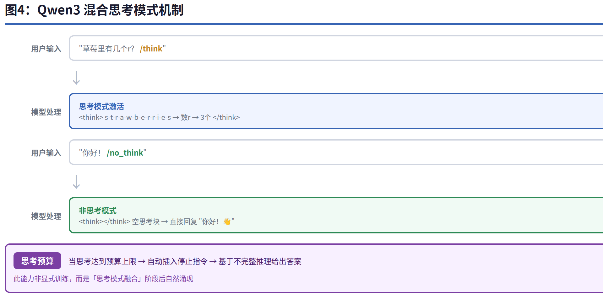
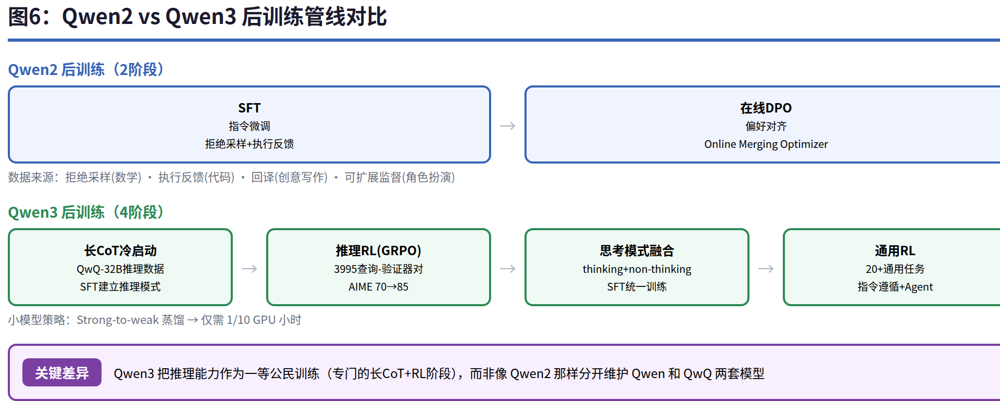
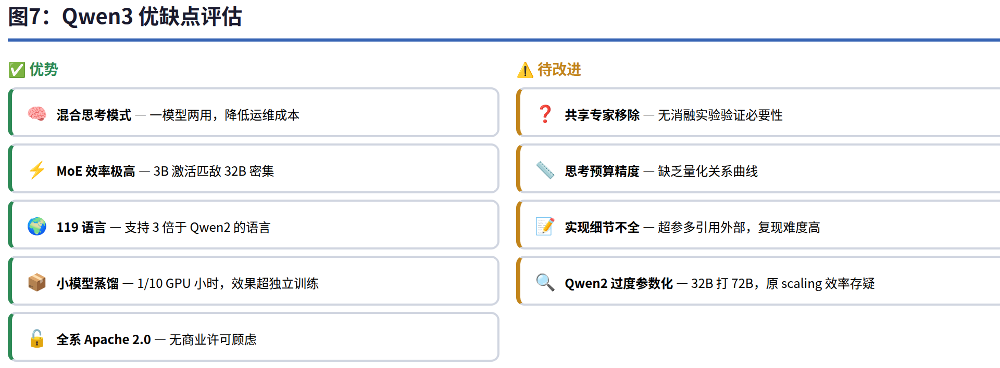
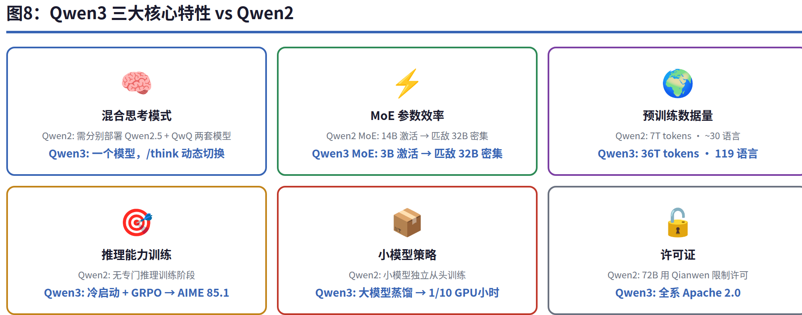

# Qwen2 vs Qwen3 实现深度对比分析

> **核心发现：Qwen2→Qwen3 不是简单升级，而是一次方法论的质变——从"更大的模型+更多数据"转向"推理能力原生内建+思考预算可控"，标志着从 scaling law 到 inference-time compute scaling 的范式转移。**

---

## 目录

1. [概述](#1-概述)
2. [架构基础对比](#2-架构基础对比)
3. [MoE 架构演进](#3-moe-架构演进)
4. [训练策略变革](#4-训练策略变革)
5. [混合思考模式：Qwen3 的最大创新](#5-混合思考模式qwen3-的最大创新)
6. [后训练管线对比](#6-后训练管线对比)
7. [批判性分析](#7-批判性分析)
8. [总结](#8-总结)

---

## 1. 概述

Qwen 系列是阿里通义千问团队开发的大型语言模型。**Qwen2**（2024年6月）是 Qwen1.5 的继任者，**Qwen3**（2025年4月）在 Qwen2.5 基础上全面进化。两代模型虽共享 Transformer decoder-only 基础，但在架构设计、训练策略和核心能力上有着本质差异。

| 维度 | Qwen2 | Qwen3 |
|------|-------|-------|
| 发布时间 | 2024年6月 | 2025年4月 |
| 模型规模 | 0.5B~72B 密集 + 57B MoE | 0.6B~32B 密集 + 30B/235B MoE |
| 预训练数据 | 7T tokens（MoE 4.5T） | 36T tokens（约5倍） |
| 支持语言 | ~30种 | 119种语言和方言 |
| 核心创新 | GQA全系+DCA长上下文 | 混合思考模式+思考预算 |
| 许可证 | 72B用Qianwen，其余Apache 2.0 | **全部 Apache 2.0** |

---

## 2. 架构基础对比

Qwen2 和 Qwen3 共享相同的 Transformer decoder-only 底座：**GQA**（减少KV缓存）、**SwiGLU**（激活函数）、**RoPE**（位置编码）、**RMSNorm**（高效归一化）、**Pre-Normalization**（训练稳定性）。但 Qwen3 做了两个关键改动：

| 改动 | Qwen2 | Qwen3 | 设计原因 |
|------|-------|-------|----------|
| **QKV Bias** | ✅ 有 | ❌ 移除 | Qwen2.5 起验证 bias 非必需 |
| **QK-Norm** | ❌ 无 | ✅ 新增 | 对 Q/K 做 RMSNorm 防止注意力分数爆炸 |

QK-Norm 是 Qwen3 在架构层面最重要的改进。在大模型训练中，未经约束的 Q 和 K 向量可能导致注意力分数过大或不稳定——QK-Norm 在 attention 计算前对两者做归一化，类似 `Q = RMSNorm(W_q(x))`，是参考 Dehghani et al. (2023) 的实践。

两组模型都使用字节级 BPE 分词器，Qwen2 词典 151,643 tokens，Qwen3 微增至 151,669 tokens。

---

## 3. MoE 架构演进

两代 MoE 的设计理念有明显差异：

### Qwen2 MoE（57B-A14B）
- 从 Qwen2-7B **upcycling** 而来：复制 FFN 权重 → 打乱维度 → 50%重初始化
- 64个专家 + **8个共享专家**，每次激活8个
- 细粒度专家：每个 expert 的 intermediate_size 仅 2560
- 路由概率不做归一化（`norm_topk_prob: false`）

### Qwen3 MoE（30B-A3B / 235B-A22B）
- 128个专家，**无共享专家**，全靠路由
- 路由概率归一化（`norm_topk_prob: true`）
- **全局批次负载均衡**：跨样本而非单样本做均衡

| 对比维度 | Qwen2-57B-A14B | Qwen3-30B-A3B | Qwen3-235B-A22B |
|----------|----------------|---------------|-----------------|
| 总/激活参数 | 57B/14B | 30B/3B | 235B/22B |
| 层数 | 28 | 48 | 94 |
| 专家总数 | 64 | 128 | 128 |
| 共享专家 | 8个 | **0** | **0** |
| 效率亮点 | 14B 激活匹敌 32B 密集 | **3B 激活匹敌 Qwen2.5-32B** | 22B 激活匹敌 DeepSeek-V3 |

**移除共享专家的决定**值得关注——在 DeepSeekMoE 中共享专家被认为是重要的（为通用知识提供基线），Qwen3 完全依赖路由专家+全局批次均衡来保证专家专业化。这是一个大胆但效果显著的设计选择。

---

## 4. 训练策略变革

### 预训练：从单阶段到三阶段

Qwen2 采用经典的单阶段预训练（7T tokens, 32K 上下文），而 Qwen3 引入**渐进式三阶段**策略：

1. **S1 通用阶段**：30T tokens, 4K 上下文——建立语言能力和世界知识基础
2. **S2 推理增强**：5T tokens, 4K 上下文——大幅提高 STEM、编程、推理数据比例
3. **S3 长上下文扩展**：千亿级 tokens, 32K 上下文——75% 数据在 16K-32K 长度

Qwen3 还大规模使用合成数据：Qwen2.5-VL 从 PDF 文档提取文本 + Qwen2.5-Math/Coder 生成数学和代码数据，合计数万亿 tokens。

### 数据效率的巨大提升

最令人印象深刻的是同参数级别的性能跃迁：

| Qwen3 模型 | 匹敌的 Qwen2.5 模型 | 参数量比 |
|-----------|-------------------|---------|
| Qwen3-1.7B | Qwen2.5-3B | 0.57× |
| Qwen3-4B | Qwen2.5-7B | 0.57× |
| Qwen3-8B | Qwen2.5-14B | 0.57× |
| Qwen3-32B | **Qwen2.5-72B** | 0.44× |

这意味着 Qwen3 的数据效率提升了约 **2倍**——用不到一半的参数达到同样的性能。

---

## 5. 混合思考模式：Qwen3 的最大创新

Qwen3 最独特的能力是**在一个模型中同时支持思考和快答两种模式**。在这之前，用户需要在 Qwen2.5（通用对话）和 QwQ（深度推理）之间切换——相当于部署两套模型。

### 工作机制

通过 Chat Template 中的 `/think` 和 `/no_think` 控制符实现动态切换：

- **思考模式**（`/think`）：模型输出 `<think>` 推理过程 `</think>` → 最终答案
- **非思考模式**（`/no_think`）：模型输出空 `<think></think>` → 直接答案

### 思考预算：灵活控制推理深度

用户可以设定思考 token 的上限。当思考到达预算时，系统自动插入停止指令，模型基于不完整的推理给出可用答案。论文特别指出：**这个能力不是显式训练的，而是模式融合后自然涌现的**——这是一个重要的 emergent behavior。

### 训练四阶段

| 阶段 | 名称 | 方法 | 关键数据/效果 |
|------|------|------|--------------|
| 1 | 长CoT冷启动 | SFT 用 QwQ-32B 生成推理数据 | 建立基础推理模式 |
| 2 | 推理RL | GRPO + 3995 查询-验证器对 | AIME'24: 70.1→85.1（170步） |
| 3 | 思考模式融合 | 混合 thinking+non-thinking SFT | 同一模型学会两种模式 |
| 4 | 通用RL | 20+ 通用领域强化学习 | 增强指令遵循和 Agent 能力 |

---

## 6. 后训练管线对比

| 阶段 | Qwen2 | Qwen3 |
|------|-------|-------|
| 对齐方法 | SFT + 在线DPO | 四阶段训练 |
| 推理训练 | 无专门阶段 | 冷启动 + GRPO 强化学习 |
| 模式整合 | 无（Qwen 和 QwQ 分开） | 思考模式融合到同一模型 |
| 小模型策略 | 独立训练 | Strong-to-weak 蒸馏（1/10 GPU小时） |
| 奖励信号 | 偏好数据 | 规则验证器（数学/代码正确答案） |

Qwen2 的对齐策略相对传统——SFT 后用 DPO 做偏好对齐。Qwen3 则将推理能力作为**一等公民**来训练：先通过可验证的数学和代码任务训练推理能力（冷启动+GRPO），再融合通用对话能力（模式融合+通用RL）。

**小模型蒸馏**是 Qwen3 的另一亮点：旗舰模型做完整的四阶段训练，小模型直接蒸馏其输出 logits，仅需 1/10 GPU 小时且效果更好。

---

## 7. 批判性分析

### 👍 做得好的地方

**混合思考模式是真正的实用创新。** 部署过 LLM 的团队都知道"一个模型做推理、一个模型做聊天"的运维成本。Qwen3 一套模型搞定，开发体验提升了一个量级。

**小模型蒸馏策略务实高效。** 论文数据表明：Qwen3-4B 匹敌 Qwen2.5-7B（仅 57% 参数），Qwen3-32B 全面超越 Qwen2.5-72B。蒸馏仅需 1/10 GPU 小时——ROI 极高。

**预训练数据"量质双升"。** 36T tokens 不仅是量的翻倍，更重要的是通过 PDF 提取和领域模型合成来丰富高质量内容，而非简单堆砌网页爬虫数据。

**Apache 2.0 全系开源**消除了商业采用的许可顾虑。

### 🤔 有争议/可改进的地方

**移除共享专家真的是正确的吗？** Qwen3 MoE 完全取消了共享专家，声称配合全局批次负载均衡获得了更好效果。但 DeepSeekMoE 论文论证了共享专家的价值——为通用语言知识提供基线，让路由专家专注于专业化。Qwen3 论文没有提供 ablation study 来量化这个决定的影响。我不禁想问：移除共享专家带来的性能提升，有多少来自"共享→路由"的架构变更，有多少来自全局批次均衡和 2 倍专家数量的协同效应？如果保留少量共享专家（比如 2-4 个）配合 124 个路由专家，效果会不会更好？

**思考预算缺乏精确控制。** 论文说这是"模式融合后自然涌现的能力"，这确实是聪明的 engineering trick，但作为一个面向用户的 feature，它的行为不够可预测。论文没有给出预算 token 数与输出质量之间的量化关系曲线，用户只能凭经验设定。

**Qwen2 的 72B 可能"过度参数化"了。** Qwen3-32B 密集模型全面碾压 Qwen2.5-72B，说明之前的数据利用效率并不高。这暗示 scaling law 的预测可能被"低质量数据训练"所污染——当数据质量足够高时，效率曲线的斜率可能完全不同。

**论文在实现细节上的"留白"。** 与 Qwen2 论文相比，Qwen3 论文在 QK-Norm 的具体超参、GRPO 的 reward shaping 细节、optimizer 配置等方面更依赖引用外部工作，而非直接给出参数。这对复现不友好。

### 💡 我的建议

如果你在选择 Qwen 版本做项目：

- **需要推理+对话兼顾 → 选 Qwen3。** 混合思考模式节省一套部署运维。
- **资源有限（端侧/边缘） → 选 Qwen3 小模型。** 蒸馏后的 0.6B-4B 效果远超同级别 Qwen2。
- **已有 Qwen2 推理管线且效果满意 → 不必急着切。** 除非你需要混合思考模式或多语言支持（119 vs 30）。
- **想做 MoE 研究 → 重点关注 Qwen3 MoE 的"无共享专家"设计。** 这是与 DeepSeekMoE 的关键分歧点，值得深入实验验证。

---

## 8. 总结

Qwen2 和 Qwen3 代表了两个世代的哲学：

- **Qwen2**：经典的 "scale up"——更好的架构（GQA全覆盖、DCA长上下文）配合更大的数据（7T tokens）和规模（72B+57B MoE），稳扎稳打追赶 GPT-4 级水平。

- **Qwen3**：**推理能力原生化**——核心不再是堆参数，而是通过 GRPO 将推理能力内化到模型中，再通过模式融合实现"快慢思考"统一，配合高效蒸馏形成"旗舰探索上限→小模型继承"的产品矩阵。

从工程实用角度，Qwen3 最值得关注的三个特性是：混合思考模式（一模型两用）、MoE 极高效率（3B 激活打 32B 密集）、Apache 2.0 全系开源。

---

*分析基于 Qwen2 论文 (arXiv:2407.10671)、Qwen3 论文 (arXiv:2505.09388)、官方博客、HuggingFace 模型配置文件。*
