# Qwen3.8-27B 混合注意力架构深度分析：27B 稠密模型如何打出前沿智能

> **核心发现：3:1 混合注意力把 KV 缓存降约 4 倍，27B 稠密模型以 AII 52 分追平闭源旗舰，17GB 量化即可本地部署。**
> 调研日期：2026-08-20 | 来源：官方模型卡拆解、GatedDeltaNet 论文（arXiv:2412.06464）、Artificial Analysis 第三方评测
> 调研人：Hermes Agent

---

## 一、概览

**本节结论：Qwen3.8-27B 用 27B 稠密参数拿下 AII 52 分，靠的是"效率换智能"——架构省成本、后训练提能力。**

**情境**：2026 年 8 月 14 日，阿里巴巴发布 Qwen3.8-27B，Apache 2.0 开源。三天内 Hugging Face 下载量突破 300 万（Cybernews 报道），是 2026 年社区反响最大的本地模型。

**冲突**：第三方评测机构 Artificial Analysis 给出智能指数 52 分，与 OpenAI 的 GPT-5.6 Luna（max）持平。在 4B–40B 开源同类（135 款）中它排名第 1；Agentic 指数 51 分，超过 Anthropic 三个月前发布的 Claude Opus 4.8（max）。一个 27B 稠密模型，在多项基准上追平甚至超过了参数大它一个数量级的闭源旗舰。

**问题**：它凭什么用这么小的参数做到？

**答案**：混合注意力架构。64 层中只有 16 层是全注意力（Gated Attention），其余 48 层是 Gated DeltaNet 线性注意力，KV 缓存因此降约 4 倍。长上下文成本大降，同样的显存能跑更大的活。再叠加 MTP 多 token 预测、原生多模态与后训练 RL，把 27B 参数的每一分利用到极致。

### 1.1 关键指标

| 指标 | 数值 |
|------|------|
| 发布 | 2026-08-14（Apache 2.0） |
| 总参数 | 27.78B（模型卡精确值，含视觉编码器；官方口径 27B） |
| 架构 | 稠密，64 层，hidden 5120，FFN 中间 17408 |
| 注意力布局 | 16 × (3×GatedDeltaNet + 1×GatedAttention) |
| 上下文 | 原生 262,144，YaRN 扩展至 1,000,000 |
| 输入模态 | 文本 + 图像 + 视频 |
| AII 智能指数 | 52（4B–40B 开源同类第 1，追平 GPT-5.6 Luna max） |
| Agentic 指数 | 51（超 Claude Opus 4.8 max） |
| 部署体积 | FP16 ~56G / FP8 ~28G / Q4 ~17G |
| 许可证 | Apache 2.0（可商用、可修改） |


> 上图是 64 层布局：每 4 层一个循环单元，前 3 层为 Gated DeltaNet（线性注意力），第 4 层为 Gated Attention（全注意力），每个注意力层后接 FFN。紫色层占 3/4，是"省钱"的结构根源。

**为什么重要**：这是"效率换智能"路线在开源模型中的标志性胜利。52 分本身不是重点，重点是它用 17GB 的量化文件、单张消费级显卡，跑出了半年前必须调用云 API 才能获得的性能。Cline 的评价是"首个达到前沿模型能力的本地模型"。

---

## 二、混合注意力：把"图书馆"换成"高级笔记本"

**本节结论**：Qwen3.8 不是堆 Transformer 层，而是把最贵的全注意力压缩到全网络 1/4，用线性注意力的固定状态承接其余 3/4 的信息处理，长上下文成本因此降约 4 倍。

### 2.1 全注意力的代价

传统 Transformer 每个 token 都要和上下文里所有历史 token 两两计算相关性，时间 O(n²)，且 KV 缓存随 token 数线性膨胀。上下文越长越贵——长上下文本质是"用显存烧出来的"。

### 2.2 3:1 混合布局

Qwen3.8-27B 沿用 Qwen3.5 建立的混合架构（并非 Qwen3.8 首创），同一方案也用于 2.4T 的 Qwen3.8-Max。64 层按"3 层 Gated DeltaNet → 1 层 Gated Attention"循环 16 组：

| 层类型 | 数量 | 注意力机制 | 内存特征 |
|--------|------|-----------|---------|
| Gated DeltaNet | 48 | 线性注意力（delta rule + 门控） | 固定大小循环状态，与上下文长度无关 |
| Gated Attention | 16 | 全注意力（GQA，Q 24 头 / KV 4 头） | KV 缓存随 token 数线性增长 |

### 2.3 KV 缓存账本

按官方配置算账（BF16，GQA 4 KV 头 × 头维 256）：

- 每层每 token：2（K、V）× 4 头 × 256 维 × 2 字节 ≈ 4 KiB
- 16 层全注意力：64 KiB/token
- 262K 上下文：16 GiB（若 64 层全为全注意力，则 64 GiB）
- 1M 上下文：64 GiB（全注意力则 256 GiB）

DeltaNet 层是固定大小状态，开销几十 MB，不随上下文移动。这就是它"单卡跑 262K 上下文"的主要原因之一，也是 agent 任务（反复把工具输出塞回上下文）能跑起来的根基。


> 上图对比 262K 上下文下的 KV 缓存：64 层全注意力需要 64 GiB，Qwen 的 3:1 混合只需 16 GiB，约 4 倍节省；1M 上下文时差距扩大到 64 vs 256 GiB。

我的判断：这是"预算思维"的架构化——把昂贵的全局注意力当成稀缺资源，只分配给 1/4 的层，其余用廉价的循环状态扛。收益不只是显存，还有训练：线性注意力 O(n) 的训练成本，让同样的算力预算能训更多数据或更长的上下文，这是 27B 能追平旗舰的第二层原因。

---

## 三、Gated DeltaNet：橡皮擦 + 铅笔

**本节结论**：线性注意力早年"记不住细节"，根源是记忆冲突；Gated DeltaNet 用"门控快速清除 + delta 规则精准覆写"解决这一弱点，是混合方案能保持检索能力的根基。

### 3.1 线性注意力的困境

线性注意力把全部历史压缩进一个固定大小的矩阵状态 S，本质是"外积键值联想记忆"。但早期版本只会纯加法累加（S += v·kᵀ），旧信息和新信息互相覆盖，序列一长就"记忆碰撞"。这是线性模型早年打不过 Transformer 的根源。

### 3.2 三种记忆机制的演进

| 机制 | 更新规则 | 能力 | 短板 |
|------|---------|------|------|
| 普通线性注意力 | S += v·kᵀ | 便宜（O(n)） | 只写不擦，记忆冲突 |
| Mamba2 | S = α·S + v·kᵀ | 门控全局衰减 | 无差别遗忘，检索崩 |
| DeltaNet | S += β·(v − S·k)·kᵀ | 按 key 精准覆写 | 只擦不写的反面：缺快速清除 |
| **Gated DeltaNet** | 见下式 | 精准写 + 快速清 | 检索仍弱于全注意力 |

Gated DeltaNet（NVIDIA + MIT，ICLR 2025，arXiv:2412.06464）把两种互补机制合成一个更新式：

```
S_t = S_{t-1}·(α_t(I − β_t·k_t·k_tᵀ)) + β_t·v_t·k_tᵀ
```

| 符号 | 来源 | 作用 | 类比 |
|------|------|------|------|
| α_t | Mamba2 门控 | 数据依赖的全局遗忘，整块记忆快速衰减 | 橡皮擦 |
| β_t | DeltaNet 规则 | 按 key 精准覆写：先预测旧值、算误差、只改该改的 | 铅笔 |


> 上图展示 Gated DeltaNet 的"橡皮擦 + 铅笔"记忆管理：门控 α 负责话题切换时整页清空，delta 规则 β 负责对指定条目精准涂改。两者互补，固定大小记忆的利用率被拉满。

论文在 1.3B 模型、100B token（FineWeb-Edu）上的对比数据验证了这一点：

| 基准 | Mamba2 | DeltaNet | Gated DeltaNet |
|------|--------|----------|----------------|
| S-NIAH-3 检索（4K 长度） | 4.6% | — | **27.6%** |
| LongBench 平均 | 13.5 | 13.6 | **16.6** |

训练上，作者用 chunkwise 并行算法（WY 表示）把顺序 RNN 更新变成矩阵乘法，吞吐接近 DeltaNet、仅略慢于 Mamba2——所以它不只是推理便宜，训练也吃得上 GPU。

我的判断：Gated DeltaNet 的价值在"记忆管理"而非"算力"。它解决了线性模型"能记多少"的问题——固定大小状态下，写错能改、过时能扔，这是 Mamba2 和 DeltaNet 各自都做不到的。检索任务上的 6 倍差距（27.6% vs 4.6%）说明这一点。

---

## 四、其他引擎：MTP、多模态与后训练

**本节结论**：架构之外，MTP 推测解码、原生视觉编码器、后训练 RL 与 reasoning_effort 控制，共同把 27B 参数的利用率推向极限。

### 4.1 MTP 多 token 预测

传统自回归模型一次前向只预测一个 token。Qwen3.8-27B 训练了多步 MTP，一次前向可给出多个候选 token，配合推测解码批量验证，减少逐 token 串行生成的开销。

这对稠密模型尤其关键：稠密模型生成每个 token 都要全部 27B 参数参与计算，解码速度是本地部署最现实的瓶颈。MTP 是对"稠密必慢"的正面对冲（发布后社区也把它作为提速的主要优化方向）。

### 4.2 原生多模态

视觉编码器直接内嵌（总参数 27.78B 含编码器），不是外挂 adapter。图像/视频理解是原生能力——模型卡宣称覆盖 STEM 图表、密集文档、小时级视频。这也解释了 OSWorld-Verified 84.3、AndroidWorld 81.9 这类"电脑操作"基准上的表现（模型卡数据）。

### 4.3 后训练与推理深度控制

思考模式默认开启，可按请求关闭；`reasoning_effort` 提供 xhigh / medium / low 三档，动态调节推理深度；`preserve_thinking` 在多轮任务中保留推理上下文。

**因果链**：混合注意力 → KV 降 4 倍 → 长上下文（agent 核心能力）成本可接受 → 后训练 RL 把推理能力榨干 → MTP/多模态锦上添花。多重因素叠加下，27B 模型把智能指数推上 52 分——这不是单一机制的功劳。

我的看法：这个模型的智能有一部分是"想出来的"而不是"堆出来的"——`reasoning_effort` 本质是推理时动态分配算力，xhigh 档位下它愿意花 2 万 token 想一个问题。这正是它 AII 评测输出 1.6 亿 token（同类中位数 4300 万）的原因，也是它"慢"的原因。

---

## 五、批判性分析

**本节结论：Qwen 的优势在小参数高性价比与本地可部署；风险集中在推理速度、"健谈"与精确检索上限。**

### 5.1 优势

1. **参数效率惊人**：27B 稠密达到 52 分，在 4B–40B 开源同类中排名第 1；Q4 量化 17GB 即可本地运行，硬件门槛远低于闭源旗舰。
2. **本地可部署**：Q4 量化 ~17GB，实测在 M5 Max MacBook Pro / DGX Spark 上能跑通 coding agent 闭环，这是"能力本地化"的里程碑。
3. **长上下文成本可控**：3:1 混合让 262K/1M 上下文成为可负担选项，agent 场景受益最大。
4. **原生多模态**：图像/视频理解内建，非 adapter 拼接，多模态与推理共享同一状态空间。
5. **宽松许可**：Apache 2.0，可商用可修改，配套生态（vLLM、SGLang、Ollama、Unsloth 量化）成熟。

### 5.2 不足与风险

1. **"健谈"严重**：默认 xhigh 推理，第三方评测输出 1.6 亿 token vs 中位 4300 万；实测一次简单请求 21 分钟、烧 2.2 万推理 token。本地日常使用必须调低 `reasoning_effort`（范围限定：在默认配置下）。
2. **速度慢**：Artificial Analysis 实测约 31 tok/s（同类排名 #66/135），"智能是思考时间换来的"（范围限定：在该测试条件下）。
3. **线性注意力的检索上限**：精确回忆（长文档逐字检索）仍弱于纯全注意力——这是线性记忆的状态压缩本质决定的（范围限定：对超长精确检索任务）。
4. **内部基准可信度存疑**：阿里公布的 SWE-bench Pro 61.7、DeepSWE 42.2 等是内部评测，harness 与第三方不一致；跨模型对比应以 Artificial Analysis 数据为准（我的判断：厂商自报数据只能看趋势，不能看绝对值）。

### 5.3 与 DeepSeek V4 Flash 0731 的路线对比

2026 年 7 月 31 日 DeepSeek 开源 V4 Flash 0731，同样跻身开源第一梯队（AII 51.8 分，AA 2026-08-20 榜），两者代表两条截然不同的"省钱"路线：

| 维度 | Qwen3.8-27B | DeepSeek V4 Flash 0731 |
|------|------------|------------------------|
| 架构 | 27B 稠密 + 3:1 混合注意力 | 284B MoE（13B 激活）+ CSA/HCA 稀疏注意力 |
| 省钱手段 | 状态压缩（线性注意力省 KV） | 参数稀疏（MoE 只激活 13B） |
| AII 智能指数 | 52 | 51.8（2026-08-20 AA 榜更新） |
| 上下文 | 262K 原生（扩 1M） | 1M 原生 |
| 多模态 | 文本+图像+视频 | 纯文本 |
| 权重体积 | ~17G（Q4） | ~167G（FP4/FP8） |
| 部署定位 | 单卡本地 | 多卡服务端 |
| API 定价（每 M token） | OpenRouter 代理价 $0.45 / $3.20（官方未公布） | $0.14 / $0.28（缓存 ~98% 折扣） |
| 加速特性 | MTP 推测解码 | DSpark 投机解码、KV 缓存 -90% |


> 上图是 2026-08-20 的 Artificial Analysis 数据：Qwen3.8-27B 智能指数 52，与 DeepSeek V4 Flash 0731（51.8）几乎打平；Agentic 指数 Qwen 51 领先 DeepSeek 48。开源前两名的差距只在毫厘之间，胜负取决于任务类型而非绝对分数。

我的判断：Qwen 用"状态压缩"换效率，适合单机部署；DeepSeek 用"参数稀疏"换规模，适合规模化服务。两条路线不冲突，且都指向同一个结论——2026 年开源模型拼的不再是裸参数，而是"每单位算力/显存能产出多少智能"。

---

## 六、对 Hermes 的启示

**本节结论："贵计算留给关键位置"的资源分配哲学、"重后训练轻堆料"的升级路径、记忆系统的写入/遗忘管理，都可迁移到 Hermes 流水线。**

1. **"贵计算留给关键位置"是可迁移的架构哲学**：Qwen 把全注意力压缩到 1/4 层，与 Hermes 报告流水线"把深度审查只用在关键章节"同构——资源分配应遵循"大部分便宜、关键处贵"。
2. **后训练 > 堆规模**：DeepSeek 0731 不加参数、只重做后训练就把智能指数提高 10 分。对 Hermes 的启示：优化 prompt 模板、审查环节、反馈闭环，可能比无限堆知识条目更有效。
3. **状态压缩与 Agent 记忆系统同构**：Gated DeltaNet 的"固定大小状态 + 门控遗忘 + delta 精准覆写"，与 omp/Mnemosyne 的"遗忘曲线 + 事实版本追踪"理念相通——记忆系统的本质都是如何在有限容量里管理写入与遗忘。
4. **推理深度分级控制**：`reasoning_effort`（xhigh/medium/low）对应 Hermes 写作流程的"审查深度分级"——简单主题快速过，复杂主题深度推理，避免 21 分钟算一张图式的算力浪费。

---

## 参考来源

1. GatedDeltaNet 论文：Yang, S., Kautz, J., Hatamizadeh, A. "Gated Delta Networks: Improving Mamba2 with Delta Rule", ICLR 2025, arXiv:2412.06464. 代码：github.com/NVlabs/GatedDeltaNet
2. Qwen3.8-27B 官方模型卡（Hugging Face Qwen/Qwen3.8-27B），2026-08-14 发布
3. Artificial Analysis 第三方评测：Qwen3.8-27B 与 DeepSeek V4 Flash 0731 模型页（2026-08-17 评测、2026-08-20 榜单更新）
4. DeepSeek 官方发布（deepseek-ai/DeepSeek-V4-Flash-0731），2026-07-31，MIT
5. 阿里云/媒体拆解：Qwen3.8-27B 模型卡配置详解（hidden 5120 / FFN 17408 / 注意力头配置）
6. 玄铁 C950 RISC-V Day 0 适配分析（混合注意力推理链路热点）
7. 社区实测：Simon Willison / Cline 等对 Qwen3.8-27B 的本地部署测试，2026-08-17~18
