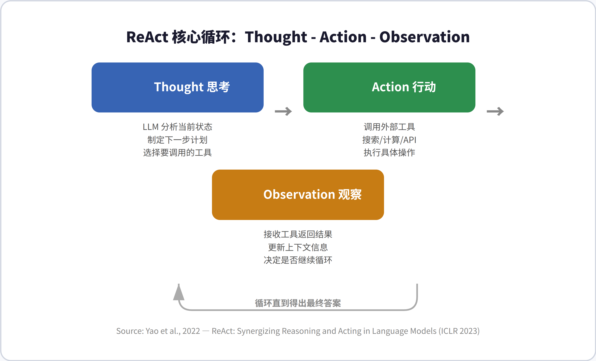
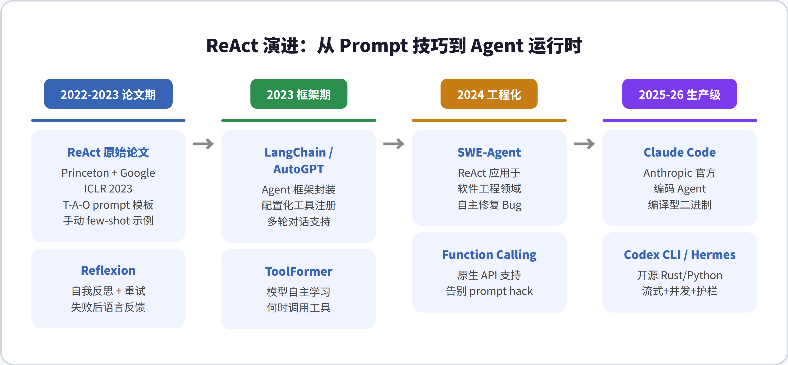
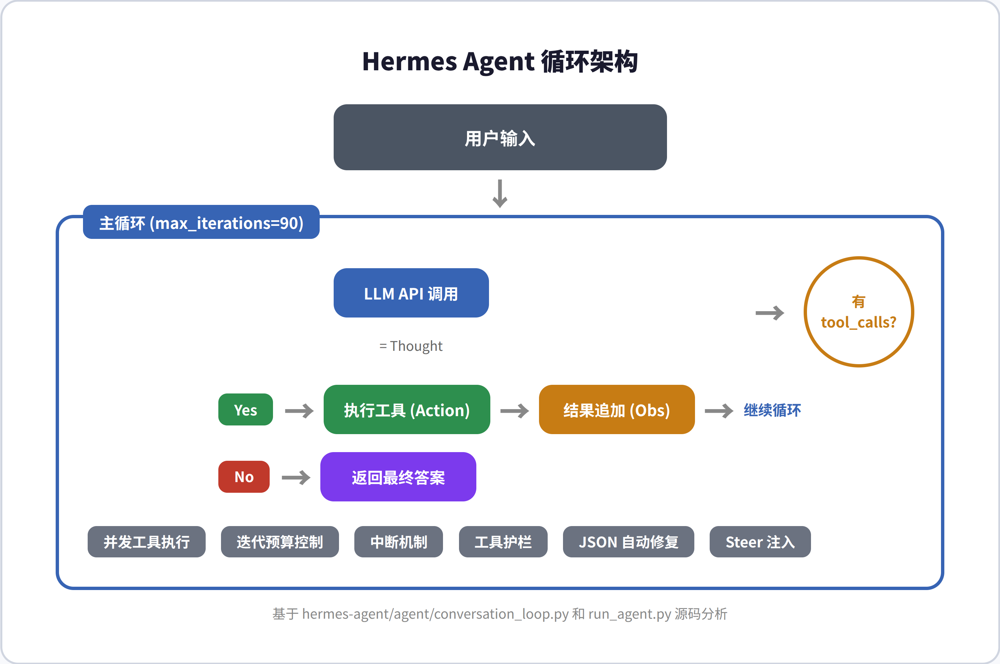
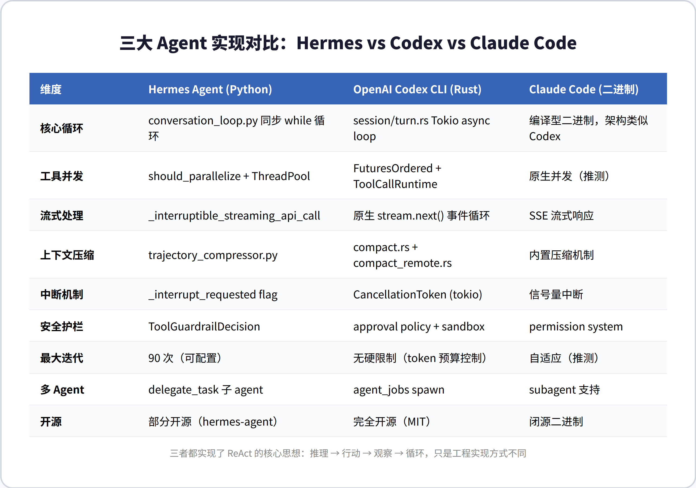

# ReAct 架构深度调研：从论文到工程实践

> **核心发现**：ReAct 不仅是一篇论文，更是现代 AI Agent 的「灵魂架构」——所有主流 Agent 框架的底层运行时都是 ReAct 循环的工程化实现。

---

## 目录

1. [概述](#1-概述)
2. [ReAct 核心机制](#2-react-核心机制)
3. [演进历程](#3-演进历程)
4. [源码实证：Hermes Agent](#4-源码实证hermes-agent)
5. [源码实证：OpenAI Codex CLI](#5-源码实证openai-codex-cli)
6. [三大实现对比](#6-三大实现对比)
7. [批判性分析](#7-批判性分析)
8. [总结与启示](#8-总结与启示)

---

## 1. 概述

**ReAct**（**Re**asoning + **Act**ing）由 Princeton 大学的 Shunyu Yao 等人于 2022 年提出，发表在 ICLR 2023（arXiv: 2210.03629）。论文的核心观点是：让 LLM 在解决问题时**交替进行推理和行动**，而不是像 Chain-of-Thought 那样只推理不行动，或像传统 Agent 那样只行动不思考。

这个思路来自人类的行为模式——我们做事时是边想边做、边做边调整的。ReAct 将这种模式形式化为一个三步循环：**Thought（思考）→ Action（行动）→ Observation（观察）**，然后不断重复直到得出最终答案。

| 属性 | 详情 |
|------|------|
| 论文 | ReAct: Synergizing Reasoning and Acting in Language Models |
| 作者 | Shunyu Yao, Jeffrey Zhao, Dian Yu 等（Princeton + Google Research） |
| 发表 | ICLR 2023 |
| 引用量 | 2500+（截至 2025 年） |
| 核心贡献 | 首次证明推理和行动可以在 LLM 中交替进行 |

---

## 2. ReAct 核心机制

### 2.1 三步循环



ReAct 的运作方式是一个严格的三步循环，每一步都有明确定义的职责：

| 步骤 | 英文 | 职责 | 示例 |
|------|------|------|------|
| 思考 | Thought | LLM 分析当前状态，制定下一步计划 | "我需要搜索科罗拉多造山运动的范围" |
| 行动 | Action | 调用外部工具执行具体操作 | `Search[Colorado orogeny]` |
| 观察 | Observation | 接收工具返回结果，更新上下文 | "科罗拉多造山运动是科罗拉多及周边地区的造山事件" |

这个循环会持续进行，直到 LLM 在 Thought 阶段判断已有足够信息，调用 `Finish[答案]` 终止循环。

### 2.2 与 Chain-of-Thought 的关键区别

Chain-of-Thought（CoT）只做推理，不与外部世界交互。这导致两个严重问题：**事实幻觉**（模型编造不存在的事实）和**知识过时**（训练数据有截止日期）。ReAct 通过引入 Action 和 Observation，让模型能够从外部获取实时信息来支撑推理，从而大幅减少幻觉。

论文实验表明，在 Fever（事实验证）任务上 ReAct 显著优于 CoT；而在 HotpotQA（多跳问答）上两者互有胜负。最关键的是：**ReAct + CoT + Self-Consistency 结合使用时效果最好**，说明推理和行动的协同才是最优解。

---

## 3. 演进历程

### 3.1 从 Prompt 技巧到 Agent 运行时



ReAct 的演进可以分为四个阶段：

| 阶段 | 时间 | 代表 | 关键变化 |
|------|------|------|----------|
| 论文期 | 2022-2023 | ReAct, Reflexion | 手写 T-A-O prompt 模板 + few-shot 示例 |
| 框架期 | 2023 | LangChain, AutoGPT, ToolFormer | Agent 框架封装，配置化工具注册 |
| 工程化 | 2024 | SWE-Agent, GORILLA | 应用于特定领域（软件工程），原生 Function Calling |
| 生产级 | 2025-26 | Claude Code, Codex CLI, Hermes | 流式+并发+护栏+压缩，编译型运行时 |

### 3.2 关键转折点

最重要的转折发生在 2024 年：主流 LLM（GPT-4o, Claude, Gemini）开始**原生支持 Function Calling API**。这意味着 ReAct 从一个需要手写 prompt 的技巧，变成了系统级的 API 协议。模型不再需要在文本中输出 `Thought:` / `Action:` 这些标签，而是直接在 API 响应中返回结构化的 `tool_calls` 字段。

这个变化让 ReAct 的实现从「prompt hack」升级为「runtime protocol」，大幅提高了可靠性和可维护性。

---

## 4. 源码实证：Hermes Agent

### 4.1 架构总览



Hermes Agent 的核心循环位于 `agent/conversation_loop.py`，是一个同步的 while 循环。循环的终止条件是：LLM 返回的响应中**没有 tool_calls**（纯文本 = 最终答案），或者达到最大迭代次数（默认 90 次）。

### 4.2 循环的核心逻辑

Hermes 的循环可以用以下伪代码概括：

```
while 迭代次数 < 90 且 预算未耗尽:
    检查中断信号
    消耗一个迭代预算
    
    response = 调用 LLM API（传入完整消息历史 + 工具定义）
    
    if response 包含 tool_calls:
        执行工具（支持并发/串行两种模式）
        将工具结果追加到消息历史
        continue  # 继续循环
    else:
        return response.content  # 返回最终答案
```

### 4.3 ReAct 概念到代码的映射

| ReAct 概念 | Hermes 实现 | 代码位置 |
|-----------|------------|---------|
| Thought | LLM API 调用，返回推理内容 + 可能的工具调用 | conversation_loop.py L1176 |
| Action | `_execute_tool_calls()` → 支持并发/串行 | run_agent.py L4065 |
| Observation | 工具返回结果追加到 messages 列表 | conversation_loop.py L3518 |
| 循环终止 | LLM 返回纯文本（无 tool_calls）时退出 | conversation_loop.py 的 else 分支 |

### 4.4 工程化增强

Hermes 在原始 ReAct 基础上做了大量工程化增强，这些是论文中没有的：

| 增强特性 | 作用 | 实现方式 |
|---------|------|---------|
| 并发工具执行 | 多个独立工具可并行运行 | `_should_parallelize_tool_batch` + ThreadPool |
| 迭代预算控制 | 防止无限循环 | `IterationBudget` 类 |
| 中断机制 | 用户可随时打断 | `_interrupt_requested` flag |
| 工具护栏 | 阻止危险操作 | `ToolGuardrailDecision` |
| JSON 自动修复 | 处理模型返回的无效参数 | `_sanitize_tool_call_arguments` |
| Steer 注入 | 循环中注入用户指导 | `_drain_pending_steer` |

---

## 5. 源码实证：OpenAI Codex CLI

### 5.1 架构特点

Codex CLI 是 OpenAI 的开源编码 Agent（`~/.hermes/repos/codex/`），用 Rust 编写，核心循环在 `codex-rs/core/src/session/turn.rs`。与 Hermes 的同步循环不同，Codex 使用 Tokio 异步运行时，原生支持流式事件处理。

### 5.2 核心循环

Codex 的 `run_turn` 函数（L135）接收一个 turn 的输入，然后进入主循环。每次迭代中，它从会话历史构建 prompt，调用模型获取流式响应，处理返回的事件（文本增量、工具调用、推理内容等）。

Codex 的独特之处在于**流式事件驱动**：它不等整个响应完成再处理，而是边接收边处理。工具调用通过 `ToolCallRuntime` 并发执行，使用 `FuturesOrdered` 管理并发的工具调用 future。

### 5.3 关键设计差异

| 维度 | Codex 的做法 |
|------|-------------|
| 异步模型 | Tokio async/await，非阻塞 I/O |
| 工具并发 | FuturesOrdered + ToolCallRuntime |
| 流式处理 | 原生 stream.next() 事件循环 |
| 上下文压缩 | compact.rs（本地）+ compact_remote.rs（远程） |
| 中断 | CancellationToken（tokio 原生） |
| 安全 | approval policy + sandbox（Seatbelt/AppArmor） |

---

## 6. 三大实现对比



| 维度 | Hermes Agent (Python) | Codex CLI (Rust) | Claude Code (二进制) |
|------|----------------------|------------------|---------------------|
| 核心循环 | 同步 while 循环 | Tokio async loop | 编译型，架构类似 Codex |
| 工具并发 | should_parallelize + ThreadPool | FuturesOrdered + ToolCallRuntime | 原生并发（推测） |
| 流式处理 | _interruptible_streaming_api_call | 原生 stream.next() | SSE 流式响应 |
| 上下文压缩 | trajectory_compressor.py | compact.rs + compact_remote.rs | 内置压缩 |
| 中断 | _interrupt_requested flag | CancellationToken | 信号量中断 |
| 安全护栏 | ToolGuardrailDecision | approval + sandbox | permission system |
| 最大迭代 | 90 次（可配置） | 无硬限制（token 预算） | 自适应（推测） |
| 多 Agent | delegate_task 子 agent | agent_jobs spawn | subagent 支持 |
| 开源 | 部分开源 | 完全开源（MIT） | 闭源二进制 |

---

## 7. 批判性分析

### 7.1 ReAct 的「过度简化」问题

ReAct 论文中的 T-A-O 三步循环看起来优雅简洁，但实际工程中你会发现**现实远比论文复杂**。Hermes 的 conversation_loop.py 有 4300 行代码，其中超过 80% 是处理各种边界情况：JSON 修复、消息序列修复、流式中断恢复、工具护栏、并发协调、上下文压缩……这些在论文中一个字都没提。

这说明 ReAct 论文提供的是**正确的抽象层次**，但工程实现需要大量的「脏活」来处理真实世界的复杂性。

### 7.2 Python vs Rust 的工程取舍

Hermes 选择 Python 是正确的——开发速度快，生态丰富，适合快速迭代。Codex 选择 Rust 也是正确的——性能高，内存安全，适合编译分发。两者的核心循环逻辑完全相同，差异只在工程实现层面。

但值得注意的是，Codex 的异步模型（Tokio）在处理并发工具调用时天然优于 Hermes 的 ThreadPool 方案。当多个工具调用需要并发执行时，Rust 的 futures 组合比 Python 的线程池更高效、更可控。

### 7.3 「循环次数」是个伪问题

Hermes 设置了 90 次最大迭代，Codex 用 token 预算控制，Claude Code 用自适应策略。但**真正的瓶颈不是循环次数，而是上下文窗口大小**。当消息历史超过模型的上下文限制时，再多次迭代也没用——你需要的是压缩，而不是更多循环。

### 7.4 我的建议

对于想要实现自己 Agent 框架的开发者：

1. **不要从零开始写循环**——直接用 Function Calling API + while 循环，这就是 ReAct 的全部
2. **把精力花在护栏上**——循环本身很简单，但安全防护、错误恢复、上下文管理才是难点
3. **并发是锦上添花**——先实现串行循环，确认逻辑正确后再加并发优化
4. **压缩比循环更重要**——上下文窗口是硬限制，压缩策略决定了 Agent 能处理多复杂的任务

---

## 8. 总结与启示

ReAct 从 2022 年的一篇论文，演变成了 2026 年所有 AI Agent 的标准运行时协议。它的核心思想——**推理→行动→观察→循环**——贯穿了 Hermes、Codex CLI、Claude Code 等所有主流 Agent 框架。

关键启示：

- **ReAct 的灵魂是循环，不是 prompt**。现代实现不再用 `Thought:` / `Action:` 文本标签，而是用原生 Function Calling API
- **论文提供抽象，工程提供现实**。从 3 步循环到 4300 行代码，中间隔着无数边界情况
- **三大实现殊途同归**。Python、Rust、编译二进制——语言不同，架构相同

简单来说：**ReAct 就是让 AI 边想边做，做完了看看结果再想下一步。这个思路简单到不需要论文就能理解，但工程化做到极致需要几千行代码。**

---

*分析基于 hermes-agent（agent/conversation_loop.py, run_agent.py）和 OpenAI Codex CLI（codex-rs/core/src/session/turn.rs）的核心源码。*
