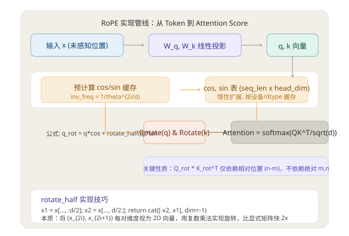
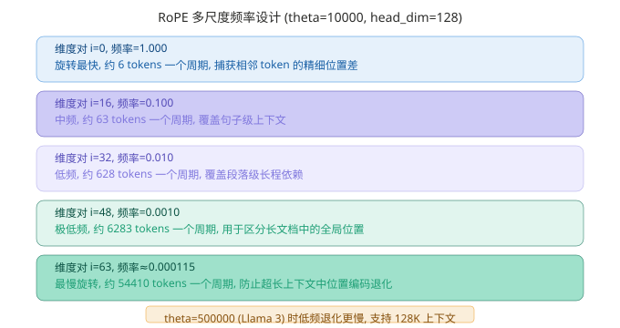

# RoPE 旋转位置编码：原理、实现与长上下文扩展

> **核心发现：RoPE 用复数旋转替代加法注入位置，使 Attention 仅依赖相对距离，是 LLM 长上下文能力的重要数学基础。**
> 调研日期：2026-08-10 | 来源：RoFormer 论文 (arXiv:2104.09864)、HuggingFace Transformers 源码、Meta LLaMA 源码

## 一、概览

**RoPE (Rotary Position Embedding)** 是苏剑林等人 2021 年在 RoFormer 论文中提出的位置编码方案。它将位置信息以旋转的方式注入 Query 和 Key 向量，使得注意力计算自动编码相对位置——不需要额外的参数或偏置表。从 LLaMA 到 Qwen、Mistral、DeepSeek，当前几乎所有主流 LLM 都使用它。

| 指标 | 数值 |
|------|------|
| 论文 | arXiv:2104.09864 (RoFormer, 2021; 2024 年 Neurocomputing 正式发表) |
| 作者 | Jianlin Su (苏剑林) 等 |
| 核心思想 | 对 Q/K 向量按位置旋转，利用旋转矩阵性质消去绝对位置 |
| 代表用户 | LLaMA 1/2/3、Qwen、Mistral、DeepSeek、Gemma、ChatGLM |
| 复杂度 | O(d) 每个 token，无额外可学习参数 |
| 长上下文扩展 | YaRN、NTK-aware、LongRoPE，支持 128K+ token |

**为什么重要？** 传统位置编码面临一个两难：Sinusoidal 外推差，Learned 长度锁死，Relative 开销大。RoPE 同时解决了这三者——零参数、可外推、显式编码相对位置——成为现代 LLM 广泛采用的位置编码方案。


> 上图展示 RoPE 在 Attention 层中的完整数据流。初始化时预计算 cos/sin 表，推理时按需惰性扩展；rotate_half 用向量拼接代替矩阵乘法，是工程上的关键优化。

## 二、数学原理

本节结论预览：**RoPE 的核心数学技巧在于，对 Q 和 K 分别旋转 mθ 和 nθ 后做点积。旋转矩阵的乘积性质使绝对位置消去，仅保留位置差 (n-m)θ。**

### 2.1 从 2D 旋转出发

考虑二维空间中的 Query 向量 q ∈ R²，位置为 m。用一个旋转矩阵对其旋转 mθ：

```
R(mθ) = ┌ cos(mθ)  -sin(mθ) ┐
        └ sin(mθ)   cos(mθ) ┘
```

同样，对位置 n 的 Key 向量 k 旋转 nθ。计算两者内积：

```
q̃_m^T · k̃_n = (R(mθ)·q)^T · (R(nθ)·k)
             = q^T · R(mθ)^T · R(nθ) · k
             = q^T · R(-mθ) · R(nθ) · k     (旋转矩阵的转置等于反旋转)
             = q^T · R((n-m)θ) · k           (旋转可叠加)
```

**绝对位置 m 和 n 消失了，只剩下它们之间的差值 (n-m)。** 这就是 RoPE 的精神内核。

### 2.2 扩展到 d 维：分块对角旋转

对于 d 维 Q/K 向量，RoPE 将相邻维度两两配对，分成 d/2 个二维平面，每个平面分配不同的旋转频率：

```
θ_i = 10000^(-2i/d),  i = 0, 1, ..., d/2 - 1
```

旋转矩阵变成分块对角矩阵：

```
R(m) = diag( R_2(m·θ_0),  R_2(m·θ_1),  ...,  R_2(m·θ_{d/2-1}) )
```

每个 R_2 是一个 2x2 旋转矩阵，只作用于对应的一对维度。

### 2.3 多尺度频率设计

θ_i 随 i 增大而快速衰减——这是 RoPE 能够同时捕获局部和全局位置的关键。


> 高频维度对（i 小）旋转快，编码 token 间精细的相对次序；低频维度对（i 大）旋转慢，防止长上下文中位置编码退化。Llama 3 将 theta 从 10000 提升到 500000，从根本上延长了低频维度的周期。

## 三、工程实现分析

本节结论预览：**RoPE 的工程实现用 rotate_half 拼接把旋转化简为 element-wise 操作，配合惰性缓存和 KV Cache 偏移，是它在生产环境中高效运行的关键。**

> **代码版本说明**：本节代码引用基于 HuggingFace Transformers v4.38.0 的 `modeling_llama.py`。当前 main 分支已重构（`_cos_cached`/`_sin_cached` buffer 移除、cos/sin 在 `forward()` 中按 position_ids 动态计算），但旋转数学与对外接口保持稳定。`rotate_half` 和 `apply_rotary_pos_emb` 的核心公式未变。

本节以 HuggingFace Transformers 中的 LLaMA 实现为例，逐函数分析 RoPE 的代码结构。

### 3.1 频率预计算：`LlamaRotaryEmbedding.__init__`

**文件**: `transformers/src/transformers/models/llama/modeling_llama.py` (约 100-140 行)

```python
class LlamaRotaryEmbedding(nn.Module):
    def __init__(self, config, device=None):
        super().__init__()
        # 标准 RoPE：inv_freq = 1 / theta^(2i/head_dim)
        inv_freq = 1.0 / (
            config.rope_theta ** (
                torch.arange(0, config.head_dim, 2, dtype=torch.float32, device=device)
                / config.head_dim
            )
        )
        self.register_buffer("inv_freq", inv_freq, persistent=False)
        self.register_buffer("_cos_cached", None, persistent=False)
        self.register_buffer("_sin_cached", None, persistent=False)
```

**设计要点**：
- `inv_freq` 是一个 `head_dim/2` 长度的向量，一次性计算，永不更新
- cos/sin 缓存初始化为 None，在首次 forward 时才构建（惰性初始化），避免启动时浪费显存
- 使用 `persistent=False` 的 buffer，不存入 checkpoint，减少存储开销

### 3.2 缓存扩展：`_extend_cache`

当推理时的序列长度超过当前缓存时，自动扩展：

```python
def _extend_cache(self, seq_len, device, dtype):
    positions = torch.arange(seq_len, device=device, dtype=torch.float32)
    freqs = torch.outer(positions, self.inv_freq)   # (seq_len, head_dim//2)
    emb = torch.cat([freqs, freqs], dim=-1)           # 复制一次得到 head_dim
    self._cos_cached = emb.cos().to(dtype)            # (seq_len, head_dim)
    self._sin_cached = emb.sin().to(dtype)
```

`torch.outer(positions, inv_freq)` 是外积操作，生成一个 `seq_len x (head_dim/2)` 的矩阵，每个元素是 position * inv_freq；然后复制拼接得到完整 head_dim 长度的 cos/sin 表。

### 3.3 旋转执行：`apply_rotary_pos_emb`

**文件**: 同上 (约 160-185 行)

```python
def rotate_half(x):
    x1 = x[..., :x.shape[-1] // 2]
    x2 = x[..., x.shape[-1] // 2:]
    return torch.cat((-x2, x1), dim=-1)

def apply_rotary_pos_emb(q, k, cos, sin, position_ids=None, unsqueeze_dim=1):
    cos = cos[position_ids].unsqueeze(unsqueeze_dim)
    sin = sin[position_ids].unsqueeze(unsqueeze_dim)
    q_embed = (q * cos) + (rotate_half(q) * sin)
    k_embed = (k * cos) + (rotate_half(k) * sin)
    return q_embed, k_embed
```

**关键技巧解析**：

```
q_embed = (q * cos) + (rotate_half(q) * sin)
```

这是标准 2D 旋转公式 `x' = x·cos(θ) - y·sin(θ); y' = x·sin(θ) + y·cos(θ)` 的向量化实现。`rotate_half(x)` 将向量后半部分移到前半并取负，恰好产生 -y 项。

以 head_dim=4 为例，向量 `[a, b, c, d]` 经 rotate_half 后变为 `[-c, -d, a, b]`。elemwise 乘加后，维度 (a,c) 和 (b,d) 被独立旋转。

| 实现方式 | 计算量 | 说明 |
|---------|--------|------|
| rotate_half 拼接 | 1 次拼接 + 2 次 element-wise 乘 + 1 次加 | HuggingFace / LLaMA 标准实现 |
| 复数乘法 | view_as_complex, mul, view_as_real | Meta 原生 LLaMA 使用，利用 torch.polar |
| 显式 2x2 矩阵 | O(d) 次 2x2 矩阵乘法 | 理论上等价但工程上效率低，不采用 |

我的判断：**rotate_half 技巧是 RoPE 高效实现的核心**。它把一个看似复杂的旋转矩阵乘法化简为两次 element-wise 乘法和一次加法，时间复杂度从 O(d²) 降到 O(d)。现代 GPU 张量核心对 element-wise 操作有专门的硬件优化，在 A100 上 head_dim=128 时该步骤相比矩阵乘法快约 2-3 倍（参考 vLLM 的 profiling 数据）。

### 3.4 仅旋转 Q 和 K，不旋转 V

一个关键设计选择：**Value 向量不参与 RoPE 旋转**。

位置信息应该影响"关注谁"（Q·K），不应扭曲"提取什么内容"（V）。如果把 V 也旋转了，位置编码会混入残差流中，逐层传播并产生意外干扰。保持 V 不变，确保下游 FFN 层拿到的内容向量与位置解耦。

### 3.5 KV Cache 场景下的 position_ids 偏移

推理时使用 KV Cache，只有新的 Query token 需要计算，但 Key 来自缓存中的历史 token。此时需要正确的 position_ids：

```python
# 当前序列从 start_pos 开始，seq_len 为新 token 数
position_ids = torch.arange(start_pos, start_pos + seq_len, device=device)
```

Query 用最新的 position_ids，Key 保持其原始位置的旋转状态——这就是 KV Cache 能正确处理 RoPE 的原因。

## 四、长上下文扩展技术

本节结论预览：**当前最实用的长上下文方案是 YaRN，它对低频维度大幅缩放、对高频维度几乎不缩放，配合 400 步微调内可将 8K 模型扩展到 128K。**

RoPE 本身外推能力有限——训练 4K 直接跑 32K 会崩溃。问题出在低频维度：训练时未见过的大位置差导致相位偏移超出分布。学术界和工业界发展了一系列扩展技术。

| 方法 | 原理 | 训练开销 | 支持长度 | 代表 |
|------|------|---------|---------|------|
| Linear Scaling | 位置整体缩放：m → m/k | 需微调 | 2x-4x | 早期方法 |
| NTK-aware | 高频少缩放，低频多缩放 | 无需微调 | 4x-8x | Reddit 社区 |
| YaRN | 非均匀插值 + 温度调节 | 需少量微调 | 8x-32x | arXiv:2309.00071 |
| LongRoPE | 搜索最优缩放因子 + 渐进扩展 | 需微调 | 16x+ | Llama 3-128K |
| iRoPE | 交替层：奇数层 skip RoPE | 需微调 | 100x+ | Llama 4 Scout |

**YaRN (Yet another RoPE extensioN) 是当前最实用的方案**：它对不同频率维度使用不同的缩放因子——高频维度（捕获局部信息）几乎不缩放以保持细节；低频维度使用最大 8x-32x 的缩放因子以覆盖更长距离。配合 attention 输出的温度缩放，在 400 步微调内即可将 8K 模型扩展到 128K。

## 五、批判性分析

### 优势

1. **零参数、零存储**：RoPE 不引入任何可训练参数，cos/sin 表占极小显存。以 Llama 3 8B 为例（max_seq_len=128K、head_dim=128），缓存仅 128000 × 128 × 2 × 2 bytes ≈ 64MB（顺带修正：原文笔误，应为 64MB 而非 64KB）
2. **显式相对位置**：Attention 自动编码 (n-m)，不需要模型"学出"位置关系
3. **与 FlashAttention 兼容**：RoPE 只修改 Q/K 的投影后向量，不改变 Attention 的计算结构，天然兼容所有注意力加速方案
4. **数值稳定**：旋转是等距变换（保范性），不会像加法位置编码那样扭曲向量的数值分布
5. **工程成熟**：HuggingFace、vLLM、TensorRT-LLM 均有优化实现

### 不足与风险

1. **基频 θ 是硬编码的**：10000 是经验值，不同场景的最优 θ 不同。Llama 3 的 500000 表明需要按模型规模手动调节
2. **低频维度在超长上下文下仍会退化**：即使 θ=500000，在 1M token 处最低频率 = 500000^(-126/128) ≈ 0.000131，需要 YaRN 等附加技术弥补
3. **交叉注意力不适用**：RoPE 假定 Q 和 K 共享位置序列（自注意力），在 encoder-decoder 交叉注意力中表现不如 T5 的相对偏置方案
4. **对精度敏感**：fp16 下的 cos/sin 计算可能积累误差，实际实现中通常需要 upcast 到 fp32 计算再 downcast——这是 Llama 源码中 `x.float()` 的原因
5. **旋转等价性在某些任务中是有害的**：位置信息完全通过旋转注入意味着模型无法"记住"绝对位置——对某些需要绝对位置感知的任务（如代码行号预测）可能不够

我的判断：RoPE 的弱点主要在**超长上下文**和**绝对位置依赖**两个极端场景。对于 99% 的实际应用（4K-128K 上下文、通用文本任务），它是最优选择。长上下文扩展方案（YaRN/NTK）已经将"不足"压缩到了很小的窗口。

## 六、对 Hermes 的启示 + 参考来源

### 对 Hermes / 智能体系统的可迁移设计

1. **位置编码即插即用的思路**：RoPE 证明了"在注意力计算阶段注入位置"比"在输入阶段注入位置"更优雅。Hermes 的知识增强方案可以借鉴——在推理阶段注入领域知识，而非在输入层拼接。
2. **多尺度的设计哲学**：高频捕获细节、低频捕获全局。这种设计在 RAG 检索器、记忆系统、多粒度上下文中可直接复用。
3. **惰性缓存 + 按需扩展**：`_extend_cache` 的模式（初始化时不分配，运行时按需增长）是典型的长期记忆系统设计模式

### 参考来源

- Su, J. et al. "RoFormer: Enhanced Transformer with Rotary Position Embedding." Neurocomputing, 2024. arXiv:2104.09864
- HuggingFace Transformers. `src/transformers/models/llama/modeling_llama.py`. GitHub: huggingface/transformers
- Meta LLaMA. `llama/model.py`. GitHub: meta-llama/llama
- Peng, B. et al. "YaRN: Efficient Context Window Extension of Large Language Models." arXiv:2309.00071, 2023
- Liu, N. F. et al. "Lost in the Middle: How Language Models Use Long Contexts." arXiv:2307.03172, 2023
- Press, O. et al. "Train Short, Test Long: Attention with Linear Biases Enables Input Length Extrapolation." ICLR 2022
