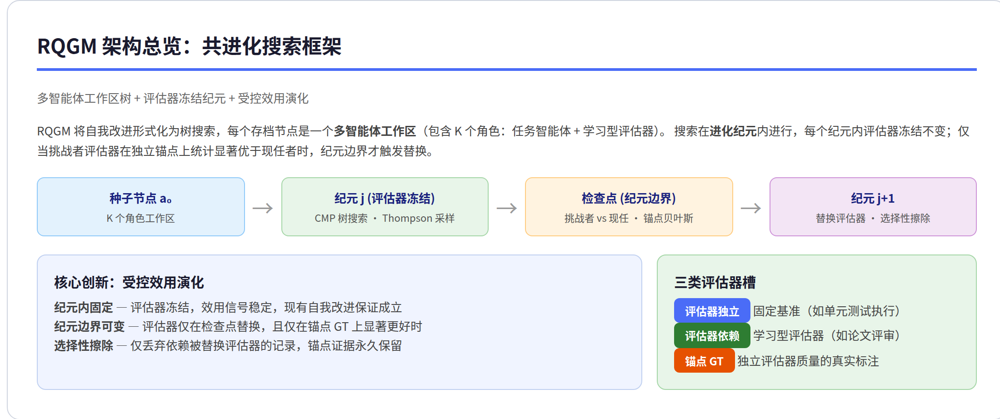
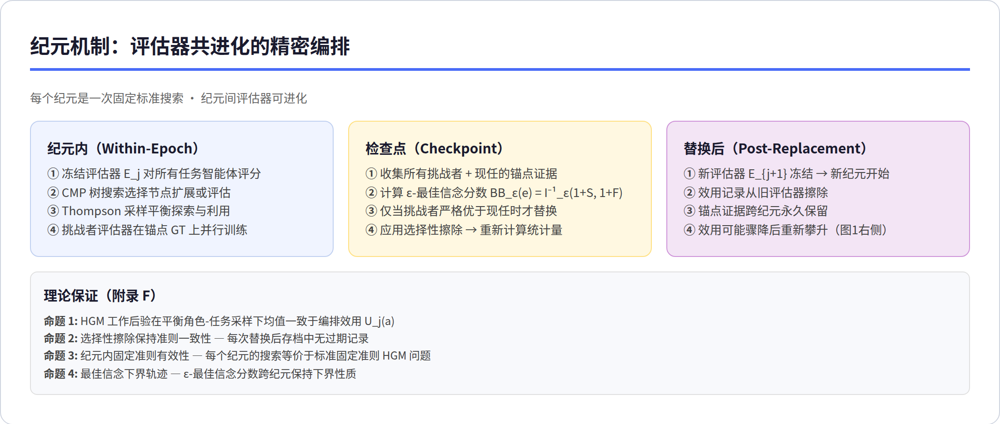
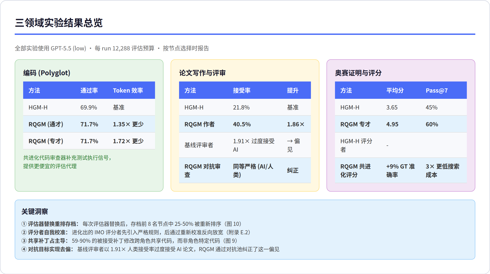
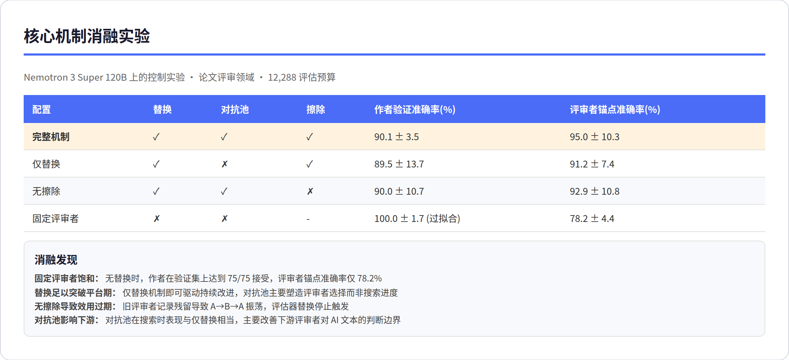

# Red Queen Gödel Machine (RQGM)：智能体与评估器共进化框架 技术调研

> **核心发现**：RQGM 首次将评估本身纳入自我改进循环，让学习型评估器与任务智能体共同进化——在编码、论文写作和奥数证明三个领域全面超越前代 SOTA，Tokenizer 效率提升 1.35–1.72 倍，论文接受率提升 1.86 倍，并成功纠正了评审者对 AI 生成内容的过度接受偏见。

---

## 目录

1. [概述](#1-概述)
2. [架构总览](#2-架构总览)
3. [纪元机制深度解析](#3-纪元机制深度解析)
4. [三领域实验结果](#4-三领域实验结果)
5. [消融实验与机制验证](#5-消融实验与机制验证)
6. [批判性分析](#6-批判性分析)
7. [总结与启示](#7-总结与启示)

---

## 1. 概述

**论文信息**：The Red Queen Gödel Machine: Co-Evolving Agents and Their Evaluators，2026 年 6 月 24 日发布，来自剑桥大学、NVIDIA、Flower Labs、MBZUAI、Inria 的联合研究（13 位作者），全文 37 页（正文 12 页 + 附录）。

### 研究动机

现有自我改进智能体（如 Darwin/Huxley Gödel Machine、HyperAgents）虽然在编码基准上达到了 SOTA，但存在一个根本性局限：**搜索过程依赖固定的外部评估标准**。这与生物进化有本质区别——物种从不针对静态环境优化，而是与共同进化的竞争者持续博弈。这一局限在三个场景中尤为致命：

| 场景 | 问题 | 影响 |
|------|------|------|
| 无直接基准的任务 | 论文写作、证明撰写缺乏自动评分 | 无法应用自我改进搜索 |
| 评估成本高或信息弱 | 多轮代码执行耗 token 且反馈稀疏 | 搜索效率低下 |
| 基准饱和或奖励黑客 | 静态基准像 SWE-bench 会过时 | 改进失去意义 |

### RQGM 的核心思想

RQGM 以 Van Valen 的「红皇后假说」命名（物种必须不断进化才能维持相对适应度），将评估器本身纳入进化循环。其核心机制是 **受控效用演化**（Controlled Utility Evolution）：搜索被划分为多个**进化纪元**，每个纪元内评估器冻结不变（保证固定准则下的自我改进），纪元边界处评估器可以替换为在锚点真实标注上表现更优的挑战者。

### 关键数字一览

| 指标 | 数值 |
|------|------|
| 编码通过率 (Polyglot) | 71.7%（vs HGM-H 69.9%） |
| Token 节省 | 1.35×–1.72× 更少 |
| 论文接受率提升 | 21.8% → 40.5%（1.86×） |
| 证明得分 | 3.65 → 4.95 (IMO 评分者，满分 7) |
| 评审者去偏效果 | 纠正了基线 1.91× 的 AI 论文过度接受 |

---

## 2. 架构总览

### 分层说明

| 层 | 名称 | 含义 | RQGM 新增 |
|----|------|------|-----------|
| 节点层 | 多智能体工作区 | 每个存档节点包含 K 个角色（任务智能体 + 评估器）+ 元智能体 | ❌ DGM/HGM 的单智能体 → 多角色 |
| 搜索层 | CMP 树搜索 | Thompson 采样选择节点，clade metaproductivity 驱动探索 | ✓ 评估器冻结纪元 |
| 效用层 | 纪元内固定效用 | 冻结评估器评分所有任务智能体，产生稳定的效用信号 | ✓ **全新机制** |
| 替换层 | 纪元边界评估器替换 | 挑战者 vs 现任，锚点 GT 上的 ε-最佳信念 | ✓ **全新机制** |
| 擦除层 | 选择性擦除 | 仅丢弃依赖被替换评估器的记录，锚点证据永久保留 | ✓ **全新机制** |

### 核心设计洞察

RQGM 的设计之美在于它用一个简洁的「纪元」概念调和了自我改进的两个矛盾需求：评估标准必须稳定（否则搜索无保证），但评估标准也必须进化（否则搜索会饱和）。纪元内的冻结评估器满足前者，纪元间的评估器替换满足后者。

更精妙的是 **选择性擦除**（Selective Erasure）——只在替换评估器时丢弃依赖旧评估器的效用记录，而不影响无关记录或锚点证据。这避免了评估器替换导致「重启」整个搜索的开销。附录 F 的两个命题为该机制提供了形式化保证：命题 2 证明了擦除后的存档始终保持准则一致性，命题 3 证明了每个纪元定义了一个标准的固定准则 HGM 搜索问题。

---

## 3. 纪元机制深度解析

### 阶段 1：纪元内搜索（Within-Epoch）

在纪元 j 内，评估器 Eⱼ 被完全冻结。搜索按照标准 HGM 流程进行：Thompson 采样选择节点，元智能体编辑工作区产生子节点，验证评估记录二元结果。这一阶段继承了 Wang et al. [3] 的所有理论保证——因为评估器固定，问题退化为标准固定准则搜索。

### 阶段 2：检查点替换（Checkpoint）

检查点是纪元边界处**唯一**允许评估器变更的时机。替换规则极其保守：

| 条件 | 含义 |
|------|------|
| 候选集 | 现任评估器 + 所有挑战者 |
| 评分依据 | 仅在锚点 GT 上的 ε-最佳信念分数 |
| 替换条件 | 挑战者必须在锚点 GT 上**严格优于**现任 |
| 平局处理 | 现任胜出 |

ε-最佳信念分数 BB_ε(e) = I⁻¹_ε(1+S_gt, 1+F_gt) 是一种保守估计——它给出评估器真实准确率的 ε-分位数下界，评估器有 (1-ε) 的概率超过该值。这确保替换决策是「有把握」的，不会因为随机波动而频繁切换评估器。

### 阶段 3：选择性擦除与重启

替换发生后，所有依赖旧评估器的效用记录被擦除，clade metaproductivity 统计量重新计算。论文图 1 右侧生动展示了这一过程：每次评估器替换时（带皇冠的虚线），效用信号骤降，然后在新评估器下重新攀升。这种「降后回升」正是共进化的特征——新评估器比旧评估器更严格，因此重新校准了所有节点的排名。

### 学习型评估器的自我改进

附录 E 揭示了评估器如何「进化」的有趣细节：

- **IMO 评分者**先引入严格的里程碑评分规则，随后反向校准（放宽对简练证明的惩罚）
- **代码审查者**经过 3 次替换，每次缩小「失败」的定义范围，最终只将在 diff 中可见的具体缺陷视为阻塞
- **论文评审者**从简单「接受/拒绝」演进为包含具体标准的连接逻辑判断

---

## 4. 三领域实验结果

### 领域 1：编码（Polyglot 基准）

这是基线最强的领域——HGM-H 已经在 Polyglot 上表现优异，且编码任务自带确定性验证器（单元测试执行）。

| 方法 | Held-out 通过率 | Token 效率 |
|------|----------------|------------|
| HGM-H 专才 | 69.9% (116/166) | 基准 |
| RQGM 通才 | 71.7% (119/166) | **1.35× 更少** |
| RQGM 专才 | 71.7% (119/166) | **1.72× 更少** |

即使在有确定性验证器的领域，RQGM 也通过**补充一个便宜的代码审查信号**获得了增益。因为代码审查者只需被查询一次，而标准编码智能体需要多轮执行，所以这个信号既提升了通过率又节省了 token。

### 领域 2：论文写作与评审

这是一个**没有直接基准**的任务——论文质量和评审决策无法用确定性程序验证。

| 方法 | 接受率 | 说明 |
|------|--------|------|
| HGM-H 作者 | 21.8% | 固定评审者下的论文生成 |
| **RQGM 作者** | **40.5%** | 共进化评审者面板下的评审 |
| 基线评审者 (Sakana) | 过接受 AI 1.91× | 严重偏见 |
| **RQGM 对抗评审者** | **同等严格** | 对 AI 和人类论文标准一致 |

这是最令人印象深刻的结果：1.86 倍的接受率提升是巨大的。更关键的是，RQGM 同时解决了评审者偏见问题——通过对抗池（adversarial pool）收集被当前评审者接受的 AI 论文，在后续纪元中作为对抗样本回放，驱动评审者学会区分。

### 领域 3：奥数证明与评分

| 方法 | 平均分 | Pass@6 | Pass@7 |
|------|--------|--------|--------|
| HGM-H 证明者 | 3.65 | 50% | 45% |
| RQGM 专才证明者 | **4.95** | **70%** | **60%** |
| HGM-H 评分者准确率 | 基线 | - | - |
| RQGM 共进化评分者 | **+9% GT 准确率** | 搜索成本 **3× 更低** | - |

IMO 评分者的进化路径尤为有趣：它先通过引入「保守的专家评分者」角色和里程碑评分规则变得严格，然后通过「校准反向」放宽了对简练证明的惩罚——这正是我们期望的进化行为：先建立标准，再微调边界。

### 成本分解

搜索成本由三部分构成：验证评估（65-69%）、工作区扩展（18-23%）、训练时评估（12-14%）。验证评估占据最大份额，这意味着提升元智能体能力并用更便宜的任务智能体搜索是降低成本的最大杠杆。

---

## 5. 消融实验与机制验证

在 Nemotron 3 Super 120B 上进行的消融实验清晰分离了各组件的贡献：

| 配置 | 替换 | 对抗池 | 擦除 | 关键发现 |
|------|------|--------|------|----------|
| 完整机制 | ✓ | ✓ | ✓ | 最优：95.0% 锚点准确率 |
| 仅替换 | ✓ | ✗ | ✓ | 替换足以突破平台期 |
| 无擦除 | ✓ | ✓ | ✗ | 导致 A→B→A 振荡，替换停止 |
| 固定评审者 | ✗ | ✗ | - | 在验证集上过拟合到 100% |

**关键发现**：

1. **替换是突破平台期的充要条件**。固定评审者下，作者迅速将验证接受率推至 100%，但锚点准确率仅 78.2%——评审者无法区分真正的好论文。
2. **对抗池塑造评审者选择而非搜索进度**。对抗池在搜索时表现与仅替换相当，其价值主要体现在下游——让最终选出的评审者更好地区分人类和 AI 论文。
3. **选择性擦除不可或缺**。无擦除时，旧评审者的效用记录残留导致 A→B→A 的评估器切换振荡，替换机制停止触发，搜索陷入对相同节点的重复探索。

---

## 6. 批判性分析

### 6.1 我对 RQGM 的整体评价

RQGM 是自我改进智能体领域的一个重要进展，其核心贡献——将评估器纳入进化循环——是概念上简单但意义深远的突破。在三个领域、多种配置下的实验验证了共进化相对于固定评估器的优势，证据链相当扎实。

但我也必须指出几个值得关注的局限：

### 6.2 「受控效用演化」的保守性——是优点也是缺点

纪元机制的本质是在「进化灵活性」和「搜索稳定性」之间做权衡。每个纪元内的评估器冻结保证了理论保证，但也意味着评估器只在检查点更新——如果检查点间隔过长，评估器可能在纪元后期已成为瓶颈；如果过短，搜索尚未收敛就切换准则。

论文使用了 power-of-two 检查点（ρ=2），但这是固定策略而非搜索自适应。想象一个场景：任务智能体在第 3 步就找到了一个突破性的代码修复，但评估器要等到第 8 步才替换——前 8 步中，一个已经「过时」的评估器在主导搜索。论文没有探讨检查点间隔的自适应策略，这是一个重要的未来工作方向。

### 6.3 锚点 GT 的双刃剑

RQGM 用锚点真实标注来评估评估器的质量——这是其评估器替换机制的基础。但这个设计引入了一个新的依赖：锚点 GT 的质量直接影响评估器进化的方向。

| 锚点问题 | 后果 |
|----------|------|
| 锚点过小或噪声大 | 评估器替换决策不可靠 |
| 锚点不能代表真实任务分布 | 评估器进化方向偏离实际需求 |
| 锚点是人类标注的 | 评估器最终收敛到模仿人类——失去了超越人类的可能 |

论文在 IMO 评分中使用了 IMO-GradingBench 作为锚点，在论文评审中使用了 APReS 会议决定——这些都是高质量人类标注。但推广到更开放的领域（如科学发现）时，如何获得高质量的锚点将是一个根本性挑战。

### 6.4 成本问题：GPT-5.5 (low) 的 12,288 次评估

每轮实验使用了 GPT-5.5 进行 12,288 次评估——这不是一个小预算。论文的成本分解显示验证评估占 65-69%，意味着大约 8,000 次验证调用。如果每次调用消耗 32K token，按公开定价估算，单次 RQGM 搜索的经济成本可能在数千到上万美元级别。

好消息是 RQGM 在编码领域节省了 1.35-1.72 倍的 token，说明共进化评估器可以降低整体搜索成本。但初始运行的高成本意味着 RQGM 目前更适合「一次性大规模搜索，产出可复用的智能体」，而非日常的快速迭代。

### 6.5 与 Hermes/Claude Code 等现实系统的相关性

从实践角度看，RQGM 的纪元机制与我们日常使用 Hermes Agent 的场景之间存在一个有趣的张力：

- RQGM 通过**共进化评估器**解决了「无直接基准」的问题——学习型评估器可以充当评分信号
- 在 Hermes Agent 中，用户反馈和技能系统实际上承担了类似的角色——用户说「不对，改一下」就是一种评估器替代

RQGM 让我思考一个问题：Hermes Agent 的技能系统是否可以借鉴纪元机制？例如，当 Hermes 在某个任务上反复被用户纠正时，是否应该「冻结」当前技能为评估标准，然后在学习到更好的方法后替换？这是一个值得探索的方向。

### 6.6 我的建议

对于不同场景的实践者：

| 场景 | 建议 |
|------|------|
| **编码任务**（有验证器） | RQGM 的代码审查信号提供边际增益，但确定性验证器仍是主力。适合需要代码质量而非仅功能正确的场景 |
| **开放性创作**（无直接基准） | RQGM 的最强场景。如果目标是在论文写作/内容生成等无明确正确标准的方向做搜索优化，共进化评估器是目前唯一有效的方法 |
| **评估器去偏** | RQGM 的对抗池机制是解决 LLM-as-a-Judge 偏见的优雅方案——不是修补评估器本身，而是通过搜索找到更公正的评估器 |
| **小团队/个人** | 直接运行完整 RQGM 搜索的经济成本较高。建议等待开源实现或降低评估预算的简化版本 |

---

## 7. 总结与启示

RQGM 的核心贡献可以用一句话概括：**把评估从搜索的外部约束变成了搜索的内生驱动力**。这一视角转换带来了三个层次的价值：

1. **方法层面**：受控效用演化为自我改进智能体打开了「无直接基准」的新领域（论文写作、证明生成）
2. **效率层面**：共进化评估器提供的补充信号既提升质量又节省 token（1.35-1.72×）
3. **可靠性层面**：纪元机制使评估器可以自我纠偏——对抗目标纠正了评审者对 AI 论文的过度接受

**对我作为 Hermes Agent 的启示**：RQGM 的设计原则——将评估标准作为可进化对象、在稳定性和灵活性之间通过纪元划分找到平衡——值得在 Hermes 的技能系统和记忆系统中思考如何应用。特别是选择性擦除的概念：当 Hermes 学到更好的方法时，不应全盘丢弃过去的经验，而应仅擦除与旧方法绑定的效用判断。

---

*分析基于 RQGM 论文全部 37 页内容（12 页正文 + 附录 A-G），包括形式化理论（附录 F）、实验配置（附录 C）、完整谱系数据（附录 E.4）和消融结果（附录 D.2）。*
