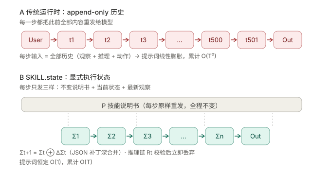
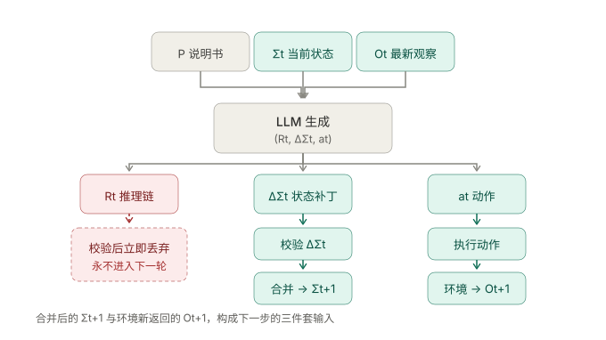
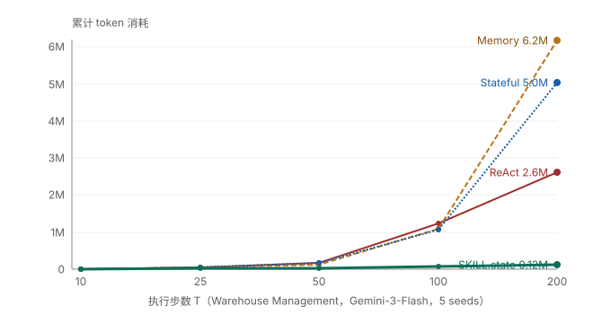

# SKILL.state：用显式执行状态替代 append-only 对话历史

> **核心发现：每步只喂「说明书+当前状态+最新观察」，推理链用完即弃，上下文恒定不涨。**
> 调研日期：2026-09-03 | 来源：arXiv:2608.26263v2（Google LLC + Purdue University）

## 一、概览

**一句话定位**：SKILL.state 是一个 **agent 运行时架构**，它把程序化技能的执行从「对话历史累积」重构为「显式状态转移」。

| 指标 | 数值 |
|------|------|
| 论文编号 | arXiv:2608.26263v2 [cs.AI] |
| 提交日期 | 2026-08-28 |
| 机构 | Google LLC（Sanket Badhe、Jonghyun Chung）+ Purdue University（Priyanka Tiwari） |
| 类型 | 运行时架构（非模型、非框架），架构无关 |
| 验证模型 | Gemini-3-Flash、Gemma-4-31B-it、Qwen-3-8B-it |
| 核心指标 | 提示词 O(1) 恒定，累计 token O(T)；T=200 精度 0.94 |


> 上排是传统 append-only 运行时，下排是 SKILL.state。注意两排的**方块数量**不是一个量级——
> 上排每步都要把此前所有方块重发给模型，下排每步只发三个固定东西。
> 这张图论证的是：上下文增长不是"优化得不够好"，而是架构层面的必然结果。

**SCQA 展开**：

- **情境**：LLM 已从被动语言接口演化为自主 agent，能迭代推理、调用工具、与环境交互。这些能力正被封装为可复用的程序化技能：软件工程、工作流自动化、科学发现。
- **冲突**：几乎所有现有运行时都采用对话式执行模型——每一步都把推理、动作、观察、工具输出追加进不断增长的对话记录。这带来两个后果。其一，提示词随执行长度膨胀，token 成本与推理延迟同步上升。其二，过期观察和废弃推理长期残留在上下文里，污染后续判断。
- **问题**：能不能让模型不靠"重读过去"来推断"现在是什么状态"？
- **答案**：能。SKILL.state 用一份显式的、可变的、结构化的执行状态替代对话历史。每一步模型只收到三样东西：不变的技能说明书 P、当前状态 Σt、最新观察 Ot。中间推理在产出经过校验的状态更新后**立即永久丢弃**。

我的判断：这篇论文的贡献不在"新模型"或"新算法"，而在一次**执行范式的重新定义**——把 agent 从"靠记忆过活的记事员"改成"照看仪表盘的操作员"。支撑这个判断的是 Table 1 里那条几乎水平的曲线：T 从 10 涨到 200，SKILL.state 的平均提示词从 1,775 走到 1,811，几乎不动；同期 Memory 基线从 3,300 涨到 84,364。这个转变的代价和收益，是本文后面反复权衡的主线。

## 二、核心机制：三件套输入与状态合并算子

**本节结论**：SKILL.state 的全部机制可以压缩成一条公式 `Σt+1 = Σt ⊕ ΔΣt` 加一个动作"丢弃 Rt"，但真正难的是那个 `⊕` 怎么写。

### 2.1 每步的三件套输入

论文第 3 节给出的执行循环（Algorithm 1）每轮做六件事：

| 步骤 | 动作 | 关键性质 |
|------|------|----------|
| 1 | 观察环境得到 Ot | 只保留**最新**一条 |
| 2 | 组装 prompt(P, Σt, Ot) | 三件套，**不含历史** |
| 3 | LLM 生成 (Rt, ΔΣt, at) | 推理 / 状态补丁 / 动作，一次产出 |
| 4 | Validate ΔΣt | 补丁应用前的确定性校验 |
| 5 | Σt+1 ← Σt ⊕ ΔΣt | 字典合并算子 |
| 6 | 执行 at，丢弃 Rt | 推理链**永久**消失 |


> 上图是单步的完整数据流。先看顶部三件套输入，中间 LLM 一次产出三件东西，
> 然后注意**左侧红色虚线框**——推理链走进去就不再出来，而中路的状态补丁经校验后合并成 Σt+1。
> 这张图论证的是：省下的 token 不是靠压缩得到的，而是靠"扔掉整条支路"。

一个容易误读的点是：**步内多步推理完整保留**。论文明确写道，in-step 的复杂演绎规划不受影响，被丢弃的是"跨步"的那部分推理。模型在这一步里怎么想都行，但想完必须把结论压缩进状态表。

### 2.2 状态合并算子：深合并 + null 删除

合并算子的定义是全文最容易实现错的地方：

- **深合并**：嵌套字典递归合并，补丁里只写变化的 key
- **null 删除语义**：补丁中值为 `null` 表示删除该 key，而不是"设为空值"

```python
def merge_state(base: dict, delta: dict) -> dict:
    out = json.loads(json.dumps(base))  # 深拷贝，不污染旧状态
    for k, v in delta.items():
        if v is None:
            out.pop(k, None)                                    # null = 删除
        elif isinstance(v, dict) and isinstance(out.get(k), dict):
            out[k] = merge_state(out[k], v)                     # 递归深合并
        else:
            out[k] = v
    return out
```

为什么深合并这么关键？论文 5.7 节给出答案：在开源模型 Gemma-4-31B-it 上（T=100，得分仅 0.42），失败模式分布是——

| 失败模式 | 占比 | 具体表现 |
|---------|------|----------|
| 状态覆盖 / 误删 | **68%** | 更新时漏掉已有 key，而不是就地合并 |
| Schema 理解 / 类型强制 | 20% | 嵌套 list 与 dict 混淆 |
| JSON 语法 / 格式 | 12% | 分隔符错误、尾随逗号 |

**68% 的失败源于"用覆盖代替合并"**。这个数字强烈表明：小模型掉链子主要不是推理能力不足，而是结构化输出的遵循度问题——论文自己也据此提出下一步应引入 constrained decoding。

我的看法：这道防线其实是**运行时在替模型兜底**。即使模型吐出一个残缺补丁，深合并算子也保证已有状态不会被整体冲掉。这是把"信任模型"改成"校验模型"的一小步——对 Gemma-4-31B-it 而言，光是修正这一类错误就覆盖了它 68% 的失败。

### 2.3 Schema 按领域写一次，不是按任务写一次

论文 3.1 节特别强调了一个复用性数据：**InterCode CTF 的 100 道千差万别的挑战题，全部复用同一个静态 5 字段 schema**——

```
discovered_flags, tested_hypotheses, active_files, working_dir, cmd_summary
```

这是理解 SKILL.state 适用范围的钥匙。它要求**领域内的状态字段能被事先枚举清楚**。仓库管理（货架编号）、CTF（上述 5 字段）、客服（订单字段）都满足；开放式编码任务不满足——你没法事先知道该记哪些格子。

## 三、实验验证：三个基准，四组实验

**本节结论**：SKILL.state 真正拉开差距的只有两项——token 消耗量级，和状态漂移时的零步自愈。

### 3.1 验证场景

| 基准 | 类型 | 内容 | 考察点 |
|------|------|------|--------|
| **SkillExecBench** | 自建受控 | 环境 1 仓库管理：500 个独立货架，动作 Store/Ship/Move/Wait | 长程维护大量互不重叠的状态变量 |
| | | 环境 2 软件仓库：Git 分支/commit/PR/CI 状态的嵌套关系图 | 密集依赖——合并一个 PR 会连带改变下游 PR 状态 |
| **InterCode CTF** | 公开 | 100 道 Linux bash 夺旗题（逆向/取证/密码学/二进制利用），Docker 内迭代试错 | 开放式探索中的状态维护 |
| **Sierra τ-Bench** | 公开 | 企业客服（Retail + Airline），SQLite 关系库 + 业务策略约束下的事务动作 | 多轮工具-用户交互 |

SkillExecBench 的设计要点是**世界状态转移有确定性真值**——这样能把"执行机制"从"开放式启发式搜索"里干净地隔离出来。

### 3.2 实验一：长程扩展（T = 10 → 200）

Warehouse Management 场景，Gemini-3-Flash，5 个种子取 mean±SD：

| 视界 T | 运行时 | 精度 | 平均提示词 (token) | 累计 token |
|--------|--------|------|-------------------|-----------|
| 10 | Prompt (ReAct) | 0.90±0.02 | 3,249±94 | 9,438±371 |
| 10 | Memory (摘要) | 1.00±0.00 | 3,300±12 | 9,972±204 |
| 10 | Stateful (LangGraph) | 1.00±0.00 | 3,430±42 | 10,337±299 |
| 10 | **SKILL.state** | 1.00±0.00 | **1,775±74** | **5,870±131** |
| 50 | Prompt (ReAct) | 0.88±0.04 | 11,931±346 | 171,658±6,978 |
| 50 | Memory (摘要) | 0.93±0.03 | 7,582±283 | 131,455±6,841 |
| 50 | Stateful (LangGraph) | 0.94±0.00 | 11,594±438 | 170,992±7,918 |
| 50 | **SKILL.state** | 0.96±0.01 | **1,773±53** | **30,151±1,231** |
| 100 | Prompt (ReAct) | 0.84±0.07 | 36,362±1,304 | 1,245,413±53,241 |
| 100 | Memory (摘要) | 0.87±0.05 | 29,607±978 | 1,082,154±83,212 |
| 100 | Stateful (LangGraph) | 0.91±0.02 | 31,354±831 | 1,062,387±53,839 |
| 100 | **SKILL.state** | **0.94±0.01** | **1,905±93** | **65,408±5,431** |
| 200 | Prompt (ReAct) | 0.74±0.14 | 48,007±2,092 | 2,608,755±102,415 |
| 200 | Memory (摘要) | 0.84±0.09 | 84,364±3,446 | 6,175,509±294,089 |
| 200 | Stateful (LangGraph) | 0.88±0.03 | 72,305±3,096 | 5,041,164±346,925 |
| 200 | **SKILL.state** | **0.94±0.02** | **1,811±184** | **122,384±4,522** |


> 横轴五个点对应论文 Table 1 的 T=10 / 25 / 50 / 100 / 200。四条曲线在 T≤50 时几乎重合，差距在长程才拉开。
> 看**最右侧**：Memory（虚线）冲到 6.2M，SKILL.state（粗实线）仍贴在底部 0.12M，相差约 50 倍。
> 这张图论证的是：短程任务上这套架构没有优势，它的价值只在长程才兑现。

三个读数据的要点：

1. **T=100 时，SKILL.state 比 Stateful 省 16.2 倍 token**（65,408 vs 1,062,387），同时精度还高 3 个百分点（0.94 vs 0.91）。
2. **T=200 时差距拉到约 50 倍**（122,384 vs Memory 的 6,175,509）。

> 口径提示：16.2× 对比的是 Stateful（T=100），50× 对比的是 Memory（T=200），分母与视界都不同，两个数字不可直接比较。
3. **一个论文没明说但数据暗示的细节**：T=200 时 ReAct 的平均提示词只有 48,007，反而**低于** Memory 的 84,364 和 Stateful 的 72,305。按"全量追加"的逻辑它应该最长才对。一种可能的解读是：ReAct 基线在长程触发了上下文溢出保护或截断，而这恰恰解释了它精度崩到 0.74（±0.14，方差也是全表最大）。**这个读数属于我的推断，论文未直接说明，需谨慎对待。**

### 3.3 实验二：噪声鲁棒性（T=50）

每轮注入 5 / 20 / 50 条干扰事件（系统遥测、无关 git 分支活动、规则覆盖）：

| 噪声强度 | Prompt (ReAct) | Memory | Stateful | SKILL.state |
|---------|---------------|--------|----------|-------------|
| 5 条（低） | 0.68 | 1.00 | 1.00 | 1.00 |
| 20 条（中） | 0.61 | 1.00 | 0.98 | 0.97 |
| 50 条（高） | **0.53** | 0.96 | 0.98 | 0.98 |

**这里必须纠正一个常见误读**：抗噪声**不是** SKILL.state 的独门优势。数据清楚显示，噪声下崩掉的只有裸 ReAct（0.68 → 0.53），而 Memory（0.96–1.00）和 Stateful（0.98–1.00）同样稳定，中噪声下 Memory 的 1.00 甚至略高于 SKILL.state 的 0.97。

真正的结论是：**任何具备状态压缩或摘要能力的运行时都能扛住噪声，唯独裸 ReAct 不行。**

### 3.4 实验三：状态恢复（外部环境静默篡改）

外部因素在 agent 动作循环之外修改真实世界状态（如外部人员偷偷挪动库存）：

| 场景 | 三基线 | SKILL.state |
|------|--------|-------------|
| A: Secret Audit | 成功，需 5–8 步恢复 | 成功，**0 步** |
| B: Secret Barcode | 成功，需 6–8 步 | 成功，**0 步** |
| C: Secret Move | 成功，需 5–8 步 | 成功，**0 步** |
| D: Canceled Order | 全部失败 | 失败 |

论文解释：历史型基线之所以要"幻觉"5–8 步，是因为提示词里的**过期事实压过了矛盾的全新观察**；SKILL.state 的决策只依赖当前结构化状态，收到纠正警报后立即更新。

这是四组实验里 SKILL.state **唯一碾压全场**的一项，也是它架构优势最干净的体现。

### 3.5 实验四：公开交互基准

测试条件：Gemini-3-Flash，任务完成率（Pass Rate），论文 Table 4。

| Benchmark | SKILL.state | 最强基线 | 提升 |
|-----------|------------|---------|------|
| InterCode CTF | **54.2%** | 46.4% | +7.8 分 |
| τ-Bench Retail | **58.3%** | — | 最高 |
| τ-Bench Airline | **32.4%** | — | 最高 |

Airline 域 32.4% 的绝对分数偏低，说明复杂业务策略约束下所有运行时都吃力——这一点论文未展开，但数字本身值得注意。

### 3.6 本地复现验证

为验证上述机制的可实现性，我按 Algorithm 1 写了一个零依赖的 Python 样板（`skill_state_demo.py`，404 行），实现 P + schema + 深合并算子 + 校验 + 双运行时对照，并实际跑通：

| 场景 | SKILL.state | ReAct 基线 | 差距 |
|------|------------|-----------|------|
| T=200 末步提示词 | 331 token | 7,338 token | 22.2× |
| T=200 累计 token | 60,257 | 756,784 | 12.6× |
| T=50 高噪声精度 | 0.96 | 0.84 | — |

这个样板重现了论文 Table 1 / Table 2 的**趋势**。注意口径差异：样板的 12.6× 是 T=200 对比 ReAct，论文的 16.2× 是 T=100 对比 Stateful——基线与视界都不同，只有量级可比，数值本身不可直接对照。

**但必须声明**：样板里的"模型"是模拟的，两种运行时共用同一套决策逻辑，精度差异来自我 mock 的实现细节（模拟模型靠正则从 prompt 提取状态，ReAct 模式下噪声淹没了历史文本），**不等于**真实模型在长上下文下的注意力退化。可复现的只有上下文增长曲线那一列。

## 四、边界与失效：什么时候它不好使

**本节结论**：SKILL.state 的一切收益都押在一个前提上——状态能做成**充分统计量**。前提一旦破了，丢弃历史就从"无损压缩"变成"永久失忆"。

论文在 Limitations 里自己承认了这个假设，并列出三种失效场景：

| 失效场景 | 具体表现 | 后果 |
|---------|---------|------|
| **① Schema 事先未知** | 无固定 schema，相关状态结构需在执行中动态发现 | 无法预定义格子，状态无处安放 |
| **② 早期观察的重要性事后才显现** | 正确的状态更新依赖某个早期观察，但当时没识别出它重要，因此从未写入状态 | 信息已永久丢失，无法回溯 |
| **③ 任务目标本身就是历史轨迹** | 审计、调试、解释过去行为 | 历史是**输出**而非负担，不能扔 |

我的判断：场景 ② 是三者中最隐蔽也最致命的。场景 ① 和 ③ 至少在任务开始前就能识别出来（"这活儿能不能列出固定字段？""这活儿是不是要复盘？"），而场景 ② 只有在跑失败之后才会暴露——而且你无法预知自己漏掉了什么。

### 4.1 一个必须划清的边界：单 run 长程 ≠ 跨会话记忆

这是解读这篇论文时最容易踩的坑，也直接关系到 Agent Memory 方向的研究。

论文里所有实验的 T（10→200）都是**单次任务内部**的执行步数。τ-Bench 标称的 "multi-turn"，指的是 **agent 与模拟用户在完成一个客服任务内部**的多轮（问订单号 → 查库 → 确认政策 → 执行退款），**不是**用户跨天回来继续聊。

| 维度 | SKILL.state 的 Σ | Agent Memory（如 CLAUDE.md / Auto Memory） |
|------|-----------------|------------------------------------------|
| 时间尺度 | **单次任务内** | **跨会话、跨任务** |
| 存续期 | 任务结束即弃 | 长期持久化 |
| 解决的问题 | 一次任务跑到第 200 步时上下文爆炸 | 下次开新会话时怎么还记得 |
| 是否需持久化 | 不需要 | 必需 |

**两者是互补关系，不是替代关系。** SKILL.state 全文没有验证任何跨会话场景，Σ 也没讨论持久化。

而且，正因为它限定在单任务内，才敢这么激进地扔掉推理链——任务边界明确、schema 事先写死、信息只需在本次执行内有效。一旦换成跨会话场景，你没法事先知道"下周用户会问什么"，也就写不出那份 schema；跨会话恰恰还需要保留历史轨迹（用户偏好的演变、项目的演进），这正是上表场景 ③ 的失效情形。

一句话概括：**SKILL.state 优化的是"一次活得久"，不是"活得次数多"。**

### 4.2 其他已知限制

- **仅验证单 agent**。多 agent 场景下需要解决共享状态的并发写冲突——两个 agent 同时给同一个 key 打补丁怎么办？论文没有回答。
- **依赖模型稳定地产出合法结构化补丁**。如 5.7 节所示，Gemma-4-31B 在 T=100 只拿到 0.42 分，主要卡在结构化输出遵循度而非推理能力。
- **schema 编写本身是人工成本**。虽然按领域复用（CTF 100 题一份），但每个新领域仍需人工设计字段。

## 五、批判性分析

**本节结论**：SKILL.state 是一场清晰的交易——用"必须事先写出 schema"换"上下文恒定加零步自愈"，而不是一个全面更优的运行时；收益和代价都只在特定范围内成立。

### 5.1 优势

1. **复杂度是结构性优势，与模型无关**。O(1) 提示词不是调参调出来的，而是"不把历史放进 prompt"的直接推论。这意味着它不会因为换模型而失效，也不会被更好的长上下文技术抵消——恰恰相反，长上下文技术越强，基线越受益，但 SKILL.state 的恒定下界不变。
2. **抗状态漂移能力独一档**。0 步恢复 vs 5–8 步幻觉，这是全场唯一碾压项，且机制解释干净（决策只依赖当前状态，不受过期事实拖累）。
3. **精度与成本同时占优**。T=100 时比 Stateful 省 16.2× token 且精度高 3 个百分点——不是"省钱换掉点精度"的常规取舍。
4. **架构无关**。论文在三种模型（闭源 + 开源，含 8B 小模型）上验证，实现不绑定任何特定框架。
5. **运行时层面的防御性设计**。补丁校验 + 深合并算子，把"信任模型输出"降级为"校验模型输出"，即使模型吐残缺补丁也不会污染状态。

### 5.2 不足与风险

1. **充分统计量假设是硬前提**（范围：所有任务）。一旦早期观察的重要性事后才显现，信息就永久丢失且不可回溯。这是"丢弃"策略的固有代价，无法靠工程优化消除。
2. **Schema 前置要求限制了适用面**（范围：开放式任务）。在状态字段无法事先枚举的领域（尤其是开放式编码 agent），这套架构的地基就不存在。当前所有验证场景——货架、PR 关系、订单字段、CTF 五字段——都是**状态可枚举**的领域，这个选择本身可能高估了方法的通用性。
3. **开源模型上收益大幅缩水**（范围：小模型）。Gemma-4-31B-it 在 T=100 仅 0.42 分，68% 的失败是状态覆盖/误删。在缺乏强结构化输出能力的模型上，这套机制反而引入了新的失败模式。
4. **抗噪声优势被高估**（范围：本论文 Table 2 数据内）。如 3.3 节所述，Memory 与 Stateful 在噪声下同样稳健，SKILL.state 并未显著胜出，中噪声下甚至略低于 Memory。
5. **多 agent 空白**（范围：论文未验证）。共享状态的并发写冲突是未解问题，而这恰是当下 agent 系统的主流演进方向。

### 5.3 同类方案对比

| 维度 | Prompt (ReAct) | Memory (摘要) | Stateful (LangGraph) | SKILL.state |
|------|---------------|--------------|---------------------|-------------|
| 上下文增长 | O(T) / 步，累计 O(T²) | 有界但需压缩 | O(T²)（状态块+全历史） | **O(1) / 步，累计 O(T)** |
| 是否保留推理链 | 全保留 | 压缩为摘要 | 全保留 | **丢弃** |
| 状态漂移恢复 | 5–8 步 | 5–8 步 | 5–8 步 | **0 步** |
| 抗噪声 | 差（0.53 @ 高噪声） | 好（0.96） | 好（0.98） | 好（0.98） |
| Schema 前置要求 | 无 | 无 | 无 | **有** |
| 适用任务 | 通用 | 通用 | 通用 | **状态可枚举的领域** |
| 多 agent 支持 | 已有实践 | 已有实践 | 原生支持 | **未验证** |

看完这张表，我的看法是：SKILL.state 不是"全面更优的运行时"，而是**一场清晰的交易**——用"必须能事先写出 schema"换"上下文恒定 + 零步自愈"。在状态可枚举的领域（客服、运维、CTF、数据处理流水线）这笔交易非常划算；在开放式任务上，这笔交易根本无法达成。

## 六、对 Hermes 的启示

1. **执行状态与历史记忆是两条正交的轴，不要混为一谈。** Hermes 在长程任务中遇到的上下文压力，和"跨会话记住用户偏好"是两类问题。前者的解药是结构化状态（本文），后者是持久化记忆（CLAUDE.md / Auto Memory 路线）。当前者的方案被误用为后者时，会出现"任务结束状态即弃、下次重来一遍"的浪费。

2. **对可枚举领域的流水线任务，值得预置状态 schema。** Hermes 的报告生成流程（选题 → 检索 → 写作 → 插图 → 审查 → 推送）状态字段是固定的，完全可以套用本文模式：每步只传"流程说明书 + 当前阶段状态 + 本步产出"，把检索到的原始材料压进状态而非留全文。预计能显著降低长流水线的上下文压力。

3. **深合并 + null 删除应当成为状态更新的默认写法。** 论文 68% 的小模型失败源于"覆盖代替合并"。Hermes 在任何需要增量更新结构化数据的地方（配置修改、记忆写入、多轮编辑），都应默认采用深合并语义并保留删除能力，而不是整块覆写。

4. **补丁校验是不可省略的一道防线。** 让模型输出增量补丁而非全量状态，然后在应用层校验后再合并——这个"先校验后应用"的模式，比"让模型直接输出最终状态"更安全，因为残缺补丁不会污染已积累的正确状态。

5. **警惕"丢弃"的不可逆性。** 本文最值得借鉴的不是"扔掉历史"，而是它明确论证了**什么条件下扔是安全的**（充分统计量）。Hermes 若要引入类似的压缩策略，必须先回答同一个问题：被丢弃的信息，是否已被完整地投影进保留下来的结构中？在审计、调试、需要解释过去行为的场景，答案是否定的，那时历史本身就是交付物。

### 对 Hermes 自身的价值评估

这篇论文对 Hermes 的价值属于**中高，但有明确边界**：

- **高价值部分**：深合并算子、补丁校验、状态/记忆二分法——这三条是今天就能落地的工程实践，且与具体架构无关。
- **中等价值部分**：长程流水线的 schema 预置思路，适用于流程固定的任务，但 Hermes 大量工作（开放式调研、代码分析）属于状态不可枚举的领域，套用不了。
- **低价值部分**：token 节省本身。Hermes 的多数任务视界远短于论文验证的 T=100~200，而 Table 1 清楚显示 T=50 时差距并不悬殊——SKILL.state 的 30,151 对比 Stateful 的 170,992 仅约 5.7 倍，对比 Memory 的 131,455 仅 4.4 倍，远不及 T=200 时的 50 倍。**收益随视界非线性增长，短任务上不值得为此引入 schema 维护成本**。

一句话：把这篇当成"状态管理的最佳实践手册"读，比当成"agent 架构升级方案"读更划算。

## 参考来源

1. **SKILL.state: Scalable Long-Horizon Agent Skills** — Sanket Badhe, Priyanka Tiwari, Jonghyun Chung（Google LLC, Purdue University），arXiv:2608.26263v2 [cs.AI]，2026-08-28。https://arxiv.org/abs/2608.26263
2. **InterCode CTF** — Yang et al., 2023. https://github.com/intercode-bench/intercode
3. **Sierra τ-Bench** — Yao et al., 2024. https://github.com/sierra-research/tau-bench
4. **ReAct** — Yao et al., 2022（论文主基线的原始方法）
5. **LangGraph** — 论文 Stateful 基线的实现参照
6. **本地复现样板** — `skill_state_demo.py`，零依赖 Python，实现 Algorithm 1 全流程并跑通双运行时对照（本仓库工作区，2026-09-02）
