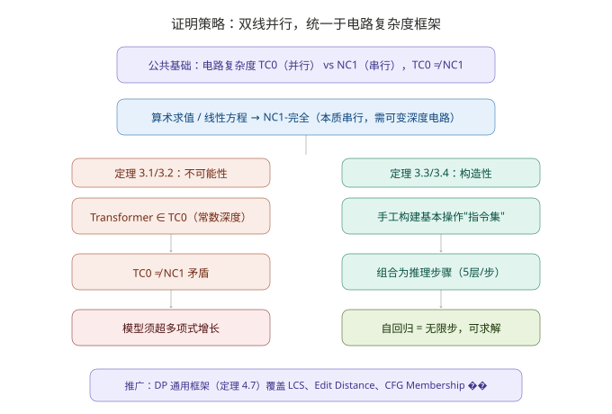
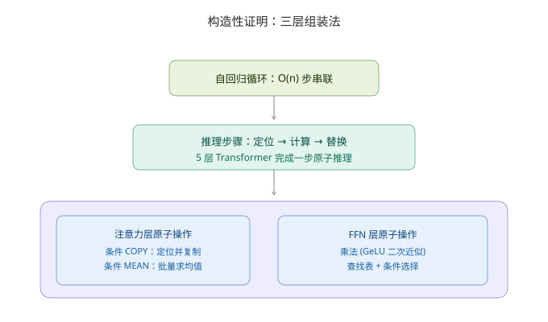
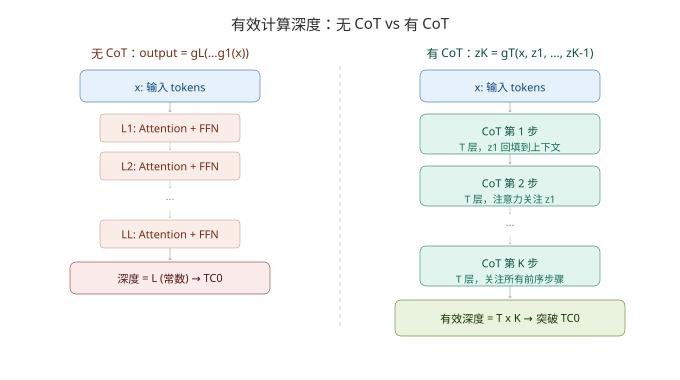

# Transformer+CoT 的图灵完备性：Feng et al. (2023) 深度分析

> **核心发现：CoT 将 Transformer 的有效电路深度从常数 O(L) 拉升为 O(CoT 步数)，从而突破 TC⁰ 能力上限。**
> 调研日期：2026-07-30 | 来源：NeurIPS 2023 论文 (arXiv:2305.15408)

## 一、概览

Chain-of-Thought (CoT) prompting 自 Wei et al. (2022) [4] 提出以来，在算术、推理、决策等任务中显著提升了 LLM 的表现（GSM8K 准确率从 17.9% 升至 58.1%）。然而，已有的解释多停留在经验层面，缺少计算理论层面的严格刻画。CoT 为什么有效——是经验巧合，还是深层计算原理决定的必然？Feng et al. (2023, NeurIPS) [1] 首次给出了严格的理论回答。

论文定位：**用电路复杂度理论，为 CoT 的"表现跃升"提供计算能力上界和下界的双向证明。**

| 指标 | 数值 |
|------|------|
| 论文 | Towards Revealing the Mystery behind Chain of Thought |
| 作者 | 冯顾豪、张博航、顾云天、叶昊天、贺笛、王立威（北京大学） |
| 发表 | NeurIPS 2023 |
| arXiv | 2305.15408 |
| 核心工具 | 电路复杂度理论（TC⁰ / NC¹） |
| 主要结论 | 无 CoT 时 Transformer 表达能力 ⊆ TC⁰，不能直接求解任何 NC¹-完全问题；有 CoT 后自回归循环将有效深度扩展至与推理步数成正比，可求解 P-完全问题 |

> 上图展示论文的双线证明结构。左侧（橙）：不可能性证明——Transformer 的表达能力上限是 TC⁰，而目标问题是 NC¹-完全，在 TC⁰ ≠ NC¹ 的假设下无法直接求解。右侧（绿）：构造性证明——手工搭建一个参数与输入规模无关的 Transformer，利用 CoT 的自回归循环突破深度限制。

## 二、核心框架：电路复杂度与不可能性证明

本节核心：论文放弃"图灵机模拟"的思路，转而用电路复杂度分析 Transformer。Transformer 本身就是固定深度、固定宽度的计算电路——电路复杂度是分析它最自然的工具。

### 2.1 TC⁰ 与 NC¹

两个核心复杂度类：

| 类 | 深度 | 门类型 | 含义 |
|----|------|--------|------|
| **TC⁰** | O(1)，即常数 | 阈值门 AND/OR/NOT+MAJ | "极易并行"的问题 |
| **NC¹** | O(log n)，对数 | AND/OR/NOT + 扇入 2 | "需要一定深度"的问题 |

log-precision Transformer 的表达能力上界已被严格证明为 TC⁰（Merrill & Sabharwal, 2023 [2]）。算术表达式求值、括号匹配、线性方程组求解——这些都是 **NC¹-完全**问题，在广泛接受的 TC⁰ ≠ NC¹ 假设下，**不可能**被常数深度电路求解。

### 2.2 不可能性证明（定理 3.1, 3.2）

证明采用两步归约：

**Step 1**：将固定深度 L 的 log-precision Transformer 模拟为 TC⁰ 电路族。

**Step 2**：将已知的 NC¹-完全问题归约到 Arithmetic(n, p) 和 Equation(m, p)。

结论：如果无 CoT 的 Transformer 能直接求解这些任务，则 TC⁰ = NC¹。在 TC⁰ ≠ NC¹ 被广泛接受的条件下，无 CoT 的 Transformer **必须**以超多项式速度增长规模才能直接求解——这在实践中不可行。

> 常见误解是"这些任务只是需要很多步计算"。论文指出：瓶颈不在计算步数——电路复杂度关注的是**并行深度**。一个需要 n 层串行深度但在第 1 步就能全并行化的问题，深度仍然可以是 O(1)。真正的问题是这些任务的**内在串行性**——中间结果必须按顺序依赖，无法一步算出。

## 三、构造性证明：手工搭建推理机器

本节核心：论文没有止步于"证明你不行"。它向前走了一步——手把手造一个行的 Transformer，参数固定不变，输入长度任意增加都跑得通。

### 3.1 三层构建法

构造遵循"原子操作 → 推理步骤 → 自回归循环"的三层组装逻辑：

> 从底向上：先在 Transformer 的注意力和 FFN 中实现原子操作（条件 COPY、查找表、条件选择）。再将它们组合为单步推理步骤——定位（第 1-2 层）→ 计算（第 3 层）→ 替换（第 4-5 层，即 COPY 未参与部分 + 组装输出）。最后通过自回归循环将其串联为完整求解过程。

### 3.2 基本操作指令集（附录 C 的 8 个引理）

| 组件 | 可实现操作 | 实现技术 |
|------|-----------|----------|
| Softmax Attention | 条件 COPY：找到最后一个满足条件的 token 并复制其值 | Softmax 的选择性聚焦 |
| 多头注意力 | 条件 MEAN：对一组满足条件的 token 求均值 | 多头并行关注不同模式 |
| FFN (GeLU) | 乘法运算 | GeLU 在 [-2,2] 区间的二次近似 |
| FFN (GeLU) | 查找表：存储模 p 有限域的完整真值表 | FFN 的通用函数逼近 |
| FFN (GeLU) | 条件选择：`if c then a else b` | 门控逻辑 |
| 残差连接 | 跨层信息保持 | Skip connection |
| 因果掩码 | 时序一致性约束 | Decoder-only 标准机制 |

### 3.3 算术求值的完整构造（定理 3.3）

以模 p 有限域上的算术表达式求值为例，常数大小 Transformer 的构造参数：

| 参数 | 值 | 含义 |
|------|-----|------|
| 深度 L | 5 | 5 层 Transformer |
| 注意力头数 H | 5 | 每层 5 个头 |
| 隐藏维度 d | 常数 | 与输入长度 n 无关 |
| 参数上界 | O(poly(n)) | 可用 O(log n) 比特精度 |

每步 CoT 推理的 5 层分工：

- **第 1 层**（注意力）：找到最内层括号的位置和待计算的操作数
- **第 2 层**（注意力）：提取运算符和两个操作数的向量表示
- **第 3 层**（FFN）：通过查找表计算运算结果（如 1+2=3）
- **第 4 层**（注意���）：用条件 COPY 复制未参与运算的部分
- **第 5 层**（FFN）：组装��表达式并输出下一个 token

整个求解过程需要 O(n) 步 CoT，因此有效计算深度为 5 × O(n) = O(n)，足以覆盖任何 NC¹ 问题的深度需求。

### 3.4 线性方程求解（定理 3.4）

高斯消元法同样可以在常数大小 Transformer（L=4, H=5）中实现。每步消元需要选主元、归一化、逐行消去——4 层足够完成单步消元逻辑。

### 3.5 推广至动态规划（定理 4.7）

论文的构造方法不仅适用于算术和方程，还扩展到了一个通用的 DP 问题框架。定理 4.7 证明：任何满足以下条件的动态规划问题，都能用恒定大小 Transformer + CoT 求解：

| 条件 | 内容 | 意义 |
|------|------|------|
| 状态空间多项式有界 | 状态总数 ≤ poly(n) | 确保 log-precision 可表示 |
| 常数依赖度 | 每个状态只依赖常数 K 个前序状态和常数 J 个输入元素 | 保证单步转移可实现 |
| 可逼近性 | 转移函数 f、索引函数 g/h、聚合函数 u 可被常数大小感知机逼近 | 确保 FFN 层能编码这些函数 |

这一框架覆盖了 LCS（最长公共子序列）、Edit Distance（编辑距离）、CFG Membership Testing（上下文无关文法成员测试）等实际问题。其中 CFG 成员测试是 **P-完全的**——无 CoT 的 Transformer 无法求解（除非 P = TC⁰），但有 CoT 就能求解。这进一步证明了 CoT 带来的能力提升是从 TC⁰ 到至少 P 的质的飞跃。

## 四、有效深度：CoT 如何改变计算能力

本节核心：论文最重要的理论贡献不是证明"有 CoT 比没有好"，而是精确量化了"好多少"和"为什么好"。

### 4.1 有效深度的形式化

无 CoT 时，Transformer 的输出 = 输入经过 L 层前馈网络的一个函数：

\[
\text{output} = g_L(g_{L-1}(\dots g_1(x)\dots))
\]

这个电路的深度是 **L**（常数），属于 TC⁰。

有 CoT 时，自回归生成了 K 步中间 token：

\[
z_1 = g_T(x),\quad z_2 = g_T(x, z_1),\quad \dots,\quad z_K = g_T(x, z_1, \dots, z_{K-1})
\]

因为注意力在每步都能访问所有前序 token，有效电路深度 = **T × K**。K 可以与输入长度 n 线性增长。

### 4.2 表达能力跃迁

> 左：无 CoT——Transformer 的有效深度恒为 L，能力上限是 TC⁰。右：有 CoT——自回归循环将计算深度拉升为 O(K)，突破了并行计算的能力边界。这一机制与"给图灵机加一条无限纸带"在原理上完全一致。

### 4.3 与 RNN 的关键对比

论文 Section F.2 特别指出：**恒定大小的 RNN 无法用相同 CoT 格式解决这些数学任务**。RNN 的隐藏状态大小固定，读完整个上下文后能保留的信息量受限于隐藏维度 d。而 Transformer 的注意力机制可以在一层内从任意前序位置精确检索信息——这一架构差异意味着 CoT 对 Transformer 的能力提升（从 TC⁰ 到可变深度）对 RNN 不成立，因为 RNN 缺乏跨步长距离的精确检索能力。

## 五、批判性分析

本节核心：论文的理论贡献扎实，但在精度假设、可学性、覆盖范围上存在需要谨慎对待的限定条件。与同期工作的对比进一步明确了其贡献边界。

### 5.1 优势

| 优势 | 具体表现 |
|------|---------|
| 理论框架选择精准 | 电路复杂度比图灵机框架更适合分析固定深度神经网络 |
| 证明路线对称严密 | 不可能性（上界）+ 构造性（下界）形成闭合论证 |
| 构造方法可复现 | 所有参数都给出了具体值，读者可以实际验证 |
| 洞察深刻 | 指出瓶颈是"并行深度"而非"步数"，纠正了常见误解 |
| 推广能力强 | DP 框架覆盖了 LCS、Edit Distance、CFG 等大量实际问题 |

### 5.2 局限与范围限定

| 局限 | 条件限定 | 我的判断 |
|------|---------|---------|
| 数值精度假设 | 结果依赖 log-precision 假设。在实际 float32/bf16 下，GeLU 的乘法近似可能有累积误差 | 理论证明层面合理，工程实现中需要注意精度边界 |
| 无 CoT 的假设过强 | 无 CoT 条件下要求模型"直接输出答案"。实际中即使是 zero-shot，模型也会自发生成中间步骤 | 理论严格性需要这个假设，但实践中几乎不会出现"纯无 CoT"的推理 |
| 有限域的局限 | 算术任务限制在模 p 有限域上，而非实数和无限精度 | 有限域的完备性更强、证明更干净；推广到实数需要更多假设 |
| 不涉及学习动力 | 构造性证明只是"存在"一个能求解的参数配置，不涉及这个配置能否通过梯度下降学到 | 存在性和可学性是两个问题，论文做了"可学性"的实验验证但未给出理论保证 |
| TC⁰ ≠ NC¹ 是猜想 | 整个不可能性论证依赖 TC⁰ ≠ NC¹，这个猜想未被证明 | 这是电路复杂度领域最广泛接受的猜想之一，使用它作为前提是标准做法 |

### 5.3 与同期工作的对比

| 工作 | 核心工具 | 主要结论 | 局限 |
|------|---------|---------|------|
| Feng et al. (2023) [1] | 电路复杂度 (TC⁰/NC¹) | CoT 将有效深度从 O(L) 扩展为 O(K) | 依赖 TC⁰ ≠ NC¹ 猜想 |
| Merrill & Sabharwal (2023) [2] | 电路复杂度 | Transformer 上界 TC⁰ | 未分析 CoT 的影响 |
| Pérez et al. (2019) [3] | 图灵机模拟 | 无限精度下 Transformer 图灵完备 | 未分析精度影响，未给出有效深度的量化 |
| Giannou et al. (2023) [5] | 构造性证明 | Looped Transformer 可模拟通用计算机 | 架构修改而非纯 CoT |

## 六、对 Hermes 的启示

本节核心：论文的理论框架为 LLM Agent 的架构设计和任务能力审计提供了可操作的原则——计算深度不是无限资源，上下文窗口就是推理的"纸带"。

### 6.1 架构设计启示

这份理论分析对 LLM Agent 架构设计有直接指导意义：

**推理步骤的数量控制**：论文量化了计算深度与 CoT 步数间的线性关系。在设计 Hermes 的推理循环时，`max_turns` 的设置直接决定 Agent 的计算能力上限——对于本质串行的问题，步数不够就是算不出，这不是模型"不够聪明"的问题，而是计算深度的硬约束。

**上下文管理即纸带管理**：CoT 的本质是"用生成文本来构造外部纸带"。这意味着上下文窗口的利用策略（何时压缩、何时保留中间状态、何时丢弃）是"纸带长度管理"问题——过长浪费资源，过短截断计算能力。

**注意力机制是推理的读写头**：论文证明注意力可以在单层内实现"定位→检索→复制"，这正是图灵机读写头的能力。因此 Agent 架构中保留 Attention（而非仅靠 RNN/状态机）对于复杂推理是必要的。

### 6.2 验证策略启示

**计算深度审计**：对于需要多步推理的任务，可以根据推理步数反向推算所需的计算深度，验证 Agent 的配置是否足够。例如，对 LCS 问题（O(n²) 状态），CoT 步数至少需要 O(n²)，相应的上下文窗口不能小于这个量级。

**并行 vs 串行任务分类**：论文的 TC⁰/NC¹ 分类提供了一种理论工具来预判任务难度。如果一个任务已被证明是 NC¹-完全的，那它就是"CoT 必须"的任务——不让模型分步推理，就不可能得到正确答案。

## 参考来源

| 序号 | 文献 |
|------|------|
| [1] | Feng, G., Zhang, B., Gu, Y., Ye, H., He, D., & Wang, L. (2023). Towards Revealing the Mystery behind Chain of Thought: A Theoretical Perspective. *NeurIPS 2023*. arXiv:2305.15408 |
| [2] | Merrill, W., & Sabharwal, A. (2023). The Parallelism Tradeoff: Limitations of Log-Precision Transformers. *TACL 2023*. |
| [3] | Pérez, J., Marinković, J., & Barceló, P. (2019). On the Turing Completeness of Modern Neural Network Architectures. *ICLR 2019*. |
| [4] | Wei, J., Wang, X., Schuurmans, D., et al. (2022). Chain-of-Thought Prompting Elicits Reasoning in Large Language Models. *NeurIPS 2022*. |
| [5] | Giannou, A., Rajput, S., Sohn, J. Y., Lee, K., Lee, J. D., & Papailiopoulos, D. (2023). Looped Transformers as Programmable Computers. *ICML 2023*. |
