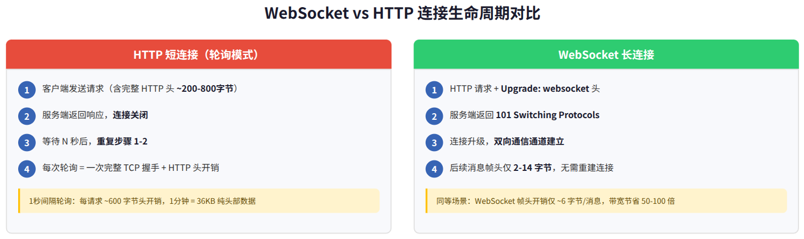
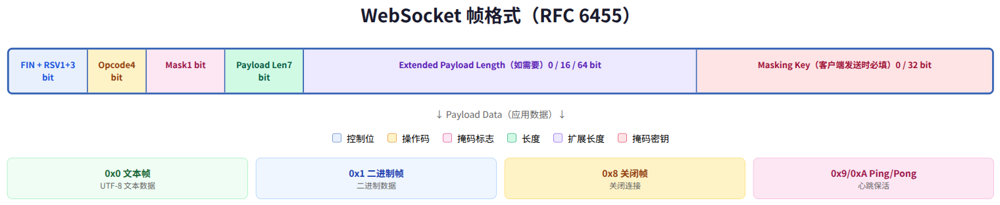
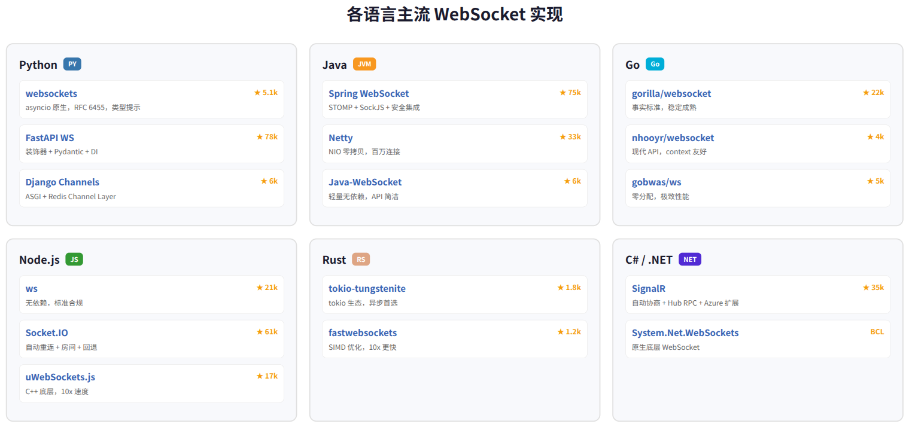
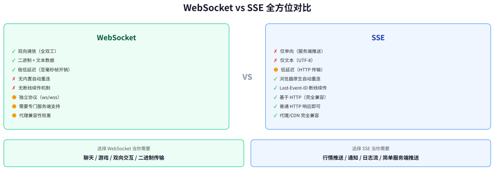
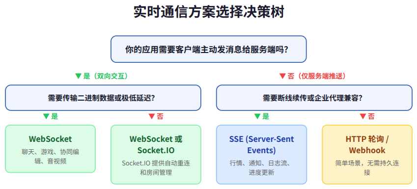
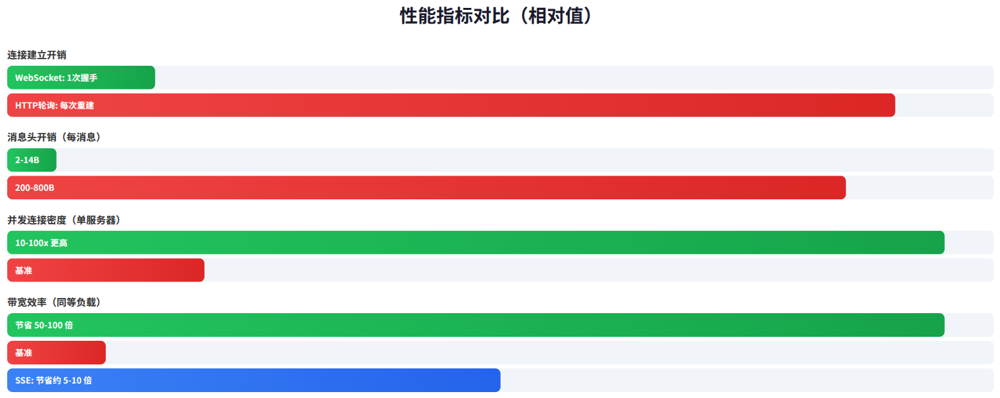

# WebSocket 技术调研：协议原理、各语言实现与 SSE 对比

> WebSocket 是基于 RFC 6455 的全双工通信协议，通过单次 HTTP 握手升级为持久连接，帧头仅 2-14 字节，相比 HTTP 轮询节省 50-100 倍带宽，是实时交互应用的首选方案。

---

## 目录

1. [概述与背景](#1-概述与背景)
2. [协议原理](#2-协议原理)
3. [各语言主流实现](#3-各语言主流实现)
4. [WebSocket vs SSE 对比](#4-websocket-vs-sse-对比)
5. [方案选择指南](#5-方案选择指南)
6. [安全与性能](#6-安全与性能)
7. [总结](#7-总结)

---

## 1. 概述与背景

WebSocket 于 2011 年被 IETF 标准化为 RFC 6455，解决了 HTTP 协议在实时通信场景下的根本缺陷——HTTP 是请求-响应模式，客户端必须主动发起请求，服务端无法主动推送数据。

在 WebSocket 出现之前，开发者使用轮询（Polling）和长轮询（Long Polling）来模拟实时通信，但这些方案存在严重的资源浪费和延迟问题。WebSocket 通过一次 HTTP 握手将连接升级为全双工通道，之后双方可以随时互发消息，无需重复建立连接。

### 设计原则

| 原则 | 含义 |
|------|------|
| 全双工通信 | 客户端和服务端可同时发送数据，无需等待对方 |
| 低开销 | 连接建立后帧头仅 2-14 字节，远小于 HTTP 头 |
| 基于 TCP | 复用 HTTP 端口（80/443），穿透防火墙 |
| 独立协议 | ws:// 和 wss:// 是独立于 HTTP 的协议 |
| 浏览器原生支持 | 所有现代浏览器均内置 WebSocket API |

---

## 2. 协议原理

### 2.1 连接生命周期

WebSocket 连接分为三个阶段：握手、数据传输、关闭。握手阶段使用 HTTP Upgrade 机制，客户端发送带有特殊头的 HTTP 请求，服务端返回 101 状态码后，连接即升级为 WebSocket。

关键握手头字段包括：`Sec-WebSocket-Key`（客户端随机 16 字节 Base64 编码）和 `Sec-WebSocket-Accept`（服务端用 SHA-1 哈希 key + 固定 GUID 后返回）。这个机制防止了缓存代理误解析 WebSocket 流量。

### 2.2 帧格式

每帧最小 2 字节头部，包含以下关键字段：

| 字段 | 位数 | 含义 |
|------|------|------|
| FIN | 1 bit | 是否为消息最后一帧 |
| Opcode | 4 bit | 帧类型（0x0文本/0x1二进制/0x8关闭/0x9 Ping/0xA Pong） |
| Mask | 1 bit | 是否使用掩码（客户端→服务端必须掩码） |
| Payload Length | 7+ bit | 载荷长度（7位/16位/64位扩展） |
| Masking Key | 32 bit | 掩码密钥（仅客户端发送时存在） |

控制帧（关闭/Ping/Pong）的最大载荷为 125 字节。掩码机制是为了防止缓存中毒攻击——中间代理可能被恶意 WebSocket 帧污染缓存。

### 2.3 关闭握手

关闭连接使用状态码协商，常用码包括：1000（正常关闭）、1001（离开）、1002（协议错误）、1009（消息过大）。任一方发送关闭帧后，对方必须回送关闭帧，然后才能断开 TCP 连接。

### 2.4 扩展与子协议

最常用的扩展是 **permessage-deflate**（RFC 7692），使用 DEFLATE 压缩消息，可减少 60-80% 带宽，但每个连接需要约 32KB 内存维护压缩上下文。

子协议通过 `Sec-WebSocket-Protocol` 在握手时协商，常见的有 `graphql-ws`、`stomp`、`wamp.2.json`、`mqtt` 等。

---

## 3. 各语言主流实现

### 3.1 实现概览

### 3.2 详细对比

#### Python 生态

| 框架 | Stars | 特点 | 推荐场景 |
|------|-------|------|----------|
| **websockets** | 5.1k | asyncio 原生，RFC 6455 合规，类型提示 | 轻量服务、快速原型 |
| **FastAPI WebSocket** | 78k (FastAPI) | 装饰器 + Pydantic + 依赖注入 | API + WebSocket 全栈 |
| **Django Channels** | 6k | ASGI + Redis Channel Layer + 广播 | Django 项目加实时功能 |
| **Tornado** | 21k | 独立事件循环，HTTP+WS 一体 | 高并发长连接 |

#### Java 生态

| 框架 | Stars | 特点 | 推荐场景 |
|------|-------|------|----------|
| **Spring WebSocket** | 75k (Spring) | STOMP + SockJS 回退 + 安全集成 | 企业级应用 |
| **Netty** | 33k | NIO 零拷贝，百万连接 | 游戏服务器、高并发 |
| **Java-WebSocket** | 6k | 轻量无依赖，API 简洁 | 小型项目、客户端 |
| **Tyrus** | 200 | JSR 356 参考实现 | 标准 Java EE |

#### Go 生态

| 框架 | Stars | 特点 | 推荐场景 |
|------|-------|------|----------|
| **gorilla/websocket** | 22k | 事实标准，稳定成熟 | 通用场景首选 |
| **nhooyr/websocket** | 4k | 现代 API，context 友好 | 新项目推荐 |
| **gobwas/ws** | 5k | 零分配，极致性能 | 100K+ 并发连接 |

#### Node.js 生态

| 框架 | Stars | 特点 | 推荐场景 |
|------|-------|------|----------|
| **ws** | 21k | 无依赖，标准合规 | Node.js 默认选择 |
| **Socket.IO** | 61k | 自动重连 + 房间 + HTTP 回退 | 快速原型（注意：非原生 WebSocket） |
| **uWebSockets.js** | 17k | C++ 底层，10x 性能 | 极致性能场景 |

#### Rust 生态

| 框架 | Stars | 特点 | 推荐场景 |
|------|-------|------|----------|
| **tokio-tungstenite** | 1.8k | tokio 生态，异步首选 | Rust WebSocket 标准方案 |
| **fastwebsockets** | 1.2k | SIMD 优化，10x 更快 | 大帧处理、极致性能 |

#### C# / .NET 生态

| 框架 | Stars | 特点 | 推荐场景 |
|------|-------|------|----------|
| **SignalR** | 35k (ASP.NET) | 自动协商（WS→SSE→轮询）+ Hub RPC | .NET 标准实时框架 |
| **System.Net.WebSockets** | BCL 内置 | 原生底层，无自动重连 | 轻量自定义场景 |

---

## 4. WebSocket vs SSE 对比

### 4.1 全方位对比

### 4.2 核心差异

| 维度 | WebSocket | SSE |
|------|-----------|-----|
| **通信方向** | 双向（全双工） | 单向（服务端→客户端） |
| **协议** | 独立协议（ws/wss） | 基于 HTTP |
| **数据格式** | 文本 + 二进制 | 仅文本（UTF-8） |
| **自动重连** | 需手动实现 | 浏览器原生支持 |
| **断线续传** | 无内置机制 | Last-Event-ID 自动恢复 |
| **服务端复杂度** | 较高（需专门支持） | 低（普通 HTTP 响应） |
| **代理兼容性** | 可能有问题 | 完全兼容 |
| **HTTP/2 复用** | 独立连接 | 可复用 HTTP/2 连接 |
| **典型延迟** | 亚毫秒 | 低（受 HTTP 影响略高） |

### 4.3 SSE 技术细节

SSE 使用 `text/event-stream` MIME 类型，事件格式为 `field: value\n\n`（双换行终止）。每个事件可包含 `event:`（类型）、`data:`（数据）、`id:`（事件 ID）、`retry:`（重连间隔）字段。以 `:` 开头的行是注释，常用作心跳保活。

浏览器原生 `EventSource` API 提供自动重连，连接丢失后会自动使用 `Last-Event-ID` 头重新连接，实现断线续传。这是 SSE 相比 WebSocket 的独特优势。

---

## 5. 方案选择指南

### 5.1 决策树

### 5.2 典型场景推荐

| 场景 | 推荐方案 | 原因 |
|------|----------|------|
| 即时聊天 | WebSocket | 需要双向高频交互 |
| 在线游戏 | WebSocket | 极低延迟 + 二进制数据 |
| 协同编辑 | WebSocket | 双向实时同步 |
| 股票行情 | SSE | 仅服务端推送，断线续传重要 |
| 实时通知 | SSE | 简单实现，自动重连 |
| 日志流 | SSE | 单向推送，HTTP 兼容 |
| 进度更新 | SSE | 基于 HTTP，穿透代理 |
| AI 流式输出 | SSE | ChatGPT/Claude 均用 SSE 流式返回 |

---

## 6. 安全与性能

### 6.1 安全考量

| 威胁 | 说明 | 防御措施 |
|------|------|----------|
| 跨站劫持 | 恶意网页连接你的 WebSocket 服务 | 验证 Origin 头，白名单控制 |
| CSRF | WebSocket 不受 CORS 限制 | 握手时认证 + 速率限制 |
| 中间人攻击 | ws:// 明文传输 | 使用 wss://（TLS 加密） |
| DoS 攻击 | 无内置速率限制 | 限制每 IP 连接数 + 消息频率 + 载荷大小 |

掩码机制（客户端→服务端必须掩码）是为了防止缓存代理被恶意帧污染，这是 RFC 6455 的强制要求。

### 6.2 性能对比

关键性能数据：

| 指标 | WebSocket | HTTP 轮询 |
|------|-----------|-----------|
| 消息头开销 | 2-14 字节 | 200-800 字节 |
| 带宽效率 | 节省 50-100 倍 | 基准 |
| 并发密度 | 10-100x 更高 | 基准 |
| 连接建立 | 1 次握手 | 每次重建 |

Kaazing 的基准测试显示，同等负载下 WebSocket 仅消耗 HTTP 轮询 1/50 的带宽。Cloudflare 报告其网络承载超过 2000 万并发 WebSocket 连接。

---

## 7. 总结

WebSocket 是实时双向通信的事实标准，适合聊天、游戏、协同编辑等需要低延迟交互的场景。SSE 是服务端单向推送的轻量方案，自带断线重连和断线续传，适合行情推送、通知、AI 流式输出等场景。

选择建议：需要客户端频繁发消息 → WebSocket；仅需服务端推送 → SSE；简单状态查询 → HTTP。两者并非互斥，许多现代应用同时使用 WebSocket（双向交互）和 SSE（单向推送）。

各语言均有成熟的 WebSocket 实现：Python 用 `websockets` 或 FastAPI，Java 用 Spring WebSocket 或 Netty，Go 用 `gorilla/websocket`，Node.js 用 `ws`，Rust 用 `tokio-tungstenite`，C# 用 SignalR。

---

*调研基于 RFC 6455 规范、各语言官方文档及社区基准测试数据。2026-06-17。*
