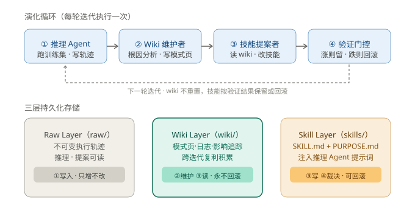
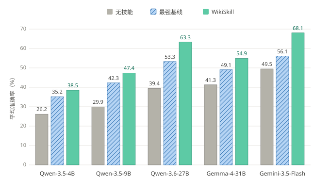
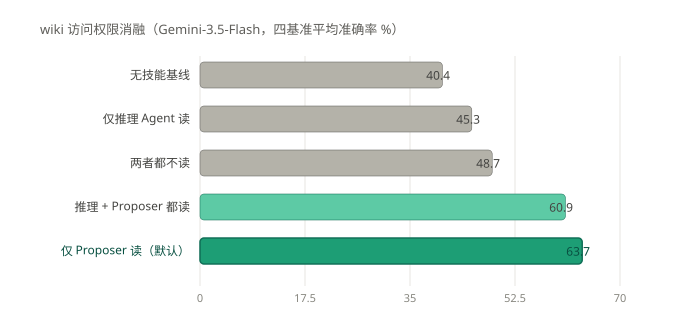

# WikiSkill：把 Agent 经验编译成永不重置的知识库

> **核心发现：在原始经验和可执行技能之间加一层"永不回滚的 wiki"，让知识跨迭代复利积累，是 WikiSkill 全面胜过现有技能进化方法的关键。**
> 调研日期：2026-09-03 | 来源：arXiv:2608.27454（论文全文精读）

## 一、概览

一句话定位：**WikiSkill 是 Google Research 提出的技能进化框架——Agent 一边进化"技能"，一边维护一个只增不减的维基知识库，技能的每次修改都建立在这个知识库之上，而不是每次从零分析。**

先说背景（SCQA）：

- **情境（S）**：Agent skills 把领域专长打包成可复用的模块（SKILL.md + 脚本），LLM agent 通过它复用经验。自动技能进化方法（EvoSkill、Trace2Skill、SkillOpt）已经能从执行轨迹里自动发现技能。
- **冲突（C）**：这些方法学到的"洞见"散落在一次次的优化历史里——上一轮发现了什么失败模式、哪些提案被拒绝过，没有独立的地方存放，下一轮无法系统复用。
- **问题（Q）**：Agent 经验能否像 Karpathy 提出的 LLM Wiki 那样，编译成持续复利的知识，支撑长期技能进化？
- **答案（A）**：WikiSkill 给出肯定回答。它在经验和技能之间加了一层结构化知识（wiki），并用实验证明这层知识贡献了大部分收益。

| 指标 | 数值 |
|------|------|
| 论文 | arXiv:2608.27454v1，2026-08-27 提交 |
| 作者 | Liyan Tang 等，Google Research + Virginia Tech |
| 篇幅 | 28 页（正文 14 页 + 附录含算法伪代码与全部系统 prompt） |
| 评测规模 | 5 个基准 × 5 个模型（Qwen-3.5-4B/9B、Qwen-3.6-27B、Gemma-4-31B、Gemini-3.5-Flash） |
| 对比基线 | Trace2Skill、EvoSkill、SkillOpt、无技能基线 |
| 统计方法 | 每个配置跑 3 次完整进化取平均，配对 bootstrap 显著性检验（1000 次重采样，p<0.05） |

> 上图上半部分是每轮迭代执行的四步循环（推理→维护→提案→门控），下半部分是三层持久化存储。先看中间的 Wiki Layer（绿色加粗框）——它是整个框架的核心：技能可以回滚，wiki 永不回滚，失败提案也会留档，防止下一轮重复踩坑。

## 二、核心机制：三层架构与四步循环

本节结论：WikiSkill 的全部设计都围绕一个原则——**经验先沉淀成知识，知识再驱动技能修改，两者的生命周期解耦。**

### 2.1 三层存储

| 层 | 目录 | 内容 | 生命周期 |
|----|------|------|----------|
| Raw Layer | `raw/` | 完整执行轨迹（推理、工具调用、输出、最终答案） | 只写一次，不可修改 |
| Wiki Layer | `wiki/` | 模式页（patterns/）+ 演化日志（logs.md）+ 技能影响追踪（skill-impact.md） | **永不回滚，跨迭代复利** |
| Skill Layer | `skills/` | SKILL.md（技能正文）+ PURPOSE.md（技能与模式页的溯源关系） | 验证门控裁决，可回滚 |

Wiki Layer 里有三个文件各司其职。`patterns/` 下每个 markdown 记录一种失败模式或成功策略，附证据和 workaround。`logs.md` 按时间顺序记录每轮发现。`skill-impact.md` 由外层循环在每次验证后**程序化追加**，记录提案 diff、验证分数和接受/拒绝结果。这个审计轨迹让提案者能看到"过去试过什么、为什么失败"，不重复提案。

### 2.2 四步循环

每轮迭代（Algorithm 1，论文附录 A）：

1. **推理 Agent**：带着当前技能跑训练集，写轨迹到 raw/。**训练时不许读 wiki**（消融实验证明读了反而有害，见第四节）。
2. **Wiki 维护者**：每轮采样至多 8 条轨迹（至多 5 条失败 + 3 条成功，单条截断至 15000 字符），做根因分析，增量更新模式页。
3. **技能提案者**：以 ReAct 方式自主工作——先读 wiki 索引和影响追踪，再按需用 `read_file` 翻具体模式页和轨迹，最后提交一个**原子提案**（只改一个技能，创建或增量补丁）。
4. **验证门控**：候选技能在验证集上跑分，超过历史最高分才接受，否则回滚技能——但 wiki 的更新保留。

门控规则一句话：`R(T_val) > R_best` 则接受并更新 `R_best`，否则回滚。验证集跑满 100% 时提前终止。

我的判断：这套"技能可回滚、知识不回滚"的非对称设计是全文最有工程价值的决策——它把"探索的代价"限制在技能层（随时能退回来），把"学习的收益"锁定在知识层（永远不丢）。这是"复利"思维在 Agent 记忆系统中的成功应用。

### 2.3 优化器 API 成本

论文附录 D 对比了四个框架每轮迭代的优化器 LLM 调用次数：

| 框架 | 每轮调用量 | 与训练集规模的关系 |
|------|-----------|-------------------|
| Trace2Skill | ≈ N + (1+1/(c-1))·N/B + 1 | O(N)，必须逐条分析轨迹 |
| EvoSkill | 2N/B | 线性 |
| SkillOpt | K_opt·N/B（K_opt≈6-8） | 线性 |
| WikiSkill | (1+T_ReAct)·N/B（T_ReAct≈10-20） | 全批模式下 O(1) |

WikiSkill 用全批量（B=N），每轮只需 1 次 Wiki 维护调用 + 10~20 次提案者 ReAct 调用，与训练集大小无关。代价是单次调用上下文更大；论文承认部分数据集上推理成本更高，但换来了稳定的性能优势。

## 三、实验结果：全面领先，且越大模型受益越多

本节结论：**WikiSkill 在全部 5 个模型上取得五基准平均最高分，且收益随模型规模递增——技能进化与模型缩放互补。**

> 上图每个模型三根柱子：无技能（灰）、最强基线（斜纹蓝，即 Trace2Skill/EvoSkill/SkillOpt 在该模型上的最优者）、WikiSkill（绿）。看趋势：从左到右模型越来越强，绿色柱子领先灰色的幅度越来越大——这正是"技能进化与模型缩放互补"的直观体现。

### 3.1 主结果（五基准平均准确率，%，Table 1）

| 模型 | 无技能 | 最强基线（方法） | WikiSkill | 领先最强基线 |
|------|--------|------------------|-----------|--------------|
| Qwen-3.5-4B | 26.2 | 35.2（SkillOpt） | **38.5** | +3.3 |
| Qwen-3.5-9B | 29.9 | 42.3（EvoSkill） | **47.4** | +5.1 |
| Qwen-3.6-27B | 39.4 | 53.3（EvoSkill） | **63.3** | +10.0 |
| Gemma-4-31B | 41.3 | 49.1（SkillOpt） | **54.9** | +5.8 |
| Gemini-3.5-Flash | 49.5 | 56.1（EvoSkill） | **68.1** | +12.0 |

单点提升幅度大的例子：Gemini-3.5-Flash 在 LiveMath 上从 33.0% 提到 72.6%，在 SpreadSheet 上从 50.5% 提到 76.6%（Table 1）。相比之下，基线方法不稳定：EvoSkill 把 Qwen-9B 的 LiveMath 从 28.2% 拉到 58.1%，却把 Gemma-4-31B 的同基准从 33.9% 拉低到 29.8%。

Qwen 家族内部的收益梯度：+12.3（4B）→ +17.5（9B）→ +23.9（27B）。另一个值得注意的对照：**Qwen-3.5-9B + WikiSkill（47.4%）打赢了 Qwen-3.6-27B 裸奔（39.4%）**——进化出的技能能部分弥补三倍的参数规模差距。

### 3.2 跨模型技能迁移（Table 2）

迁移结果呈现两个模式：

**正迁移，且"别人的技能比自己的更好"。** Qwen-3.6-27B 进化的技能让 Qwen-3.5-9B 在 SpreadSheet 上达到 50.5%（无技能 24.3%，自进化仅 33.6%）；在 ALFWorld 上达到 70.2%（自进化 63.4%）。小模型进化的技能也能帮大模型：Qwen-3.5-4B 的技能把 Gemma-4-31B 的 LiveMath 从 33.9% 提到 73.1%（自进化 56.7%）。

| 目标模型（基准） | 无技能 | 自进化技能 | 用 27B 进化的技能 |
|------------------|--------|-----------|-------------------|
| Qwen-3.5-9B（SpreadSheet） | 24.3 | 33.6 | **50.5** |
| Qwen-3.5-9B（ALFWorld） | 34.7 | 63.4 | **70.2** |
| Gemma-4-31B（LiveMath） | 33.9 | 56.7 | **73.7** |
| Gemini-3.5-Flash（SpreadSheet） | 50.5 | 76.6（自进化） | 63.4（27B 技能） |

**负迁移也会发生。** Qwen-3.5-4B 的技能把 Gemini-3.5-Flash 的 SpreadSheet 从 50.5% 拖到 18.1%。论文的归因：4B 技能里塞满了"单行 Python 命令、字符串转换规则"这类为小模型量身定制的 workaround，反而约束了强模型使用端到端脚本；碎片的诊断流程还浪费了 Gemini 的交互预算。

我的看法：这组结果把"发现技能"和"执行技能"拆成了两种能力——小模型能总结出有效的程序性知识（发现），但执行长指令的能力弱（OfficeQA 上 4B 被自己的多步搜索工作流搞晕，反而退回默认行为）；强模型发现自己擅长什么较难，但执行结构化程序很可靠。跨模型技能库（技能资产池）在工程上是可行的，但需要过滤掉模型特异的 workaround。

## 四、深入分析：wiki 到底贡献了什么

本节结论：**消融实验直接证明持久知识积累是主要收益来源；且知识应该给"提案者"读，不该给"跑任务的推理 Agent"读。**

> 上图五个条形对应五种 wiki 访问配置（Gemini-3.5-Flash，四个基准平均）。关键对比有两组：灰色前三条到绿色"仅 Proposer 读"从 48.7% 跳到 63.7%（wiki 给提案者读值 +15 个点）；而"都读"（60.9%）反而低于"仅 Proposer 读"（63.7%）——给推理 Agent 开 wiki 权限是有害的。

### 4.1 消融实验（Table 3）

| 配置 | LiveMath | SealQA | SpreadSheet | OfficeQA | 平均 |
|------|----------|--------|-------------|----------|------|
| 无技能 | 33.0 | 29.4 | 50.5 | 48.6 | 40.4 |
| 仅推理 Agent 读 wiki | 43.8 | 42.0 | 44.4 | 51.0 | 45.3 |
| 两者都不读（无持久知识） | 51.3 | 38.4 | 49.9 | 55.2 | 48.7 |
| 推理 Agent + Proposer 都读 | 64.8 | 42.8 | 80.2 | 55.6 | 60.9 |
| 仅 Proposer 读（默认） | 72.6 | 44.7 | 76.6 | 60.7 | **63.7** |

两个发现：

- **持久 wiki 值 15 个点**。固定不给推理 Agent 读，只给提案者开 wiki：48.7% → 63.7%。没有跨迭代积累的知识，提案者难以解开复杂的失败模式。
- **推理 Agent 训练时读 wiki 有害**：63.7% → 60.9%，LiveMath 掉了 7.8 个点。一种可能的解读：解题知识直接从 wiki 拿走后，轨迹"太干净"，技能层学不到东西——知识泄漏污染了训练信号。

### 4.2 案例：一次"从失败提案到成功技能"的演化（Figure 3）

ALFWorld（Qwen-3.6-27B）上的完整链条：

1. 迭代 0：维护者发现"拿起-检查-放回"死循环模式（take-examine-move-loop.md）；提案者提出技能 `goal-directed-action`，太抽象，验证分 0.72，**被拒**。提案 diff 留在 skill-impact.md。
2. 迭代 1：提案者读到上次被拒的记录，换思路提出 `break-repetition-loop`，核心规则具体到动作级："**不要把物品放回原处**"。验证分 0.78，**接受**。
3. 迭代 2-4：新的循环变体出现（multi-operation-loop.md），维护者持续追加证据；迭代 4 提案者给技能补上新规则"每个物品每种操作只做一次"，再次接受。

这个案例展示了 wiki 的三重作用：模式页提供证据、影响追踪提供"哪些路走不通"、演化日志提供时间线。失败不是被遗忘，而是变成下一步的约束条件。

### 4.3 技能与 wiki 的产出统计（Table 4）

| 维度 | 数值范围 |
|------|----------|
| 技能平均长度 | Qwen 系 118.9-128.6 行；Gemma-4-31B 45.1 行（最精炼）；Gemini 81.2 行 |
| wiki 模式页 | 每次进化创建 6.3-8.9 个，编辑 7.0-18.4 次 |
| 按基准 | SpreadSheet 产出最长技能（142.5 行）和最多模式页（9.8）；LiveMath 最少（84.6 行 / 4.4 个） |
| 接受的更新分布（附录 Table 5） | 39%-52% 发生在迭代 0-1，但中期（2-4）和后期（5-7）仍持续有更新被接受 |

最后一行说明技能精炼贯穿全程而非一蹴而就——SealQA 上 33% 的接受更新发生在中期、28% 在后期，间接支持"持久知识支撑持续精炼"的假设。

## 五、批判性分析

### 优势

1. **问题定义准**：指出"技能进化的洞见散落在优化历史里"这个被同行忽视的缺口，解法（独立知识层）简单且可验证。
2. **消融设计干净**：wiki 访问权限的 2×2 消融直接定位收益来源，还发现了反直觉的"推理 Agent 读 wiki 有害"。
3. **实验覆盖面够**：5 基准 × 5 模型 × 3 次重复 × 显著性检验，负结果（负迁移）也如实报告。
4. **工程可复现性强**：附录给出完整算法伪代码和三个 Agent 的全套系统 prompt，三层目录结构可直接照搬。

### 不足与风险

1. **技能全量注入，没测检索**（论文自认，Limitations）。所有技能直接塞进系统提示词，回避了技能数量增长后的触发/检索问题——真实场景技能库会长到塞不下。在当前小规模技能集条件下成立，规模化后待验证。
2. **门控太严**（论文自认）。只接受严格提升验证分的提案，中性提案被拒——可能错杀"当轮不涨、下轮有潜力"的铺垫性修改。
3. **wiki 只增不减**（论文自认）。没有自动剪枝机制，长周期运行下模式页和日志会无限膨胀，最终挤爆提案者的上下文窗口。
4. **验证集很小**（Table 6：10-40 条/基准）。门控决策建立在小样本上，虽然用 3 次重复 + bootstrap 缓解，单次接受/拒绝的判定噪声仍可能误导演化方向。
5. **训练/验证/测试的任务分布同源**。技能是在与测试同分布的任务上进化的，跨领域泛化（技能能否迁移到完全不同的任务族）没有评估。

我的判断：前三条不足其实是同一个设计哲学的代价——"只增不减"保证了复利，但也埋下了膨胀的种子。对长周期运行的系统，剪枝机制不是可选项，是必需品；这恰好是外部记忆系统（如带遗忘机制的数据库型记忆）可以补位的地方。

### 同类方法对比

| 维度 | Trace2Skill | EvoSkill | SkillOpt | WikiSkill |
|------|-------------|----------|----------|-----------|
| 知识表示 | 分析记录→分层合并补丁 | 候选程序前沿 | 单一技能文档 | **独立 wiki 层 + 技能层** |
| 轨迹输入 | 全部轨迹逐条分析 | 只喂失败轨迹 | 成功+失败全量 | 采样 8 条（5 失败+3 成功），提案者按需再读 |
| 提案者 | 并行分析师 | 单次调用 | ReflACT 六阶段管线 | ReAct 自主探索（10-20 轮） |
| 失败记忆 | 无 | 扁平反馈历史 | 无 | **skill-impact.md 完整留档** |
| 优化器调用 | O(N) | 2N/B | 6-8·N/B | 全批模式 O(1) |

## 六、对 Hermes 的启示

### 6.1 与 Claude Code 四层记忆架构的映射

正在调研的 Claude Code 记忆体系（CLAUDE.md / Auto Memory / Auto Dream / KAIROS）与 WikiSkill 的三层结构有清晰的对应关系，可作为独立 Java 记忆服务的架构参照：

| WikiSkill 组件 | Claude Code 对应物 | 工程启示 |
|----------------|--------------------|----------|
| patterns/（模式页） | Auto Memory（经验沉淀） | 每条记忆应是"问题+根因+解法"的三段式，而非裸日志 |
| skill-impact.md（影响追踪） | 无直接对应 | **缺口**：记录每次记忆驱动的修改及其效果，防重复踩坑 |
| logs.md（演化日志） | Auto Dream（离线整理） | 定期整理比实时整理更省上下文 |
| 技能全量注入 | CLAUDE.md 注入系统提示词 | 同样面临规模上限，检索/触发是共同命题 |
| 验证门控 + 回滚 | 无 | 记忆系统的修改也可引入"验证后接受"机制 |

### 6.2 对 helloworld 写作技能的直接借鉴

helloworld 的"审查反哺"机制（子代理审查结果写回技能自身）与 skill-impact.md 同构，但可以再进一步：

1. **给审查结果建档**：每次审查发现的问题和修复记录单独成档（而非直接改进技能），下次修改前先读档案，避免反复修同一个问题。
2. **失败提案留档**：被否决的技能改法也记下来——"曾尝试在 SCQA 前加背景综述，效果差"这类负知识同样值钱。
3. **审查者按需读原文**：像提案者用 read_file 按需翻轨迹一样，审查子代理不必吃下全量上下文，给它档案索引让它自己翻。

### 6.3 对 Hermes 自身价值评估

这篇论文对 Hermes 的价值集中在三处：其一，它为"记忆永不回滚 + 失败留档"提供了带消融数据背书的论证（+15 个点），直接支撑 Agent Memory 主线的 Java 服务设计决策；其二，技能跨模型迁移的发现（发现≠执行能力分离）对 CodeBuddy/Kimi K3 多模型架构下的技能资产共享有参考意义；其三，Wiki 维护者的 prompt 设计（根因分析、模式页三段式、索引条目质量规则）是可直接抄作业的工程模板。风险提示：照搬前需解决论文未答的剪枝与检索问题，小验证集条件下的门控噪声也提醒我们在生产环境引入更稳健的接受判据。

## 参考来源

1. Tang, L., Rashtchian, C., Ferng, C.-S., Tomkins, A., Juan, D.-C., & Vu, T. (2026). WikiSkill: Compiling Agent Experience into Persistent Knowledge for Skill Evolution. arXiv:2608.27454. https://arxiv.org/abs/2608.27454
2. Karpathy, A. (2026). LLM Wiki. GitHub Gist. https://gist.github.com/karpathy/442a6bf555914893e9891c11519de94f
3. Alzubi et al. (2026). EvoSkill. arXiv:2603.02766；Ni et al. (2026). Trace2Skill. arXiv:2603.25158；Yang et al. (2026). SkillOpt. arXiv:2605.23904
4. Anthropic (2025). Equipping agents for the real world with agent skills. https://www.anthropic.com/engineering/equipping-agents-for-the-real-world-with-agent-skills

（所有实验数据均引自论文 Table 1-7 与附录 A-E，获取于 2026-09-03。）
