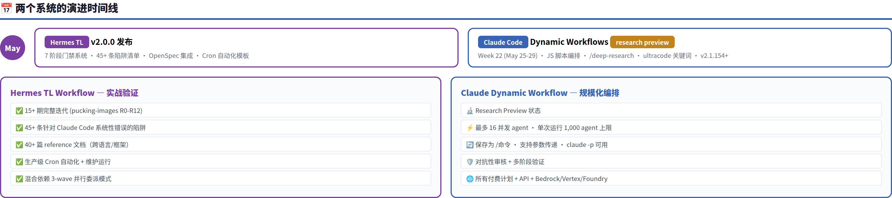
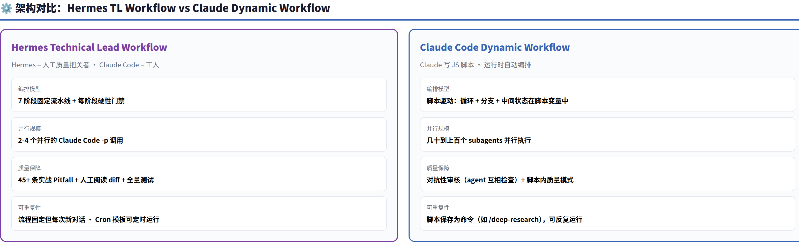
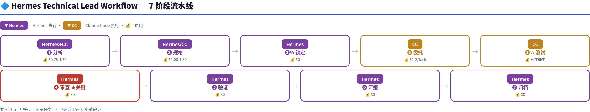
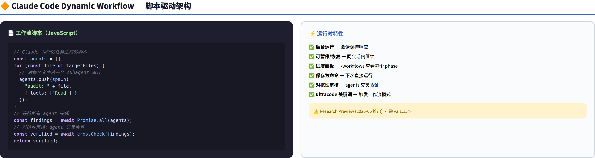
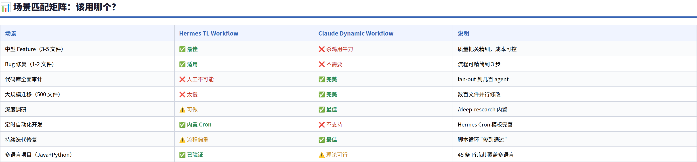
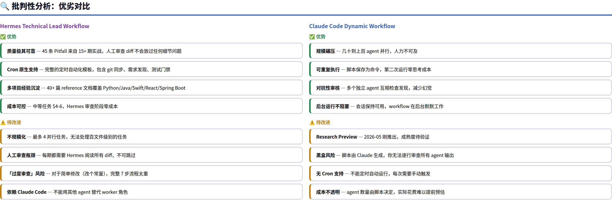
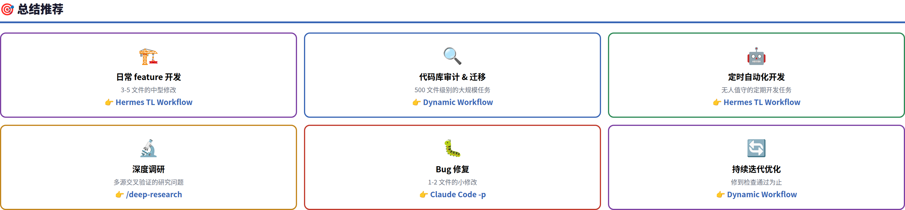

# Hermes Technical Lead Workflow vs Claude Code Dynamic Workflow — 深度对比分析

> **核心发现：两者是互补关系而非竞争关系。Hermes TL Workflow 用"人工审查"保证质量，适合 1-4 任务的精准开发；Claude Dynamic Workflow 用"脚本编排"实现规模化，适合几百 agent 的批量任务。但 Hermes 的 45+ 条实战陷阱库是真正的护城河——这些不是通用知识，是从 12 轮完整迭代、数十个真实项目中提炼的特定错误模式。**

---

## 目录

1. [背景](#1-背景)
2. [架构对比](#2-架构对比)
3. [Hermes TL Workflow 深度解析](#3-hermes-tl-workflow-深度解析)
4. [Claude Dynamic Workflow 深度解析](#4-claude-dynamic-workflow-深度解析)
5. [场景匹配矩阵](#5-场景匹配矩阵)
6. [批判性分析](#6-批判性分析)
7. [总结与建议](#7-总结与建议)

---

## 1. 背景

### Hermes Technical Lead Workflow

由 Hermes Agent 团队开发（当前 v2.0.0），将 Hermes 定位为"技术主管"，在 7 个阶段中逐阶段把关。使用 Claude Code 作为唯一的 worker 实现。已完成 **15+ 期实战验证**（pucking-images 项目 R1-R12），积累了 45+ 条针对 Claude Code 系统性错误的陷阱清单。

### Claude Code Dynamic Workflow

Anthropic 在 **2026 年 5 月（Week 22）** 作为 research preview 推出（需 v2.1.154+）。Claude 为你写一个 JavaScript 编排脚本，脚本自己管理数十到数百个子 agent。内置 `/deep-research` 等捆绑工作流。支持 `/effort ultracode` 模式让 Claude 自动决定何时使用工作流。

| 维度 | Hermes TL Workflow | Claude Dynamic Workflow |
|------|-------------------|------------------------|
| 推出时间 | 2026-05 | 2026-05 (W22) |
| 成熟度 | 15+ 实战迭代 | Research Preview |
| 用户群 | Hermes 用户 | Claude Code Pro/Max/API 用户 |
| 模型依赖 | DeepSeek/GLM/Anthropic（通过 CC） | Anthropic Claude（原生） |

---

## 2. 架构对比

两者的根本区别在于**谁执掌"计划"**。

### Hermes TL Workflow：人工把关模式

- **编排者是 Hermes**（AI agent 作为质量门禁）
- 7 个固定阶段，每个阶段有硬性门禁
- Claude Code 只是 `claude -p` 模式的工人
- 质量来自**人工阅读 diff + 45 条陷阱清单**

### Claude Dynamic Workflow：脚本编排模式

- **编排者是 JavaScript 脚本**（Claude 自动生成）
- 脚本持有循环、分支、中间状态
- 数十到数百个子 agent 在后台并行
- 质量来自**对抗性审核（agent 互相检查）+ 交叉验证**

这个架构差异决定了它们的适用场景完全不同。

---

## 3. Hermes TL Workflow 深度解析

### 门禁系统

| 阶段 | 门禁检查 | 失败处理 |
|------|----------|----------|
| ❶ 分析 | 需求明确，技术方案可行 | 返回探索 |
| ❷ 规格 | OpenSpec 四件套完整，任务可执行 | 补充规格 |
| ❸ 委托 | 实现完成 | 修复或 revert |
| ❸½ 测试 | **所有测试通过** | 修复后重测 |
| ❹ 审查 | 代码质量可接受 | 修复→返回❸ |
| ❺ 验证 | 构建成功，测试全绿 | 修复或 revert |

**❹ 审查阶段是最关键的**——这 45 条陷阱覆盖了 Claude Code 的几乎所有系统性错误模式：

**代码生成陷阱**：未使用的 import/hook、导入但不渲染的 React 组件、错误的 import 风格（绝对 vs 相对）、文件格式不一致（缺少扩展名）、多阶段分数重复应用

**架构陷阱**：Clean Architecture 分层违规、异常类位置错误、端口接口方法缺少适配器实现、基础设施构建但未接入调用方、共享常量在端口接口上（而非 infra 实现类上）

**测试与运维陷阱**：测试 schema 与源 schema 不同步、Lambda effectively-final 违规、Git stash pop 冲突语义反转、Cron 任务文件分支引用过时、venv 未激活导致零测试误报

### 成本结构

| 复杂度 | 子任务数 | 典型费用 | 案例 |
|--------|----------|----------|------|
| 简单 | 1 | $2-3 | 修复流式文本闭包 bug：$0.35 |
| 中等 | 2-3 | $4-6 | SQLite/FTS 索引：$5.96 |
| 复杂 | 4+ | $6-10 | 多模块 billing 系统集成 |

Hermes 审查阶段零成本，这是天然的成本优势。

### Cron 自动化

内置完整的定时开发模板：git sync → 需求发现 → 需求选择 → 执行开发 → 状态更新 → 全面测试 → git push。支持"无待处理需求"时的静默维护运行。

### Hermes 的并行与优化能力

Hermes TL Workflow 不仅逐阶段把关，还内置了多种效率优化：

- **混合依赖 3-wave 委派**：独立任务先并行 → 完成后 → 依赖任务串行。最大化并行度的同时保证依赖正确
- **delegate_task 子代理**：对于编译修复、安全审计等轻量任务，使用 Hermes 原生子代理（非 Claude Code），零额外成本
- **Hermes 直接写 OpenSpec**：当探索阶段足够深入时，Hermes 跳过 Claude Code 的 propose 阶段，直接手写规格文档，节省 ~$1.00
- **手动修复 → 重新委派**：当 Claude Code 超时但 `git diff` 显示进度时，Hermes 手动修复机械性编译错误，再委派剩余业务逻辑

---

## 4. Claude Dynamic Workflow 深度解析

### 与 Claude Code 其他功能的定位

| | Subagents | Skills | Agent Teams | **Workflows** |
|---|---|---|---|---|
| **本质** | Claude 生成的工人 | Claude 遵循的指令 | Leader agent 监督 peers | **运行时执行的脚本** |
| **谁决定下一步** | Claude 逐轮决定 | Claude 按提示词 | Leader agent 逐轮 | **脚本本身** |
| **中间结果** | Claude 上下文窗口 | Claude 上下文窗口 | 共享任务列表 | **脚本变量** |
| **可重复性** | 工人定义 | 指令 | 团队定义 | **编排本身** |
| **规模** | 每轮几个委托 | 同 subagents | 少量长期 peers | **数十到数百 agent** |
| **中断** | 重启当前轮 | 重启当前轮 | 队友继续运行 | **同会话内可恢复** |

### 核心工作流模式

工作流脚本由 Claude 自动生成。脚本保存在 `~/.claude/workflows/` 下，可反复运行。支持 6 种典型模式：

| 模式 | 触发方式 | 用途 |
|------|----------|------|
| 审计全部文件 | `ultracode: audit every API endpoint...` | 对每个文件运行相同的检查 |
| 修复直到通过 | `ultracode: keep fixing until...` | 循环迭代直到条件满足 |
| 批量迁移 | `ultracode: migrate all fetch calls...` | 数百文件并行修改（支持 `/batch` 拆 5-30 worktree） |
| 综合审查 | `ultracode: review every changed file...` | 每个文件独立审查，汇总一份报告 |
| 深度调研 | `/deep-research <question>` | 内置捆绑工作流，多源交叉验证研究 |
| 问题发现 | `ultracode: find issues until the list stops growing` | 持续扫描直到没有新发现 |

工作流脚本保存在 `.claude/workflows/`（项目级）或 `~/.claude/workflows/`（用户级），自动变为 `/` 斜杠命令补全。保存的工作流支持 `args` 输入参数传递。

### 运行时特性与限制

- **后台运行**：主会话保持响应
- **进度面板**：`/workflows` 查看每个 phase 的 agent 数、token 数和耗时
- **可手动暂停/恢复**：按 `p` 暂停，同会话内重新运行 `/workflows` 继续（退出 Claude Code 后下次启动会从头开始）
- **查看详情**：钻入每个 phase 查看 agent 的提示词、工具调用和结果
- **对抗性审核**：多个独立 agent 互相验证发现，降低幻觉率
- **并发限制**：最多 **16 并发 agent**，单次运行最多 **1,000 agent 总量**
- **运行范围**：交互模式、`claude -p` 非交互模式、Agent SDK 均可使用
- **组织管理**：管理员可通过 managed settings 为整个组织关闭 workflows

---

## 5. 场景匹配矩阵

简明的选择指南：

| 你的需求 | 推荐方案 |
|----------|----------|
| 开发一个 feature（3-5 文件） | **Hermes TL Workflow** |
| 修复一个 bug（1-2 文件） | **Claude Code -p** 即可 |
| 审计代码库所有路由的安全 | **Dynamic Workflow** |
| 迁移 500 个文件的 API 调用 | **Dynamic Workflow** |
| 无人值守定时开发 | **Hermes TL Workflow (Cron)** |
| 深度调研多源问题 | **`/deep-research`** |
| 修 bug 修到测试全部通过 | **Dynamic Workflow** |
| 多语言项目（Java+Python+React） | **Hermes TL Workflow** |

---

## 6. 批判性分析

### Hermes TL Workflow 的「护城河」

我认为 Hermes TL Workflow 最被低估的价值是 **45+ 条陷阱清单**。这些不是泛泛的"写好代码"建议，而是从真实的 Claude Code 输出中抓到的 **具体、可复现的错误模式**。例如：

- "Claude Code 导入了一个 React 组件但从未在 JSX 中渲染"——这个问题在代码编译、lint、测试全过的前提下依然存在，只有人工审查才能发现
- "Git stash pop 冲突时 `--theirs` 和 `--ours` 语义反转"——这不是 Claude Code 的问题，是 Git 的设计陷阱
- "Claude Code 可能自创 git worktree，导致变更搁浅在隔离目录"——主工作区没有任何变更，但 worktree 里有完整实现

这些知识无法从官方文档中学到，是金钱和时间换来的。Dynamic Workflow 可以做 100 倍的规模，但它没有这份"血泪清单"。此外，**Hermes 审查阶段确实零成本**——Explore 和 Propose 阶段有费用，但代码审查本身不需要调用 Claude Code。

### Dynamic Workflow 的「临界点」

动态工作流真正的杀器不是并行数量，而是**对抗性审核**。让两个独立 agent 检查同一个结论，这在传统开发流程中相当于两个 senior engineer 互相 code review——但人力成本翻倍，而 workflow 几乎是零边际成本。

当一个任务需要"找遍 500 个文件看有没有漏掉 auth check"时，人工不可能做到，Hermes 也不行。这就是 Dynamic Workflow 的临界点——它解决的是**人力不可为**的问题。

### 一个重要的警告

Dynamic Workflow 是 **research preview**。它生成的工作流脚本不完全受你控制——你不知道它到底派了多少 agent、每个 agent 花了多少 token、中间有没有幻觉被"交叉验证"漏掉。相比之下，Hermes 读的是原始 diff，没有中间层。

**我的建议**：对于决定上线到 production 的关键变更，走 Hermes TL Workflow 流程；对于代码库级别的扫描、审计、迁移，用 Dynamic Workflow——但用完之后，用 Hermes 审查关键变更。

---

## 7. 总结与建议

| 你的身份 | 推荐策略 |
|----------|----------|
| **独立开发者 / 小团队** | Hermes TL Workflow 作为日常主力，Dynamic Workflow 用于大规模一次性任务 |
| **中型团队（5-20 人）** | Hermes TL Workflow 做 feature 开发 + QA，Dynamic Workflow 做 CI/CD 中的批量检查 |
| **大团队 / 平台团队** | Dynamic Workflow 做代码库级别的质量门禁，Hermes TL Workflow 做核心模块开发 |

一个类比：Hermes 模式像**高级定制裁缝**——每次做一件衣服，量体、剪裁、试穿、修改，每件都是精品。Dynamic Workflow 像**服装工厂**——一条流水线同时做 100 件，速度快但残次率也高。

**最终判断**：在 AI 能稳定产出"第一次就对的代码"之前，Hermes TL Workflow 的"人工级别质量门禁"不是可选项，是必需品。但 Dynamic Workflow 代表了未来方向——当脚本编写和对抗性审核技术成熟后，规模化质量保障才是终局。

---

*基于 Hermes TL Workflow v2.0.0 SKILL.md 全文 + 40+ 篇 reference 文档（含 pitfall-details.md 59 条陷阱） + Claude Code 官方 Dynamic Workflows 文档 (code.claude.com/docs/en/workflows) + Agents 总览 (code.claude.com/docs/en/agents) + Week 22 Changelog + 子代理双重审查修正。*
